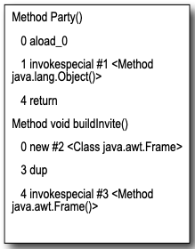
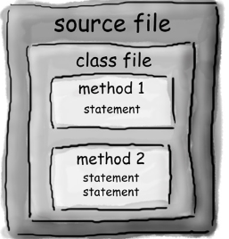
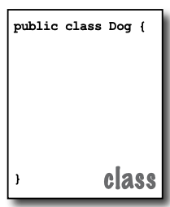
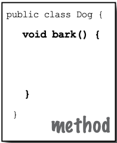
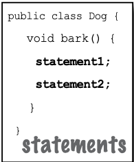
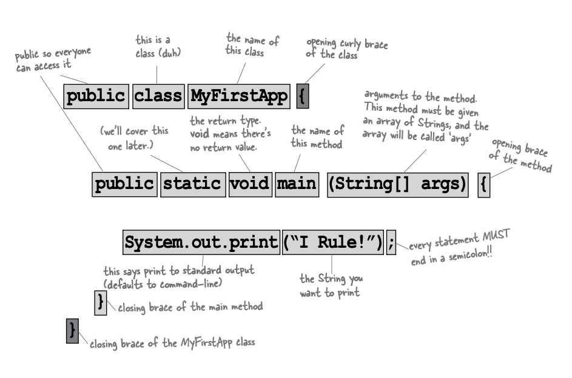

# A Quick Dip

Bir source code file yazacak, onu javac compiler'i kullanarak derleyecek ve ardından derlenmiş bytecode'u bir Java
sanal makinesinde çalıştıracaksınız.

1 - SOURCE

```
public class Party {
    public void buildInvite(){
        Frame frame = new Frame();
        Label label = new Label("Party at tims");
        Button button = new Button("You bet");
        Button cancel = new Button("Shoot me");
        Panel panel = new Panel();
        panel.add(label);
    }
}
```

2 - COMPILER

```
javac Party.java
```

Parti.java dosyasını javac (derleyici uygulaması) çalıştırarak derleyin. Hata yoksa, Party.class adında ikinci bir belge
elde edersiniz. Derleyici tarafından oluşturulan Party.class dosyası, bytecodelardan oluşur.

3 - Output (Code) Compiled Code : Party.class



4 - Virtual Machines

Programı Party.class dosyasıyla Java Sanal Makinesi (JVM) başlatarak çalıştırın. JVM, bytecode'ı altta yatan platformun
anlayabileceği bir formata çevirir ve programınızı çalıştırır.

### Code structure in java



Bir kaynak kodu dosyası (.java uzantılı) bir sınıf tanımını içerir. Sınıf, programınızın bir parçasını temsil eder,
ancak çok küçük bir uygulama için sadece tek bir sınıf gerekebilir. Sınıf, bir çift süslü parantez içine
yerleştirilmelidir.



* Bir sınıfı bir source file'a yerleştirin.
* Metodları bir sınıfa yerleştirin.
* Statements'ları bir metodun içine yerleştirin.

Bir sınıfın bir veya daha fazla methodu bulunur. Dog sınıfında, bark metodunda Köpeğin nasıl havlaması gerektiği için
talimatlar yer alır. Metodlarınız bir sınıfın içinde (diğer bir deyişle, sınıfın süslü parantezleri içinde)
tanımlanmalıdır.



Bir metodun içine, o metodun nasıl gerçekleştirileceğine dair talimatlarınızı yazın. Metod kodu temel olarak bir dizi
statements'dan oluşur ve şu an için bir metodun bir function veya procedure gibi düşünülebileceğini düşünebilirsiniz.



### Anatomy of class

JVM çalışmaya başladığında, komut satırında belirttiğiniz sınıfı arar. Ardından tam olarak aşağıdaki gibi görünen özel
olarak yazılmış bir metodu aramaya başlar:

```
public static void main(String[] args) {
        
    }
```

Sonra, JVM main metodunun süslü parantezleri { } arasındaki her şeyi çalıştırır. Her Java uygulamasının en az bir sınıfa
ve en az bir main metoda (her sınıf için ayrı bir main değil, sadece uygulama başına bir main) sahip olması
gerekmektedir.



### Writing a class with a main

Java'da, her şey bir sınıfta yer alır. Kaynak kod dosyanızı (.java uzantılı) yazacak, ardından onu yeni bir sınıf
dosyasına (.class uzantılı) derleyeceksiniz. Programınızı çalıştırdığınızda, aslında bir sınıfı çalıştırıyorsunuz.
Bir programı çalıştırmak, Java Sanal Makinesi'ne (JVM) "MyFirstApp sınıfını yükle ve ardından main() metodunu
çalıştırmaya başla. main metodundaki tüm kod tamamlanana kadar devam et" demektir.

Ikinci bölümde sınıf konusuna daha derinlemesine giriyoruz, ancak şu an için düşünmeniz gereken tek şey, Java kodunu
nasıl yazacağınızı düşünmek, böylece çalışır hale gelecektir. Ve hepsi main() metoduyla başlar.

main() metodu, programınızın çalışmaya başladığı yerdir.

Programınız ne kadar büyük olursa olsun (başka bir deyişle, programınızın kaç sınıf kullandığına bakılmaksızın), topluca
hareket etmesi için bir main() metodu olmalıdır.

```
public class MyFirstApp {
    public static void main(String[] args) {
        System.out.println("I rule!");
        System.out.println("The World");
    }
}
```

Kodu yazdıktan sonra CLI'da ```javac MyFirstApp.java``` yazmamız gerekiyor.

Ardından ```java MyFirstApp``` ile program çalıştırılır ve console'a "I rule!" ve "The World" yazdırılır

### What can you say in the main method?

Main metodu (veya herhangi bir metot) içerisindeyken, eğlence başlar. Bilgisayara bir şeyler yapması için söylediğiniz
diğer programlama dillerindeki normal ifadeleri kullanabilirsiniz.

1 - do something;

STATEMENTS :

```
    int x = 3;
    String name = "Dirk";
    x = x * 17;
    System.out.println("x is " + x);
    double d = Math.random();
```

2 - do something again and again

LOOPS :

```
    while (x > 12) {
        x = x - 1;
        System.out.println(x);
    }

    for (int i = 0; i < 10; i = i + 1) {
        System.out.println("i is now : " + i);
    }
```

3 - do something under this condition

BRANCHING :

```
    if (x == 10){
        System.out.println("x must be 10");
    } else {
        System.out.println("x isn't 10");
    }

    if ((x<3) & (name.equals("Dirk"))){
        System.out.println("Gently");
    }
    System.out.println("this line runs no matter what");
```

Java'da üç standart döngü yapısı bulunur: while, do-while ve for. Döngüler hakkında daha fazla bilgiyi ilerleyen
bölümlerde alacaksınız

Şimdilik while döngüsünü ele alalım. Sözdizimi (ve mantığı) o kadar basittir ki muhtemelen şu anda uyuyorsunuzdur.
Belirli bir koşul doğru olduğu sürece, döngü bloğu içindeki her şeyi yaparsınız. Döngü bloğu süslü parantezlerle
sınırlanır, bu yüzden tekrar etmek istediğiniz her şey o bloğun içinde olmalıdır. Bir döngünün anahtarı koşullu testtir.
Java'da, koşullu bir test, boolean değeri sonuçlandıran bir ifadedir, yani ya true ya da false olan bir şey.

Örneğin, "Dondurma kovada olduğu sürece kazmaya devam et" gibi bir şey söylerseniz, açık bir boolean testiniz vardır. Ya
kovada dondurma vardır ya da yoktur. Ancak "Bob kazmaya devam ettikçe" gibi bir şey söylerseniz, gerçek bir testiniz
yoktur. Bunu çalıştırmak için "Bob horladığı sürece..." veya "Bob üzerinde çizgili giysi yokken..." gibi bir şeye
dönüştürmeniz gerekecektir.

Basit bir boolean testi yapmak için bir değişkenin değerini kontrol ederek ve aşağıdaki karşılaştırma operatörlerini
kullanarak yapabilirsiniz:

```
< (less than)
> (greater than)
== (equality)
```

Dikkat edilmesi gereken nokta, atama operatörü (=) ile eşitlik operatörü (==) arasındaki farktır. Birçok programcı, ==
istedikleri yerde yanlışlıkla = yazabilir.

```
    int x = 4; // x'e 4 degerini ata

    while (x > 3) {
        // döngüdeki kod, döngüde belirtilen koşulun doğru olması nedeniyle çalışacaktır
        // x 3'ten büyüktür
        x = x - 1;
    }

    int z = 27;
    while(z == 17){
        // loop code'u calismaz cunku z degiskeni 17'ye esit degildir
        System.out.println(z);
    }
```

Java, bir nesne tabanlı (OO) dildir. Eskiden olduğu gibi buharla çalışan derleyicilerin olduğu ve yığınla prosedür
içeren tek bir büyük kaynak dosyası yazdığınız günlerden farklıdır. İkinci bölümde bir sınıfın bir nesne için bir taslak
olduğunu ve Java'da neredeyse her şeyin bir nesne olduğunu öğreneceksiniz.

Bir Java programı birçok sınıfı (hatta yüzlercesini) kullanabilir, ancak yalnızca başlatma işlemini gerçekleştiren main
metodu olan bir sınıfınız olabilir. Bununla birlikte, diğer sınıfları test etmek veya ilgili sınıflarla ilgili belirli
görevleri gerçekleştirmek için test sınıfları oluşturabilirsiniz

```
public static void main(String[] args) {
    int x = 1;
    System.out.println("Before the loop x value : " + x);

    while (x < 10) {
        System.out.println("In the loop");
        System.out.println("Value of x is " + x);
        x = x + 1;
    }
}
```

* ### Bullet Points

* Statements'lar noktalı virgül (;) ile biter.
* Kod blokları, bir çift süslü parantez { } ile tanımlanır.
* Bir name ve bir type ile int bir değişken tanımlayın: int x;
* Atama operatörü, bir eşittir işareti (=) ile gösterilir.
* Eşitlik operatörü, iki eşittir işareti (==) kullanır.
* While döngüsü, koşullu test doğru olduğu sürece süslü parantezlerle tanımlanan bloğun içindeki her şeyi çalıştırır.
* Eğer koşullu test yanlış ise, while döngüsü bloğu çalıştırılmaz ve yürütme doğrudan döngü bloğunun hemen altındaki
  kodlara geçer.
* Parantezlerin içine bir boolean testi yerleştirin: ```while (x==4) {}```

### Conditional branching

Java'da, bir "if" testi temel olarak bir "while" döngüsündeki boolean testiyle aynıdır - tek fark, "hala bira varken..."
demek yerine "eğer hala bira varsa..." diyeceksiniz.

```
public static void main(String[] args) {
    int x = 3;
    if (x == 3){
        System.out.println("x must be 3");
    }
    System.out.println("This runs no matter what");
}
```

Yukarıdaki kod, koşulun (x'in 3'e eşit olması) doğru olması durumunda sadece "x must be 3" yazan satırı yürütür. Ancak
doğru veya yanlış olmasına bakılmaksızın, "This runs no matter what" yazan satır çalışacaktır. Bu nedenle, x'in değerine
bağlı olarak bir veya iki ifade yazdırılır.

Ancak, koşula bir "else" ekleyebiliriz, böylece "Eğer hala bira varsa, kodlamaya devam et, aksi takdirde (diğer durumda)
daha fazla bira al ve ardından devam et..." gibi bir şey söyleyebiliriz.

```
public static void main(String[] args) {
    int x = 2;
    if (x == 3){
        System.out.println("x must be 3");
    } else {
        System.out.println("x is not 3");
    }
}
```

Çıktı olarak aşağıdaki çıktı üretilir

```
x is NOT3
This runs no matter what
```

### Coding a Serious Business Application

İyi, yeni Java becerilerinizi pratik bir şekilde kullanmanın zamanı geldi. Bir main() metodu, bir tamsayı ve bir String
değişkeni, bir while döngüsü ve bir if testi içeren bir sınıfa ihtiyacımız var. Biraz daha cilalama yaparsanız,
işletmenizin arka uçunu hiç zaman kaybetmeden oluşturabilirsiniz. Ancak bu sayfadaki kodlara bakmadan önce, klasik çocuk
favorisi olan "99 şişe bira" şarkısını nasıl kodlayacağınızı bir an düşünün.

```
public class BeerSong {
    public static void main(String[] args) {
        int beerNum = 99;
        String word = "bottles";

        while(beerNum > 0){
            String plural = "bottle";
            if (beerNum == 1) {
                word = plural;
            }
            System.out.println(beerNum + " " + word + " of beer on the wall");
            beerNum = beerNum - 1;
            if (beerNum < 1) {
                System.out.println("no more bottles of beer on the wall");
            }
        }
    }
}
```

### Monday morning at Bob’s

Bob'un alarm saati her hafta içi olduğu gibi Pazartesi sabahı saat 8:30'da çalar. Ancak Bob'un vahşi bir hafta sonu
geçirmesi nedeniyle, SNOOZE düğmesine uzanır. Ve işte hareket başlar ve Java destekli cihazlar hayata geçer.
İlk olarak, alarm saati kahve makinesine bir mesaj gönderir: "Hey, bu geek yine uyuyor, kahveyi 12 dakika geciktir.
Kahve makinesi MotorolaTM tost makinesine bir mesaj gönderir: "Tostu beklet, Bob uykuda." Alarm saati daha sonra Bob'un
Nokia NavigatorTM cep telefonuna bir mesaj gönderir: "Bob'un 9'a kadar olan aramasını yapve biraz geç kalıyoruz de."
Son olarak, alarm saati Sam'in (Sam köpektir) kablosuz tasmasına, "Gazeteyi getir, ama yürüyüş bekleme" anlamına gelen
çok tanıdık sinyali gönderir. Birkaç dakika sonra alarm tekrar çalar. Ve yine Bob SNOOZE düğmesine basar ve cihazlar
konuşmaya başlar. Sonunda, alarm üçüncü kez çalar. Ancak Bob snooze düğmesine uzanırken, saat Sam'in tasmasına "atla ve
havla" sinyalini gönderir. Tamamen şaşırmış bir şekilde uyanan Bob, Java becerilerinin ve biraz Radio ShackTM
ziyaretinin günlük rutinlerini geliştirdiği için minnettardır.

### Phrase-O-Matic

```
public static void main(String[] args) {
    String[] wordListOne = {"24/7", "multi Tier", "30,000 foot", "B-to-B", "win-win", "frond-end", "web-based"};
    String[] wordListTwo = {"oriented", "outside-the-box", "centric", "leveraged", "aligned", "accelerated"};
    String[] wordListThree = {"process", "solution", "appendix", "mission", "oop", "java", "python", "c#", "ide"};

    // her bir listede kac eleman var?
    int listOne = wordListOne.length;
    int listTwo = wordListTwo.length;
    int listThree = wordListThree.length;

    // 3 adet random number generate et
    int rand1 = (int) (Math.random() * listOne);
    int rand2 = (int) (Math.random() * listTwo);
    int rand3 = (int) (Math.random() * listThree);

    // phrase'i build et
    String phrase = wordListOne[rand1] + " " + wordListTwo[rand2] + " " + wordListThree[rand3];

    // phrase'i yazdır
    System.out.println("What we need is a " + phrase);
}
```

Kısaca, program üç kelime listesi oluşturur, ardından her bir listeden rastgele bir kelime seçer ve sonucu yazdırır.

1 - İlk adım, tüm kelimeleri içerecek String array'i oluşturmaktır. Bir dizi bildirmek ve oluşturmak kolaydır; işte
küçük bir örnek: ```String[] pets = {"Fido", "Zeus", "Bin"};```

Her kelime tırnak içinde (iyi bir String olması gerektiği gibi) ve virgüllerle ayrılmış olarak belirtilir.

2 - Her üç liste (String) için (arrays) rastgele bir kelime seçme hedefimiz olduğu için, her listedeki kelime sayısını
bilmemiz gerekiyor. Bir listede 14 kelime varsa, o zaman 0 ile 13 arasında rastgele bir sayıya ihtiyacımız var (Java
dizileri sıfır tabanlı olduğu için ilk kelime 0 pozisyonunda, ikinci kelime 1 pozisyonunda ve son kelime 14 öğeli bir
dizide 13 pozisyonunda bulunur). Oldukça kolaylıkla, bir Java dizisi size uzunluğunu söylemekte mutludur. Sadece sormak
gerekmektedir. Pets dizisinde bunu yapmak için şu şekilde deriz:

```int x = pets.length;```

ve x şimdi 3 değerini tutacaktır

3 - Üç adet rastgele sayıya ihtiyacımız var. Java, bir dizi matematik methodu ile birlikte gelir (şimdilik, onları
fonksiyonlar olarak düşünün). random() metod, 0 ile neredeyse 1 arasında rastgele bir sayı döndürür, bu yüzden bunu
kullanacağımız listedeki öğelerin sayısıyla (dizi uzunluğuyla) çarpmamız gerekiyor. Sonucun bir tam sayı olmasını (
ondalık sayıları kabul etmemek!) sağlamak için bir dönüşüm (cast) yapmamız gerekiyor. Bu, bir float tipindeki herhangi
bir sayıyı bir tamsayıya dönüştürmek istediğimizle aynıdır:

```int x = (int) 24.6;```

4 - Şimdi, cümleyi inşa etmek için üç listeden bir kelime seçiyoruz ve onları bir araya getiriyoruz (ayrıca kelimeler
arasına boşluklar ekliyoruz). String nesnelerini birleştiren "+" operatörünü kullanıyoruz (daha teknik bir ifadeyle "
smoosh" terimini tercih ediyoruz). Bir diziden bir öğe almak için istediğiniz şeyin dizideki dizin numarasını (pozisyon)
vererek diziye erişirsiniz:

5 - Son olarak, cümleyi komut satırına yazdırıyoruz

* Exercises

```
public static void main(String[] args) {
    int x = 5;
    while (x > 1) {
        x = x - 1;
        if (x < 3)
            System.out.println("small x");
    }
}
```

burada ki hata nedir? while döngüsü içerisine girildiğinde x = x-1 ifadesi x'i azaltmaya başlayacak ve if koşulu 2 defa
gerçekleştirilmiş olacak. Doğru yazım şekli;

```
public static void main(String[] args) {
    int x = 5;
    while (x > 1) {
        if (x < 3)
            System.out.println("small x");
        x = x - 1;
    }
}
```

```
public static void main(String[] args) {
    int x = 1;
    while (x < 10) {
        if (x > 3)
            System.out.println("big x");
        x = x + 1;
    }
}
```

```
public class PoolPuzzle {
    public static void main(String[] args) {
        int x = 0;
        while (x < 4) {
            System.out.print("a");
            if (x < 1) {
                System.out.print(" ");
            }
            System.out.print("n");
            if (x < 1) {
                System.out.print("oise");
            }
            if (x == 1) {
                System.out.print("noys");
            }
            if (x > 1) {
                System.out.print(" oyster");
                x += 2;
            }
            System.out.println("");
            x += 1;
        }
    }
}
```

Yukarı daki örnek çıktı olarak;

```
a noise
annoys
an oyster
```

üretir.

