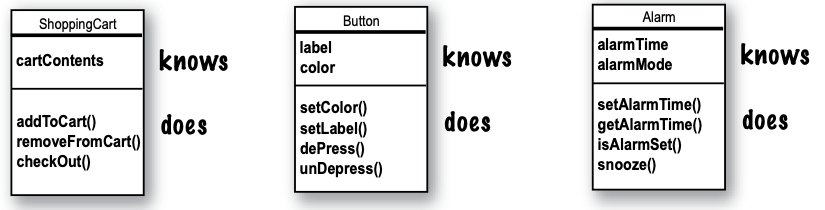
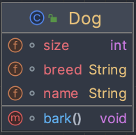

# Class And Objects

Birinci bölümde, bize nesnelerin olduğu söylendi. tüm kodumuzu main() metodu içine yerleştirdik. Bu tam anlamıyla nesne
yönelimli değil. Aslında, hiç nesne yönelimli değil. Tabii, Phrase-O-Matic için String dizileri gibi birkaç nesne
kullandık, ancak kendi nesne tiplerimizi geliştirmedik. Şimdi prosedürel dünyayı geride bırakmalı, main() metodundan
uzaklaşmalı ve kendi nesnelerimizi oluşturmaya başlamalıyız. Java'da nesne yönelimli (OO) geliştirmeyi bu kadar
eğlenceli yapan şeylere bir göz atacağız. Bir sınıf ile bir nesne arasındaki farka bakacağız. Nesnelerin programlama
hayatınıza nasıl daha iyi bir yaşam katabileceğine bakacağız

### Chair Wars

Bir zamanlar bir yazılım dükkanında, iki programcıya aynı özellikler verildi ve "inşa etmeleri" söylendi. Larry,
prosedürel programcı, ve Brad, OO (nesne yönelimli) uzmanı, her ikisi içinde bunun çocuk oyuncağı olacağını biliyordu.

Larry, kübünde otururken kendi kendine düşündü, "Bu programın yapması gereken şeyler neler? Hangi prosedürlere
ihtiyacımız var?" Ve kendisine cevap verdi, "döndürmek ve ses çalmak." Ve gitti, prosedürleri oluşturmaya başladı.
Sonuçta, bir program, yığınla prosedürden ibaret değil miydi?

Bu arada, Brad kafede rahat bir şekilde oturdu ve kendi kendine düşündü, "Bu programdaki şeyler nelerdir... ana
oyuncular kimler?" İlk olarak Shape'leri düşündü. Elbette, User, Sound ve Clicking event gibi diğer nesneleri de
düşündü. Ancak bu parçalar için zaten bir kod kütüphanesi vardı, bu yüzden Shape'leri oluşturmaya odaklandı.

GUI'de kare, daire ve üçgen şekilleri olacak. Kullanıcı bir şekle tıkladığında, şekil saat yönünde 360 derece dönecek
ve o belirli şekle özgü bir AIF ses dosyası çalacak.

**In Larry's cube:**

Daha önce yaptığı milyonlarca kez olduğu gibi, Larry Önemli Prosedürlerini yazmaya başladı. Döndürme (rotate) ve ses
çalma (playSound) fonksiyonlarını hiç zaman kaybetmeden yazdı.

```
rotate(shapeNum){
    // make the shape rotate 360
}

playSound(shapeNum){
    // use shapeNum to lookup which
    // AIF sound to play, and play it
}
```

**At Brad's laptop at cafe**

Brad her 3 shape icinde class'lar yarattı


Larry, kendinin başardığını düşündü. Ama durun! Özellik değişti.

"Tamam, teknik olarak sen ilk bitiren oldun, Larry," dedi Yönetici, "ama programa sadece küçücük bir şey eklememiz
gerekiyor. Siz iki başarılı programcı için hiç sorun olmayacak."

Larry, spec değişikliğinin hiç sorun olmadığını bir hayal olduğunu bilerek "Ve yine de Brad garip bir şekilde sakin
görünüyordu". Yine de Larry, OO yönteminin sevimli olsa da yavaş olduğuna dair temel inancına sıkı sıkıya bağlıydı.

Eklenecek özellikde diğer shape'ler ile birlikte amip şekli de olacak. Kullanıcı amipe tıkladığında diğerleri
gibi dönecek ve bir .hif ses dosyası çalacak.

**In Larry's cube**

Rotate prosedürü hala çalışır durumda olacaktır; kod, shapeNum'u gerçek bir şekil grafiğiyle eşleştirmek için bir
tabloyu kullanıyordu. Ancak, playSound değişmek zorunda kalacaktır. Peki, .hif dosyası nedir?

```
playSound(shapeNum){
    // if the shape is not an amoeba
    // use shapeNum to lookup which AIF sound to play, and play it
    // else play amoeba .hif sound
}
```

Durumun büyük bir sorun olmadığı ortaya çıktı, ancak önceden test edilen kodlara dokunmak hala onu tedirgin ediyordu.
Her ne kadar proje yöneticisi ne derse desin, spec her zaman değişir, bu konuda en iyi bilenlerden biri olarak bunu
bilmeliydi.

**At Brad's laptop at beach**

Brad gülümsedi, margaritasından bir yudum aldı ve yeni bir sınıf yazdı. Arada bir OO'nun en sevdiği şeylerinden biri,
zaten test edip teslim ettiği kodlara dokunmak zorunda kalmamasıydı. "Esneklik, genişletilebilirlik..." diye düşündü,
OO'nun avantajlarını düşünerek.


**Larry snuck in just moments ahead of Brad.**

Proje Yöneticisi "hayal kırıklığı" tonuyla şunları söylediğinde yok oldu: "Oh, hayır, amip öyle dönmemeliydi..."
Çıktı ki, her iki programcı da dönme kodunu şu şekilde yazmıştı:

1 - Şekli çevreleyen dikdörtgeni belirle

2 - Dikdörtgenin merkezini hesapla ve şekli o nokta etrafında döndür.

Ancak amip şekli, saat ibresi gibi bir ucunda bir nokta etrafında dönmeliydi.

Larry düşündü, "Ben bittim." "Ama, hmmm. Sadece dönme prosedürüne başka bir if/else ekleyebilirim ve amip için dönüş
noktası kodunu hard kodlayabilirim. Muhtemelen hiçbir şeyi bozmayacaktır."Ancak beyninin arka tarafındaki küçük ses, "
Büyük Hata. Gerçekten özelliklerin tekrar değişmeyeceğini düşünüyor musun?" dedi.

**Back in Larry's cube**

Larry, rotate prosedürüne dönme noktası argümanlarını eklemesi gerektiğine karar verdi. Bu değişiklikten etkilenecek çok
fazla kod vardı. Test etme, yeniden derleme, tam bir baştan sona süreç yeniden başladı. Daha önce çalışan şeyler artık
çalışmıyordu.

```
rotate(shapeNum, xPoint, yPoint){
    // if the shape is not an amoeba, calculate the center point based on a rectangle, then rotate
    // else use the xPoint and yPoint as the rotation point offset and then rotate
}
```

**At Brad's laptop in Bluegrass Festival**

Brad, bir an bile duraksamadan rotate yöntemini değiştirdi, ancak sadece Amoeba sınıfında. Diğer program bölümleri için
test edilmiş, çalışan ve derlenmiş kodlara hiç dokunmadı. Amoeba'ya dönme noktası eklemek için tüm Amoeba'ların sahip
olacağı bir özellik ekledi. Değişiklikleri yaptı, test etti ve tek bir Bela Fleck seti sırasında revize edilmiş programı
kablosuz olarak teslim etti.


LARRY: Kodun tekrarlanmış! Rotate işlemi dört şekilde de var.
BRAD: Bir metoddur, prosedür değil. Ve bunlar sınıflar, şeyler değil.
LARRY: Ne olursa olsun, bu aptalca bir tasarım. Dört farklı rotate "metodu" sürdürmeniz gerekiyor. Bunu nasıl iyi
olabilirsiniz ki?
BRAD: Ah, galiba son tasarımı görmediniz. Sana nasıl OO kalıtımının çalıştığını göstereyim, Larry.

1 - Peki, dört sınıfta ne gibi ortak özellikler var?


2 - Bunlar shape'ler ve hepsi dönüyor ve Ses çalıyor. Bu yüzden ortak özellikleri soyutladım ve onları Shape adlı yeni
bir sınıfa koydum.


3 - Sonra diğer dört shape sınıfını, kalıtım adı verilen bir ilişkiyle yeni Shape sınıfına bağladım. Bunu “Square,
Shape'den devralır”, “Circle Shape'den devralır” şeklinde okuyabilirsiniz. Diğer shape'lerden rotate() ve playSound()
öğelerini kaldırdım, yani artık korunması gereken tek bir kopya var. Shape sınıfı, diğer dört sınıfın üst sınıfı olarak
adlandırılır. Diğer dördü, Shape'in alt sınıflarıdır. Alt sınıflar, üst sınıfın yöntemlerini miras alır. Başka bir
deyişle, Shape sınıfı işlevselliğe sahipse, alt sınıflar da aynı işlevi otomatik olarak alır.

**Peki Amoeba class'ının özel rotate methodu ne olacak?**

LARRY : Buradaki bütün sorun bu değil miydi - amip şeklinin tamamen farklı bir rotate ve ses çalma prosedürü olması?

BRAD : Method

LARRY : Amoeba, işlevselliğini "Shape" sınıfından "miras" aldığı için farklı bir şey yapabilir mi?

BRAD : Bu son adım. Amoeba sınıfı, Shape sınıfının yöntemlerini override eder. Ardından, çalışma zamanında, birisi
Amoeba'ya dönmesini söylediğinde JVM tam olarak hangi rotate() yönteminin çalıştırılacağını bilir.


4 - Amoeba sınıfını oluşturdum ve bu sınıfın rotate() ve playSound() metodlarını, Shape adlı üst sınıfın miras aldığı
metodları üzerine override ettim. Overriding (üstüne yazma), bir alt sınıfın, bir metodu değiştirmek veya genişletmek
için miras aldığı metodu yeniden tanımlaması anlamına gelir.

LARRY : Bir Amoeba'e bir şeyi yapmasını nasıl "söyleyebilirsin"? Prosedürü, pardon - methodu çağırmanız ve sonra
ona hangi şeyi döndüreceğini söylemeniz gerekmiyor mu?

BRAD: Nesne tabanlı programlamada gerçekten harika olan şey budur. Örneğin, üçgenin döndürülmesi gerektiğinde, program
kodu üçgen nesnesi üzerinde rotate() metodunu çağırır. Programın geri kalanı, üçgenin bunu nasıl yaptığını bilmez veya
umursamaz. Ve programınıza yeni bir şey eklemeniz gerektiğinde, sadece yeni bir sınıf yazarsınız ve yeni nesneler kendi
davranışlarına sahip olur.

Bir prosedürel programcı ile bir Nesne Yönelimli (OO) programcı arasında geçen bir hikayeyi okudunuz. Sınıflar, metotlar
ve özellikler gibi temel OO kavramları hakkında kısa bir genel bakış elde ettiniz. Geri kalan bölümde sınıflar ve
nesneler üzerinde duracağız (miras ve override konularına daha sonraki bölümlerde döneceğiz).

Bugüne kadar gördüklerinizden ve daha önce çalıştığınız bir OO dilinden bildiklerinizden yola çıkarak, şu soruları
düşünmek için biraz zaman ayırın:

Bir Java sınıfı tasarlarken düşünmeniz gereken temel şeyler nelerdir? Kendinize sormanız gereken sorular nelerdir?
Bir sınıf tasarlarken kullanabileceğiniz bir kontrol listesi yapabilseydiniz, bu listede neler olurdu?

### Bir sınıf tasarlarken, o sınıf türünden oluşturulacak nesneleri düşünün. Aşağıdaki konuları düşünün:

* Nesnenin bildiği şeyleri düşünün: (KNOWS)
* Nesnenin yaptığı şeyleri düşünün: (DOES)



Bir object'in kendisi hakkında bildiği şeylere ne ad verilir?

* instance variables (state)

Bir object'in yapabileceği şeylere denir

* methods (behaviour)


Bir nesnenin kendisi hakkında bildiği şeylere **instance variables** denir. Bunlar bir nesnenin state'ini temsil eder
(data) ve her bir nesne için unique değerlere sahip olabilir.

Instance, object demenin başka bir yolunu düşünün.

Bir nesnenin yapabileceği şeylere methods denir. Bir sınıf tasarladığınızda, bir nesnenin kendisi hakkında bilmesi
gereken data'ları düşünürsünüz ve ayrıca bu datalar üzerinde çalışan methodları tasarlarsınız. Bir nesnenin instance
variable'larının değerlerini okuyan veya yazan methodlara sahip olması yaygındır. Örneğin, Alarm object'inin
alarmTime'ı tutmak için bir instance variables'i vardır ve alarmTime'ı almak ve ayarlamak için iki methodu vardır.

Bu yüzden nesnelerin instance variables'ları ve methodları vardır, ancak bu instance variables'ları ve methodlar sınıfın
bir parçası olarak tasarlanır.

### Bir sınıf ve bir nesne arasındaki fark nedir?

Bir sınıf bir nesne değildir. Ancak, nesnelerin oluşturulması için kullanılır.

Bir sınıf, bir nesnenin nasıl oluşturulacağını belirten bir plan veya şablondur. Bu sınıftan yapılan her bir nesne, o
sınıfa ait instance variable'lar için kendi değerlerine sahip olabilir. Örneğin, Button sınıfını kullanarak farklı
düğmeler oluşturabilirsiniz ve her bir düğmenin kendi renk, boyut, şekil, etiket vb. özellikleri olabilir.


Bir nesne, adres defterinizdeki bir giriş gibi düşünebilirsiniz.

Nesneler için bir benzetme, kullanılmamış bir Rolodex kart paketidir. Her kart aynı boş alanlara
(instance variables'lara) sahiptir. Bir kartı doldurduğunuzda bir instance (object) oluşturmuş olursunuz ve kart
üzerinde yaptığınız girişler, nesnenin state'ini temsil eder.

Sınıfın methodları, belirli bir karta uyguladığınız eylemlerdir; getName(), changeName(), setName() gibi methodlar,
Rolodex sınıfı için olabilir.

Bu durumda, her kart aynı şeyleri yapabilir (getName(), changeName() vb.), ancak her kart kendine özgü unique bilgilere
sahiptir.

### Making your first object

Bir nesne oluşturmak ve kullanmak için ne gerekiyor?

Bir nesne oluşturmak ve kullanmak için iki sınıfa ihtiyaç vardır. İlk olarak, kullanmak istediğiniz nesnenin türüne göre
bir sınıf oluşturmanız gerekmektedir (Köpek, AlarmSaat, Televizyon vb.). İkinci olarak, yeni sınıfınızı test etmek için
başka bir sınıf oluşturmanız gerekmektedir. Tester Class , main() methodunu içeren ve bu methodda yeni sınıfınızın
nesnelerini oluşturup erişim sağladığınız yerdir. Tester Class sınıfının tek görevi, yeni nesne sınıfınızın methodlarını
ve variables'larını denemektir.

Kitap boyunca bundan sonra, örneklerimizde çoğunlukla iki sınıf göreceksiniz. Birincisi, real class olacak - gerçekten
kullanmak istediğimiz nesnenin sınıfı, diğer sınıf ise Tester Class olacak ve <someClassName>TestDrive olarak
adlandıracağız. Örneğin, Bungee sınıfı oluşturursak, BungeeTestDrive adında bir Tester Class sınıf da gerekecektir.
Sadece <someClassName>TestDrive sınıfı, main() methoduna sahip olacak ve tek amacı, yeni türünüzün (Tester Class olmayan
sınıfın) nesnelerini oluşturmak ve ardından nokta operatörünü (.) kullanarak yeni nesnelerin methodlarına ve
variable'larına erişmek olacaktır. Tüm bunlar, aşağıdaki örneklerle son derece açık hale gelecektir.

1 - Write your class



size,breed ve name -> instance variables

void bark() -> a method

2 - bir test sınıfı örneği, burada bir nesne oluşturuyoruz, nesnenin variables'larına erişiyoruz ve methodları
çağırıyoruz:

```
public class DogTestDrive {
    public static void main(String[] args) {
        Dog dog = new Dog(); // make a dog object
        dog.size = 40; // set the size of the dog
        dog.bark(); // call its bark() method
    }
}
```

### Making and testing Movie objects

```
public class Movie {
    String title;
    String genre;
    int rating;
    void playIt(){
        System.out.println("playing the movie");
    }
}
```

MovieTestDrive class;

```
public class MovieTestDrive {
    public static void main(String[] args) {
        Movie one = new Movie();
        one.title = "Gone with the wind";
        one.genre = "Tragic";
        one.rating = -2;

        Movie two = new Movie();
        two.title = "Lost in cubicle space";
        two.genre = "Comedy";
        two.rating = 5;
        two.playIt();

        Movie three = new Movie();
        three.title = "Byte club";
        three.genre = "Tragic";
        three.rating = 127;
    }
}
```

MovieTestDrive sınıfı, Movie sınıfının nesnelerini oluşturur ve nokta operatörünü (.) kullanarak instance variables'ları
belirli bir değere set eder. MovieTestDrive sınıfı ayrıca bir nesne üzerinde bir methodu çağırır (çalıştırır).

### Quick! Get out of main!

Gerçekten nesne odaklı bir yapıya sahip olmak için main() methodunun ötesine geçmek önemlidir. Tam anlamıyla nesne
odaklı bir uygulamada, nesnelerin birbirleriyle iletişim kurması önemlidir ve bu iletişim statik bir main() yöntemi
tarafından oluşturulan ve test edilen nesnelerden daha önce gelir.

**The two uses of main:**

* Real class'ı test etmek için
* Java application'ını çalıştırmak için

Gerçek bir Java uygulaması, başka nesnelerle iletişim kuran nesnelerden başka bir şey değildir. Bu durumda, iletişim
nesnelerin birbirlerini çağırdığı methodları ifade eder. Önceki sayfada ve 4. bölümde, başka bir sınıfın methodlarını ve
variable'larını oluşturmak ve test etmek için ayrı bir TestDrive sınıfından main() methodunu kullanmayı inceledik. 6.
bölümde ise gerçek bir Java uygulamasının başlatılması için bir main() yöntemine sahip bir sınıf kullanmayı
öğreniyoruz (nesneler oluşturarak ve bu nesneleri başka nesnelerle etkileşime sokarak vb.).

Ancak, gerçek bir Java uygulamasının nasıl çalışabileceğine dair küçük bir örneği göstermek için, burada size bir
önizleme sunacağım. Henüz Java öğrenme yolculuğunuzun en erken aşamalarında olduğumuz için küçük bir araç setiyle
çalışıyoruz, bu nedenle bu programın biraz sıkışık ve verimsiz olduğunu göreceksiniz. Onu nasıl geliştirebileceğinizi
düşünmek isteyebilirsiniz ve ileriki bölümlerde tam olarak bunu yapacağız. Kodun bazı bölümleri kafa karıştırıcı
olabilir, ancak bu örneğin temel noktası, nesnelerin birbirleriyle iletişim kurmasıdır.

### The Guessing Game

Özet:

Tahmin oyunu, bir "game" nesnesi ve üç "player" nesnesini içerir. Game, 0 ile 9 arasında rastgele bir sayı oluşturur ve
üç player nesnesi bunu tahmin etmeye çalışır

Classes:
GuessGame.class Player Class GameLauncher.class

1 - GameLauncher sınıfı, uygulamanın başladığı yerdir ve main() methoduna sahiptir.

2 - main() methodunda bir GuessGame nesnesi oluşturulur ve onun startGame() methodu çağrılır.

3 - GuessGame nesnesinin startGame() methodu, oyunun tamamının gerçekleştiği yerdir. Üç player oluşturur, ardından
rastgele bir sayıyı (oyuncuların tahmin etmesi için hedef) "düşünür". Daha sonra her player'a tahmin etmelerini söyler,
sonucu kontrol eder ve kazanan player(lar) hakkında bilgi yazdırır veya tekrar tahmin etmelerini ister.

Player.class;

```
public class Player {
    int number = 0; // guess set et

    public void guess() {
        number = (int) (Math.random() * 10);
        System.out.println("I'm guessing " + number);
    }
}
```

GuessGame.class;

```
public class GuessGame {
    // instance variables
    Player player1;
    Player player2;
    Player player3;

    public void startGame() {
        // 3 player object'i yukarıda ki instance variable'a assing edilir
        player1 = new Player();
        player2 = new Player();
        player3 = new Player();

        // oyuncularin yaptiklari 3 tahmini tutmak icin 3 degisken
        int guessPlayer1 = 0;
        int guessPlayer2 = 0;
        int guessPlayer3 = 0;

        // 3 degisken oyuncunun cevabinin dogru olup olmadigini tutmak icin
        boolean player1IsRight = false;
        boolean player2IsRight = false;
        boolean player3IsRight = false;

        int targetNumber = (int) (Math.random() * 10);
        System.out.println("I am thinking of a number between 0 and 9...");

        while (true) {
            System.out.println("Number to guess is " + targetNumber);

            // player class'i icerisinde ki guess methodunu 3 player icinde calistir
            player1.guess();
            player2.guess();
            player3.guess();

            // her oyuncunun tahminini burada ki int degiskenlere ata
            guessPlayer1 = player1.number;
            System.out.println("Player 1 guessed " + guessPlayer1);

            guessPlayer2 = player2.number;
            System.out.println("Player 2 guessed " + guessPlayer2);

            guessPlayer3 = player3.number;
            System.out.println("Player 3 guessed " + guessPlayer3);

            // her bir oyuncu icin tahmini ve targetNumber tutuyorsa kontrolu yap
            if (guessPlayer1 == targetNumber){
                player1IsRight = true;
            }

            if (guessPlayer2 == targetNumber){
                player2IsRight = true;
            }

            if (guessPlayer3 == targetNumber){
                player3IsRight = true;
            }

            // eger player'ların herhangi birinin tahmini dogru ise bu bloga gir (OR Operator)
            if (player1IsRight || player2IsRight || player3IsRight){
                System.out.println("We have a winner");
                System.out.println("Player 1 got it right " + player1IsRight);
                System.out.println("Player 2 got it right " + player2IsRight);
                System.out.println("Player 3 got it right " + player3IsRight);
                System.out.println("Game is over");
                break;
            } else {
                // tahminler dogru degilse devam et
                System.out.println("Players will have to try again");
            }
        }
    }
}
```

GameLauncher.class;

```
public class GameLauncher {
    public static void main(String[] args) {
        GuessGame guessGame = new GuessGame();
        guessGame.startGame();
    }
}
```

Java, Çöp Toplama işlemini gerçekleştirir.
Java'da bir nesne her oluşturulduğunda, Heap olarak bilinen bir bellek alanına gider. Tüm nesneler - ne zaman,
nerede veya nasıl oluşturulursa oluşsunlar - Heap'de yaşar. Ancak bu sıradan bir Heap değildir; Java Heap'i aslında
Garbage-Collectible Heap olarak adlandırılır. Bir nesne oluşturduğunuzda, Java, o belirli nesnenin ihtiyaç duyduğu kadar
bellek alanını heap'de tahsis eder. Örneğin, 15 instance variable'a sahip bir nesne, yalnızca iki instance variable'a
sahip bir nesneden daha fazla alan gerektirebilir. Ancak o alanı nasıl geri alırsınız? Bir nesneyi Heap'in dışına
çıkardığınızda ne olur? Java bu belleği sizin için yönetir! JVM, bir nesnenin artık kullanılamayacağını '
görebildiğinde', o nesne çöp toplama için uygun hale gelir. Ve eğer bellekte yer sıkıntısı varsa, Garbage Collector
çalışır, ulaşılamayan nesneleri atar ve alanı serbest bırakır, böylece alan yeniden kullanılabilir hale gelir. Daha
sonraki bölümlerde bunun nasıl çalıştığı hakkında daha fazla bilgi edineceksiniz.

Question : Java'da, her şeyin bir sınıf içinde olması gerektiği düşünüldüğünde, global variables ve methodlar
oluşturmanız gerektiğinde nasıl yapabilirsiniz?

Answer : Bir Java nesne yönelimli programında "global" değişken ve method kavramı bulunmamaktadır. Bununla birlikte,
pratik kullanımda, programınızın herhangi bir bölümünde çalışan herhangi bir kodun kullanabileceği bir method (veya
constant) olmasını istediğiniz durumlar olabilir. Örneğin, Phrase-O-Matic uygulamasındaki random() methodunu düşünelim;
bu method herhangi bir yerden çağrılabilir olmalıdır. Ya da pi sayısı gibi bir constant? 10. bölümde öğreneceksiniz ki,
bir methodu public ve static olarak işaretlemek, onu neredeyse 'global' gibi davranmasını sağlar. Uygulamanızın herhangi
bir sınıfındaki herhangi bir kod, public static bir methoda erişebilir. Ve bir variable'ı public, static ve final olarak
işaretlerseniz, neredeyse küresel olarak erişilebilir bir constant oluşturmuş olursunuz.

Question : Eğer yüzlerce veya binlerce sınıfınız varsa, tüm bu ayrı dosyaları teslim etmek zor olabilir. Bu durumda,
bunları tek bir uygulama nesnesine dahil edemez miyim?

Answer : Evet, büyük miktarda ayrı dosyaları son kullanıcılara teslim etmek zor olabilir, ancak yapmanız gerekmeyecek.
Tüm uygulama dosyalarınızı bir Java Arşivi olan .jar dosyasına yerleştirebilirsiniz. Bu .jar dosyası, pkzip formatına
dayanan bir formata sahiptir. Jar dosyasında, bir manifest adı verilen bir şey olarak biçimlendirilmiş basit bir metin
dosyası ekleyebilirsiniz. Bu manifest, jar içindeki hangi sınıfın main() yöntemini çalıştırması gerektiğini belirtir.

Question : O zaman hala global fonksiyonlar ve global data'lar yapabiliyorsanız, bu nesne yönelimli nasıl olur?

Answer : Öncelikle, Java'da her şey bir sınıfta yer alır. Bu nedenle, pi sayısı için constant ve random() metodları, her
ikisi de public ve static olsa da, Math sınıfı içinde tanımlanır. Ve aklınızda bulundurmanız gereken şey, bu statik (
global benzeri) öğelerin Java'da kuralın istisnası olduğudur. Bunlar, birden fazla instance/objects olmadığı çok özel
durumları temsil eder.

**BULLET POINTS**

* Nesne tabanlı programlama, önceden test edilmiş, çalışan kodlara dokunmadan bir programı genişletmenizi sağlar.
* Tüm Java kodları bir sınıfta tanımlanır.
* Bir sınıf, o sınıf türünde bir nesnenin nasıl oluşturulacağını açıklar. Bir sınıf, bir taslak gibi düşünülebilir.
* Bir nesne kendi kendine bakabilir; nesnenin bunu nasıl yaptığını bilmek veya umursamak zorunda değilsiniz.
* Bir nesne şeyler bilir(knows) ve şeyler yapar(does)
* Bir nesnenin kendisi hakkında bildiği şeylere instance variables denir. Bunlar nesnenin state'ini temsil eder.
* Bir nesnenin yaptığı şeylere metodlar denir. Bunlar nesnenin behavior(davranışını) temsil eder.
* Bir sınıf oluşturduğunuzda, yeni sınıf türündeki nesneleri oluşturmak için kullanacağınız ayrı bir test sınıfı
  oluşturmanız da istenebilir.
* Bir sınıf, daha soyut bir üst sınıftan instance variables'larını ve metotlarını miras alabilir. Çalışma zamanında, bir
  Java programı, başka nesnelerle 'konuşan' nesnelerden ibarettir

