# Collections and Generics

### Data structures

Java'da sıralama işlemi oldukça basittir. Kendi sıralama algoritmalarınızı yazmanıza gerek kalmadan verilerinizi
toplamanız ve manipüle etmeniz için gereken araçlara sahipsiniz (eğer şu anda Bilgisayar Bilimi 101 dersinizde bu metni
okuyorsanız, o zaman güvenin bize - Java API'sindeki bir methodu çağırırken siz sort kodu yazmaya devam edeceksiniz).
Java Collections Framework'u, neredeyse herhangi bir işi yapmak için çalışabilecek bir veri yapısına sahiptir. Sürekli
yeni öğeler ekleyebileceğiniz bir liste mi tutmak istiyorsunuz? Bir isme göre bir şey bulmak mı istiyorsunuz? Tüm
yinelenenleri otomatik olarak çıkaran bir liste oluşturmak mı istiyorsunuz? İş arkadaşlarınızı sırtınıza ne kadar bıçak
sapladıklarına göre sıralamak mı istiyorsunuz? Evcil hayvanlarınızı öğrendikleri numara sayısına göre mi sıralamak
istiyorsunuz? Her şey burada bulunmaktadır...

### Tracking song popularity on your jukebox

Lou's Diner'daki otomatik müzik kutusu sistemini yönetme işiniz için tebrikler. Müzik kutusu içinde Java kullanılmıyor,
ancak birisi Song çaldığında Song verileri basit bir metin dosyasına ekleniyor. Göreviniz, Song popülaritesini
izlemek, raporlar oluşturmak ve çalma listelerini yönetmek için verileri yönetmektir. Tüm uygulamayı siz yazmıyorsunuz -
diğer bazı yazılım geliştirici/garsonlar da dahil olmak üzere diğerleri de yer alıyor, ancak verileri Java uygulaması
içinde yönetmek ve sıralamak sizin sorumluluğunuzda. Ve Lou, veritabanlarına karşı bir tavrı olduğundan, bu yalnızca
bellekte veri toplama işlemidir. Sadece müzik kutusunun sürekli eklediği dosyaya erişiminiz var. Göreviniz bundan
sonrasını üstlenmektir.

Dosyayı okuyup parse etmenin nasıl yapılacağını zaten çözdünüz ve şimdiye kadar verileri bir ArrayList içinde
depoluyorsunuz.

**Challenge #1 Sort the songs in alphabetical order**

Bir dosyada Songların bir listesi var, her bir satır bir Songyı temsil ediyor ve başlık ile sanatçı bir eğik çizgi ile
ayrılıyor. Bu nedenle satırı ayrıştırmak ve tüm Songları bir ArrayList'e koymak oldukça basit olmalı. Patronunuz sadece
Song başlıklarını önemsiyor, bu nedenle şimdilik sadece Song başlıklarından oluşan bir liste oluşturabilirsiniz.


Ancak listenin alfabetik sırayla olmadığını görebiliyorsunuz... Ne yapabilirsiniz?

Biliyorsunuz ki bir ArrayList ile öğeler, listeye eklendikleri sırayla tutulur. Bu nedenle onları bir ArrayList'e
koymak, onları alfabetik sıraya dizmekle ilgilenmeyecektir. Ancak belki de ArrayList sınıfında bir sort() methodi
vardır?

### Here’s what you have so far, without the sort:

```
public class Jukebox1 {
    ArrayList<String> songList = new ArrayList<>();

    public static void main(String[] args) {
        new Jukebox1().go();
    }

    private void go() {
        getSongs();
        System.out.println(songList);
    }

    private void getSongs() {
        try {
            File file = new File("SongList.txt");
            BufferedReader bufferedReader = new BufferedReader(new FileReader(file));
            String line = null;
            while((line = bufferedReader.readLine())!=null){
                addSong(line);
            }
        } catch (IOException e) {
            throw new RuntimeException(e);
        }
    }

    private void addSong(String lineToParse) {
        /* addSong methodu, hem başlığı hem de sanatçıyı içeren satırı split() methodunu kullanarak iki parçaya (token)
        ayırırsınız.*/
        String[] tokens = lineToParse.split("/");
        songList.add(tokens[0]);
    }
}
```

SongList.txt içerisinden verileri okuduk parse ettik ve songList isimli array'e kaydettik.

### But the ArrayList class does NOT have a sort() method!

ArrayList'in miras hiyerarşisinde, sorting ile ilgili herhangi bir yerleşik methot bulunmuyor. Miras hiyerarşisini
yukarı doğru incelemek de yardımcı olmuyor; ArrayList üzerinde doğrudan çağrılabilecek herhangi bir sıralama methodu
bulunmadığı açık.

ArrayList Collection'ların sadece biridir.

Her ne kadar en sık kullanacağınız koleksiyon türü ArrayList olsa da, özel durumlar için diğer koleksiyon türleri de
bulunmaktadır. Ana koleksiyon sınıflarından bazıları şunlardır:

**TREESET**

Elemanları sıralı tutar ve tekrarlanan elemanları engeller.

**HASHMAP**

Elemanları name/value çiftleri olarak depolamanıza ve erişmenize olanak tanır.

**LINKEDLIST**

Stacks veya Queues gibi yapıları oluşturmayı kolaylaştırır.

**HASHSET**

Koleksiyonda tekrarlayan elemanları engeller ve bir eleman verildiğinde bu elemanı koleksiyonda hızlı bir şekilde
bulabilir.

**LINKEDHASHMAP**

Normal bir HashMap gibi çalışır, ancak elemanların (name/value çiftleri) hangi sırayla eklendiklerini hatırlayabilir
veya elemanların en son hangi sırayla erişildiğini hatırlayacak şekilde yapılandırılabilir.

### You could use a TreeSet... Or you could use the Collections.sort() method

Eğer tüm String'leri (Song başlıkları) bir ArrayList yerine bir TreeSet'e koyarsanız, String'ler otomatik olarak doğru
yere, alfabetik sıraya göre yerleşecektir. Listeyi her ne zaman yazdırsanız, öğeler her zaman alfabetik sırayla
çıkacaktır. Bu, bir küme gerektiğinde harika bir seçenektir (biraz sonra kümeler hakkında konuşacağız) veya liste
üzerinde her zaman alfabetik olarak sıralı kalması gerektiğini bildiğinizde kullanışlıdır.

Diğer taraftan, listenin alfabetik olarak sıralanmasına gerek yoksa, TreeSet, ihtiyacınızdan daha maliyetli olabilir —
bir TreeSet'e ekleme yaptığınız her seferinde, TreeSet yeni elemanın ağaç içinde hangi yere gitmesi gerektiğini bulmak
için zaman harcamak zorundadır. ArrayList ile eklemeler, yeni elemanın sadece listenin sonuna gitmesi nedeniyle son
derece hızlı olabilir.

--**DIALOGS**--

Q : Ancak bir ArrayList'e sadece listenin sonuna değil, belirli bir index'e bir şey ekleyebilirsiniz — eklemek
istediğiniz öğe ile birlikte bir tamsayıyı alan overload edilmiş bir add() methodu bulunmaktadır. Peki bu, listenin
sonuna eklemekten daha yavaş olmaz mı?

A : Evet, bir ArrayList'e listenin sonu dışında başka bir yere bir şey eklemek daha yavaş olabilir. Bu nedenle, overload
edilmiş add(index, element) methodini kullanmak, eklenen öğeyi listenin sonuna koyan add(element) methodunu çağırmak
kadar hızlı çalışmaz. Ancak çoğu zaman ArrayList'leri kullanırken bir şeyi belirli bir index'e koymaya ihtiyaç
duymayacaksınız.

Q : Evet, LinkedList sınıfının olduğunu görüyorum, bu nedenle ortada bir yere ekleme yapmak için bu sınıf daha iyi olmaz
mı? En azından üniversitedeki Veri Yapıları dersimden hatırladığım kadarıyla...

A : Evet, doğru tespit. LinkedList, ortadan bir şey eklediğinizde veya çıkardığınızda genellikle daha hızlı olabilir,
ancak çoğu uygulama için LinkedList ve ArrayList arasındaki fark, genellikle büyük miktarda öğeyle uğraşmadıkça
önemsenmeyecek kadar azdır. Birkaç dakika içinde LinkedList'e daha ayrıntılı bakacağız.

### Adding Collections.sort() to the Jukebox code

```
private void go() {
    getSongs();
    System.out.println(songList);
    Collections.sort(songList);
    System.out.println(songList);
}
```

Statik Collections.sort() methodunu çağırın, ardından listeyi tekrar yazdırın. İkinci yazdırma işlemi alfabetik sırayla
olacaktır!

### But now you need Song objects, not just simple Strings.

Şimdi patronunuz, sadece String'ler değil, her bir Songnın daha fazla veri içerebileceği gerçek Song sınıf
instance'larını istiyor, böylece her bir Song daha fazla veriye sahip olabilir. Yeni jukebox cihazı daha fazla bilgi
çıktısı üretir, bu nedenle bu sefer dosyanın iki yerine dört parçası (token) olacak.

Song sınıfı gerçekten basit, sadece bir ilginç özelliği var — üzerine yazılan toString() methodu. Unutmayın, toString()
methodu Object sınıfında tanımlanmıştır, bu nedenle Java'daki her sınıf bu methodu miras alır. toString() methodu bir
nesne üzerinde yazdırıldığında (System.out.println(birNesne)), default unique identifier kodundan daha okunabilir bir
şey yazdırmak için bunu override etmelisiniz. Bir liste yazdırdığınızda, toString() methodu her nesne üzerinde
çağrılacaktır.

```
public class Song {
    private final String title;
    private final String artist;
    private final String rating;
    private final String bpm;

    public Song(String title, String artist, String rating, String bpm) {
        this.title = title;
        this.artist = artist;
        this.rating = rating;
        this.bpm = bpm;
    }

    public String getTitle() {
        return title;
    }

    public String getArtist() {
        return artist;
    }

    public String getRating() {
        return rating;
    }

    public String getBpm() {
        return bpm;
    }

    /* toString() methodunu override etme nedenimiz, bir System.out.println(aSongObject) işlemi yaptığınızda başlığı
    görmek istememizdir. Bir System.out.println(aSongList) işlemi yaptığınızda ise liste içindeki HER öğenin toString()
    methodunu çağırır.*/
    @Override
    public String toString() {
        return "Song{" +
                "title='" + title + '\'' +
                '}';
    }
}
```

### Changing the Jukebox code to use Songs instead of Strings

```
public class Jukebox1 {
    ArrayList<Song> songList = new ArrayList<>();

    public static void main(String[] args) {
        new Jukebox1().go();
    }

    private void go() {
        getSongs();
        System.out.println(songList);
    }

    private void getSongs() {
        try {
            File file = new File("SongListMore.txt");
            BufferedReader bufferedReader = new BufferedReader(new FileReader(file));
            String line = null;
            while((line = bufferedReader.readLine())!=null){
                addSong(line);
            }
        } catch (IOException e) {
            throw new RuntimeException(e);
        }
    }

    private void addSong(String lineToParse) {
        /* addSong methodu, hem başlığı hem de sanatçıyı içeren satırı split() methodunu kullanarak iki parçaya (token)
        ayırırsınız.*/
        String[] tokens = lineToParse.split("/");
        Song nextSong = new Song(tokens[0],tokens[1],tokens[2],tokens[3]);
        songList.add(nextSong);
    }
}
```

Collections.sort() methodu kaldırmasaydık burada hata verecekti. Çünkü ArrayList Song tipinde

### Generics means more type-safety

Burada açıkça belirtelim ki, genellikle generics kullanarak yazdığınız kodun neredeyse tamamı koleksiyonlarla ilgili kod
olacaktır. Generics başka şekillerde de kullanılabilir, ancak generics'in ana amacı tip güvenli koleksiyonlar yazmanıza
izin vermektir. Yani, derleyicinin sizi, bir Ördeği Ördekler listesine koymamanız için durdurduğu kodları yazmak.
Generics'ten önce (bu da Java 5.0 öncesini kapsar), derleyici koleksiyona ne koyduğunuzla ilgilenmezdi, çünkü tüm
koleksiyon uygulamaları türünü Object olarak tutacak şekilde bildirilmişti. Herhangi bir ArrayList'e herhangi bir şey
koyabilirdiniz; adeta tüm ArrayList'ler ArrayList<Object> olarak bildirilmiş gibi bir durumdu.

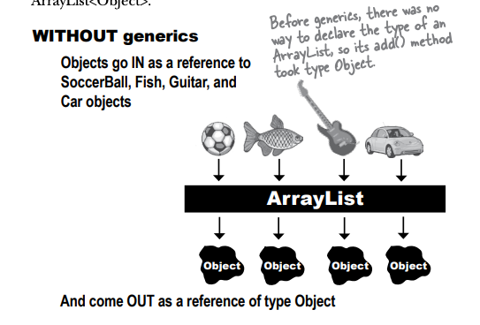

Generics ile, derleme zamanında daha fazla sorun tespit edilen, tip güvenli koleksiyonlar oluşturabilirsiniz. Generics
olmadan, derleyici, sadece Cat nesnelerini içermesi gereken bir ArrayList'e Kabak eklemenize izin verirdi. Ancak
derleme zamanında bu tür uyumsuzluklar tespit edilemezdi.

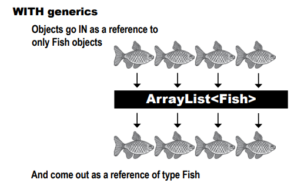

Artık generics kullanarak, sadece Fish nesnelerini ArrayList<Fish>'e koyabilirsiniz, böylece nesneler Fish referansları
olarak çıkar. Birilerinin oraya bir Volkswagen koyması veya çıkan şeyin gerçekten Fish referansına dönüştürülemediği
konusunda endişelenmenize gerek yok.

### Learning generics

Generics hakkında öğrenebileceğiniz onlarca detaydan, çoğu programcı için gerçekten önemli olan sadece üç tanesi vardır:

1 - Generic sınıfların (örneğin ArrayList) instance'larını oluşturma.

Bir ArrayList oluştururken, listeye izin vermek istediğiniz nesne türünü belirtmelisiniz, aynı şekilde old arrays'lere
yaptığınız gibi.

```new ArrayList<Song>();```

2 - Generic Type'ların variable'larını declare etme ve assing etme

Generic Type'lar ile polimorfizm nasıl çalışır? Eğer bir ArrayList<Animal> referans değişkeniniz varsa, buna bir
ArrayList<Dog> atayabilir misiniz? Bir List<Animal> referansı için ne olacak? Ona bir ArrayList<Animal> atayabilir
misiniz? Göreceksiniz...

```List<Song> songList = new ArrayList<>();```

3 - Generic Type'ları kabul eden methodlara bildirme (ve çağırma).

Eğer bir parametre olarak, örneğin, Animal nesnelerinin olduğu bir ArrayList alabilen bir methodunuz varsa, bu gerçekte
ne anlama gelir? Aynı methoda Dog nesnelerinin olduğu bir ArrayList geçirebilir misiniz? Sadece plain old arrays'leri
kabul eden methodları yazma şeklinizden oldukça farklı, ince ve karmaşık polimorfizm konularına bakacağız.
(Bu aslında 2. noktanın aynısıdır, ancak ne kadar önemli olduğunu size göstermek istedik.)

```
void foo(List<Song> list);
x.foo(songList);
```

--**DIALOGS**--

Q : Evet, elbette kendi generic sınıflarımı nasıl oluşturacağımı öğrenmem gerekiyor, değil mi? Eğer bir sınıf türü
oluşturmak istiyorsam ve bu sınıfı kullanacak insanların sınıfın ne tür şeyler kullanacağına karar vermesini istiyorsam
ne yapmalıyım?

A : Bununla büyük ihtimalle çok fazla uğraşmayacaksınız. Düşünün; API tasarımcıları, ihtiyacınız olan çoğu veri yapısını
kapsayan geniş bir koleksiyon sınıfı kütüphanesi oluşturdu ve gerçekten genericlerin gerekli olduğu sınıf türleri
neredeyse yalnızca koleksiyon sınıflarıdır. Başka bir deyişle, diğer öğeleri tutmayı amaçlayan sınıflar ve bu sınıfı
kullanan programcıların, koleksiyon sınıfını bildirirken ve instantiate ederken bu öğelerin ne tür olduğunu belirtmesini
istersiniz.

Evet, muhtemelen generic sınıfları oluşturmak isteyebilirsiniz, ancak bu exception'dır, bu yüzden burada bunu
kapsamayacağız. (Ancak zaten kapsadığımız konulardan bunu anlayacaksınız.)

### Using generic CLASSES

ArrayList, en çok kullandığımız generified bir tür olduğu için, belgenin içeriğine bakmaya başlayacağız. Bir generified
sınıfta incelenmesi gereken iki temel alan şunlardır:

1 - Sınıf deklarasyonu

2 - Eleman eklemenizi sağlayan method deklarasyonları

**ArrayList dökümentasyonuna bakalım**

```public class ArrayList<E> extends AbstractList<E> implements List<E>...```

"E", ArrayList'i bildirdiğinizde ve oluşturduğunuzda kullandığınız GERÇEK tür için bir yer tutucudur(placeholder).

ArrayList, AbstractList'in bir alt sınıfıdır, bu nedenle ArrayList için belirttiğiniz herhangi bir tür otomatik olarak
AbstractList'in türü olarak kullanılır.

Type (<E> değerinin değeri), List interface'inin türü haline gelir.

Class'in içerisinde ki boolean add methodu :

```
public boolean add(E e) {
    // more code
}
```

İşte önemli olan kısım! "E" ne ise, bu durumda ArrayList'e eklemeye izin verilen şey türünü belirler.

"E", ArrayList instance'i oluşturmak için kullanılan türü temsil eder. ArrayList documentation'ında "E" gördüğünüzde,
zihinsel olarak bir find/replace işlemi yaparak "E" yerine ArrayList'i instantiate etmek için kullandığınız herhangi
bir <type> terimini değiştirebilirsiniz. Yani, new ArrayList<Song> ifadesi "E"nin "Song" haline geldiği anlamına gelir
ve "E" kullanan herhangi bir method veya variable deklarasyonun da bunu yapabilirsiniz.

### Using type parameters with ArrayList

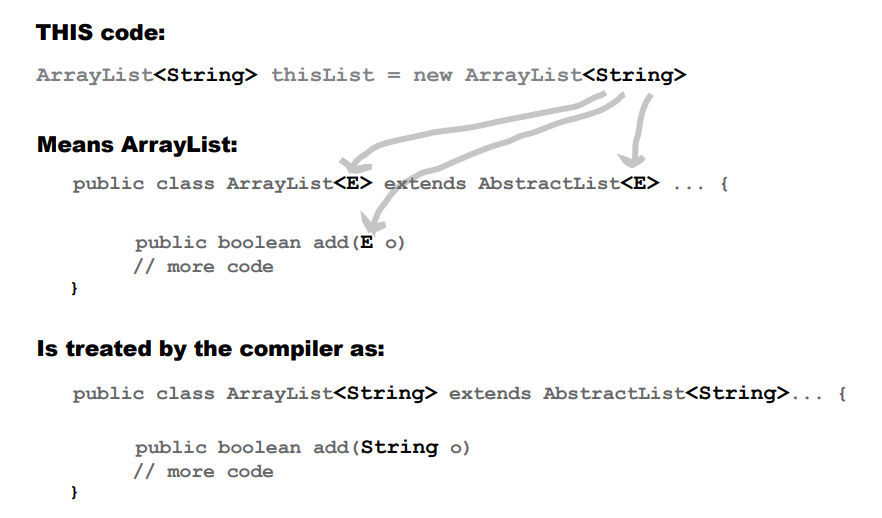

Başka bir deyişle, "E", ArrayList oluştururken kullandığınız real type ile (aynı zamanda tür parametresi olarak da
adlandırılır) değiştirilir. Ve bu yüzden ArrayList için add() methodu, "E" türüyle uyumlu olan bir başvuru türünün
nesneleri dışında başka bir şey eklemenize izin vermez. Yani, ArrayList<String> oluşturursanız, add() methodu birdenbire
add(String o) haline gelir. Eğer Dog türünde bir ArrayList oluşturursanız, add() methodu aniden add(Dog o) haline gelir.

--**DIALOGS**--

Q : Oraya koyabileceğiniz tek şey "E" mi? Çünkü sıralama dokümanlarında "T".... kullanılıyordu.

A : Geçerli bir Java identifier olan her şeyi kullanabilirsiniz. Bu, bir method veya değişken adında
kullanabileceğiniz herhangi bir şeyin, bir tür parametresi olarak çalışacağı anlamına gelir. Ancak gelenek, bir tek harf
kullanmaktır (bu yüzden bunu kullanmalısınız) ve başka bir gelenek de, özel olarak bir koleksiyon sınıfı yazmıyorsanız "
E" yerine "T" kullanmaktır, koleksiyonun tutacağı öğenin türünü temsil etmek için ise "E" kullanılır.

### Using generic METHODS

Generic bir sınıf, sınıf deklarasyonunun bir type parametresi içerdiği anlamına gelir. Generic bir method ise, method
deklarasyonunun imzasında bir type parametresi kullanıldığı anlamına gelir. Bir methodda type parametrelerini birkaç
farklı şekilde kullanabilirsiniz:

1 - Sınıf deklarasyonunda tanımlanan bir type parametresini kullanma

```public class ArrayList<E> extends AbstractList<E> ... { ```

```public boolean add(E o) // Burada "E"yi SADECE sınıfın bir parçası olarak zaten tanımlandığı için kullanabilirsiniz.```

Sınıf için bir type parametresi bildirdiğinizde, gerçek bir sınıf veya interface türünü kullanacağınız herhangi bir yeri
basitçe bu type ile değiştirebilirsiniz. Method argümanında bildirilen type, temelde sınıfı örneklendirdiğinizde
kullandığınız type ile değiştirilir.

2 - Sınıf bildiriminde TANIMLANMAMIŞ bir type parametresinin kullanılması

```public <T extends Animal> void takeThing(ArrayList<T> list)```

Sınıf kendisi bir type parametresi kullanmıyorsa, yine de bir method için bir type parametresi belirtebilirsiniz. Bunun
için oldukça alışılmadık bir (ancak kullanılabilir) alan olan dönüş türünden önce bildirim yapmanız gerekecektir. Bu
method, T'nin "herhangi bir türde Hayvan" olabileceğini belirtir.

Bekle... bu doğru olamaz. Eğer Animal listesi alabiliyorsanız, neden sadece bunu ifade etmiyorsunuz? ArrayList<Animal>
list şeklinde takeThing'i neden kullanmıyorsunuz?

**İşte işler garipleşmeye başlıyor...**

```public <T extends Animal> void takeThing(ArrayList<T> list)```

ile,

```public void takeThing(ArrayList<Animal> list)```

AYNI DEĞİLDİR. Her ikisi de yasaldır ama FARKLIDIR

İlk methodda, <T extends Animal> method deklarasyonunun bir parçası olarak kullanıldığında, Animal türünden veya
Animal'ın alt türlerinden (örneğin Dog veya Cat) bir türde bildirilen herhangi bir ArrayList yasaldır. Bu nedenle,
üst methodu ArrayList<Dog>, ArrayList<Cat> veya ArrayList<Animal> ile çağırabilirsiniz.

Ancak... alttakinde, method argümanı (ArrayList<Animal> list) sadece ArrayList<Animal> yasal anlamına gelir. Başka bir
deyişle, ilk sürüm Animal türünün bir türü olan herhangi bir türdeki bir ArrayList alırken (Animal, Cat, Dog vb.),
ikinci sürüm sadece Animal türündeki bir ArrayList alır. ArrayList<Dog> veya ArrayList<Cat> değil, sadece
ArrayList<Animal>.

Evet, evet, polimorfizmin amacını ihlal ediyor gibi görünüyor. Ancak bunun ayrıntılı olarak bu bölümün sonunda tekrar
ele alındığında netleşeceğini belirtmekte fayda var. Şu an için unutmayın ki, bunu sadece hâlâ SongList'i nasıl
sıralayacağımızı bulmaya çalışıyoruz ve bu bizi sort() methodunun API'sine bakmaya yönlendirdi. Bu API'de tuhaf bir
generic type bildirimi bulunuyor. Şu an için bilmeniz gereken tek şey, üst versiyonun sözdiziminin yasal olduğu ve
bunun, Animal olarak örneklenen veya Animal alt türleri olarak örneklenen bir ArrayList nesnesini iletebileceğiniz
anlamına geldiğidir.

### Revisiting the sort() method

İşte buradayız, sort() methodu belgelerini okumaya çalışıyoruz, String'lerin bir listesini sıralamanın neden sorun
olmadığını, ancak Song nesnelerinin bir listesini sıralamanın sorunlu olduğunu bulmaya çalışıyoruz. Ve cevabın görünüşe
göre...

**sort() methodu yalnızca Karşılaştırılabilir (Comparable) nesnelerin listelerini alabilir.**

**Song, Comparable alt türü değildir, bu nedenle Song'ların bir listesini sort() ile sıralayamazsınız.**

```public static <T extends Comparable<? super T>> void sort(List<T> list)```

```<T extends Comparable>``` Bu ifade "Ne olursa olsun, 'T'nin Karşılaştırılabilir bir type olması gerekir." anlamına
gelir.

```<? super T>``` Şu an için bu kısmı görmezden gelin. Ancak göz ardı edemezseniz, sadece Comparable için type
parametresinin T type'ında veya T'nin üst type'larından biri olması gerektiği anlamına gelir.)

```List<T> list``` Sadece "Comparable"i extend eden bir parametreli type kullanan bir Liste (veya Liste alt türü,
örneğin ArrayList) ile geçiş yapabilirsiniz.

Öyle mi? Hemen String belgelerine baktım ve String'in Comparable'ı EXTENDS etmediğini fark ettim; onu Implements ediyor.
Comparable bir interface'dir. Yani <T extends Comparable> demek saçmalık olurdu.

### In generics, “extends” means “extends or implements”

Java mühendisleri, parameterized bir type'a kısıtlama koyma yolunu size sunmak zorunda kaldı, böylece örneğin yalnızca
Animal alt sınıflarını kısıtlayabilirsiniz. Ancak aynı zamanda bir type'ı, belirli bir interface'i implements eden
sınıflara sınırlamak da gereklidir. İşte burada iki durumda da çalışacak bir tür sözdizimine ihtiyacımız var -
inheritance ve implementation. Başka bir deyişle, hem extends hem de implements için çalışır.

Ve kazanan kelime... extends oldu. Ancak aslında "is-a" anlamına gelir ve sağdaki türün bir arayüz veya sınıf olup
olmamasına bakılmaksızın çalışır.

Generics'lerde, "extends" anahtar kelimesi gerçekten "bir type'dır" anlamına gelir ve HEM sınıflar HEM de interface'ler
için çalışır.

```public static <T extends Comparable<? super T>> void sort(List<T> list)```

Comparable bir interface olduğundan, bu GERÇEKTEN "T, Comparable arayüzünü implements eden bir tür olmalıdır" anlamına
gelir. Sağdaki şeyin bir sınıf veya interface olması önemli değil... yine de "extends" kullanırsınız.

--**DIALOGS**--

Q : Neden sadece yeni bir anahtar kelime olan "is" oluşturmadılar ki?

A : Bir programlama diline yeni bir anahtar kelime eklemek GERÇEKTEN büyük bir iş, çünkü daha önce yazdığınız Java
kodunu bozma riski taşır. Düşünün ki, "is" adında bir variable kullanıyor olabilirsiniz (bu kitapta input stream'lerini
temsil etmek için kullanıyoruz). Ve anahtar kelimeleri kodunuzdaki tanımlayıcı olarak kullanmanıza izin verilmediğinden,
bu da önceden, bir kelime özel bir kelime olarak ayrılmadan önce anahtar kelime olarak kullandığınız kodun bozulacağı
anlamına gelir. Bu nedenle Sun mühendislerinin varolan bir anahtar kelimeyi tekrar kullanma şansı olduğunda, burada
olduğu gibi "extends" ile yaptıkları gibi genellikle bunu tercih ederler. Ancak bazen seçim yapabilecekleri bir
durumları olmaz...

Dilimize birkaç (gerçekten çok az) yeni anahtar kelime eklenmiştir; örneğin Java 1.4'te "assert" ve Java 5.0'de "enum" (
enum'la ilgili ekte bakabilirsiniz). Bu, insanların kodunu bozar, ancak bazen daha yeni bir Java sürümünü derleyip
çalıştırma seçeneğiniz olabilir, böylece eski bir sürüm gibi davranır. Bunun için komut satırında derleyiciye veya
JVM'ye özel bir flag geçirerek yaparsınız, bu flag, "Evet, evet, BİLİYORUM bu Java 1.4, ama lütfen 1.3 gibi davran,
çünkü kodumdaki assert adlı bir değişken kullanıyorum ve bunu sizler bunun uygun olacağını söylediğinizde yazdım
demektir. (Bir flag'iniz olup olmadığını görmek için komut satırında javac (derleyici için) veya java (JVM için)
yazın, ardından ondan sonrasında hiçbir şey olmadan bırakın ve mevcut seçeneklerin bir listesini görmelisiniz. Bu
flaglar hakkında daha fazlasını dağıtım bölümünde öğreneceksiniz.)

### Finally we know what’s wrong... The Song class needs to implement Comparable

Song sınıfı Comparable interface'ini implement ediyorsa, sort() methoduna ArrayList<Song> geçebiliriz; çünkü sort()
methodu böyle declare edilmiştir. API belgelerine hızlıca göz attığınızda, Comparable interface'inin gerçekten basit
olduğunu ve yalnızca implemente edilmesi gereken bir method olduğunu görebilirsiniz:

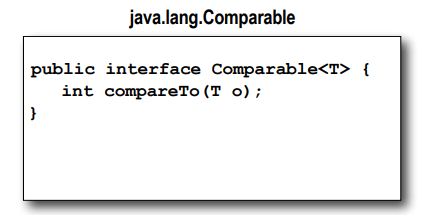

Büyük soru şudur: Bir Song'u diğerinden daha az, eşit veya daha büyük kılan nedir? Bu kararı vermeden Comparable
interface'ini implemente edemezsiniz

compareTo() methodunun dökümantasyonu şöyle der;

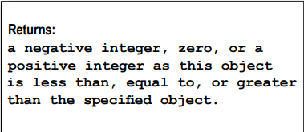

Görünüşe göre compareTo() methodu bir Song nesnesi üzerinde çağrılacak ve bu Song'a farklı bir Song referansı
geçirilecek. compareTo() methodunu çalıştıran Song'un, geçirilen Song'un listenin içinde daha yüksek, daha düşük veya
aynı sıralanması gerekip gerekmediğini anlaması gerekecektir.

Şimdi büyük göreviniz, bir Song'un diğerinden daha büyük kılınmasını neyin belirlediğini kararlaştırmak ve sonra bu
durumu yansıtmak için compareTo() methodunu uygulamaktır. Negatif bir sayı (herhangi bir negatif sayı), size geçirilen
Song'un, methodu çalıştıran Songdan daha büyük olduğunu gösterir. Pozitif bir sayı döndürmek, methodu çalıştıran
Song'un, compareTo() methoduna geçirilen Songdan daha büyük olduğunu belirtir. Sıfır döndürmek ise Songların eşit
olduğunu gösterir (en azından sıralama amacıyla... bu mutlaka aynı nesne oldukları anlamına gelmez). Örneğin, aynı
başlığa sahip iki Song'unuz olabilir.

(Bu ileriye yönelik farklı bir sorun çıkarır... daha sonra inceleyeceğiz...)

### The new, improved, comparable Song class

Title'a göre sıralama yapmak istediğimize karar verdik, bu nedenle compareTo() methodunu, methoddaki Song'un title'ini,
compareTo() methodunun çağrıldığı song'un title'i ile karşılaştırmak için uygularız. Başka bir deyişle, methodu
çalıştıran song'un title'inin, method parametresinin title'i ile nasıl karşılaştırılacağına karar vermesi gerekmektedir.
Hmmm... String sınıfının alfabetik sırayı bilmesi gerektiğini biliyoruz, çünkü sort() methodu bir String listesi
üzerinde çalıştı. String sınıfının bir compareTo() methodu olduğunu biliyoruz, öyleyse neden doğrudan onu çağırmayalım?
Bu şekilde bir title String'i sadece kendini başka bir title String'i ile karşılaştırabilir ve karşılaştırma/sıralama
algoritmasını yazmak zorunda kalmayız!

```
/* Genellikle bunlar eşleşir... implemente eden sınıfın karşılaştırılabileceği türü belirtiyoruz. Bu, Song nesnelerinin
sıralama amacıyla diğer Song nesneleriyle karşılaştırılabileceği anlamına gelir.*/

public class Song implements Comparable<Song>
```

```
@Override
/* sort() methodu, compareTo()'ya bir Song gönderir ve bu Song'un, methodun çağrıldığı Song ile nasıl
karşılaştırıldığını görür.*/
public int compareTo(Song s) {
    /* Basit! Sadece işi title String nesnelerine devrederiz, çünkü String'lerin bir compareTo() methodu olduğunu 
    biliyoruz.*/
    return title.compareTo(s.title);
}
```

Jukebox1 class'ı içerisinde Collections.sort() methodunu tekrar kullanıma alıyoruz;

```
private void go() {
    getSongs();
    System.out.println(songList);
    Collections.sort(songList);
    System.out.println(songList);
}
```

Title'a göre artık listemiz sıralandı.

### We can sort the list, but...

Yeni bir sorun var — Lou, song listesinin title'a göre bir görünümünü ve artist'e göre başka bir görünümünü istiyor!
Ancak bir koleksiyon öğesini karşılaştırabilir yapmak için (onun Comparable arayüzünü uygulayarak) sadece bir kez
compareTo() methodunu uygulama şansınız olur. Peki ne yapabilirsiniz?

Korkunç bir yol, Song sınıfında bir flag variable kullanmak ve sonra compareTo() içinde bir if testi yaparak,
karşılaştırma için başlığı mı yoksa sanatçıyı mı kullanacağınıza bağlı olarak farklı sonuçlar vermek olabilir.
Ancak bu korkunç ve kırılgan bir çözüm, ve çok daha iyi bir şey var. API'nin içine dahil edilmiş bir şey, aynı şeyi
farklı şekillerde sıralamak istediğinizde — bir şeyi birden fazla şekilde sıralamak istediğinizde.

Collections sınıfının API'sine tekrar bakın. İkinci bir sort() methodu daha var ve bir **Comparator** alır

sort() methodu, bir Comparator adında bir şeyi alacak şekilde overload edilmiştir.

Not: Artist'e göre sıralamak ve şarkıları Title yerine sıralamak için bir Comparator nasıl alınacağını/yapılacağını
anlamalıyım.

### Using a custom Comparator

Bir listedeki bir öğe, kendi türünden bir diğer öğeyle yalnızca kendi compareTo() methodu kullanarak bir şekilde
karşılaştırabilir. Ancak bir Comparator, karşılaştırdığınız öğe türüne dışsal bir öğedir - ayrı bir sınıftır. Bu nedenle
istediğiniz kadar çok tane oluşturabilirsiniz! Song'ları Artist'e göre mi karşılaştırmak istiyorsunuz? Bir
ArtistComparator oluşturun. Dakikada vuruş sayısına göre mi sıralamak istiyorsunuz? Bir BPMComparator oluşturun.

Sonra yapmanız gereken tek şey, List ve sıralamak için yardımcı olacak Comparator'ı alan overload edilmiş sort()
methodunu çağırmaktır.

Bir Comparator'ı alan sort() methodu, öğeleri sıralarken öğenin kendi compareTo() mnethodu yerine Comparator'ı
kullanacaktır. Başka bir deyişle, sort() methodunuz bir Comparator alırsa, listedeki öğelerin compareTo() methodunu
bile çağırmaz. Bunun yerine sort() methodu, Comparator üzerinde compare() methodunu çağıracaktır.

Kurallar şunlar:

- Tek bir argüman alan sort(List o) methodunu çağırmak, listenin öğelerinin compareTo() methodunun sıralamayı
  belirlediği anlamına gelir. Bu nedenle listedeki öğelerin Comparable interface'ini implement etmeleri GEREKİR.

- sort(List o, Comparator c) methodunu çağırmak, listenin öğelerinin compareTo() methodu çağrılmayacak ve yerine
  Comparator nesnesinin compare() methodu kullanılacaktır. Bu, listenin öğelerinin Comparable arayüzünü uygulamaları
  GEREKMEDİĞİ anlamına gelir.

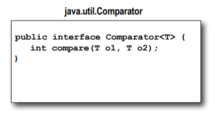

--**DIALOGS**--

Q : Bu, eğer implementasyonu Comparable olmayan bir sınıfınız varsa ve kaynak koduna sahip değilseniz, yine de bir
Comparator oluşturarak nesneleri sıralayabilir misiniz?

A : Evet, doğru. Diğer bir seçenek (mümkünse) öğenin alt sınıfını oluşturmak ve alt sınıfı Comparable interface'ini
implement edecek şekilde yapmaktır.

Q : Ama neden her sınıf Comparable interface'ini implemente etmez ?

A : Her şeyin sıralanabilir olduğuna gerçekten inanıyor musunuz? Eğer öğe türleri sıralanmaya uygun değilse,
Comparable uyguladığınızda diğer programcıları yanıltabilirsiniz. Ve Comparable'i uygulamamak büyük bir
risk de taşımaz, çünkü bir programcı kendi özel Comparator kullanarak her şeyi istediği şekilde karşılaştırabilir.

### Updating the Jukebox to use a Comparator

Bu kodda üç yeni şey yaptık:

1 - Bir Comparator implement eden bir inner sınıf oluşturduk (ve böylece önceden compareTo() tarafından yapılan işi
yapan compare() methodunu oluşturduk).

2 - Bir Comparator inner sınıfın instance'ini oluşturduk.

3 - Overload edilmiş sort() methodunu çağırdık, hem song listesini hem de Comparator inner sınıfının instance'ini
vererek.

```
public class Jukebox5 {
    ArrayList<Song> songList = new ArrayList<>();

    public static void main(String[] args) {
        new Jukebox5().go();
    }

    class ArtistCompare implements Comparator<Song>{
        @Override
        public int compare(Song o1, Song o2) {
            return o1.getArtist().compareTo(o2.getArtist());
        }
    }

    private void go() {
        getSongs();
        System.out.println(songList);
        ArtistCompare artistCompare = new ArtistCompare();
        Collections.sort(songList,artistCompare);
        System.out.println(songList);
    }

    private void getSongs() {
        try {
            File file = new File("SongListMore.txt");
            BufferedReader bufferedReader = new BufferedReader(new FileReader(file));
            String line = null;
            while((line = bufferedReader.readLine())!=null){
                addSong(line);
            }
        } catch (IOException e) {
            throw new RuntimeException(e);
        }
    }

    private void addSong(String lineToParse) {
        String[] tokens = lineToParse.split("/");
        Song nextSong = new Song(tokens[0],tokens[1],tokens[2],tokens[3]);
        songList.add(nextSong);
    }
}
```

Not: Title'a göre sıralamayı, Song sınıfındaki compareTo() methodunu title'ları kullanacak şekilde varsayılan sıralama
olarak belirledik. Ancak bunu tasarlamak için başka bir yol, hem title sıralamasını hem de artist sıralamasını iç içe
Comparator sınıfları olarak uygulamak ve Song'un hiç Comparable implemente etmemesi olabilir. Bu, her zaman
Collections.sort() methodunun iki argümanlı sürümünü kullanacağımız anlamına gelir.

### Uh-oh. The sorting all works, but now we have duplicates...

Sıralama mükemmel çalışıyor, şimdi hem title (Song nesnesinin compareTo() methodunu kullanılarak) hem de artist (
Comparator'ın compare() methodu kullanılarak) üzerinde nasıl sıralayacağımızı biliyoruz. Ancak test örneğiyle fark
etmediğimiz yeni bir sorun var — sıralanmış liste yinelenen öğeler içeriyor.

Diner jukebox'un, aynı şarkının zaten çalındığı (ve dolayısıyla yazıldığı) metin dosyasına bakmaksızın yazmaya devam
ettiği görünüyor. SongListMore.txt jukebox metin dosyası, çalınan her şarkının tam bir kaydını içerir ve aynı şarkıyı
birden çok kez içerebilir.

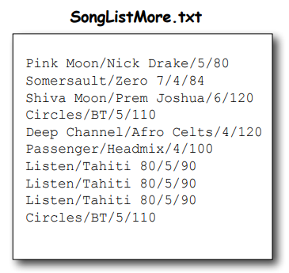

SongListMore metin dosyasında artık tekrarlayan öğeler bulunuyor, çünkü jukebox makinesi çalınan her song'u sırayla
yazıyor. Birisi "Listen" song'unu üç kez ardışık çalmaya karar verdi ve daha önce çalınmış bir şarkı olan "Circles"
song'uyla devam etti.

Metin dosyasının nasıl yazıldığını değiştiremeyiz çünkü bazen tüm bu bilgiye ihtiyacımız olacak. Java kodunu
değiştirmemiz gerekiyor.

### We need a Set instead of a List

Collection API'sinden üç ana interface buluyoruz: List, Set ve Map. ArrayList bir List'tir, ancak Set tam olarak
ihtiyacımız olan şey gibi görünüyor.

* LIST - Sıra önemli olduğunda İndeks konumunu bilen koleksiyonlar. Listeler, bir şeyin listede nerede olduğunu
  bilirler. Aynı nesneye referans veren birden fazla öğe olabilir.

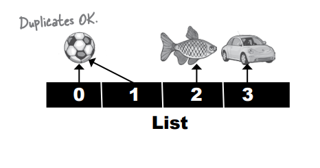

* SET - Tekillik önemli olduğunda. Tekrarlayan öğelere izin vermeyen koleksiyonlar. Set'ler bir şeyin koleksiyonda zaten
  olup olmadığını bilirler. Aynı nesneye birden fazla öğe asla referans veremez (veya eşit kabul edilen iki nesneye
  birden fazla öğe referans veremez - nesne eşitliği ne anlama geldiğine birazdan bakacağız).

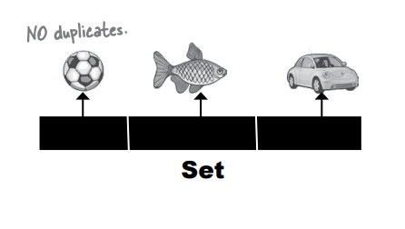

* MAP - Bir şeyi key ile bulmanın önemli olduğu durumlar için Key-Value çiftlerini kullanan koleksiyonlar. MAP, belirli
  bir Key ile ilişkilendirilen value'yu bilirler. Aynı değere referans veren iki Key'e sahip olabilirsiniz, ancak
  yinelenen Key'leriniz olamaz. Genellikle Key'ler tipik olarak String isimleridir (örneğin name/value özellik
  listeleri oluşturabilirsiniz), ancak bir Key herhangi bir nesne olabilir.

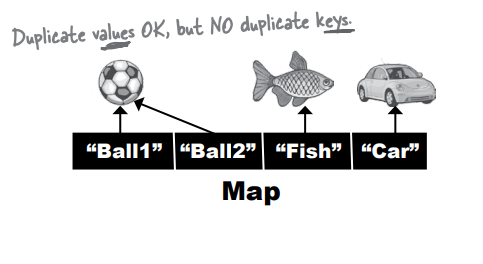

### The Collection API (part of it)

Dikkat edin ki Map interface'i aslında Collection interface'ini genişletmez, ancak Map hala "Collection Framework"ın (
ayrıca "Collection API" olarak da bilinir) bir parçası olarak kabul edilir. Bu nedenle Map hala Collection'dır, ancak
java.util.Collection'ı inheritance tree'lerinde içermezler.

(Not: Bu tamamlanmış bir koleksiyon API'si değildir; diğer sınıflar ve arayüzler vardır, ancak en çok ilgilendiğimiz
bunlardır.)

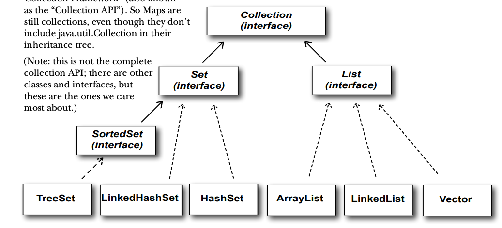

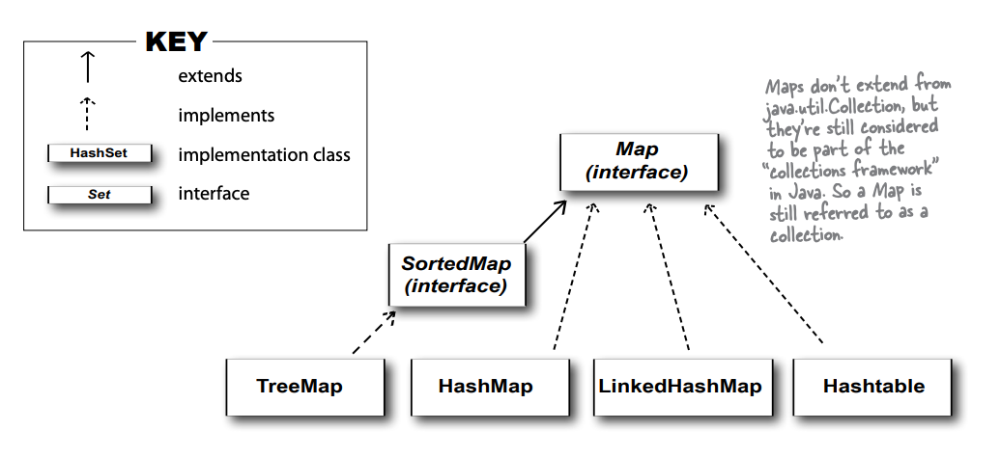

### Using a HashSet instead of ArrayList

Jukebox'a song'ları bir HashSet'e yerleştirmek için eklemeler yaptık. (Not: Jukebox kodunun bazı bölümlerini çıkardık,
ancak daha önceki sürümlerden kopyalayabilirsiniz. Ve çıktıyı daha kolay okumak için Song'un toString() methodunun
önceki sürümüne geri döndük, böylece sadece title yerine title ve artist'i yazdırır.)

```
public class Jukebox6 {
    ArrayList<Song> songList = new ArrayList<>();

    public static void main(String[] args) {
        new Jukebox6().go();
    }

    private void go() {
        getSongs();
        System.out.println(songList + "\n");
        Collections.sort(songList);
        System.out.println(songList + "\n");
        HashSet<Song> songSet = new HashSet<>(songList);
        System.out.println(songSet);
    }

    private void getSongs() {
        try {
            File file = new File("SongListMore.txt");
            BufferedReader bufferedReader = new BufferedReader(new FileReader(file));
            String line = null;
            while((line = bufferedReader.readLine())!=null){
                addSong(line);
            }
        } catch (IOException e) {
            throw new RuntimeException(e);
        }
    }

    private void addSong(String lineToParse) {
        String[] tokens = lineToParse.split("/");
        Song nextSong = new Song(tokens[0],tokens[1],tokens[2],tokens[3]);
        songList.add(nextSong);
    }
}
```

HashSet'e koyduktan sonra ve HashSet'i yazdırdıktan sonra (sort() methodunu tekrar çağırmadık). Set işe yaramadı!! Hala
tüm yinelemeleri (tekrarlanan öğeleri) sahipiz! Ve sıralama düzenini kaybetti. Listeyi bir HashSet'e yerleştirdiğimizde,
ancak bununla daha sonra ilgileneceğiz...

### What makes two objects equal?

lk olarak sormamız gereken soru: İki Song referansını aynı yapar mı? İkisi de eşit kabul edilmelidir. Bu sadece aynı
nesneye iki referans mı, yoksa aynı title'a sahip iki ayrı nesne mi?

Bu, referans eşitliği ile nesne eşitliği arasındaki temel bir konuyu gündeme getiriyor.

Eğer iki nesne foo ve bar eşit ise, foo.equals(bar) ifadesi true olmalıdır ve hem foo hem de bar hashCode() methodundan
aynı değeri döndürmelidir. Bir Set'in iki nesneyi yinelenen olarak işlemesi için, Object sınıfından miras alınan
hashCode() ve equals() methodlarını override etmeniz gerekmektedir, böylece farklı iki nesneyi eşit olarak kabul
edebilirsiniz.

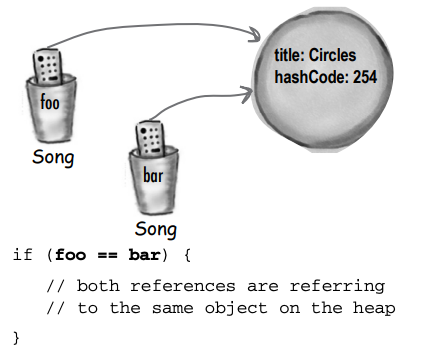

**Reference Equality**

Heap üzerinde İki referans, tek object;

Aynı nesneye işaret eden iki referans eşittir. Nokta. Her iki referansta hashCode() methodunu çağırırsanız, aynı sonucu
elde edersiniz. Eğer hashCode() methodunu override etmeseniz bile, varsayılan davranış (hatırlayın, bunu Object
sınıfından miras aldınız) her bir nesnenin unique bir sayı alacağıdır (Java'nın çoğu sürümü, nesnenin heap'teki
bellek adresine dayalı bir hashcode atar, böylece iki nesne aynı hashcode'a sahip olmaz).

Eğer iki referansın gerçekten aynı nesneyi mi işaret ettiğini öğrenmek istiyorsanız, == operatörünü kullanın, ki (
hatırlayın) variable'larda ki byte'ları karşılaştırır. Eğer her iki referans da aynı nesneyi işaret ediyorsa, byte'lar
aynı olacaktır.

**Object Equality**

İki referans, heap'teki iki farklı nesne, ancak nesneler anlamlı olarak eşdeğer kabul edilir.

Eğer iki farklı Song nesnesini eşit olarak kabul etmek isterseniz (örneğin, iki Song'un title değişkenlerinin
eşleştiği durumda iki Song'un aynı olduğuna karar verildiğini varsayalım), Object sınıfından miras alınan hem
hashCode() hem de equals() methodlarını override etmeniz gerekmektedir.

Yukarıda belirtildiği gibi, hashCode() methodunu override etmeseniz bile, varsayılan davranış (Object'ten gelen) her
nesneye unique bir hashcode değeri vermektedir. Bu nedenle, eşdeğer nesnelerin aynı hashcode'u döndürdüğünden emin
olmak için hashCode() methodunu override etmelisiniz. Ancak equals() methodunu da geçersiz kılmanız gerekmektedir,
böylece diğer nesneyi geçerek çağırdığınızda her iki nesne için de her zaman true değeri döndürür.

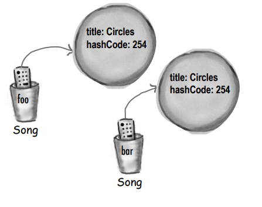

```
if (foo.equals(bar) && foo.hashCode() == bar.hashCode()) {
 // both references are referring to either a
 // a single object, or to two objects that are equal
}
```

### How a HashSet checks for duplicates: hashCode() and equals()

Bir nesneyi bir HashSet'e yerleştirdiğinizde, nesnenin hashcode değerini kullanarak nesneyi Set içinde nereye
yerleştireceğini belirler. Ancak aynı zamanda HashSet, nesnenin hashcode'unu HashSet içindeki diğer tüm nesnelerin
hashcode'larıyla karşılaştırır ve eşleşen bir hashcode yoksa, HashSet bu yeni nesnenin yinelenmediğini varsayar.
Diğer bir deyişle, hashcode'lar farklıysa, HashSet nesnelerin eşit olabileceği bir yol olmadığını varsayar!
Bu nedenle, nesnelerin aynı değere sahip olduğundan emin olmak için hashCode() methodunu override etmeniz
gerekmektedir.

Ancak aynı hashCode() değerine sahip iki nesne eşit olmayabilir (bununla ilgili daha fazla bilgi bir sonraki sayfada
verilecektir), bu nedenle HashSet, iki nesne için eşleşen bir hashcode bulursa - birini eklediğiniz ve biri zaten set'de
bulunan - HashSet daha sonra nesnelerin equals() methodlarından birini çağırarak bu hashcode eşleşen nesnelerin
gerçekten eşit olup olmadığını kontrol eder.

Ve eğer eşitlerse, HashSet, eklemeye çalıştığınız nesnenin Set içindeki bir şeyin yinelemesi olduğunu bilir, bu nedenle
ekleme gerçekleşmez. Bir exception almadınız, ancak HashSet'in add() methodu, yeni nesnenin eklenip eklenmediğini size (
önemliyse) söylemek için bir boolean değeri döndürür. Dolayısıyla add() methodu false döndürürse, yeni nesnenin zaten
kümede bulunan bir şeyin yinelenmesi olduğunu anlarsınız.

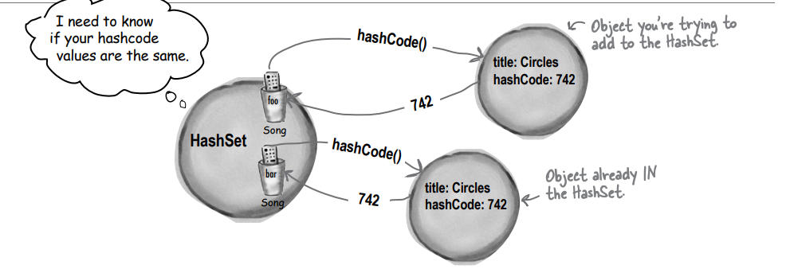

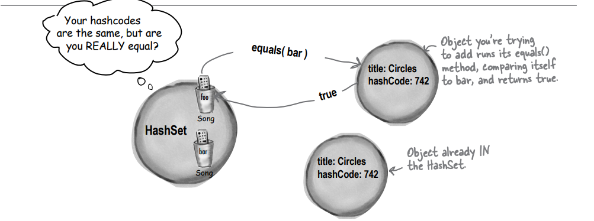

### The Song class with overridden hashCode() and equals()

Song class'ında hem equals hemde hashCode methodlarını override ediyorum;

```
// HashSet (veya bu methodu çağıran başka biri) ona başka bir Şarkı gönderir.
public boolean equals(Object aSong) {
    Song s = (Song) aSong;
    // HARİKA haber şu ki title bir String'dir ve String'lerin overridden edilmiş bir equals() methodu vardır. Bu 
    // nedenle yapmamız gereken tek şey bir title ifadesini diğer şarkının title'ina eşit olup olmadığını sormaktır.
    return getTitle().equals(s.getTitle());
}

public int hashCode(){
    // Burada da aynı durum söz konusu... String sınıfının overridden edilmiş bir hashCode() methodu bulunduğundan, 
    // sadece title üzerinde hashCode() methodunu çağırmanın sonucunu döndürebilirsiniz. hashCode() ve equals() 
    // methodlarının AYNI instance variable'ini kullandığını fark edin.
    return title.hashCode();
}
```

Şimdi işe yarıyor! HashSet'i yazdırdığımızda tekrarlamalar yok. Ancak sort() methodunu tekrar çağırmadık ve ArrayList'i
HashSet'e yerleştirdiğimizde, HashSet sıralama düzenini korumadı.

### HashCode() ve equals() için Java Object Yasası

**Object sınıfının API belgeleri, UYULMASI GEREKEN kuralları belirtir:**

* İki nesne eşitse, ONLARIN eşleşen hashcode'ları OLMALIDIR.
* İki nesne eşitse, her iki nesnede equals() methodu çağrıldığında true DEĞERİ dönmelidir. Diğer bir deyişle, eğer (
  a.equals(b)) ise (b.equals(a)).
* İki nesnenin aynı hashcode değeri varsa, bunların eşit olması GEREKMEZ. Ancak eşitlerse, AYNI hashcode değerine sahip
  OLMALIDIRLAR.
* Bu nedenle, equals() methodunu override ediyorsanız, hashCode() methodunu OVERRIDE ETMENIZ GEREKİR.
* hashCode() methodunun varsayılan behavior'u, heap'teki her nesne için unique bir integer oluşturmaktır. Bu nedenle bir
  sınıfta hashCode() methodunu override etmeseniz bile, o türden hiçbir iki nesne NİHAYETİNDE eşit kabul edilemez.
* equals() methodunun varsayılan behavior'u == karşılaştırması yapmaktır. Diğer bir deyişle, iki referansın heap'te tek
  bir nesneyi işaret edip etmediğini test eder. Bu nedenle bir sınıfta equals() methodunu override etmeseniz bile, iki
  nesne NİHAYETİNDE eşit kabul edilemez, çünkü farklı nesneleri işaret eden referanslar her zaman farklı bir bit deseni
  içerir.

a.equals(b) ifadesi aynı zamanda a.hashCode() == b.hashCode() ifadesini sağlamalıdır.

Ancak a.hashCode() == b.hashCode() ifadesi a.equals(b) ifadesini sağlamak ZORUNDA DEĞİLDİR.

--**DIALOGS**--

Q : Nasıl oluyor da hashcode'lar aynı olabiliyor? nesneler eşit olmasa bile?

A : HashSets, elemanları erişmeyi çok daha hızlı hale getirmek için hashcode'ları kullanarak elemanları depolar. Bir
ArrayList'te bir nesneyi, nesnenin bir kopyasını (bir index value yerine) vererek bulmaya çalışırsanız, ArrayList
baştan başlayarak her öğeyi tek tek kontrol ederek eşleşip eşleşmediğini kontrol etmek zorunda kalır. Ancak bir HashSet,
bir nesneyi çok daha hızlı bulabilir, çünkü hashcode'ları, elemanın depolandığı "kova" üzerinde bir tür etiket olarak
kullanır. Bu nedenle "Bu kopyasının tam olarak böyle bir nesneyi bulmasını istiyorum..." derseniz, HashSet, ona
verdiğiniz Song kopyasından (örneğin, 742) hashcode değerini alır ve ardından HashSet, "Oh, hashcode #742 olan nesnenin
tam olarak nerede depolandığını biliyorum..." der ve doğrudan #742 kovasına gider.

Bu, bir bilgisayar bilimi sınıfında öğreneceğiniz tam hikaye değil, ancak HashSets'i etkili bir şekilde kullanmak için
yeterlidir. Gerçekte iyi bir hashcode algoritması geliştirmek, birçok doktora tezinin konusudur ve bu kitapta ele almak
istediğimizden daha fazlasıdır.

Önemli olan, hashcode'ların aynı olabileceğidir; ancak bu, nesnelerin eşit olduğunu mutlaka garanti etmez, çünkü
hashCode() methodunda kullanılan "hashlama algoritması", birden fazla nesne için aynı değeri döndürebilir. Evet, bu
durum, birden çok nesnenin hepsinin HashSet içinde aynı kovada bulunabileceği anlamına gelir (her kova bir tek hashcode
değerini temsil eder), ancak bu dünyanın sonu değildir. Bu durum, HashSet'in biraz daha az verimli olabileceği anlamına
gelebilir (veya aşırı büyük bir nesne grubuyla dolu olabilir), ancak HashSet, aynı hashcode kovasında birden fazla nesne
bulursa, HashSet, bu mükemmel eşleşmeyi bulmak için hala equals() methodunu kullanır. Başka bir deyişle, hashcode
değerleri bazen aramayı daraltmak için kullanılır, ancak tek bir kesin eşleşmeyi bulmak için, HashSet hala aynı kova
içindeki tüm nesneleri (aynı hashcode'a sahip tüm nesneler için olan kova) alır ve ardından bu nesneyi aramak için
equals() methodunu çağırır.

### And if we want the set to stay sorted, we’ve got TreeSet

TreeSet, HashSet'e benzer şekilde yinelenen öğeleri önler; ancak aynı zamanda listeyi sıralı tutar. Bir TreeSet
oluştururken, setin parametresiz constructor'ini kullanırsanız, TreeSet her nesnenin compareTo() methodunu sıralama için
kullanır, tıpkı sort() methodu gibi. Ancak TreeSet constructor'ına bir Comparator geçerek, TreeSet'in bunun yerine bu
Comparator'ü kullanmasını sağlayabilirsiniz. TreeSet'in dezavantajı, sıralamaya ihtiyacınız olmasa bile, hala küçük bir
performans kaybı yaşamanızdır. Ancak çoğu uygulama için bu kaybın neredeyse fark edilemez olduğunu göreceksiniz.

```
private void go() {
    getSongs();
    System.out.println(songList);
    TreeSet<Song> songSet = new TreeSet<>(songList);
    System.out.println(songSet);
}
```

Constructor'ina hiçbirşey göndermediğimizde default olarak nesnenin compareTo() methodunu kullanacaktır. Biz kendimiz
constructor içerisine Comparator verebiliriz. Burada ide beni uyardığı için songList'i constructor'a geçtim, daha kısa
yazabilmek için.

```
public class TestTree {
    public static void main(String[] args) {
        new TestTree().go();
    }

    private void go() {
        Book b1 = new Book("How cats work");
        Book b2 = new Book("Remix your body");
        Book b3 = new Book("Finding emo");

        TreeSet<Book> bookSet = new TreeSet<>();
        bookSet.add(b1);
        bookSet.add(b2);
        bookSet.add(b3);
        System.out.println(bookSet);
    }
}

record Book(String title){
}
```

Yukarı daki örnek derlenmeyecektir. Çünkü Book nesnesi Comparable interface'ini implemente etmemiştir, ya da Comparator
tanımlamamıştır

### TreeSet elements MUST be comparable

TreeSet, nesnelerin nasıl sıralanması gerektiğini anlamak için programcının zihnini okuyamaz. Bu bilgiyi TreeSet'e sizin
belirtmeniz gerekir.

Bir TreeSet kullanmak için şunlardan biri doğru olmalıdır:

* Listedeki öğeler, Comparable interface'ini implements eden bir türden olmalıdır Book sınıfı Comparable interface'ini
  implement etmediği için çalışma zamanında çalışmaz. Düşünün, TreeSet'in tek amacı öğelerinizi sıralamaktır ve bir kez
  daha - Book nesnelerini nasıl sıralayacağı hakkında hiçbir fikri yok! Derleme zamanında başarısız olmaz, çünkü TreeSet
  add() methodu bir Comparable türü almadığı için add() methodu, TreeSet oluştururken kullandığınız türü alır. Başka bir
  deyişle, new TreeSet<Book>() derseniz, add() methodu özünde add(Book) olur. Ve Book sınıfının Comparable'ı uygulama
  gerekliliği yoktur! Ancak küme ikinci öğeyi eklemeye çalıştığınızda çalışma zamanında başarısız olur. Bu, kümenin bir
  nesnenin compareTo() methodlarından birini çağırmaya çalıştığı ve... başaramadığı anlamına gelir

```
record Book(String title) implements Comparable<Book>{
    @Override
    public int compareTo(Book o) {
        return title.compareTo(o.title);
    }
}
```

* Aşağıdaki, örnekte TreeSet'in overloaded constructor metodunu kullanıyorsunuz, bu bir Comparator alır. TreeSet, sort()
  methodu gibi çalışır — elemanın compareTo() methodunu kullanma seçeneğiniz vardır, eleman türünün Comparable
  interface'ini implements ettiği varsayılır, YA DA Set içinde ki öğeleri nasıl sıralayacağını bilen bir custom
  Comparator kullanabilirsiniz. Custom bir Comparator kullanmak için, TreeSet'i çağırırsınız. Bir Comparator alan yapıyı
  kullanarak.

```
class BookComparator implements Comparator<Book>{
    @Override
    public int compare(Book o1, Book o2) {
        return (o1.title().compareTo(o2.title()));
    }
}
```

```
private void go() {
    Book b1 = new Book("How cats work");
    Book b2 = new Book("Remix your body");
    Book b3 = new Book("Finding emo");

    BookComparator bookComparator = new BookComparator();
    TreeSet<Book> bookSet = new TreeSet<>(bookComparator);
    bookSet.add(b1);
    bookSet.add(b2);
    bookSet.add(b3);
    System.out.println(bookSet);
}
```

### We’ve seen Lists and Sets, now we’ll use a Map

Listeler ve Setler harika olsa da, bazen bir Map en iyi koleksiyondur (büyük "C" ile başlayan Collection değil unutmayın
ki Maplar Java koleksiyonlarının bir parçasıdır ancak Collection interface'ini implement etmezler). Bir property list
gibi davranan bir koleksiyona ihtiyaç duyduğunuzu hayal edin, name verildiğinde ve o name ile ilişkilendirilmiş value'yu
size veren. Key'ler genellikle String olsa da, herhangi bir Java nesnesi olabilirler (veya otomatik boxing aracılığıyla
bir primitive tür de olabilir).

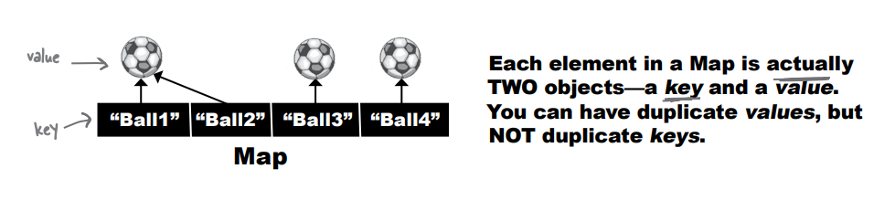

```
public class TestMap {
    public static void main(String[] args) {
        /* String KEY, Integer VALUE*/
        HashMap<String, Integer> scores = new HashMap<>();
        scores.put("Kathy", 42);
        scores.put("Bert", 343);
        scores.put("Skyler", 420);

        System.out.println(scores);
        /* get methodu KEY alır VALUE'yu döner */
        System.out.println(scores.get("Bert"));
    }
}
```

### Finally, back to generics

Bu bölümün daha önceki kısımlarında, Generic Typelarla argüman alan metodların nasıl garip olabileceğini konuştuğumuzu
hatırlıyor musunuz? Ve burada garip kavramını polimorfik anlamda kullandığımızı belirtmeliyiz. Eğer burada işler tuhaf
gelmeye başlarsa, sadece devam edin—hikayenin tamamını anlatmak birkaç sayfa alacaktır.
Önce array argümanlarının nasıl polimorfik bir şekilde çalıştığını hatırlatarak başlayacağız, sonra aynı şeyi generic
listelerle yapmayı inceleyeceğiz. Aşağıdaki kod hatalar olmadan derlenir ve çalışır:

```
abstract class Animal {
    void eat(){
        System.out.println("animal eating");
    }
}

class Dog extends Animal{
    void bark(){}
}

class Cat extends Animal{
    void meow(){};
}
```

Animal class hiyerarşisini gördükten sonra main class'ımızı yazalım

```
public class TestGenerics1 {
    public static void main(String[] args) {
        new TestGenerics1().go();
    }

    private void go() {
        /* Bir Animal array'i declare edin ve create edin, hem Dog hem de Cat barındıran. */
        Animal[] animals = {
                new Dog(),
                new Cat(),
                new Dog()
        };

        /* Dog array'i declare edin ve create edin. İçerisine Cat nesnesi alamaz*/
        Dog[] dogs = {
                new Dog(),
                new Dog(),
                new Dog()
        };

        takeAnimals(animals);
        takeAnimals(dogs);
    }

    /* Önemli nokta, takeAnimals() methodunun bir Animal[] veya Dog[] alabileceğidir, çünkü Dog IS-A Animal.
    Polimorfizm devrede.*/
    private void takeAnimals(Animal[] animals) {
        for(Animal a : animals){
            /* Unutmayın, sadece animal türünde tanımlanan methodları çağırabiliriz, çünkü animals parametresi bir
            Animal array'i türündedir ve herhangi bir değer dönüşü yapmadık. (Onu neye dönüştürürdük? Bu array hem
            Dog hem de Cat içerebilir.)*/
            a.eat();
        }
    }
}
```

### Using polymorphic arguments and generics

Yani array'ler ile nasıl çalıştığını gördük, ama bir array'den ArrayList'e geçtiğimizde aynı şekilde çalışır mı?
Mantıklı geliyor, değil mi? Önce, sadece Animal ArrayList'i ile deneyelim. go() methodunda sadece birkaç değişiklik
yaptık:

```
public class TestGenerics1 {
    public static void main(String[] args) {
        new TestGenerics1().go();
    }

    private void go() {
        ArrayList<Animal> animals = new ArrayList<>();
        animals.add(new Dog());
        animals.add(new Cat());
        animals.add(new Dog());

        takeAnimals(animals);
    }

    private void takeAnimals(ArrayList<Animal> animals) {
        for(Animal a : animals){
            a.eat();
        }
    }
}
```

### But will it work with ArrayList<Dog> ?

Polimorfizm sayesinde derleyici, bize Animal array'ini bir Animal array argümanına geçirmemize izin verdi. Bir sorun
yok. Ve ArrayList<Animal>, ArrayList<Animal> argümanına sahip bir methoda geçirilebilir. Peki büyük soru şu:
ArrayList<Animal> argümanı bir ArrayList<Dog> kabul edecek mi? Eğer array ile çalışıyorsa, burada da çalışmaması için
bir neden yok, değil mi?

```
private void go() {
    ArrayList<Animal> animals = new ArrayList<>();
    animals.add(new Dog());
    animals.add(new Cat());
    animals.add(new Dog());

    ArrayList<Dog> dogs = new ArrayList<>();
    dogs.add(new Dog());
    dogs.add(new Dog());

    takeAnimals(animals);
    takeAnimals(dogs); // compiler burada hata verecektir
}
```

Compiler hata verecektir. takeAnimals methodu Animal tipinde bir ArrayList istemektedir ama biz Dog tipinde bir
ArrayList gönderiyoruz

### What could happen if it were allowed...

Hayal edin ki derleyici size bununla ilgili izin veriyor. Bir ArrayList<Animal> olarak bildirilmiş bir methoda
ArrayList<Dog> geçmenize izin veriyor:

Bu methoda zararlı görünen bir şey yok, değil mi? Sonuçta, polimorfizmin temel amacı, bir Animal'ın yapabileceği her
şeyi (bu durumda eat() methodu), bir Dog'un da yapabilmesidir. Öyleyse her bir Dog referansı üzerinde eat()
çağrısının yapılmasında ne gibi bir sorun olabilir ki? Hiçbir şey. Hiçbir şey asla. Bu kodla herhangi bir sorun yok.
Ancak bunun yerine şu kodu hayal edin:

```
public void takeAnimals(ArrayList<Animal> animals) {
  animals.add(new Cat());
}
```

Korkunç!! Sadece Dog olabileceği bir ArrayList'e bir Cat ekledik. İşte sorun burada. Bir Cat'i ArrayList<Animal> içine
eklemenin kesinlikle bir sakıncası yok, ve bunun nedeni, Animal gibi bir üst türün ArrayList'ine tüm türlerdeki
hayvanları koyabilmenizdir.

Ancak eğer yalnızca Doglari içerecek şekilde tasarlanmış bir Dog ArrayList'ini, bu Animal ArrayList alan methoda
geçirirseniz, aniden Dog listesinde bir Cat ile karşılaşırsınız. Derleyici, sizi bu şekilde bir Dog ArrayList'ini
methoda geçirmeye izin verirse, birisi çalışma anında Dog listesine bir Cat ekleyebilir. Bu nedenle derleyici, bu
riski almanıza izin vermez.

Eğer bir methodu ArrayList<Animal> olarak bildirirseniz, yalnızca bir ArrayList<Animal> kabul edebilir, ArrayList<Dog>
veya ArrayList<Cat> kabul edemezsiniz.

Bir dakika bekleyin... eğer bu yüzden, gerçekte bir Dog listesi olan yere bir Cat eklemenizi engellemek için, sizi
bir Animal ArrayList alan bir methoda Dog ArrayList geçirmenize izin verilmiyorsa, neden array'lerde işe yarıyor?
Array'ler de aynı sorun olmaz mı? Hala bir Cat nesnesini bir Dog[] array'ine ekleyemez misiniz?

# Array types are checked again at runtime, but collection type checks happen only when you compile

Diyelim ki bir Dog[] array'ine bir Cat eklersiniz (bir Animal[] array2i olarak bildirilen bir method argümanına
geçirdiğiniz, array'ler için tamamen yasal bir atamadır).

```
public void go() {
    Dog[] dogs = {new Dog(), new Dog(), new Dog()};
    takeAnimals(dogs);
}
public void takeAnimals(Animal[] animals) {
    animals[0] = new Cat();
}
```

Biz bir Dog array'ine yeni bir Cat ekledik. Derleyici buna izin verdi, çünkü Cat array'i veya Animal array' methoda
geçirmiş olabilirsiniz, bu nedenle derleyici için bu durum olağandı. Compile edilirken kod PATLAR

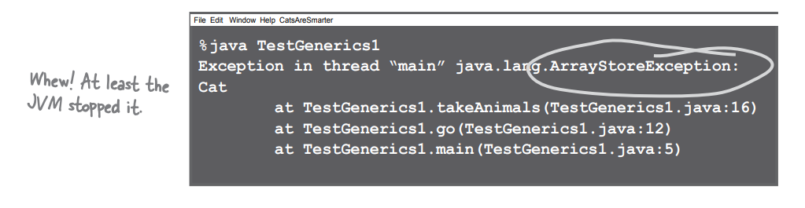

### Wildcards to the rescue

Bu görünüşte alışılmadık gibi gözüküyor, ancak herhangi bir Animal alt türünden gelen bir ArrayList'i kabul edebilecek
bir method argümanı oluşturmanın bir yolu var. En basit yol, bunun için açıkça Java diline eklenmiş olan bir
**wildcard** kullanmaktır

```
private void takeAnimals(ArrayList<? extends Animal> animals) {
    for(Animal a : animals){
        a.eat();
    }
}
```

Unutmayın, buradaki "extends" anahtar kelimesi, türe bağlı olarak ya "extends" ya da "implements" anlamına gelir. Bu
nedenle eğer Pet interface'ini uygulayan türlerin ArrayList'ini almak istiyorsanız, bunu şu şekilde bildirirsiniz:
ArrayList<? extends Pet>

Şimdi merak ediyorsunuz, "Nedir farkı? Önceki sorunla aynı sorun yaşanmıyor mu? Yukarıdaki method hiçbir tehlikeli şey
yapmıyor gibi görünüyor—herhangi bir Animal alt türünün sahip olacağı bir methodu çağırmak kesin garanti—ancak hâlâ
birisi bunu değiştirip bir Cat'i animals listesine ekleyemez mi? Hâlbuki gerçekte ArrayList<Dog> olan bir şeye bir
Cat eklemek mümkün. Ve bu runtime'da tekrar kontrol edilmediği için, bu wildcard kullanmadan bildirmekten ne
farkı var?"

Cevap HAYIR. Bildiriminizde <?> wildcard kullandığınızda, derleyici listenin büyümesine neden olabilecek herhangi bir
işlemi yapmanıza izin vermez!

Method argümanınızda Wildcard kullanarak, derleyici, method parametresi tarafından referans edilen listeye zarar
verebilecek herhangi bir işlemi yapmanızı ENGELLEYECEKTİR.

Hala liste elemanları üzerinde methodları çağırabilirsiniz, ancak liste elemanlarına yeni elemanlar ekleyemezsiniz.
Diğer bir deyişle, liste elemanlarıyla işlem yapabilirsiniz, ancak liste içine yeni şeyler ekleyemezsiniz.

Bu nedenle, derleyici, çalışma zamanında korkunç olabilecek herhangi bir işlemi yapmanıza izin vermeyeceğinden, çalışma
zamanında güvendesiniz. Bu nedenle, takeAnimals() içinde şunlar tamamen uygundur:

```
for(Animal a : animals){
    a.eat();
}
```

AMA aşağıdaki kod DERLENMEZ:

```animals.add(new Cat());```

### Alternate syntax for doing the same thing

Muhtemelen sort() methoduna baktığımızda, generic bir tür kullandığınızı hatırlarsınız, ancak tür parametresi dönüş
türünden önce bildirilen alışılmadık bir formattaydı. Bu, tür parametresini bildirmenin farklı bir yoludur, ancak
sonuçlar aynıdır:

```public <T extends Animal> void takeThink(ArrayList<T> list);```

Yukarıda ki kod ile aynı işi yapan:

```public void takeThing(ArrayList<? extends Animal> list)```

--**DIALOGS**--

Q : İkisi de aynı şeyi yapıyorsa, neden birini diğerine tercih edesiniz ki?

A : Hepsi, "T" yi başka bir yerde kullanmak isteyip istemediğinize bağlıdır. Örneğin, methodun iki argümanı olmasını
isterseniz - her ikisi de Animal türünü extend eden bir liste olsun - o zaman tür parametresini sadece bir kez bildirmek
daha verimlidir:

```public <T extends Animal> void takeThing(ArrayList<T> one, ArrayList<T> two)```

Yazmak Yerine:

```public void takeThing(ArrayList<? extends Animal> one, ArrayList<? extends Animal> two)```

