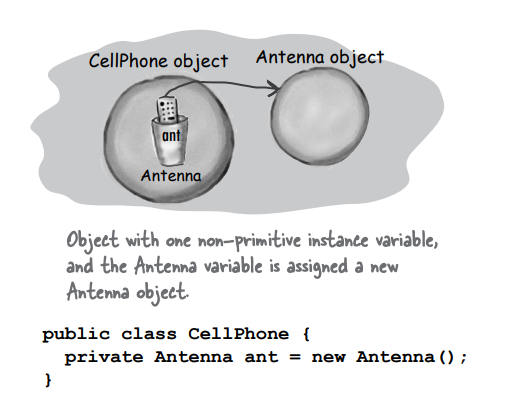

# Constructors And Garbage Collection

### Life and Death of an Object

Nesneler doğar ve nesneler ölür. Bir nesnenin yaşam döngüsünden siz sorumlusunuz.

Onu ne zaman ve nasıl oluşturacağınıza siz karar verirsiniz. Onu ne zaman yok edeceğinize de siz karar verirsiniz. Ancak
aslında nesneyi kendiniz yok etmezsiniz, sadece onu terk edersiniz. Fakat bir kez terk edildiğinde, kalpsiz Garbage
Collector (gc), nesnenin kullandığı belleği geri kazanarak onu buharlaştırabilir. Eğer Java ile kod yazacaksanız,
nesneler oluşturacaksınız demektir. Er ya da geç, bazılarını serbest bırakmak zorunda kalacaksınız, yoksa RAM'in tükenme
riskiyle karşı karşıya kalırsınız. Bu bölümde, nesnelerin nasıl oluşturulduğuna, yaşamları boyunca nerede bulunduklarına
ve onları verimli bir şekilde saklamak veya terk etmek için nasıl işlemler yapılacağına bakıyoruz. Bu, heap, stack,
scope (scope), constructorlar (constructors), üst constructorlar (super constructors), null referansları ve daha birçok
konuyu
içerir.

### The Stack and the Heap: where things live

Bir nesne oluşturduğunuzda gerçekte neler olduğunu anlayabilmek için biraz geriye gitmemiz gerekiyor. Java'da her şeyin
nerede ve ne kadar süreyle yaşadığı hakkında daha fazla bilgi edinmemiz gerekiyor. Bu, Stack ve Heap hakkında daha fazla
bilgi edinmemiz gerektiği anlamına gelir. Java'da, iki bellek alanı bizi ilgilendirir - nesnelerin yaşadığı alan (heap)
ve method "stack"larının ve local variables'ların yaşadığı alan (stack). Bir JVM başlatıldığında, temel işletim
sisteminden bir bellek parçası alır ve Java programınızı çalıştırmak için kullanır. Ne kadar bellek alındığı ve onu
ayarlayıp ayarlayamayacağınız, hangi JVM sürümü ve platformda çalıştığınıza bağlıdır. Ancak genellikle bununla ilgili
herhangi bir söz hakkınız olmaz. Ve iyi bir programlama yaparsanız, muhtemelen bundan pek de endişe
duymayacaksınız.Evet, tüm nesnelerin garbage-collectible-heap'te yaşadığını biliyoruz, ancak henüz variable'ların nerede
yaşadığına bakmadık. Bir variable'in nerede yaşadığı, o variable'in türüne bağlıdır. "Tür" olarak kastettiğimiz şey, (
örneğin primitive veya nesne referansı) tipi değil. Şu anda önemsediğimiz iki tür variable Instance Variables'leri ve
local variable'lardır. Local Variable'lar aynı zamanda "stack" variable'ları olarak da bilinir, bu da onların nerede
yaşadığına dair büyük bir ipucudur.


**INSTANCE VARIABLES**

Instance variables, bir sınıfın içinde tanımlanır, bir methodun içinde değil. Her bir nesnenin sahip olduğu "alanları"
temsil eder ve sınıfın her instance'i için farklı değerlerle doldurulabilir. Instance Variables'lar, kendi sahip
oldukları nesnenin içinde yaşarlar.

```
public class Duck{
    int size; // Every duck has a "size" instance variable
}
```

**LOCAL VARIABLES**

Local variables, bir methodun içinde, method parametreleri de dahil olmak üzere tanımlanır. Local variables'lar
geçicidir ve yalnızca method "stack'de" olduğu sürece yaşarlar (diğer bir deyişle, method kapanan süslü
paranteze ulaşana kadar).

```
public void foo (int x){ // x local variable
    int i = x + 3; // i local variable
    boolean b = true; // b local variable
}
```

### Methods are stacked

Bir methodu çağırdığınızda, method "stack frame'in" en üstüne yerleşir. "Stack'e" gerçekte eklenen yeni şey, stack
frame'dir ve bu, methodun durumunu içerir, yürütülmekte olan kod satırını ve tüm local variable'ların değerlerini tutar.

Stack'in en üstünde bulunan method, o stack için şu anda çalışan methoddur. Bir method, kapanan süslü paranteze ulaşana
kadar stack'de kalır (bu, methodun tamamlandığı anlamına gelir). Eğer method foo() method bar() methodunu çağırıyorsa,
method bar() method foo() methodunun üstüne stack'lenir.


```
public void doStuff(){
    boolean b = true;
    go(4);
}

public void go(int x){
    int z = x + 24;
    crazy();
}

public void crazy(){
    char c = 'a';
}
```

Yukarıda ki kod, üç methoda sahiptir (geri kalan sınıfın nasıl olduğu önemli değildir). İlk method (doStuff()),
ikinci methodu (go()) çağırır ve ikinci method üçüncüyü (crazy()) çağırır. Her method, methodun gövdesi
içinde bir tane local variable tanımlar ve method go(), bir de parametre variable'i tanımlar (bu, go() metodunun iki
local variable'a sahip olduğu anlamına gelir).


### What about local variables that are objects?

Hatırlayın, primitive olmayan (non-primitive) bir variable, nesnenin kendisi değil, nesneye bir referans tutar.
Nesnelerin heap'te yaşadığını zaten biliyorsunuz. Onların nerede bildirildiği veya oluşturulduğu önemli değil. Eğer
local variable bir nesneye bir referanssa, sadece variable (referans/uzaktan kumanda), stack'de olur. Nesnenin kendisi
hala heap'te bulunur.

```
public class StackRef {
 public void foof() {
    barf();
 }
 public void barf() {
    Duck d = new Duck(24);
 }
}
```


Java'da Stack ve Heap'in temellerini bilmek, variable scope, nesne oluşturma sorunları, bellek yönetimi, iş
parçacıkları (threads) ve exception handling konularını anlamak istiyorsanız önemlidir. İş parçacıkları ve exception
handling konularını daha sonraki bölümlerde ele alıyoruz, ancak diğer konuları bu bölümde öğreneceksiniz. Bir JVM
ve/veya platformda Stack ve Heap'in nasıl uygulandığı hakkında herhangi bir şey bilmek zorunda değilsiniz. Stack ve Heap
hakkında bilmeniz gereken her şey bu sayfada ve önceki sayfada mevcuttur. Eğer bu sayfaları iyi anlarsanız, bu konuya
dayalı diğer tüm konular çok daha kolay anlaşılacaktır.

**BULLET POINTS**

* Java'nın dikkat ettiğimiz iki bellek alanı vardır: Stack ve Heap
* Instance Variables, bir sınıfın içinde, herhangi bir methodun dışında tanımlanan variable'lardır
* Local Variables, bir methodun içinde veya method parametresi olarak tanımlanan variable'lardır
* Tüm local variable'lar, bildirildiği methoda ait stack frame'de yaşar.
* Nesne referans variable'ları, primitive variable'lar gibi çalışır. Eğer referans, local bir variable olarak
  tanımlandıysa, stack'de bulunur.

### If local variables live on the stack, where do instance variables live?

new CellPhone() ifadesi kullanıldığında, Java, bu CellPhone için Heap'te yer ayırmak zorundadır. Ancak ne kadar alan
ayrılacağını düşünün? Yeterli alan, nesnenin sahip olduğu tüm instance variable'larını içerecek kadar olmalıdır. Evet,
instance variable'ları, nesneye ait oldukları için Heap'te yaşarlar.

Instance variable'ların değerleri nesnenin içinde yaşar. Eğer Instance variable'larının hepsi primitive türlerse, Java,
primitive türlerin tipine bağlı olarak Instance variable'ları için alan oluşturur. Bir int için 32 bit, bir long için 64
bit gibi. Java, primitive variable'ların içindeki değerlerle ilgilenmez; bir int variable'in bit boyutu (32 bit) değeri
32.000.000 veya 32 olsun, aynıdır.

Eğer Instance variables'ları nesneler ise? Mesela, CellPhone sınıfında Antenna adında bir nesne variableni varsa? Yani
CellPhone, Antenna türünde bir referans variablenine sahip.

Yeni bir nesnenin Instance variables'ları, primitive türler yerine nesne referansları içeriyorsa, gerçek soru şu olur:
Nesne, referans gösterdiği tüm nesneler için alan ayırmalı mı? Cevap, tam olarak değil. Ne olursa olsun, Java instance
variable değerleri için alan ayırmalıdır. Ancak hatırlayın ki, bir referans variablen değeri nesnenin tamamı değildir,
sadece nesnenin uzaktan kumandasıdır. Yani eğer CellPhone sınıfında, primitive olmayan (non-primitive) Antenna türünde
bir instance variable'i varsa, Java sadece CellPhone nesnesi içinde Antenna'nın uzaktan kumandası için (yani referans
variableni için) alan oluşturur, Antenna nesnesi için değil

Antenna nesnesi ne zaman Heap'te yer alır? İlk olarak, Antenna nesnesinin kendisinin ne zaman oluşturulduğuna bakmamız
gerekiyor. Bu, Instance variable'ın bildirimiyle ilgilidir. Eğer instance variable bildirilir, ancak ona henüz bir nesne
atanmazsa, sadece referans variableni (uzaktan kumanda) için alan oluşturulur. ```private Antenna antenna;```

Gerçekten de, eğer referans variableni bir Antenna nesnesine atanmazsa, o zaman Heap'te bir Antenna nesnesi
oluşturulmaz.

```private Antenna antenna = new Antenna();```

**Images**

  

### The miracle of object creation

Şimdi variablenlerin ve nesnelerin nerede bulunduğunu bildiğimize göre, nesne oluşturmanın gizemli dünyasına
dalabiliriz.
Nesne bildirimi ve atama işleminin üç adımını hatırlayalım: bir referans variableni declare etme, bir nesne oluşturma ve
nesneyi referansa atama.
Ancak şu ana kadar, ikinci adım — yeni nesnenin "doğduğu" mucizenin gerçekleştiği adım — Büyük Bir Gizem olarak
kalmıştır. Nesne hayatının gerçeklerini öğrenmeye hazırlanın.


### Are we calling a method named Duck()? Because it sure looks like it.


new Duck(); bu sanki method çağrısı gibi? Hayır bu bir Duck constructor'i çağrısı

Bir constructor, görünüm ve his olarak bir method'a oldukça benzer, ancak bir method değildir. Bir nesne
oluşturduğunuzda çalışan kodu içerir. Başka bir deyişle, bir nesne instantiate edildiğinde çalışan kodu içerir.

Bir constructor'ı çağırmak için tek yol, sınıf adından sonra gelen "new" anahtar kelimesini kullanmaktır. JVM (Java
Sanal Makinesi), o sınıfı bulur ve o sınıftaki constructor'ı çağırır. (Teknik olarak bu constructor'ı çağırmak
için tek yol değildir. Ancak bu, constructor dışında bir yerden constructor'ı çağırmak için kullanılan tek yoldur.
Bir constructor'ı, belirli kısıtlamalarla, başka bir constructor içerisinden çağırabilirsiniz.

### But where is the constructor? If we didn’t write it, who did?

Sınıfınız için bir constructor yazabilirsiniz (şimdi bunu yapacağız), ancak yazmazsanız, derleyici sizin için bir tane
yazar!

Derleyicinin varsayılan constructorsı nasıl görünür:

```
public Duck() {

}
```

### Notice something missing? How is this different from a method?


Constructor'ın adı Sınıf ismi ile aynı olmalıdır

### Construct a Duck

Bir constructor fonksiyonunun temel özelliği, nesne bir referansa atanmadan önce çalışmasıdır. Bu, nesnenin
kullanıma hazır hale getirilmesi için adımlar atma şansı elde ettiğiniz anlamına gelir. Başka bir deyişle, nesnenin
uzaktan kumandasını herhangi biri kullanmadan önce, nesne kendini oluşturma şansına sahiptir. Duck constructor'ında
faydalı bir şey yapmıyoruz, ancak yine de olayların sırasını gösteriyor.

```
public class Duck {
    public Duck(){
        System.out.println("Quack"); // Constructor code
    }
}
```

Duck class'ını UseADuck class'ında kullanıyorum;

```
public class UseADuck {
    public static void main(String[] args) {
        Duck duck = new Duck(); // Duck() call'u Duck nesnesinin constructor'ini çağırır
    }
}
```


### Initializing the state of a new Duck

Çoğu insan, constructor'ları bir nesnenin durumunu başlatmak için kullanır. Başka bir deyişle, nesnenin instance
variables'larına değer atamak ve oluşturmak için constructor'ları kullanır.

```
public Duck(){
    size = 35;
}
```

Bütün bu işler, Duck sınıfı geliştiricisi, Duck nesnesinin ne kadar büyük olması gerektiğini bildiğinde güzel ve iyi
olur. Peki ya, Duck'ı kullanan programcının belirli bir Duck nesnesinin ne kadar büyük olması gerektiğine karar vermek
istediği durumda ne olacak?

Duck sınıfının bir "size" instance variable'i olduğunu ve Duck sınıfını kullanan programcının yeni bir Duck
nesnesinin boyutunu belirlemesini istediğinizi düşünelim. Bunu nasıl yapardık?

Tabii, sınıfa bir setSize() setter methodu ekleyebilirsiniz. Ancak bu, Duck'ı geçici olarak boyutsuz bırakır, ve Duck
kullanıcısını Duck'ın boyutunu ayarlamak için iki ifade yazmaya zorlar - bir tanesi Duck oluşturmak için ve diğeri
setSize() methodunu çağırmak için. Aşağıdaki kod, yeni Duck'ın başlangıç boyutunu ayarlamak için bir ayarlama methodu
kullanır.

```
public class Duck {
    int size; // instance variable

    public Duck(){
        System.out.println("Quack"); // constructor
    }

    public void setSize(int size){ // setter method
        this.size = size;
    }
}
```

```
public class UseADuck {
    public static void main(String[] args) {
        Duck duck = new Duck();
        duck.setSize(42);
    }
}
```

İşte burada kötü bir durum var. Kodun bu noktasında, Duck canlı, ancak "size" yok! Ve sonra Duck kullanıcısının,
Duck oluşturmanın iki aşamalı bir süreç olduğunu BİLMESİne bağlısınız: biri constructor'ı çağırmak için, diğeri ise
setter'i çağırmak için.

Eğer Compiler senin için bir constructor oluşturuyorsa, sen neden bir constructor yazmaya çalışıyorsun?

Eğer nesnenizi başlatmak ve kullanıma hazır hale getirmek için kod yardımı gerekiyorsa, kendi constructor (constructor)
metodunuzu yazmanız gerekecektir. Örneğin, nesneyi tamamlamadan önce kullanıcıdan gelecek bir inputa bağlı
olabilirsiniz. Kendi constructor koduna ihtiyacınız olmasa bile, başka bir nedenle bir constructor yazmanız gerekebilir.
Bu, superclass constructor'ı ile ilgili bir durumdur ve birkaç dakika içinde bundan bahsedeceğiz.

Java'da sınıfınızla aynı isme sahip bir metot (method) bildirebilirsiniz. Ancak bu, o metotun bir constructor
olduğu anlamına gelmez. Metotları bir constructor'dan ayıran şey, geri dönüş tipidir (return type). Metotlar bir geri
dönüş tipine sahip olmalıdır (void dâhil), ancak constructor'lar bir geri dönüş tipine sahip olamazlar

### Using the constructor to initialize important Duck state*

Eğer bir nesnenin (instance variable'ları) bir veya daha fazla kısmı başlatılıncaya kadar kullanılmaması gerekiyorsa,
Duck nesnesine hiç kimse başlangıç işlemleri tamamlanıncaya kadar sahip olmamalıdır! Yeni bir Duck nesnesi oluşturan ve
henüz kullanıma hazır olmayan bir nesneyi, kimsenin setSize() metodunu çağırmadan elde etmesine izin vermek genellikle
çok risklidir. Duck kullanıcısı, yeni Duck nesnesini oluşturduktan sonra setter metodunu çağırması gerektiğini nasıl
bilecek?
Başlatma kodunu koymak için en iyi yer constructor metoddur. Tek yapmanız gereken, argümanları olan bir constructor
oluşturmaktır.

```
public class Duck {
    int size;

    public Duck(int duckSize){
        System.out.println("Quack");
        this.size = duckSize;
        System.out.println("Size of duck : " + size);
    }
}
```

```
public class UseADuck {
    public static void main(String[] args) {
        Duck duck = new Duck(42); // tek statement ile size set edildi
    }
}
```

### Make it easy to make a Duck - Be sure you have a no-arg constructor

Eğer Duck constructor'ı bir argüman alıyorsa ne olurdu? Bunu düşünelim. Önceki sayfada, sadece bir Duck constructor'ı
vardı ve bu, Duck'ın "size'ı" için bir integer argüman alıyordu. Bu belki büyük bir sorun olmayabilir, ancak bir
programcının yeni bir Duck nesnesi oluşturması daha da zorlaşır, özellikle eğer programcı Duck'ın hangi boyutta olması
gerektiğini bilmiyorsa. Duck için varsayılan bir boyutu olması kullanıcıya yardımcı olmaz mıydı? Böylece, kullanıcı
uygun bir boyut bilmiyorsa bile çalışan bir Duck oluşturabilirdi.

Hayal edelim ki Duck kullanıcılarının Duck oluşturmak için İKİ seçeneği olsun:

* Birincisi, Duck boyutunu kendileri belirlesinler (constructor argümanı olarak vererek)
* İkincisi ise boyut belirtmeden varsayılan Duck boyutunu alsınlar.

Bunu sadece tek bir constructor ile düzgün bir şekilde yapamazsınız. Unutmayın, bir methodda (veya constructor'da - aynı
kurallar geçerli) bir parametre varsa, o methodu veya constructor'ı çağırdığınızda uygun bir argüman geçirmeniz gerekir.
Sadece "Eğer birisi constructor'a bir şey geçirmezse, varsayılan boyutu kullan" demek de mümkün değildir, çünkü bir
integer argümanını constructor çağrısına göndermeden bile derlenmesi sağlanamaz. Şöyle dolambaçlı bir şey
yapabilirsiniz:

```
public class Duck {
    int size;

    public Duck(int duckSize) {
        if (duckSize == 0){
            this.size = 27;
        } else {
            this.size = duckSize;
        }
    }
}
```

Eğer duckSize parametresi 0 olarak girilirse size default olarak 27'ye set edilecek

Ancak bu, yeni bir Duck nesnesi oluşturan programcının, "0" geçmenin varsayılan Duck boyutunu elde etmek için
kullanılacak protokol olduğunu bilmesi gerektiği anlamına gelir. Oldukça karışık bir yöntemdir. Ya diğer programcı bunu
bilmiyorsa? Veya gerçekten sıfır boyutlu bir Duck istemek istiyorsa? (Varsayılan olarak sıfır boyutlu Duck nesnelerini
kabul ediyorsak.) Yani, bazen gerçek "Boyut olarak sıfır istiyorum" constructor argümanı ile "Sana sıfır gönderiyorum,
böylece varsayılan boyutu vereceksin, ne olursa olsun" constructor argümanını ayırt etmek her zaman mümkün olmayabilir.

### You really want TWO ways to make a new Duck:

```
public class Duck2 {
    int size;

    public Duck2(){
        this.size = 27;
    }

    public Duck2(int size){
        this.size = size;
    }
}
```

Bu "Duck yapmak için iki seçenek" fikri, iki constructor'a ihtiyaç duyar. Bir tane int değer alan ve bir tane almamış
olan. Bir sınıfta birden fazla constructor varsa, bu, aşırı yüklenmiş (overloaded) constructor'lar olduğu anlamına
gelir.

### Doesn’t the compiler always make a no-arg constructor for you? NO

Eğer sadece argümanları olan bir constructor yazarsanız, derleyicinin parametresiz bir constructor ekleyeceğini
düşünebilirsiniz, ancak bu işleyiş tarzı değildir. Derleyici, constructor'larla ilgili yalnızca tamamen constructor'lar
hakkında herhangi bir şey söylemediğinizde devreye girer.

Yani, eğer sınıfınızda hiçbir constructor tanımlamazsanız, derleyici sizin için otomatik olarak bir parametresiz
constructor ekleyecektir. Ancak eğer en az bir constructor tanımlarsanız (hem parametresiz hem de argüman alan),
derleyici otomatik bir constructor eklemeyecektir. Bu durumda, sınıfın başka bir yerinde parametresiz constructor'a
ihtiyacınız varsa, onu sizin kendiniz tanımlamanız gerekir.

Eğer argüman alan bir constructor tanımlarsanız ve hala parametresiz bir constructor'a ihtiyacınız varsa, parametresiz
constructor'ı kendiniz oluşturmanız gerekecektir.

Eğer herhangi bir türden bir constructor tanımlarsanız, yani herhangi bir constructor fonksiyon eklerseniz,
derleyici geri çekilir ve size "Tamam, Dostum, görünüşe göre sen constructorların sorumluluğundasın!" der. Eğer
sınıfınızda birden fazla constructor varsa, bu durumda aşırı yüklenmiş (overloaded) constructorlarınız var demektir

Bir sınıfta birden fazla constructor varsa, constructorların mutlaka farklı argüman listelerine sahip olmaları
gerekir. Argüman listesi, argümanların sırasını ve türlerini içerir. Eğer bu argüman listeleri farklı ise, sınıfta
birden fazla constructor oluşturabilirsiniz. Bu, metotlarla da aynı şekilde çalışır, ancak metotlarla ilgili konuya
başka bir bölümde değineceğiz.

Overloaded constructor'lar, sınıfınızda birden fazla constructor'a sahip olduğunuz anlamına gelir. Derlemek için
her constructor'ın farklı bir argüman listesi olmalıdır!

Aşağıdaki sınıf yasaldır çünkü tüm beş constructor'ın farklı argüman listeleri vardır. Örneğin, sadece bir tamsayı (
int) alan iki constructor'ınız olsaydı, sınıf derlenmeyecekti. Parametre variablenine verdiğiniz ad önemli değildir.
Önemli olan, variablen türü (int, Dog vb.) ve sırasıdır. İki adet aynı türde constructor'ınız olabilir, ancak sıraları
farklı olmalıdır. Bir String'i takiben bir tamsayıyı (int) alan bir constructor, bir tamsayıyı takiben bir String alan
bir constructor ile aynı değildir.

```
public class Mushroom {
    public Mushroom(int size) {
    }

    public Mushroom() {
    }

    public Mushroom(boolean isMagic) {
    }

    public Mushroom(boolean isMagic, int size) {
    }

    public Mushroom(int size, boolean isMagic) {
    }
}
```

Son iki constructor'a bakalım. İkisinin de argümanları aynı ama sıralamaları farklı. Problem yok

**BULLET POINTS**

* Instance Variables'lar, ait oldukları nesne içinde Heap'te bulunur.
* Eğer Instance Variables bir nesneye referans ise, hem referans hem de ona referans olan nesne Heap'te bulunur.
* Bir constructor, bir sınıf türü üzerinde "new" anahtar kelimesi kullanıldığında çalışan kod parçacığıdır.
* Bir constructor'ın adı sınıfın adıyla aynı olmalıdır ve bir dönüş türü olmamalıdır.
* Bir constructor'i kullanarak oluşturulan nesnenin durumunu (Instance Variables'lari) başlatmak için kullanabilirsiniz.
* Eğer sınıfınıza bir constructor koymazsanız, derleyici varsayılan bir constructor ekleyecektir.
* Varsayılan constructor her zaman argümansızdır (no-arg constructor).
* Eğer sınıfınıza herhangi bir constructor koyarsanız, derleyici varsayılan constructor'ı oluşturmayacaktır.
* Eğer argümanları olan bir constructor eklediyseniz ve aynı zamanda argümansız bir constructor'a da ihtiyacınız varsa,
  argümansız constructor'ı kendiniz oluşturmanız gerekecektir.
* İmkânınız varsa her zaman argümansız bir constructor sağlayın, böylece diğer programcıların çalışan bir nesne
  oluşturmasını kolaylaştırın. Varsayılan değerler ekleyin.
* Overloaded edilmiş constructorlar, sınıfınızda birden fazla constructor'ınız olduğu anlamına gelir.
* Overloaded constructorlar farklı argüman listelerine sahip olmalıdır.
* Aynı argüman listesine sahip iki constructor'ınız olamaz. Argüman listesi, argümanların sırasını ve/veya türünü
  içerir.
* Instance variables'lar, açıkça bir değer atanmasa bile varsayılan bir değerle atanır. Varsayılan değerler, primitives
  türler için 0/0.0/false ve referanslar için null'dır.

Argümansız bir constructor sağlamak, bazı durumlarda faydalı olsa da, tüm instance variables'ları için anlamlı
varsayılan değerler belirlemek mümkün olmayabilir veya uygun olmayabilir. Bu tür durumlarda, sınıfınızda argümansız bir
constructor'a sahip olmak gereksiz veya hatta mümkün olmayabilir.

Bazı durumlarda, argümansız bir constructor'ın mantıklı olmadığı zamanlar vardır. Java API'sinde bu durumu
göreceksiniz - bazı sınıfların argümansız bir constructor'ı yoktur. Örneğin, Color sınıfı bir renk temsil eder.
Color nesneleri, örneğin ekran yazı tipi veya GUI düğmesinin rengini ayarlamak veya değiştirmek için kullanılır. Bir
Color örneği oluşturduğunuzda, bu örnek belirli bir rengin bir temsilcisidir (örneğin, "Çikolata Kahvesi Rengi," "Mavi
Ekran Rengi," "Skandal Kırmızısı" vb.). Bir Color nesnesi oluşturursanız, rengi belirlemek zorundasınız.

```Color c = new Color(3,45,200);```

(Şu anda RGB değerleri için üç tamsayı kullanıyoruz. Swing bölümlerinde ileride Color kullanımına geçeceğiz.) Aksi
takdirde, ne elde edersiniz? Java API programcıları, eğer argümansız bir Color constructor çağırırsanız güzel bir leylak
rengi tonu alabileceğinizi kararlaştırabilirdi. Ancak iyi zevk galip geldi. Eğer bir argüman belirtmeden bir Color
yapmaya çalışırsanız:

```Color c = new Color();```

Derleyici, Color sınıfında eşleşen bir argümansız constructor bulamadığı için hata verir.

### Nanoreview: four things to remember about constructors

1 - Bir constructor, bir sınıf türü üzerinde "new" anahtar kelimesi kullanıldığında çalışan kod parçacığıdır.

```Duck d = new Duck();```

2 - Constructor, class ismiyle aynı isme sahip olmalı ve return type'ı olmamalıdır

```public Duck(int size) { }```

3 - Bir sınıfta herhangi bir constructor tanımlamazsanız, Java derleyicisi otomatik olarak bir varsayılan constructor
ekler. Varsayılan constructor, her zaman parametresiz bir constructor'dır (no-arg constructor).

```public Duck() { }```

4 - Bir sınıfta, argüman listeleri farklı olan birden fazla constructor tanımlayabilirsiniz. Bu durumda, sınıfta birden
fazla constructor olması, "overloaded constructors" (aşırı yüklenmiş constructorlar) olarak adlandırılır.

```
public Duck() { }
public Duck(int size) { }
public Duck(String name) { }
public Duck(String name, int size) { }
```

Java'da constructorlar, public, protected, private veya hiçbir erişim belirleyici olmadan (default) olabilir.
Özellikle "private" olarak işaretlenen bir şeyin kimse tarafından erişilemeyeceği anlamına gelmez, sadece bu, sınıf
dışından erişilemeyeceği anlamına gelir. Sanırım "Catch 22" durumunu düşünüyorsunuz. Bir sınıf private bir constructor'a
sahip olduğunda, yalnızca aynı sınıftan gelen kod, o sınıftan yeni bir nesne oluşturabilir. Ancak önce bir nesne
oluşturmadan, o sınıftan kodları nasıl çalıştırırsınız? O sınıfta bulunan herhangi bir şeye nasıl erişirsiniz?

### Wait a minute... we never DID talk about superclasses and inheritance and how that all fits in with constructors.

Son bölümden hatırlayın, Snowboard sınıfının Nesne bölümünü temsil eden iç çekirdek etrafında sarıldığı kısmı
incelediğimiz yer. Büyük nokta şu ki, her nesne yalnızca kendi tanımlanan instance variables'larını değil, aynı zamanda
en azından super class'ın tüm öğeleri de içerir (çünkü her sınıf Nesne'den türetilir).

Bir nesne oluşturulduğunda (çünkü birisi new dedi; sınıf türü üzerinde başka bir nesne oluşturma yolunuz yoktur), nesne
miras ağacındaki tüm instance variables'ları için alan alır. Bir an için düşünelim... Bir üst sınıf, private bir
variable'i kapsayan setter methodlara sahip olabilir. Ancak bu variable'in bir yerde yaşaması gerekiyor. Bir nesne
oluşturulduğunda, sanki birden fazla nesne belirir - new ile oluşturulan nesne ve her bir üst sınıf için birer nesne.
Kavramsal olarak, bunu aşağıdaki resimde gösterildiği gibi düşünmek çok daha iyi:


### The role of superclass constructors in an object’s life

Bir nesnenin miras ağacındaki tüm constructor'lar, yeni bir nesne oluşturulduğunda çalışmalıdır. Bu gerçeği sindirin.
Bu, her üst sınıfın bir constructor'a sahip olduğu anlamına gelir (çünkü her sınıfın bir constructor'ı vardır) ve
alt sınıfın her bir constructor'ının, alt sınıfın bir nesnesi oluşturulduğunda hiyerarşi boyunca çalışır.

"new" demek büyük bir olaydır. Bu, tüm constructor zincir reaksiyonunu başlatır. Ve evet, abstract sınıfların bile
constructorları vardır. Abstract bir sınıfa "new" denilemez, ancak abstract bir sınıf hala bir üst sınıftır, bu nedenle
concrete bir alt sınıfın bir örneği oluşturulduğunda onun constructor'ı çalışır.

Super constructor'lar, nesnenin üst sınıf kısımlarını oluşturmak için çalışır. Unutmayın, bir alt sınıf, üst sınıfın
durumuna bağlı olan methodları miras alabilir (diğer bir deyişle, üst sınıfın instance variables'larının değeri). Bir
nesnenin tam olarak oluşturulmuş olması için kendisine ait olan tüm üst sınıf kısımlarının da tam olarak oluşturulmuş
olması gereklidir ve bu nedenle super constructor'ın çalışması gerekmektedir. Miras ağacındaki her sınıfın instance
variables'ları bildirilmeli ve başlatılmalıdır. Eğer Animal sınıfında, Hippo'nun miras almadığı instance variables'ları
varsa (örneğin variable private ise), Hippo yine de bu variable'ları kullanan Animal methodlarına bağlıdır.

Bir constructor çalıştığında, hemen üst sınıf constructor'ını çağırır ve zincir boyunca devam eder, tümüyle Object
sınıfının constructor'ına ulaşana kadar.

Bir sonraki birkaç sayfada, üst sınıf constructorlarının nasıl çağrıldığını ve bunları nasıl kendiniz
çağırabileceğinizi öğreneceksiniz. Ayrıca, üst sınıf constructor'ınızın argümanları varsa ne yapmanız gerektiğini de
öğreneceksiniz!


Bir yeni Hippo nesnesi aynı zamanda IS-A Animal ve IS-A Object nesnesidir. Eğer bir Hippo oluşturmak istiyorsanız,
Hippo'nun Animal ve Object kısımlarını da oluşturmanız gerekmektedir. Bu süreç, Constructor Chaining adı verilen bir
süreçte gerçekleşir.

```
public class Animal {
    public Animal(){
        System.out.println("Making an animal");
    }
}
```

```
public class Hippo extends Animal{
    public Hippo(){
        System.out.println("Making a hippo");
    }
}
```

```
public class TestHippo {
    public static void main(String[] args) {
        System.out.println("Constructor chain starting...");
        Hippo hippo = new Hippo();
    }
}
```


1 - Başka bir sınıftan gelen kod, new Hippo() şeklinde bir ifade ile Hippo() constructor'ını çağırır ve Hippo
constructor'ı, bir stack frame olarak stack'in en üstüne yerleştirilir.


2 - Hippo(), üst sınıf constructor'ını (superclass constructor) çağırır ve bu, Animal() constructor'ını stack'in en
üstüne ekler.


3 - Animal() constructor'ı, üst sınıf constructor'ını (superclass constructor) çağırır ve bu durumda Animal'ın üst
sınıfı Object olduğundan Object() constructor'ını stack'in en üstüne ekler.


4 - Object() tamamlanır ve ona ait stack frame, stack'den çıkarılır. Yürütme (execution) Animal() constructor'ına geri
döner ve Animal() constructor'ının, kendi üst sınıf constructor'ının çağırdığı satırdan sonraki satırla devam eder.


### How do you invoke a superclass constructor?

Muhtemelen bir yerlerde, diyelim ki, bir Duck constructor'ında, Duck sınıfının Animal sınıfını extend ettiğini
düşünebilirsiniz ve Animal() şeklinde bir çağrı yapacağınızı düşünebilirsiniz. Ancak işler böyle değil:


Bir üst sınıf constructor'ını çağırmak için tek yol, super() şeklinde çağrı yapmaktır. super() üst sınıfın
constructor'ını çağırır.


Kendi constructor'ınız da super() şeklinde bir çağrı yaparsanız, üst sınıfın constructor'ını Stack'in üstüne koyarsınız.
Peki, sizce o üst sınıf constructor'ı ne yapar? Kendi üst sınıf constructor'ını çağırır. Ve böyle devam eder, ta ki
Object constructor'ı Stack'in en üstünde olana kadar. Object() tamamlandığında, Stack'ten çıkar ve aşağıdaki şey (
Object() yi çağıran alt sınıf constructor'ı) şimdi üstte olur. Bu constructor tamamlanır ve bu şekilde devam eder,
ta ki orijinal constructor Stack'in üstünde olana kadar.

Eğer manual olarak super() çağrısı eklenmezse compiler otomatik olarak ekler.

Derleyici iki şekilde constructor oluşturur;

1 - Eğer bir constructor sağlamazsanız

2 - Eğer bir constructor sağlarsanız ama içerisine super() koymazsanız

Derleyici tarafından eklenen super() çağrısı her zaman parametresiz bir çağrıdır. Eğer üst sınıfın overloaded
constructor'ları varsa, yalnızca parametresiz olanı çağrılır.

### Can the child exist before the parents?

Eğer bir üst sınıfı, alt sınıfın ebeveyni olarak düşünürseniz, hangisinin önce var olması gerektiğini anlayabilirsiniz.
Bir nesnenin üst sınıf kısımları, alt sınıf kısımları inşa edilebilmeden önce tam olarak oluşturulmuş olmalıdır.
Unutmayın, alt sınıf nesnesi, üst sınıftan miras aldığı şeylere bağlı olabilir, bu yüzden miras alınan şeylerin
tamamlanmış olması önemlidir. Bu durumda başka bir yol yoktur. Üst sınıf constructor'ı, alt sınıf constructor'ından
önce tamamlanmalıdır.

Sayfada 252'deki Stack serisine tekrar bakarsanız, Hippo constructor'ının çağrılan ilk constructor olduğunu
görebilirsiniz (Stack'in en üstündeki ilk şeydir), ancak tamamlanan son constructor'dır! Her alt sınıf constructor'ı,
hemen üst sınıf constructor'ını çağırır, ta ki Object constructor'ı Stack'in üstünde oluncaya kadar. Ardından, Object
constructor'ı tamamlanır ve Stack'te aşağıya doğru geri döneriz, Animal constructor'ına geliriz. Yalnızca Animal
constructor'ı tamamlandıktan sonra Hippo constructor'ının geri kalanını tamamlamak için tekrar geri döneriz. Bu nedenle:

**super() çağrısı, her constructor'ın ilk statement'i olmalıdır!**


### Superclass constructors with arguments

Eğer üst sınıfın constructor'ının argümanları varsa, super() çağrısına bir şey geçebilir misiniz? Elbette. Eğer
geçemezseniz, argümansız bir yapıya sahip olmayan bir sınıfı genişletemezsiniz. Şu senaryoyu hayal edin:

Tüm hayvanların bir ismi vardır. Animal sınıfında, "name" instance variable'inin değerini döndüren getName() metodu
bulunmaktadır. instance variable private olarak işaretlenmiş, ancak alt sınıf (bu durumda Hippo), getName() metodunu
miras almaktadır. İşte buradaki sorun: Hippo, getName() methoduna sahiptir (miras yoluyla), ancak "name" instance
variable'ina sahip değildir. Hippo, kendi içindeki Animal bölümüne bağlıdır, böylece "name" instance variable'ini
tutabilir ve birisi Hippo nesnesi üzerinde getName() çağırdığında onu döndürebilir. Ama... Animal bölümü nasıl "name'i"
alır? Hippo'nun kendisine ait Animal bölümüne referansı yalnızca super() ile sağlanır, bu yüzden Hippo, Hippo'nun adını
kendi içindeki Animal bölümüne gönderir, böylece Animal bölümü "name'i" private instance variable'ina kaydedebilir.

```
public abstract class Animal {
    private String name; // Tüm hayvanların (alt sınıflar dahil) bir "name" variable'i vardır.

    public String getName(){ // Hippo'nun miras aldığı bir getter metodu vardır.
        return name;
    }

    /* Bu, "name" alan ve onu name instance variables'a atayan constructor'dır. */
    public Animal(String name){
        this.name = name;
    }
}
```

```
public class Hippo extends Animal{
    public Hippo(String name){ // Constructor "name" degerini aliyor
        // Bu constructor, "name" i Stack üzerinde yukarı doğru Animal constructor'ına gönderir.
        super(name);
    }
}
```

```
public class MakeHippo {
    public static void main(String[] args) {
        /* Buffy isminde bir Hippo oluşturun ve bu ismi Hippo constructor'ına geçirin. Ardından Hippo'nun miras aldığı
        getName() metodu çağırın */
        Hippo hippo = new Hippo("Buffy");
        System.out.println(hippo.getName());
    }
}
```


### Invoking one overloaded constructor from another

Eğer farklı argüman tiplerini ele almanın dışında aynı işi yapan overloaded constructor'lara sahipseniz, aynı kodun her
constructor'da tekrar etmesini istemezsiniz (bakımı zor olabilir, vb.). Bu nedenle, constructorlardan yalnızca birinde (
birleşik constructor'ı içeren) çoğu constructor kodunu (ve super() çağrısını) yerleştirmek istersiniz. İlk çağrılan
herhangi bir constructor'ın The Real Constructor'ı çağırmasını ve inşa işini The Real Constructor'a bırakmasını
istersiniz. Bu oldukça basit: sadece **this()** deyin. Ya da this(String). Ya da this(27, x). Başka bir deyişle,
sadece keyword this'in mevcut nesneye bir referans olduğunu hayal edin.

Sadece bir constructor içinde this() kullanılabilir ve this() constructor'ın ilk ifadesi olmalıdır. Ancak bu bir sorun
değil mi? Daha önce, super() ifadesinin constructor'ın ilk ifadesi olması gerektiğini söylemiştik. İşte bu da size bir
seçenek sunar. Her constructor'ın içinde super() veya this() çağrısı yapabilirsiniz, ancak ikisini birden yapamazsınız!

```
public class Mini extends Car {
    Color color;

    public Mini() {
        /* Parametresiz constructor (no-arg constructor) varsayılan bir renk sağlar ve overloaded Real Constructor'ı
        çağırır (super() çağrısı yapan constructor).*/
        this(Color.RED); // this burada RealConstructor'ı isaret etmektedir
    }

    /* REAL CONSTRUCTOR Bu, nesneyi başlatmanın gerçek işini yapan "The Real Constructor" dur. Nesneyi başlatmak,
    super() çağrısı da dahil olmak üzere gerçekleştirilen işlemi içerir. */
    public Mini(Color color) {
        super("Mini");
        this.color = color;
    }

    public Mini(int size) {
        /* Aynı constructor içinde hem super() hem de this() kullanamazsınız, çünkü her ikisi de constructor'ın ilk
        ifadesi olmalıdır. Bu kod çalışmaz */
        this(Color.GREEN);
        super("test");
    }
}
```

### Now we know how an object is born, but how long does an object live?

Bir nesnenin yaşamı, ona atıfta bulunan referansların yaşamına tamamen bağlıdır. Eğer referans "alive" olarak kabul
edilirse, nesne Heap'te hâlâ canlıdır. Eğer referans ölürse (bunu birazdan açıklayacağız), nesne de ölecektir.

Dolayısıyla, bir nesnenin yaşamı referans variable'inin yaşamına bağlıysa, bir variable ne kadar yaşar?

Bu, variable'in local variable mi yoksa instance variable mi olduğuna bağlıdır. Aşağıdaki kod, bir yerel variable'in
yaşam döngüsünü göstermektedir. Örnekte, variable bir primitve veri türüdür, ancak variable'in yaşam süresi, bir
primitive veya referans variable'i olması fark etmeksizin aynıdır.

```
public class TestLifeOne {
    public void read(){
        // 's' variable'i, read() methodunun scopeındadır (yani, o metot içinde tanımlıdır), bu nedenle başka bir
        // yerde kullanılamaz.
        int s = 42;
        sleep();
    }

    public void sleep(){
        s = 7; // read() methoduna ait local bir variable olan s'yi burada kullanamam
    }
}
```


### The difference between life and scope for local variables:

**Life**

Bir local variable, ilgili stack frame, stack'te olduğu sürece yaşar. Başka bir deyişle, ilgili method tamamlandığı ana
kadar hayatta kalır.

**Scope**

Local bir variable, variable'in tanımlandığı metodun içindeki scope içinde geçerlidir. Kendi metodundan başka bir metod
çağrıldığında, variable canlıdır, ancak metodu devam ettiğinde scope içinde olmaz. Bir variable'i yalnızca scope
içindeyken kullanabilirsiniz.

```
public void doStuff(){
    boolean b = true;
    go(4);
}

public void go(int x){
    int z = x + 24;
    crazy();
}

public void crazy(){
    char c = 'a';
}
```

1 - doStuff() stack'e yerleşir. Variable 'b' scope'un içerisinde "alive" durumdadır


2 - go() Stack'in üstüne bırakılır. 'x' ve 'z' "alive" ve scope içindedir, 'b' ise 'alive' durumdadır, ancak scope
içinde değildir.


3 - crazy() Stack'e itilir ve artık 'c' "alive" ve scope içindedir. Diğer üç variable canlıdır, ancak scope
dışındadır.


4 - crazy() tamamlanır ve Stack'ten çıkarılır, bu nedenle 'c' scope dışında ve ölüdür. go() kaldığı yerden devam
ettiğinde, 'x' ve 'z' "alive" ve scope içindedir. variable 'b' hala "alive" durumdadır, ancak scope dışındadır,
ta ki go() tamamlanana kadar


Bir local variable yaşamaya devam ettiği sürece, durumu korunur. Örneğin, method doStuff() Stack üzerinde olduğu
sürece 'b' variable'i değerini muhafaza eder. Ancak 'b' variable'ini sadece doStuff() methodunun Stack frame'i en
üstteyken kullanabilirsiniz. Başka bir deyişle, yerel bir variable'i sadece o yerel variable'in methodu gerçekten
çalışırken kullanabilirsiniz (üstteki Stack framelerinin tamamlanmasını beklemek yerine)

### What about reference variables?

Bu kurallar, primitive türler ve referanslar için aynıdır. Bir referans variable'i, scope içinde olmadığı sürece
kullanılamaz; yani bir nesnenin uzaktan kumandasını kullanamazsınız, scope içinde olan bir referans variable'ina sahip
olmadıkça. Asıl soru ise, "variable yaşamı nesne yaşamını nasıl etkiler?"

Bir nesne, üzerinde "alive" referanslar olduğu sürece yaşar. Bir referans variable'i scope dışına çıksa bile, ancak hala
"alive" ise, işaret ettiği nesne Heap üzerinde hala canlıdır. Ve sonra şunu sormalısınız: "Metodun sonunda Stack'ten
çıkarılan referansı içeren Stack frame'ine ne olur?"

Eğer bu nesne için tek canlı referans buysa, nesne artık Heap üzerinde terkedilmiş durumdadır. Referans variable'i,
Stack frame'i ile birlikte ortadan kalktığından, terkedilen nesne artık, resmen, yok edilmiş demektir. Püf noktası, bir
nesnenin çöp toplama için uygun hale geldiği zamanı bilmektir.

Bir nesne çöp toplama için uygun hale geldikten sonra (GC), o nesnenin kullandığı belleği geri almak için
endişelenmenize gerek kalmaz. Programınız bellek açısından sıkıntıya düşerse, GC uygun hale gelmiş bazı veya tüm
nesneleri yok ederek RAM'in tükenmesini önler. Hala bellek tükenmesi yaşayabilirsiniz, ancak bu, uygun hale gelmiş tüm
nesnelerin çöp kutusuna taşındığından sonra olur. Göreviniz, nesneleri (yani onlarla işiniz bittiğinde) terk etmek (yani
onları GC için uygun hale getirmek) ve böylece çöp toplayıcının geri alacak bir şeyi olmasını sağlamaktır. Nesnelere
tutunursanız, GC size yardımcı olamaz ve programınızın acı veren bir bellek tükenmesiyle ölme riskiyle karşılaşırsınız.

Bir nesnenin yaşamı, birilerinin ona bir referansı olmadıkça hiçbir değeri, anlamı veya amacı yoktur. Eğer ona
ulaşamazsanız, ona herhangi bir şey yapmasını isteyemezsiniz ve o sadece büyük ve anlamsız bir bit atığı olur. Ancak
eğer bir nesne ulaşılamaz durumdaysa, Çöp Toplayıcı (Garbage Collector) bunu fark edecektir. Er ya da geç, o nesnenin
sonu gelecek ve bellekten silinecektir.


### Object Killer - 1 (Reference goes out of scope,permanently)

```
public class StackRef {
   public void foof() {
      barf();
   }
   public void barf() {
      Duck d = new Duck();
   }
}
```

1 - foof() methodu stack'e push edilir. Bir variable declare edilmemiştir


2 - barf() Stack'e itilir, orada bir referans variable'i tanımlar ve o referansa atanan yeni bir nesne oluşturur.
Nesne Heap üzerinde oluşturulur ve referans "alive" ve scope içindedir.


3 - barf() tamamlanır ve Stack'ten çıkarılır. Stack Frame'i dağıldığından dolayı 'd' artık geçerli değildir ve yok
olmuştur. Yürütme, foof()'a geri döner, ancak foof() artık 'd' variable'ini kullanamaz.


### Object Killer - 2 (Assign the reference to another object)

```
public class ReRef {
  Duck d = new Duck();
  public void go() {
      d = new Duck();
  }
}
```

 

### Object Killer - 3 (Explicity set the reference to null)

```
public class ReRef {
  Duck d = new Duck();
  public void go() {
    d = null;
  }
}
```

 

**The meaning of null**

Bir referansı null olarak ayarlarsanız, uzaktan kumandayı programlamamış olursunuz. Başka bir deyişle, bir uzaktan
kumandanız var, ancak karşı ucunda TV yok. Bir null referansı, 'null'ı temsil eden bitlere sahiptir (bu bitlerin ne
olduğu veya ne anlama geldiği umurumuzda değil, önemli olan JVM'in bunu bilmesidir).

Gerçek dünyada, programlanmamış bir uzaktan kumanda ile düğmelere basarsanız herhangi bir şey olmaz. Ancak Java'da, bir
null referans üzerinde (nokta operatörünü kullanarak) düğmelere basamazsınız; çünkü JVM (bu çalışma zamanı sorunudur,
derleme hatası değil) bir havlama (bark) beklendiğini ancak orada havlayacak bir Köpek (Dog) olmadığını biliyor!

Eğer bir null referans üzerinde nokta operatörünü kullanırsanız, çalışma zamanında bir NullPointerException alırsınız.

**Instance Variable :** Ben önce gitmek isterim, çünkü genellikle bir local variable'dan daha önemli bir katkı sağlarım.
Bir nesneyi desteklemek için oradayım, genellikle nesnenin tüm yaşam döngüsü boyunca. Sonuçta, state'i olmadan bir nesne
ne olur? Peki, state nedir? Instance variable'larında saklanan değerlerdir."

**Local Variable :** Anlayışınıza değer veriyorum ve nesne state'inin değerini kesinlikle takdir ediyorum, ancak
insanların yanıltılmasını istemem. Local Variable'lar gerçekten önemlidir. Sizin deyiminizle söylemek gerekirse, "
Sonuçta, behavior olmadan bir nesne ne olurdu?" Ve behavior nedir? Metodlardaki algoritmalardır. Ve bahse girerim ki bu
algoritmaları çalıştırmak için bazı Local Variable'lar olacaktır.

**Instance Variable :** Anlamamış olmanızı istemem, metod içindeki rolünüzü tam olarak anlıyorum, sadece sizin yaşamınız
çok kısa. Çok geçici. Bu yüzden sizi "temporary variables" diye adlandırıyorlar.

**Local Variable :** Local Variable topluluğu içinde "temporary variable" olarak adlandırılan ifade küçültücü bir
nitelik taşır. Biz tercih edilen terimler olarak "local", "stack", "automatic" veya "scope-challenged" ifadelerini
tercih ediyoruz. Neyse, doğru, uzun bir ömrümüz yok ve pek de güzel bir hayatımız yok. İlk olarak, diğer Local
Variablelerle birlikte bir stack frame'ine itiliyoruz. Sonra, içinde bulunduğumuz metod başka bir metodu çağırırsa,
üzerimize başka bir frame ekleniyor. Ve eğer o metot başka bir metot çağırırsa... ve böyle gider. Bazen metodumuzun
tekrar çalışabilmesi için stack üzerindeki diğer tüm metodların tamamlanmasını sonsuza kadar beklemek zorunda kalıyoruz.

**Instance Variable :** "Gerçekten böyle düşünmemiştim. Diğer methodlar çalışırken ve kendi sıranızın yine Stack'in en
üstünde olmasını beklerken ne yapıyorsunuz?"

**Local Variable :** Hiçbir şey. Hiçbir şey yapmıyoruz. Bilim kurgu filmlerinde uzun mesafeler yolculuk etmek zorunda
olan insanlara yaptıkları gibi bir çeşit duraksamışlıkta olmak gibi. Aslında, askıya alınmış animasyon. Sadece orada
bekliyoruz. Eğer frame'imimiz hala varsa, güvende oluyoruz ve taşıdığımız değer de güvende oluyor, ancak frame'imimiz
yeniden çalışmaya başladığında karışık bir lütuf oluyor. Bir yandan tekrar aktif olabiliyoruz. Ancak öte yandan, kısa
ömürlerimiz için saat tekrar çalışmaya başlıyor. Methodumuzun çalışarak geçirdiği süre ne kadar uzarsa, methodun sonuna
bir adım daha yaklaşıyoruz. Hepimiz o zaman ne olacağını biliyoruz.

**Instance Variable :** Bir keresinde bu konuyla ilgili eğitici bir video izlemiştik. Sanırım oldukça acımasız bir
sonuç. Yani, o method son kıvrımlı parantezine ulaştığında, frame Stack'den tamamen atılıyor!

**Local Variable :** Tabii, anlatayım. Bilgisayar biliminde "popped" terimi kullanılır, mesela "Frame Stack'den popped
edildi" şeklinde. Bu eğlenceli gibi gelebilir ya da sanki bir ekstrem spor gibi olabilir. Ama işte, görüntüleri
gördünüz. O yüzden neden kendimizden bahsetmiyoruz? Benim hakkımda konuşalım mı? Benim küçük Stack Frame'imin nasıl
olduğunu biliyorsunuz, ama ben nerede yaşıyorum?

**Instance Variable :** Ben Heap'te yaşıyorum, nesnelerle birlikte. Aslında nesnelerle değil, bir nesnenin içinde.
State'ini depoladığım nesne içindeyim. Hayat Heap'te oldukça lüks olabiliyor, kabul etmek gerekir.

**Local Variable :** Beni oluşturan nesnenin yaşam süresi boyunca yaşamam garanti değil. Diyelim ki bir Köpek nesnesi
var ve içinde bir Yaka (Collar) instance variable'i bulunuyor. Ben, Yaka nesnesinin içinde mutlu bir şekilde bir
instance variable olarak duruyorum, belki de bir Toka (Buckle) referansı gibi. Yani, Yaka nesnesinin içinde, o da Köpek
nesnesinin içinde mutlu bir şekilde yer alıyorum. Ama... Köpek yeni bir Yaka isterse veya Yaka instance variable'ini
boşaltırsa ne olur? Bu durumda Yaka nesnesi bellekten geri dönüşüm (Garbage Collection) için uygun hale gelir. Peki,
eğer ben Yaka nesnesinin içinde bir instance variable'i isem ve Yaka nesnesi tamamen terk edilirse, benim durumum ne
olur?

**Instance Variable :** Evet, doğru. Eğer ben Collar'ın bir instance variable'i isem ve Collar bellekten geri dönüşüm
için seçilirse, Collar'ın instance variables'ları, adeta bir sürü pizza kutusu gibi atılacaktır. Ancak bana söylenene
göre, bu neredeyse hiç gerçekleşmez.

**Local Variable :** Bu, bizi motive etmek ve verimli olmamızı sağlamak için söylenenlerdir. Ama başka bir şeyi
unuttunuz mu? Diyelim ki siz bir nesnenin içinde bir instance variable'sınız ve o nesne sadece bir local variable
tarafından referans ediliyor. Eğer siz, içinde bulunduğunuz nesnenin tek referansı iseniz (yani siz benim tarafımdan
referans alınıyorsanız), ben o nesneyi kullanmayı bıraktığımda, o nesne bellekten geri dönüşüm için uygun hale gelir ve
siz de o nesnenin bir instance variable'i olarak bellekten silinirsiniz.