# Exception Handling

Olaylar meydana gelir. Dosya orada değil. Sunucu kapalı. Ne kadar iyi bir programcı olursanız olun, her şeyi kontrol
edemezsiniz. Bazı şeyler yanlış gidebilir. Çok yanlış gidebilir.

Riskli bir method yazdığınızda, olumsuz durumlarla başa çıkacak kodlara ihtiyacınız vardır. Ancak bir methodun ne zaman
riskli olduğunu nasıl bileceksiniz? Ve exceptional durumu ele almak için kodu nereye yerleştirirsiniz? Şimdiye kadar bu
kitapta pek risk almadık. Elbette çalışma zamanında sorunlar yaşadık, ancak bu sorunlar çoğunlukla kendi kodumuzdaki
hatalardı. Ve bunları development zamanında düzeltmeliyiz. Hayır, burada bahsettiğimiz sorunları ele almak için
kod, çalışma zamanında çalışacağının garantisini veremediğiniz kod içindir. Dosyanın doğru dizinde olmasını, sunucunun
çalışıyor olmasını veya Thread'in uykuda kalmasını bekleyen kodlar. Ve bunu şimdi yapmalıyız. Çünkü bu bölümde, riskli
JavaSound API'sini kullanan bir şey inşa edeceğiz. Bir MIDI Müzik Çalar yapacağız

### Let's make a Music Machine

Sonraki üç bölüm boyunca, birkaç farklı ses uygulaması inşa edeceğiz, bunlar arasında bir BeatBox Davul Makinesi de
bulunuyor. Aslında, kitap bitmeden önce çoklu oyunculu bir versiyona sahip olacak, böylece davul döngülerinizi diğer bir
oyuncuya gönderebileceksiniz, sanki bir sohbet odası gibi. Tüm bunları siz yazacaksınız, ancak GUI bölümleri için
Hazır-Kodları (Ready-Bake) tercih edebilirsiniz.

Peki, her IT departmanı yeni bir BeatBox sunucusu aramıyor olabilir, ancak amacımız Java hakkında daha fazla bilgi
edinmek. Bir BeatBox inşa etmek, Java öğrenirken eğlenmenin bir yolu sadece.

Bitmiş BeatBox yaklaşık olarak şuna benzer bir şeye sahip olacak:

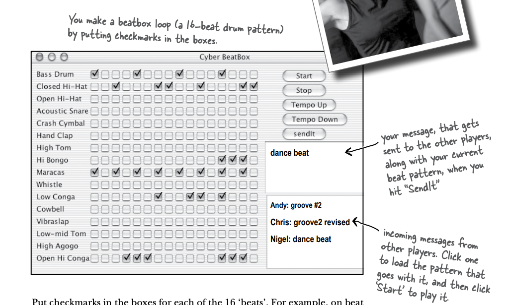

Her biri 16 'vuruş' için kutulara işaret koyun. Örneğin, 1. vuruşta (16 vuruşun içinde) Bass Drum ve Maracas çalacak,
ikinci vuruşta hiçbir şey olmayacak ve 3. vuruşta Maracas ve Closed Hi-Hat... fikri anladınız. 'Başlat' düğmesine
bastığınızda, deseninizi bir döngüde çalacak ve 'Durdur' düğmesine basana kadar devam edecektir. Herhangi bir zamanda
kendi deseninizi yakalayabilir ve BeatBox sunucusuna gönderebilirsiniz (bu, diğer oyuncuların onu dinleyebileceği
anlamına gelir). Ayrıca gelen desenlerden herhangi birini mesajla birlikte gelen bağlantıya tıklayarak
yükleyebilirsiniz.

### We'll start with the basics

Açıkça, tüm programın tamamlanması için öğrenmemiz gereken birkaç şey var, bunlar arasında Swing GUI oluşturmayı, ağ
üzerinden başka bir makineye nasıl bağlanacağımızı ve başka bir makineye bir şey gönderebilmek için biraz I/O işlemi
yapmayı öğrenmeliyiz.

Evet, ve JavaSound API. İşte bu bölümde başlayacağımız yer burası. Şimdilik GUI'yi, ağ bağlantısını ve I/O'yu unutabilir
ve sadece MIDI (Müzik Arayüzü ve Dili) ile oluşturulan sesleri bilgisayarınızdan çıkarmanıza odaklanabilirsiniz. Ve
müzik teorisi veya müzik yapma konusunda hiçbir şey bilmiyorsanız endişelenmeyin. Öğrenmeniz gereken her şey burada ele
alınmıştır.

**The Java Sound API**

JavaSound, Java'nın 1.3 sürümüyle başlayarak eklenen bir dizi sınıf ve arabirimler koleksiyonudur. Bunlar özel
eklentiler değil, standart J2SE sınıf kitaplığının bir parçasıdır. JavaSound, iki bölümden oluşur: MIDI ve Sampled.
Bu kitapta sadece MIDI kullanıyoruz. MIDI, "Müzik Enstrümanları Dijital Arabirimi" anlamına gelir ve farklı türdeki
elektronik ses ekipmanlarının iletişim kurması için standart bir protokoldür. Ancak BeatBox uygulamamızda, MIDI'yi
yüksek teknolojili bir "piyano çalıcısı" gibi düşünebilirsiniz.

Diğer bir deyişle, MIDI verisi aslında herhangi bir ses içermez, ancak bir MIDI okuma enstrümanının geri çalabileceği
talimatları içerir. Başka bir benzetmeyle, bir MIDI dosyasını bir HTML belgesine benzetebilir ve MIDI dosyasını çizen
enstrümanın (yani çalması) bir Web tarayıcısına benzediğini düşünebilirsiniz.

MIDI verisi, ne yapılacağını söyler (örneğin orta C nota çal, vurmak için ne kadar sert vurulacağı, ne kadar süreyle
tutulacağı vb.), ancak gerçek sesin nasıl duyulacağı hakkında hiçbir şey söylemez. MIDI, flüt, piyano veya Jimi Hendrix
gitar sesi nasıl oluşturulacağını bilmez. Gerçek ses için, MIDI verisini okuyup çalabilen bir enstrümana (bir MIDI
cihazına) ihtiyacımız vardır. Ancak bu cihaz genellikle bir bütün bando veya orkestrayı içeren bir şeye benzer. Bu
enstrüman fiziksel bir cihaz olabilir, örneğin rock müzisyenlerinin kullandığı elektronik klavye sentezleyiciler gibi,
veya tamamen bilgisayarınızda yaşayan bir yazılım enstrümanı da olabilir.

BeatBox uygulamamız için, yalnızca Java ile birlikte gelen yerleşik yazılım enstrümanını kullanıyoruz. Buna sentezleyici
denir (bazı insanlar buna yazılım sentezi de der) çünkü ses oluşturur. Duyduğunuz sesi bu sentezleyici yaratır.

### First we need a Sequencer

Ses çalmak için herhangi bir sesi elde edebilmeden önce bir Sequencer nesnesine ihtiyacımız var. Sequencer, tüm MIDI
verilerini alır ve doğru enstrümanlara gönderen nesnedir. Müziği çalan şeydir. Bir sequencer birçok farklı şey
yapabilir, ancak bu kitapta sadece bir oynatma cihazı olarak kullanıyoruz. Stereonuzdaki CD çalar gibi düşünebilirsiniz,
ancak birkaç ek özellikle. Sequencer sınıfı, javax.sound.midi paketinde yer alır (Java kütüphanesinin 1.3 sürümüyle
birlikte standart bir parçasıdır). Bu nedenle, bir Sequencer nesnesini oluşturup (veya almak) için başlamadan önce,
mevcut olduğundan emin olalım.

```
public class MusicTest1 {
    public void play(){
        /* Bir Sequencer nesnesine ihtiyacımız var. Bu, kullandığımız MIDI cihazının/enstrümanın ana bölümüdür. MIDI
        bilgilerini bir "şarkıya" dönüştüren şeydir. Ancak, kendimize yeni bir tane oluşturmuyoruz - bir tane almak
        için MidiSystem'a başvuruyoruz */
        Sequencer sequencer = MidiSystem.getSequencer();
        System.out.println("we got a sequencer");
    }

    public static void main(String[] args) {
        MusicTest1 mt = new MusicTest1();
        mt.play();
    }
}
```

Bu kod compile edilmez.

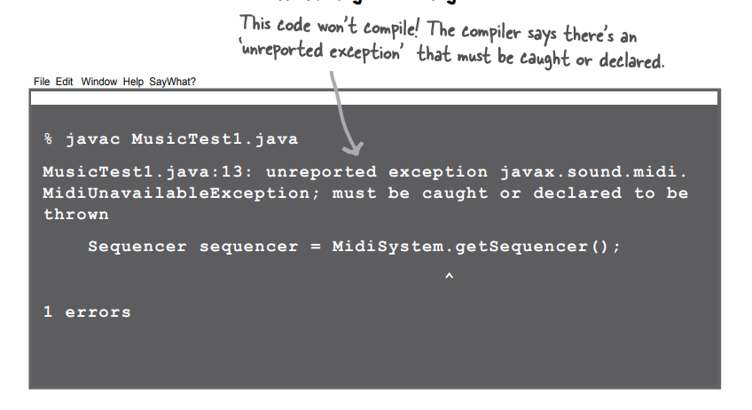

### What happens when a method you want to call (probably in a class you didn’t write) is risky?

1 - Diyelim ki, yazmadığınız bir sınıfta yer alan bir metodu çağırmak istiyorsunuz.

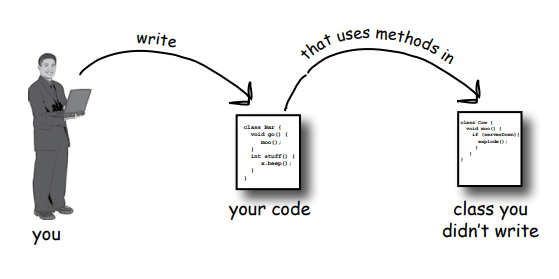

2 - O method, çalışma zamanında işe yaramama riski olan riskli bir işlem gerçekleştiriyor.

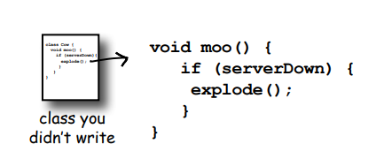

3 - Çağırdığınız methodun riskli olduğunu bilmelisiniz.

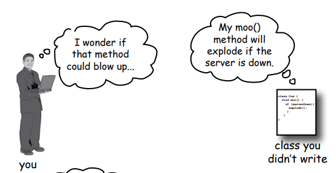

4 - O zaman, başarısızlık durumunda başa çıkabilecek kodu yazmalısınız. Her ihtimale karşı hazırlıklı olmanız
gerekmektedir.

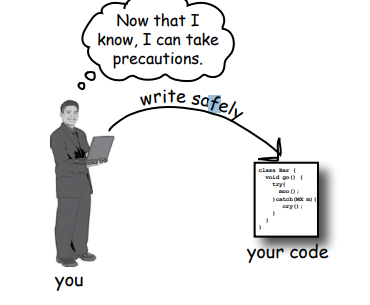

### Methods in Java use exceptions to tell the calling code, “Something Bad Happened. I failed.”

Java'nın exception handling mekanizması, çalışma zamanında ortaya çıkan "sıradışı durumları" ele almak için temiz ve
anlaşılır bir mekanizmadır; böylece tüm error handling kodunuzu kolayca okunabilir bir yerde toplayabilirsiniz. Bu
mekanizma, çağırdığınız methodun riskli olduğunu (yani methodun exception oluşturabileceğini) bildiğiniz temeline
dayanır, böylece bu olasılığı ele alacak kodu yazabilirsiniz. Belirli bir methodu çağırırken exception alabileceğinizi
bildiğinizde, exception oluşturan sorunu önlemek için hazırlıklı olabilir veya hatta sorunu çözebilirsiniz.

Peki, bir methodun exception oluşturup oluşturmadığını nasıl bileceksiniz? Riskli methodun bildiriminde bir "throws"
ifadesi bulursunuz. "getSequencer()" methodu risk taşır. Çalışma zamanında başarısız olabilir. Bu nedenle, onu
çağırdığınızda alabileceğiniz riski "declare" etmesi gerekir.

```getSequencer();``` methoduna gittimiz de;

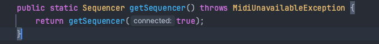

nasıl bir exception fırlattığını görebiliriz

### The compiler needs to know that YOU know you’re calling a risky method.

Riske açık olan kodu "try/catch" adı verilen bir yapı içine alırsanız, derleyici daha hoşgörülü olur. Bir try/catch
bloğu, çağırdığınız methodda sıradışı bir durumun meydana gelebileceğini bildirdiğinizi ve onunla başa çıkmaya hazır
olduğunuzu belirtir. Derleyici, onun nasıl ele alındığıyla ilgilenmez; sadece onunla ilgilendiğinizden emin olması
önemlidir.

```
public void play() {
    try {
        Sequencer sequencer = MidiSystem.getSequencer();
        System.out.println("we got a sequencer");
    } catch (MidiUnavailableException ex) {
        System.out.println(ex.getMessage());
    }
}

public static void main(String[] args) {
    MusicTest1 mt = new MusicTest1();
    mt.play();
}
```

### An exception is an object... of type Exception.

Şanslı olan, exception'ların Brokoli türünde olduğu durumda hatırlamanın çok daha zor olacağıdır. Polimorfizm
bölümlerinden hatırlayın ki Exception türünden bir nesne, Exception sınıfının herhangi bir alt sınıfının bir örneği
olabilir. Çünkü Exception bir nesnedir, yakaladığınız şey de bir nesnedir. Aşağıdaki kod örneğinde, catch argümanı
Exception türünde tanımlanır ve parametre referans değişkeni ex olarak belirtilir.

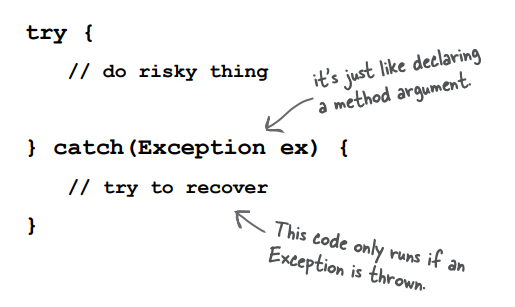

Catch bloğunda ne yazacağınız, atılan exception'a bağlıdır. Örneğin, bir sunucu çökmüşse, catch bloğunu başka bir
sunucu denemek için kullanabilirsiniz. Eğer dosya yoksa, kullanıcıdan dosyayı bulmada yardım isteyebilirsiniz.

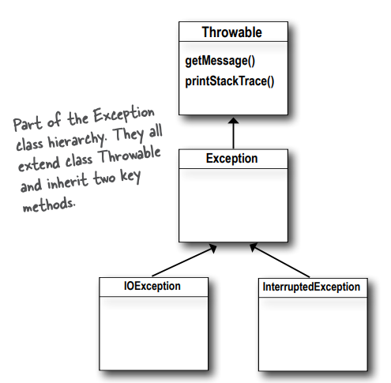

### If it’s your code that catches the exception, then whose code throws it?

Java kodlama sürecinizin çoğunu exception'ları ele alarak geçireceksiniz, kendi başınıza oluşturup fırlatmak için
harcadığınızdan çok daha fazla. Şimdilik, kodunuz riskli bir metod çağırdığında - bir exception bildiren bir metod -
riskli metod size, çağırana, exception'ı fırlatır.

Gerçekte, her iki sınıfı da siz yazmış olabilirsiniz. Aslında, önemli olan hangi metodun exception'ı fırlattığını ve
hangi metodun bunu yakaladığını bilmektir. Birisi exception fırlatabilecek kod yazdığında, exception'ı bildirmek
zorundadır.

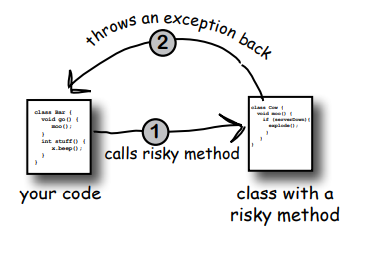

1 - Risky, exception-throwing code:

```
public void takeRisk() throws BadException{
    if (abandonAllHope){
        throw new BadException();
    }
}
```

Bir metod, diğer bir metodun fırlattığı exception'ı yakalayabilir. Bir exception her zaman çağıran tarafa (caller) geri
fırlatılır. Exception fırlatan metodun, o exception'ı fırlatabileceğini belirtmesi gerekir.

2 - Risk'li methodu çağıran kodunuz:

```
public void crossFingers(){
    try{
        anObject.takeRisk();
    } catch (BadException ex){
        System.out.println("arrrgghh");
        ex.printStackTrace();
    }
}
```

Eğer exception'dan kurtulamıyorsanız, EN AZINDAN tüm exception'ların miras aldığı printStackTrace() methodunu kullanarak
bir stack trace elde edin.

### The compiler checks for everything except RuntimeExceptions.

1 - Java'da, kodunuzda bir exception fırlattığınızda, bu exception'ı metod bildiriminde throws anahtar kelimesini
kullanarak belirtmeniz gerekmektedir. Bu, metodun çağırıldığı yerde exception'ı ele almanız veya iletmek (propagate)
zorunda olanın bilgilendirilmesini sağlar.

2 - Eğer bir exception fırlatan (yani exception fırlatma durumunu bildiren) bir metodu çağırıyorsanız, exception
olasılığının farkında olduğunuzu belirtmeniz gerekmektedir. Bu durumu derleyiciye bildirmenin bir yolu, çağrıyı bir
try/catch bloğu içine almaktır. (Bu bölümün biraz ilerisinde ele alacağımız ikinci bir yol da vardır.)

**RuntimeException** - alt sınıfları olmayan exception'lar derleyici tarafından denetlenir. Onlara "checked exception"
denir. RuntimeException alt sınıfları derleyici tarafından denetlenmez. Bunlar "unchecked exception'lar" olarak
bilinir. RuntimeException türündeki exception'ları fırlatabilir, yakalayabilir ve bildirebilirsiniz, ancak bunu yapmak
zorunda değilsiniz ve derleyici denetlemez.

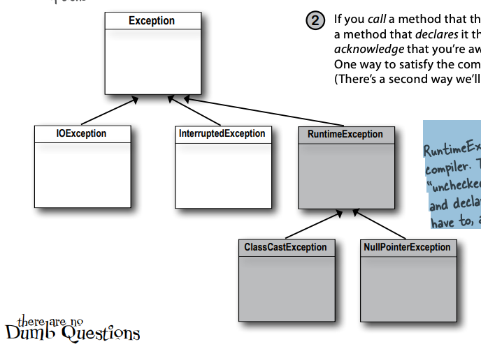

**Answers :**

Derleyici, Exception'ın tüm alt sınıflarına önem verir,ancak özel bir tür olan RuntimeException dışındakilere dikkat
eder. RuntimeException'ı genişleten herhangi bir exception sınıfı serbest geçiş hakkına sahiptir. RuntimeException'lar,
throws deklarasyonları veya try/catch blokları olmadan herhangi bir yerde fırlatılabilir. Derleyici, bir methodun
RuntimeException fırlatabileceğini bildirip bildirmediğini veya çağrının çalışma zamanında bu exceptiony'ı alabileceğini
doğrulamakla ilgilenmez.

Çoğu RuntimeException, öngöremediğiniz veya önleyemediğiniz çalışma zamanında meydana gelen bir durum yerine, kod
mantığınızdaki bir sorundan kaynaklanır. Dosyanın mevcut olduğunu garanti edemezsiniz. Sunucunun çalıştığına emin
olamazsınız. Ancak bir array'in sonundan indekslememenizi sağlayabilirsiniz (bu, .length attribute'u için kullanılır).
RuntimeException'ların geliştirme ve test zamanında meydana gelmesini istersiniz. Örneğin, bir try/catch içinde kod
yazmak ve bu duruma eşlik eden fazladan iş yüküyle karşılaşmak istemezsiniz, çünkü zaten meydana gelmemesi gereken bir
şeyi catchya çalışıyorsunuzdur. Bir try/catch, olağanüstü durumları ele alma amacıyla kullanılır, kodunuzdaki
kusurlar için değil. Catch bloklarınızı, başarı garantisi olmayan durumlarla başa çıkmak için kullanın. Ya da en azından
kullanıcıya bir mesaj ve bir stack trace yazdırın, böylece biri neyin olduğunu anlayabilir.

**BULLET POINTS**

* Bir method, runtime'da bir şey başarısız olduğunda bir exception fırlatabilir.
* Bir exception her zaman Exception türünde bir nesnedir. (Polimorfizm bölümlerinden hatırladığınız gibi, bu, nesnenin
  Exception'ı miras alan bir sınıftan türediği anlamına gelir.)
* Derleyici, RuntimeException türünde olan exception'lara dikkat etmez. Bir RuntimeException, try/catch içinde
  bildirilmek veya sarmalanmak zorunda değildir (ancak bunları isteğe bağlı olarak yapabilirsiniz).
* Derleyicinin önem verdiği tüm exceptionlar "checked exceptions" olarak adlandırılır, bu gerçekte derleyici tarafından
  kontrol edilen exceptionlar anlamına gelir. Sadece RuntimeException'lar, derleyici tarafından kontrol edilme kapsamı
  dışında kalır. Diğer tüm exceptionlar, kurallara göre kodunuzda kabul edilmelidir.
* Bir method, "throw" anahtar kelimesi ve yeni bir exception nesnesi ile bir exception fırlatabilir:
  ```throw new NoCaffeineException();```
* Checked exception fırlatabilecek methodlar, bunu "throws Exception" bildirimiyle duyurmalıdır.
* Kodunuz, bir checked exception fırlatabilecek methodu çağırdığında, derleyiciye önlemlerin alındığını garanti
  etmelidir.
* Eğer exception'ı ele almak için hazırsanız, çağrıyı bir try/catch içine alın ve exception handling/recovery kodunu
  catch bloğuna koyun.
* Eğer exception'ı ele almak için hazır değilseniz, yine de derleyiciyi memnun edebilirsiniz; exception'ı resmi olarak "
  ducking" (kovma) işlemi yaparak atlayabilirsiniz. Ducking işlemi hakkında biraz sonra bu bölümde konuşacağız.

### Flow control in try/catch blocks

Riskli bir methodu çağırdığınızda, iki şeyden biri olabilir. Riskli method başarılı bir şekilde tamamlanır ve try bloğu
işlemi tamamlar ya da riskli method caller methoda bir exception fırlatır.

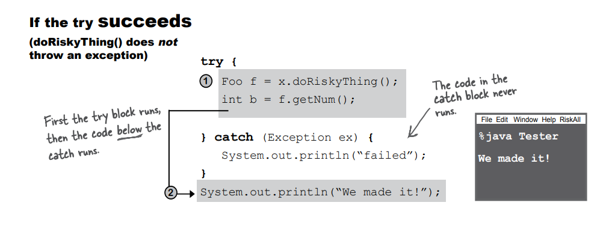 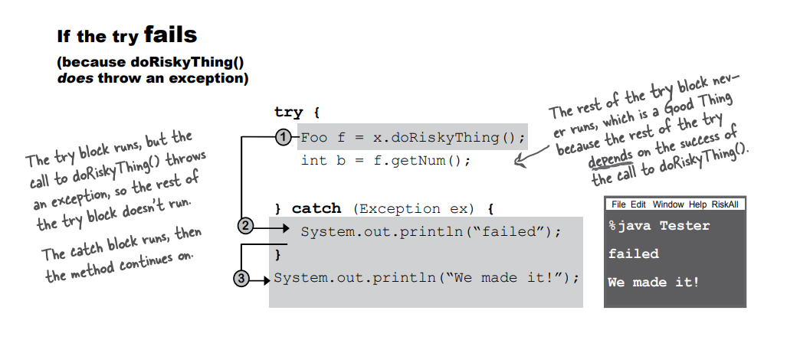

### Finally: for the things you want to do no matter what.

Bir şey pişirmeye çalışıyorsanız, fırını açarak başlarsınız. Eğer denediğiniz şey tam bir başarısızlık ise, fırını
kapatmak zorundasınız. Eğer denediğiniz şey başarılı olursa, yine fırını kapatmak zorundasınız. Ne olursa olsun fırını
kapatmanız gerekiyor!

"finally" bloğu, exception olup olmamasına bakılmaksızın çalışması gereken kodu yerleştirdiğiniz bölümdür.

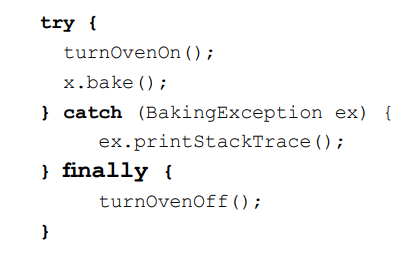

"finally" bloğu olmadan, try ve catch içine turnOvenOff() işlemini koymak zorunda kalırsınız çünkü fırını ne olursa
olsun kapatmanız gerekmektedir. "finally" bloğu, önemli temizleme kodunuzu tek bir yerde çoğaltmadan yerleştirmenizi
sağlar ve işleri daha düzenli hale getirir.

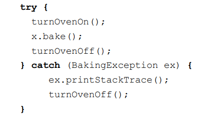

Eğer try bloğu başarısız olursa (bir exception oluşursa), akış hemen catch bloğuna geçer. Catch bloğu tamamlandığında,
finally bloğu çalışır. Finally bloğu tamamlandığında, metodun geri kalanı devam eder.

Eğer try bloğu başarılı olursa (herhangi bir exception oluşmazsa), flow control'u catch bloğunu atlar ve finally bloğuna
geçer. Finally bloğu tamamlandığında, metodun geri kalanı devam eder.

Eğer try veya catch bloğunda bir return ifadesi bulunursa, finally bloğu yine çalışır! Flow finally bloğuna geçer,
ardından return ifadesine geri döner.

### Did we mention that a method can throw more than one exception?

Bir metod birden fazla exception fırlatabilir, ancak metotun bildirimi fırlatabileceği tüm checked (kontrol edilen)
exceptionları belirtmelidir (ancak eğer iki veya daha fazla exception'ın ortak bir üst sınıfı varsa, metot sadece üst
sınıfı bildirebilir.)

**Catching multiple exceptions**

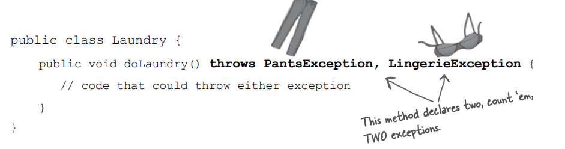

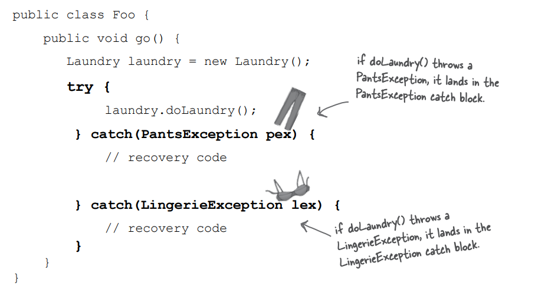

### Exceptions are polymorphic

Exceptionlar, nesnelerdir, unutmayın. Bir exception'ın, atılabilen bir şey olduğundan başka özel bir yanı yoktur.
Devent'isıyla, tüm iyi nesneler gibi, exceptionlar polimorfik olarak başvurulabilir. Örneğin, bir LingerieException
nesnesi, bir ClothingException referansına atanabilir. Bir PantsException bir Exception referansına atanabilir. Fikri
anlıyorsunuzdur. exceptionlar için fayda, bir methodun atabileceği her olası exception'ı açıkça bildirmesi
gerekmeyeceğidir; exceptionların süper sınıfını bildirebilir. Catch blokları için de aynı durum geçerlidir, her olası
exception için catch yazmanız gerekmez; sahip olduğunuz catch'ler, atılan herhangi bir exception'ı ele verebilmelidir.

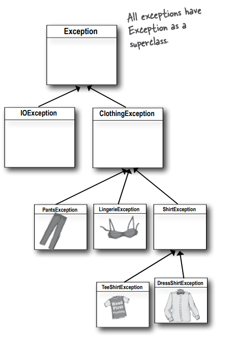

1 - Exceptionları bildirmek için fırlattığınız exceptionların supertype'ını kullanabilirsiniz.

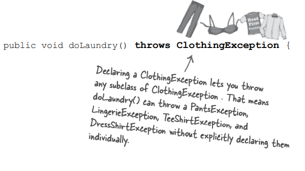

ClothingException adında bir sınıfı tanımlamak, ClothingException alt sınıflarından herhangi birini fırlatmanıza izin
verir. Bu, doLaundry() işlevinin PantsException, LingerieException, TeeShirtException ve DressShirtException gibi alt
sınıfları ayrı ayrı belirtmeden fırlatmasına izin verir.

2 - Evet, catch bloğunda fırlatılan exception'ların üst sınıfını kullanarak exception'ları yakalayabilirsiniz

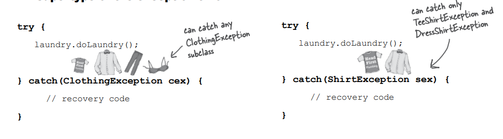

### Just because you CAN catch everything with one big super polymorphic catch, doesn’t always mean you SHOULD.

Evet, catch bloğunuza sadece bir adet catch bloğu ekleyerek, catch kısmında Exception üst sınıfını kullanarak
herhangi bir exception'ı yakalayabilirsiniz. Bu şekilde, fırlatılabilecek tüm exceptionları tek bir yerde ele alabilir
ve kodunuzu daha genel ve esnek hale getirebilirsiniz.

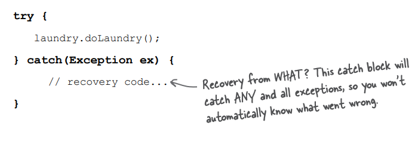

**Write a different catch block for each exception that you need to handle uniquely.**

Örneğin, kodunuz TeeShirtException ile LingerieException ile farklı şekillerde başa çıkıyorsa (veya düzeltiliyorsa), her
biri için bir "catch" bloğu yazın. Ancak diğer tüm ClothingException türlerini aynı şekilde işlemeyi tercih ediyorsanız,
geri kalanları halletmek için bir ClothingException "catch" bloğu ekleyin.

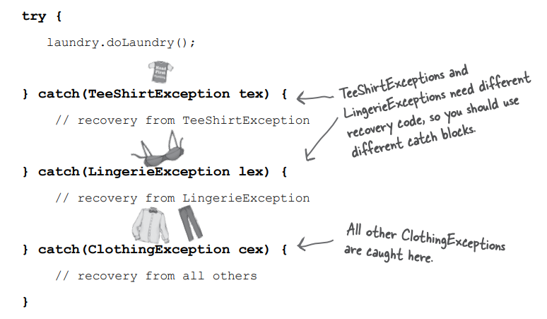

### Multiple catch blocks must be ordered from smallest to biggest

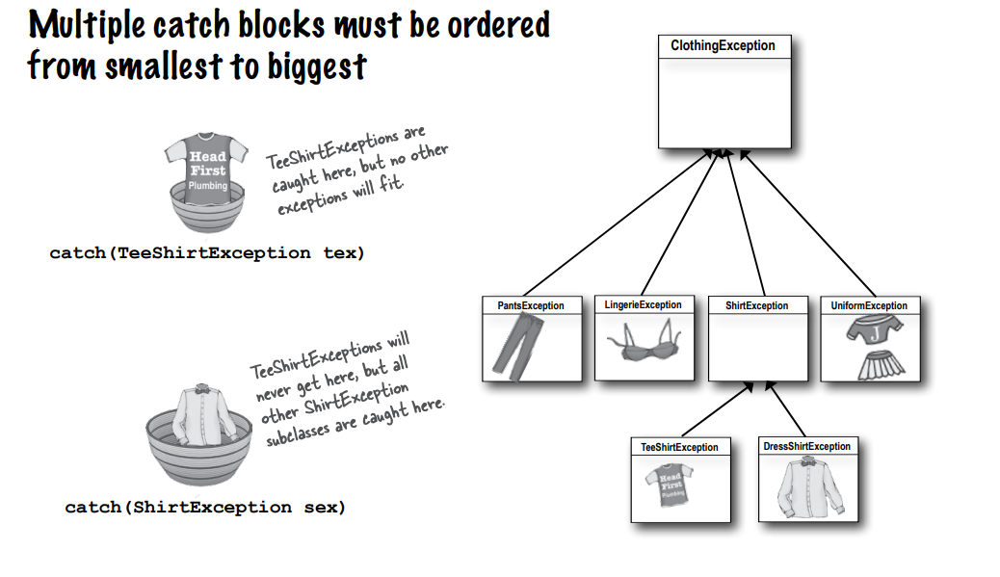

Kalıtım ağacında yukarı çıkıldıkça, catch 'basket' daha büyük olur. Kalıtım ağacında aşağı doğru hareket ettikçe,
giderek daha özelleşmiş Exception sınıflarına doğru ilerlediğimizde, catch 'basket' daha küçük olur. Bu sadece düz
bir polimorfizmdir.

Bir ShirtException catch'i, TeeShirtException veya DressShirtException (ve ShirtException'ı genişleten herhangi bir
gelecekteki alt sınıfı) alacak kadar büyüktür. Bir ClothingException daha da büyüktür (yani, ClothingException türünü
kullanarak referans alınabilecek daha fazla öğe vardır). ClothingException türünden bir exception alabilir (elbette), ve
PantsException, UniformException, LingerieException ve ShirtException gibi tüm ClothingException alt sınıflarını da
alabilir. Tüm catch argümanlarının anası, Exception'dır; bu, runtime (unchecked exceptions) da dahil olmak üzere
herhangi bir exception'ı yakalayacaktır, bu nedenle muhtemelen test dışında kullanmayacaksınız.

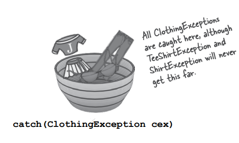

### You can’t put bigger baskets above smaller baskets.

Evet, kodu yazabilirsiniz, ancak derlenmeyecektir. Catch blokları, en iyi eşleşmenin seçildiği overloaded methodlar
gibi değildir. Catch bloklarıyla JVM, sadece ilk catch bloğundan başlar ve exception'ı işlemek için yeterince geniş (
diğer bir deyişle, kalıtım ağacında yeterince yüksek) olanı bulana kadar sırayla aşağıya doğru ilerler. İlk catch
bloğunuz catch(Exception ex) ise, derleyici diğer herhangi bir catch bloğu eklemenin anlamsız olduğunu bilir - asla
ulaşılamayacaklardır.

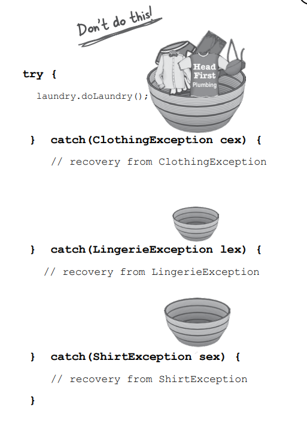

Eş nesneler (siblings) herhangi bir sıraya konulabilir, çünkü birbirlerinin exception'larını yakalayamazlar.
ShirtException'ı LingerieException'ın üzerine koyabilirsiniz ve kimse sorun çıkarmaz. Çünkü ShirtException, kendi alt
sınıflarını da yakalayabilen daha geniş bir türdür, ancak LingerieException'ı yakalayamaz, bu yüzden bir sorun olmaz.

### When you don’t want to handle an exception...

Eğer bir exception'ı ele almak istemiyorsanız, onu bildirerek "duck" (kaçınmak) edebilirsiniz.

Riskli bir methodu çağırdığınızda, derleyicinin bunu fark etmesi gerekecektir. Genellikle bunu yapmanız, riskli çağrıyı
try/catch bloğu içine almanız anlamına gelir. Ancak başka bir seçeneğiniz daha var; basitçe "duck" edebilir ve sizi
çağıran methodun exception'ı ele almasına izin verebilirsiniz. Yani, kendiniz try/catch bloğu kullanmak yerine,
exception'ı üst düzeydeki methoda iletebilirsiniz.

Eğer exception'ı ele almamayı tercih ederseniz, exception'ları fırlattığınızı belirtmeniz yeterlidir. Teknik olarak,
exception'ı siz fırlatmıyorsanız bile, bu önemli değildir. Yine de exception'ı direkt olarak geçiştiren sizsiniz.

Ancak, bir exception'ı geçiştirdiğinizde (duck), try/catch bloğu kullanmıyorsanız, riskli method (doLaundry())
exception'ı fırlattığında ne olur?

Bir method bir exception fırlattığında, o method hemen stack'den çıkar ve exception stack'de ki bir sonraki methoda -
yani çağırana - fırlatılır. Ancak çağırılan method bir "ducker" (exception'ı geçiştiren) ise, exception için bir catch
bloğu olmayacağından çağırılan method da hemen stack'ten çıkar ve exception bir sonraki methoda fırlatılır ve bu şekilde
devam eder... Peki bu nerede sonlanır? Birazdan göreceğiz.

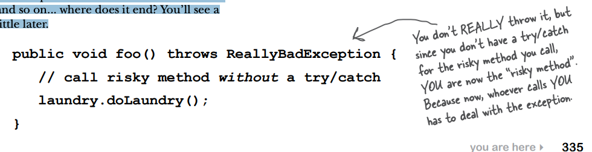

Evet, gerçekten fırlatmamış olsanız da, riskli bir methodu çağırdığınızda, siz şimdi "riskli method" olmuş olursunuz.
Çünkü şimdi sizi çağıran kişi, exception'ı ele almak zorundadır.

### Ducking (by declaring) only delays the inevitable

Er ya da geç, birisi bununla başa çıkmalıdır. Peki ya "main()" metodu exception'ı geçiştirirse?

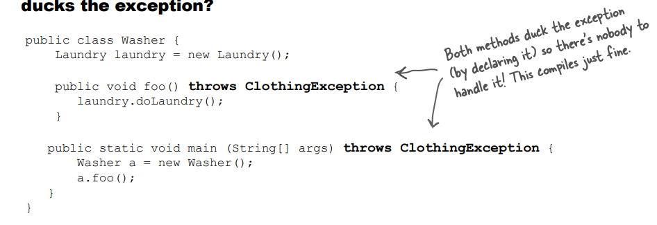 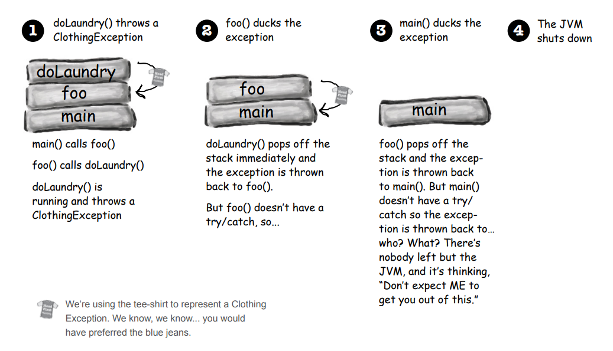

### Handle or Declare. It's the law

Şimdi riskli (exception fırlatan) bir methodu çağırdığınızda derleyiciyi tatmin etmek için iki farklı yol gördük.

1 - HANDLE

Risk'li çağrıyı bir try/catch ile wrap edin

```
try {
  laundry.doLaundry();
} catch(ClothingException cex) {
  // recovery code
}
```

Eğer doLaundry() metodu çeşitli exceptionları fırlatma potansiyeline sahipse, kullandığınız catch bloğu bu exceptionları
ele alabilecek kadar geniş olmalıdır. Aksi takdirde, derleyici hala tüm exceptionları yakalamadığınızı belirterek bir
hata verecektir.

2 - DECLARE - Duck IT

Kendi methodunuzun, çağırdığınız riskli methodla aynı exceptionları fırlattığını belirtin.

```
void foo() throws ClothingException {
  laundry.doLaundry();
} 
```

doLaundry() methodu, bir ClothingException exception'ı fırlatır, ancak exception'ı bildirerek (throws) foo() methodu
exception'ı geçiştirebilir. Yani try/catch bloğu kullanmaz

Şimdi bu, foo() metodunu çağıran kişinin Handle veya Declare kuralını takip etmesi gerektiği anlamına gelir. Eğer foo()
metodu exception'ı engellerse (bildirerek), ve main() fonksiyonu foo() metodunu çağırırsa, o zaman main() fonksiyonu
exception'la başa çıkmak zorundadır.

```
public class Washer {
    Laundry laundry = new Laundry();
    
    public void foo() throws ClothingException {
        laundry.doLaundry();
    }
    
    public static void main (String[] args) {
        Washer a = new Washer();
        a.foo();
    }
}
```

Şimdi main() derlenmeyecek ve "unreported exception" hatası alacağız. Derleyici açısından, foo() metodu bir exception
fırlatıyor olarak kabul ediliyor.

Çünkü foo() metodu, doLaundry() tarafından fırlatılan ClothingException'ı görmezden gelirse, main() fonksiyonunun
a.foo() çağrısını try/catch bloğuna alması veya main() fonksiyonunun da ClothingException'ı fırlatabileceğini
belirtmesi (throws ClothingException) gerekecektir.

### Getting back to our music code...

JavaSound koduna ilk bakışımızla başladığımız bu bölümde, Sequencer nesnesi oluşturduk, ancak Midi.getSequencer() metodu
bir checked exception (MidiUnavailableException) bildiriyor ve bu yüzden derlenmiyordu. try/catch bloğuna alarak bu
hatayı gidermiştik.

```
public void play() {
    try {
        Sequencer sequencer = MidiSystem.getSequencer();
        System.out.println("we got a sequencer");
    } catch (MidiUnavailableException ex) {
        System.out.println(ex.getMessage());
    }
}
```

Yakalama (catch) parametresi doğru exception türüyle eşleşmelidir. Eğer "catch(FileNotFoundException f)" şeklinde bir
ifade kullanırsak, kod derlenmeyecektir; çünkü polimorfik olarak MidiUnavailableException türü, FileNotFoundException
içine uygun düşmeyecektir. Unutmayın ki sadece bir catch bloğu oluşturmak yeterli değildir... fırlatılan şeyi
yakalamak (catch) gereklidir.

### Exception Rules

1 - Bir try olmadan catch ve final yapılamaz

```
void go() {
   Foo f = new Foo();
   f.foof();
   catch(FooException ex) { }
}
```

2 - Try / Catch arasına kod eklenmez

```
try {
  x.doStuff();
}

int y = 43;

catch(Exception ex) { }
```

3 - Try'ın ardından ya bir catch ya da bir finally gelmelidir.

```
try {
  x.doStuff();
} fnally {
  // cleanup
}
```

Bir finally bloğu var olduğu sürece, catch bloğu olmasa bile yasaldır. Ancak, yalnızca bir try bloğu olamaz.

4 - Yalnızca finally içeren (catch içermeyen) bir try yine de exception'ı bildirmelidir.

```
void go() throws FooException {
  try {
    x.doStuff();
  } fnally { }
}
```

"Handle or Declare" kuralını sağlamak için bir try bloğu yalnız başına yeterli değildir. Bu kurala göre, bir metodun
kontrol edilebilir bir exception fırlattığı durumlarda, o exception'ı handle veya kendi imzalarında declare etmek
zorundadır

### Making actual sound

Bu bölümün başında, MIDI verilerinin neyin çalınacağına dair talimatları (ve nasıl çalınacağına dair talimatları)
içerdiğini ve aynı zamanda MIDI verilerinin aslında duyduğunuz sesi oluşturmadığını görmüştük. Hoparlörlerden sesin
çıkması için MIDI verileri, MIDI talimatlarını alıp ses olarak oluşturan bir tür MIDI cihazından geçirilmelidir, ya
donanım enstrümanını tetikleyerek ya da 'sanal' bir enstrümanı (yazılım synthesizer) çalıştırarak. Bu kitapta sadece
yazılım cihazları kullanıyoruz, bu nedenle JavaSound'da nasıl çalıştığına bir göz atalım:

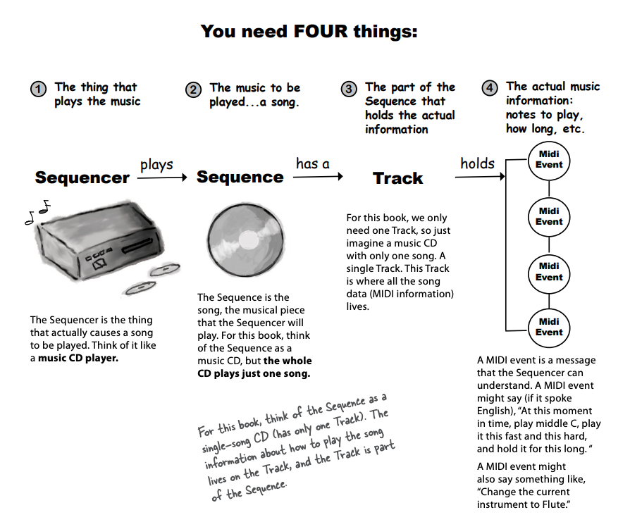

1 - **Sequencer**, aslında bir şarkının çalınmasına neden olan şeydir. Onu müzik CD çaları gibi düşünebilirsiniz.

2 - **Sequence**, Sequencer'ın çalacağı şarkıdır, müzikal parçadır. Bu kitap için Sequence'ı bir müzik CD'si gibi
düşünebilirsiniz, ancak tüm CD sadece bir şarkıyı çalar.

3 - **Track** Bu kitap için sadece bir Track'e ihtiyacımız var, bu yüzden sadece tek bir şarkı içeren bir müzik CD'si
gibi düşünebilirsiniz. Bu Track, tüm şarkı verilerinin (MIDI bilgilerinin) bulunduğu yerdir.

4 - Bir MIDI event'i, Sequencer'ın anlayabileceği bir mesajdır. Bir MIDI event'i (eğer İngilizce konuşabilseydi) "Şu
anki zamanda orta C notasını çal, bunu bu hızda ve bu şiddette yap, ve bunu bu süre boyunca sürdür" gibi bir şey
diyebilir. Bir MIDI event'i ayrıca şöyle de diyebilir: "Mevcut enstrümanı Flüt olarak değiştir."

### Your very first sound player app

```
public class MiniMiniMusicApp {
    public static void main(String[] args) {
        MiniMiniMusicApp mini = new MiniMiniMusicApp();
        mini.play();
    }

    public void play() {
        try {
            Sequencer player = MidiSystem.getSequencer();
            player.open();

            Sequence seq = new Sequence(Sequence.PPQ, 4);

            Track track = seq.createTrack();

            ShortMessage a = new ShortMessage();
            a.setMessage(144, 1, 44, 100);
            MidiEvent noteOn = new MidiEvent(a, 1);
            track.add(noteOn);
            
            ShortMessage b = new ShortMessage();
            b.setMessage(128, 1, 44, 100);
            MidiEvent noteOff = new MidiEvent(b, 16);
            track.add(noteOff);

            player.setSequence(seq);
            player.start();

        } catch (MidiUnavailableException | InvalidMidiDataException ex) {
            ex.printStackTrace();
        }
    }
}
```

### Making a MidiEvent (song data)

MidiEvent, bir şarkının bir parçası için bir talimattır. MidiEvent'lerin bir dizisi, notaların çalındığı sırayı belirten
bir müzik notasyonu veya otomatik piyano tekerleği gibi düşünülebilir. İlgilendiğimiz çoğu MidiEvent, ne yapılacağını ve
ne zaman yapılacağını açıklar. Zamanlama, müzikte her şeyi etkileyen önemli bir faktördür. Bu nota bu nota ile takip
eder ve benzeri. Ve MidiEvent'ler çok detaylı olduklarından, notayı çalmaya ne zaman başlanacağını (NOTE ON event'i) ve
notaları çalmayı ne zaman durduracağınızı (NOTE OFF event'i) belirtmeniz gerekir. Yani, "notayı çalmayı durdur"
komutunu (NOTE OFF mesajı) "notayı çalmaya başla" komutundan (NOTE ON) önce göndermek işe yaramaz.

MIDI instructon'i aslında bir Message (Mesaj) nesnesine girer; MidiEvent, bu mesajın ne zaman "tetikleneceğini" belirten
bir kombinasyondur. Başka bir deyişle, Mesaj "Orta C çalmaya başla" derken, MidiEvent "bu mesajı 4. vuruşta tetikle"
der. Yani her zaman bir Message ve bir MidiEvent'e ihtiyacımız vardır.

Message, ne yapılacağını belirtirken, MidiEvent, ne zaman yapılacağını belirtir.

1 - Make a message

```ShortMessage a = new ShortMessage();```

2 - Put the **Instruction** in the Message

```a.setMessage(144, 1, 44, 100);```

3 - Make a new **MidiEvent** using the Message

```MidiEvent noteOn = new MidiEvent(a, 1);```

4 - Add the MidiEvent to the Track

```track.add(noteOn);```

Bir Track, tüm MidiEvent nesnelerini içerir. Sequence, bu olayları ne zaman meydana geleceğine göre düzenler ve sonra
Sequencer, olayları bu sırayla geri çalar. Aynı anda tamamen farklı olaylar olabilir. Örneğin, iki nota aynı anda
çalınmasını isteyebilirsiniz veya hatta farklı enstrümanlar aynı anda farklı sesler çalabilir.

### MIDI message: the heart of a MidiEvent

Bir MIDI mesajı, ne yapılacağını belirten olayın bir bölümünü içerir. Sequencer'ın gerçekleştirmesini istediğiniz
talimatı içerir. Bir talimatın ilk argümanı her zaman mesajın türüdür. Diğer üç argümana verdiğiniz değerler, mesajın
türüne bağlı olarak değişir. Örneğin, 144 türünde bir mesaj, "NOTE ON" anlamına gelir. Ancak NOTE ON işlemini
gerçekleştirmek için sequencer'ın birkaç şeyi bilmeye ihtiyacı vardır. Sequencer, "Tamam, bir nota çalacağım, ancak
hangi kanalda? Yani, bir Davul notası mı çalmak istiyorsunuz yoksa bir Piyano notası mı? Ve hangi nota? Orta C mi? D
susturması mı? Ayrıca, hangi hızda nota çalayım?" gibi düşünebilir.

Bir MIDI mesajı oluşturmak için ShortMessage sınıfından bir örnek oluşturabilir ve setMessage() yöntemini çağırarak
mesaj için dört argümanı geçirebilirsiniz. Ancak unutmayın, mesaj sadece ne yapılacağını belirtir, bu yüzden hala mesajı
bir event'e yerleştirmeniz gereklidir ve böylece event'in ne zaman gerçekleşeceğini eklemeniz gereklidir

**Anatomy of a message**

setMessage() methoduna her zaman mesajın 'türünü' temsil eden ilk argümanı geçirirsiniz, diğer üç argüman ise mesaj
türüne bağlı olarak farklı şeyleri temsil eder.


1 - Message tipi

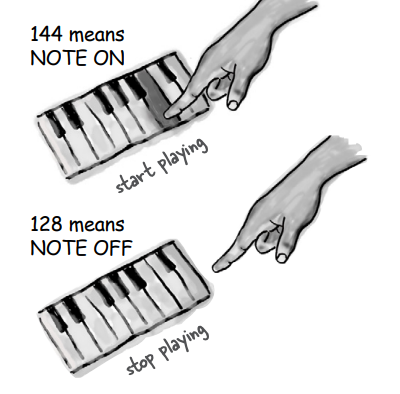

2 - Channel

bir kanalı bir müzik grubundaki bir müzisyen olarak düşünebilirsiniz. Kanal 1, müzisyen 1'i (klavye çalan müzisyen)
temsil ederken, kanal 9 davulcu gibi düşünülebilir.

3 - Note to play

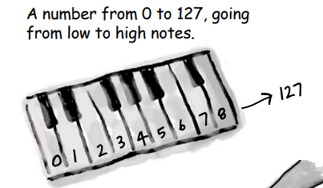

4 - Velocity

Tuşa ne kadar hızlı ve sert bastınız? 0 çok hafif basılmış anlamına gelir, muhtemelen bir şey duyamazsınız, ancak 100
iyi bir varsayılan değerdir.

### Change a message

Midi mesajının içeriğini bildiğiniz için şimdi deneyler yapmaya başlayabilirsiniz. Çalınan notayı değiştirebilir,
notanın ne kadar süreyle çalınacağını belirleyebilir, daha fazla nota ekleyebilir ve hatta enstrümanı
değiştirebilirsiniz.

1 - Notayı değiştir

```a.setMessage(144, 1, 45, 100);```

2 - Nota'nın duration'ını değiştir

```
b.setMessage(128, 1, 44, 100);
MidiEvent noteOff = new MidiEvent(b, 70);
```

### Version 2: Using command-line args to experiment with sounds

Bu versiyon hala sadece tek bir nota çalıyor, ancak komut satırı argümanlarını kullanarak enstrümanı ve notayı
değiştirebilirsiniz. İki tamsayı değeri (0 ile 127 arasında) geçirerek deney yapabilirsiniz. İlk tamsayı enstrümanı
ayarlar, ikinci tamsayı ise çalınacak notayı belirler.

```
public class MiniMusicCmdLine {
    public static void main(String[] args) {
        MiniMusicCmdLine mini = new MiniMusicCmdLine();
        if (args.length<2){
            System.out.println("dont forget the instrument and note args - 1 instrument - 2 note");
        } else{
            int instrument = Integer.parseInt(args[0]);
            int note = Integer.parseInt(args[1]);
            mini.play(instrument,note);
        }
    }

    public void play(int instrument, int note){
        try{
            Sequencer player = MidiSystem.getSequencer();
            player.open();
            Sequence seq = new Sequence(Sequence.PPQ, 4);
            Track track = seq.createTrack();

            MidiEvent event = null;

            ShortMessage first = new ShortMessage();
            first.setMessage(192, 1, instrument, 0);
            MidiEvent changeInstrument = new MidiEvent(first, 1);
            track.add(changeInstrument);

            ShortMessage a = new ShortMessage();
            a.setMessage(144, 1, note, 100);
            MidiEvent noteOn = new MidiEvent(a, 1);
            track.add(noteOn);

            ShortMessage b = new ShortMessage();
            b.setMessage(128, 1, note, 100);
            MidiEvent noteOff = new MidiEvent(b, 16);
            track.add(noteOff);

            player.setSequence(seq);
            player.start();
        } catch (Exception ex){
            ex.printStackTrace();
        }
    }
}
```

IntelliJ içerisinde 80 ve 20 değerini gönderiyorum. String[] args içerisine ilk olarak 80 ardından 20 gönderiliyor

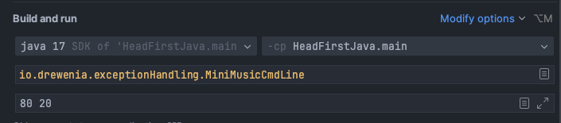 