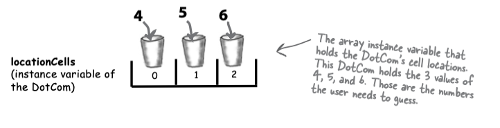

# Get to know the java api

### Using the java library

Java, yüzlerce önceden oluşturulmuş sınıf ile birlikte gelir. Java API olarak bilinen Java kütüphanesinde ihtiyacınız
olanı nasıl bulacağınızı biliyorsanız, tekerleği yeniden icat etmeniz gerekmez. Daha iyi yapmanız gereken şeyler vardır.
Kod yazacaksanız, sadece uygulamanız için gerçekten özel olan kısımları yazmanız daha iyidir.

Core Java kütüphanesi, büyük ölçüde önceden oluşturulmuş kodlardan oluşan bir array sınıfı içerir ve bunları kullanarak
kendi programınızı inşa etmek için birer yapı bloğu gibi kullanabilirsiniz. Java API, yazmanız bile gerekmeyen kodlarla
doludur. Yapmanız gereken tek şey, onu nasıl kullanacağınızı öğrenmektir.

**In our last chapter, we left you with the cliff-hanger. A bug.**

Chapter 5'de ki uygulamamız bir bug içeriyordu, açıklamıştık. Şimdi o bug'i nasıl gidereceğiz bakalım

**Ne yapabiliriz?**

İşte burada yanlış giden nokta. Kullanıcı herhangi bir hücre konumunu tahmin ettiğinde, o konum daha önce "hit" olsa
bile, halen bir "hit" olarak sayılıyor.

```
if (userGuess == cell){
    result = "hit";
    numberOfHits++;
    break;
}
```

Bir kullanıcının bir hücreye isabet sağladığında, o hücreye daha önce isabet sağlamış olup olmadığını bilmek için bir
yol bulmamız gerekiyor. Eğer kullanıcı daha önce o hücreye isabet sağlamışsa, bunu bir "hit" olarak saymak istemiyoruz.

**Nasıl fix'leriz?**

Bir hücrenin daha önce vurulup vurulmadığını bilmek için bir yol bulmamız gerekiyor. Şu anda bazı olasılıkları
inceleyeceğiz, ancak önce ne yapılması gerektiğine bakalım.

Sanal olarak 7 hücrelik bir sıra ve bir DotCom'un bu sıra içinde ardışık hücreleri işgal edeceği varsayılıyor. Bu sanal
sırada, DotCom'un 4, 5 ve 6 numaralı hücre konumlarında yer aldığı varsayılıyor.


DotCom'un, DotCom nesnesinin hücre konumlarını tutan bir int array olarak tanımlanmış bir instance variables'i vardır.



1 - Option One

İkinci bir array oluşturabiliriz ve her bir "hit'i" bu ikinci array'de saklayabiliriz. Daha sonra, yeni bir isabet
olduğunda ikinci array'i kontrol ederek daha önce vurulup vurulmadığını kontrol edebiliriz.


Option One çok hantal. Option One, beklediğinizden daha fazla iş yapıyor gibi görünüyor. Kullanıcı her bir "hit"
yaptığında, ikinci array (hitCells array'i) durumunu değiştirmeniz gerekmektedir. Ancak önce hitCells array'ini kontrol
etmeniz gerekmektedir, böylece o hücrenin zaten vurulup vurulmadığını kontrol edebilirsiniz. Bu method çalışabilir,
ancak daha iyi bir çözüm olmalı...

2 - Option Two

Gerçekten de, bu daha basit ve daha verimli bir yaklaşımdır. Ayrı bir array veya veri yapısı yerine, orijinal hücre
array'ini kendisi üzerinde değişiklik yaparak isabet sağlanan hücreleri -1 ile işaretleyebiliriz.


Option Two biraz daha iyi, ancak yine de oldukça hantal

Option Two, Option One'a göre biraz daha az hantal olsa da çok verimli değil. Hala, bir veya daha fazla geçersiz
olduğu için ("hit" ve -1 değerine sahip) tüm üç cell'i (array konumlarını) döngüden geçirmeniz gerekecek. Daha iyi
bir şey olmalı...

3 - Option Three

Option Three, her locationCell vurulduğunda sileriz ve ardından array'i daha küçük hale getirmek için değiştiririz.
Ancak array'ler boyutlarını değiştiremez, bu yüzden yeni bir array oluşturup eski array'deki kalan hücreleri yeni ve
daha küçük array'e kopyalamamız gerekiyor.


Array küçülebilseydi Option Three çok daha iyi olurdu, böylece yeni bir küçük array oluşturmamız, kalan değerleri
kopyalamamız ve referansı yeniden atamamız gerekmezdi

**Şu şekilde değiştirebilseydik çok güzel olurdu;**

```
REPEAT -> kalan locationCell'leri döngü ile tekrar et
    // COMPARE -> Kullanıcının tahminini locationCell ile KARŞILAŞTIR
    IF -> kullanıcının tahmini eşleşirse
        REMOVE -> bu cell'i array'den REMOVE ET
        // FIND OUT -> SON locationCell olup olmadığını BUL
        IF -> array empty ise "kill" return et
        ELSE -> bu bir "kill değil", "hit" return et
        END IF
    ELSE -> "miss" döndür
    END IF
END REPEAT
```

Keşke bir şey çıkarıldığında küçülebilen bir array bulabilsem. Ve her bir öğeyi kontrol etmek için döngüden geçmek
yerine, sadece aradığınız şeyi içerip içermediğini sormak için kullanabileceğiniz bir array olsa. Ve doğrudan öğeleri,
tam olarak hangi cell'de olduklarını bilmek zorunda kalmadan çıkarabilseydiniz. Bu harika olurdu. Ancak biliyorum ki bu
sadece bir hayal...

**Wake up and smell the Library**

Sanki sihirli bir şekilde, gerçekten böyle bir şey var. Ancak bu bir array değil, bir ArrayList. Java'nın çekirdek
kütüphanesindeki bir sınıf (API). Java Standard Edition (size bahsettiğim şey) küçük cihazlar için Micro Edition dışında
yüzlerce önceden oluşturulmuş sınıf içeren bir kütüphaneyle birlikte gelir. Sadece bana inanmazsanız, bunu bilmelisiniz.
Bu dahili sınıflar, bizim Ready gibi kullanılmaya hazır değiller, ancak istediğiniz özelliklere sahip bir sınıf olan
ArrayList'i kullanabilirsiniz. Yani yazmak yok! sadece kullan


**Some things you can do with ArrayList**

1 - Make one

``ÀrrayList<Egg> myList = new ArrayList<>();``

Heap üzerinde yeni bir ArrayList nesnesi oluşturulur. Küçüktür çünkü boştur.

2 - Put something in it

```
Egg egg = new Egg();
myList.add(egg);
```

Şimdi ArrayList, Egg nesnesini tutmak için bir "box" büyütülür

3 - Put another thing in it

```
Egg egg2 = new Egg();
myList.add(egg2);
```

Arraylist 2. egg nesnesini tutmak için bir kez daha büyütülür

4 - Find out how many things are in it

```
int size = myList.size();
```

ArrayList 2 adet object tutmaktadır ve size() methodu 2 değerini return eder

5 - Find out if it contains something

```
boolean isIn = myList.contains(egg);
```

ArrayList'in içerisinde ki object'lerde egg object'i varmı? bize true dönecektir

6 - Find out where something is (i.e. its index)

```
int index = myList.indexOf(egg1);
```

ArrayList'in elemanları sıfırdan başlar. Dolayısıyla egg1 object'i 2. kutuda olduğu için 1 değeri dönecektir

7 - Find out if it's empty

```
boolean empty = myList.isEmpty();
```

myList ArrayList'i içerisinde hiç object yokmu? empty'mi? tabii ki false içerisinde 2 adet object var

8 - Remove something from it

```
myList.remove(egg)
```

egg object'i kaldırıldı ve arrayList'in size'i direk 1 e düştü. Otomatik olarak shrank oldu

Soru aslında "API'de neler olduğunu nasıl bilebilirim?" şeklinde ve bu, Java programcısı olarak başarınızın anahtarıdır.
Üstelik yazılım geliştirmeyi sürdürebilmek için mümkün olduğunca tembel olmanın da anahtarıdır. Başka birinin çoğu işi
zaten yapmış olduğunu gördüğünüzde ne kadar zaman tasarrufu yapabileceğinize şaşıracaksınız ve siz sadece içeri girecek
ve eğlenceli kısmını yaratacaksınız.
Ama konudan sapmış olabiliriz... kısacası, çekirdek API'de neler olduğunu öğrenmek için biraz zaman harcamanız
gerekiyor. Uzun cevap ise bu bölümün sonunda, orada nasıl yapılacağını öğreneceksiniz.

**DIALOG:**

HeadFirst : Yani, ArrayLists arrayler gibidir, değil mi?

ArrayList : Rüyalarında :) ben bir nesneyim

HeadFirst : Eğer yanılmıyorsam, array'ler de nesnelerdir. Diğer nesnelerle birlikte heap üzerinde yer alırlar.

ArrayList :Evet, arrayler heap üzerinde yer alır, ancak bir array hala ArrayList olmak isteyen bir şeydir, bir
taklitçidir. Nesnelerin durumu (state) ve davranışı (behavior) olduğu konusunda hemfikiriz, değil mi? Bu konuda
anlaşmıştık. Ancak gerçekten bir arrayde bir method çağırmayı denediniz mi?

HeadFirst : Şimdi söylediğinizde aklıma geldi, söyleyebilirim ki denemedim. Ama ne tür bir method çağırırdım ki? Zaten
yalnızca array'e koyduğum öğeler üzerinde method çağırmakla ilgileniyorum, array'in kendisiyle değil. Ve öğeleri array'e
yerleştirmek veya çıkarmak istediğimde array syntax'ini kullanabilirim.

ArrayList : Doğru mu? Yani bana gerçekten bir array'den bir şey çıkardığınızı söylüyorsunuz?

HeadFirst : Tabii ki arrayden bir şey alıyorum. ```Dog d = dogArray[1]``` diyorum ve arrayden 1. indexte'ki Dog
nesnesini alıyorum.

ArrayList : Anlaşıldı, yavaşça konuşmaya çalışayım da siz de takip edebilin. Söylediğinize göre, arrayden o Dog'u
çıkarmıyordunuz, tekrarlıyorum, o Dog'un referansını kopyaladınız ve başka bir Dog değişkenine atadınız.

HeadFirst : Ah, anladım ne demek istediğinizi. Evet, aslında Dog nesnesini arrayden çıkarmadım. Hala orada duruyor. Ama
referansını null olarak ayarlayabilirim, sanırım.

ArrayList : Ama ben birinci sınıf bir nesneyim, yani metotlarım var ve aslında, bilirsiniz, Dog'un referansını kendimden
kaldırmak gibi şeyler yapabilirim, sadece null olarak ayarlamak yerine. Ve boyutumu dinamik olarak değiştirebilirim.Bunu
yapmak için bir array bulmaya çalışın!

HeadFirst : Bu konuyu açmaktan nefret ediyorum ama söylentilere göre siz yüceltilmiş ama daha az verimli bir arrayden
başka bir şey değilsiniz. Aslında bir array için sadece bir sarmalayıcısınız, yeniden boyutlandırma gibi şeyler için
kendim yazmak zorunda kalacağım ekstra methodlar ekliyorsunuz. Ve bunu yaparken, primitive'leri bile tutamıyorsunuz Bu
büyük bir sınırlama değil mi?

ArrayList : Bu şehir efsanesine inandığına inanamıyorum. Hayır, sadece daha az verimli bir array değilim. Kabul
ediyorum, bazı son derece nadir durumlarda array belirli şeyler için biraz daha hızlı olabilir. Ama bu küçücük
performans kazancı için tüm bu gücü terk etmek mi? Yine de, tüm bu esnekliğe bir göz at. Ve primitive değerler
konusunda, tabii ki bir primitive değeri ArrayList'e koyabilirsin, bir primitive değer sarmalayıcı sınıfında. Ve Java
5.0'dan itibaren bu sarma (ve tekrar primitive değeri çıkarırken açma) otomatik olarak gerçekleşir. Ve tamam, kabul
ediyorum ki evet, eğer primitive değerlerin bir ArrayList'ini kullanıyorsanız, sarma ve açma işlemi nedeniyle array ile
muhtemelen daha hızlı olur, ama yine de... kim günümüzde gerçekten primitive değerler kullanıyor ki?

### Comparing ArrayList to a regular array

1 - Eski bir array, oluşturulduğu anda boyutunu bilmek zorundadır. Ancak ArrayList için, sadece ArrayList türünde bir
nesne oluşturursunuz. Her seferinde. Ne kadar büyük olması gerektiğini asla bilmek zorunda değildir, çünkü nesneler
eklendikçe veya çıkarıldıkça büyür ve küçülür.

```
new String[2] -> needs a size

new ArrayList<>(); -> size belirtmeye ihtiyacı yoktur
```

2 - Regular bir array'de bir nesneyi koymak için, onu belirli bir konuma atamanız gerekir. (array'in uzunluğundan bir
eksiğine kadar olan bir array'in numarası.)

```
myList[1] = b; -> needs an index
```

Eğer bu indeks array sınırlarının dışındaysa (örneğin, array 2 boyutlu olarak tanımlanmış ve şimdi 3. indekse bir şey
atamaya çalışıyorsunuz), çalışma zamanında hata alırsınız.

ArrayList ile add(anInt, anObject) yöntemini kullanarak bir indeks belirtebilirsiniz veya sadece add(anObject) diyerek
devam edebilirsiniz ve ArrayList yeni öğe için yer açmak için sürekli büyüyecektir.

```
myList.add(b);
```

3 - Arrayler, Java'da başka hiçbir yerde kullanılmayan bir array syntax'i kullanır. Ancak ArrayList'ler düz Java
nesneleridir, bu nedenle özel bir syntax'ları yoktur.

```myList[1]``` burada array bracket'i [] sadece array'e ozel bir syntax'dir

4 - Java 5.0'daki ArrayList'ler parametrelidir.Arraylerin aksine ArrayList'lerin özel bir syntax'i olmasa da, Java 5.0
Tiger'da eklenen parametreli tipleri kullanır.

``ÀrrayList<String>`` Köşeli parantez içindeki <String>, bir "tip parametresi" dir. ArrayList<String>, basitçe "
String'lerin bir listesi" anlamına gelir, öte yandan ArrayList<Dog>, "Dog'ların bir listesi" anlamına gelir.

Java 5.0 öncesinde, ArrayList'e eklenecek öğelerin türünü bildirmenin bir yolu yoktu, bu yüzden derleyici için tüm
ArrayList'ler sadece heterojen nesne koleksiyonlarıydı. Ancak şimdi, <typeGoesHere> syntax'ını kullanarak,
tutabileceği nesne türlerini bilen (ve kısıtlayan) bir ArrayList tanımlayabilir ve oluşturabiliriz. ArrayList'lerdeki
parametreli tiplerin ayrıntılarına Collections bölümünde bakacağız, bu yüzden şu anda ArrayList'leri kullanırken
gördüğünüz açıktaki <> syntax'ına çok fazla kafa yormayın. Sadece, bu şekilde derleyiciye sadece belirli bir nesne
türü (köşeli parantez içindeki tür) için izin vermesini zorlamak için bir yol olduğunu bilin.

### Lets fix the DotCom code

**New and improved DotCom class;**

```
public class DotCom {
    ArrayList<String> locationCells;

    public void setLocationCells(ArrayList<String> locationCells){
        this.locationCells = locationCells;
    }

    public String checkYourSelf(String userInput){
        String result = "miss";
        // Kullanıcının tahmininin ArrayList içinde olup olmadığını, indeksini sorarak bulabilirsiniz. Eğer listede
        // bulunmuyorsa, indexOf() metodu -1 değerini döndürür.
        int index = locationCells.indexOf(userInput);

        // index büyük veya eşitse 0'a kullanıcı tahminin ArrayList'den kaldıracağız
        if (index>=0){
            locationCells.remove(index);
            // eğer liste boş ise "kill" dönmemiz gerekmektedir
            if (locationCells.isEmpty()){
                result = "kill";
            } else {
                result = "hit";
            }
        }
        return result;
    }
}
```

### Let’s build the REAL game: “Sink a Dot Com”

'Simple' versiyon üzerinde çalışıyorduk, şimdi gerçek olanı inşa edelim. Tek bir satır yerine bir ızgara kullanacağız ve
tek bir DotCom yerine üç tane kullanacağız.

Goal: Bilgisayarın DotCom'larını en az denemede batırmak. Performansınıza bağlı olarak bir değerlendirme seviyesi
verilecektir.

Setup: Oyun programı başlatıldığında bilgisayar, sanal 7 x 7 ızgaraya üç DotCom'u rastgele yerleştirir. Bu
tamamlandığında, oyun ilk tahmininizi isteyecektir.

How you play: Henüz bir GUI (grafik arayüz) oluşturmayı öğrenmedik, bu versiyonu komut satırında çalışır. Bilgisayar
size bir tahmin girmenizi (bir hücreyi) isteyecek, bunu komut satırında "A3", "C5" gibi bir şekilde yazacaksınız.
Tahmininize yanıt olarak, komut satırında "hit", "miss" veya "Pets.com'u battırdınız" (ya da o günün şanslı DotCom'u
neyse) gibi bir sonuç göreceksiniz. Üç DotCom'u da gönderdiğinizde, oyun sizin değerlendirmenizi yazdırarak sona erer.


**What needs to change?**

Üç sınıfı da değiştirmemiz gerekiyor: DotCom sınıfı (şimdi SimpleDotCom yerine DotCom olarak adlandırılır), oyun
sınıfı (DotComBust) ve oyun yardımcı sınıfı (şu anda üzerinde endişelenmeyeceğimiz).

A - DotCom Class;

* "name" isminde bir variable ekle bu değişken DotCom'un adını ("Pets.com", "Go2.com", vb.) tutacaktır. Böylece her bir
  DotCom, öldürüldüğünde (karşı sayfadaki çıktı ekranına bakınız), adını yazdırabilir.

B - DotComBust class (the game);

* 3 dotcom nesnesi oluşturun
* Her bir DotCom'a bir "name" verin. Her DotCom instance'i üzerinde bir setter methodu çağırarak, DotCom kendi adını "
  name" variable'ina atayabilir.
* Tüm üç DotCom'u tek bir satır yerine bir ızgaraya yerleştirin. Bu adım, DotCom'ları rastgele yerleştireceğimiz için
  öncekinden çok daha karmaşık hale geliyor. Matematikle uğraşmak istemediğimiz için, DotCom'lara konum atama
  algoritmasını GameHelper sınıfına yerleştiriyoruz.
* Tek bir DotCom yerine kullanıcının tahminini üç DotCom ile kontrol edin.
* Oyunu oynamaya devam edin (yani kullanıcının tahminlerini kabul edin ve kalan DotCom'larla kontrol edin) ta ki canlı
  DotCom kalmayana kadar.
* Main'den çıkın. Basit olanı main içinde tuttuk, sadece basit tutmak için. Ancak gerçek oyun için bu istediğimiz bir
  şey değil.


**Who does what in the DotComBust game (and when)**


### PREP CODE

**Prep Code for the real DotComBust class**

DotComBust sınıfının üç temel görevi vardır: oyunu kurmak, DotCom'lar ölünceye kadar oyunu oynamak ve oyunu
sonlandırmak. Bu üç görevi doğrudan üç methoda eşleyebiliriz, ancak orta görevi (oyunu oynamak) daha küçük parçalara
böldük, böylece granülerliği daha küçük tuttuk. Daha küçük methodlar (anlamı daha küçük işlev parçaları), kodu daha
kolay test etmemizi, debug ve modify sağlar.


**VARIABLE DECLARATIONS**

DECLARE -> helper adlı GameHelper instance variables'i DECLARE edin ve örnekleyin.

DECLARE -> DotCom'ların listesini (başlangıçta üç) tutmak için bir ArrayList DECLARE edin ve örnekleyin Bunu çağırın
dotComsList.

DECLARE -> Oyunda kullanıcının tahmin sayısını tutmak için bir int variable DECLARE edelim. Adını numOfGuesses olarak
belirleyelim ve değerini 0 olarak ayarlayalım.

**METHOD DECLARATIONS**

DECLARE -> DotCom nesnelerini adlarıyla oluşturmak ve başlatmak için bir setUpGame() yöntemi DECLARE edin ve konumlar.
Kullanıcıya kısa talimatlar gösterin.

DECLARE -> Oyuncuya tahminleri soran ve tüm DotCom nesneleri oyundan kaldırılana kadar checkUserGuess() methodunu
çağıran bir startPlaying() methodu DECLARE edin.

DECLARE -> Kalan tüm DotCom nesneleri arasında döngü yapan ve her DotCom nesnesinin checkYourself() methodunu çağıran
bir checkUserGuess() methodu DECLARE edin.

DECLARE -> Tüm DotCom nesnelerini batırmak için kaç tahmin gerektiğine bağlı olarak kullanıcının performansı hakkında
bir mesaj yazdıran bir finishGame() methodu DECLARE edin.

**METHOD IMPLEMENTATIONS**

```
METHOD : void setUpGame()
  // üç DotCom nesnesi oluşturun ve bunları adlandırın
  CREATE 3 DotCom objects'i create edin
  SET her bir DotCom için name set edin
  ADD DotComs'ları dotComList ArrayList'ine ekle
  REPEAT dotComsList array'indeki DotCom nesnelerinin her biri ile
    
    CALL Bu DotCom için rastgele seçilmiş bir konum (7 X 7 ızgara üzerinde dikey veya yatay olarak hizalanmış üç 
    hücre) elde etmek için helper nesne üzerindeki placeDotCom() methodunu ÇAĞIRIN.
    
    SET placeDotCom() çağrısının sonucuna göre her DotCom için konumu set et
    
  END REPEAT
END METHOD

METHOD : void startPlaying()
  REPEAT : Herhangi bir dotcom varken tekrar et
    GET : getUserInput() helper methodunu çağırarak kullanıcı girişi
    EVALUATE : checkUserGuess() yöntemi ile kullanıcının tahmini
  END REPEAT
END METHOD

METHOD : void checkUserGuess(String userGuess)
  // herhangi bir DotCom'da bir hit (ve kill) olup olmadığını öğrenin
  INCREMENT : numOfGuesses değişkenindeki kullanıcı tahminlerinin sayısını artır
  
  SET : Kullanıcının tahmininin yanlış olacağını varsayarak yerel sonuç değişkenini (bir String) "miss" 
  olarak ayarlayın
  
  REPEAT : dotComsList array'indeki her bir DotObject ile TEKRARLA
    EVALUATE : DotCom nesnesinin checkYourself() yöntemini çağırarak kullanıcının tahminini DEĞERLENDİRİN
    SET : Result variable'ini uygunsa "hit" veya "kill" olarak ayarlayın
    IF : Sonuç "kill" ise, DotCom'u dotComsList'ten KALDIRIN
  END REPEAT
  DISPLAY : user'in result value'sunu göster
END METHOD

METHOD : void finishGame()
  DISPLAY : generic "game over" mesajından sonra
    IF : tahmin sayisi küçük ise
      DISPLAY : Tebrikler mesajı
    ELSE
      DISPLAY : Hakaret içen birşey göster
    END IF
END METHOD
```

### REAL CODE

GameHelper class'ı;

```
public class GameHelper {
    // Grid'in yatay eksende ki adedi 7 olduğu için 7 adet alphabet character tanımlıyoruz
    private static final String alphabet = "abcdefg";
    private final int gridLength = 7;
    private final int gridSize = 49;
    private final int[] grid = new int[gridSize];
    private int dotComCount = 0;

    // DotComBurst sınıfı tarafından çağırılır
    public String getUserInput(String prompt) {
        String inputLine = null;
        System.out.print(prompt + " ");
        try {
            BufferedReader reader = new BufferedReader(new InputStreamReader(System.in));
            inputLine = reader.readLine();
            if (inputLine.length() == 0) {
                return null;
            }
        } catch (IOException e) {
            throw new RuntimeException(e);
        }
        return inputLine.toLowerCase();
    }

    // DotComBust sınıfı tarafından kullanılmaktadır
    public ArrayList<String> placeDotCom(int dotComSize) {
        ArrayList<String> alphaCells = new ArrayList<>();

        String temp = null; //Temp olarak String'i concat edecek olan değişken
        int[] coords = new int[dotComSize]; // güncel aday koordinatları. 3 odalı bir array create ediliyor

        // güncel girişim sayacı. Aşağıda 200 defa denenecek ki aynı rakamları array'e atma ihtimali olmasın
        int attemps = 0;
        boolean success = false; // flag = iyi bir yer buldun mu?
        int location = 0; // güncel başlama noktası. Array'in sıfırıncı elemanı

        // dotComCount 0 ile başlatıldığı için 1 artırıyorum
        dotComCount++;
        int incr = 1;
        // dotComCount odd(tek) bir değerse incr değişkeninin gridLength'in değeri olan 7 ye ayarlıyorum
        if ((dotComCount % 2) == 1) {
            incr = gridLength;
        }

        while (!success && attemps++ < 200) {
            // random bir location belirtiyorum. 0 ile gridSize 49 olduğu için 49 arasında
            location = (int) (Math.random() * gridSize);
            int x = 0;
            // evet bir location belirledim ve success flag'ini true hale getirdim
            success = true;
            // success flag'i true AND dotComsize(3) x'den büyük olduğu sürece
            while (success && x < dotComSize) {
                // location değeri random üretildi ve 8 geldi burada diyoruz ki grid array'inin 36. index'ine git
                // eğer değer 0'a eşitse bu hücre boş demektir
                if (grid[location] == 0) {
                    // x 0 olduğu için coords array'inin ilk hücresine 36 değeri yerleşti ve x++ operatörü ile x 1 oldu
                    // yani coords array'inin 1. index'ine gittik
                    coords[x++] = location;
                    // location değerini incr değeri kadar ilerlet yani 7 değerinde
                    location += incr;
                }
                // 49'luk bir size'imiz olduğu için sığmayan random bir değer üretilirse while dongusu attempt'i
                // artırıp devam edecek
                if (location>= gridSize){
                    success = false;
                }
            }
        }

        int x = 0;
        int row = 0;
        int column = 0;

        while (x<dotComSize){
            // grid 49 elemandan oluşmaktadır. [coords[x]] coords arrayinin içerisinde ki 0. elemani işaret etmektedir
            // o da 19'dur. Dolayısıyla grid[19] = 1 diyoruz
            grid[coords[x]] = 1;
            // row ve column'a gore DotCom'lar yerleştirilip alphaCells ArrayList'ine alphabecit characterlerle
            // yerleştiriliyor
            row = (int) (coords[x] / gridLength);
            column = coords[x] % gridLength;
            temp = String.valueOf(alphabet.charAt(column));

            alphaCells.add(temp.concat(Integer.toString(row)));
            x++;
        }
        return alphaCells;
    }
}
```

DotComBust class'ı;

```
public class DotComBust {
    // Declare and initialize the variables we'll need
    private int numberOfGuess = 0;
    private final ArrayList<DotCom> dotComsList = new ArrayList<>();
    private final GameHelper helper = new GameHelper();

    private void setUpGame() {
        // 3 tane DotCom Object'i create edilip name'leri set ediliyor
        DotCom one = new DotCom();
        one.setName("Pets.com");

        DotCom two = new DotCom();
        two.setName("eToys.com");

        DotCom three = new DotCom();
        three.setName("Go2.com");

        // ArrayList'e 3 adet DotCom nesnesi yerleştiriliyor
        dotComsList.add(one);
        dotComsList.add(two);
        dotComsList.add(three);

        System.out.println("Your goal is to sink three dot coms.");
        System.out.println("Pets.com, eToys.com, Go2.com");
        System.out.println("Try to sink them all in the fewest number of guesses");

        // ArrayList içerisinde ki 3 adet DotCom nesnesi repeat ediliyor
        for (DotCom dotCom : dotComsList) {
            // Helper methodundan DotCom konumu isteyin
            ArrayList<String> newLocation = helper.placeDotCom(3);
            // Helper nesnesinden gelen location'lari DotCom'un setLocationCells ArrayList'ine gönderin
            dotCom.setLocationCells(newLocation);
        }
    }

    private void startPlaying() {
        // dotComsList boş olmadığı sürece
        while (!dotComsList.isEmpty()) {
            // User'dan tahmin alin
            String userGuess = helper.getUserInput("Enter a guess");
            checkUserGuess(userGuess);
        }
        finishGame();
    }

    private void checkUserGuess(String guess) {
        numberOfGuess++; // kullanicinin yaptigi tahmin sayisini artir

        String result = "miss"; // Aksi söylenmedikçe ıskaladığını varsayalım

        // dotComsList içerisinde ki tüm DotComs'lar için tekrar et
        for (int x = 0; x < dotComsList.size(); x++) {
            // kullanicinin tahminini Dotcom üzerinde ki checkYourSelf methodu ile test et
            result = dotComsList.get(x).checkYourSelf(guess);
            if (result.equals("hit")) {
                break;
            }
            if (result.equals("kill")) {
                dotComsList.remove(x);
                break;
            }
        }

        System.out.println(result);
    }

    private void finishGame() {
        System.out.println("All Dot Coms are dead! Your stock is now worthless.");
        if (numberOfGuess <= 18) {
            System.out.println("It only took you " + numberOfGuess + " guesses.");
            System.out.println(" You got out before your options sank.");
        } else {
            System.out.println("Took you long enough. " + numberOfGuess + " guesses.");
            System.out.println("Fish are dancing with your options");
        }
    }

    public static void main(String[] args) {
        DotComBust dotComBust = new DotComBust();
        dotComBust.setUpGame();
        dotComBust.startPlaying();
    }
}
```

DotCom class'ı;

```
public class DotCom {
    private String name;
    ArrayList<String> locationCells;

    public void setLocationCells(ArrayList<String> locationCells){
        this.locationCells = locationCells;
    }

    public void setName(String name){
        this.name = name;
    }

    public String checkYourSelf(String userInput){
        String result = "miss";
        // Kullanıcının tahmininin ArrayList içinde olup olmadığını, indeksini sorarak bulabilirsiniz. Eğer listede
        // bulunmuyorsa, indexOf() metodu -1 değerini döndürür.
        int index = locationCells.indexOf(userInput);

        // index büyük veya eşitse 0'a kullanıcı tahminini ArrayList'den kaldıracağız
        if (index>=0){
            locationCells.remove(index);
            // eğer liste boş ise "kill" dönmemiz gerekmektedir
            if (locationCells.isEmpty()){
                result = "kill";
                System.out.println("Ouch! You sunk " + name + "   : ( ");
            } else {
                result = "hit";
            }
        }
        return result;
    }
}
```


### Super Powerful Boolean Expressions

Şu ana kadar, döngülerimizde veya koşul testlerimizde boolean ifadeler kullandık ve oldukça basittiler. Ancak,
göreceğiniz Hazır-Kod örneklerinde daha güçlü boolean ifadeler kullanacağız ve elbette sizin bakmayacağınızı biliyoruz,
ancak bu ifadelerin nasıl güçlendirileceğini tartışmak için iyi bir zaman olduğunu düşündük.

**‘And’ and ‘Or’ Operators ( &&, || )**

Anlatmak istediğiniz duruma göre, 'chooseCamera()' adında bir method yazıyorsunuz ve hangi kamerayı seçeceğinizle ilgili
birçok kuralınız var. Belki $50 ile $1000 arasında kameralar seçebilirsiniz, ancak bazı durumlarda fiyat aralığını daha
kesin olarak sınırlandırmak istiyorsunuz. Şöyle demek istiyorsunuz gibi:

"Eğer fiyat aralığı $300 **AND** $400 arasındaysa, o zaman X'i seç."

```
if(price>=300 && price <400){
  camera = "X";
}
```

Diyelim ki on farklı kamera markası bulunuyor ve bu markalardan sadece birkaçına özel bazı mantıksal işlemleriniz var.

**OR**

```
if (brand.equals(“A”) || brand.equals(“B”) ) {
 // do stuff for only brand A or brand B
}
```

Boolean ifadeler gerçekten büyük ve karmaşık hale gelebilir,

```
if ((zoomType.equals(“optical”) &&
 (zoomDegree >= 3 && zoomDegree <= 8)) ||
 (zoomType.equals(“digital”) &&
 (zoomDegree >= 5 && zoomDegree <= 12))) {
 // do appropriate zoom stuff
}
```

Eğer gerçekten teknik detaylara inmek isterseniz, bu operatörlerin öncelik sırası hakkında merak edebilirsiniz. Ancak,
önceliklerin karmaşık dünyasında uzman olmak yerine, kodunuzu anlaşılır hale getirmek için parantezleri kullanmanızı
öneririz.

**Not equals ( != and ! )**

Diyelim ki şöyle bir mantığınız var: "Mevcut on kamera modeli, biri hariç hepsi için kesin bir şey true'dur"

```
if (model != 2000) {
 // do non-model 2000 stuff
}
```

veya string gibi nesneleri karşılaştırmak için...

```
if (!brand.equals(“X”)) {
 // do non-brand X stuff
}
```

**Short Circuit Operators ( && , || )**

Bahsettiğiniz gibi, şu ana kadar baktığımız && (ve) ve || (veya) operatörleri, shortcut circuit operatörler olarak
bilinir. && operatöründe, ifade yalnızca &&'nın her iki tarafı da doğruysa true olur. Bu nedenle, JVM (Java Sanal
Makinesi), && ifadesinin sol tarafının false olduğunu görürse, sağ tarafa bakmadan hemen durur.

Benzer şekilde, || operatöründe ifade, her iki tarafından en az birinin doğru olması durumunda true olacaktır, bu
nedenle JVM, || ifadesinin sol tarafının doğru olduğunu görürse, sağ tarafa bakmadan tamamını doğru olarak kabul eder.

Bu özellik, bir referans değişkeniniz olduğunda ve bu değişkenin bir nesneye atanıp atanmadığından emin olmadığınızda
işe yarar. Eğer bu boş bir referans değişkeni ise (yani herhangi bir nesne atanmamışsa), bu referans değişkeni üzerinden
bir method çağırmaya çalışırsanız NullPointerException hatası alırsınız.

Örnek olarak şunu deneyebilirsiniz:

```
if (refVar != null &&
 refVar.isValidType() ) {
 // do ‘got a valid type’ stuff
}
```

**Non Short Circuit Operators ( & , | )**

Boolean ifadelerde kullanıldığında, & ve | operatörleri, && ve || operatörlerine benzer şekilde çalışır, ancak ifadenin
her iki tarafını her zaman kontrol etmeye zorlarlar. Genellikle, & ve | başka bir bağlamda, bitleri manipüle etmek için
kullanılır.

### Using the Library (the Java API)

DotComBust oyununu tamamen ArrayList'in yardımıyla başardınız ve şimdi, söz verildiği gibi, Java kütüphanesinde oynamayı
öğrenme zamanı geldi.


Java API'deki bir sınıfı kullanmak için, sınıfın hangi pakete ait olduğunu bilmelisiniz. Java kütüphanesindeki her sınıf
bir pakete aittir ve bu paketlerin isimleri vardır. Örneğin, javax.swing paketi Swing GUI sınıflarını içerir. ArrayList
ise java.util paketinde bulunur ve birçok yardımcı sınıfı içeren bu paketin bir parçasıdır. Daha fazla paket hakkında
bilgi edinmek için 17. bölümde kendi sınıflarınızı nasıl kendi paketlerinize yerleştireceğiniz de dahil olmak üzere daha
fazla bilgi edineceksiniz. Ancak şimdilik, sadece Java ile birlikte gelen bazı sınıfları kullanmayı amaçlıyoruz.

API'den (Application Programming Interface - Uygulama Programlama Arayüzü) bir sınıfı kendi kodunuzda kullanmak oldukça
basittir. Sınıfa, sanki kendiniz yazmışsınız gibi davranırsınız... sanki onu derlemişsiniz ve kullanmak için orada
bekliyor. Ancak büyük bir farkla: Kodunuzun herhangi bir yerinde, kullanmak istediğiniz kütüphane sınıfının tam adını
belirtmelisiniz, yani paket adı + sınıf adı şeklinde.

Belki de farkında olmadan zaten bir paketten sınıflar kullanıyorsunuz. System (System.out.println), String ve Math (
Math.random()) gibi sınıfların hepsi java.lang paketine aittir.

ArrayList, ArrayList'in tam adı değildir, sadece 'Kathy' olarak tam bir isim değildir ArrayList'in tam adı aslında:


Java'ya hangi ArrayList'i kullanacağınızı söylemelisiniz "kullanmak istiyorum". İki seçeneğiniz var:

- A -

```
import java.util.ArrayList;
public class MyClass {... }
```

- B -

Kodunuzun her yerine tam adı yazın. Her seferinde kullanırsınız. Nerede kullanırsanız kullanın.

```
java.util.ArrayList<Dog> list = new java.util.ArrayList<Dog>();
```

Bir argüman türü olarak kullandığınızda:

```
public void go(java.util.ArrayList<Dog> list) { }
```

Return type olarak kullandığınızda:

```
public java.util.ArrayList<Dog> foo() {...}
```

Paketler üç temel nedenle önemlidir. İlk olarak, bir projenin veya kütüphanenin genel düzenine yardımcı olurlar. Korkunç
derecede büyük bir sınıf yığını yerine, hepsi belirli türdeki işlevselliğe göre paketlere gruplanır (örneğin GUI, veri
yapıları, veritabanı işlemleri vb.).

İkinci olarak, paketler isim alanı (namescoping) sağlar ve eğer siz ve şirketinizdeki 12 başka programcı aynı isimde bir
sınıf oluşturmaya karar verirse, çakışmaları önlemek için kullanılabilir. Diyelim ki sizin bir Set (Küme) adında bir
sınıfınız var ve başka birinin de (Java API dahil) de Set adında bir sınıfı var. JVM'ye hangi Set sınıfını kullanmak
istediğinizi bildirmeniz gerekecektir.

Üçüncü olarak, paketler kodunuzu diğer sınıflardan gelen erişime karşı koruma düzeyi sağlar. Böylece, yazdığınız kodu
sadece aynı paketteki diğer sınıfların erişebilmesini sağlayabilirsiniz. Bu konu hakkında daha fazlasını 17. bölümde
öğreneceksiniz.

Eski Java sürümleri olan 1.02 ve 1.1'de, Java ile birlikte gelen tüm sınıflar (yani standart kütüphane) "java" ile
başlayan paketlerde yer alırdı. Tabii ki, her zaman java.lang vardı - bu, içe aktarma işlemi yapmanıza gerek kalmayan
paketti. Ayrıca java.net, java.io, java.util (ancak o zamanlar ArrayList gibi bir şey yoktu) ve java.awt gibi GUI ile
ilgili sınıfları içeren diğer paketler de vardı.

Ancak, gelecekteki sürümlerde standart kütüphaneye dahil edilmemiş olan diğer paketler ortaya çıkmaya başlamıştı. Bu
sınıflar "extension" olarak biliniyor ve iki ana türde geliyordu: standart ve standart olmayan. Standart uzantılar, Sun
tarafından resmi olarak kabul edilen uzantılardı ve deneysel, erken erişim veya beta gibi hiçbir zaman kullanıma
sunulmayan paketlerden ayrılıyordu. Standart uzantılar, geleneksel olarak, normal java paket başlangıcına eklenen 'x'
ile başlarlardı. Tüm standart uzantıların anası, Swing kütüphanesiydi. Bu, javax.swing ile başlayan birkaç paketi
içeriyordu.

Ancak standart uzantılar birinci sınıf, Java ile birlikte gelen, kutudan çıkan kütüphane paketlerine dönüşebilir. İşte
bu, Swing için de gerçekleşen şeydi; 1.2 sürümüyle başlayarak (ki sonunda 'Java 2' olarak anılacak ilk sürüm olmuştur).

"Harika!" düşündük (biz de dahil herkes). "Artık Java'ya sahip olan herkes Swing sınıflarına sahip olacak ve bu
sınıfları son kullanıcılarımızla nasıl yükleyeceğimizi düşünmek zorunda kalmayacağız."

Ancak yüzeyin altında bir sorun beliriyordu; çünkü paketler yükseltildiğinde, tabii ki "java" ile başlamak
zorundalardı, "javax" ile değil. Herkes, standart kitaplıktaki paketlerin "x" harfi olmadığını ve sadece uzantıların "x"
harfine sahip olduğunu BİLİR. Bu nedenle, 1.2 sürümü neredeyse tamamlandığı sırada, Sun, paket isimlerini değiştirdi
ve "x" harfini sildi (diğer değişikliklerle birlikte). Kitaplar, yeni isimlerle birlikte Swing kodunu içeren dükkanlarda
satışa sunuldu. İsimlendirme kurallarına uygunluk korunuyordu ve Java dünyası düzgün işliyordu.

Evet, doğru! O basit isim değişikliğiyle yaklaşık 20,000 çığlık atan geliştirici vardı ve hepsi korkunç bir durumla
karşı karşıyaydı! Tüm Swing kullanan kodları değiştirmek zorunda kaldılar! Korkunç bir durumdu! Hepsinin aklına "javax"
ile başlayan tüm import ifadelerini düşünün...

Ve son saatte, umutları inceldiğinde, geliştiriciler Sun'u ikna etti ve "kuralı umursama, kodumuzu kurtar" dedi. Gerisi
ise tarih oldu. Dolayısıyla, kütüphanedeki bir paketin "javax" ile başlaması durumunda, bu paketin başlangıçta bir
uzantı olarak hayatına başladığını ve sonra bir yükseltme aldığını biliyorsunuz.

**BULLET POINTS**

* ArrayList, Java API'sinde bulunan bir sınıftır
* Bir şeyi ArrayList'e eklemek için add() yöntemini kullanabilirsiniz.
* Bir şeyi ArrayList'ten çıkarmak için remove() methodunu kullanabilirsiniz.
* Bir şeyin ArrayList'te nerede olduğunu (ve varsa) bulmak için indexOf() methodunu kullanabilirsiniz.
* Bir ArrayList'in boş olup olmadığını kontrol etmek için isEmpty() methodunu kullanabilirsiniz.
* Bir ArrayList'in boyutunu (eleman sayısını) almak için size() methodunu kullanabilirsiniz.
* Regular eski bir array eleman sayısını almak için length değişkenini kullanmayı unutmayın.
* Bir ArrayList, ihtiyaç duyulan boyuta dinamik olarak yeniden boyutlandırır. Elemanlar ekledikçe büyür ve elemanlar
  çıkarıldıkça küçülür.
* ArrayList için bir tür belirlemek için açılan köşeli parantez içinde bir tür parametresi kullanırsınız. Örneğin,
  ArrayList<Button> ifadesi, ArrayList'in yalnızca Button türündeki nesneleri (veya Button'un alt sınıflarını, sonraki
  birkaç bölümde öğreneceğiniz gibi) tutabileceği anlamına gelir.
* Bir ArrayList, primitive veri tiplerini doğrudan tutmaz, sadece nesneleri içerebilir. Ancak Java derleyicisi, otomatik
  olarak primitive veri tiplerini ilgili nesne sınıflarına dönüştürerek ("wrap" veya autoboxing) ArrayList'e ekler ve
  alırken de ("unwrap" veya unboxing) primitive veri tiplerine geri dönüştürür. Bu sayede, primitive veri tiplerini de
  ArrayList içinde kullanabilirsiniz.
* Sınıflar paketler halinde gruplandırılır
* Bir sınıfın, paket adı ve sınıf adının birleşiminden oluşan bir tam adı vardır. ArrayList sınıfı java.util.ArrayList
* Java.lang dışındaki bir paketteki bir sınıfı kullanmak için, Java'ya sınıfın tam adını bildirmeniz gerekir. Yani,
  sınıfın paket adını ve sınıf adını nokta (.) ile birleştirerek sınıfın tam adını belirtmelisiniz.