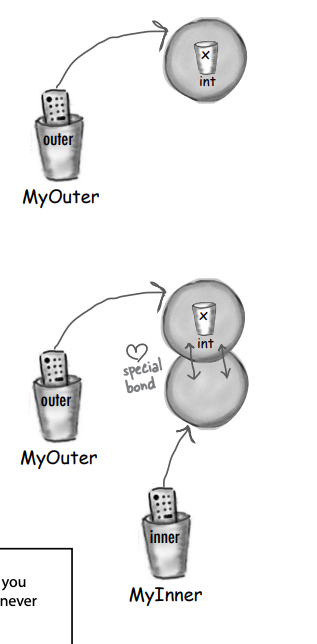

# Getting GUI

Kabul edelim, grafik kullanıcı Interfacelerine ihtiyacınız var. Eğer başkalarının kullanacağı uygulamalar
oluşturuyorsanız,
grafiksel bir Interfacee ihtiyacınız olacak. Kendiniz için programlar oluşturuyorsanız, bir grafik Interface
isteyeceksiniz.
Hatta mümkünse gelecekte hayatınızın geri kalanını sunucu tarafı kodu yazmakla geçireceğinize inansanız bile, er ya da
geç araçlar yazmanız gerekecek ve bir grafik Interface isteyeceksiniz. Elbette, komut satırı uygulamaları retrodur,
ancak
iyi bir şekilde değil. Onlar zayıf, esnek olmayan ve kullanıcı dostu değiller. İki bölüm boyunca GUI'ler üzerinde
çalışacağız ve bu süreçte Event Handling ve Inner Class'lar da dahil olmak üzere önemli Java dil özelliklerini
öğreneceğiz.

Bu bölümde, ekrana bir Button koyacak ve ona tıkladığınızda bir şey yapacak şekilde ayarlayacağız. Ekrana çizim
yapacağız, jpeg resim göstereceğiz ve hatta biraz animasyon yapacağız.

### It all starts with a window

JFrame, ekran üzerinde bir window'u temsil eden nesnedir. Butonlar, onay kutuları, metin alanları vb. gibi tüm Interface
öğelerini yerleştirdiğiniz yerdir. Gerçek bir menü çubuğu ve menü öğeleri olabilir. Ayrıca, platformunuza bağlı olarak
küçültme, büyütme ve pencereyi kapatma için tüm küçük pencere simgelerine sahiptir.

JFrame, bulunduğunuz platforma bağlı olarak farklı görünüme sahip olabilir.

**Making a GUI is easy:**

1 - Frame yarat

```JFrame frame = new JFrame();```

2 - Bir widget create et (button, textField, etc.)

```JButton button = new JButton("Click me");```

3 - Widget'i frame'e ekle

```frame.getContentPane().add(button);```

Frame'e doğrudan şeyler eklemiyorsunuz. Frame'i bir window etrafındaki süsleme olarak düşünün ve şeyleri window
pane'e eklersiniz.

4 - Frame'i göster

```
frame.setSize(300,300);
frame.setVisible(true);
```

**Put widgets in the window**

Bir JFrame'e sahip olduktan sonra, ona ('widget'lar) eklersiniz.
Ekleyebileceğiniz birçok Swing widgeti bulunmaktadır; bunları javax.swing paketinde arayabilirsiniz. En yaygın
kullanılanları arasında JButton, JRadioButton, JCheckBox, JLabel, JList, JScrollPane, JSlider, JTextArea, JTextField ve
JTable bulunur. Çoğu kullanımı gerçekten basittir, ancak bazıları (örneğin JTable gibi) biraz daha karmaşık olabilir.

```
public class SimpleGui1 {
    public static void main(String[] args) {
        JFrame frame = new JFrame();
        JButton button = new JButton("Click me");

        /* Bu satır, pencereyi kapattığınızda programın hemen sonlandırılmasını sağlar (eğer bu satırı çıkartırsanız,
        program sürekli olarak ekranda duracaktır).*/
        frame.setDefaultCloseOperation(JFrame.EXIT_ON_CLOSE);

        frame.getContentPane().add(button);
        frame.setSize(300,300);
        frame.setVisible(true);
    }
}
```

**Let’s see what happens when we run it:**


Bu, gerçekten büyük bir button'dur.Button, Framedeki tüm mevcut alanı doldurur. Daha sonra, button'un Framedeki konumunu
ve büyüklüğünü nasıl kontrol edeceğimizi öğreneceğiz.

### But nothing happens when I click it...

Bu tam olarak doğru değil. Button'a bastığınızda, 'basılmış' veya 'içeri itilmiş' bir görünüm gösterir (bu görünüm,
platformun görünüm ve hissine bağlı olarak değişir, ancak her zaman bastırıldığında bir tepki verir).
Gerçek soru şudur: "Kullanıcı ona tıkladığında button'u belirli bir işlemi nasıl yapacak şekilde ayarlarım?"

**İki şeye ihtiyacımız var:**

1 - Kullanıcı Button'a tıkladığında gerçekleşmesini istediğiniz bir işlemi yapmak için çağrılacak bir method
oluşturabilirsiniz.

2 - Bu methodun ne zaman trigger edileceğini bilmenin bir yolu. Başka bir deyişle, kullanıcının Button'a ne zaman
tıkladığını bilmenin bir yolu!

### Getting a user event

Kullanıcının butona bastığında, butonun metni "Click Me" yerine "Clicked" olarak değişsin istediğinizi hayal edin. Önce
butonun metnini değiştiren bir methodu yazabiliriz (API'ye hızlı bir bakış size bu methodu gösterecektir).

```
public void changeIt() {
   button.setText(“I’ve been clicked!”);
}
```

Şimdi ne yapacağız? Bu methodun ne zaman çalışacağını nasıl bileceğiz? Butona tıklandığında nasıl bileceğiz?

Java'da, kullanıcı etkinliğini alıp işlemeye event-handling (event işleme) denir. Java'da birçok farklı event türü
vardır, ancak çoğu GUI kullanıcı etkileşimleriyle ilgilidir. Kullanıcı bir Button'a tıklarsa, bu bir event'dir. Bu
event, "Kullanıcı bu Button'un eventinin gerçekleşmesini istiyor." anlamına gelir. "Slow Tempo" Button'u ise,
kullanıcının slow tempo eventinin gerçekleşmesini istediği anlamına gelir. Bir sohbet istemcisinin "Gönder" Button'u,
kullanıcının mesaj gönderme eventini gerçekleştirmek istediği anlamına gelir. En açık event, kullanıcının Button'a
tıkladığı andır, bu da bir eventin gerçekleşmesini istediğini gösterir.

Butonlarla genellikle, button basılıyor veya button bırakılıyor gibi ara eventlerle ilgilenmezsiniz. button'a şunu demek
istersiniz: "Kullanıcı button ile nasıl oynarsa oynasın, onunla ne kadar süreyle ilgilenirse ilgilensin, kaç kez fikrini
değiştirip bırakmadan önce üzerinden kaydırırsa kaydırsın, vs. umurumda değil. Bana sadece kullanıcı işlemle ciddi
olarak ilgileniyorsa haber ver! Yani başka bir deyişle, kullanıcı, lanet olası button'un söylediği şeyi yapmasını
istediğini gösterene kadar beni arama!"

**First, the button needs to know that we care.**


İkinci olarak, button'un bir button clicked event meydana geldiğinde bizi geri çağırması için bir yolun olması gerekir.

1 - Java'da bir button nesnesine event'leri ile ilgilendiğimizi bildirmek ve onunla ilgili event'leri dinlemek için
event listener kullanırız. Java'da event listener, bir event'in gerçekleştiğinde tetiklenecek olan metodu içeren bir
interface'dir. Bir sınıf, bu event listener interface'ini uygular ve böylece button'un eventlarını dinlemek ve yönetmek
için uygun hale gelir.

button bizi geri çağırmak için event listenerlari kullanır. event listener interface'i, belirli eventlerin
gerçekleştiğinde çağrılacak olan metodu içerir.

Eğer button'un event'lerine ilgi duyuyorsanız, "Sizin event'lerinizi dinliyorum." diyen bir interface'i (interface)
uygulayın.

Bir listener interface'i, listener (siz) ile event source (button) arasındaki köprüdür.

Swing GUI widget'lari event kaynaklarıdır (event sources). Java terimleriyle ifade edecek olursak, bir event source,
kullanıcı eylemlerini (fareye tıklama, tuşa basma, pencereyi kapatma) event'lere dönüştürebilen bir nesnedir. Ve Java'da
neredeyse her şey gibi, bir event bir nesne olarak temsil edilir. Bir event sınıfının nesnesi olarak temsil edilir.
API'deki java.awt.event paketini tararsanız, bir dizi event sınıfı bulacaksınız (hepsinin adında Event bulunur).
MouseEvent, KeyEvent, WindowEvent, ActionEvent ve diğerleri.

Bir event source (örneğin bir button), kullanıcının önemli bir şey yaptığında (örneğin button'a tıkladığında) bir event
nesnesi oluşturur. Yazdığınız kodun çoğu (ve bu kitaptaki tüm kod) eventleri alacak ve eventleri oluşturmayacaktır.
Başka bir deyişle, çoğunlukla bir event listener olarak zamanınızı geçireceksiniz, event source olarak değil.

Her event türüne karşılık gelen bir listener arabirimi vardır. Eğer MouseEvents istiyorsanız, MouseListener arabirimini
uygulayın. WindowEvents istiyorsanız WindowListener uygulayın. Fikri anladınız. Ve arabirim kurallarını hatırlayın - bir
arabirimi uygulamak için onu uyguladığınızı beyan edersiniz (class Dog implements Pet), bu da interface'de ki her method
için implementasyon methodlarını yazmanız gerektiği anlamına gelir.

Bazı interface'ler, event'in kendisi farklı varyasyonlarda olduğu için birden fazla methoda sahip olabilir. Örneğin
MouseListener arabirimini uygularsanız, mousePressed, mouseReleased, mouseMoved vb. için eventler alabilirsiniz. Bu fare
eventlerinin her biri interface'de ayrı bir methoda sahiptir, ancak hepsi MouseEvent'i alır. MouseListener'ı
uyguladığınızda, mousePressed() methodu kullanıcı fareyi bastığında çağrılır. Ve kullanıcı fareyi bıraktığında
mouseReleased() methodu çağrılır. Fare eventleri için sadece bir event nesnesi olan MouseEvent ve farklı
fare eventlerini temsil eden birkaç farklı event methodu bulunmaktadır.

### The Listener

Eğer sınıfınız bir Button'un ActionEvents eventlerini takip etmek istiyorsa, ActionListener arabirimini uygularsınız.
Button, ilgilendiğinizi bilmeli, bu yüzden Button ile addActionListener(this) şeklinde çağrı yaparak kendinizi Button
ile ilişkilendirir ve ActionListener referansını ona geçersiniz (bu durumda siz ActionListener olduğunuz için this'i
geçersiniz). Button'un, event meydana geldiğinde sizi geri çağırabilmesi için listener arabirimindeki methodu çağırması
gerekir. ActionListener olarak, arabirimin tek methodunu, yani actionPerformed() methodunu uygulamak zorundasınız.
Derleyici bunu garanti eder.

### The Event Source

Bir button, ActionEvents eventlarının kaynağı olduğu için hangi nesnelerin ilgili listenerlar olduğunu bilmesi
gerekmektedir. Button'un, ilgilenen nesnelere (listenerlara) ilgilendiklerini bildirebilmeleri için addActionListener()
methodu vardır.

button'un addActionListener() methodu çağrıldığında (bir potansiyel listener tarafından çağrıldığında), button bu
parametreyi (listener nesnesine referans) bir listede saklar. Kısacası, listenerlerin bir koleksiyonunu tutar.

Kullanıcı button'a tıkladığında, button, listedeki her listener üzerinde actionPerformed() methodunu çağırarak eventı
tetikler.

### Getting a button’s ActionEvent

1 - ActionListener interface'ini implemente edin

2 - Button ile register edin

3 - Event-Handling methodunu tanımla (ActionListener interface'inden actionPerformed() methodunu implemente et)

```
/* interface'i uygulayın. Bu, şunu söyler: "SimpleGui1B'nin bir instance'i BİR ActionListener'dir." (Button yalnızca
ActionListener interface'ini implemente edenlere event'ler verecektir)*/
public class SimpleGui1B implements ActionListener {
    JButton button;

    public static void main(String[] args) {
        SimpleGui1B gui = new SimpleGui1B();
        gui.go();
    }

    public void go(){
        JFrame frame = new JFrame();
        button = new JButton("Click");

        /* Button'la ilginizi register edin. Bu, button'a "Beni listener'lar listene ekle" demektir. Geçmeniz gereken
        argüman MUTLAKA ActionListener interface'ini implemente eden bir sınıfın bir nesnesi OLMALIDIR!*/
        button.addActionListener(this);

        frame.getContentPane().add(button);
        frame.setDefaultCloseOperation(JFrame.EXIT_ON_CLOSE);
        frame.setSize(300,300);
        frame.setVisible(true);
    }

    /* Button, size bir event'in meydana geldiğini bildirmek için bu methodu çağırır. Bize bir ActionEvent nesnesini
    argüman olarak gönderir, ancak bizim ona ihtiyacımız yok. Event'in meydana geldiğini bilmek yeterlidir.*/
    @Override
    public void actionPerformed(ActionEvent e) {
        button.setText("Clicked");
    }
}
```

### Listeners, Sources, and Events

Java kariyerinizin büyük bir bölümünde, source of events olmayacaksınız. Göreviniz iyi bir listener olmaktır.

**Listeners GETS the event :** Bir listener olarak, görevim interface'i implemente etmek, button ile register ve
event handling sağlamaktır.

Bir **event source** olarak, görevim listener'lardan registration'ları kabul etmek, kullanıcıdan event'leri almak ve
(kullanıcı beni tıkladığında) listener'in event-handling methodunu çağırmaktır.

**Event** : Bir event nesnesi olarak, görevim event callback methoduna (interface'den) argüman olarak geçmek ve eventle
ilgili verileri listener'lara taşımaktır.


Java kariyerinizin erken günlerinde, çoğunlukla event'in receiver'i ve source'u olmadığınız doğru. Çoğu zaman, Java
API'deki sınıflar tarafından "fired" eventlerin listener'ı olarak bulunacaksınız. Önemsediğiniz eventların çoğu, Java
API'sindeki sınıflar tarafından tetiklenecektir ve siz sadece bunları listener olarak takip edeceksiniz. Ancak, özel
bir event'e ihtiyaç duyan, örneğin bir hisse senedi piyasası izleme uygulaması tarafından önemli bulunan bir event,
StockMarketEvent gibi, tasarlayabilirsiniz.

Bu durumda, StockWatcher nesnesini bir event kaynağı yaparsınız ve bir button (veya başka bir source) gibi aynı adımları
takip edersiniz. Özel event'iniz için bir listener interface'i oluşturur, register methodu sağlarsınız (
addStockListener()), bu methodu çağıranları (listener'lari) listener listesine eklersiniz. Sonra bir hisse senedi
event'i meydana geldiğinde, StockEvent nesnesini (başka bir sınıfı oluşturacağınız) oluşturursunuz ve bu nesneyi
listener listesindeki herkese, stockChanged(StockEvent ev) methodunu çağırarak gönderirsiniz. Unutmayın ki her event
türü için uygun bir listener interface'i olmalıdır (yani stockChanged() methodunu içeren bir StockListener interface'i
oluşturacaksınız).

Çoğu zaman, çoğu tasarımda, event nesnesine ihtiyacınız olmaz. event nesnesi, eventla ilgili daha fazla bilgiyi iletmek
için küçük bir veri taşıyıcıdan ibarettir. Ancak bazen eventden belirli ayrıntıları sorgulamanız gerekebilir. Örneğin,
mousePressed() methodu çağrıldığında, fare tuşuna basıldığını biliyorsunuz. Ancak fare tuşunun tam olarak nereye
basıldığını bilmek istiyorsanız ne olacak? Diğer bir deyişle, fare tuşunun X ve Y ekran koordinatlarını öğrenmek
istiyorsanız?

Bazen aynı listener'i birden çok nesne ile kaydetmek isteyebilirsiniz. Örneğin, bir ekran hesap makinesi, 10 adet sayı
tuşuna sahip olabilir ve hepsi aynı işi yaptığından, her tuş için ayrı bir listener oluşturmak istemeyebilirsiniz.
Bunun yerine, bu 10 tuştan her biriyle tek bir listener'i kaydedebilir ve bir event aldığınızda (çünkü event geri çağrı
methodu çağrıldığında) event nesnesi üzerinde bir methodu çağırarak gerçek event kaynağını öğrenebilirsiniz. Diğer bir
deyişle, hangi tuşun bu eventi gönderdiğini öğrenebilirsiniz.

### Getting back to graphics...

Şimdi event'lerin nasıl çalıştığına dair biraz bilgi edindik (daha sonra daha fazla öğreneceğiz), şimdi ekrana bazı
şeyler yerleştirmeye geri dönelim. Eğlenceli grafikler oluşturmak için birkaç dakika harcayacağız ve daha sonra event
handling'e döneceğiz.

**Three ways to put things on your GUI:**

1 - Frame'e, widget'ları yerleştirin. Button, menu, radio button, etc. ```frame.getContentPane().add(myButton);```

2 - Bir widget üzerinde 2D grafikler çizme. Graphics object'ini kullanarak birşeyler çizmek

```graphics.fillOval(70,70,100,100);```

Boxes ve Circles'lardan çok daha fazlasını çizebilirsiniz; Java2D API, eğlenceli ve sofistike grafik methodları ile
doludur.

3 - Widget üzerine JPEG yerleştirin ```graphics.drawImage(myPic,10,10,this)```

### Make your own drawing widget

Kendi grafiklerinizi ekrana koymak istiyorsanız, en iyi seçeneğiniz kendi çizilebilir widget'inizi oluşturmaktır. Bu
widget'i, button veya diğer widget'lar gibi, frame'e yerleştirirsiniz; ancak göründüğünde üzerinde sizin görüntüleriniz
olur. Hatta bu görüntüleri animasyonlu bir şekilde hareket ettirebilir veya bir button'a tıkladığınızda ekrandaki
renkleri değiştirebilirsiniz.

**Make a subclass of JPanel and override one method, paintComponent().**

Tüm grafik kodunuz paintComponent() methodunun içine yerleştirilir. paintComponent() methodunu, sistem tarafından "
Merhaba widget, kendini çizme zamanı geldi" şeklinde çağrılan bir method olarak düşünebilirsiniz. Bir daire çizmek
istiyorsanız, paintComponent() methodu, bir daire çizmek için gerekli olan kodu içerir. Drawing panel'i içeren frame
gösterildiğinde, paintComponent() çağrılır ve daireniz görünür hale gelir. Kullanıcı window'u simge durumuna
getirir/minimize ederse, JVM frame'in de simgelendirildiğini anlar ve "repair" gerektiğini bilir, bu nedenle
paintComponent() tekrar çağrılır. JVM ekranın yenilenmesi gerektiğini düşündüğü her an, paintComponent() methodu
çağrılır.

Bir şey daha, bu methodu asla kendiniz çağırmazsınız! Bu methodun bir argümanı (bir Grafik nesnesi) gerçek ekran üzerine
yerleştirilen gerçek çizim tuvalidir. Bu nesneye kendiniz ulaşamazsınız, sistem tarafından size verilmelidir. Ancak daha
sonra göreceksiniz ki, sistemden ekrana yeniden çizme talep edebilirsiniz (repaint()), bu da sonunda paintComponent()
methodunun çağrılmasına yol açar.

```
/* özelleştirilmiş kendi widget'iniz olan JPanel alt sınıfı oluşturabilirsiniz. Bu widget türünü, diğer widget'lar ile
aynı şekilde bir frame'e ekleyebilirsiniz. Tek fark, bu özelleştirilmiş widget'in sizin kendi tasarladığınız bir widget
olmasıdır.*/
public class MyDrawPanel extends JPanel {
    public static void main(String[] args) {
        MyDrawPanel myDrawPanel = new MyDrawPanel();
    }

    /* Bu, Büyük Önemli Grafik methodudur. Asla kendiniz bunu çağırmazsınız. Sistem onu çağırır ve "İşte size
    boyanabilecek güzel ve taze bir draw surface, türü Grafik, şimdi üzerine çizim yapabilirsiniz." der.*/
    public void paintComponent(Graphics g) {
        /* Hayal edin ki 'g' bir boya makinesidir. Ona hangi renkle boyamasını söyleyip, hangi şekli boyayacağınızı 
        belirtiyorsunuz (koordinatlarla nereye gideceği ve ne kadar büyük olacağı ile birlikte).*/
        g.setColor(Color.orange);
        g.fillRect(20,50,100,100);
    }
}
```

### Fun things to do in paintComponent()

paintComponent() içinde yapabileceğiniz birkaç başka şeyi daha inceleyelim. Ancak en eğlenceli kısım, kendi
deneylerinizi yapmaya başladığınızda başlar. Sayılarla oynayarak deneyler yapın ve Graphics sınıfı için API belgelerine
bakın (daha sonra Graphics sınıfının dışında yapabileceğiniz daha fazla şey göreceğiz).

**Display a JPEG**

```
public void paintComponent(Graphics g) {
   Image image = new ImageIcon(getClass().getResource("catzilla.jpg")).getImage();
   /* Resmin sol üst köşesinin konumunu belirlemek için x ve y koordinatları kullanılır. Bu ifade, "panelin sol 
   kenarından 3 piksel uzaklıkta ve üst kenarından 4 piksel uzaklıkta" şeklinde anlam taşır. Bu sayılar her zaman 
   widget'a (bu durumda JPanel alt sınıfınıza) göre belirtilir, tüm frame ile ilişkili değildir.*/
   g.drawImage(image,3,4,this);
}
```

**Paint a randomly-colored circle on a black background**

```
public void paintComponent(Graphics g) {
    /* Panel'i black renk ile duldurur. ilk iki argüman panel'in x ve y eksenin de nereden baslanacagini tarif
    ederken, this.getWidth() ve this.getHeight() tüm paneli işaret eder*/
    g.fillRect(0,0,this.getWidth(), this.getHeight());

    int red = (int) (Math.random() * 256);
    int green = (int) (Math.random() * 256);
    int blue = (int) (Math.random() * 256);
    Color randomColor = new Color(red, green, blue);
    g.setColor(randomColor);
    /* 70 pixel left'dan başlar, 70 pixel topdan başlar, 100 pixel genişliğinde, 100 pixel boyunda */
    g.fillOval(70,70,100,100);
}
```


### Behind every good Graphics reference is a Graphics2D object.

paintComponent() methoduna olan argüman, java.awt.Graphics türünde tanımlanır.

```public void paintComponent(Graphics g)```

'g' parametresi, Graphics sınıfından türetilen bir alt sınıfı ifade eder. Polimorfizm sayesinde, Graphics sınıfına ait
alt sınıflardan biri olan Graphics2D sınıfı gibi alt sınıfların referansları da Graphics sınıfı ile aynı şekilde
kullanılabilir.

Yani, 'g' parametresi aslında bir Graphics2D nesnesidir.

Bir Graphics2D referansı ile bir Graphics referansı arasında farklı özellikler vardır ve Graphics2D referansı, Graphics
referansından daha fazlasını yapabilir. Aslında, Graphics referansı arkasında gizlice bir Graphics2D nesnesi
bulunabilir.

Polimorfizmi hatırlayın. Derleyici, hangi methodları çağırabileceğinizi referans türüne göre belirler, nesne türüne göre
değil. Eğer bir Animal referansı ile bir Dog nesnesine sahipseniz:

```Animal a = new Dog();```

Şu şekilde yapamazsınız:

```a.bark();```

Compiler gerçekten arkada bir Dog olduğunu bile bilse, 'a'ya bakar, onun Animal türünde olduğunu görür ve Animal
sınıfında bark() için uzaktan kumanda buttonsi olmadığını tespit eder. Ancak yine de gerçekten bir Dog olan nesneyi şu
şekilde ifade ederek elde edebilirsiniz:

```
Dog d = (Dog) a;
d.bark();
```

Graphics nesnesi ile ilgili ana nokta şudur:
Eğer Graphics2D sınıfından bir methodu kullanmanız gerekiyorsa, bu methodu doğrudan paintComponent parametresi ('g') ile
kullanamazsınız. Ancak onu yeni bir Graphics2D variablei ile dönüştürebilirsiniz.

```Graphics2D g2d = (Graphics2D) g;```

**Graphic referansı üzerinden çağırabileceğiniz methodlar;**

* drawImage()
* drawLine()
* drawPolygon
* drawRect()
* drawOval()
* fillRect()
* fillRoundRect()
* setColor()

**Graphics2D referansı üzerinden çağırabileceğiniz methodlar;**

* fill3DRect()
* draw3DRect()
* rotate()
* scale()
* shear()
* transform()
* setRenderingHints()

Bu methodların tamamını kapsamaz. API'a bakmanız gerekmektedir.

### Because life’s too short to paint the circle a solid color when there’s a gradient blend waiting for you.

```
public void paintComponent(Graphics g) {
   Graphics2D g2d = (Graphics2D) g;

   /* ilk iki parametre starting point, üçüncü parametre starting color, dördüncü ve beşinci parametre end point,
   son parametre ending color */
   GradientPaint gradientPaint = new GradientPaint(70,70,Color.blue,150,150,Color.orange);
   
   g2d.setPaint(gradientPaint);
   g2d.fillOval(70,70,100,100);
}
```

```
public void paintComponent(Graphics g) {
    Graphics2D g2d = (Graphics2D) g;

    int red = (int) (Math.random() * 256);
    int green = (int) (Math.random() * 256);
    int blue = (int) (Math.random() * 256);
    Color startColor = new Color(red, green, blue);
    red = (int) (Math.random() * 256);
    green = (int) (Math.random() * 256);
    blue = (int) (Math.random() * 256);
    Color endColor = new Color(red, green, blue);
    GradientPaint gradient = new GradientPaint(70,70,startColor, 150,150, endColor);
    g2d.setPaint(gradient);
    g2d.fillOval(70,70,100,100);
}
```

**BULLET POINTS**

-- EVENTS --

* Bir grafik interface'i (GUI) oluşturmak için genellikle bir pencere ile başlarsınız, bu genellikle bir JFrame'dir.

```JFrame frame = new JFrame();```

* JFrame'e widget'lar ekleyebilirsiniz. (button,text fields, etc.)

```frame.getContentPane().add(button);```

* Diğer birçok component'den farklı olarak, JFrame doğrudan içine eklemenize izin vermez; bu nedenle JFrame'in content
  pane'ine eklemeniz gerekir.

* Pencereyi (JFrame) görüntülemek için ona bir boyut vermeniz ve görünür olmasını söylemeniz gereklidir.

```
frame.setSize(300,300);
frame.setVisible(true);
```

* Kullanıcının bir buttona tıkladığını (veya kullanıcı interface'inde başka bir eylem yaptığını) öğrenmek için GUI
  eventlerini dinlemeniz gereklidir.
* Event'leri dinlemek için, ilgi duyduğunuz event source ile register olmanız gerekir. Bir event source, (button, check
  box vb.) kullanıcı etkileşimine dayalı olarak bir event'i tetikleyen nesnedir.
* Listener interface, event source'un bir olay meydana geldiğinde sizi geri çağırmasına olanak tanır çünkü interface,
  event source'un event meydana geldiğinde çağıracağı metodları tanımlar.
* Bir event ile source'a kaydolmak için, source'un register methodunu çağırmanız gerekir. Registration methodları her
  zaman şu şekilde olur: ```add<EventType>Listener```. Örneğin, bir button'un ActionEvents etkinliklerine register olmak
  için şu şekilde çağırılması gerekir: ```button.addActionListener(this);```
* Interface'in tüm event handling methodlarını implemente ederek listener interface'ini implemente edin. Event handling
  kodunuzu Listener'in callback methoduna koyun

```
public void actionPerformed(ActionEvent e) {
    button.setText("Clicked");
}
```

* Event-Handler methoduna geçirilen event nesnesi, event hakkında bilgi taşır ve event'in source'unu da içerir.

--- GRAPHICS ---

* Bir widget'a doğrudan 2D grafikler çizebilirsiniz.
* Bir widget'a .gif veya .jpg doğrudan çizebilirsiniz.
* Kendi grafiklerinizi (gif veya jpeg de dahil olmak üzere) çizmek için, JPanel sınıfından bir alt sınıf oluşturun ve
  paintComponent() methodunu override edin
* paintComponent() methodu GUI sistemi tarafından otomatik olarak çağrılır. Siz asla bunu kendiniz çağırmamalısınız.
  paintComponent() methodunun argümanı olan Graphics nesnesi, çizim yapmak için bir yüzey sağlar ve çizimleriniz sonunda
  ekran üzerinde görüntülenecektir.
* Tipik olarak, bir Graphics nesnesi üzerinde (paintComponent parametresi) çağrılan yaygın methodlar şunlardır:

```
g.setColor(Color.blue);
g.fillRect(20,50,100,120)
```

### We can get an event. We can paint graphics. But can we paint graphics when we get an event?

Haydi drawing panel'de bir değişiklik için bir event bağlayalım. Button'a her tıkladığınızda dairenin rengini
değiştireceğiz. İşte programın akışı:

1 - Pencere iki widget ile oluşturulur: draw panel ve bir button. Bir listener oluşturulur ve button'la
ilişkilendirilir. Ardından frame görüntülenir ve sadece kullanıcının tıklamasını bekler.


2 - Kullanıcı button'a tıklar ve button bir event nesnesi oluşturur ve event listener'in event-handler'ini çağırır.


3 - Event-Handler, draw panel üzerinde repaint() methodunu çağırır. Sistem bu çağrıyı alır ve paintComponent() methodunu
draw panel üzerinde çağırır.

4 - İşte! Yeni bir renk çizildi çünkü paintComponent() tekrar çalıştı ve daireyi rastgele bir renkle doldurdu.


### GUI layouts: putting more than one widget on a frame

Sonraki bölümde GUI düzenlerini ele alıyoruz, ancak size işleri başlatmak için burada hızlı bir ders yapacağız. Bir
frame'in varsayılan olarak beş bölgesi vardır ve her bir bölgeye yalnızca bir şey ekleyebilirsiniz, ancak
endişelenmeyin! Bu bir şey, üç diğer şeyi içeren bir panel olabilir, bu panel de iki diğer şeyi içeren bir panel
olabilir ve... fikri anladınız. Aslında, button'u frame'e eklerken 'hile yapıyorduk', şu şekilde:

```frame.getContentPane().add(button);```


### The circle changes color each time you click the button.


Ilk olarak Graphic2D oluşturmak için MyDrawPanel'in kodunu yazıyorum. Bana bir circle döndürecek

```
public class MyDrawPanel extends JPanel {
    public void paintComponent(Graphics g) {
        Graphics2D g2d = (Graphics2D) g;

        int red = (int) (Math.random() * 256);
        int green = (int) (Math.random() * 256);
        int blue = (int) (Math.random() * 256);
        Color startColor = new Color(red, green, blue);

        red = (int) (Math.random() * 256);
        green = (int) (Math.random() * 256);
        blue = (int) (Math.random() * 256);
        Color endColor = new Color(red, green, blue);

        GradientPaint gradient = new GradientPaint(70, 70, startColor, 150, 150, endColor);
        g2d.setPaint(gradient);
        g2d.fillOval(70, 70, 100, 100);
    }
}
```

Daha sonra bu Circle'i JFrame içerisinde kullanmak için SimpleGui3C class'imi yaziyorum

```
public class SimpleGui3C implements ActionListener {
    JFrame frame;

    public static void main(String[] args) {
        SimpleGui3C gui = new SimpleGui3C();
        gui.go();
    }

    public void go() {
        frame = new JFrame();
        frame.setDefaultCloseOperation(JFrame.EXIT_ON_CLOSE);

        JButton button = new JButton("Change colors");
        button.addActionListener(this);

        MyDrawPanel drawPanel = new MyDrawPanel(); // Graphics2D olarak circle döndürecek

        frame.getContentPane().add(BorderLayout.SOUTH, button); // Button SOUTH konumuna konumlandırılacak
        frame.getContentPane().add(BorderLayout.CENTER,drawPanel); // drawPanel CENTER'a
        frame.setSize(300,300);
        frame.setVisible(true);
    }

    @Override
    public void actionPerformed(ActionEvent e) {
        frame.repaint(); // paintComponent() her widget için tekrar çağırılır
    }
}
```

### Let’s try it with TWO buttons

South button'u şu anki gibi davranmaya devam edecek, sadece frame'i yeniden boyayacak. İkinci button (NORTH bölgesine
yerleştireceğimiz) bir label'daki metni değiştirecek.

**Şu anda dört widget'a ihtiyacımız olacak;**


**Ve iki event'i almaya ihtiyacımız olacak**


Bunu gerçekleştirmek mümkün mü? Bir actionPerformed() methodu olduğunda sadece bir tane event varken, nasıl iki event
alırsınız?

**Her bir button'un farklı bir işlem yapması gerektiğinde, nasıl iki farklı button için action event'leri elde
edersiniz?**

1 - Option one : 2 adet actionPerformed() methodu implemente ederek; Ama bu imkansızdır.

```
class MyGui implements ActionListener {
    // lots of code here and then:
    public void actionPerformed(ActionEvent event) {
        frame.repaint();
    }
    public void actionPerformed(ActionEvent event) {
        label.setText(“That hurt!”);
    }
}
```

Yapamazsınız! Bir Java sınıfında aynı methodu iki kez implemente edemezsiniz. Derlenmez. Ve hatta yapabilirseniz, event
source hangi iki methoddan hangisini çağıracağını nasıl bilecek?

2 - Option two : Aynı listener'i her iki buttona da register edin:

```
class MyGui implements ActionListener {
    // declare a bunch of instance variables here
    public void go() {
        // build gui
        colorButton = new JButton();
        labelButton = new JButton();
        colorButton.addActionListener(this); // aynı listener'a register ediliyorlar
        labelButton.addActionListener(this); // aynı listener'a register ediliyorlar
        // more gui code here ...
    }

    public void actionPerformed(ActionEvent event) {
        // Event nesnesini sorgulayarak hangi button'a ait olduğunu belirleyin ve bunu ne yapacağınıza karar vermek 
        // için kullanın.
        if (event.getSource() == colorButton) {
            frame.repaint();
        } else {
            label.setText(“That hurt !”);
        }
    }
}
```

Bu işe yarıyor ancak çoğu durumda pek nesne yönelimli bir yaklaşım değil. Bir event handler'in birçok farklı işi
yapması, tek bir methodun birçok farklı işi yapması anlamına gelir. Bir source'un nasıl işlendiğini değiştirmeniz
gerektiğinde, herkesin event handler'a müdahale etmesi gerekebilir. Bazen iyi bir çözüm olabilir, ancak genellikle
sürdürülebilirliği ve genişletilebilirliği zorlar.

3 - Option three : İki ayrı ActionListener sınıfı oluşturun

```
class MyGui {
    JFrame frame;
    JLabel label;

    void gui() {
        // code to instantiate the two listeners and register one
        // with the color button and the other with the label button
    }
} // close class
```

------------------------------------------------------------

```
class ColorButtonListener implements ActionListener {
    public void actionPerformed(ActionEvent event) {
        frame.repaint(); // İşe yaramaz! Bu sınıf, MyGui sınıfının 'frame' variable'ina bir referansa sahip değil.
    }
}
```

------------------------------------------------------------

```
class LabelButtonListener implements ActionListener {
    public void actionPerformed(ActionEvent event) {
        // İşe yaramaz! Bu sınıf, MyGui sınıfının 'label' variable'ina bir referansa sahip değil.
        label.setText(“That hurt!”); 
    }
}
```

Bu sınıflar, üzerinde işlem yapmaları gereken 'frame' ve 'label' gibi variable'lara erişim sağlayamazlar. Bu durumu
düzeltebilirsiniz, ancak her bir listener sınıfına ana GUI sınıfına bir referans vermeniz gerekecek, böylece
actionPerformed() methodlarının içinde listener, GUI sınıfının variable'larına erişmek için GUI sınıfı referansını
kullanabilir. Ancak bu encapsulation'ı bozmak anlamına gelir, bu nedenle muhtemelen GUI widget'larına erişim sağlamak
için getter methodlarını oluşturmanız gerekecektir (getFrame(), getLabel(), vb.). Muhtemelen listener sınıfına bir
constructor eklemeniz gerekecek, böylece listener oluşturulduğunda GUI referansını iletebilirsiniz. Ve işler daha
karmaşık hale gelir. Daha iyi bir yol olmalı!

Keşke iki farklı listener sınıfına sahip olabilseydiniz ve listener sınıfları, neredeyse listener sınıflarının başka
sınıfa aitmiş gibi ana GUI sınıfının instance variables'larına erişebilseydi, değil mi? Böylece her iki dünyanın da en
iyisine sahip olabilirsiniz. Evet, bu harika olurdu. Ancak bu sadece bir hayal...

### Inner class to the rescue!

Bir sınıfı başka bir sınıfın içine yerleştirebilirsiniz. Bu oldukça kolaydır. Sadece inner class'ın tanımını, outer
class'ın süslü parantezlerinin içine yerleştirdiğinizden emin olun.


Bir inner class, outer class'ın tüm methodlarını ve variable'larını, hatta private olanları bile, kullanabilir. Inner
class, bu variable'ları ve methodları, adeta kendi inner class'ının içinde tanımlanmış gibi kullanabilir.

Bir Inner Class, outer class'ın bileşenlerini private bir erişimle kullanma yetkisi kazanır. Inner class, outer class'ın
private variable'larını ve methodlarını, adeta bu variable'lar ve members'lar Inner Class'ta tanımlanmış gibi
kullanabilir. İşte Inner Classların pratik olmasını sağlayan şey bu – normal bir sınıfın çoğu avantajına sahiptirler,
ancak private erişim yetkileri ile.

```
public class MyOuterClass {
    private int x;

    class MyInnerClass{
        void go(){
            x = 42; // inner class'ın bir variable'i gibi 'x' değişkenini kullanın!
        }
    }
}
```

### An inner class instance must be tied to an outer class instance*

1 - Outer class'dan bir instance'ını oluşturun


2 - Outer class'ın instance'ını kullanarak Inner Class'ın bir instance'ını oluşturun.


3 - Outer ve inner nesneler şimdi inner geçmiş bir şekilde bağlıdır.


Bu iki nesne bellekte özel bir bağa sahiptir. Inner olan object, outer variable'larını kullanabilir (ve tersi de
geçerlidir).

### How to make an instance of an inner class

Eğer bir Inner Class'ı, Outer class içindeki kodla instantiate ederseniz, inner object - outer object ile "bağ"
oluşturacaktır. Örneğin, bir method içindeki kod Inner Class'ı instantiate ettiğinde, inner object, methodu çalıştıran
instance ile bağ oluşturacaktır. Bir outer class'ın içindeki kod, kendi Inner Classlarından birini, tamamen diğer
sınıfları örneklendirdiği gibi örneklendirebilir... new MyInner() şeklinde;

```
public class MyOuter {
    /* Outer class x isminde bir instance variable'a sahiptir */
    private int x;
    /* Inner class'a ait instance'i yarat */
    MyInner inner = new MyInner();
    public void doStuff(){
        /* Inner class içerisinde ki kodu call et*/
        inner.go();
    }

    class MyInner{
        void go(){
            /* Inner Class'taki method, outer class'ın instance variable'i olan 'x'i, adeta 'x' inner class'a aitmiş
            gibi kullanır.*/
            x = 42;
        }
    }
}

```



### Now we can get the two-button code working

```
/* Artık class bazında ActionListener'i implemente etmiyorum. Inner class olarak configure ediyorum */
public class TwoButtons {
    JFrame frame;
    JLabel label;

    public static void main(String[] args) {
        TwoButtons gui = new TwoButtons();
        gui.go();
    }

    void go(){
        frame = new JFrame();
        label = new JLabel("I am a label");
        frame.setDefaultCloseOperation(JFrame.EXIT_ON_CLOSE);

        JButton changeLabelButton = new JButton("Change Label");
        changeLabelButton.addActionListener(new LabelListener()); //LabelListener instance'ini kullanıyorum

        JButton changeCircleColorButton = new JButton("Change Circle Color");
        changeCircleColorButton.addActionListener(new ColorListener()); //ColorListener instance'ini kullanıyorum

        MyDrawPanel drawPanel = new MyDrawPanel();

        frame.getContentPane().add(BorderLayout.EAST,changeLabelButton);
        frame.getContentPane().add(BorderLayout.WEST,label);
        frame.getContentPane().add(BorderLayout.SOUTH,changeCircleColorButton);
        frame.getContentPane().add(BorderLayout.CENTER,drawPanel);
        frame.setSize(300, 300);
        frame.setVisible(true);
    }

    class ColorListener implements ActionListener{
        @Override
        public void actionPerformed(ActionEvent e) {
            frame.repaint();
        }
    }

    class LabelListener implements ActionListener{
        @Override
        public void actionPerformed(ActionEvent e) {
            label.setText("Ouch!");
        }
    }
}
```

```
public class MyDrawPanel extends JPanel {
    public void paintComponent(Graphics g) {
        Graphics2D g2d = (Graphics2D) g;

        int red = (int) (Math.random() * 256);
        int green = (int) (Math.random() * 256);
        int blue = (int) (Math.random() * 256);
        Color startColor = new Color(red, green, blue);

        red = (int) (Math.random() * 256);
        green = (int) (Math.random() * 256);
        blue = (int) (Math.random() * 256);
        Color endColor = new Color(red, green, blue);

        GradientPaint gradient = new GradientPaint(70, 70, startColor, 150, 150, endColor);
        g2d.setPaint(gradient);
        g2d.fillOval(70, 70, 100, 100);
    }
}
```

--**DIALOGS**--

HeadFirst : Inner class'ları önemli kılan nedir?

Inner Object : Nereden başlamalıyım? Bir sınıf içinde aynı interface'i birden fazla kez implemente etme şansı veriyoruz.
Unutmayın, normal bir Java sınıfında bir methodu birden fazla kez implemente edemezsiniz. Ancak Inner class'ları
kullanarak, her inner class aynı interface'i implemente edebilir, böylece tamamen aynı interface methodlarının farklı
implementasyonlarına sahip olabilirsiniz.

HeadFirst : Neden aynı methodu iki kez implement etmek isteyesiniz ki?

Inner Object : Haydi GUI event handler'i tekrar ele alalım. Düşünün... Eğer üç button'a farklı event behavior
eklemek istiyorsanız, o zaman üç inner class kullanın; hepsi ActionListener'ı implemente edecek şekilde — bu da her
sınıfın kendi actionPerformed methodunu implemente edilmesi anlamına gelir.

HeadFirst : Peki inner class'ları kullanmak için tek neden event handler'lar mı?

Inner Object : Event Handler sadece açık bir örnek. Herhangi bir zamanda ayrı bir sınıfa ihtiyaç duyduğunuzda, ancak
bu sınıfın hâlâ başka bir sınıfın bir parçası gibi davranmasını istiyorsanız, inner class bunu yapmanın en iyi—ve bazen
tek—yoludur.

HeadFirst : Eğer inner class'ın, outer class'a ait gibi davranmasını istiyorsanız, neden başlangıçta ayrı bir sınıf
kullanıyorsunuz? Neden inner class kodunu başlangıçta outer class'ın içine koymuyorsunuz?

Inner Object : Size sadece bir senaryo verdim, bir Interface'in birden fazla implementasyonuna ihtiyaç duyduğunuz bir
senaryo. Ancak Interface'leri kullanmasanız bile, bu sınıfların iki farklı şeyi temsil ettiği durumlarda bile iki farklı
sınıfa ihtiyaç duyabilirsiniz. Bu iyi bir object oriented'dır

HeadFirst : Sanırım Nesne Yönelimli tasarımın büyük bir kısmının reuse ve maintenance ile ilgili olduğunu
düşünüyorum. Bilirsiniz, eğer iki ayrı sınıfınız varsa, her biri bağımsız olarak değiştirilip kullanılabilir, tek bir
sınıfa her şeyi doldurmak yerine falan filan. Ancak Inner bir sınıf kullanıyorsanız, sonunda hala gerçekte bir sınıf
ile çalışıyorsunuz, değil mi? Kaplayan sınıf yeniden kullanılabilir ve herkesten bağımsız olan tek sınıftır. Inner
sınıflar tam anlamıyla yeniden kullanılamazlar. Aslında, onlara "Reuseless-useless" dendiğini duydum defalarca.

Inner Object : Evet, inner class'ın yeniden kullanılabilir olmadığı doğru, hatta bazen hiç yeniden kullanılamaz, çünkü
outer class'ın instance variable'ları ve metodlarıyla yakından bağlantılıdır.

Head First : Bu sadece benim noktama işaret ediyor! Eğer yeniden kullanılamıyorlarsa, neden ayrı bir sınıf ile uğraşalım
ki? Yani, interface sorunu dışında, ki bu benim için geçici bir çözüm gibi görünüyor.

Inner Object : Söylemeye çalıştığım şu ki, IS-A ve polymorphism'i düşünmelisiniz.

Head First : Tamam, zaten bunları düşünüyorum

Inner Object : Çünkü outer ve inner sınıflar farklı IS-A testlerini geçmek zorunda kalabilirler! Hadi polymorphic GUI
listener örneğiyle başlayalım. Butonun listener register methodu için deklare edilen argüman türü nedir? Başka bir
deyişle, API'ye gidip kontrol ederseniz, addActionListener() methoduna hangi tür şeyi (sınıf veya arayüz türü)
iletmelisiniz?

Head First : Bir listener iletmelisiniz. Belirli bir listener interface'i implemente eden bir şey, bu durumda
ActionListener. Evet, bunların hepsini biliyoruz. Peki, amacınız nedir?

Inner Object : Benim demek istediğim şu ki, polymorphism açısından, yalnızca belirli bir türü alan bir methodunuz var.
ActionListener için IS-A testini geçen bir şey. Ama ve işte büyük nokta şurada: Sınıfınızın, bir interface yerine bir
sınıf türünün bir IS-A'sı olması gerekiyorsa ne olacak?

Head First : Sınıfınızın, olmak istediğiniz sınıfı extend etmesi gerekmez mi? Subclassing işleminin nasıl çalıştığının
tam da noktası bu değil mi? Eğer B, A'nın alt sınıfı ise, A'nın beklenildiği herhangi bir yerde B kullanılabilir. Tüm "
Bir Animal'ın belirtilen türü olan bir Dog geçirin" durumu işte budur.

Inner Object : Peki ya şimdi, iki farklı sınıf için IS-A testini geçmeniz gerekiyorsa ne olur? Aynı kalıtım
hiyerarşisinde olmayan sınıflar için?

Head First : Evet, işte tam da... Hmmm. Sanırım anlıyorum. Her zaman birden fazla interface'i implemente edebilirsiniz,
ancak yalnızca bir sınıfı extend edebilirsiniz. Sınıf türleri söz konusu olduğunda sadece bir türde IS-A olabilirsiniz.

Inner Object : Harika! Evet, hem Dog hem de Button olamazsınız. Ancak, bazen bir Button gibi davranmanız gereken bir
Dog'saniz (bir Button alabilen methodlara kendinizi iletmek için), Dog sınıfı (Button genişletemediği için Animal'ı
genişletir) Dog'un adına bir Button gibi davranan bir inner class'a sahip olabilir. Bu inner class, Button'ı
extend ederek Dog'un yerine Button gibi davranır ve böylece bir Button gerektiği her yerde Dog, inner Button'unu kendisi
yerine iletebilir. Başka bir deyişle, x.takeButton(this) demek yerine, Dog nesnesi x.takeButton(new MyInnerButton())
şeklinde çağrı yapar.

Head First : Bir örnek alabilir miyim?

Inner Object : Tabii ki, kendi JPanel alt sınıfınızı oluşturduğumuz DrawPanel'i hatırlıyorum. Şu an, bu sınıf ayrı
bir inner olmayan sınıf. Ve bu da sorun değil, çünkü sınıfın ana GUI'nin örnek değişkenlerine özel erişime ihtiyacı
yok. Ancak ya ihtiyacı olursa? Diyelim ki bu panoda bir animasyon yapıyoruz ve koordinatlarını ana uygulamadan alıyor (
örneğin, kullanıcının GUI'nin başka bir yerinde yaptığı bir şeye dayalı olarak). Bu durumda, DrawPanel'i inner bir
sınıf yaparsak, DrawPanel sınıfı JPanel'ın alt sınıfı olurken, outer sınıf hala başka bir şeyin alt sınıfı olmaya devam
edebilir.

Head First : Evet, anladım! Ve zaten DrawPanel, neyi gerçekten çizdiği bu belirli GUI uygulamasına özgü olduğu için ayrı
bir sınıf olarak yeterince reusable değil.

Inner Object : Evet, tamamdır

Head First : Sonra inner ve outer instance arasındaki relationship'in doğasına geçebiliriz.

Inner Object : Polimorfizm gibi ciddi bir konuda yeterince çılgınca dedikodu yok mu?

Head First : Yani, birisi sizi oluşturur ve hemen outer nesneye bağlanır mı, doğru mu anlıyorum?

Inner Object : Evet, doğru. Ve evet, bazıları bunu düzenlenmiş bir evliliğe benzetti. Hangi nesneye bağlandığımıza karar
verme hakkımız yok.

Head First : Tamam, evlilik benzetmesiyle devam edeyim. Boşanabilir ve başka bir şeye tekrar evlenebilir misiniz?

Inner Object : Hayır, hayat boyu

Head First : Hangi yaşam? Sizin mi? Outer nesne mi? Her ikisi mi?

Inner Object : Benimki. Başka bir outer nesneye bağlı olamam. Tek çıkış yolum garbage collection'dır

Head First : Peki, outer nesne ne olacak? Başka inner nesnelerle ilişkilendirilebilir mi?

Inner Object : Şimdi tam olarak anladık. İşte gerçekten istediğiniz bu. Evet, evet. Sözde "eşim", istediği kadar inner
nesneye sahip olabilir.

Head First : Bu seri monogami gibi mi? Yoksa hepsine aynı anda sahip olabilir mi?

Inner Object : Hepsini aynı anda. İşte, tatmin oldunuz mu?

Head First : Evet, mantıklı görünüyor. Ve unutmayalım ki, sizdiniz "aynı interface'in birden fazla implementasyonunu"
öven kişi. Bu yüzden outer sınıfın üç button'u varsa, event handling için üç farklı inner sınıfa (ve böylece üç farklı
inner sınıf nesnesine) ihtiyaç duyacağı mantıklıdır.

### Using an inner class for animation

Gördük ki inner sınıflar, aynı event handling methodunu birden fazla kez implemente etme olanağı sağladığı için event
listener'ları için kullanışlıdır. Ancak şimdi inner bir sınıfın outer sınıfın extend edilmediği bir şeyin alt sınıfı
olarak kullanıldığında ne kadar faydalı olduğuna bakalım. Başka bir deyişle, outer sınıf ve inner sınıfın farklı kalıtım
ağaçlarında olduğu durumları ele alalım! Amacımız, ekranın sol üstünden sağ altına doğru hareket eden bir dairenin basit
bir animasyonunu yapmaktır.


**How simple animation works**

1 - Bir nesneyi belirli bir x ve y koordinatında çizmek

```g.fillOval(20,50,100,100); // 20 pixel from the left, 50 pixel from the top```

2 - Bir nesneyi farkli x ve y koordinatlarında tekrar çizmek

```g.fillOval(25,55,100,100); // 25 pixel from the left, 55 pixel from the top```

3 - Animasyonun devam ettiği sürece x ve y değerlerini değiştirerek önceki adımı tekrarlayın.

**What we really want is something like...**

```
public class MyDrawPanel extends JPanel {
    public void paintComponent(Graphics g) {
        g.setColor(Color.orange);
        g.fillOval(x,y,100,100);
    }
}
```

Peki, yeni x ve y koordinatlarını nereden alacağız?

```
public class SimpleAnimation {

    /* x ve y coordinatları için 2 instance variable */
    int x = 70;
    int y = 70;

    public static void main(String[] args) {
        SimpleAnimation simpleAnimation = new SimpleAnimation();
        simpleAnimation.go();
    }

    private void go() {
        JFrame frame = new JFrame();
        frame.setDefaultCloseOperation(JFrame.EXIT_ON_CLOSE);

        MyDrawPanel myDrawPanel = new MyDrawPanel(); //DrawPanel inner class olarak eklendi

        frame.getContentPane().add(myDrawPanel);
        frame.setSize(300,300);
        frame.setVisible(true);

        for (int i=0;i<130;i++){
            x++; // x coordinatı 1 artırılıyor
            y++; // y coordinatı 1 artırılıyor
            myDrawPanel.repaint(); // panel sürekli baştan çizdiriliyor
            try {
                Thread.sleep(50); // 50 ms de bir circle aşağıya doğru hareket ediyor
            } catch (InterruptedException e) {
                throw new RuntimeException(e);
            }
        }
    }

    class MyDrawPanel extends JPanel{
        @Override
        public void paint(Graphics g) {
            g.setColor(Color.white);
            g.fillRect(0,0,this.getWidth(),this.getHeight());
            g.setColor(Color.green);
            g.fillOval(x,y,40,40);
        }
    }
}
```

### Listening for a non-GUI event

Peki, belki bir müzik videosu değil, ancak müziğin ritmiyle ekranda rastgele grafikler çizen bir program yapacağız.
Kısacası, program müziğin ritmini dinler ve her vuruşla birlikte rastgele bir grafik dikdörtgeni çizer.

Bu durum bize bazı yeni sorunları getiriyor. Şimdiye kadar sadece GUI event'lerini listen ettik, ancak şimdi belirli bir
türdeki MIDI eventini dinlememiz gerekiyor. Aslında, GUI olmayan bir event'i dinlemek, GUI event'lerini dinlemek
gibidir:
Bir listener interface'ini implemente edersiniz, listener bir event source'u register eder ve ardından geriye oturur
ve event source'un event handling methodunu (listener interface'inde tanımlanan method) çağırmasını beklersiniz.

Müziğin ritmini dinlemek için en basit yol, gerçek MIDI event'lerini kaydetmek ve dinlemek olurdu; böylece sekansör
event'i aldığında, kodumuz da alır ve grafiği çizebilir. Ancak... bir sorun var. Aslında bir hata var ve yaptığımız MIDI
event'lerini (NOTE ON için olanları) dinleyemeyiz.

Bu nedenle biraz düzenlemeye ihtiyacımız var. Dinleyebileceğimiz başka bir tür MIDI event'i var, bu da ControllerEvent
olarak adlandırılır. Çözümümüz ControllerEvent'leri dinlemek ve ardından her NOTE ON event'i için, aynı "vuruş"ta
eşleşen bir ControllerEvent'in olduğundan emin olmaktır. ControllerEvent'in aynı anda nasıl tetiklendiğinden emin
oluyoruz? Onu diğer event'ler gibi parçaya ekliyoruz! Başka bir deyişle, müzik sıramız şöyle olur:

BEAT 1 - NOTE ON, CONTROLLER EVENT
BEAT 2 - NOTE OFF
BEAT 3 - NOTE ON, CONTROLLER EVENT
BEAT 4 - NOTE OFF

ve bunun gibi.

Ancak tam programın içine dalmadan önce, MIDI message/events'leri yapmayı ve eklemeyi biraz daha kolay hale getirelim;
çünkü bu programda birçok tane yapacağız.

**What the music art program needs to do:**

1 - Bir dizi MIDI message/event oluşturun; piyano üzerinde (veya seçtiğiniz enstrüman üzerinde) rastgele notalar çalacak
şekilde.

2 - Listener'ları event'ler için register edin

3 - Sequencer'i çalmaya başlatın

4 - Her listener'in event handling methodu çağrıldığında, draw panelinde rastgele bir dikdörtgen çizin ve repaint
methodunu çağırın.

**We’ll build it in three iterations:**

1 - Version One :

Çok sayıda MIDI event'i yapacağımız için MIDI event'leri oluşturmayı ve eklemeyi basitçe sağlayan kod.

2 - Version Two :

Event'leri register etmeyi ve dinlemeyi gerçekleştirin, ancak grafik olmadan. Her vuruşta komut satırında bir mesaj
yazdırır.

3 - Version Three :

Gerçek iş. İkinci sürüme grafikler ekler.

### An easier way to make messages / events

Şu anda bir parça için mesajları ve eventleri oluşturup eklemek sıkıcı. Her mesaj için mesaj instance'i yapmalıyız (bu
durumda ShortMessage), setMessage() methodunu çağırmalıyız, mesaj için bir MidiEvent yapmalı ve event'i parçaya
eklemeliyiz. Geçen bölümün kodunda, her mesaj için her adımı geçtik. Bu, sadece bir notayı çalıp sonra çalmayı durdurmak
için sekiz satır kod anlamına gelir! Bir NOTE ON event'i eklemek için dört satır, ve bir NOTE OFF event'i eklemek için
dört satır.

```
ShortMessage a = new ShortMessage();
a.setMessage(144, 1, note, 100);
MidiEvent noteOn = new MidiEvent(a, 1);
track.add(noteOn);
ShortMessage b = new ShortMessage();
b.setMessage(128, 1, note, 100);
MidiEvent noteOff = new MidiEvent(b, 16);
track.add(noteOff);
```

**Things that have to happen for each event:**

1 - Message instance'i yaratın

```ShotrtMesssage first = new ShortMessage();```

2 - setMessage() methodunu çağırın

```first.setMessage(192,1,instrument,0);```

3 - Message için MidiEvent instance'i yaratın

```MidiEvent noteOn = new MidiEvent(first,1);```

4 - Track'e event'i ekleyin

```track.add(noteOn);```

**Let’s build a static utility method that makes a message and returns a MidiEvent**

MiniMusicPlayer1 class'ına statik bir utility methodu ekliyorum

```
public static MidiEvent makeEvent(int comd, int chan, int one, int two, int tick) {
        MidiEvent event = null;
        try {
            ShortMessage a = new ShortMessage();
            a.setMessage(comd, chan, one, two);
            event = new MidiEvent(a, tick);
        } catch (Exception ex) {
            ex.printStackTrace();
        }
        return event;
    }
```

### Example: how to use the new static makeEvent() method

Burada event handling veya grafik yok, sadece bir dizinin yukarı doğru hareket eden 15 notadan oluşan bir sırası var. Bu
kodun amacı, sadece yeni makeEvent() methodumuzu nasıl kullanacağımızı öğrenmektir. İlerleyen iki sürümün kodu bu method
sayesinde çok daha küçük ve basittir.

-- VERSION ONE : --

```
public class MiniMusicPlayer1 {
    public static void main(String[] args) {
        try {
            Sequencer sequencer = MidiSystem.getSequencer();
            sequencer.open();

            Sequence seq = new Sequence(Sequence.PPQ, 4);
            Track track = seq.createTrack();

            for (int i = 5; i < 61; i+= 4) {

                track.add(makeEvent(144,1,i,100,i));
                track.add(makeEvent(128,1,i,100,i + 2));
            } // end loop

            sequencer.setSequence(seq);
            sequencer.setTempoInBPM(220);
            sequencer.start();
        } catch (Exception ex) {
            ex.printStackTrace();
        }
    }
    /* ilk 4 argüman Message içindir */
    public static MidiEvent makeEvent(int comd, int chan, int one, int two, int tick) {
        MidiEvent event = null;
        try {
            ShortMessage a = new ShortMessage();
            a.setMessage(comd, chan, one, two);
            event = new MidiEvent(a, tick);
        } catch (Exception ex) {
            ex.printStackTrace();
        }
        return event;
    }
}
```

-- Version Two: registering and getting ControllerEvents --

```
/* ControllerEvents'ı dinlememiz gerekiyor, bu nedenle listener interface'ini implemente ederiz */
public class MiniMusicPlayer2 implements ControllerEventListener {

    public static void main(String[] args) {
        MiniMusicPlayer2 mini = new MiniMusicPlayer2();
        mini.go();
    }

    public void go(){
        try {
            Sequencer sequencer = MidiSystem.getSequencer();
            sequencer.open();

            /* Sequencer ile eventlere register olun. Event registration methodu, listener VE bir int array'i alır;
            bu int array'i, istediğiniz ControllerEvent listesini temsil eder. Sadece bir evente, #127 eventine
            ihtiyacımız var.*/
            int[] eventsIWant = {127};
            sequencer.addControllerEventListener(this,eventsIWant);

            Sequence sequence = new Sequence(Sequence.PPQ,4);
            Track track = sequence.createTrack();

            for (int i = 5; i < 60; i+= 4) {
                track.add(makeEvent(144,1,i,100,i));

                /* İşte nasıl ritmi yakaladığımız -- kendi ControllerEvent'ımızı (#176, event type'inin ControllerEvent
                olduğunu belirtir) #127 event numarası için bir argümanla ekliyoruz. Bu olay HİÇBİR ŞEY yapmayacak!
                Sadece her bir nota çalındığında bir event alabilmek için ekliyoruz. Başka bir deyişle, yalnızca amacı,
                BİZİM dinleyebileceğimiz bir şeyi tetiklemektir (NOTE ON/OFF event'lerini dinleyemeyiz). Bu event'in,
                NOTE ON ile AYNI vuruşta meydana gelmesini sağlıyoruz. Yani NOTE ON event'i gerçekleştiğinde,
                BİZİM event'imiz aynı anda tetikleneceğinden haberimiz olacak.*/
                track.add(makeEvent(176,1,127,0,i));

                track.add(makeEvent(128,1,i,100,i + 2));
            }

            sequencer.setSequence(sequence);
            sequencer.setTempoInBPM(220);
            sequencer.start();

        } catch (MidiUnavailableException | InvalidMidiDataException e) {
            throw new RuntimeException(e);
        }
    }
    @Override
    public void controlChange(ShortMessage event) {
        /* Event handler methodu (ControllerEvent listener interface'inden). Her seferinde event'i aldığımızda,
        komut satırına "la" yazdıracağız.*/
        System.out.println("la");
    }

    public static MidiEvent makeEvent(int comd, int chan, int one, int two, int tick) {
        MidiEvent event = null;
        try {
            ShortMessage a = new ShortMessage();
            a.setMessage(comd, chan, one, two);
            event = new MidiEvent(a, tick);
        } catch (Exception ex) {
            ex.printStackTrace();
        }
        return event;
    }
}
```

-- Version Three: drawing graphics in time with the music --

Bu son sürüm, ikinci sürümü temel alarak GUI bölümlerini ekliyor. Bir frame oluşturuyoruz, üzerine bir drawpanel
ekliyoruz ve her bir event'i aldığımızda yeni bir dikdörtgen çiziyoruz ve ekranı yeniden çiziyoruz. İkinci sürümden tek
farkı, notaların sadece yukarı doğru hareket etmek yerine rastgele çalınmasıdır.

Kodun en önemli değişikliği (basit bir GUI oluşturmanın dışında) drawpanel'ini, programın kendisi yerine
ControllerEventListener interface'ini implemente edecek şekilde yapmaktır. Yani drawpanel (bir inner sınıf) event'i
aldığında, kendisini dikdörtgeni çizerek nasıl ele alacağını bilecektir.

```
public class MiniMusicPlayer3 {
    static JFrame f = new JFrame("My First Music Video");
    static MyDrawPanel ml;

    public static void main(String[] args) {
        MiniMusicPlayer3 mini = new MiniMusicPlayer3();
        mini.go();
    } // close method

    public void setUpGui() {
        ml = new MyDrawPanel();
        f.setContentPane(ml);
        f.setBounds(30, 30, 300, 300);
        f.setVisible(true);
    } // close method

    public void go() {
        setUpGui();
        try {

            Sequencer sequencer = MidiSystem.getSequencer();
            sequencer.open();
            sequencer.addControllerEventListener(ml, new int[]{127});
            Sequence seq = new Sequence(Sequence.PPQ, 4);
            Track track = seq.createTrack();
            int r = 0;
            for (int i = 0; i < 60; i += 4) {
                r = (int) ((Math.random() * 50) + 1);
                track.add(makeEvent(144, 1, r, 100, i));
                track.add(makeEvent(176, 1, 127, 0, i));
                track.add(makeEvent(128, 1, r, 100, i + 2));
            } // end loop

            sequencer.setSequence(seq);
            sequencer.start();
            sequencer.setTempoInBPM(120);
        } catch (Exception ex) {
            ex.printStackTrace();
        }
    } // close method

    public MidiEvent makeEvent(int comd, int chan, int one, int two, int tick) {
        MidiEvent event = null;
        try {
            ShortMessage a = new ShortMessage();
            a.setMessage(comd, chan, one, two);
            event = new MidiEvent(a, tick);

        } catch (Exception e) {
        }
        return event;
    } // close method

    class MyDrawPanel extends JPanel implements ControllerEventListener {
        boolean msg = false;

        public void controlChange(ShortMessage event) {
            msg = true;
            repaint();
        }

        public void paintComponent(Graphics g) {
            if (msg) {

                int r = (int) (Math.random() * 250);
                int gr = (int) (Math.random() * 250);
                int b = (int) (Math.random() * 250);
                g.setColor(new Color(r, gr, b));
                int ht = (int) ((Math.random() * 120) + 10);
                int width = (int) ((Math.random() * 120) + 10);
                int x = (int) ((Math.random() * 40) + 10);
                int y = (int) ((Math.random() * 40) + 10);

                g.fillRect(x, y, ht, width);
                msg = false;
            } // close if
        } // close method
    } // close inner class
}
```
