# Inheritance and Polymorphism

Programlarınızı geleceği düşünerek planlayın. Eğer başkasının kolayca genişletebileceği kodlar yazabilseydiniz? Ayrıca,
can sıkıcı son dakika özellik değişiklikleri için esnek kodlar yazabilseydiniz, bununla ilgilenir misiniz?

Polimorfizm Planına katıldığınızda, daha iyi sınıf tasarımı için 5 adımı, polimorfizm için 3 ipucunu, esnek kodlar
oluşturmak için 8 methodu öğreneceksiniz ve şimdi harekete geçerseniz, inheritance kullanmanın 4 ipucunu içeren bonus
bir ders de alacaksınız.

### Chain Wars revisited

Sandalye Savaşları Yeniden Ziyaret Edildi...

Hatırlayın, 2. bölümde Larry (prosedürel adam) ve Brad (OO adam) Aeron sandalyesi için yarışıyorlardı. Inheritance'in
temellerini gözden geçirmek için o hikayenin birkaç parçasına bakalım.

LARRY: Yinelemeli kodun var! Rotate işlemi dört Shape nesnesinin hepsinde var. Bu aptalca bir tasarım. Dört farklı "
rotate" methodunu korumak zorundasın. Bu nasıl iyi olabilir ki?

BRAD: Oh, galiba son tasarımı görmedin. Gel, sana OO inheritance'inin nasıl çalıştığını göstereyim, Larry. Dördünün de
ne yaptığına baktım. Sınıfların ortak noktaları vardır.

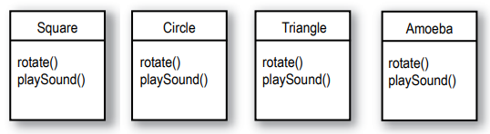

Onlar shape'ler ve hepsi rotate ediliyor ve ses çalabiliyorlar. Bu nedenle, ortak özellikleri soyutlayarak ve yeni bir "
Shape" (Şekil) sınıfı oluşturarak kodun içinde tekrarlanan yapıları ortadan kaldırdım.

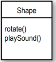

Ardından diğer dört şekil sınıfını yeni "Shape" (Şekil) sınıfına bağladım, bu ilişkiye "inheritance" denir.

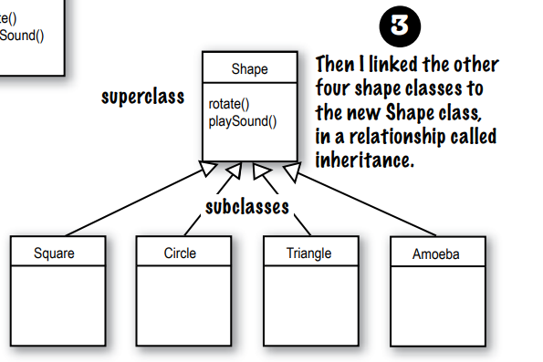

"Square, Shape sınıfından inheritance alır", "Circle, Shape sınıfından inheritance alır" ve benzeri şekilde
okuyabilirsiniz. Daha sonra diğer shape'lerden "rotate()" ve "playSound()" methodlarını kaldırdım, böylece artık sadece
bir kopyayı korumamız gerekiyor.

"Shape" sınıfı, diğer dört sınıfın super class'ıdır. Diğer dört sınıf ise "Shape" sınıfının sub class'larıdır. Alt
sınıflar, üst sınıfın methodlarını inheritance alır. Başka bir deyişle, "Shape" sınıfında bir işlevsellik varsa, alt
sınıflar otomatik olarak aynı işlevselliğe sahip olurlar.

**Peki ya Amoeba'nın rotate'i?**

LARRY: Peki, işte asıl sorun burada değil miydi - amoeba şeklinin tamamen farklı bir rotate ve ses çalma işlemi vardı?
Eğer Amoeba sınıfı işlevselliğini "Shape" sınıfından inheritance alıyorsa, amoeba nasıl farklı bir şey yapabilir?

BRAD: Bu son adım. Amoeba sınıfı, "Shape" sınıfının methodlerini override ediyor. Ardından çalışma zamanında, JVM (Java
Sanal Makinesi), biri Amoeba'nın dönmek için harekete geçirildiğinde hangi rotate() methodunu çalıştıracağını tam olarak
biliyor.

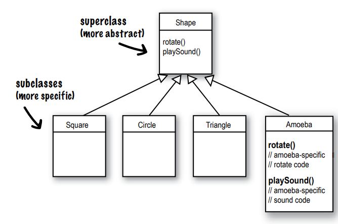

Amoeba sınıfında, üst sınıf olan Shape'in rotate() ve playSound() methodlarını override ettim. Override, alt sınıfın (
Amoeba gibi) bir inheritance alınan methodu kendi ihtiyaçları doğrultusunda değiştirmesi veya genişletmesi
demektir. Bu sayede alt sınıf, üst sınıftaki methodun implementasyonunu değiştirmeden, inheritance alınan methodun
davranışını değiştirebilir veya geliştirebilir.

inheritance alma kavramını anlamak:

inheritance alma ile tasarladığınızda, ortak kodları bir sınıfa koyar ve daha spesifik sınıflara ortak (daha soyut)
sınıfın onların üst sınıfı olduğunu belirtirsiniz.

Java'da, alt sınıfın üst sınıfı extend ettiğini ifade ederiz. inheritance alma ilişkisi, alt sınıfın üst sınıfın
üyelerini inheritance aldığı anlamına gelir. "Bir sınıfın üyeleri" dediğimizde, örneğin, instance variables'ları ve
metotları kastederiz.

Örneğin, PantherMan sınıfı SuperHero sınıfının bir alt sınıfı ise, PantherMan sınıfı otomatik olarak tüm süper
kahramanlara ait olan kostüm, çoraplar, özel güç, useSpecialPowers() ve benzeri gibi instance variables'ları ve
metotları inheritance alır. Ancak PantherMan alt sınıfı kendi özel metotları ve instance variables'ları ekleyebilir ve
inheritance aldığı metotları üst sınıf olan SuperHero'dan yeniden tanımlayabilir (override edebilir).

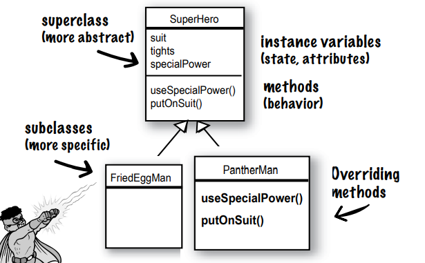

FriedEggMan için benzersiz davranışa ihtiyaç yok, bu yüzden herhangi bir metodu override etmez. SuperHero sınıfında
bulunan metotlar ve instance variables'lar FriedEggMan için yeterli olacaktır.

Ancak PantherMan için, kostümü ve özel güçleri için belirli gereksinimler vardır, bu nedenle PantherMan sınıfında
useSpecialPower() ve putOnSuit() metotları her ikisi de override edilir

**Instance Variables'lar override edilmez çünkü bunun için bir ihtiyaç yoktur** Instance variables'lar özel bir
davranışı tanımlamaz, bu nedenle alt sınıf inheritance alınan bir instance variables'in değerini istediği gibi
atayabilir. PantherMan, inheritance aldığı çoraplarını mor renge ayarlayabilirken, FriedEggMan onları beyaza
ayarlayabilir.

**An Inheritance Example**

```
public class Doctor {
    boolean workAsHospital;
    
    void treatPatient(){
        // perform a checkup
    }
}
```

```
public class FamilyDoctor extends Doctor{
    boolean makeHouseCalls;
    void giveAdvice(){
        // give homespun advice
    }
}
```

```
public class Surgeon extends Doctor{
    @Override
    void treatPatient() {
        // perform surgery
    }

    void makeIncision(){
        // make incision
    }
}
```

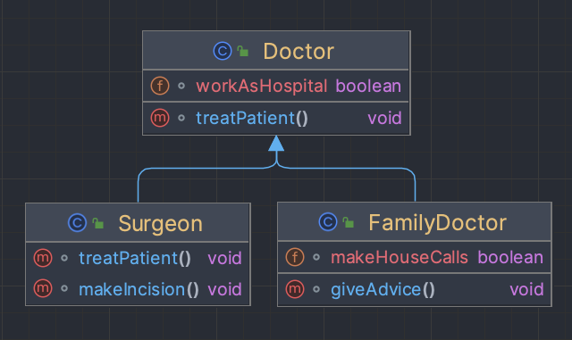

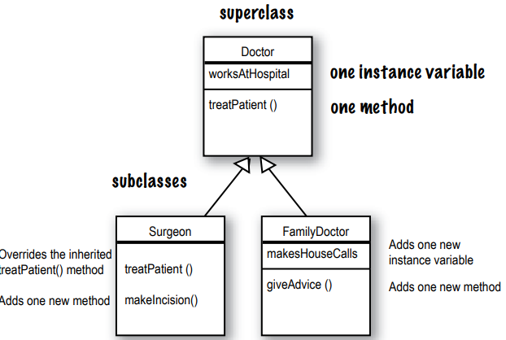

Animal simulasyon programı için inheritance alma yapısını tasarlayalım.

Hayal edin, kullanıcının farklı hayvanları bir ortama atıp ne olacağını görmesini sağlayan bir simulasyon programı
tasarlamakla görevlendirildiniz. Şimdilik programı kodlamak zorunda değiliz, çoğunlukla tasarım bizi ilgilendiriyor.

Programda olacak bazı hayvanlar için bir liste verildi, ancak tamamı değil. Her hayvanın bir nesne tarafından temsil
edileceğini ve nesnelerin her birinin, ilgili türünün programlandığı şekilde ortamda hareket edeceğini biliyoruz.

Ayrıca, başka programcıların programın içine istedikleri zaman yeni hayvan türleri eklemelerini istiyoruz.

Öncelikle, tüm hayvanların ortak ve soyut özelliklerini belirlemeli ve bu özellikleri tüm hayvan sınıflarının
genişletebileceği bir sınıfa dahil etmeliyiz.

**Ortak attributes'leri ve behaviors'lara sahip nesneleri arayın. (Adım 1)**

**Bu altı türün ortak özellikleri nelerdir? Bu, behaviour'ları soyutlayabilmemize yardımcı olacaktır. (Adım 2)**

**Bu türler nasıl ilişkilidir? Bu, inheritance ilişkilerini tanımlamak için size yardımcı olacaktır (Adım 4-5).**

inheritance alma, alt sınıflarda kodun tekrarlanmasını önlemek için kullanılan nesne yönelimli programlamanın güçlü bir
özelliğidir

Bu durumda, beş adet instance variables bulunuyor:

1 - picture – Bu, hayvanın JPEG dosyasını temsil eden dosya adını içerir.

2 - food – Bu, hayvanın yediği yiyeceğin türünü belirtir. Şu anda sadece iki değer alabilir: et veya ot.

3 - hunger – Bu, hayvanın açlık seviyesini temsil eden bir tamsayıdır. Hayvanın ne zaman ve ne kadar yediğine bağlı
olarak değişir.

4 - boundaries – Bu, hayvanların etraflarında dolaşacakları 'alanın' yükseklik ve genişlik değerlerini temsil eder.
Örneğin 640 x 480 gibi.

5 - location – Bu, hayvanın alan içindeki X ve Y koordinatlarını belirtir, yani hayvanın nerede olduğunu gösterir.

Dört adet metotumuz var:

1 - makeNoise() – Hayvanın ses çıkardığı durumda gösterilecek davranışı tanımlar.

2 - eat() – Hayvanın tercih ettiği besin kaynağı, et veya ot ile karşılaştığında göstereceği davranışı tanımlar.

3 - sleep() – Hayvanın uyku durumundayken göstereceği davranışı tanımlar.

4 - roam() – Hayvanın yemek yemediği veya uyumadığı durumlarda (muhtemelen sadece yiyecek kaynağı veya sınır ile
karşılaşmayı beklerken) göstereceği davranışı tanımlar.

* Ortak STATE ve BAHAVIOR'u temsil eden bir sınıf tasarlayın
* Bu nesnelerin hepsi hayvanlardır, bu nedenle Animal adında ortak bir superclass oluşturacağız.
* Tüm hayvanların ihtiyaç duyabileceği methodları ve instance variable'lari içereceğiz.

**Do all animals eat the same way?**

Bir şey üzerinde anlaştığımızı varsayalım: instance variables'lar, tüm Hayvan türleri için çalışacaktır. Bir aslanın
kendi resim, yemek (et düşünüyoruz), açlık, sınırlar ve konum için kendi değerleri olacak. Bir hipopotamüsünün instance
variable'leri için farklı değerleri olacak, ancak diğer Hayvan türlerinin sahip olduğu aynı değişkenlere sahip olacak.
Aynı durum köpek, kaplan ve diğer türlerle de geçerli olacak. Peki ya davranışlar?

**Which methods should we override?**

Bir aslan bir köpek gibi aynı sesi mi çıkarır? Bir kedi bir hipopotam gibi mi yer? Belki benim sürümümde öyle olabilir,
ama bizim sürümümüzde yeme ve ses çıkarma davranışları Hayvan türüne özgüdür. Bu davranışları her hayvan için nasıl
kodlayacağımızı anlayamıyoruz. Tamam, bu doğru değil. Örneğin, makeNoise() metodunu sadece belirli bir tür için bir
instance variable'inde tanımlı ses dosyasını çalacak şekilde yazabiliriz, ancak bu çok özelleştirilmemiş olur. Bazı
hayvanlar farklı durumlar için farklı sesler çıkarabilirler (örneğin, yemek yerken farklı bir ses, bir düşmana çarparken
farklı bir ses vb.).

Bu nedenle, Amoeba'nın Shape sınıfının rotate() metodunu geçersiz kılarak daha özelleştirilmiş (yani benzersiz) davranış
elde ettiği gibi, Hayvan alt sınıfları için de aynısını yapmalıyız.

* Bir alt sınıfın, o belirli alt sınıf türüne özgü davranışlara (method implementasyonlarına) ihtiyacı olup olmadığına
  karar verin.
* Animal sınıfına baktığımızda, eat() ve makeNoise() metodlarının bireysel alt sınıflar tarafından override edilmesi
  gerektiğine karar veriyoruz.

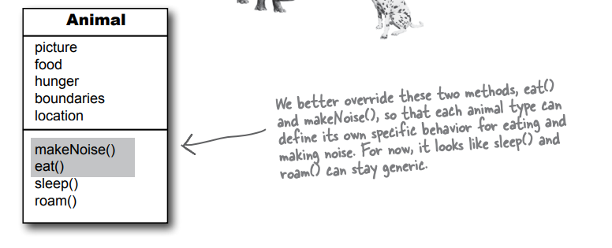

**Looking for more inheritance opportunities**

Sınıf hiyerarşisi şekillenmeye başlıyor. Her alt sınıf, makeNoise() ve eat() metodlarını override eder, böylece Köpek
havlaması ile Kedi miyavlaması karışmaz (her iki taraf için de oldukça kırıcı olurdu). Ve bir Hipopotam, bir Aslan gibi
yemez. Ancak belki de daha fazla yapabileceğimiz şeyler vardır. Hayvan alt sınıflarına bakmalı ve iki veya daha
fazlasını bir şekilde gruplayarak ve sadece o yeni grubun ortak olan kodunu vermeliyiz. Kurt ve Köpek benzerliklere
sahip. Aynı şekilde Aslan, Kaplan ve Kedi de öyle.

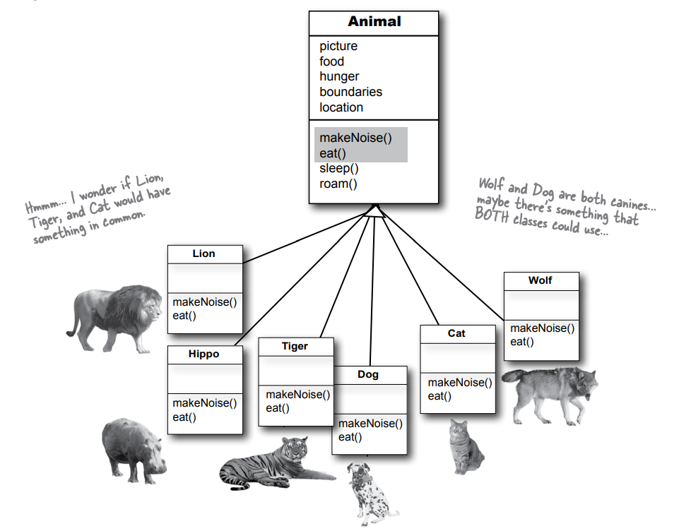

Daha fazla abstraction fırsatı için, ortak behavior'a ihtiyaç duyan iki veya daha fazla subclasses'ı belirleyerek arayın
Bu behavior'ı abstract bir üst sınıfa taşıyarak sınıf hiyerarşisini daha da geliştirebiliriz. Sınıflarımıza
baktığımızda, Kurt ve Köpek arasında bazı ortak davranışlar olabileceğini ve aynı şekilde Aslan, Kaplan ve Kedi arasında
da ortak davranışlar olabileceğini görüyoruz.

Hayvanların zaten bir organizasyon hiyerarşisi var (tüm krallık, cins, sınıf), bu nedenle sınıf tasarımı için en
uygun seviyeyi kullanabiliriz. Hayvanları biyolojik "aileler" temelinde düzenlemek için bir Feline (Kedi) sınıfı ve bir
Canine (Köpek) sınıfı oluşturacağız.

Canine (Köpek) sınıfının, sürü halinde hareket etme eğilimlerinden dolayı ortak bir roam() methodu kullanabileceğine
karar veriyoruz. Aynı şekilde, Feline (Kedi) sınıfının da kendi türündekilerden kaçınma eğilimleri nedeniyle ortak bir
roam() methodu kullanabileceğini görüyoruz. Hipopotam'ın, Animal sınıfından aldığı genel roam() methodunu kullanmaya
devam etmesine izin vereceğiz.

Şimdilik tasarımımız tamamlandı; daha sonra bu konuya tekrar döneceğiz.

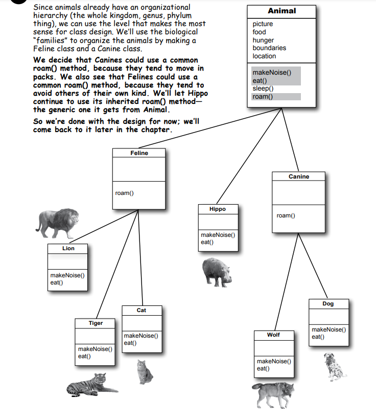

**Which method is called?**

Eğer bir Wolf nesnesi oluşturursan ve bir değişkene atarsan, bu referans değişkeni üzerinden nokta operatörünü
kullanarak dört metodun tamamını çağırabilirsin.

Ancak hangi metodun çağrıldığını belirtmek için ekstra bir bilgi vermemişsin. Bu durum, çağrılacak metodların nesnenin
türüne (sınıfına) ve hangi metodun çağrıldığına bağlı olacaktır. Her metodun hangi sınıfa ait olduğuna ve override
edilip edilmediğine bağlı olarak ilgili sınıfın metodunun çağrılacağı belirlenecektir

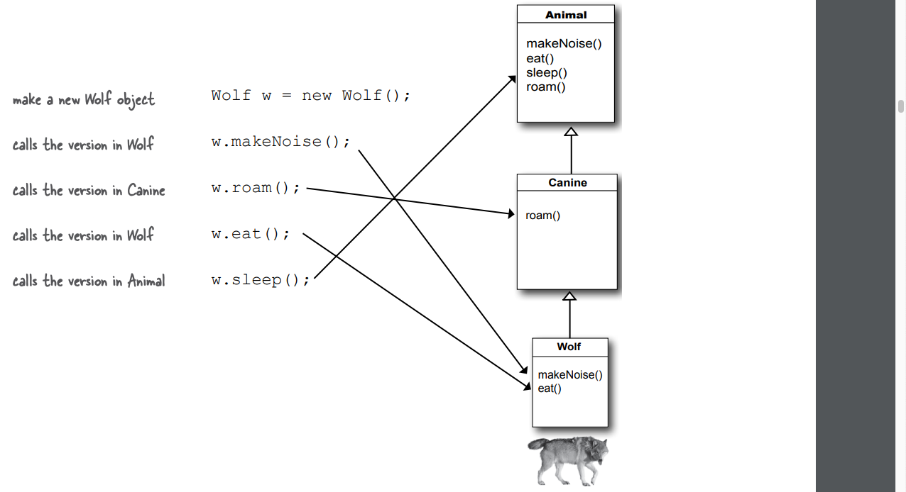

Bir nesne referansı üzerinde bir metodu çağırdığınızda, o nesne türü için en spesifik versiyonunu çağırırsınız. Başka
bir deyişle, en altta olan kazanır! "En altta" ifadesi, inheritance ağacında en altta bulunan anlamına gelir. Canine (
Köpek) Animal'dan daha alttadır ve Wolf (Kurt) Canine'den daha alttadır. Bu nedenle, bir Wolf nesnesi üzerinde bir
methodu çağırmak, JVM'in önce Wolf sınıfında aramaya başlayacağı anlamına gelir. Eğer JVM Wolf sınıfında bir metodun
versiyonunu bulamazsa, inheritance hiyerarşisini yukarı doğru yürüyerek eşleşen bir sürümü bulana kadar aramaya devam
eder.

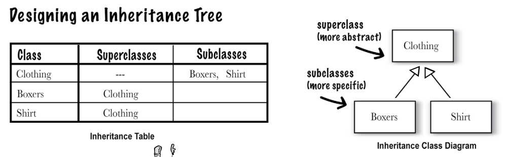

JVM, methodu çağırılan sınıf türünden başlayarak inheritance ağacında yukarı doğru yürümeye başlar (örneğin, önceki
sayfadaki Kurt örneği gibi). Ancak JVM bir eşleşme bulamazsa ne olur? Eğer JVM, miras ağacında yukarı doğru yürürken
çağrılan methodla eşleşen bir sürüm bulamazsa, bir çalışma zamanı hatası olan java.lang.AbstractMethodError veya
java.lang.NoSuchMethodError hatasını fırlatacaktır. Bu durum, method çağrısının uygun bir sürümü bulamaması durumunda
gerçekleşir.

Derleyici, belirli bir referans türü için çağrılabilir bir methodun garantili olduğu, ancak bu methodun çalışma
zamanında hangi sınıftan geldiğini (veya önemsemediğini) belirtmez. Wolf örneğinde, derleyici bir sleep() methodu
kontrol eder, ancak sleep() methodunun aslında Animal sınıfından tanımlandığını ve inheritance alındığını umursamaz.
Unutmayın ki, bir sınıf bir methodu miras alırsa, o methoda sahiptir. Miras alınan methodun nerede tanımlandığı (yani
hangi üst sınıfta tanımlandığı), derleyici için fark etmez. Ancak çalışma zamanında JVM her zaman doğru olanı
seçecektir. Ve doğru olan, o belirli nesne için en spesifik olan sürümdür.

### Using IS-A and HAS-A

Hatırlayın, bir sınıf başka bir sınıftan miras aldığında, alt sınıfın üst sınıfı extend ettiğini söyleriz. Bir şeyin
başka bir şeyi genişletip genişletmemesi gerektiğini anlamak için IS-A testini uygulayabilirsiniz. Triangle IS-A Shape
evet, bu çalışır. Cat IS-A Feline, bu da çalışır. Surgeon IS-A Doctor, hâlâ uygun. Tub extends Bathroom, mantıklı
görünüyor.

tasarım yaparken sınıf hiyerarşilerini ve miras ilişkilerini düşünürken "X bir Y'dir (X IS-A Y)" testini uygulamak
önemlidir. Eğer bu ilişki mantıklı değilse, tasarımınızda bir sorun olabilir. Verdiğiniz örnekte, "Tub IS-A Bathroom"
ifadesi doğru değil ve "Bathroom IS-A Tub" da doğru değil. Bu, her iki sınıf arasında anlamlı bir IS-A ilişkisinin
olmadığını gösteriyor.

Doğru sınıf tasarımı, üst sınıf ile alt sınıflar arasında mantıklı ve anlamlı bir ilişkiyi yansıtmalıdır. Eğer "X bir
Y'dir" testi hem ileri yönde hem de geri yönde doğru sonuç vermiyorsa, bu sınıflar arasında miras ilişkisinin uygun
olmadığını gösterir ve başka bir tasarım yaklaşımı düşünülmelidir.

Evet, tamamen doğru. İlişkiyi tersine çevirerek "Bathroom extends Tub" şeklinde düşünürsek, doğru çalışmaz ve "
Bathroom IS-A Tub" geçerli bir ifade olmaz.

Bu durumda, Tub ve Bathroom arasında bir ilişki vardır, ancak bu ilişki miras (inheritance) yoluyla değil, HAS-A (sahip
olma) ilişkisiyle gerçekleşir. "Bathroom HAS-A Tub" ifadesi mantıklı mıdır? Evet, bu ifade "Bathroom'ın bir Tub örnek
değişkenine sahip olduğu" anlamına gelir. Yani, Bathroom, bir Tub'a referans içeren bir instance variable'i bulundurur,
ancak Bathroom Tub'ı genişletmez ve bunun tersi de doğrudur.

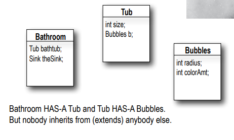

**But wait! There’s more!**

Evet, IS-A testi miras ağacının herhangi bir yerinde çalışır. Miras ağacınız iyi tasarlanmışsa, IS-A testi, herhangi bir
alt sınıfa, üst sınıfından herhangi birine ait olup olmadığını sorduğunuzda mantıklı olmalıdır.

Evet, haklısınız. Eğer B sınıfı A sınıfını genişletiyorsa, "B IS-A A class" ilişkisi doğrudur ve bu miras ağacının
herhangi bir yerinde geçerlidir. Aynı şekilde, C sınıfı B sınıfını genişletiyorsa, C sınıfı hem B hem de A için IS-A
testini geçer. Bu durumda C sınıfı, hem B'nin hem de B'nin A'yı genişlettiği için hem B hem de A sınıflarının tüm
özelliklerini ve davranışlarını miras almış olacaktır.

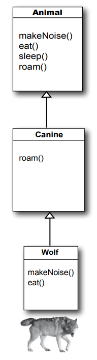

Canine extends Animal

Wolf extends Canine

Wolf extends Animal

Canine IS-A Animal

Wolf IS-A Canine

Wolf IS-A Animal

Doğru, verilen miras ağacında "Wolf IS-A Animal" veya "Wolf extends Animal" ifadesini her zaman kullanabilirsiniz.
Animal, Wolf'un superclass'ının superclass'ı olsa bile fark etmez. Aslında, Animal, Wolf'un miras ağacında
herhangi bir yerinde bulunuyorsa, "Wolf IS-A Animal" her zaman doğru olacaktır.

Animal miras ağacının yapısı, şunu dünyaya anlatır: "Wolf, Canine IS-A dediğimizden dolayı, Wolf bir Canine'ın
yapabileceği her şeyi yapabilir. Ve Wolf, Animal IS-A dediğimizden dolayı, Wolf bir Animal'ın yapabileceği her şeyi
yapabilir." Bu durumda, Wolf hem Canine hem de Animal sınıflarının tüm özelliklerine ve davranışlarına sahiptir.

Wolf sınıfı Animal veya Canine sınıfında bazı metodları override ederse bile, dünyadaki diğer kodlar açısından Wolf
nesnesi bu dört metodu yapabilir (makeNoise(), eat(), sleep() ve roam()). Bu metotların nasıl yapıldığı veya hangi
sınıfta override edildiği önemli değildir. Bir Wolf sınıfı Animal sınıfından miras aldığı için makeNoise(), eat(),
sleep() ve roam() metodlarını gerçekleştirebilir.

**How do you know if you’ve got your inheritance right?**

Kuşkusuz, şimdiye kadar ele aldığımızdan daha fazlası var, ancak bir sonraki bölümde (bu bölümde yaptığımız tasarım
çalışmasını geliştirerek ve iyileştirerek) daha fazla nesne yönelimli programlama (OOP) konularına bakacağız.

Şimdilik, iyi bir kılavuz IS-A testini kullanmaktır. Eğer "X IS-A Y" mantıklıysa, her iki sınıfın (X ve Y) muhtemelen
aynı miras ağacında yer alması gereklidir. Büyük olasılıkla, aynı veya örtüşen davranışlara sahiptirler.

Miras (inheritance) ilişkisi yalnızca bir yönde çalışır.

Örneğin, "Triangle IS-A Shape" (Triangle Shape'dir) mantıklıdır, bu nedenle Triangle sınıfını Shape sınıfını genişletmek
üzere kullanabilirsiniz. Bu durumda, bir Triangle nesnesi bir Shape nesnesi yapabileceği her şeyi yapabilir.

Ancak tersi durum olan "Shape IS-A Triangle" (Şekil Üçgen'dir) mantıklı değildir, bu nedenle Shape sınıfı Triangle
sınıfını genişletmemelidir. Unutmayın ki, IS-A ilişkisi, eğer X IS-A Y ise, X'in Y'nin yapabileceği her şeyi (ve belki
daha fazlasını) yapabileceğini ima eder. Bu nedenle, sadece mantıklı olan sınıfların birbirini genişletmesi uygun
olacaktır.

Evet, üst sınıf, alt sınıflarını bilemeyebilir. Üst sınıf, bağımsız bir şekilde tasarlanır ve daha sonra başka birisi
gelip onu extend edebilir, alt sınıflar oluşturabilir.

Üst sınıf yaratıcısı alt sınıfları bilsin ve bir alt sınıfın metodunun kullanılmasını istese bile, ters ya da geriye
doğru bir miras (inheritance) yoktur. Düşünün, çocuklar, ebeveynlerinden miras alır, bunun tam tersi geçerli değildir.

Alt sınıfta, üst sınıfın metodunu tamamen değiştirmek yerine, sadece ekstra özellikler eklemek istiyorsanız, bunu
metodları geçersiz kılma (method overriding) ve super anahtar kelimesi ile başarabilirsiniz. Bu, önemli bir tasarım
özelliğidir. "extends" kelimesini "Üst sınıfın işlevselliğini genişletmek istiyorum" anlamında düşünebilirsiniz.

```
public void roam(){
  super.roam();
  // my own roam stuff
}
```

super.roam() call'u roam() methodunun üst sınıftan devralınmış sürümünü çağırır, sonra geri dönerek kendi sınıfına özgü
kodu çalıştırır

Üst sınıfınızı tasarlayabilirsiniz, böylece onlar, alt sınıflar için çalışacak method implementasyonları içerir, yine de
alt sınıfların 'append' kodlarına ihtiyacı olabilir. Alt sınıfınızda, üst sınıfın overriding methoduyla, anahtar
kelime "super" kullanarak üst sınıfın sürümünü çağırabilirsiniz. Bu, "önce üst sınıfın sürümünü çalıştır, ardından kendi 
kodumla devam et..." demek gibi bir şeydir.

**Who gets the Porsche, who gets the porcelain? (how to Snow what a subclass can inherit from its superclass)**

Nesne yönelimli programlamada, alt sınıf, üst sınıftan (superclass) üyeleri miras alır. Bu üyeler, örneklenebilir
değişkenler (instance variables) ve metotları (methods) içerebilir. Ancak, bazı kitaplarda ilerleyen bölümlerde farklı
miras alınan üyeler de ele alınabilir. Bir üst sınıf, belirli bir üyenin alt sınıflar tarafından miras alınmasını
isteyip istemediğini, o üyenin erişim düzeyine göre belirleyebilir.

Bu kitapta ele alınacak olan dört erişim düzeyi en kısıtlıdan en esnek olana doğru şunlardır:


Erişim düzeyleri, kimin neyi görebileceğini kontrol eder ve iyi tasarlanmış, sağlam Java kodu için önemlidir. Şimdilik
yalnızca public ve private erişim düzeylerine odaklanacağız. Bu iki erişim düzeyi için kurallar oldukça basittir:

```
public members are inherited
private members are not inherited
```

Bir alt sınıf, bir member'i miras aldığında, sanki alt sınıf kendisi bu member'i tanımlamış gibi davranır. Shape
örneğinde, Square sınıfı, üst sınıfından olan rotate() ve playSound() metodlarını miras alır ve dış dünyaya (
diğer kodlara) göre Square sınıfının sadece rotate() ve playSound() metotları vardır.

Bir sınıfın member'ları, sınıfta tanımlanan değişkenler ve metotların yanı sıra, üst sınıftan miras alınan her şeyi
içerir. Kalıtım (inheritance) ile tasarım yaparken, kullanma veya kötüye kullanma (abusing) konusu önemlidir.
Bu kuralların arkasındaki bazı nedenler, bu kitabın ilerleyen bölümlerinde açıklanacak olabilir. Ancak şimdilik, sadece
birkaç kuralı bilmek, daha iyi bir kalıtım tasarımı oluşturmanıza yardımcı olacaktır.

**DO**, kalıtımı kullanmayı düşündüğünüz durum, bir sınıfın üst sınıfın daha spesifik bir türü olduğu zamanlarda
kullanmanız uygundur. Örnek olarak, "Willow" (Söğüt) sınıfı, "Tree" (Ağaç) sınıfının daha spesifik bir alt türüdür, bu
nedenle "Willow extends Tree" ifadesi mantıklıdır.

**DO**, kalıtımı düşünmeyi, aynı genel türe ait birden çok sınıf arasında paylaşılması gereken davranışları (implemented
code) olduğunda göz önünde bulundurmalısınız. Örneğin, Kare (Square), Daire (Circle) ve Üçgen (Triangle) tümü döndürme (
rotate) ve ses çalma (play sound) işlemlerine ihtiyaç duyar, bu nedenle bu işlevselliği üst sınıf olan Shape
içine yerleştirmek mantıklı olabilir ve bakım ve genişletilebilirlik açısından daha kolay olacaktır. Ancak, kalıtım,
nesne yönelimli programlamanın önemli özelliklerinden biridir, ancak davranış yeniden kullanımını elde etmek için her
zaman en iyi yol olmayabilir. Kalıtım sizi başlatır ve çoğu zaman doğru tasarım seçeneğidir, ancak tasarım kalıpları (
design patterns), daha ince ve esnek diğer seçenekleri görmeye yardımcı olur.

**DO NOT**, başka bir sınıftaki kodu yeniden kullanmak için kalıtımı kullanmayın, eğer üst sınıf ile alt sınıf
arasındaki ilişki yukarıda belirtilen iki kuraldan herhangi birini ihlal ediyorsa. Örneğin, varsayalım ki Alarm
sınıfında özel bir yazdırma kodu yazdınız ve şimdi Piano sınıfında da yazdırma koduna ihtiyacınız var. Dolayısıyla,
Piano sınıfını Alarm sınıfından türetir ve böylece Piano yazdırma kodunu miras alır. Bu hiç mantıklı değil! Bir Piano
bir Alarm sınıfının daha spesifik bir türü değildir. (Bu durumda yazdırma kodu Printer sınıfında olmalıdır ve tüm
yazdırılabilir nesneler Printer sınıfından yararlanabilirler, yani Printer sınıfı ile HAS-A ilişkisi kurulabilir.)

**DO NOT.** Kalıtım kullanırken, alt sınıfın ve üst sınıfın IS-A testini geçip geçmediğini mutlaka düşünmelisiniz.
Alt sınıfın, üst sınıfın daha spesifik bir türü olup olmadığını kendinize sorun. Örnek olarak, "Tea IS-A
içecektir (Beverage)." bu mantıklıdır. Ancak "İçecek (Beverage) IS-A çaydır (Tea)" mantıklı değildir.

**BULLET POINTS**

* Alt sınıf, üst sınıfı genişletir (extends).
* Bir alt sınıf, üst sınıfın tüm public instance variables'larını ve metotlarını miras alır, ancak üst sınıfın private
  instance variables'larını ve metotlarını miras almaz.
* Miras alınan metotlar üzerine yazılabilir (overridden). Ancak instance variables'ların üzerine yazılamazlar (
  overridden olamazlar). (Örneğin, alt sınıfta tekrar tanımlanabilirler, ancak bu aynı şey değildir ve bunu yapmaya
  neredeyse hiç gerek yoktur.)
* Kalıtım hiyerarşinizin geçerli olduğunu doğrulamak için IS-A testini kullanın. Eğer X, Y sınıfını genişletiyorsa, X
  IS-A Y mantıklı olmalıdır.
* IS-A ilişkisi sadece bir yönde işler. Bir "Hipopotam" (Hippo) bir "Hayvan" (Animal)'dır, ancak tüm "Hayvanlar"
  Hipopotam değildir.
* Bir alt sınıfta bir metot override edilirse ve bu metot alt sınıfın instance'i üzerinde çağrılırsa, override edilen
  sürümü çağırılır (en alttaki kazanır).
* B sınıfı, A sınıfını genişletiyorsa ve C sınıfı B sınıfını genişletiyorsa, B IS-A A ve C IS-A B olur ve C aynı zamanda
  A IS-A C olur.

**So what does all this inheritance really buy you?**

Kalıtım ile tasarım yaparak nesne yönelimli programlamada büyük avantajlar elde edersiniz. Ortak davranışları bir grup
sınıfta soyutlayarak tekrarlayan kodları ortadan kaldırabilir ve bu kodları bir üst sınıfa yerleştirebilirsiniz.
Böylece, bu davranışı miras alan tüm sınıflarda değişiklik yapmak istediğinizde, sadece bir yerde güncelleme yapmanız
yeterli olur ve değişiklik otomatik olarak tüm alt sınıflara yansır. Bu bir sihir değil, oldukça basittir: değişikliği
yapın ve sınıfı yeniden derleyin. Bu kadar. Alt sınıflara dokunmanıza gerek kalmaz!

Yeni değiştirilmiş superclass'ı teslim edin ve onu extend eden tüm sınıflar otomatik olarak yeni sürümü kullanır.

Bir Java programı, sadece sınıfların bir yığınıdır, bu nedenle alt sınıfların, üst sınıfın yeni sürümünü kullanmak için
tekrar derlenmesine gerek yoktur. Üst sınıf, alt sınıf için bir sorun teşkil etmediği sürece her şey yolunda olur. (Bu
context'de 'break' kelimesinin ne anlama geldiğini daha sonra kitapta tartışacağız. Şimdilik, bunu, alt sınıfın belirli
bir metodun argümanları, dönüş türü veya metodun adı gibi üst sınıfta değiştirilen bir şeye bağlı olduğu durum olarak
düşünebilirsiniz.)

Bu durumda, üst sınıfın değiştirilmesi, alt sınıfların otomatik olarak yeni sürümü kullanmasını sağlar ve herhangi bir
olumsuz etkisi olmazsa her şey sorunsuz çalışır.

1 - Tekrarlayan kodlardan kaçınmak için kalıtımı kullanırsınız. Ortak kodu bir yerde toplayarak alt sınıfların bu
kodu üst sınıftan miras almasını sağlarsınız. Bu davranışı değiştirmek istediğinizde, sadece bir yerde değişiklik
yapmanız yeterli olur ve herkes (yani tüm alt sınıflar) bu değişikliği görür.

2 - kalıtım kullanarak bir grup sınıf için ortak bir protokol veya arayüz tanımlayabilirsiniz.

**Inheritance lets you guarantee that all classes grouped under a certain supertype have all the methods that the
supertype has.**

Kalıtım yoluyla ilişkilendirilen bir sınıf grubu için ortak bir protokol veya arayüz tanımlarsınız. Üst sınıfta
tanımlanan ve alt sınıflar tarafından miras alınan metotlar, diğer kodlara bir tür protokol bildirimi yapar
ve "Tüm alt türlerim (yani alt sınıflarım) bu işleri yapabilir ve bu methodları kullanarak bunları yaparlar" der. Başka
bir deyişle, bir contract (contract) oluşturursunuz. Örneğin, Animal sınıfı, tüm Animal alt türleri için ortak bir
protokol oluşturabilir.

Üst sınıfta tanımlanan metotlarla, dünyaya herhangi bir hayvanın bu dört şeyi yapabileceğini söylüyorsunuz. Bu,
metotların argümanları ve return type'larını da içerir.

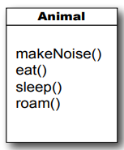

"Animal" dediğimizde, bu Animal sınıfı ve Animal'dan türetilen (extend) tüm sınıfları içerir. Bu da, bu sınıfların miras
hiyerarşisinde Animal sınıfının bir yerinde olduğu anlamına gelir. Ancak gerçekten harika olan kısım hala gelmedi, çünkü
en iyisini - polimorfizm'i - sona sakladık. Bir sınıf grubu için bir üst tür (supertype) tanımladığınızda, bu üst türün
herhangi bir alt sınıfı, üst türün beklenildiği herhangi bir yerde kullanılabilir.

Nasıl yani?
Endişelenmeyin, açıklamalarımız henüz bitmedi. İki sayfa sonra, uzman olacaksınız.  "tüm metotlar" dediğimizde aslında "
miras alınabilir metotlar" anlamını kastediyoruz ve şu an için bunun anlamı aslında "tüm public metotlar" demektir.
Ancak ileride bu tanımı biraz daha geliştireceğiz.

Polimorfizm ile birlikte, bir alt sınıf nesnesine, üst sınıfın referansını kullanarak erişebilirsiniz. Bu size gerçekten
esnek bir kod yazma imkanı verir. Daha temiz, daha verimli ve daha basit kodlar yazabilirsiniz. Bu sayede sadece
geliştirmeyi kolaylaştırmakla kalmaz, aynı zamanda başlangıçta kodunuzu yazdığınızda hayal bile edemeyeceğiniz
şekillerde kolayca genişletebilirsiniz. Bu esneklik, siz tatildeyken iş arkadaşlarınızın programı güncelleyebilmesi ve
hatta kaynak kodunuza bile ihtiyaç duymadan yapabilmesi anlamına gelir.

Polimorfizmin nasıl çalıştığını anlamak için, genellikle bir referansı nasıl bildirdiğimizi ve bir nesneyi nasıl
oluşturduğumuzu incelememiz gerekiyor. Java'da bir sınıfın nesnesini oluşturmak için, önce o sınıf türünden bir referans
değişkeni bildiririz.

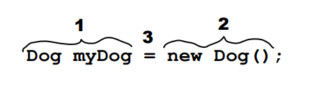

1 - Reference değişkeni declare edilir;

```Dog myDog = new Dog();``` JVM'ye bir referans değişkeni için alan ayırmasını söylemek, o referans değişkeninin
türünün sürekli olarak Dog türünde olduğu anlamına gelir. Başka bir deyişle, bu referans değişkeni sadece Dog
nesnesini kontrol etmek için düğmelere sahip bir uzaktan kumandadır, ancak Cat, Button veya Socket gibi
diğer nesneleri kontrol etmek için uygun değildir.

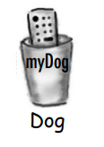

2 - Create an object;

```Dog myDog = new Dog();``` JVM'ye, garbage collectible heap'de yeni bir Dog nesnesi için alan ayırmasını söyleriz.

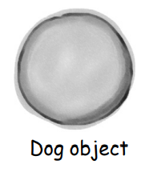

3 - Link the object and the reference

```Dog myDog = new Dog();``` Tam olarak, new anahtar kelimesiyle oluşturulan yeni Dog nesnesini myDog referans
değişkenine atarız. Yani, uzaktan kumandayı programlarız.

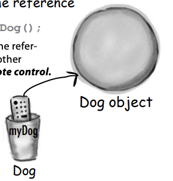

Önemli nokta, referansın type'i ile nesnenin type'ının aynı olmasıdır. Bu örnekte, hem referans türü (myDog) hem de
nesne türü (Dog) aynıdır, yani her ikisi de "Dog"tur.

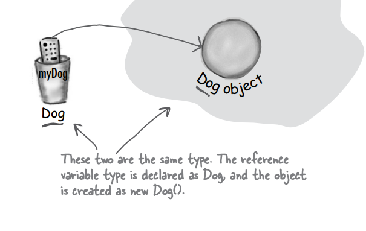

Polimorfizm ile referans değişkeni ve gerçek olarak işaret ettiği nesne farklı türlerde olabilir.

``Ànimal myDog = new Dog();`` Animal myDog = new Dog(); örneğinde, referans değişkeni türü Animal olarak bildirilmiş,
ancak nesne Dog olarak oluşturulmuştur. Söylediğiniz gibi, referans değişkeninin türü ve gerçek nesnenin türü farklıdır.

Bu, polimorfizmi gösterir. Burada, üst sınıf (Animal) türünden bir referans değişkeni, alt sınıf (Dog) nesnesini işaret
etmek için kullanılabilir. Bu, kodunuzda esneklik ve genişletilebilirlik sağlar.

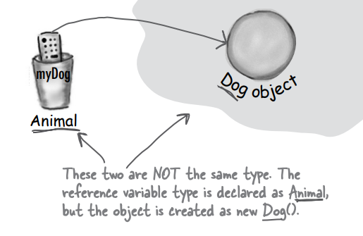

**Polimorfizmle birlikte, referans türü, gerçek nesne türünden bir üst sınıf olabilir.**

Referans değişkeni bildirdiğinizde, bu referansın türü için IS-A testini geçen herhangi bir nesne o referansa
atanabilir. Başka bir deyişle, bildirilen referans değişkeninin türünü extend eden her şey o referansa atanabilir. Bu,
polimorfik array'ler gibi işlemler yapmanıza olanak sağlar.

```
Animal[] animals = new Animal[5];
animals[0] = new Dog();
animals[1] = new Cat();
animals[2] = new Wolf();
animals[3] = new Hippo();
animals[4] = new Lion();

for (int i = 0; i < animals.length; i++) {
    animals[i].eat();
    animals[i].roam();
}
```

Animal array'inde görüldüğü üzere Animal'a ait subclass'lar mevcut. ve for dongüsü ile de tüm nesneleri dönerek
methodları call ediliyor

**But wait! There’s more!**

Eğer bir üst sınıf türünde, örneğin "Animal", bir referans değişkeni tanımlayabilir ve alt sınıf türünden, örneğin "
Dog", bir nesneyi ona atayabilirseniz, bu referans bir methoda bir argüman olarak geçirildiğinde nasıl çalışabileceğini
düşünelim...

```
public class Vet {
    public void giveShot(Animal animal){
        // do horrible things to Animal at
        // the other end of the 'a' parameter
        animal.makeNoise();
    }
}
```

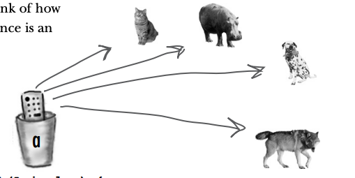

"Vet" (Veteriner) sınıfı içinde "animal" parametresi, herhangi bir "Animal" türünden nesneyi argüman olarak alabilir. Ve
Veteriner işlemi tamamladığında, "Animal" sınıfına ait olan "makeNoise()" (ses çıkar) methodunu çağırır. Gerçekten
bellekte bulunan hangi "Animal" nesnesi varsa, onun "makeNoise()" methodu çalıştırılacaktır.

```
public class PetOwner {
    public void start(){
        Vet vet = new Vet();
        Dog d = new Dog();
        Hippo h = new Hippo();
        /* Veterinerin "giveShot()" (aşı yap) methodu, sizin verdiğiniz herhangi bir "Animal"ı kabul edebilir.
        Argüman olarak geçirdiğiniz nesne, "Animal" sınıfının bir alt sınıfı olduğu sürece işleyecektir. Bu durumda
        method çalışacaktır.*/
        vet.giveShot(d); // Dog's makeNoise() runs
        vet.giveShot(h); // Hippo's makeNoise() runs
    }
}
```

Tamam, şimdi anladım! Eğer kodumu polimorfik argümanlar kullanarak yazarsam, method parametresini üst sınıf türünde
tanımlarsam, çalışma zamanında herhangi bir alt sınıf nesnesini geçirebilirim. Harika!

Evet, polimorfizm sayesinde, programınıza yeni alt sınıf türlerini eklediğinizde kodunuzu değiştirmeniz gerekmez.

Hatırladığınız gibi Veteriner sınıfı var, eğer o Veteriner sınıfını Animal türünde argümanlar kullanarak yazarsanız,
kodunuz herhangi bir Animal alt sınıfını işleyebilir. Bu demek oluyor ki, başkaları Veteriner sınıfınızdan faydalanmak
istediklerinde, sadece yeni Animal türlerini Animal sınıfından türetmeleri yeterli olacaktır. Veteriner sınıfı, yeni
Animal alt türleri hakkında hiçbir bilgiye sahip olmadan çalışmaya devam edecektir.

Polimorfizm bu şekilde çalışma garantisi sağlar çünkü Java'daki nesne yönelimli programlama prensiplerine dayanır. Bu
prensiplerin temelinde "kalıtım" ve "dynamic binding" gibi özellikler yer alır.

Herhangi bir pratik sınır var mı? alt sınıflandırma seviyelerinde? Ne kadar derinlere inebilirsin?

Java API'sine baktığınızda, çoğu kalıtım hiyerarşisinin geniş ama derin olmadığını göreceksiniz. Çoğu durumda,
hiyerarşiler yalnızca bir veya iki seviye derinliğindedir, ancak istisnalar vardır (özellikle GUI sınıflarında).
Genellikle kalıtım ağaçlarınızın daha sığ olmasının daha mantıklı olduğunu fark edeceksiniz, ancak sert bir sınır
yoktur (ya da asla karşılaşmayacağınız bir sınır).

Evet, düşündüğünüz gibi. Bir sınıfın kaynak koduna erişiminiz yoksa, ancak o sınıfın bir methodunu değiştirmek
istiyorsanız, alt sınıflandırma (subclassing) kullanarak bunu yapabilirsiniz. Yani, mevcut "kötü" sınıfı genişletip,
istediğiniz methodu kendi daha iyi kodunuzla override edebilirsiniz

Bir sınıfın özel (private) olarak işaretlenebileceği, ancak iç sınıf (inner class) adı verilen çok özel bir durum
dışında böyle bir şeyin olmadığı doğrudur. Ancak, üç şey bir sınıfın alt sınıf alınmasını engelleyebilir.

İlk engel, erişim kontrolüdür. Bir sınıf özel (private) olarak işaretlenemese de, sınıfın genel olarak erişimi
olmayabilir (public olarak işaretlenmemişse). Bu durumda, diğer paketlerdeki sınıflar bu sınıfı alt sınıf alamaz veya
hatta kullanamazlar. Sadece aynı paketteki sınıflar bu sınıfı alt sınıf alabilir.

İkinci engel, "final" anahtar kelimesidir. Bir sınıf final olarak işaretlendiğinde, kalıtım hattının sonudur. Yani, hiç
kimse bir final sınıfı genişletemez.

Üçüncü engel, bir sınıfın yalnızca private constructor'a sahip olmasıdır (biz bunlara ilerleyen bölümlerde bakacağız).
Bu durumda, bu sınıf alt sınıf alınamaz.

Bu engeller, sınıfların alt sınıflandırılmasını engelleyebilir ve tasarımınızı kısıtlayabilir. Ancak, bu engellerin iyi
bir nedenle kullanılması, programınızın tasarımını daha iyi ve sürdürülebilir hale getirebilir.

Genellikle sınıflarınızı final olarak işaretlemeyeceksinizdir. Ancak güvenlik ihtiyacınız varsa, methodlarınızın her
zaman sizin tarafınızdan yazıldığı gibi çalışacağından emin olmak istiyorsanız (çünkü üzerine yazılamazlar), final bir
sınıf bu güvenliği sağlar. Java API'sinde birçok sınıf bu nedenle final olarak işaretlenmiştir. Örneğin, String sınıfı
final olarak işaretlenmiştir, çünkü eğer birisi gelip Stringlerin davranışını değiştirirse hayal edin ki ne karmaşa
olabilir!

Belirli bir methodun üzerine yazılmasını engellemek istiyorsanız, methodu "final" anahtar kelimesiyle işaretleyin. Eğer
bir sınıftaki tüm methodların hiçbir zaman üzerine yazılmayacağını garanti etmek istiyorsanız, o sınıfın tamamını "
final" olarak işaretleyin.

Bir methodu "final" olarak işaretlemenin anlamı, bu methodun alt sınıflar tarafından değiştirilemez olduğudur. Yani, alt
sınıf, bu methodu kendisine uygun bir şekilde değiştiremez veya override edemez

**Keeping the contract: rules for overriding**

Bir üst sınıftan bir methodu override ettiğinizde, contract'i yerine getirmeyi kabul etmiş olursunuz. Bu contract,
örneğin "Hiçbir argüman almayıp bir boolean değeri döndürüyorum" şeklinde olabilir. Başka bir deyişle, override
ettiğinizde methodun argümanları ve dönüş türleri dış dünya tarafından, üst sınıftaki override edilen methoda tam
olarak benzemelidir. Methodlar contract'dir.

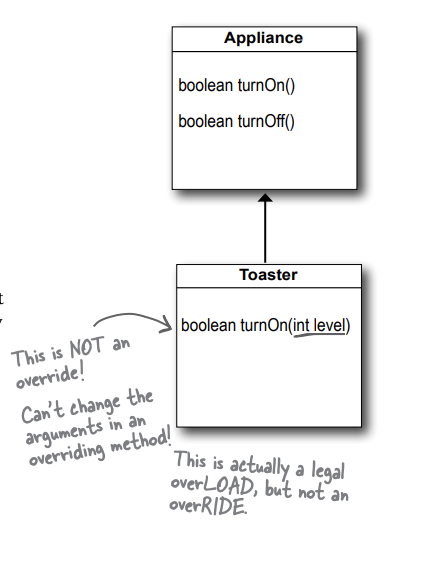

Polimorfizm çalışacaksa, Toaster'ın Appliance'den override ettiği methodun çalışması gerekmektedir. Unutmayın,
derleyici bir referans türüne bakarak belirli bir methodu çağırıp çağıramayacağınıza karar verir. Bir Appliance
referansı üzerinden Toaster'a ait olan bir methodu çağırmak istediğinizde, derleyici sadece Appliance sınıfının ilgili
methoda sahip olup olmadığına bakar. Ancak çalışma zamanında (runtime), JVM referans türüne (Appliance) değil,
bellekteki gerçek Toaster nesnesine bakar. Dolayısıyla, eğer derleyici method çağrısını zaten onayladıysa, bu yalnızca
override edilen methodun aynı argümanlara ve dönüş türlerine sahip olduğu durumda çalışabilir. Aksi takdirde, Appliance
referansına sahip birisi turnOn() method'unu argümansız bir şekilde çağırırsa, Toaster'da bir int alan bir sürümü
olmasına rağmen çağrılacak olan Appliance'daki sürümü olacaktır. Başka bir deyişle, Toaster'daki turnOn(int level)
methodu bir override değildir.

1 - Değişkenler aynı olmalı ve type'ları uyumlu olmalıdır.Superclass'ın contract'ı, diğer kodların bir methodu nasıl
kullanabileceğini tanımlar. Üst sınıfın argüman olarak ne alırsa, methodu override eden alt sınıf da aynı argümanı
kullanmak zorundadır. Ve üst sınıfın dönüş türü olarak ne bildiriyorsa, override eden method da ya aynı türü ya da alt
sınıf türünü bildirmelidir. Unutmayın ki, bir alt sınıf nesnesinin üst sınıf tarafından bildirilen her şeyi yapabilmesi
garanti edilir, bu nedenle üst sınıfın beklenildiği yerde bir alt sınıfın döndürülmesi güvenlidir.

2 - Method daha az erişelebilir olamaz. Bu, erişim düzeyinin aynı olması gerektiği veya daha dostça olması gerektiği
anlamına gelir. Bu, örneğin bir public methodu override edip onu private hale getiremezsiniz. Derleme zamanında public
bir method olduğunu düşündüğü bir kodu çağıran kod için, birdenbire çalışma zamanında JVM'nin kapıyı kapattığını fark
etmek ne kadar şok edici olurdu, çünkü override edilen sürüm private olur!  Şu ana kadar iki erişim düzeyini öğrendik:
özel (private) ve genel (public).

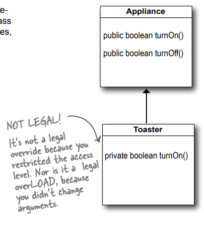

### Overloading a method

Method overloading, sadece farklı argüman listelerine sahip iki methoda sahip olmaktan başka bir şey değildir. Nokta.
Overloaded methodlarla ilişkili bir polimorfizm yoktur!

Overloading, çağıranlar için kolaylık sağlamak amacıyla farklı argüman listelerine sahip bir methodun birden fazla
sürümünü oluşturmanıza olanak tanır. Örneğin, yalnızca bir integer alan bir methodunuz varsa, çağıran kodun bu methodu
çağırmadan önce, örneğin bir float'u bir integer'a dönüştürmesi gerekir. Ancak methodu başka bir sürümle overload
ederseniz ve bu sürüm bir float alırsa, çağıran için işleri kolaylaştırmış olursunuz.

Bir Overloading methodu, üst sınıfı tarafından tanımlanan polimorfizm contract'ını yerine getirmeye çalışmadığından,
overloaded methodlar çok daha esneklik sağlar.

Bir overloaded method, yalnızca aynı method adına sahip olan farklı bir methoddur. Overloaded bir method'un, miras ve
polimorfizmle ilgisi yoktur. Overload edilmiş method, aynı adı taşıyan farklı işlevlere sahip olmakla birlikte,
overridden bir methodla aynı şey değildir.

1 - Return type'ları farklı olabilir. Overloaded methodlarda, argüman listeleri farklı olduğu sürece dönüş türlerini
değiştirmekte özgürsünüz.

2 - Sadece dönüş türünü DEĞİŞTİREMEZSİNİZ. Yalnızca dönüş türü farklı ise, bu geçerli bir Overload değildir - derleyici,
methodu override etmeye çalıştığınızı varsayacaktır. Ve bu bile geçerli olmayacak, ancak dönüş türü, üst sınıfta
bildirilen dönüş türünün alt türü ise. Bir methodu Overload etmek için, mutlaka argüman listesini DEĞİŞTİRMENİZ
gereklidir, ancak dönüş türünü herhangi bir şeye DEĞİŞTİREBİLİRSİNİZ.

3 - Erişim düzeylerini her yönde değiştirebilirsiniz. Daha kısıtlayıcı bir methodu overload edebilirsiniz. Bu önemli
değil, çünkü yeni method, overloaded methodun contract'ini yerine getirme zorunluluğunda değildir.

```
public class Overloads {
    String uniqueID;
    
    public int addNums(int a, int b){
        return a + b;
    }
    
    public double addNums(double a, double b){
        return a + b;
    }
    
    public void setUniqueID(String id){
        this.uniqueID = id;
    }
    
    public void setUniqueID(int id){
        this.uniqueID = Integer.toString(id);
    }
}
```