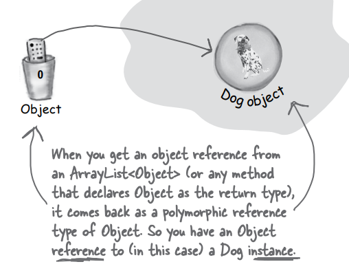
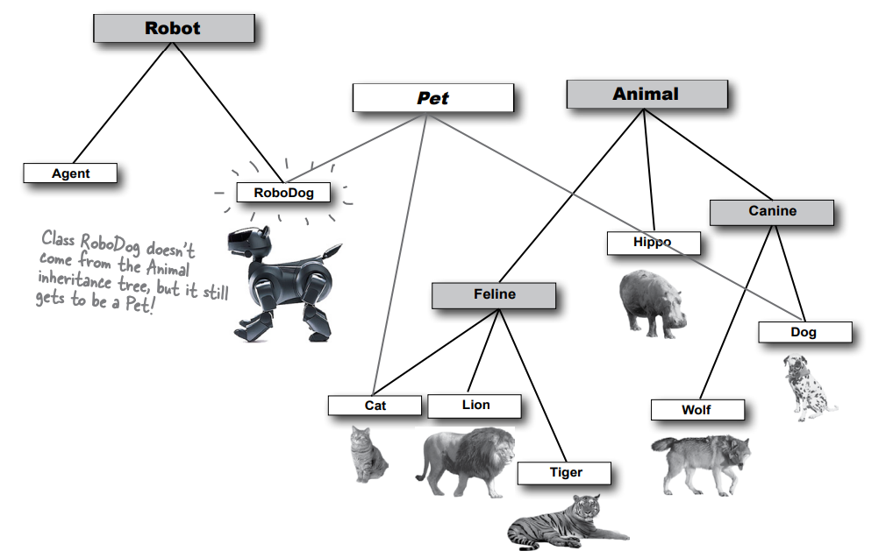

# interfaces and abstract classes

Inheritance sadece başlangıçtır. Polimorfizmi kullanabilmek için Interfaceleri (ve bunlar GUI türünde değil) kullanmamız
gerekiyor. Basit Inheritancedan ötesine geçmemiz ve yalnızca Interface özelliklerine uygun şekilde tasarlayarak ve
kodlayarak esneklik ve genişletilebilirlik düzeyine ulaşmamız gerekiyor. Java'nın en harika kısımlarından bazıları
Interfaceler olmadan bile mümkün olmazdı, bu yüzden kendiniz Interfacelerle tasarlamasanız bile yine de onları kullanmak
zorunda kalacaksınız. Onlarla tasarlamak isteyeceksiniz. Onlarla tasarlamak zorunda kalacaksınız. Onlarsız nasıl
yaşadığınızı merak edeceksiniz. Peki bir Interface nedir? %100 abstract bir sınıftır. Bir abstract sınıf nedir?
Instance'i alınamayan bir sınıftır. Bu ne işe yarar? Birkaç dakika içinde göreceksiniz. Ancak, bir önceki bölümün sonunu
düşünürseniz ve nasıl polimorfik argümanlar kullandığımızı hatırlarsanız, tek bir Vet methodunun tüm türlerden olan
Animal alt sınıflarını alabilmesi, işte o sadece yüzeyi kaşımaktı. Interfaceler, polimorfizmdeki "poly"dir (çok
biçimlilik). "abstract"taki "ab"dir (abstract).

### Did we forget about something when we designed this?

Sınıf yapısı pek de fena değil. Kodun tekrarını minimumda tutmak için tasarladık ve alt sınıflara özgü uygulamaları
olması gereken methodları override ettik. Polimorfik bir bakış açısından güzel ve esnek hale getirdik, çünkü Animal
argümanları (ve array tanımlamaları) kullanan programlar tasarlayabiliriz, böylece kodumuzu yazarken hayal bile
etmediğimiz tüm Animal alt türleri çalışma zamanında geçilebilir ve kullanılabilir hale gelir. Tüm Animal'lar için ortak
protokolü (tüm Animalların sahip olduğunu düşündüğümüz dört methodu) Animal üst sınıfına yerleştirdik ve artık yeni
Aslanlar, Kaplanlar ve Nil Atları yapmaya hazırız.

Söyleyebileceğimizi biliyoruz;

```Wolf aWolf = new Wolf();```


Böyle de söyleyebileceğimizi biliyoruz;

``Ànimal aHippo = new Hippo();``


Ama işte burada işler garipleşiyor;

``Ànimal animal = new Animal();``


Yeni bir animal nesnesi ne yapar? nasıl görünür?


Bazı sınıfların sadece instantiate edilmemesi gerekir!

Bir Kurt nesnesi, Bir Nil Atı nesnesi veya Bir Kaplan nesnesi oluşturmak mantıklıdır, ancak tam olarak bir Animal
nesnesi nedir? Onun şekli ne? Rengi, boyutu, bacak sayısı... Animal türünde bir nesne oluşturmaya çalışmak, kabus gibi
bir Star Trek transporter kazası gibidir. Işınlanma sürecinde bir yerlerde tampona bir şeylerin kötü bir şekilde
karıştığı an. Ancak bununla nasıl başa çıkacağız? Kalıtım ve polimorfizm için bir Animal sınıfına ihtiyacımız var. Ancak
sadece Animal sınıfının kendisine değil, daha az abstract alt sınıflarını nesneleştirmek istiyoruz. Kaplan nesneleri ve
Aslan nesneleri istiyoruz, Animal nesneleri değil.

Neyse ki, bir sınıfın hiçbir zaman instantiated olmamasını sağlamak için basit bir method var. Başka bir deyişle, o
türde "new" ifadesini kullanarak bir nesne oluşturmayı engellemek için. Sınıfı abstract olarak işaretlediğinizde,
derleyici bu türden herhangi bir kodun, herhangi bir yerde, bu türün bir örneğini oluşturmasını engeller.

Abstract sınıfları referans türü olarak kullanmak mümkündür ve aslında abstract sınıfları bu nedenle
kullanırız. Polimorfik argüman veya dönüş türü olarak kullanmak, ya da polimorfik bir array oluşturmak gibi durumlarda
abstract sınıfların kullanımı oldukça yaygındır.

Sınıf kalıtım yapısını tasarlarken, hangi sınıfların abstract be hangilerinin concrete olduğuna karar vermeniz gerekir.
Concrete sınıflar, örneklendirilmek için yeterince belirli olanlardır. Bir sınıfın concrete olması, o türden nesneler
oluşturmanın uygun olduğu anlamına gelir.

Bir class'ı abstract hale getirmek kolaydır. abstact keyword'unu class declaration'dan önce yazarsınız

```
abstract class Canine extends Animal{
    public void roam(){}
}
```

### The compiler won’t let you instantiate an abstract class

Bir abstract sınıf, bu sınıfın hiç kimse tarafından yeni bir örneği oluşturulamayacağı anlamına gelir. Bununla birlikte,
abstract sınıfı hala deklare edilen bir referans türü olarak kullanabilir ve polimorfizm amacıyla kullanabilirsiniz,
ancak bu türden nesne oluşturulma endişesi taşımanıza gerek yoktur. Derleyici bunu garanti eder.

```
public class MakeCanine {
    public void go(){
        Canine canine;

        canine = new Dog();
        canine = new Canine();
        canine.roam();
    }
}
```

burada ```canine = new Dog()``` geçerlidir fakat;

```canine = new Canine()``` abstract olan bir class instantiate edilemez hatası alırız

Abstract bir sınıfın pratikte hiçbir kullanımı, değeri veya amacı yoktur, eğer bir sınıf tarafından genişletilmiyorsa.
Abstract sınıflar, alt sınıflar için bir şablon veya temel oluşturmak amacıyla kullanılır.

Abstract bir sınıf kullanıldığında, çalışma zamanında işi yapan nesneler abstract sınıfınızın bir alt sınıfının
instance'larıdır.

### Abstract vs. Concrete


Bir abstract olmayan sınıfa "concrete sınıf" denir. Animal kalıtım ağacında, eğer Animal, Canine ve Feline sınıflarını
abstract yaparsak, Hipopotam (Hippo), Kurt (Wolf), Dog (Dog), Kaplan (Tiger),Aslan (Lion) ve Kedi (Cat) concrete alt
sınıflar olarak kalır.

Java API'de dolaştığınızda, özellikle GUI (Grafik Kullanıcı Interface) kütüphanesinde birçok abstract sınıf
bulacaksınız.

GUI bileşenleri nasıl görünür? Component (Bileşen) sınıfı, düğmeler, metin alanları, kaydırma çubukları, iletişim
kutuları gibi GUI ile ilgili sınıfların üst sınıfıdır. Genel olarak, Component sınıfının örneği oluşturulup ekrana
konulmaz; bunun yerine JButton, JTextArea, JScrollBar, JDialog gibi concrete alt sınıfların örnekleri oluşturulur.

Yani, yalnızca Component sınıfının abstract alt sınıflarının örnekleri oluşturulurken, Component sınıfının kendisinden
hiçbir zaman bir örnek oluşturmazsınız. Bu nedenle, concrete alt sınıfların örneklerini oluşturarak GUI bileşenlerini
kullanırsınız.

Peki bir class'ın abstract olması gerektiğini nasıl bileceğiz;

Wine, genellikle abstract bir kavramı temsil eder ve doğrudan örneklendirilemez. Aynı şekilde, Red (Kırmızı) ve White (
Beyaz) gibi türler de abstract olabilir, çünkü bunlar da genel kavramları temsil ederler. Ancak, abstract ve concrete
sınıfların belirlenmesi tasarım ve ihtiyaçlara bağlıdır.

Sınıf hiyerarşisinde nesneler ne zaman concrete hale gelir? Bu, belirli bir duruma, tasarıma ve gerekliliklere bağlıdır.
concrete'leştirilen sınıf, concrete bir varlık veya nesneyi temsil ediyorsa oluşturulabilir.

PinotNoir sınıfı da abstract veya concrete olabilir. Bu, Pinot Noir şarabının abstract veya concrete bir temsilini neyin
daha iyi yansıttığına bağlıdır. Eğer Camelot Vineyards 1997 Pinot Noir gibi belirli bir şarabı temsil ediyorsa, concrete
bir sınıf olması mantıklı olabilir.

Animal kalıtım ağacındaki seçimler, abstract ve concrete sınıfların uygun görünüyor gibi görünüyor. Animal gibi genel
bir kavram abstract sınıfken, concrete alt sınıflar belirli türleri temsil ediyor. Eğer yeni Animal'lar ekleyecek
olsaydık, muhtemelen bu hiyerarşide yer alan abstract ve concrete sınıfları düzenlemek gerekebilirdi.

### Abstract methods

Sınıfların yanı sıra, methodları da abstract olarak işaretleyebilirsiniz. Bir abstract sınıf, bu sınıftan
türetilmelidir; abstract bir method ise bu methodun alt sınıflar tarafından override edilmesi gerektiği anlamına gelir.
Belirli bir abstract sınıfta bazı davranışların, yani methodların, ancak daha özelleştirilmiş alt sınıflar tarafından
uygulanması mantıklı olabilir. Yani başka bir deyişle, alt sınıflar için yararlı olabilecek genel bir method
implementasyonunu düşünemiyorsanız, o methodu abstract yapabilirsiniz.

Örnek olarak, genel bir "eat()" methodu nasıl olabilir:

```public abstract void eat();``` herhangi bir method body'si içermez

abstract bir method, body'sinde kod olmayan bir methoddur. Zaten abstract methodda, methodun anlamlı bir kod
içermeyeceğine karar verdiğiniz için süslü parantezler {} kullanılmaz. Sadece method bildirimini noktalı virgülle
bitirirsiniz.

Eğer abstract bir method tanımlarsanız, aynı zamanda sınıfı da abstract olarak işaretlemelisiniz. abstract olmayan bir
sınıfta abstract bir method olamaz. Eğer bir sınıfta en az bir abstract method bulunuyorsa, o sınıfı mutlaka abstract
olarak tanımlamalısınız. Ancak, abstract bir sınıfta hem abstract hem de abstract olmayan methodları bir arada
kullanabilirsiniz.

Inheritable method uygulamaları (diğer bir deyişle, gerçek kodları içeren methodler), uygun olduğunda üst sınıfa
koymak İyi Bir Şeydir. Ancak abstract bir sınıfta bu genellikle uygun olmaz, çünkü alt sınıfların işlerine yarayacak
genel kodu düşünemezsiniz. abstract bir methodun amacı, gerçek method kodu olmasa da, alt tipler (alt sınıflar) için bir
protokolün bir kısmını tanımlamış olmaktır.

Polimorfizm, üst sınıf türünü (çoğunlukla abstract) bir method argümanı, return type veya array türü olarak kullanma
yeteneğini ifade eder. Bu şekilde, yeni alt tipleri (örneğin yeni bir Animal alt sınıfı) programınıza
ekleyebilirsiniz, ancak bu yeni tiplerle ilgilenmek için mevcut methodlari yeniden yazmanız gerekmez veya yeni
methodler eklemeniz gerekmez. Eğer Vet sınıfı, methodları için Animal türünü kullanmazsa, yeni alt tipler için ayrı ayrı
methodlar oluşturmanız gerekecekti! Bir tane Lion için, bir tane Wolf için, bir tane... Bu yüzden abstract bir
methodla, "Bu türün tüm alt tipleri BU methoda sahip" demek, polimorfizm için faydalıdır.

### Implementing an abstract method is just like overriding a method.

Abstract methodlarin bir gövdesi yoktur; yalnızca polymorphism için var olurlar. Bu, miras ağacındaki ilk Concrete
sınıfın tüm Abstract methodlari implemente etmesi gerektiği anlamına gelir.

Ancak, kendiniz de Abstract olacak şekilde işi başkalarına devredebilirsiniz. Örneğin, hem Animal hem de Canine Abstract
ise ve her ikisi de Abstract methodlara sahipse, Canine sınıfı Animal'dan Abstract methodları implemente etmek zorunda
değildir.

Ancak, Dog gibi ilk Concrete alt sınıfa geldiğimizde, bu alt sınıf hem Animal hem de Canine'den tüm Abstract methodlari
implemente etmek zorundadır.

Abstract bir sınıf hem Abstract hem de Abstract olmayan methodlara sahip olabilir, bu nedenle Canine örneğin, Animal'dan
bir Abstract methodu implemente eder, Dog sınıfının implemente etmesine gerek kalmayabilir. Ancak Canine, Animal'daki
Abstract methodlara dair bir şey söylemezse, Dog sınıfı Animal'ın tüm Abstract methodlarını implemente etmek zorundadır.

Abstract methodu implemente etmeniz gerektiğinde, bunun anlamı bir gövde sağlamanızdır. Bu, sınıfınızda Abstract
methodun adı, argümanları ve geri dönüş tipi ile uyumlu olacak şekilde Abstract olmayan bir method oluşturmanızı
gerektirir. Bu methodda ne yazacağınız size kalmıştır. Java'nın dikkate aldığı tek şey, bu methodun concrete alt
sınıfınızda bulunmasıdır.

### Polymorphism in action

Kendi türünde bir liste sınıfı oluşturmak istediğimizi ve bu listenin Dog nesnelerini tutacağını varsayalım. Şu an için
ArrayList sınıfından haberdar değilmişiz gibi düşünelim. İlk adımda sadece add() methodunu vereceğiz. Eklenen Dog
nesnelerini tutmak için basit bir Dog array'i (Dog []) kullanacağız ve bu array'in uzunluğunu 5 olarak ayarlayacağız. 5
Dog nesnesi eklediğimizde, add() methodunu hala çağırabilirsiniz, ancak işlem yapmayacaktır. Eğer limit henüz
dolmamışsa, add() methodu, Dog'u dizideki bir sonraki kullanılabilir array konumuna koyacak ve ardından bu bir sonraki
kullanılabilir array konumunu (nextIndex) artıracaktır.

```
public class MyDogList {
    Dog[] myDogs = new Dog[5];
    private int nextIndex = 0;

    public void add(Dog dog) {
        if (nextIndex < myDogs.length) {
            myDogs[nextIndex] = dog;
            System.out.println("Dog added at " + nextIndex);
            nextIndex++;
        }
    }
}
```

5 elemanlık array doluncaya kadar eklemeye devam edecek olan method (add methodu);


**Uh-oh, now we need to keep Cats, too.**

Şimdi cat'leri de tutmak istersem ne yapacağım? Birkaç seçenek var;

1 - Ayrı bir sınıf olan MyCatList'i oluşturun ve Cat nesnelerini tutması için kullanın. Oldukça basit bir çözüm
olacaktır.

2 - İki farklı array'i instance variables olarak tutan ve iki farklı add() methoduna sahip olan DogAndCatList adında
bir sınıf oluşturun: addCat(Cat c) ve addDog(Dog d). Bu da çalışabilir ama pek de uygun bir çözüm değildir.

3 - Farklı türdeki Animal alt sınıflarını kabul eden heterojen bir AnimalList sınıfı oluşturun (çünkü spec değişirse
daha sonra başka türde Animalların da ekleneceğini biliyoruz). Bu seçeneği en uygun buluyoruz, bu yüzden sınıfımızı daha
genel hale getirelim ve sadece Dog değil, Animal nesnelerini alacak hale getirelim. Değişiklikler vurgulandı (mantık
tabii ki aynı, ancak kodun her yerinde tür Dog'dan Animal'a değişti).

```
public class MyAnimalList {
    /* Endişelenmeyin. Gerçekten yeni bir Animal nesnesi oluşturmuyoruz; yeni bir Animal tipinde bir dizi nesnesi
    oluşturuyoruz. (Unutmayın, abstract bir türün yeni bir örneğini oluşturamazsınız, ancak o türü tutan 
    bir array nesnesi oluşturabilirsiniz).*/
    Animal[] animals = new Animal[5];
    private int nextIndex;

    public void add(Animal animal){
        if (nextIndex<animals.length){
            animals[nextIndex] = animal;
            System.out.println("Animal added at " + nextIndex);
            nextIndex++;
        }
    }
}
```


```
public class MyAnimalListTestDrive {
    public static void main(String[] args) {
        MyAnimalList animalList = new MyAnimalList();
        Dog dog = new Dog();
        Cat cat = new Cat();

        animalList.add(dog);
        animalList.add(cat);
    }
}
```

### What about non-Animals? Why not make a class generic enough to take anything?

Evet, tamamen doğru düşünüyorsunuz! Array'in türünü ve add() methodu argümanını Animal'den daha üst bir tipe, Animal'dan
daha geniş kapsamlı ve abstract bir tipe dönüştürebiliriz. Ancak bir üst sınıfı Animal için yok, değil mi? Fakat aslında
belki de var...

ArrayList'in bazı methodlarini hatırlayalım. remove, contains ve indexOf methodlarinin hepsi türü Object olan bir nesne
kullanır, değil mi?

Bu durumda, Animal sınıfını bir üst sınıf olan Object ile değiştirerek daha geniş bir yapı oluşturabiliriz. Böylece,
Animal'ın altında yer alan diğer sınıfların da bu yapıda saklanmasına ve kullanılmasına izin vermiş oluruz.

**Every class in Java extends class Object.**

Class Object, tüm sınıfların ana sınıfıdır ve her şeyin üst sınıfıdır. Polymorphism'den yararlanıyor olsak bile, hala
polimorfik türü alan ve döndüren methodlara sahip bir sınıf oluşturmanız gerekmektedir.
Java'daki her şey için ortak bir üst sınıf olmaması durumunda, Java geliştiricilerinin ArrayList sınıfını yazarken
bilmedikleri özel türleri kabul edebilecek methodlara sahip sınıflar oluşturmaları mümkün olmazdı. Dolayısıyla, baştan
itibaren Class Object'den alt sınıflar oluşturuyorsunuz ve bunun farkında bile değildiniz. Yazdığınız her sınıf,
Object'i genişletir ve bunu söylemek zorunda bile kalmadan yaparsınız. Ancak bir sınıfı şu şekilde düşünebilirsiniz:

```public class Dog extends Object()```

Fakat bir dakika "Dog" zaten bir şeyi extend ediyor, "Canine". Bu sorun değil. Derleyici "Canine"i "Object" yerine
extend eder. "Canine" zaten "Animal" extend ediyor. Sorun değil, o zaman derleyici "Animal"i "Object" olarak extend
eder. Başka bir sınıf açıkça başka bir sınıfı extend etmediğinde, "Object"i implicity olarak extend etmiş olur.
Dolayısıyla, "Dog" "Object"i doğrudan extend etmez (ancak dolaylı olarak extend eder), aynı şey "Canine" için de
geçerlidir, ancak "Animal" "Object"i doğrudan extend eder.

ArrayList'in birçok methodu, en üst düzeydeki polimorfik tür olan "Object" türünü kullanır. Java'daki her sınıf, "
Object" sınıfının alt sınıfı olduğundan, ArrayList'in bu methodları her türlü nesneyi kabul edebilir. Java 5.0'dan
itibaren, "get()" ve "add()" methodları burada gösterildiği gibi biraz farklı görünüyor olabilir, ancak şu
an için bu şekilde düşünmek yeterlidir. Daha sonra tam hikayeye daha detaylı gireceğiz. Yani, ArrayList sınıfındaki çoğu
method, Object türünü kullanarak herhangi bir nesneyi alabilir ve işleyebilir. Bu, Java'daki esnek programlama ve çok
biçimlilik özelliğini gösterir.

### So what’s in this ultra-super-megaclass Object?

Eğer Java olsaydım, her nesnenin aşağıdaki davranışlara sahip olmasını isterdim:

equals(Object obj): Bu method, bir nesnenin başka bir nesneye eşit olup olmadığını belirlemenizi sağlar. Varsayılan
olarak, bu method referans eşitliğini kontrol eder (yani iki referansın aynı bellek konumunu işaret edip etmediğini).
Ancak, private sınıflarınızda bu methodu override ederek nesne eşitliği için kendi kriterlerinizi tanımlayabilirsiniz.

getClass(): Bu method, bir nesnenin gerçek sınıf türünü size bildirir. Bu, programın çalışma zamanında sınıf türüne
erişmenize olanak tanır ve bu bilgiye dayanarak farklı işlemler yapabilirsiniz.

hashCode(): Bu method, bir nesnenin HASH değerini döndürür. Bu değer, nesnenin bellek adresi veya içeriği temel
alınarak hesaplanır. Java'daki hashtables (sözlükler) gibi yapıları kullanırken nesnelerin benzersiz bir kimliğe sahip
olmasını sağlar.

toString(): Bu method, bir nesne için metinsel temsili olan bir String döndürür. Bu method, genellikle nesnenin durumunu
veya bilgilerini temsil eden insan tarafından okunabilir bir String üretmek için kullanılır.

Bu davranışların her biri, Java'da nesnelerin temel işlevlerini sağlar ve programlama dillerinde yaygın olarak
kullanılırlar. Bu methodlarin doğru şekilde tanımlanması ve uygulanması, nesne tabanlı programlama paradigmalarında
önemlidir.

sanki sihirli bir şekilde, Object sınıfının gerçekten de bu dört şey için methodlari var. Ancak, bu yeteneklerle sınırlı
değil, fakat gerçekten önem verdiğimiz özellikler bunlar.


1 - equals(Object o)

```
Dog a = new Dog();
Cat c = new Cat();

if (a.equals(c)) {
 System.out.println(“true”);
} else {
 System.out.println(“false”);
}
```


2 - getClass()

```
Cat c = new Cat();
System.out.println(c.getClass());
```


3 - hashCode()

```
Cat c = new Cat();
System.out.println(c.hashCode());
```


4 - toString()

```
Cat c = new Cat();
System.out.println(c.toString());
```


Object sınıfı abstract olmayan bir sınıftır, çünkü diğer sınıfların, methodlari override etme zorunluluğu olmadan,
kutudan çıkan şekliyle kalıtım alıp kullanabileceği method implementasyon kodlarına sahiptir.

Object içindeki methodlar override edilebilir mi? Object sınıfında bazı methodlar "final" olarak işaretlenmiştir, bu da
onları override etmenize izin vermez. Bununla birlikte, hashCode(), equals() ve toString() gibi methodlarinizi kendi
sınıflarınızda override etmeniz kuvvetle önerilir.

Eğer ArrayList methodlari Object tipini generic kullanmaya yeterli ise, ArrayList<DotCom> ifadesi ne anlama gelir?
Sanıyordum ki ArrayList'i sadece DotCom nesnelerini tutacak şekilde sınırlıyorum? Java 5.0'dan önce, ArrayList'ler
belirli türdeki nesneleri tutmaya sınırlanamazdı. Eski halde, ArrayList<Object> şeklinde tanımlandığında, Java 5.0'da
elde ettiğiniz şeylere benzerdi. Yani, ArrayList, Java'daki herhangi bir türden, yani herhangi bir sınıf tipinden
türetilmiş olan nesneleri tutmaya sınırlı olurdu.

Object sınıfından yeni bir instance oluşturmanın neden kabul edilebilir olduğu, bazen sadece generic bir nesneye ihtiyaç
duyulmasıdır. Yani, hafif bir nesne. Object sınıfı, Java'da tüm diğer sınıfların temel sınıfıdır ve herhangi bir türdeki
nesneyi temsil edebilir. Bu özellik, bazı durumlarda belirli bir türle sınırlı olmayan, yani herhangi bir türdeki
nesneyi kullanmanız gereken durumlarda faydalı olabilir.

Object sınıfının iki ana amacı vardır: Polimorfik bir tür olarak davranmak: Java'da herhangi bir sınıfta çalışması
gereken metotlar için polimorfik bir tür olarak kullanılır. Yani, siz veya başka bir kişi tarafından oluşturulmuş
herhangi bir sınıfta çalışması gereken metotlar için Object sınıfı kullanılabilir. Bu, Object sınıfının tüm diğer
sınıfların üst sınıfı olması anlamına gelir ve diğer tüm sınıflar bu sınıftan miras alır. Java'daki tüm nesnelerin
çalışma zamanında ihtiyaç duyduğu gerçek method kodlarını sağlamak: Object sınıfı, Java'daki tüm nesneler için ortak
olarak kullanılacak temel methodları içerir. Dolayısıyla, bu methodları Object sınıfına eklemek, diğer tüm sınıfların bu
methodlara miras alarak sahip olmasını sağlar.

Düşüncelerinizi anladım. Bir şeyi düşünelim: Eğer her şey için Object referanslarını kullanırsanız ne olurdu? Bu
durumda, 'tip güvenliği' dediğimiz özelliği ortadan kaldırmış olurdunuz. Tip güvenliği, Java'nın kodunuzu koruyan en
önemli mekanizmalarından biridir. Java, tip güvenliği sayesinde yanlış nesneye, aslında başka bir nesneye ait bir şey
yapmayı önler. Örneğin, bir Ferrari'ye (ki onu bir Tost Makinesi olarak düşünüyorsunuz) kendini pişirmesi için sormak
gibi.

Ancak gerçek şu ki, her şey için Object referansları kullansanız bile bu durumda ateşli Ferrari senaryosuyla
ilgilenmenize gerek yoktur. Çünkü nesneler, bir Object referans türü ile belirtiliyorsa, Java onun Object tipinde bir
örnek olduğunu düşünür. Bu da demek oluyor ki, bu nesne üzerinde çağırabileceğiniz methodlar sadece Object sınıfında
bildirilen methodlardır! Yani eğer şöyle bir şey yapsaydınız:

```
Object o = new Ferrari();
o.goFast(); // not legal
```

Java güçlü bir tipleme dilidir ve derleyici, bir nesne üzerinde çağrılan methodun, o nesnenin gerçekten cevap
verebileceği bir method olduğunu kontrol eder. Başka bir deyişle, bir nesne referansı üzerinde bir method çağrısı
yapabilirsiniz sadece referans türünün sınıfı gerçekten o methoda sahipse.

Bu nedenle, eğer her şey için Object referansları kullanırsanız ve bir nesne referansı Object türünde ise, sadece Object
sınıfında tanımlanan methodlere erişim izniniz olacaktır. Java, referans türüne göre nesnenin gerçek türüne bakarak,
çağrılmak istenen methodun uygun olup olmadığını kontrol eder.

Bu şekilde, güçlü tipleme sayesinde, kodunuzun daha sağlam ve daha güvenli olması sağlanır. Daha sonra bu konuyu daha
ayrıntılı bir şekilde ele alacağız, o yüzden eğer şu anda tamamen anlaşılır değilse endişelenmeyin.

### Using polymorphic references of type Object has a price...

süper esnek argüman ve dönüş türleri için Object türünü kullanmaya koşarak harekete geçmeden önce, Object türünü bir
referans olarak kullanmanın küçük bir konusunu göz önünde bulundurmanız gerekiyor. Aklınızda bulunsun ki, burada Object
tipinde örneklem yapmaktan bahsetmiyoruz; başka bir türden örneklem yapacaksınız, ancak referans olarak Object tipini
kullanacaksınız.

Bir nesneyi ArrayList<Dog> listesine eklediğinizde, o nesne Dog olarak içeride yer alır ve Dog olarak çıkar:

```
ArrayList<Dog> myDogArrayList = new ArrayList<Dog>(); // dog nesnelerini tutmak için ArrayList
Dog aDog = new Dog(); // make a dog
myDogArrayList.add(aDog); // Dog'u myDogArrayList'ine ekle

// Listedeki Dog'u yeni bir Dog referans değişkenine atayın. (Bunu, get() methodu ile yapın)
Dog d = myDogArrayList.get(0); 
```

Ancak bunu ArrayList<Object> olarak bildirdiğinizde ne olur? Eğer bir ArrayList yapmak istiyorsanız

```
ArrayList<Object> myDogArrayList = new ArrayList<Object>(); // Object tipinde nesneleri tutacak olan ArrayList
Dog aDog = new Dog(); // make a dog
myDogArrayList.add(aDog); // ArrayList'e Dog'u ekle
```

Ancak Dog nesnesini almaya ve bir Dog referansına atamaya çalıştığınızda ne olur?

```
Dog d = myDogArrayList.get(0);
```

ArrayList<Object> olarak bir liste tanımladığınızda, get() metodunun dönüş türü Object olur. Derleyici, nesnenin Object
sınıfından türediğini (miras aldığını) bilir, ancak onun bir Dog sınıfı olduğunu bilemez ve kod derlenmez

ArrayList<Object> kullanıldığında, listeden çekilen nesnelerin türü her ne olursa olsun, her zaman Object türünde bir
referans olarak çıkar. Bu, nesnenin gerçek tipinin ne olduğunun veya nesne başlangıçta listeye eklenirken referansın
hangi türle eklenmiş olduğunun önemli olmadığı anlamına gelir.


Bu nedenle, çekilen nesnenin gerçek türünü kullanabilmek için tip dönüşümü (casting) yapmak veya instanceof operatörünü
kullanmak gerekir.

### When a Dog won’t act like a Dog

Her şeyin Object olarak polimorfik bir şekilde işlenmesinin dezavantajı, nesnelerin gerçek özünü (essence) kaybeder gibi
görünmeleridir, ancak bu kayıp kalıcı değildir. Dog, Dog'luğunu kaybedermiş gibi görünür. Şimdi, aynı Dog nesnesini
döndüren ancak dönüş türünü Dog yerine Object olarak bildiren bir metoda Dog nesnesini geçirdiğimizde neler olacağını
görelim.

```
void go(){
    Dog dog = new Dog();
    /* method argüman olarak verilen Dog nesnesine ait bir referansı geri döndürse bile, dönüş türü olarak Object
    kullanıldığında, derleyici geri dönen referansı herhangi bir şeye atamanıza izin vermeyecektir ve asagidaki kod
    hata verecektir.*/
    Dog sameDog = getObject(dog);
}

Object getObject(Object o){
    return o;
}
```

Aşağıda ki şekilde methodu düzeltelim;

```
void go(){
    Dog dog = new Dog();
    Object sameDog = getObject(dog);
}

Object getObject(Object o){
    return o;
}
```

Bu çalışır (ancak biraz sonra göreceğiniz gibi çok faydalı olmayabilir) çünkü bir nesne referansına herhangi bir şey
atayabilirsiniz, çünkü her sınıf, nesnenin bir türü olan Object için IS-A testini geçer. Java'daki her nesne,
her sınıfın Object'i miras ağacının en üstünde yer aldığı Object türünün bir instance'idir.

### Objects don’t bark.

Şimdi artık bir nesne, türü Object olarak tanımlanmış bir değişken tarafından referans alındığında, nesnenin asıl
türüyle tanımlanmış bir değişkene atama yapılamayacağını biliyoruz. Ve biliyoruz ki bu durum, dönüş türü veya argümanın
Object türü olarak tanımlandığı zaman oluşabilir; örneğin, nesne, ArrayList<Object> türünde bir ArrayList'e konulduğunda
bu durum gerçekleşir. Peki bunun sonuçları nelerdir? Bir Dog nesnesine referans olarak Object türünde bir değişken
kullanmak bir sorun mudur? Gel, Dog-That-CompilerThinks-Is-An-Object adlı nesnemiz üzerinde Dog metotlarını çağırmayı
deneyelim:

 


Derleyici bir metodu çağırıp çağıramayacağınıza karar verirken referans türüne göre hareket eder, gerçek nesne
türüne göre değil.

Nesnenin gerçekten yapabileceğini bildiğiniz durumda bile ("... gerçekten bir Dog, dürüst olalım..."), derleyici onu
sadece genel bir Object olarak görür. Derleyici için orada bir Button nesnesi de olabilir. Veya bir Mikrodalga nesnesi.
Ya da havlamayı bilmiyen başka bir nesne olabilir.

Derleyici, bir metodu çağırıp çağıramayacağınızı belirlemek için nesne türü değil, referans türü üzerinde sınıf kontrolü
yapar.

### Get in touch with your inner Object.

Tam olarak! Java'da her nesne, hiyerarşik bir şekilde sahip olduğu süper sınıflarından miras aldığı tüm üyeleri içerir.
Java'da tüm sınıflar otomatik olarak Object sınıfından türediği için, herhangi bir nesne Java'da Object sınıfının bir
örneğidir. Bu nedenle, Java'daki herhangi bir nesneyi sadece bir Dog, Düğme veya Snowboard olarak değil, aynı zamanda
bir Object olarak da ele alabilirsiniz. new Snowboard() dediğinizde, yığında bir Snowboard nesnesi oluşturursunuz; ancak
bu Snowboard nesnesi kendisini bir iç çekirdek ile saran bir yapıya sahiptir ve bu iç çekirdek, nesnenin Object (büyük "
O") kısmını temsil eder.

 

Burada yalnızca TEK bir nesne heap üzerinde bulunur. Bir Snowboard nesnesi. Ancak bu nesne hem kendisinin Snowboard
sınıfının parçalarını hem de kendisinin Object sınıfının parçalarını içerir.

### ‘Polymorphism’ means‘ many forms’.

**You can treat a Snowboard as a Snowboard or as an Object.**

Bir referans, bir uzaktan kumandaya benzer; uzaktan kumanda, miras ağacında aşağıya doğru ilerledikçe giderek daha fazla
düğme alır. Object türünden bir uzaktan kumanda (referans), sadece birkaç düğmeye sahiptir - sınıf Object'in açıkta olan
metodları için düğmeler. Ancak Snowboard türünden bir uzaktan kumanda, sınıf Object'in tüm düğmelerini içerir ve ayrıca
sınıf Snowboard'un yeni metodları için yeni düğmeler içerir. Sınıf ne kadar spesifikse, o kadar çok düğmeye sahip
olabilir.

Tabii ki bu her zaman doğru olmayabilir; alt sınıf, üst sınıfın metodlarını sadece override edebilir ve yeni metodlar
eklemeyebilir. Temel nokta şudur ki, nesne Snowboard türünde olsa bile, Snowboard nesnesine yönelik bir Object
referansı, Snowboard'a özgü metodları göremez.


Bir nesneyi ArrayList<Object> içine koyduğunuzda, onu sadece bir Object olarak ele alabilirsiniz, içine koyduğunuz tür
ne olursa olsun. ArrayList<Object> içinden bir referans elde ettiğinizde, bu referans her zaman Object türünde
olacaktır. Bu, size bir Object uzaktan kumanda sağlar.

### Casting an object reference back to its real type.


Aslında nesne hala bir Dog nesnesidir, ancak Dog'a özgü metodları çağırmak istiyorsanız, Dog türünde tanımlanmış bir
referansa ihtiyacınız vardır. Nesnenin gerçekten bir Dog olduğundan eminseniz, Object referansını kopyalayarak ve bu
kopyayı bir cast (Dog) kullanarak Dog referans değişkenine zorlayarak yeni bir Dog referansı oluşturabilirsiniz. Yeni
Dog referansını kullanarak Dog metotlarını çağırabilirsiniz.


Eğer bir Dog olduğundan emin değilseniz, instanceof operatörünü kullanarak kontrol edebilirsiniz. Çünkü eğer yanlışlıkla
bir dönüşüm yaparsanız, çalışma zamanında ClassCastException alır ve işlem durur.

instanceof operatörü, bir nesnenin belirli bir sınıfa ait olup olmadığını kontrol etmek için kullanılır. Örneğin,
aşağıdaki gibi kullanabilirsiniz:

```
if (o instanceof Dog) {
 Dog d = (Dog) o;
}
```

Şimdi gördünüz ki Java, referans değişkeninin sınıfındaki metotlara ne kadar önem veriyor.

Bir nesne üzerinde bir metodu çağırabilirsiniz, ancak yalnızca referans değişkeninin sınıfı o metodu içeriyorsa. Yani,
bir nesnenin bir metodu çağırabilmesi için referans değişkeninin türüne bağlı olarak o metodu içeren bir sınıfa ait
olması gerekmektedir. Aksi takdirde, derleyici veya çalışma zamanında hata alırsınız. Bu, Java'nın güçlü tür sistemi
sayesinde tür uygunluğunu sağlamak ve potansiyel hataları en aza indirmek için önemli bir özelliktir.

Sınıfınızdaki public metotları, dış dünyaya yapabileceklerinizle ilgili bir contract ve promise olarak düşünebilirsiniz.

Bir sınıf yazdığınızda, neredeyse her zaman bazı metotları sınıf dışındaki kodlara açarsınız. Bir metodu dış dünyaya
açmak, genellikle onu public olarak işaretleyerek yapılır.

Hayal edin: Bir küçük işletme muhasebe programı için kod yazıyorsunuz. "Simon's Surf Shop" için özel bir uygulama.
İhtiyaçlarınıza mükemmel bir şekilde uyan Account sınıfını buldunuz ve belgelendirmesine göre tüm işlemleri yerine
getiriyor. Her bir Account örneği, mağazayla bir müşterinin hesabını temsil eder. Öyleyse, hesap nesnesi üzerinde
credit() ve debit() metodlarını çağırırken, bir hesabın bakiyesini almanız gerektiğini fark edersiniz. Sorun değil,
işinizi görecek bir getBalance() metodu mevcut.


Tam olarak... getBalance() metodunu çağırdığınızda, işler çalışma zamanında patlar. Belgelemeyi unutun, sınıfta o metot
yoktur. Vay canına!

Ancak bu size olmayacak, çünkü referans üzerinde nokta operatörünü (a.doStuff()) kullandığınız her an, derleyici
referansın türüne (‘a’ değişkeninin nasıl tanımlandığına) bakar ve bu sınıfa göre metodun varlığını, geçtiğiniz
argümanın ve beklediğiniz değerin türünü kontrol eder.

Unutmayın, derleyici, referans değişkeninin sınıfını kontrol eder; gerçek nesnenin sınıfını değil, sadece referansın
türünü dikkate alır.

### What if you need to change the contract?

Artık bir Dog olarak devam edelim. Dog sınıfı, benim kim olduğumu tanımlayan tek contract değil. Hatırla, tüm üst
sınıflarımdan erişilebilir (genellikle public) metotları miras alıyorum. Bu, nesne tabanlı programlamada mirasın temel
bir kavramıdır.

Dog sınıfımın tanımladığı metotlar gerçekten bir contract'i oluşturuyor. Ancak bu contract'in tamamı değil. Başka
sınıflardan miras aldığım metotlar ve onların contractlari da benim kimliğimi ve yeteneklerimi belirliyor. Yani, bir
nesne olduğumda, kendimi sadece Dog sınıfının metotlarıyla değil, aynı zamanda miras aldığım diğer sınıfların
metotlarıyla da ifade ediyorum.

Sınıf Canine'deki her şey benim contract'imin bir parçasıdır.
Sınıf Animal'daki her şey benim contract'imin bir parçasıdır.
Sınıf Object'teki her şey de benim contract'imin bir parçasıdır.

Evet, doğru. IS-A testine göre, bir Dog sınıfı hem Canine, Animal ve Object sınıflarına aittir. Ancak
sınıfınızın tasarımcısı başlangıçta Animal simülasyon programı için tasarlamış olabilir ve şimdi sizden (Dog sınıfından)
Animal nesneleri hakkında bir Bilim Fuarı Öğreticisi için kullanmanızı isteyebilir. Bu muhtemelen sizin için yeniden
kullanılabilir bir durum olabilir.

Ancak, daha sonra sizi bir Evcil Animal Mağazası programında kullanmak istediğinde, sorunlar ortaya çıkabilir. Çünkü
Dog sınıfında mevcut olan özellikler ve metotlar bir Animal için gerekli olan beFriendly() ve play() gibi davranışları
içermeyebilir.

Şimdi, Dog sınıfı programcısı olarak diyelim ki ekstra metotları Dog sınıfına eklemek istiyorsunuz. Bu durumda varolan
metotlara dokunmadan, sadece Dog nesnelerinin çağrıldığı başka kodları bozmamış olursunuz. Ancak bu yaklaşımın bazı
dezavantajları da olabilir.

Birincisi, Dog sınıfını daha fazla sorumlulukla doldurarak sınıfı şişirebilir ve daha karmaşık hale getirebilirsiniz.
Bu, sınıfın okunabilirliğini ve bakımını zorlaştırabilir.

İkincisi, Dog sınıfının yeni davranışları, yalnızca bir alt kümesi için uygun olan bir alt sınıfın işlevselliğini
genişletebilir. Evcil Animal Mağazası programında sadece Dog'lar için geçerli olan davranışları, diğer Animallar
için de içeren bir sınıfı zorunlu kılabilirsiniz. Bu, sınıf hiyerarşisinde karmaşıklığa ve gereksiz kod tekrarına neden
olabilir.

Bu nedenle, bir sınıfa yeni davranışlar eklemek yerine, uygun durumlarda ayrı alt sınıflar oluşturmak ve özel
davranışları bu alt sınıflara eklemek, daha temiz ve esnek bir kod tasarımı sağlayabilir. Bu, Sınıf Hiyerarşisi ve
OOP'nin güçlü yönlerinden biridir.

"Eğer Dog sınıfının programcısı olsaydım ve Dog'un aynı zamanda Evcil Animal işlevlerini de yapabilmesi için
değişiklik yapmam gerekseydi, Dog sınıfına yeni Evcil Animal davranışlarını (metodlarını) eklemek yeterli olacaktı ve
bu değişiklik başka birinin kodunu bozmayacaktı. Ancak, bu bir Evcil Animal Dükkanı programı. Burada sadece Dog yok! Ve
birisi Dog sınıfını vahşi Dog'ları içeren bir programda kullanmak isterse ne olacak? Seçenekleriniz neler olabilir ve
Java'nın nasıl ele alacağını düşünmeden, sadece Animal sınıflarınızı Evcil Animal davranışlarını içerecek şekilde nasıl
değiştireceğinizi hayal etmeye çalışın. Şimdi durun ve düşünün, her şeyi açıklamaya başlayacağım bir sonraki sayfaya
bakmadan önce.

### OPTION ONE

Kolay yolu seçeriz ve tüm methodları Animal class'ına koyarız

**PROS:**

Bütün Animal'lar anında evcil Animal davranışlarını miras alacak. Mevcut Animal alt sınıflarına hiç dokunmamıza gerek
kalmayacak ve gelecekte oluşturulacak olan Animal alt sınıfları da bu metodları miras alarak faydalanabilecekler.
Böylece, Animal sınıfı, Animalları evcil Animal'lar olarak ele almak isteyen herhangi bir programda polimorfik tür
olarak kullanılabilecek.

**CONS:**

Peki... Son olarak ne zaman bir su aygırını Pet dükkanında gördün? Aslan? Kurt? Evcil olmayan hayvanlara
Pet methodları vermek tehlikeli olabilir. Ayrıca, muhtemelen Köpek ve Kedi gibi Pet sınıflarına
dokunmamız gerekecek, çünkü (en azından evimizde) Köpekler ve Kediler Pet davranışlarını oldukça farklı bir
şekilde sergilerler.


### OPTION TWO

Option One olarak başlayalım ve Pet methodlarını Animal sınıfına yerleştirelim, ancak bu methodları abstract
yapalım ve Animal alt sınıflarının bunları override etmesini zorlayalım.

**PROS:**

Bu bize Option One'ın tüm avantajlarını sağlayacak, ancak Pet olmayan hayvanların (örneğin, beFriendly() gibi)
Pet methodlarıyla dolaşmasının dezavantajını ortadan kaldıracaktır. Tüm Animal sınıfları bu methoda sahip
olacak (çünkü Animal sınıfında tanımlı), ancak abstract olduğu için Pet olmayan sınıflar herhangi bir
işlevsellik miras almayacaktır. Tüm sınıflar methodları override etmek ZORUNDA olsa da, methodları "hiçbirşey yapmayan"
haline getirebilirler.

**CONS:**

Animal sınıfındaki Pet methodlari tamamen abstract olduğundan, concrete Animal alt sınıfları bunların
hepsini implemente etmek zorundadır. (Unutmayın, tüm abstract methodlar, miras ağacındaki ilk concrete alt sınıf
tarafından uygulanmak ZORUNDADIR.) Ne kadar da zaman kaybı! Her bir concrete olmayan hayvan sınıfına, ayrıca tüm
gelecekteki alt sınıflara da her Pet methodunu teker teker girmeniz gerekecek.

Ve bu, aslında bir çözüm olabilir ve Pet olmayan sınıfların GERÇEKTEN Pet şeyler yapıyor olmalarının
önüne geçer (çünkü Animal sınıfından Pet işlevselliğini miras alsalardı yapardılar), ancak contract kötü
olurdu. Her Pet olmayan sınıf, çağrıldığında aslında bir şey yapmayacak olsa bile, dünyaya bu Pet
methodlarina sahip olduğunu duyurmuş olacaktır.

Haklısınız. Birden fazla hayvan türünün ihtiyaç duyabileceği şeyleri Animal sınıfına doldurmak, özellikle tüm Animal alt
sınıflarına uygulanmıyorsa, iyi bir tasarım seçeneği değildir.

### OPTION THREE

Pet Methodlerini SADECE onlara ait olan sınıflara yerleştirelim.

**PROS:**

Artık kapıda sizi karşılayan veya yüzünüzü yalayan su aygırları hakkında endişelenmenize gerek yok. Methodlar sadece
kendi ait oldukları yerde bulunuyor ve SADECE orada bulunuyorlar. Köpekler Methodlari uygulayabilir, kediler Methodlari
uygulayabilir, ancak diğer hayvanların bu Methodler hakkında bilgi sahibi olması gerekmez.

**CONS:**

Bu yaklaşımda iki büyük sorun var. İlk olarak, bir protokole uymayı kabul etmeniz ve mevcut ve gelecekteki tüm Pet
sınıflarının bu protokolü BİLMELERİ gerekecektir. Protokol dediğimiz şey, tüm Petların sahip olması
gereken belirli Methodlardır. Ancak bu protokolün desteklenecek herhangi bir şeyi yoktur. Peki ya programcılardan biri
biraz yanlış yaparsa? Örneğin, bir Method bir integer alması gereken bir yerde bir array alırsa? Veya beFriendly()
yerine doFriendly() olarak adlandırırsa? Çünkü bu bir sözleşmede belirtilmediğinden, derleyici doğru bir şekilde
Methodlari uygulayıp uygulamadığınızı kontrol edemez. Birisi kolayca Pet sınıflarını kullanmaya çalışabilir ve hepsinin
tam olarak düzgün çalışmadığını fark edebilir.

Bu durum, sınıf hiyerarşisinde belirli davranışların sağlanmasında belirsizlik yaratan, sıkı bir protokol eksikliği
anlamına gelir. Bu nedenle, uygun davranışların garanti altına alınmadığı ve kodun doğru çalışmasının sağlanmadığı bir
duruma yol açabilir.

İkinci problemde Pet methodlarını farklı sınıflara yerleştirerek, polimorfizm özelliğini etkin bir şekilde kullanma
imkanını kaybettirir. Polimorfizm, ortak bir Interface veya miras hiyerarşisini paylaşan farklı sınıfların nesnelerini
ortak bir temel sınıf nesnesi gibi işlememizi sağlar. Bu, tüm alt sınıfların nesnelerinde temel sınıfın veya
Interface'in tanımladığı methodları çağırabilmemizi sağlar. Ancak, Pet methodlarını farklı sınıflara dağıtarak bu
yeteneğimizi kaybederiz.


### So what we REALLY need is:

Sadece Pet sınıflarında Pet davranışına sahip olacak bir yol. Tüm Pet sınıflarının aynı methodlari tanımladığından emin
olmanın bir yolu (aynı isim, aynı argümanlar, aynı dönüş türleri, eksik methodler olmadan, vb.).

Tüm Petlerın Pet methodlarini çağırabilmesi için her bir Pet sınıfı için ayrı ayrı argümanlar, dönüş türleri ve
array'ler kullanmadan polymorphism'in avantajlarını kullanma yolu.

Evet, görünüşe göre en üstte iki üst sınıfa ihtiyacımız var.


"two super classes" yaklaşımının tek bir sorunu var...

Bu, "multiple inheritance" olarak adlandırılan ve gerçekten kötü sonuçlara yol açabilen bir durumdur. Yani, eğer Java'da
mümkün olsaydı. Ancak öyle değil, çünkü Multiple Inheritance'ın "Ölümcül Elmas Sorunu" olarak bilinen bir sorunu vardır.


"Ölümcül Elmas Sorunu"na izin veren bir dil, potansiyel belirsizliklerle başa çıkmak için özel kurallara
ihtiyaç duyabilir ve bu ek kurallar, bu "özel durumlar" için hem öğrenme sürecinde hem de uygulamada ekstra çalışma
anlamına gelir. Java, basit ve tutarlı kurallarıyla tasarlanmıştır ve belirli senaryolarda sorunlar yaşanmaması için "
Ölümcül Elmas Sorunu"nu önlemektedir, fakat bu bizi başlangıçtaki soruna geri getiriyor!

### Interface to the rescue!

Java size bir çözüm sunar: Bir Interface. Burada "Interface" kelimesi, GUI Interface'i değil, "Button sınıfının genel
Interface'i" gibi bir sınıfın API'si anlamında kullanılmaz; burada "interface" kelimesi Java dilindeki bir anahtar
kelimedir. Java'da bir Interface, Multiple Inheritance sorununu çözer ve Deadly Diamond of Death (DDD) ile ilgili
sıkıntıları yaşamadan Multiple Inheritance'ın sağladığı polimorfik faydaların birçoğunu sunar.

Interfacelerin DDD'yi nasıl atlatabildiğinin şaşırtıcı derecede basit bir yolu vardır: Tüm metotları abstract yapın! Bu
şekilde, alt sınıf bu metotları uygulamak zorunda kalır (hatırlayın ki abstract metotlar, ilk abstract alt sınıf
tarafından uygulanmalıdır), bu nedenle çalışma zamanında JVM hangi miras alınan versiyonun çağrılacağı konusunda
karışıklık yaşamaz. Yani, Java'da bir Interface oluşturarak, hem Multiple Inheritance'ın getirdiği karmaşıklıklardan
kaçınırsınız hem de polimorfizm avantajlarını elde edebilirsiniz.


**Interface tanımlama;**

```public interface Pet{}```

**Interface'i implemente etme**

```public class Dog extends Canine implements Pet{}```

### Making and Implementing the Pet interface

```
public interface Pet {
 public abstract void beFriendly();
 public abstract void play();
}
```

Interface metodları, dolaylı olarak public ve abstract özelliktedir, bu nedenle 'public' ve 'abstract' kelimelerini
yazmak isteğe bağlıdır (aslında, bu kelimeleri yazmak "iyi bir tarz" olarak kabul edilmez, ancak burada bunu pekiştirmek
ve modaya tutsak olmadığımız için yazdık...)

**DOG IS-A Animal and DOG IS-A Pet**

```
public class Dog extends Canine implements Pet {
 public void beFriendly() {...} // Pet ile ilgili methodlar mutlaka implemente edilmelidir
 public void play() {..} // Pet ile ilgili methodlar mutlaka implemente edilmelidir
 
 public void roam() {...} // Overriding Methods
 public void eat() {...} // Overriding Methods
}
```

Interfaceler, Java'da esnekliğin en üst düzeyde sağlandığı yapıdır.

Interfaceleri, concrete alt sınıfların (veya hatta abstract üst sınıf tiplerinin) yerine argümanlar ve dönüş değerleri
olarak kullandığınızda, o Interface'i uygulayan herhangi bir nesneyi geçebilirsiniz. Interface'i kullandığınızda, bir
sınıfın sadece bir miras ağacından gelmesi gerekmez. Bir sınıf bir sınıftan türeyebilir ve bir Interface'i uygulayabilir
Ancak başka bir sınıf, aynı Interface'i uygulayabilir ve tamamen farklı bir miras ağacından gelebilir!

Bu sayede bir nesneyi, onu oluşturan sınıf türünden ziyade rolüne göre işleyebilirsiniz. Bu da kodunuzu daha esnek ve
yeniden kullanılabilir hale getirir ve programınızın daha iyi bir tasarıma sahip olmasını sağlar.

Aslında, kodunuzu Interfaceleri kullanarak yazarsanız, başka bir kişiye extend etmeleri gereken bir üst sınıf bile
vermeye gerek kalmaz. Onlara sadece Interface'i verip, "İşte, umurumda değil hangi sınıf miras yapısından geliyorsunuz,
sadece bu Interface'i uygulayın ve işlem tamam" diyebilirsiniz. Interfacelerin uygulama kodu eklemeye izin vermemesi,
çoğu iyi tasarımda genellikle bir sorun olmaz. Çünkü çoğu Interface metodu, genel bir şekilde uygulandığında mantıklı
olmaz. Başka bir deyişle, çoğu Interface metodu, zorunlu olarak abstract olmamaları durumunda bile overridden edilmesi
gerekecektir.

Farklı miras ağaçlarından gelen sınıflar, aynı Interface'i uygulayabilirler. Bu, Java'da Interfacelerin sunduğu güçlü
polimorfik özellikler sayesinde mümkün olur.



Bir sınıfı polymorphic bir tür olarak (örneğin, Animal türünde bir array veya Canine argümanı alan bir metot gibi)
kullanırken, o türe yerleştirebileceğiniz nesneler, aynı miras ağacından gelmelidir. Ancak sadece miras ağacının
herhangi bir yerinden gelmek yeterli değildir; nesneler, polymorphic türün bir alt sınıfı olmalıdır. Canine türündeki
bir argüman, Wolf ve Dog nesnelerini kabul edebilir, ancak Cat veya Hippo gibi başka türdeki nesneleri kabul edemez

Bir Interface'i polymorphic bir tür olarak (örneğin, Pets türünde bir array gibi) kullanırken, nesneler miras ağacının
herhangi bir yerinden gelebilir. Tek gereklilik, nesnelerin o Interface'i implemente eden bir sınıfa ait olmasıdır.
Farklı miras ağaçlarının aynı Interface'i implemente etmesine izin vermek, Java API'sinde kritik bir rol oynar. Java
API'de, bir nesnenin durumunu bir dosyaya kaydetmesini sağlamak istiyor musunuz? Serializable Interface'ini
uygulayın. Bu şekilde, birçok farklı sınıfın aynı Interface'i uygulayarak benzer işlevselliğe sahip olması sağlanabilir.

Nesnelerin methodlarini ayrı bir thread'de çalıştırması gerekiyorsa, Runnable Interface'ini implemente etmeniz gerekir.
Runnable Interface, çoklu iş parçacıklı (multithreaded) programlamada kullanılarak nesnelerin belirli işlemlerini
ayrı bir iş parçacığında yürütmeyi sağlar.

Serializable ve Runnable kavramlarını daha sonraki bölümlerde daha detaylı öğreneceksiniz, ancak şu an için unutmayın ki
miras ağacının herhangi bir yerinden gelen sınıflar bu Interfaceleri uygulayabilir. Hemen hemen herhangi bir sınıf,
kaydedilebilir (saveable) veya çalıştırılabilir (runnable) olmak isteyebilir.

Bir sınıf, birden fazla Interface uygulayabilir. Bu, Java'nın çoklu Interface uygulamasına olanak tanır ve bir sınıfın
birden fazla rolü yerine getirebilmesini sağlar.

Bir Dog (Köpek) nesnesi, miras yoluyla Canine (Köpek), Animal (Hayvan) ve Object (Nesne) sınıflarına IS-A ilişkisi ile
bağlıdır. Ancak bir Dog nesnesi, Interface implementasyonu yoluyla Pet sınıfına IS-A ilişkisi ile bağlıdır ve
aynı zamanda başka Interfaceleri de uygulayabilir. Bunu şu şekilde ifade edebiliriz:

```
public class Dog extends Animal implements
Pet, Saveable, Paintable { ... }
```

### How do you know whether to make a class, a subclass, an abstract class, or an interface?

-> Hiçbir şeyi extend etmeyen bir sınıf oluşturun (Object dışında) Yeni sınıfınız, diğer herhangi bir tür için IS-A
testini geçmediğinde

-> Bir alt sınıf (başka bir deyişle, bir sınıfı extend etmek), yalnızca bir sınıfın daha özelleştirilmiş bir versiyonunu
yapmanız gerektiğinde ve mevcut davranışları override etmek veya yeni davranışlar eklemek gerektiğinde kullanılmalıdır.

-> Bir grup alt sınıf için bir şablon tanımlamak ve tüm alt sınıfların kullanabileceği en azından bazı uygulama
kodlarına sahip olmak istediğinizde, abstract bir sınıf kullanabilirsiniz. Sınıfı abstract yapmak istediğinizde ise o
sınıftan nesnelerin oluşturulmasını engellemek istediğiniz anlamına gelir.

-> Bir rolü tanımlamak ve bu rolü farklı sınıfların, miras ağacındaki konumlarına bakılmaksızın oynamasını
istediğinizde, bir Interface kullanabilirsiniz.

**Invoking the superclass version of a method**

Eğer concrete bir alt sınıf oluşturuyorsanız ve bir metodu override etmeye ihtiyacınız varsa, ancak bu durumda
temel sınıfın sürümündeki davranışı da kullanmak istiyorsanız ne yapabilirsiniz? Başka bir deyişle, metodu tamamen
değiştirmek yerine, sadece ekstra belirli kodlar eklemek istiyorsanız?

"Extends" kelimesinin anlamını düşünelim. İyi Nesne Tabanlı tasarımın bir alanı, override edilmesi amaçlanan concrete
kodu nasıl tasarlayacağınıza odaklanır. Başka bir deyişle, örneğin abstract bir sınıfta method kodları yazarsınız ve bu
kodlar tipik concrete implementasyonlarını destekleyecek kadar genelse. Ancak, concrete kod, alt sınıflara özgü tüm
işleri ele almak için yeterli olmaz. Bu nedenle, alt sınıf, metodu override eder ve geri kalan kodu ekleyerek
genişletir. "Super" anahtar kelimesi, alt sınıf içinde override edilen bir üst sınıf sürümünü çağırmak için kullanılır.

```
public abstract class Report {
    void runReport(){
        System.out.println("report running");
    }

    void printReport(){
        System.out.println("report printing");
    }
}
```

Bu abstract class'ı kullanacak olan concrete sınıf;

```
public class BuzzwordsReport extends Report{
    @Override
    void runReport() {
        super.runReport();
        printReport();
    }
}
```


**BULLET POINTS**

* Bir sınıfın başka bir nesne tarafından oluşturulmasını istemiyorsanız (yani, bu sınıf türünden yeni bir nesne
  oluşturulmasını istemiyorsanız), o sınıfı Abstract anahtar kelimesi ile işaretleyebilirsiniz.
* Abstract bir sınıf hem Abstract hem de Abstract olmayan metotlara sahip olabilir.
* Bir sınıfın en az bir Abstract metodu varsa, sınıfın Abstract olarak işaretlenmesi gerekir.
* Abstract bir methodun gövdesi yoktur ve bildirim noktalı virgülle (kıvrık parantezler olmadan) biter.
* Tüm Abstract metotlar, miras ağacındaki ilk concrete alt sınıfta uygulanmalıdır.
* Java'da her sınıf, doğrudan veya dolaylı olarak java.lang.Object sınıfının bir alt sınıfıdır.
* Metotlar, Object argümanları ve/veya dönüş tipleri ile bildirilebilir.
* Bir nesne üzerinde yalnızca o nesnenin referans değişkeni türündeki sınıftaki (veya arayüzdeki) metotları
  çağırabilirsiniz, gerçek nesne türünden bağımsız olarak. Yani, Object türünden bir referans değişkeni yalnızca Object
  sınıfında tanımlı metotları çağırmak için kullanılabilir, referansın işaret ettiği nesnenin türüne bakılmaksızın.
* Bir Object türünden referans değişkeni, cast yapılmadan başka bir referans türüne atanamaz. Cast, bir referans
  değişkenini bir alt türden bir referans değişkenine atamak için kullanılabilir, ancak çalışma zamanında heap
  üzerindeki nesne, cast işlemiyle uyumlu bir tür değilse cast işlemi başarısız olur. Örnek: Dog d = (Dog) x.getObject(
  aDog);
* Tüm nesneler, ArrayList<Object> türünden çıkar ve Object türü olarak döner (yani, sadece bir Object referans
  değişkeniyle referans alınabilirler, bir cast işlemi yapılmadığı sürece).
* Java'da multiple inheritance'a izin verilmez, çünkü "Ölümcül Elmas Sorunu" olarak adlandırılan sorunlarla ilişkilidir.
  Bu da demek oluyor ki, yalnızca bir sınıfı extends edebilirsiniz (yani, yalnızca bir tane doğrudan üst sınıfa sahip
  olabilirsiniz).
* Bir interface, %100 saf abstract bir sınıfa benzer. Sadece abstract metotları tanımlar.
* Bir arayüz oluşturmak için class yerine interface anahtar kelimesini kullanın.
* Bir Interface'i implements anahtar kelimesiyle implemente edin.
  Örnek: Dog implements Pet
* Sınıfınız birden fazla Interface'i implemente edebilir.
* Bir Interface'i implemente eden bir sınıf, Interface'in tüm metotlarını uygulamak zorundadır, çünkü tüm interface
  metotları otomatik olarak public ve abstract kabul edilir.
* Bir alt sınıfta bir metodu override ettikten sonra üst sınıfın sürümünü çağırmak için super anahtar kelimesini
  kullanın. Örnek: super.runReport();