# Methods use instance variables

### How Objects Behave

State Behavior'u etkiler, Behavior State'i etkiler. Nesnelerin State ve Behavior'a sahip olduğunu biliyoruz; State,
instance variable'leri, Behavior ise methodları temsil eder. Ancak şimdiye kadar State'in ve Behavior'ın nasıl ilişkili
olduğuna bakmadık. Bir sınıfın her bir instance'inin (belirli bir türün her bir nesnesi) kendi örneklenebilir
variable'leri için unique değerlere sahip olabileceğini biliyoruz. Dog A'nın adı "Fido" ve ağırlığı 70 pound olabilir.
Dog B ise "Killer" adında ve 9 pound ağırlığındadır. Eğer Dog sınıfının bir makeNoise() methodu varsa, 70 poundluk bir
köpeğin küçük 9 poundluk Dog'tan daha derin bir şekilde havladığını düşünmez misiniz? Neyse ki, bir nesnenin temel amacı
budur - State'i üzerinde etki eden bir Behaviora sahiptir. Başka bir deyişle, methodlar instance variable'ların
değerlerini kullanır. Örnek olarak, "eğer köpek 14 pounddan daha hafifse, yippy sesi yap, aksi takdirde..." veya "
ağırlığı 5
pound artır" gibi

Hatırlayın: Bir sınıf, bir nesnenin ne bildiğini(knows) ve ne yaptığını(does) tanımlar.

Bir sınıf, bir nesnenin planıdır. Bir sınıfı yazdığınızda, JVM'e o türden bir nesne nasıl oluşturması gerektiğini
tanımlamış olursunuz. Zaten o türden her nesnenin farklı instance variables değerlerine sahip olabileceğini
biliyorsunuz.

Peki ya methodlar ne hakkında?

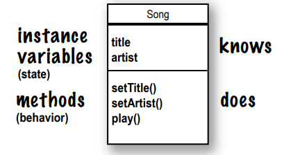

### Can every object of that type have different method behavior?

Bir sınıfın her bir instance'i aynı methodlara sahiptir, ancak methodlar instance variables'larının değerine bağlı
olarak farklı davranışlar sergileyebilir. Örnek olarak, Song sınıfı iki instance variables'ına, title (başlık) ve
artist (sanatçı) sahiptir. play() methodu bir şarkı çalar, ancak play() methodunu çağırdığınız instance'da, o instance'a
özgü olan title instance variables'inin temsil ettiği şarkıyı çalar. Örneğin, bir instance'da play() methodunu
çağırdığınızda "Politik" şarkısını duyarsınız, başka bir instance'da ise "Darkstar" çalar. Ancak, method kodu her iki
örnekte de aynıdır.

```
void play(){
    soundPlayer.playSound(title);
}
```

```
Song t2 = new Song();
t2.setArtist("Travis");
t2.setTitle("Sing");

Song s3 = new Song();
s3.setArtist("Sex Pistols");
s3.setTitle("My Way");
```

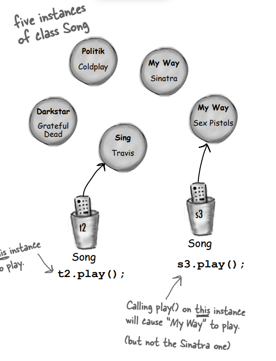

### The size affects the bark

Bir küçük köpeğin havlaması, büyük bir köpeğin havlamasından farklı olabilir. Köpek sınıfında, bark() yöntemi ne tür bir
havlama sesi çıkaracağına karar vermek için size (boyut) adında bir instance variables kullanır.

Dog class;

```
public class Dog {
    int size;
    String name;
    void bark(){
        if (size>60){
            System.out.println("Woof, Woof");
        } else if (size > 14){
            System.out.println("Ruuf Ruuf");
        } else {
            System.out.println("Yip Yip");
        }
    }
}
```

DogTestDrive class;

```
public class DogTestDrive {
    public static void main(String[] args) {
        Dog dog1 = new Dog();
        dog1.size = 70;

        Dog dog2 = new Dog();
        dog2.size = 8;

        Dog dog3 = new Dog();
        dog3.size = 35;

        dog1.bark();
        dog2.bark();
        dog3.bark();
    }
}
```

### You can send things to a method

Herhangi bir programlama dilinden beklediğiniz gibi, methodlara değerler aktarabilirsiniz. Örneğin, bir Köpek nesnesine
kaç kez havlamasını söylemek isteyebilirsiniz. Bunun için aşağıdaki gibi bir çağrı yapabilirsiniz:

```
dog1.bark(3);
```

Programlama geçmişinize ve kişisel tercihlerinize bağlı olarak, bir methoda iletilen değerler için "arguments" veya "
parameters" terimini kullanabilirsiniz. Bilgisayar bilimi alanında bazı formel ayrımlar olsa da, bizim kitapta bu konuda
daha önemli konularımız var. Bu yüzden onlara dilediğiniz şekilde (arguments, donuts, hairballs vb.) isim
verebilirsiniz. Ancak biz bunu şu şekilde yapıyoruz:

**Bir method, parametreleri kullanır. Bir caller ise argümanları geçer**

Argümanlar, methodlara ilettiğiniz şeylerdir. Bir argüman (2, "Foo" gibi bir değer ya da bir Köpek referansı gibi) yüzü
aşağı gelecek şekilde bir parametreye düşer. Ve bir parametre sadece bir yerel değişkenden başka bir şey değildir. Bir
tür ve bir isimle bir değişken, methodun gövdesi içinde kullanılabilir. Ancak işte önemli nokta: Bir method bir
parametre alıyorsa, ona bir şey geçirmeniz gerekir. Ve bu şey uygun türün bir değeri olmalıdır.

Dog class;

```
public class Dog {
   void bark(int numberOfBarks){
       while (numberOfBarks > 0){
           System.out.println("wuff");
           numberOfBarks-=1;
       }
   }
}
```

DogTestDrive class;

```
public class DogTestDrive {
    public static void main(String[] args) {
        Dog dog = new Dog();
        dog.bark(3);
    }
}
```

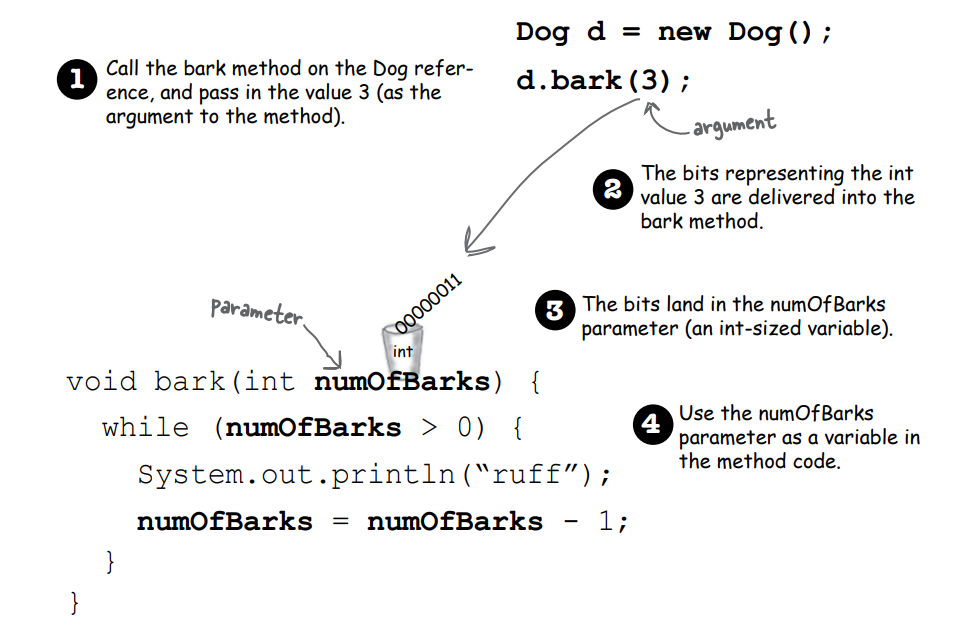

### You can get things back from a method.

Methodlar değer döndürebilir. Her method bir return type ile bildirilir, ancak şimdiye kadar tüm yöntemlerimizi void
dönüş türüyle oluşturduk, bu da hiçbir şey döndürmedikleri anlamına gelir.

```
void go(){
}
```

Ancak caller(çağıran) tarafa belirli bir türde değer döndürecek şekilde bir method bildirebiliriz, örneğin:

```
int luckyNumber(){
    return 7;
}
```

Bir methodu değer döndürecek şekilde bildirirseniz, bildirilen türde bir değer döndürmelisiniz! (Veya bildirilen türle
uyumlu bir değer döndürmelisiniz. Polimorfizm hakkında daha fazla konuştuğumuzda, bunu daha detaylı ele alacağız)

### Whatever you say you’ll give back, you better give back!

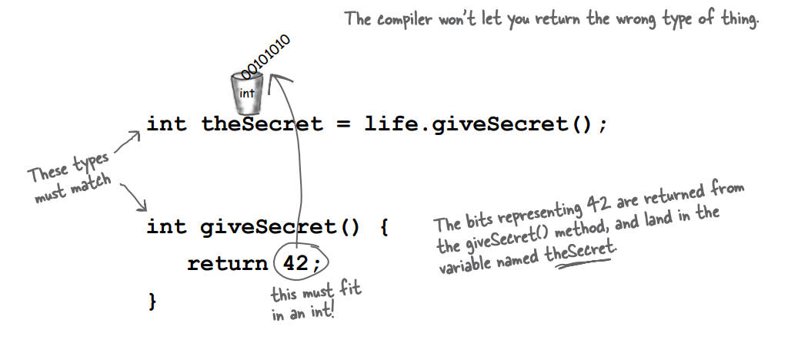

### You can send more than one thing to a method

Methodların birden fazla parametreye sahip olabilmesi mümkündür. Parametreleri bildirirken virgüllerle ayırın ve
geçerken de argümanları virgülle ayırın. En önemlisi, bir method parametrelere sahipse, doğru tür ve sıraya sahip
argümanlar geçirmeniz gerekir. İki parametreli bir methodu çağırırken ve ona iki argüman gönderirken bunu unutmayın.

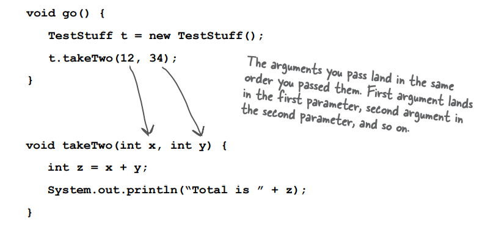

Variables'ları bir methoda geçirebilirsiniz, ancak değişkenin türü parametre türüyle eşleşmelidir.

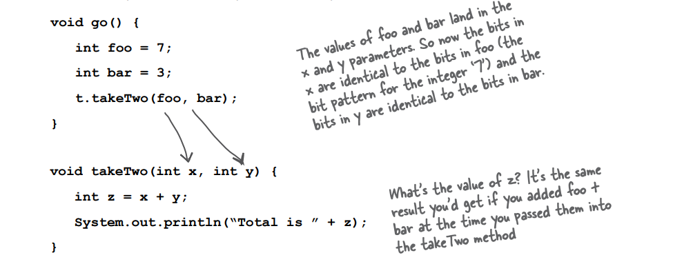

## Java is pass-by-value. That means pass-by-copy

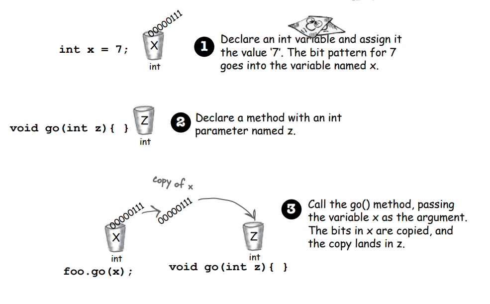

int x variable'ina 7 değeri atanır.

void go(int z) methodu bir integer parametre kabul eder

foo instance variable'i uzerinden go methodunu çağırıp x variable'ini geçersek z variable'ina bu kopyalanmış olur

Bu konuyla ilgili daha fazla bilgiyi ileriki bölümlerde öğreneceksiniz. Java her şeyi value olarak geçirir. Her şeyi.
Ancak... value, variable'in içindeki bitler anlamına gelir. Ve hatırlayın, nesneleri variables'lare koymazsınız;
değişken
bir uzaktan kumandadır - bir nesnenin referansıdır. Bu nedenle, bir methoda bir nesnenin referansını geçiriyorsanız,
bir uzaktan kumandanın bir kopyasını geçiriyorsunuz demektir. Ancak bekleyin, bu konuda daha çok şey söyleyeceğiz.

Bir method yalnızca bir dönüş değeri bildirebilir. ANCAK... diyelim ki üç integer değeri döndürmek istiyorsunuz, o zaman
bildirilen dönüş türü bir int array'i olabilir. Bu integer'ları array'e yerleştirin ve onu geriye doğru geçirin. Farklı
türlerde birden çok değer döndürmek biraz daha karmaşıktır; bunu, ArrayList hakkında konuştuğumuz ileriki bir bölümde
ele alacağız.

Bir methoddan döndürebileceğiniz her şey, o türe implicity olarak yükseltilebilen bir şey olabilir. Yani, beklenen yerde
bir int bekleniyorsa bir byte geçebilirsiniz. Caller tarafı ilgilendirmeyecektir çünkü byte, sonucu atamak için call
edenin kullanacağı int'e uygun şekilde sığar. Döndürmeye çalıştığınız şey bildirilen türden daha küçükse, açık bir
cast kullanmanız gerekmektedir.

Java'da bir dönüş değerini kabul etmeniz gerekmez. Bir dönüş türü olan bir methodu çağırmak isteyebilirsiniz, ancak
dönüş değeriyle ilgilenmediğiniz durumlar olabilir. Bu durumda, methodu çağırmanızın nedeni, method içinde yaptığı iş
için, methodun dönüş değeriyle ilgilenmek değil. Java'da dönüş değerini atamak veya kullanmak zorunda değilsiniz.

**BULLET POINTS**

Sınıflar, bir nesnenin ne bildiğini(knows) ve ne yaptığını(does) tanımlar

* Bir nesnenin bildikleri (knows), instance variables'lardır (state)
* Bir nesnenin yaptıkları, methodlarıdır (Behavior)
* Methodlar instance variables'ları kullanabilir, böylece aynı türdeki nesneler farklı davranabilir.
* Bir method parametrelere sahip olabilir, bu da methoda bir veya daha fazla değer geçirebileceğiniz anlamına gelir.
  Geçtiğiniz değerlerin sayısı ve türü, method tarafından bildirilen parametrelerin sırası ve türüyle eşleşmelidir.
* Yöntemlere giren ve çıkan değerler, daha büyük bir türe implicity olarak yükseltilebilir veya daha küçük bir türe açık
  bir şekilde cast edilebilir.
* Bir methoda argüman olarak geçirdiğiniz değer, bir anlık değer (2, 'c' vb.) veya bildirilen parametre türüne sahip bir
  değişken (örneğin, int bir değişken olan x gibi) olabilir. (Argüman olarak geçebileceğiniz diğer şeyler de vardır,
  ancak henüz o noktada değiliz.)
* Bir method, bir dönüş türü bildirmelidir. Void dönüş türü, methodun hiçbir şey döndürmediğini belirtir.
  Eğer bir method void olmayan bir dönüş türü bildiriyorsa, bildirilen dönüş türüyle uyumlu bir değer döndürmelidir.

### Cool things you can do with parameters and return types

Parametrelerin ve dönüş türlerinin nasıl çalıştığını gördüğümüze göre, bunları iyi bir şekilde kullanmanın zamanı geldi:
Getters ve Setters. Eğer her şeyi resmi olarak yapmayı tercih ediyorsanız, onlara Accessors ve Mutators denmesini
tercih edebilirsiniz. Ancak bu harika hecelemelerin israfı olur. Ayrıca, Getters ve Setters, Java'nın isimlendirme
kuralına uyduğu için onları böyle adlandıracağız.

Getters ve Setters size, işte, bir şeyleri almanızı ve ayarlamalarınızı yapmanızı sağlar. Genellikle instance variables
değerlerini. Bir Getters'ın hayattaki tek amacı, o belirli Getters'ın elde etmesi gereken değerin değerini, bir dönüş
değeri olarak geri göndermektir. Ve artık muhtemelen bir sürpriz olmadığı için, Setter'ın yaşaması ve nefes alması için,
bir argüman değerini almak ve onu bir instance variables'in değerini ayarlamak için kullanmaktır.

```
public class ElectricGuitar {
    String brand;
    int numberOfPickups;
    boolean rockStarUsesIt;

    public String getBrand() {
        return brand;
    }

    public void setBrand(String brand) {
        this.brand = brand;
    }

    public int getNumberOfPickups() {
        return numberOfPickups;
    }

    public void setNumberOfPickups(int numberOfPickups) {
        this.numberOfPickups = numberOfPickups;
    }

    public boolean isRockStarUsesIt() {
        return rockStarUsesIt;
    }

    public void setRockStarUsesIt(boolean rockStarUsesIt) {
        this.rockStarUsesIt = rockStarUsesIt;
    }
}
```

### Encapsulation - Do it or risk humiliation and ridicule

Bu en önemli an kadar, en kötü nesne yönelimli programlama hatalarından birini yapıyorduk. Utandırıcı ihlalimiz ne mi?
Verilerimizi açığa çıkarmak!

İşte buradayız, dünya umurumuzda olmadan gidiyoruz ve verilerimizi herkesin görebileceği hale getiriyoruz, hatta
dokunabilecek hale getiriyoruz. Muhtemelen, instance variables'lerinizi açık bırakmanın belirsiz bir rahatsızlık
hissiyle karşılaştınız. Açığa çıkmış, nokta operatörü ile erişilebilir anlamına gelir, örneğin:

```theCat.height = 27;```

Bu fikri düşünelim, kumandayı kullanarak doğrudan Kedi nesnesinin boyutu instance variables'ini değiştirmek. Yanlış
kişinin elinde, bir referans variables (uzaktan kumanda), oldukça tehlikeli bir silahtır. Çünkü şunları engelleyen bir
şey nedir ki:

```theCat.height = 0;```

Bu kötü bir şey olurdu. Tüm instance variables'ler için setter methodlar oluşturmalı ve diğer kodun veriye doğrudan
erişmek yerine setter'ları çağırmasını sağlayacak bir yol bulmalıyız.

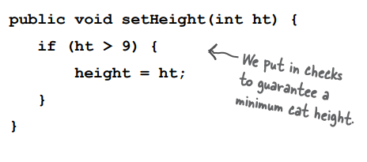

minimum cat height'inin kontrolünü yaptıktan sonra variable'ı set edebiliriz

### Hide the data

Evet, bad data isteyen bir uygulamadan verilerinizi koruyan ve uygulamanızı daha sonra değiştirmenize olanak sağlayan
bir uygulamaya geçmek bu kadar basittir.

Peki, verileri tam olarak nasıl gizlersiniz? Public ve private erişim belirteçleriyle. Public'ı zaten biliyorsunuz - her
main methodda kullanıyoruz.

İşte bir **encapsulation** başlangıç kuralı. Instance variables'lerinizi private olarak işaretleyin ve erişim kontrolü
için public getter ve setter'ları sağlayın. Java'da daha fazla tasarım ve kodlama bilgisi edindiğinizde, muhtemelen
şeyleri biraz farklı yapacaksınız, ancak şu an için bu yaklaşım sizi güvende tutacaktır.


**Dialog :**

HeadFirst : Encapsulation ile ilgili önemli olan nedir?

Object : Tamam, 500 kişiyle konuşma yaptığın o rüyayı biliyorsun. aniden fark ettin - çıplak mısın?

HeadFirst : Peki, çıplak hissetmenizin dışında herhangi bir tehlike var mı? Peki encapsulation sizi nelerden korur?

Object : Kapsülleme, instance variables'lerim etrafında bir kuvvet alanı oluşturur, böylece kimse onları uygunsuz bir
değere ayarlayamaz.

HeadFirst : Bir örnek verebilir misin?

Object : Bunun için bir doktora gerekmez. Çoğu instance variables değeri, değerlerin sınırları hakkında belirli
varsayımlarla kodlanmıştır. Örneğin, eğer negatif sayılara izin verilseydi, bozulan tüm şeyleri düşünün. Bir ofisteki
tuvalet sayısı, bir uçağın hızı, doğum günleri, barbell ağırlığı, cep telefonu numaraları, mikrodalga fırın gücü gibi
şeyler.

HeadFirst : Peki encapsulation, boundaries(sınırlar)'i belirlemenize nasıl izin verir?

Object : Diğer kodun setter metodları kullanarak gitmesini zorlayarak, encapsulation sınırların belirlenmesini sağlar.
Bu şekilde, setter metodu parametreyi doğrulayabilir ve yapılabilir olup olmadığına karar verebilir. Metot, parametreyi
reddedebilir ve hiçbir şey yapmayabilir veya belirli bir durum için bir exception fırlatabilir (örneğin, kredi kartı
başvurusu için geçersiz bir sosyal güvenlik numarası gibi) veya metot, gönderilen parametreyi en yakın kabul edilebilir
değere yuvarlayabilir. Önemli olan, setter metodu içinde istediğiniz herhangi bir işlemi gerçekleştirebilmenizdir, oysa
instance variables'leriniz public ise bunu yapamazsınız.

HeadFirst : Ancak bazen hiçbir şeyi kontrol etmeden değeri basitçe ayarlayan setter methodlar görüyorum. Sınırı
olmayan bir instance variable'iniz varsa, setter methodu gereksiz ek yük oluşturuyor mu? Bir performans başarısı mı?

Object : Setter'ların (ve getter'ların da) amacı, ileride fikrinizi değiştirebilmenizdir, başkalarının kodunu bozmadan!
Hayal edin, şirketinizdeki insanların yarısı sınıfınızı public instance variables'leriyle kullansa ve bir gün birdenbire
fark ederseniz, "Oops - o değeri planlamadığım bir şey var, bir setter metoduna geçmek zorunda kalacağım." Bütün
kodları bozarsınız. Encapsulation'ın harika yanı, fikrinizi değiştirebilmenizdir. Ve kimse zarar görmez. variables'lari
doğrudan kullanmaktan elde edilen performans artışı çok küçüktür ve nadiren - hatta asla - buna değer olmazdı.

### Encapsulating the GoodDog class

```
public class GoodDog {
    // Make the instance variable private
    private int size;

    // Getter - Setter methods
    public int getSize() {
        return size;
    }

    public void setSize(int size) {
        this.size = size;
    }

    void bark() {
        if (size > 60) {
            System.out.println("woof woof");
        } else if (size > 14) {
            System.out.println("ruuf ruuf");
        } else {
            System.out.println("yip, yip");
        }
    }
}
```

GoodDogTestDrive class;

```
public class GoodDogTestDrive {
    public static void main(String[] args) {
        GoodDog goodDog1 = new GoodDog();
        goodDog1.setSize(70);

        GoodDog goodDog2 = new GoodDog();
        goodDog2.setSize(8);

        System.out.println("Gooddog1 size : " + goodDog1.getSize());
        System.out.println("Gooddog2 size : " + goodDog2.getSize());

        goodDog1.bark();
        goodDog2.bark();
    }
}
```

### How do objects in an array behave?

Diğer nesneler gibi. Tek fark, onlara nasıl eriştiğinizdir. Yani, nasıl uzaktan kumandaya eriştiğiniz. Bir array
içindeki Dog nesnelerinde metodları çağırmayı deneyelim.

1 - Create Dog array

```
Dog[] pets;
pets = new Dog[7];
```

2 - Iki Dog object'i create edip array'in ilk iki elementine assign edelim

```
pet[0] = new Dog();
pet[1] = new Dog();
```

3 - Iki dog object'inde methodları call et

```
pet[0].setSize(30);
int x = pets[0].getSize();
pet[1].setSize(8);
```

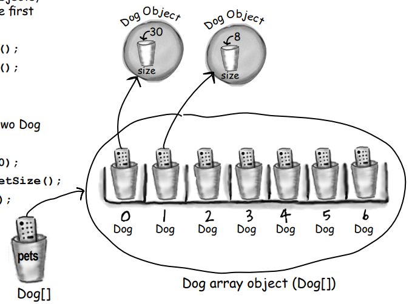

### Declaring and initializing instance variables

```
public class PoorDog {
    private int size;
    private String name;

    public int getSize() {
        return size;
    }

    public String getName() {
        return name;
    }
}
```

PoorDog class'ın 2 adet instance variables mevcut. Peki bu instance variables'ları PoorDogTestDrive class'ından
getter'larını çağırırsam hangi değerleri elde ederim?

```
public class PoorDogTestDrive {
    public static void main(String[] args) {
        PoorDog poorDog = new PoorDog();
        System.out.println(poorDog.getSize());
        System.out.println(poorDog.getName());
    }
}
```

size variable'i için "0", name variable'i için "null" değerini elde ediyorum

instance variables'ler her zaman default bir değer alır. Bir instance variable'a açıkça bir değer atamazsanız veya bir
setter metodunu çağırmazsanız, instance variable'ine yine de bir değer atanır.

```
integers        0
floting points  0
booleans        false
references      null
```

### The difference between instance and local variables

1 - instance variables'lar bir sınıfın içinde, ancak bir metot içinde değil, sınıf düzeyinde tanımlanır.

```
public class Horse {
    private double height;
    private String breed;
    
    //more code...
}
```

2 - Local Variables bir method içinde tanımlanırlar;

```
public class AddThing {
    private int a;
    private int b;

    public int add() {
        int total = a + b;
        return total;
    }
}
```

Burada ki "total" variable'i local variable'dir ve süslü parantezler dışında erişilebilir değildir

3 - Local variable'lar kullanılmadan once mutlaka initialize edilmelidirler

```
public class Foo {
    public void go(){
        int x;
        int z = x + 3;
    }
}
```

Yukarıda ki kod derlenmez çünkü "x" local variable'i initialize edilmiş bir değere sahip değildir. Local variables'lar
default bir değer almaz! Variable'i başlatmadan önce local bir variable'i kullanmaya çalışırsanız, derleyici şikayette
bulunur.

Peki ya method parametreleri? Local variables'larla ilgili kurallar nasıl onlar için geçerli mi?

Method parametreleri, neredeyse local variable'la aynıdır - method içinde bildirilirler (teknik olarak methodun
gövdesi içinde değil, method argüman listesinde bildirilirler), ancak instance variables'larına kıyasla local variable'
dir. Ancak method parametreleri hiçbir zaman başlatılmamış olmayacaklarından, bir parametre variable'inin başlatılmamış
olabileceğini belirten bir derleyici hatası almayacaksınız.

Bunun sebebi, metodu ihtiyaç duyduğu argümanları göndermeden çağırmaya çalışırsanız derleyicinin hata vermesidir. Bu
nedenle parametreler HER ZAMAN başlatılır, çünkü derleyici, metodun, method için bildirilen parametrelerle eşleşen
argümanlarla her zaman çağrıldığını garanti eder ve argümanlar (otomatik olarak) parametrelere atanır.

### Comparing variables (primitives or references)

Bazı durumlarda iki primitive verinin aynı olup olmadığını bilmek isteyebilirsiniz. Bu oldukça kolay, sadece ==
operatörünü kullanın. Bazı durumlarda ise iki referans variable'inin heap'teki tek bir nesneye işaret edip etmediğini
bilmek isteyebilirsiniz. Bu da kolay, yine == operatörünü kullanın.

Ancak bazen iki nesnenin eşit olup olmadığını bilmek isteyebilirsiniz. Bunun için .equals() metodunu kullanmanız
gerekir. Nesnelerin eşitlik kavramı, nesne tipine bağlıdır. Örneğin, iki farklı String nesnesinin aynı karakterlere
sahip olması durumunda (örneğin, "expeditious"), bunlar anlamlı olarak eşdeğerdir, bunlar heap'te iki ayrı nesne olsalar
bile. Peki ya bir Köpek? Aynı boyutta ve ağırlıkta olan iki Köpeği eşit olarak kabul etmek istiyor musunuz? Muhtemelen
değil. Dolayısıyla, farklı iki nesnenin eşit olarak kabul edilip edilmemesi, o belirli nesne tipi için anlamlı olan şeye
bağlıdır. Nesne eşitliği kavramını daha sonra tekrar ele alacağız (ve ek B'yi), ancak şu anda anlamamız gereken şey, ==
operatörünün yalnızca iki değişkenin içindeki bitleri karşılaştırmak için kullanıldığıdır. Bu bitlerin temsil ettiği şey
önemli değil. Bitler ya aynıdır ya da değildir.

İki primitive veriyi karşılaştırmak için == operatörünü kullanın. == operatörü herhangi bir türdeki iki değişkeni
karşılaştırmak için kullanılabilir ve sadece bitleri karşılaştırır.

if (a == b) {...}, a ve b değişkenlerinin bitlerine bakar ve bit deseninin aynı olduğunda true döner (ancak değişkenin
boyutuyla ilgilenmez, bu yüzden sol uçtaki tüm ekstra sıfırlar önemli değildir).

```
int a = 3;
byte b = 3;
if(a == b) { // true }
```

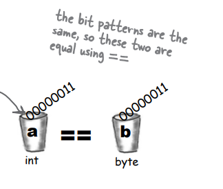

İki referansın aynı olup olmadığını (yani, heap üzerinde aynı nesneye işaret edip etmediğini) görmek için == operatörünü
kullanın. Unutmayın, == operatörü yalnızca variable'in bit pattern'ine bakar. Kurallar, değişkenin bir referans veya
primitive olmasına bakılmaksızın aynıdır. Bu nedenle, == operatörü iki referans variable'inin aynı nesneye işaret
ettiğinde true değerini döndürür! Bu durumda, bit pattern'ininin ne olduğunu bilmiyoruz (çünkü JVM'ye bağlıdır ve bize
gizlidir), ancak iki referansın aynı nesneye işaret ettiğini biliyoruz.

```
Foo a = new Foo();
Foo b = new Foo();
Foo c = a;
if (a == b) { // false }
if (a == c) { // true }
if (b == c) { // false }
```

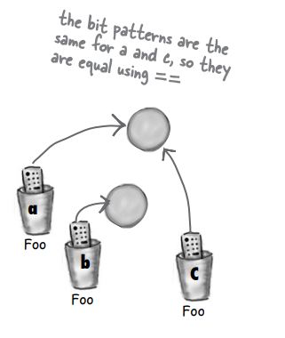

**EXERCISES :** 

```
public class XCopy {
    public static void main(String[] args) {
        int orig = 42;
        XCopy x = new XCopy();

        int y = x.go(orig);
        // orig degeri go methoduna sadece kopyalanir degeri DEGISMEZ
        // cikti olarak 42 - 84 çıktısı elde edilir
        System.out.println("Orig : " + orig + " y : " + y);
    }

    int go(int arg) {
        arg = arg * 2;
        return arg;
    }
}
```

Clock class;

```
public class Clock {
    private String time;

    public String getTime() {
        return time;
    }

    public void setTime(String time) {
        this.time = time;
    }
}
```

ClockTestDrive;

```
public class ClockTestDrive {
    public static void main(String[] args) {
        Clock clock = new Clock();
        clock.setTime("1234");
        String tod = clock.getTime();
        System.out.println("time : " + tod);
    }
}
```