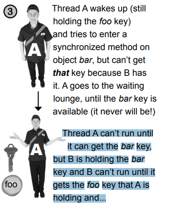

# Networking and Threads

Dış dünya ile bağlantı kurun. Java programınız başka bir makinedeki bir programı etkileyebilir. Bu oldukça kolaydır. Tüm
low-level network ayrıntıları, java.net kütüphanesindeki sınıflar tarafından ele alınır. Java'nın büyük avantajlarından
biri, network üzerinden veri gönderip almanın, chain'in sonunda hafifçe farklı bir connection stream'i ile yalnızca I/O
işlemi olduğudur. Bir BufferedReader'ınız varsa, okuyabilirsiniz. Ve BufferedReader, verinin bir dosyadan geldiğini veya
bir Ethernet kablosundan indiğini umursamaz. Bu bölümde soketlerle dış dünyayla bağlantı kuracağız. Client soketleri
oluşturacağız. Server soketleri oluşturacağız. Client ve server'lar oluşturacağız. Ve birbirleriyle konuşmalarını
sağlayacağız. Bölüm bittiğinde tamamen işlevsel, multi threading bir sohbet client'i olacak. Birden fazla thread mi
dedik? Evet, şimdi Bob ile konuşurken aynı anda Suzy'yi dinlemenin sırrını öğreneceksiniz.

Bir bilgisayar oyunu üzerinde çalışıyorsunuz. Siz ve ekibiniz oyunun her bölümü için ses tasarımını yapıyorsunuz. Oyunun
bir 'sohbet' versiyonunu kullanarak ekibiniz işbirliği yapabilir - bir vuruş deseni ile sohbet mesajınızı gönderebilir
ve Beat Box Chat'teki herkes alır. Bu nedenle yalnızca diğer katılımcıların mesajlarını okumakla kalmaz, gelen mesajlar
bölgesindeki bir mesaja tıklamakla bir vuruş deseni yükleyebilir ve çalabilirsiniz.

Bu bölümde, böyle bir sohbet istemcisi yapmak için nelerin gerektiğini öğreneceğiz. Hatta biraz sohbet serversu yapma
hakkında da bilgi edineceğiz. Tam Beat Box Chat'i Code Kitchen için saklayacağız, ancak bu bölümde Ludicrously Simple
Chat Client ve Very Simple Chat Server adında, metin mesajları gönderen ve alan basit bir sohbet istemcisi ve serversu
yazacaksınız.

### Chat Program Overview

Client'in Server hakkında bilgi sahibi olması gerekmektedir. Server'in TÜM Clientler hakkında bilgi sahibi olması
gerekmektedir.


--**Nasıl Çalışır**--

1 - Client, server'a bağlanır


2 - Sunucu bir bağlantı yapar ve client'i katılımcılar listesine ekler.


3 - Başka bir client bağlanır;


4 - Client A, sohbet hizmetine bir mesaj gönderir.


5 - Server, mesajı ORİJİNAL GÖNDEREN DAHİL olmak üzere TÜM katılımcılara dağıtır.


### Connecting, Sending, and Receiving

Client'i çalışır hale getirmek için öğrenmemiz gereken üç şey var:

1 - Client ile server arasında ilk bağlantıyı nasıl kuracağımızı öğrenmek

2 - Server'a nasıl mesaj gönderileceğini öğrenmek

3 - Server'dan nasıl mesaj alınacağını öğrenmek

Bunların çalışması için low-level birçok işlem gereklidir. Ancak şanslıyız çünkü Java API ağ paketi (java.net),
programcılar için bunları kolaylaştırır. Ağ ve I/O kodundan çok daha fazla GUI kodu göreceksiniz.
Ve bu kadarla sınırlı değil.

Basit sohbet istemcisinin içinde, bu kitap boyunca henüz karşılaşmadığımız bir sorun gizlidir: aynı anda iki şey yapmak.
Bir bağlantı kurma işlemi bir kez yapılır (ya başarılı olur ya da başarısız olur). Ancak bundan sonra bir sohbet
katılımcısı, çıkan mesajları göndermek ve aynı anda diğer katılımcılardan (server aracılığıyla) gelen giriş mesajlarını
almak ister. Hmmmm... bu biraz düşünme gerektiren bir konu, ancak birkaç sayfa içinde buna ulaşacağız.

1 - Connect

Client, bir Socket bağlantısı kurarak serverya bağlanır.


2 - Send

Client, bir mesajı server'a gönderir.


3 - Receive

Client' server'dan mesajı alır


### Make a network Socket connection

Başka bir makineye bağlanmak için bir Soket bağlantısına ihtiyacımız var.

Bir Soket (java.net.Socket sınıfı), iki makine arasında bir ağ bağlantısını temsil eden bir nesnedir. Bir bağlantı
nedir? İki makine arasındaki bir ilişkidir, iki yazılım parçasının birbirleri hakkında bilgi sahibi olduğu bir
ilişkidir. En önemlisi, bu iki yazılım parçasının birbirleriyle nasıl iletişim kuracağını bilmesidir. Diğer bir deyişle,
nasıl bit göndereceklerini bilirler.

Neyse ki, düşük seviye ayrıntılarla ilgilenmemize gerek yok, çünkü bunlar 'networking stack'de çok daha düşük bir yerde
ele alınırlar. 'Networking Stack' nedir bilmiyorsanız endişelenmeyin. Bu, bilgilerin (bitlerin) Java programından, bir
JVM'de çalışan bir Java programından, fiziksel donanıma (örneğin ethernet kabloları) ve başka bir makinede geri dönmesi
için geçmesi gereken katmanlara bakma şeklidir. Tüm kirli ayrıntılarla ilgilenen birisi olmalıdır. Ancak o birisi siz
değilsiniz. Bu, işletim sistemine özgü yazılım ve Java ağ API'sinin bir kombinasyonudur. Endişelenmeniz gereken kısım
yüksek seviyedir - hatta çok yüksek seviyedir - ve şaşırtıcı derecede basittir. Hazır mısınız?


### A TCP port is just a number. A 16-bit number that identifies a specific program on the server

İnternet web (HTTP) servernuz 80 numaralı portta çalışır. Bu bir standarttır. Eğer bir Telnet servernuz varsa, onun
çalıştığı port 23'tür. FTP? 20. POP3 mail serversu? 110. SMTP? 25. Zaman serversu 37 numaralı portta bulunur. Port
numaralarını unique tanımlayıcılar olarak düşünün. Bunlar, serverda çalışan belirli bir yazılıma mantıksal bir
bağlantıyı temsil eder. Bu kadar. Donanım kutunuzu çevirip bir TCP portu bulamazsınız. Bir serverda 65536'sı vardır (0 -
65535). Bu nedenle açıkça fiziksel cihazları takmak için bir yer temsil etmezler. Sadece bir uygulamayı temsil eden bir
sayıdır.

Port numaraları olmadan servernun hangi uygulamanın client tarafından bağlanmak istendiğini bilme yolu olmazdı. Ve her
bir uygulamanın kendi benzersiz protokolü olabileceğini düşünün, bu tanımlayıcılar olmadan ne kadar sorun yaşayacağınızı
düşünün. Örneğin web tarayıcınız, HTTP serversu yerine POP3 mail serversuna ulaşsaydı ne olurdu? Mail serversu bir HTTP
isteğini nasıl ayrıştıracağını bilemez! Ve hatta ayrıştırsaydı, POP3 serversu HTTP isteğini işlemekle ilgili hiçbir
bilgiye sahip değildir.

Bir server programı yazdığınızda, programın hangi port numarasında çalışmasını istediğinizi belirten kod eklersiniz (
bunu bu bölümün ilerleyen bölümlerinde Java'da nasıl yapılacağını göreceksiniz). Bu bölümde yazdığımız Sohbet
programında, 5000 port numarasını seçtik. Sadece istedik ve 1024 ile 65535 arasında bir sayı olma kriterini karşıladı.
Neden 1024? Çünkü 0 ile 1023 arası, şimdi bahsettiğimiz gibi bilinen hizmetler için ayrılmıştır.

Ve eğer bir şirket ağı üzerinde çalışacak hizmetler (server programları) yazıyorsanız, hangi portların zaten
kullanıldığını öğrenmek için sistem yöneticileriyle iletişime geçmelisiniz. Sistem yöneticileriniz size örneğin, 3000
sayısının altındaki herhangi bir port numarasını kullanamayacağınızı söyleyebilir. Her durumda, eğer uzuvlarınızı
değerli buluyorsanız, port numaralarını kontrolsüzce atamazsınız. Tabii ki ev ağınızdaysanız. Bu durumda sadece
çocuklarınıza danışmanız gerekecektir.


0 ile 1023 arasındaki TCP port numaraları, bilinen hizmetler için ayrılmıştır. Bu numaraları kendi server programlarınız
için kullanmayın!

Yazdığımız sohbet serversu 5000 numaralı portu kullanıyor. Sadece 1024 ile 65535 arasında bir sayı seçtik.

--**DIALOGS**--

Q : İletişim kurmak istediğiniz server programının port numarasını nasıl öğrenirsiniz?

A : Bu, programın iyi bilinen hizmetlerden biri olup olmadığına bağlıdır. Eğer karşı sayfadaki (HTTP, SMTP, FTP, vb.)
gibi iyi bilinen bir hizmete bağlanmaya çalışıyorsanız, bunları internette (Google'da "Well-Known TCP Port" araması
yaparak) bulabilirsiniz.

Ancak program iyi bilinen hizmetlerden biri değilse, hizmeti dağıtan kişiden öğrenmeniz gerekecektir. Ona sorun. Eğer
birisi bir ağ hizmeti yazarsa ve diğerlerinin onun için istemci yazmasını istiyorsa, genellikle hizmet için IP adresini,
port numarasını ve protokolü yayınlayacaklardır. Örneğin, bir GO oyunu serversu için istemci yazmak istiyorsanız, GO
serversu sitelerinden birini ziyaret edebilir ve o belirli server için istemci yazmanın nasıl yapılacağı hakkında bilgi
bulabilirsiniz.

Q : Bir port üzerinde birden fazla program çalışabilir mi? Başka bir deyişle, aynı serverda iki uygulama aynı port
numarasına sahip olabilir mi?

A :  Hayır! Zaten kullanımda olan bir porta bir programı bağlamaya çalışırsanız, BindException hatası alırsınız. Bir
programı bir porta bağlamak, yalnızca bir server uygulamasını başlatmak ve onu belirli bir portta çalıştırmasını
söylemek anlamına gelir. Sunucu bölümüne geldiğimizde bunun hakkında daha fazla bilgi edineceksiniz.

Peki, bir Soket bağlantısı elde ettiniz. İstemci ve server birbirlerinin IP adresini ve TCP port numarasını biliyor.
Şimdi ne yapacaksınız? Bu bağlantı üzerinden nasıl iletişim kuracaksınız? Başka bir deyişle, bir taraftan diğerine nasıl
bit taşıyacaksınız? Sohbet istemcinizin göndermesi gereken ve alması gereken mesaj türlerini hayal edin.


### To read data from a Socket, use a BufferedReader

Bir Soket bağlantısı üzerinden iletişim kurmak için stream'leri kullanırsınız. Daha önceki bölümde kullandığımız gibi,
sıradan eski I/O stream'leri. Java'daki en harika özelliklerden biri, I/O işlerinizin çoğunun yüksek seviye chain
stream'inizin aslında neye bağlı olduğunu umursamayacak olmasıdır. Başka bir deyişle, bir BufferedReader
kullanabilirsiniz, dosyaya yazarken yaptığınız gibi, tek fark alttaki connection stream'in bir Dosya yerine bir Soket'e
bağlı olmasıdır!


1 - Make a socket connection to the server

```Socket chatSocket = new Socket("127.0.0.1", 5000);```

2 - Socket'in low-level (bağlantı) input stream'ine chain edilmiş bir InputStreamReader oluşturun.

```InputStreamReader stream = new InputStreamReader(chatSocket.getInputStream());```

InputStreamReader, low-level bir byte stream (örneğin, Soketten gelen stream) ile high-level bir character stream (
örneğin, chain stream üstündeki BufferedReader) arasında bir 'köprüdür'.

Yapmamız gereken tek şey, soketten bir input stream istemek! Bu low-level bir connection stream'dir, ama sadece onu daha
metin dostu bir şeye chain etmeyeceğiz.

3 - Make a BufferedReader and read!

```
BufferedReader reader = new BufferedReader(stream);
String message = reader.readLine();
```

BufferedReader'i, InputStreamReader'a (ki bu, Socket'ten aldığımız low-level connection stream'ine chain edilmiştir)
chain edin.


### To write data to a Socket, use a PrintWriter

Geçtiğimiz bölümde PrintWriter yerine BufferedWriter kullanmadık, seçeneklerimiz var ancak tek tek bir String yazarken
PrintWriter standart bir tercihtir. Ayrıca, PrintWriter'da bulunan print() ve println() metodlarını tanıyacaksınız! Eski
dostumuz System.out gibi.

1 - Make a Socket connection to the server

```Socket chatSocket = new Socket(“127.0.0.1”, 5000);```

2 - Socket'in low-level (connection) output stream'ine chain edilmiş bir PrintWriter oluşturun.

```PrintWriter writer = new PrintWriter(chatSocket.getOutputStream());```

PrintWriter, character data ile Socket'in low-level output stream'inden aldığı byte'lar arasında kendi köprüsünü
oluşturur. Bir PrintWriter'ı Socket'in output stream'ine chain ettiğimizde, String'leri Socket bağlantısına yazabiliriz.

Soket bize low-level bir connection stream verir ve onu PrintWriter'a chain ederiz, bunu PrintWriter constructor'ına
vererek yaparız.

3 - Write (print) something

```
writer.println(“message to send”);
writer.print(“another message”);
```


### The DailyAdviceClient

Chat uygulamasını oluşturmaya başlamadan önce, biraz daha küçük bir şeyle başlayalım. Advice Guy, kodlama günlerini daha
iyi geçirmeniz için pratik, ilham verici ipuçları sunan bir server programıdır.

Biz The Advice Guy programı için bir istemci oluşturuyoruz, bu istemci her bağlandığında serverdan bir mesaj alır.
Ne bekliyorsunuz? Bu uygulama olmadan ne tür fırsatları kaçırdığınızı kim bilebilir.

1 - Connect

Client server'a bağlanır ve ondan bir input stream alır.


2 - Read

Client, server'dan bir message okur.


### DailyAdviceClient code

Bu program bir Soket oluşturur, bir BufferedReader oluşturur (diğer stream'lerin yardımıyla) ve server uygulamasından (
4242 numaralı portta çalışan) tek bir satır okur.

```
public class DailyAdviceClient {
    public static void main(String[] args) {
        DailyAdviceClient client = new DailyAdviceClient();
        client.go();
    }

    private void go() {
        try {
            /* 4242 numaralı portta, bu kodun çalıştığı aynı ana makinede (yani 'localhost') çalışan bir şeye Soket
            bağlantısı oluşturun.*/
            Socket socket = new Socket("127.0.0.1",4242);
            InputStreamReader streamReader = new InputStreamReader(socket.getInputStream());
            /* Bir BufferedReader'ı, bir InputStreamReader'a ve sonra da Soket'in input stream'ine chain edin */
            BufferedReader bufferedReader = new BufferedReader(streamReader);

            /* Bu readLine() işlemi, sanki bir Dosya'ya chain edilmiş bir BufferedReader kullanıyormuşsunuz gibi
            TAM OLARAK aynıdır... Başka bir deyişle, bir BufferedReader methodunu çağırdığınızda, okuyucu karakterlerin
            nereden geldiğini bilmez veya umursamaz.*/
            String advice = bufferedReader.readLine();
            System.out.println("Today you should : " + advice);

            bufferedReader.close();
        } catch (IOException e) {
            throw new RuntimeException(e);
        }
    }
}
```

### Writing a simple server

1 - Server uygulaması, belirli bir portta bir ServerSocket oluşturur.

```ServerSocket serverSock = new ServerSocket(4242);```

Bu, server uygulamasının port 4242 için gelen client request'lerini dinlemeye başlamasını sağlar.


2 - Client, server uygulamasına bir Soket bağlantısı oluşturur.

```Socket sock = new Socket(“190.165.1.103”, 4242);```

Client, IP adresini ve port numarasını biliyor (bu bilgileri server uygulamasını o porta ayarlayan kişi tarafından
yayınlanmış veya verilmiş olabilir).


3 - Server, bu client ile iletişim kurmak için yeni bir Soket oluşturur.

```Socket sock = serverSock.accept();```

accept() methodu, client Soket bağlantısı beklerken engellenir (sadece bekler). Sonunda bir client bağlanmayı denerse,
method client ile iletişim kurabilen (yani client'in IP adresini ve port numarasını bilen) düz bir Soket döndürür.
Soket, ServerSocket'ten farklı bir portta bulunur, böylece ServerSocket diğer istemcileri beklemeye devam edebilir.


### DailyAdviceServer code

Bu program bir ServerSocket oluşturur ve client isteklerini bekler. Bir client isteği geldiğinde (örneğin client bu
uygulama için yeni bir Soket dediğinde), server o client'a yeni bir Soket bağlantısı oluşturur. Server, Soket'in output
stream'ini kullanarak bir PrintWriter oluşturur ve client'a bir ileti gönderir.

```
public class DailyAdviceServer {
    String[] adviceList = {
            "Take smaller bites",
            "Go for the tight jeans. No they do NOT make you look fat",
            "One word: inappropriate",
            "Just for today, be honest. Tell your boss what you *really* think",
            "You might want to rethink that haircut"
    };

    public static void main(String[] args) {
        DailyAdviceServer server = new DailyAdviceServer();
        server.go();
    }

    private void go() {
        try {
            /* ServerSocket, bu server uygulamasının bu kodun çalıştığı makinede 4242 numaralı portta client isteklerini
             dinlemesini' sağlar.*/
            ServerSocket serverSocket = new ServerSocket(4242);

            while(true){
                /* accept methodu, bir request gelene kadar engellenir (sadece bekler) ve ardından method, client ile
                iletişim kurmak için (anonim bir portta) bir Soket döndürür.*/
                Socket socket = serverSocket.accept();

                PrintWriter writer = new PrintWriter(socket.getOutputStream());
                String advice = getAdvice();
                /* Şimdi client'e olan Soket bağlantısını kullanarak bir PrintWriter oluştururuz ve ona bir String
                advice iletisi göndeririz (println()). Ardından bu client ile işimiz bittiği için Soket'i kapatırız.*/
                writer.println(advice);
                writer.close();
            }
        } catch (IOException e) {
            throw new RuntimeException(e);
        }
    }

    private String getAdvice(){
        int random = (int) (Math.random() * adviceList.length);
        return adviceList[random];
    }
}
```

Server, client ile nasıl iletişim kuracağını nereden biliyor?

Client, server'in IP adresini ve port numarasını bilmektedir, ancak server nasıl oluyor da bir Soket bağlantısı
kurabiliyor ve input ve output stream'leri oluşturabiliyor? Server'in client hakkındaki bilgiyi nasıl, ne zaman ve
nereden elde ettiğini düşünelim.

--**DIALOGS**--

Q : Advice server'i kodunun CİDDİ bir sınırlaması var gibi görünüyor - sadece bir client'i aynı anda işleyebilir gibi
görünüyor!

A : Evet, doğru. Mevcut client ile işlemi bitirene ve sonsuz döngünün bir sonraki yinelemesini başlatana kadar yeni bir
client'dan gelen isteği kabul edemez. Sonsuz döngüde (accept() çağrısında bekler), bir istek gelirse yeni bir client
için bir Soket oluşturur ve süreci tekrar başlatır.

Q : Lütfen sorunu yeniden ifade edeyim: Nasıl bir server oluşturabilirsiniz ki birden fazla client'i aynı anda
işleyebilsin? Bu, örneğin bir sohbet server'i için asla çalışmaz.

A : Ah, bu gerçekten basit. Ayrı thread'ler kullanın ve her yeni client Soketi'ni yeni bir thread'e verin. Şu anda bunu
nasıl yapacağımızı öğrenmeye başlayacağız!

--**BULLET POINTS**--

* Client ve server uygulamaları bir Soket bağlantısı üzerinden iletişim kurar.
* Bir Soket, iki uygulama arasında bir bağlantıyı temsil eder, bu uygulamalar aynı fiziksel makinede çalışıyor olabilir
  veya olmayabilir.
* Bir client, server uygulamasının IP adresini (veya alan adını) ve TCP port numarasını bilmelidir.
* Bir TCP port, belirli bir server uygulamasına atanmış 16-bitlik işaretsiz bir sayıdır. TCP port numaraları, farklı
  client'ların aynı makineye bağlanmasına izin verir, ancak o makinede çalışan farklı uygulamalarla iletişim kurarlar.
* 0 ila 1023 arasındaki port numaraları, HTTP, FTP, SMTP gibi "tanınmış hizmetler" için ayrılmıştır.
* Bir client, server'a bir Server soketi oluşturarak bağlanır: ```Socket s = new Socket("127.0.0.1",4200);```
* Bağlandıktan sonra, client, soketten input ve output stream'lerini alabilir. Bunlar low-level 'connection'
  stream'leridir:

```
sock.getInputStream();
sock.getOutputStream();
```

* Server'dan text data okumak için, bir BufferedReader oluşturun, bunu bir InputStreamReader'a chain edin ve bunu da
  Soketin input stream'ine chain edin:
* InputStreamReader, baytları alır ve bunları metin (karakter) verilerine dönüştüren bir 'bridge' akışıdır. Temel
  olarak, high-level BufferedReader ile low-level Soket input stream'i arasındaki orta chain'i olarak kullanılır.
* Server'a text data yazmak için, doğrudan Soket output stream'ine bağlı bir PrintWriter oluşturun. print() veya
  println() methodlarını kullanarak text'leri serverya gönderin.
* Server'lar, belirli bir port numarasında client isteklerini bekleyen bir ServerSocket kullanır.
* Bir ServerSocket istek aldığında, client ile bir Soket bağlantısı oluşturarak isteği "kabul eder".

### Writing a Chat Client

"Chat client uygulamasını iki aşamada yazacağız. İlk olarak, server'a mesaj gönderen ancak diğer katılımcılardan gelen
mesajları okumayan bir sürüm yapacağız. Ardından tam sohbet deneyimi için geçip, hem mesaj gönderen hem de sohbet
mesajlarını alan bir sürüm yapacağız."

**Version One - send only**

```
public class SimpleChatClientA {
    JTextField outgoing;
    PrintWriter writer;
    Socket socket;

    public static void main(String[] args) {
        SimpleChatClientA clientA = new SimpleChatClientA();
        clientA.go();
    }

    private void go() {
        JFrame frame = new JFrame("Simple chat application");
        frame.setDefaultCloseOperation(JFrame.EXIT_ON_CLOSE);

        JPanel mainPanel = new JPanel();

        outgoing = new JTextField(20);
        JButton sendButton = new JButton("Send");
        sendButton.addActionListener(new SendButtonListener());

        mainPanel.add(outgoing);
        mainPanel.add(sendButton);

        frame.getContentPane().add(BorderLayout.CENTER,mainPanel);

        setUpNetworking();

        frame.setSize(400,500);
        frame.setVisible(true);
    }

    private void setUpNetworking() {
        try {
            socket = new Socket("127.0.0.1",5000);
            writer = new PrintWriter(socket.getOutputStream());
            System.out.println("network established");
        } catch (IOException e) {
            throw new RuntimeException(e);
        }
    }

    private class SendButtonListener implements ActionListener {
        @Override
        public void actionPerformed(ActionEvent e) {
            writer.println(outgoing.getText());
            writer.flush();
            outgoing.setText("");
            outgoing.requestFocus();
        }
    }
}
```

Chapter'in sonunda Thread'lerle ilgili kısım işlendikten sonra bu code'un update edilmiş hali bulunacaktır.

**Version Two: send and receive**


Sunucu, mesajı aldığı anda tüm client katılımcılara bir mesaj gönderir. Bir client bir mesaj gönderdiğinde, server
mesajı herkese gönderene kadar gelen mesaj görüntüleme alanında görünmez.

**Big Question :** Server'dan mesajları nasıl alıyorsunuz?

Bu oldukça kolay olmalı; network'u kurarken bir input stream de oluşturun (muhtemelen bir BufferedReader). Ardından
readLine() kullanarak mesajları okuyun.

**Bigger Question :** Server'dan ne zaman mesaj alıyorsunuz

Bunu bir düşünün. Seçenekler neler?

1 - Birinci Seçenek : Server'i 20 saniye de bir yoklayın

Pros : Yapılabilir

Cons : Server neyi gördüklerinizi ve görmediklerinizi nasıl bilecek? Server'in mesajları depolaması gerekecek,
sadece bir tane alırken dağıt ve unut yapmak yerine her seferinde. Ve neden 20 saniye? Bu gibi bir gecikme
kullanılabilirliği etkiler, ancak gecikmeyi azalttıkça gereksiz yere server'a yüklenme riski artar. Verimsiz olur.

2 - İkinci seçenek: Kullanıcı her mesaj gönderdiğinde server'dan bir şeyler okuyun.

Pros : Yapılabilir, çok kolay

Cons: Aptalca. Neden mesajları kontrol etmek için böyle keyfi bir süre seçilsin ki? Ya bir kullanıcı sadece arka planda
durur ve hiçbir şey göndermezse ne olacak?

3 - Üçüncü seçenek: Mesajlar server'dan gönderildiği anda okunur.

Pros: En verimli ve en iyi kullanılabilirlik.

Cons : Aynı anda iki şey nasıl yapılır? Bu kodu nereye koyacaksınız? Sürekli olarak server'dan okumak için bekleyen bir
döngüye ihtiyacınız olurdu. Ancak bunu nereye koyardınız? GUI'yi başlattığınızda, GUI componenti tarafından bir event
ateşlenemediği sürece hiçbir şey olmaz.

Artık üçüncü seçeneği seçtiğimizi biliyorsunuz.

Biz, server'dan gelen mesajları sürekli olarak kontrol eden bir şey istiyoruz, ancak kullanıcının GUI ile etkileşim
yeteneğini kesintiye uğratmadan! Kullanıcı yeni mesajlar yazarken veya gelen mesajları gözden geçirirken, arka planda
server'dan gelen yeni girdiyi okumaya devam eden bir şey istiyoruz. Bu, sonunda yeni bir thread'e ihtiyacımız
olduğu anlamına gelir. Yeni, seperate stack'e. Bir yandan server'dan bilgi okuyup gelen bilgiyi input alanında
görüntüleyen yeni bir işlem (thread) çalışırken, Send-Only sürümünde (birinci sürüm) yaptığımız her şeyin aynı şekilde
çalışmasını istiyoruz. Eğer bilgisayarınızda birden fazla işlemci yoksa, her yeni Java thread aslında işletim
sisteminde ayrı bir process olarak çalışmaz. Ancak neredeyse öyleymiş gibi davranır.

**Multithreading in Java**

Java dilinin dokusuna multi threading doğrudan entegre edilmiştir. Ve yeni bir thread oluşturmak oldukça kolaydır.

```
Thread t = new Thread();
t.start();
```

İşte bu. Yeni bir Thread nesnesi oluşturarak, kendi call stack'ine sahip tamamen ayrı bir thread of execution
başlattınız.

**Expect for one problem**

Bu Thread aslında bir şey yapmaz, bu nedenle Thread neredeyse doğar doğmaz "ölür". Bir Thread öldüğünde, new stack
tekrar kaybolur. Hikayenin sonu. Bu yüzden eksik olan bir temel bileşen var - Thread'in görevi. Başka bir deyişle, ayrı
bir Thread tarafından çalıştırılmasını istediğiniz koda ihtiyacımız var.

Java'daki Multiple Threading, hem Thread'in hem de Thread tarafından çalıştırılan işe bakmamızı gerektirir.
Ayrıca java.lang paketindeki Thread sınıfına da bakmamız gerekecek. (Unutmayın, java.lang paketi ücretsiz ve dolaylı
olarak içe aktarılan bir pakettir ve dilin en temel sınıflarını içerir, bunlar arasında String ve System de bulunur.)

### Java has multiple threads but only one Thread class

Thread'e büyük harfli 'T' ve thread'e küçük harfli 't' olarak bakabiliriz. Thread'i gördüğünüzde, seperate thread of
execution'dan bahsediyoruz demektir. Diğer bir deyişle, ayrı bir call stack'den. Thread'i gördüğünüzde, Java
isimlendirme kuralını düşünün. Java'da büyük harfle başlayan şey nedir? Sınıflar ve arabirimler. Bu durumda Thread,
java.lang paketinde bir sınıftır. Bir Thread nesnesi, thread of execution'ı temsil eder; her yeni Execution Thread
başlatmak istediğinizde Thread sınıfının bir instance'ini oluşturursunuz.

Bir Thread seperate bir 'Thread of execution'dır'. Diğer bir deyişle, ayrı bir call stack'dir. Bir thread ise bir
Thread'i temsil eden bir Java sınıfıdır.Bir thread oluşturmak için, bir Thread oluşturun.


Bir thread (küçük harfli 't'), seperate thread of execution'dır. Bu, ayrı bir call stack anlamına gelir. Her Java
uygulaması bir main thread başlatır - main() metoduyla call stack'in altına yerleştirilen thread. JVM, main thread'i
başlatmakla sorumludur (ve çöp toplama işlemi dahil olmak üzere istediği diğer thread'leri). Bir
programcı olarak, kendi thread'lerinizi başlatmak için kod yazabilirsiniz.

Thread (büyük harfli 'T'), bir thread of execution'ı temsil eden bir sınıftır. Thread'iş başlatma, bir thread'i diğer
bir thread'le birleştirme ve bir Thread'i sleep durumuna alma methodları bulunur. (Daha fazla methodu vardır; bunlar
yalnızca şu anda kullanmamız gereken temel methodlardır)


### What does it mean to have more than one call stack?

Birkaç call stack'iyle, aynı anda birden fazla şeyin gerçekleştiği izlenimini elde edersiniz. Gerçekte, yalnızca gerçek
çok işlemcili bir sistem, gerçekten birden fazla şeyi aynı anda yapabilir, ancak Java thread'ler ile birden fazla
şeyi aynı anda yapıyormuş gibi görünebilir. Başka bir deyişle, execution stack'ler arasında o kadar hızlı bir şekilde
hareket edebilir ki, tüm Stacklerin aynı anda yürütüldüğünü hissedersiniz. Unutmayın, Java yalnızca temel işletim
sisteminde çalışan bir süreçtir. Bu nedenle önce Java'nın kendisi, işletim sisteminde 'currently executing process'
olmalıdır. Ancak Java yürütmeye başladığında JVM tam olarak ne çalıştırır? Hangi bytecode'lar çalışır? Şu anda yürütülen
Stack'in üstündeki şey! Ve 100 milisaniye içinde, şu anda yürütülen kod farklı bir Stack'de farklı bir methoda
geçebilir.

Bir Thread'in yapması gereken şeylerden biri, Thread'in Stack'inde hangi ifadenin (hangi methodun) şu anda
yürütüldüğünü izlemektir. Bu, yaklaşık olarak şuna benzeyebilir:

1 - JVM main() methodu call eder:

```
public static void main(String[] args) {
...
} 
```


2 - main() yeni bir thread başlatır. Main thread yeni thread başlamaya başladığında geçici olarak donar.

```
Runnable r = new MyThreadJob();
Thread t = new Thread(r);
t.start();
Dog d = new Dog();
```


3 - JVM, new thread (user thread A) ile orijinal main thread arasında geçiş yapar, her iki thread da tamamlanana kadar.


--**How to launch a new thread:**--

1 - Runnable bir object yarat (thread'in işi)

```Runnable threadJob = new MyRunnable();```

Runnable bir interface'dir ve bunun hakkında bir sonraki sayfada öğreneceksiniz. Runnable interface'ini implemente eden
bir sınıf yazacaksınız ve bu sınıf, bir thread'in gerçekleştireceği işi tanımlayacağınız yer olacaktır. Diğer bir
deyişle, thread'in yeni Call Stack'inden çalıştırılacak olan method.


2 - Bir Thread nesnesi (worker) oluşturun ve ona bir Runnable nesnesi (job) verin.

```Thread myThread = new Thread(threadJob);```

Yeni Runnable nesnesi Thread constructor içerisine iletilir. Bu, yeni Thread nesnesine hangi methodu yeni stack'in en
altına koyacağını söyler - Runnable'ın run() methodu.


3 - Thread'i başlat

```myThread.start();```

Thread'in start() methodunu çağırmadığınız sürece hiçbir şey olmaz. İşte o zaman yalnızca bir Thread instance'iniz
olduğundan,thread of execution yeni bir thread olur. Yeni thread başladığında, Runnable nesnesinin run() methodunu alır
ve onu yeni threan'in stack'inin en altına koyar.


### Every Thread needs a job to do. A method to put on the new thread stack


Bir Runnable, bir thread'in çalıştırması gereken 'job' temsil eder. Bir Runnable, yeni thread'in stack'inin en altına
yerleşecek methodu barındırır: run().

Bir Thread nesnesinin bir 'job' ihtiyacı vardır. Thread başlatıldığında thread'in çalıştıracağı 'job'. Bu 'job',
aslında yeni thread'in stack'inin en üstüne konan ilk methoddur ve her zaman şu şekilde görünen bir method
olmalıdır:

```
public void run() {
 // code that will be run by the new thread
}
```

Thread stack'in altına hangi methodu koyması gerektiğini nasıl bilir? Çünkü Runnable bir contract tanımlar. Çünkü
Runnable bir interface'dir. Bir thread'in işi, Runnable interface'ini implemente eden herhangi bir sınıfta
tanımlanabilir. Thread, yalnızca Runnable'ı implemente eden bir sınıfın nesnesini Thread constructorına ilettiğinizden
endişelenir. Bir Runnable'ı bir Thread constructorına ilettiğinizde, aslında Thread'a bir run() methoduna nasıl
ulaşacağını veriyorsunuz. İşi yapması için Thread'a bir yol veriyorsunuz.

### To make a job for your thread, implement the Runnable interface

```
public class MyRunnable implements Runnable {
    /* Runnable'ın uygulaması gereken yalnızca bir methodu vardır: public void run() (hiçbir argüman olmadan). İşte
    buraya job'ı koymalısınız; Thread'in çalıştırması gereken job'ı. Bu, yeni stack'in en altına konan methoddur.*/
    public void run() {
        go();
    }

    public void go() {
        doMore();
    }

    public void doMore() {
        System.out.println("top o’ the stack");
    }
}
```

Tester class'ı;

```
public class ThreadTester {
    public static void main(String[] args) {
        /* Yeni Runnable instance'ini yeni Thread constructor'ına iletin. Bu, thread'e yeni stack'in en altına hangi
        methodu koyacağını söyler. Başka bir deyişle, yeni thread'in çalıştıracağı ilk method .*/
        Runnable threadJob = new MyRunnable();
        Thread thread = new Thread(threadJob);

        /* Thread instance'i üzerinde start() methodunu çağırmadığınız sürece yeni bir thread of execution
        almayacaksınız. Bir Thread onu başlatmadığınız sürece gerçekten bir Thread değildir. Bu zamana kadar, herhangi
        bir diğer nesne gibi sadece bir Thread instance'idir, ancak gerçek bir 'thread özelliği' olmayacaktır.*/
        thread.start();
        System.out.println("back in main");
    }
}
```


Yukarıdaki kod kimi zaman "back in main", kimi zamanda "top o' the stack" çıktısını üretecektir.Hangi thread'in işi daha
önce bitireceği ile ilgilidir

Bazen bu şekilde çalışır;


Ve Bazen bu şekilde çalışır;


### The three states of a new thread


--**NEW ADIMI**--

```Thread t = new Thread(r);```

Bir Thread instance'i oluşturulmuş ancak başlatılmamıştır. Diğer bir deyişle, bir Thread nesnesi vardır ancak thread of
execution yoktur.

--**RUNNABLE ADIMI**--

```t.start();```

Thread'i başlattığınızda, Thread runnable state'e geçer. Bu, Thread'in çalışmaya hazır olduğu ve execution için
seçilmeyi beklediği anlamına gelir. Bu noktada bu Thread için yeni bir call stack bulunur.

--**RUNNING ADIMI**--

Bu, tüm thread'lerin arzuladığı durumdur! Seçilen olan olmak için. Şu Anda Çalışan thread. Bu kararı sadece JVM Thread
Scheduler'ı verebilir. Bazen bu kararı etkileyebilirsiniz, ancak bir Thread'i runnable durumundan zorla running
durumuna geçiremezsiniz. Running durumunda bir Thread (VE SADECE bu Thread), etkin bir call stack'ine sahiptir ve
stack'in en üstündeki method yürütülür.

Ancak daha fazlası var. Bir Thread runnable hâle geldikten sonra, running olabilir, çalışan ve ek bir durum olan
temporarily olarak not runnable (aynı zamanda "blocked" olarak da bilinen) arasında gidip gelebilir.

**Typical runnable/running loop**

Genellikle bir Thread, JVM Thread Schedulersı bir Thread'i seçtiğinde çalışabilir ve ardından başka bir Thread'e şans
vermek için geri atar şekilde runnable ve running state'leri arasında gidip gelir.


**A thread can be made temporarily not-runnable**

Thread scheduler, çeşitli nedenlerle çalışan bir Thread'i bloke durumuna geçirebilir. Örneğin, Thread, bir Soket input
stream'inden okuma yapmak üzere kodu yürütüyor olabilir, ancak okunacak veri yoktur. Scheduler, bir şey uygun hale
gelene kadar Thread'i running durumundan çıkarır. Veya yürütülen kod, Thread'in kendisini uyutmak için (sleep())
uyumasını söylemiş olabilir. Veya Thread, bir nesne üzerinde bir methodu çağırmaya çalıştı ve bu nesne 'kilitlenmişti'.
Bu durumda, Thread, nesnenin kilidi diğer Thread tarafından serbest bırakılana kadar devam edemez.

Tüm bu koşullar (ve daha fazlası), bir Thread'in temporarily olarak not-runnable durumdan çıkarılmasına neden olur.


### The Thread Scheduler

Thread scheduler, kimin runnable durumdan running durumuna geçeceği ve ne zaman (ve hangi koşullar altında) bir
Thread'in running durumundan ayrılacağı konusunda tüm kararları verir. Scheduler, kimin ne kadar süreyle çalışacağını,
ve scheduler tarafından şu anda running durumundan çıkarıldığında thread'lerin nereye gideceğini belirler.
Scheduler'ı kontrol edemezsiniz. Scheduler üzerinde method çağırmak için bir API yoktur. En önemlisi, zamanlama
konusunda herhangi bir garanti yoktur!

Esas nokta şudur: programınızın doğruluğunu Scheduler'ın belirli bir şekilde çalışmasına dayandırmayın! Scheduler
uygulamaları farklı JVM'ler için farklıdır ve hatta aynı programı aynı makinede çalıştırmak bile farklı sonuçlar
verebilir. Yeni Java programcılarının yaptığı en kötü hatalardan biri, multithreading programlarını tek bir
makinede test etmek ve programın nerede çalıştığına bakılmaksızın Thread Scheduler'ının her zaman bu şekilde
çalışacağını varsaymaktır.

Bu, write-once-run-anywhere çalışma fikri için ne anlama geliyor?

Bu, platformdan bağımsız Java kodu yazmak için, multithreading programınızın thread Scheduler'ı nasıl
davranırsa davransın çalışması gerektiği anlamına gelir. Bu, örneğin, Scheduler'ın tüm Thread'lerin çalışma
durumunda güzel, tamamen adil ve eşit sırayla çalıştığından emin olmasına dayalı olamayacağınız anlamına gelir.
Günümüzde oldukça olası olmasa da, programınız, "Tamam Thread beş, sen sıradasın ve bana göre, run() methodu
tamamlandığında bitene kadar burada kalabilirsin" diyen bir Scheduler'a sahip bir JVM'de çalışabilir.

Hemen hemen her şeyin sırrı sleep'dedir. Evet, sleep. Bir Thread'i birkaç milisaniye bile olsa uyutmak, şu anda
çalışan Thread'in running state'inden çıkmasını sağlar, böylece başka bir Thread'e çalışma şansı verir. Thread'in
sleep() methodu, bir garantiyle birlikte gelir: uyuyan bir Thread, uyuma süresinin bitmesinden önce tekrar şu anda
çalışan Thread haline gelmez. Örneğin, Thread iki saniye (2,000 milisaniye) uyumasını söylerseniz, bu Thread iki saniye
geçtikten sonra bir süre boyunca tekrar running Thread olamaz.

Thread scheduler, kimin çalıştığını ve kimin çalışmadığını belirleyen tüm kararları verir. Genellikle Thread'lerin
sırayla güzelce çalışmasını sağlar. Ancak bununla ilgili herhangi bir garanti yoktur.

--**DIALOGS**--

Q : Ayrı bir Runnable implementasyonu kullanmayan ve bunun yerine sadece Thread'ın alt sınıfını oluşturan ve Thread'ın
run() methodunu override eden örnekler gördüm. Bu şekilde yeni bir Thread oluşturduğunuzda Thread'ın argümansız
constructor'ını çağırırsınız;

```Thread t = new Thread(); //no runnable```

A : Evet, kendi Thread'inizi oluşturmanın başka bir yoludur, ancak bunu nesne yönelimli bir perspektiften düşünün.
Alt sınıf oluşturmanın amacı nedir? Hatırlayın ki burada iki farklı şeyden bahsediyoruz - Thread ve Thread'in
görevi. Bir nesne yönelimli bakış açısından, bu iki faaliyet oldukça ayrıdır ve ayrı sınıflarda yer almalıdır. Thread
sınıfını alt sınıf olarak genişletmeyi yalnızca yeni ve daha özel bir Thread türü yapmak istediğinizde yapmalısınız.
Başka bir deyişle, Thread'ı işçi olarak düşünüyorsanız, daha spesifik işçi davranışlarına ihtiyaç duymadığınız sürece
Thread sınıfını extend etmeyin. Ancak yalnızca bir Thread/işçi tarafından çalıştırılacak yeni bir işe ihtiyacınız
varsa, Runnable'ı ayrı bir, işe özgü (işçiye özgü olmayan) sınıfta uygulayın.

Bu bir tasarım meselesi ve bir performans veya dil meselesi değildir. Thread sınıfını alt sınıf olarak extend etmek ve
run() methodunu override etmek yasaldır, ancak genellikle iyi bir fikir değildir.

Q : Bir Thread nesnesini yeniden kullanabilir misiniz? Ona yapması için yeni bir iş verebilir ve ardından start()
işlevini tekrar çağırarak yeniden başlatabilir misiniz?

A : Hayır. Bir thread'in run() metodunun tamamlanmasının ardından, thread asla yeniden başlatılamaz. Aslında, bu noktada
thread, ölü bir duruma geçer - bahsetmediğimiz bir durum. Ölü durumda, thread run() metodunu tamamlamış ve asla yeniden
başlatılamaz hale gelir. Thread nesnesi hala heap üzerinde olabilir, uygunsa diğer metodları çağırabileceğiniz bir canlı
nesne olarak, ancak Thread nesnesi kalıcı olarak 'threadlik' özelliğini kaybetmiştir. Başka bir deyişle, artık ayrı bir
call stack yoktur ve Thread nesnesi artık bir thread değildir. Bu noktada diğer nesneler gibi sadece bir nesnedir.

Ancak, farklı işlemleri gerçekleştirmek için kullanmaya devam edebileceğiniz bir thread havuzu oluşturmak için tasarım
desenleri bulunmaktadır. Ancak bunu ölü bir thread'i restart() methodi ile yapmazsınız.

--**BULLET POINTS**--

* Bir küçük harfli 't' ile başlayan thread, Java'da seperate thread of execution'i temsil eder.
* Java'daki her thread'in kendi call stack'ine sahip olması gerekir.
* Büyük harfli 'T' ile başlayan Thread, java.lang.Thread sınıfını temsil eder. Bir Thread nesnesi, bir thread of
  execution'ı temsil eder.
* Bir Thread'in yapması gereken bir işi olmalıdır. Bir Thread'in işi, Runnable interface'ini implement eden bir şeyin
  örneğidir.
* Runnable interface'i sadece run() adında tek bir methoda sahiptir. Bu method, yeni call stack'inin en altına
  yerleştirilir. Başka bir deyişle, bu yeni thread'de çalıştırılacak olan ilk methoddur.
* Yeni bir thread başlatmak için, Thread'in constructor methoduna iletilmek üzere bir Runnable'a ihtiyacınız vardır.
* Bir thread, bir Thread nesnesi instantiated edildiğinde ancak henüz start() methodi çağrılmadığında YENİ durumunda
  olur.
* Bir thread'i başlattığınızda (Thread nesnesinin start() methodunu çağırarak), yeni bir stack oluşturulur ve stack'in
  en altında Runnable'ın run() methodu bulunur. Thread artık RUNNABLE durumunda olur ve çalıştırılmayı bekler.
* Bir thread, JVM'in thread scheduler'ı tarafından şu anki çalışan thread olarak seçildiğinde RUNNING olarak
  adlandırılır. Tek işlemcili bir makinede yalnızca bir tane currently-running thread olabilir.
* Bazen bir thread, RUNNING state'inden (temporarily non-runnable) state olan BLOCKED durumuna geçirilebilir. Bir
  thread, bir stream'den veri bekliyorsa, uyku moduna geçmişse veya bir nesnenin kilidini bekliyorsa BLOCKED durumunda
  olabilir.
* Thread scheduling herhangi bir belirli şekilde garanti edilmez, bu nedenle thread'lerin güzelce sırayla
  çalışacaklarına kesin olarak emin olamazsınız. Thread'lerinizi periyodik olarak uyutarak sıra alma işini
  etkileyebilirsiniz.

### Putting a thread to sleep

Thread'lerinizi sırayla çalışmalarına yardım etmenin en iyi yollarından biri, onları düzenli aralıklarla uyutmaktır.
Yapmanız gereken tek şey, sleep süresini milisaniye cinsinden geçirerek statik sleep() methodunu çağırmaktır.

Örneğin: ```Thread.sleep(2000);```

Bir Thread'i running state'den çıkaracak ve onu en az iki saniye boyunca runnable state'den çıkaracak. Thread, en az iki
saniye geçtikten sonra tekrar çalışan Thread haline gelemez. Biraz talihsiz bir şekilde, sleep methodu bir
InterruptedException fırlatır, bu nedenle sleep çağrıları try/catch içine alınmalıdır (veya bildirilmelidir). Bu nedenle
sleep çağrısı gerçekte şöyle görünür:

```
try {
  Thread.sleep(2000);
} catch(InterruptedException ex) {
  ex.printStackTrace();
}
```

Thread'iniz büyük olasılıkla uykudan kesilmez; bu exception, hemen hemen hiç kimsenin Gerçek Dünya'da kullanmadığı bir
Thread iletişim mekanizmasını desteklemek için API'de bulunur. Ancak yine de işi halletme veya bildirme kuralına
uymalısınız, bu nedenle sleep() çağrılarınızı try/catch içine almayı alışkanlık haline getirmeniz gerekecek.
Şimdi Thread'inizin belirtilen süreden önce uyanmayacağını biliyorsunuz, ancak 'scheduler' süresi dolmadan uyanması
mümkün mü? Evet ve hayır. Aslında önemli değil, çünkü Thread uyanıp tekrar runnable duruma döndüğünde her zaman! Thread
otomatik olarak belirtilen zamanda uyanmaz ve currently-running Thread olmaz. Bir Thread uyandığında, Thread tekrar
Thread scheduler tarafından kontrol edilir. Şimdi, mükemmel zamanlamaya ihtiyaç duymayan ve yalnızca birkaç Thread'e
sahip uygulamalar için, Thread'in uykudan uyanıp tam zamanında yeniden çalışmaya başladığı görünebilir (örneğin, 2000
milisaniye sonra). Ancak programınızı buna göre tasarlamaktan kaçının.

Diğer thread'lerin çalışma şansı yakalaması için Thread'inizi uyutmak isterseniz thread uyandığında,her zaman
runnable duruma geri döner ve Thread scheduler'inin onu yeniden çalıştırmak için seçmesini bekler.

### Using sleep to make our program more predictable.

Daha önceki örneğimizi hatırlayın, her çalıştırdığımızda bize farklı sonuçlar veriyordu. Kodu ve örnek çıktıyı tekrar
gözden geçirin. Bazen main Thread, yeni Thread bitene kadar beklemek zorunda kalıyordu (ve "top o' the stack"
yazısını yazdırıyordu), diğer zamanlarda ise yeni Thread tamamlanmadan önce runnable duruma döndürülüyor ve main
Thread "back in main" yazısını yazdırabiliyordu. Bunu nasıl düzeltebiliriz? Bir an durun ve şu soruya cevap
verin: "'back in main', her zaman 'top o' the stack' yazısından önce yazılsın diye nereye bir sleep() çağrısı
koyabilirsiniz?"

```
public class MyRunnable implements Runnable {
    public void run() {
        go();
    }

    public void go() {
        try {
            /* Burada sleep çağrısı yapmak, yeni thread'i currently-running state'den ayrılmaya zorlayacaktır!*/
            Thread.sleep(2000);
        } catch (InterruptedException e) {
            throw new RuntimeException(e);
        }

        /* Main thread tekrar currently-running thread haline gelecek ve "back in main" yazısını yazdıracaktır.
        Ardından, bu satıra ulaşmadan önce yaklaşık iki saniye süreyle bekleyeceğiz, doMore() fonksiyonunu çağıracak
        ve "top o' the stack" yazısını yazdıracağız.*/
        doMore();
    }

    public void doMore() {
        System.out.println("top o’ the stack");
    }
}
```

### Making and starting two threads

Thread'lerin isimleri vardır. Thread'lere istediğiniz bir isim verebilir veya varsayılan isimlerini kullanabilirsiniz.
Ancak isimlerle ilgili güzel şey, hangi Thread'in çalıştığını belirlemek için bunları kullanabilmenizdir. Aşağıdaki
örnek iki Thread başlatır. Her bir Thread'in aynı görevi vardır: bir döngüde çalışarak her iterasyonda çalışan Thread'in
adını yazdırmak.

```
public class RunThreads implements Runnable {
    public static void main(String[] args) {
        /* Runnable instance'i yarat */
        RunThreads runThreads = new RunThreads();

        /* İki thread oluşturun, aynı Runnable'ı (aynı görevi - "iki thread ve bir Runnable" konusunu birkaç sayfa
        sonra daha detaylı konuşacağız) kullanarak. */
        Thread alpha = new Thread(runThreads);
        Thread beta = new Thread(runThreads);

        /* Thread'lere isim ver */
        alpha.setName("Alpha thread");
        beta.setName("Beta thread");

        /* Thread'leri başlat */
        alpha.start();
        beta.start();
    }

    @Override
    public void run() {
        for (int i = 0; i < 25; i++) {
            /* Her bir thread bu döngüden geçecek ve her seferinde kendi adını yazdıracaktır. */
            String threadName = Thread.currentThread().getName();
            System.out.println(threadName + "is running");
        }
    }
}
```


--**What will happen?**--

Thread'ler sırayla mı çalışacak? Thread adlarının sırayla görünmesini mi bekliyorsunuz? Ne sıklıkla geçiş
yapacaklar? Her iterasyonla mı? Beş iterasyon sonra mı? Zaten cevabı biliyorsunuz: BİLEMİYORUZ!

Bu, scheduler'a bağlıdır. Kendi işletim sisteminizde, belirli JVM'nizde, kullandığınız CPU'da çok farklı sonuçlar elde
edebilirsiniz.

Örneğin, OS X 10.2 (Jaguar) altında, beş veya daha az iterasyonla çalışırken, Alpha Thread tamamlanır, ardından
Beta Thread tamamlanır. Oldukça tutarlı. Garanti edilmez, ancak oldukça tutarlı.

Ancak döngüyü 25 veya daha fazla iterasyona çıkarırsanız, işler sarsılmaya başlar. Alpha Thread, scheduler'in
Beta Thread'e şans vermek için onu yeniden runnable state'e göndermeden önce tüm 25 iterasyonu tamamlamayabilir.

### Thread'ler, Concurrency 'sorunlarına' yol açabilir.

Concurrency sorunları, Race Condition'a yol açabilir. Race Condition veri bozulmasına neden olabilir. Veri bozulması
korkuya yol açar... gerisini biliyorsunuz zaten.

Her şey potansiyel olarak ölümcül bir senaryoya dönüşür: İki veya daha fazla Thread, tek bir nesnenin verilerine
erişime sahiptir. Başka bir deyişle, farklı stack'ler üzerinde çalışan methodlar, heap üzerindeki tek bir nesnenin get
veya set metodlarını çağırıyor. Bu tümüyle bir "sol el, sağ elin ne yaptığını bilmiyor" durumu. İki Thread,
dünyada bir bakıma umursamadan ilerliyor, methodlarını çalıştırıyor, her biri kendisinin Tek Gerçek Thread
olduğunu düşünüyor. Önemli olan tek kişi o. Sonuçta, bir Thread not running ve runnable (veya engellenmiş)
durumdaysa, neredeyse bayıltılmış gibi olur. Şu anda tekrar çalışan Thread haline geldiğinde, hiç durmadığını
bilemez.

### Ryan and Monica Problem

Bugün, çiftlerin ayrılma nedenlerinin başında gelen iki ana sebeple ilgili bir hikayeye sahibiz - finance ve uyku.

Bugünkü sıkıntılı çiftimiz, Ryan ve Monica, bir yatağı ve bir banka hesabını paylaşıyorlar. Ancak çözüm bulamazsak
bunun uzun sürmeyeceği bir durumdayız. Sorun nedir? Klasik "iki kişi - bir banka hesabı" durumu.

İşte Monica'nın bana bunu nasıl anlattığı:

"Ryan ve ben, ikimizin de hesabı kontrol ederken hesabı aşmayacağımıza anlaştık. Yani para çekmek isteyen kişi çekim
yapmadan önce hesaptaki bakiyeyi kontrol etmek zorunda. Her şey çok basit görünüyordu. Ama aniden çeklerimiz geri
dönüyor ve fazla çekim ücretleri alıyoruz!

Bu mümkün değil sandım, prosedürümüz güvende sanıyordum. Ama sonra şu oldu: Ryan 50 dolara ihtiyaç duydu, bu yüzden
hesaptaki bakiyeyi kontrol etti ve 100 dolar olduğunu gördü. Sorun yok. Yani, parayı çekmeyi planlıyor. Ama önce uykuya
daldı!

İşte burada devreye ben giriyorum, Ryan hala uyuyor, ve şimdi ben 100 dolar çekmek istiyorum. Bakiyeyi kontrol ediyorum,
ve hala 100 dolar (çünkü Ryan hala uyuyor ve henüz çekimini yapmadı), bu yüzden sorun yok sanıyorum. Bu yüzden çekimi
yapıyorum ve tekrar sorun yok. Ama sonra Ryan uyanıyor, çekimini tamamlıyor ve aniden hesabımız aşılmış oluyor! Hatta
uyuduğunu bile bilmiyordu, bu yüzden sadece ilerliyor ve tekrar bakiyeyi kontrol etmeden işlemi tamamlıyor.

Bir çözüm var mı? Onlar kaderine mi terk edildi? Ryan'ın uykuya dalmamasını engelleyemeyiz, ancak Monica'nın hesaba
uyanana kadar erişememesini nasıl sağlayabiliriz?

### The Ryan and Monica problem, in code

Aşağıdaki örnek, iki thread'in (Ryan ve Monica) tek bir nesneyi (banka hesabını) paylaştığı durumlarda ne tür sorunlar
ortaya çıkabileceğini göstermektedir.

Kod, BankAccount ve MonicaAndRyanJob olmak üzere iki sınıfa sahiptir. MonicaAndRyanJob sınıfı Runnable interface'ini
implements eder ve Ryan ve Monica'nın ikisinin de sahip olduğu behavior'u temsil eder - bakiyeyi kontrol etme ve para
çekme. Ancak tabii ki, her thread bakiyeyi kontrol etme ile para çekme arasında uykuya dalar. MonicaAndRyanJob sınıfı,
paylaşılan hesabı temsil eden BankAccount türünde bir instance variable'ina sahiptir.


Kod şu şekilde çalışır:

1 - RyanAndMonicaJob'ın bir instance'ini yarat

RyanAndMonicaJob sınıfı Runnable sınıfıdır ve hem Monica hem de Ryan'ın aynı işi yaptığı (bakiyeyi kontrol etme ve para
çekme) için sadece bir instance gereklidir.

```RyanAndMonicaJob job = new RyanAndMonicaJob();```

2 - Aynı runnable ile iki thread yarat

```
Thread one = new Thread(job);
Thread two = new Thread(job);
```

3 - Thread'lere name set edilir

```
one.setName(“Ryan”);
two.setName(“Monica”);
one.start();
two.start();
```

4 - Her iki thread'in run() methodunu çalıştırmasını izleyin

Bir thread Ryan'ı temsil ederken, diğeri Monica'yı temsil eder. Her thread sürekli olarak bakiyeyi kontrol eder ve
ardından bir çekim yapar, ancak sadece güvenli durumdaysa çekim yapar!

```
if (account.getBalance() >= amount) {
 try {
    Thread.sleep(500);
 } catch(InterruptedException ex) {ex.printStackTrace(); }
}
```

run() metodunda, tam olarak Ryan ve Monica'nın yapacaklarını yapın - bakiyeyi kontrol edin ve yeterli para varsa çekimi
gerçekleştirin. Bu, hesabın aşılmasına karşı koruma sağlamalıdır.

Ancak... Ryan ve Monica her zaman bakiyeyi kontrol ettikten sonra çekimi bitirmeden önce uykuya dalarlar.

### The Ryan and Monica example

```
public class BankAccount {
    private int balance = 100;

    public int getBalance(){
        return balance;
    }

    public void withDraw(int amount){
        balance = balance - amount;
    }
}
```

```
public class RyanAndMonicaJob implements Runnable {
    /* Sadece BIR tane RyanAndMonicaJob instance'i olacak. Bu, sadece BİR tane banka hesabı instance'inin olacağı
    anlamına gelir. Her iki thread de bu tek hesaba erişecek.*/
    private final BankAccount bankAccount = new BankAccount();

    public static void main(String[] args) {

        // Instantiate runnable
        RyanAndMonicaJob theJob = new RyanAndMonicaJob();

        /* İki thread oluşturun ve her thread'e aynı Runnable işini verin. Bu, her thread'in Runnable sınıfındaki tek
        hesap instance variable'ina erişeceği anlamına gelir.*/
        Thread one = new Thread(theJob);
        Thread two = new Thread(theJob);
        one.setName("Ryan");
        two.setName("Monica");

        one.start();
        two.start();
    }

    @Override
    public void run() {
        /* run() methodunda, bir thread döngü içinden geçer ve her tekrarda para çekme işlemi yapmaya çalışır.
        Çekme işleminden sonra hesabın bakiyesini tekrar kontrol eder ve hesabın overdrawn(asılı) durumda olup
        olmadığını kontrol eder.*/
        for (int x = 0; x < 10; x++) {
            makeWithdrawal(10);
            if (bankAccount.getBalance() < 0){
                System.out.println("Overdrawn");
            }
        }
    }

    private void makeWithdrawal(int amount) {
        /* Hesap bakiyesini kontrol ederiz ve yeterli para yoksa sadece bir mesajı yazdırırız. Eğer yeterli para varsa,
        uyuruz, sonra uyanır ve Ryan'ın yaptığı gibi çekme işlemini tamamlarız. */
        if (bankAccount.getBalance()>=amount){
            System.out.println(Thread.currentThread().getName() + " is about to withdraw");
            try {
                System.out.println(Thread.currentThread().getName() + " is going to sleep");
                Thread.sleep(500);
            } catch (InterruptedException e) {
                throw new RuntimeException(e);
            }
            System.out.println(Thread.currentThread().getName() + " woke up");
            bankAccount.withDraw(amount);
            System.out.println(Thread.currentThread().getName() + " completes the withdrawal");
        }
        else{
            System.out.println("Sorry, not enough for " + Thread.currentThread().getName());
        }
    }
}
```


makeWithdrawal() methodu her zaman çekme işlemi yapmadan önce bakiyeyi kontrol eder, ancak yine de hesabı overdraw
duruma getiriyoruz.

İşte bir senaryo :

Ryan bakiyeyi kontrol eder, yeterli paranın olduğunu görür ve sonra uykuya dalır.

Bu sırada, Monica gelir ve bakiyeyi kontrol eder. O da yeterli paranın olduğunu görür. Ryan'ın uyanıp bir çekme işlemini
tamamlayacağını hiçbir şekilde bilmez.

Monica uykuya dalır.

Ryan uyanır ve çekme işlemini tamamlar.

Monica uyanır ve kendi çekme işlemini tamamlar. Büyük Sorun! Bakiyeyi kontrol ettiği ve çekme işlemi yapacağı zaman
aralığında, Ryan uyanır ve hesaptan para çeker.

Monica'nın hesabı kontrolü geçerli değildi, çünkü Ryan zaten kontrol etmişti ve çekme işlemini yapma aşamasındaydı.
Monica'nın, Ryan uyanıp işlemini bitirene kadar hesaba erişimi engellenmeli. Aynı şekilde, Ryan da Monica uyanıp
işlemini bitirene kadar hesaba erişimini engellemelidir.

### They need a LOCK for account access!

1 - Banka hesabı işlemiyle ilişkilendirilmiş bir kilitleme mekanizması bulunmaktadır (bakiyeyi kontrol etme ve para
çekme). Sadece bir anahtar var ve bu anahtar, birisi hesaba erişmek istediğinde kilitle birlikte kalır.


2 - Ryan banka hesabına erişmek istediğinde (bakiyeyi kontrol etmek ve para çekmek için), kilidi kilitler ve anahtarı
cebine koyar. Şimdi anahtar gittiği için kimse hesaba erişemez.


3 - Ryan, işlemi tamamlana kadar anahtarı cebinde tutar. Onda tek anahtar olduğu için Monica, Ryan hesabı kilidini açıp
anahtarı iade etmedikçe hesaba (veya çek defterine) erişemez. Şimdi, Ryan bakiyeyi kontrol ettikten sonra uyurken dahi,
uyanınca bakiyenin aynı kalacağına dair bir garantisi vardır, çünkü uykudayken anahtarı sakladı!


### We need the makeWithdrawal() method to run as one atomic thing.

makeWithdrawal() methoduna bir thread girdiğinde, diğer herhangi bir thread'in girebilmesi için bu methodun
tamamlamasına izin verilmelidir. Yani, bir thread hesap bakiyesini kontrol ettiği zaman, bu thread'in, diğer
thread'lerin hesap bakiyesini kontrol edebilmeden önce uyanıp çekme işlemini tamamlama garantisi verilmesi gerekiyor!

Bir methodu değiştirmek için synchronized anahtar kelimesini kullanarak, aynı anda yalnızca bir threadn'in buna
erişmesine izin verilebilir. İşte banka hesabını korumanın yolu budur! Banka hesabına kilitleme yapmazsınız; bankacılık
işlemini gerçekleştiren methodu kilitleyebilirsiniz. Bu şekilde, bir thread tüm işlemi baştan sona tamamlayabilir,
methodun ortasında uykuya dalmış olsa bile!

Yani eğer banka hesabını kilitlemezseniz, tam olarak ne kilitlenir? Method mu? Runnable nesnesi mi? Thread mı?
Bunu bir sonraki sayfada inceleyeceğiz. Ancak kodda oldukça basittir - method bildiriminize synchronized belirleyicisini
eklemeniz yeterlidir.

synchronized anahtar kelimesi, bir thread'in synchronized edilmiş koduna erişmek için bir anahtara ihtiyaç duyduğu
anlamına gelir. Verilerinizi korumak için (örneğin banka hesabı gibi), bu veriler üzerinde işlem yapan methodları
synchronized edin.

```private synchronized void makeWithdrawal(int amount)```

### Using an object’s lock

Her nesnenin bir kilidi vardır. Çoğu zaman kilit açıktır ve sanal bir anahtarın yanında durduğunu hayal edebilirsiniz.
Nesne kilitleri yalnızca synchronized methodlar olduğunda devreye girer. Bir nesnenin bir veya daha fazla synchronized
methodu olduğunda, bir thread yalnızca nesnenin kilidini alabilirse synchronized methoduna girebilir!

Kilitler method başına değil, nesne başına tanımlanır. Eğer bir nesnenin iki synchronized methodu varsa, aynı methoda
iki thread'in giremeyeceği anlamına gelmez. Her iki synchronized methoda giren iki thread'in de içeri giremeyeceği
anlamına gelir.

Bu konuda düşünün. Bir nesnenin instance variable'ina etki edebilecek birden fazla methodunuz varsa, tüm bu methodların
synchronized ile korunması gerekir.

Senkronizasyonun amacı, önemli verileri korumaktır. Ancak unutmayın, veriyi kendisi kilitlenmez, bu veriye erişen
methodları synchronized edersiniz.

Peki, bir thread call stack boyunca (run() methoduyla başlayarak) ilerliyor ve birdenbire synchronized edilmiş bir
methodla karşılaşırsa ne olur? Thread, methoda girebilmek için nesnenin bir anahtara ihtiyaç duyduğunu anlar.
Anahtarı arar (bu tamamen JVM tarafından yönetilir; Java'da nesne kilitlerine erişim için API yoktur) ve eğer anahtar
kullanılabilir durumdaysa, thread anahtarı alır ve methoda girer. Bu noktadan itibaren thread, işinin bu
anahtarı tutmasına bağlı olduğu gibi anahtarı elden bırakmaz. Thread, synchronized methodu tamamlamadıkça anahtarı
bırakmaz. Bu nedenle thread anahtarı tutarken diğer thread'ler de bu nesnenin synchronized methodlarından herhangi
birine giremez, çünkü nesne için tek bir anahtar mevcut olmayacaktır.

Her Java nesnesinin bir kilidi vardır. Bir kilidin sadece bir anahtarı vardır. Çoğu zaman, kilit açıktır ve kimse
umursamaz. Ancak bir nesnenin synchronized methodları varsa, bir thread, nesnenin kilidinin anahtarı kullanılabilir
durumda ise yalnızca nesnenin synchronized methodlarından birine GİREBİLİR. Başka bir deyişle, diğer bir thread önceden
tek bir anahtarı kapmamışsa.

### The dreaded “Lost Update” problem

İşte veritabanı dünyasından gelen başka bir klasik concurrency sorunu. Bu, Ryan ve Monica hikayesi ile yakından
ilişkilidir, ancak birkaç daha fazla noktayı açıklamak için bu örneği kullanacağız.

Lost update, bir işlem etrafında döner:

Step 1 : Hesaptaki bakiyeyi alın

```ìnt i = balance```

Step 2 : Hesaba 1 ekle.

```balance = i + 1;``` muhtemelen atomik bir süreç değildir

Daha yaygın olarak kullanılan sözdizimini kullansak bile: balance++; derlenen byte kodunun "atomic process" olacağına
dair bir garanti yoktur. Aslında, muhtemelen olmayacaktır.

"Lost Update" sorununda, iki thread, her ikisi de bakiyeyi artırmaya çalışır. Kodu inceleyin ve ardından gerçek soruna
bakalım:

```
public class TestSync implements Runnable{
    private int balance;
    @Override
    public void run() {
        /* Her bir thread 50 kez çalışır ve her döngüde bakiyeyi artırır. */
        for (int i=0;i<50;i++){
            increment();
            System.out.println("balance is : " + balance);
        }
    }

    private void increment() {
        /* İşte önemli nokta! Bakiyeyi artırırken, bakiyenin OKUNDUĞU ANDAKİ DEĞERE 1 ekleriz (şu anki değere 1 eklemek 
        yerine).*/
        int i = balance;
        balance = i + 1;
    }
}
```

```
public class TestSyncTest {
    public static void main(String[] args) {
        TestSync job = new TestSync();
        
        Thread one = new Thread(job);
        Thread two = new Thread(job);

        one.start();
        two.start();
    }
}
```

1 - Thread A

* Bakiyenin değerini i değişkenine koyun.
* Bakiye 0 olduğundan, i şimdi 0 olur.
* Bakiyenin değerini i + 1'in sonucuna ayarlayın.
* Şimdi bakiye 1 olur.
* Bakiyenin değerini i değişkenine koyun.
* Bakiye 1 olduğundan, i şimdi 1 olur.
* Bakiyenin değerini i + 1'in sonucuna ayarlayın.
* Şimdi bakiye 2 olur.

2 - Thread B

* Bakiyenin değerini i değişkenine koyun.
* Bakiye 2 olduğundan, i şimdi 2 olur.
* Bakiyenin değerini i + 1'in sonucuna ayarlayın.
* Şimdi bakiye 3 olur.
* Bakiyenin değerini i değişkenine koyun.
* Bakiye 3 olduğundan, i şimdi 3 olur.

şimdi Thread B yeniden runnable hale getirilir, ancak bakiyenin değeri hâlâ 3'tür, 4 olarak ayarlanmadı

3 - Thread A tekrar çalışır ve kaldığı yerden devam eder.

* Bakiyenin değerini i değişkenine koyun.
* Bakiye 3 olduğundan, i şimdi 3 olur.
* Bakiyenin değerini i + 1'in sonucuna ayarlayın.
* Şimdi bakiye 4 olur.
* Bakiyenin değerini i değişkenine koyun.
* Bakiye 4 olduğundan, i şimdi 4 olur.
* Bakiyenin değerini i + 1'in sonucuna ayarlayın.
* Şimdi bakiye 5 olur.

4 - Thread B tekrar çalışır ve tam olarak kaldığı yerden devam eder!

* Bakiyenin değerini i + 1'in sonucuna ayarlayın.
* Balance şimdi 4 // Hata

Thread A, değeri 5'e güncelledi, ancak şimdi Thread B geri döndü ve A'nın yaptığı güncellemenin üzerine bastı, sanki
A'nın güncellemesi hiç olmamış gibi.

Thread A'nın yaptığı son güncellemeleri kaybettik! Thread B daha önce bakiyenin değerini 'okumuş'tu ve Thread B
uyandığında, sanki hiçbir şey kaçırmamış gibi devam etti.

### Make the increment() method atomic. Synchronize it!

increment() methodunu synchronized yapmak, "Lost Update" sorununu çözer, çünkü methodda ki iki adımı bir bütün olarak
tutar ve bölünemez bir birim olarak işler.

```
private synchronized void increment() {
    /* İşte önemli nokta! Bakiyeyi artırırken, bakiyenin OKUNDUĞU ANDAKİ DEĞERE 1 ekleriz (şu anki değere 1 eklemek
    yerine).*/
    int i = balance;
    balance = i + 1;
}
```

Bir thread methoda girdiğinde, methoddaki tüm adımların (bir bütün olarak atomik bir işlem olarak) tamamlanması
gerektiğinden, başka bir thread'in methoda girebilmesi için beklememiz gerekmektedir.

--**DIALOGS**--

Q : Her şeyi synchronized etmek, her şeyin güvenli bir şekilde thread'lere karşı korunması için iyi bir fikir gibi
görünüyor.

A : Hayır, bu iyi bir fikir değil. Synchronized bedava gelmez. İlk olarak, synchronized bir methodun belirli bir
miktarda iş yükü vardır. Başka bir deyişle, kod bir synchronized methoda geldiğinde, "anahtar mevcut mu?" sorusu
çözümlenirken performans etkisi olacaktır (genellikle bunu fark etmeyeceksinizdir)

İkinci olarak, synchronized bir method programınızı yavaşlatabilir çünkü senkronizasyon concurrency'i kısıtlar. Başka
bir deyişle, synchronized bir method diğer thread'lerin sırayla beklemelerini ve sırayla gelmelerini zorlar. Bu
kodunuzda bir sorun olmayabilir, ancak bunu göz önünde bulundurmanız gerekmektedir.

Üçüncüsü ve en korkutucusu, synchronized methodler ölümcül kilitlemeye (deadlock) yol açabilir! (516. sayfaya bakın.)
İyi bir kural, sadece synchronized edilmesi gereken en temel şeyleri synchronized etmektir. Aslında, bir methoddan daha
küçük bir granülasyon düzeyinde bile senkronizasyon yapabilirsiniz. Kitapta kullanmıyoruz, ancak synchronized anahtar
kelimesini bir method düzeyinde değil, daha ince bir seviyede, bir veya daha fazla ifadenin düzeyinde synchronized etmek
için kullanabilirsiniz.


Şimdi, yalnızca bu iki method çağrısı bir atomik birim olarak gruplandırılmıştır. Bir methodun içinde, bir method
bildirimi yerine synchronized anahtar kelimesini KULLANDIĞINIZDA, bir thread'in alması gereken nesnenin anahtarını
temsil eden bir argüman sağlamanız gerekir. Başka yollar da olsa, genellikle nesnenin mevcut durumu (this) üzerinde
synchronized olursunuz. Eğer tüm method synchronized edilmişse aynı nesneyi kilitlemiş olursunuz.

1 - Thread A

* increment() methoduna girmeye çalış.
* Method synchronized edilmiş, bu nesne için anahtarı al.
* Bakiyenin değerini i değişkenine koyun.
* Bakiye 0 olduğundan, i şimdi 0 olur.
* Bakiyenin değerini i + 1'in sonucuna ayarlayın.
* Şimdi bakiye 1 olur.
* Anahtarı iade et (increment() methodu tamamlandı).
* increment() methoduna yeniden gir ve anahtarı al.
* Bakiyenin değerini i değişkenine koyun.
* Bakiye 1 olduğundan, i şimdi 1 olur.

şimdi Thread A yeniden runnable hale getirilir, ancak synchronized methodu tamamlamadığı için Thread A anahtarını elinde
tutar

2 - Thread B

* increment() methoduna girmeye çalış. Method senkronize edilmiş, bu yüzden anahtarı almalıyız.
* Anahtar mevcut değil.

şimdi Thread B, "nesne kilidi mevcut değil" bir bekleme odasına yönlendirilir

3 - Thread A tekrar çalışır ve nerede kaldıysa onu devam ettirir (unutmayın, hâlâ anahtara sahiptir).

* Bakiyenin değerini i + 1'in sonucuna ayarlayın.
* Şimdi bakiye 2 olur.
* Anahtarı iade et.

şimdi Thread A yeniden runnable hale getirilir, ancak increment() methodunu tamamladığı için Thread A artık anahtarı
elinde tutmaz

4 - Thread B çalıştırılmak üzere seçildi

* increment() methoduna girmeye çalış. Method synchronized edilmiş, bu yüzden anahtarı almalıyız.
* Bu sefer anahtar MÜSAİT, anahtarı al.
* Bakiyenin değerini i değişkenine koyun.

çalışmaya devam ediyor...

### The deadly side of synchronization

Synchronized kod kullanırken dikkatli olun, çünkü hiçbir şey programınızı Thread Deadlock'a getirir gibi getirmez.
Thread deadlock, iki Thread'e sahip olduğunuzda ve her iki Thread de diğer thread'in istediği bir anahtarı elinde
tutuyorsa meydana gelir. Bu senaryodan çıkış yolu yoktur, bu yüzden iki Thread oturup bekler. Ve bekler. Ve
bekler.

Veritabanlarını veya diğer uygulama serverlarını tanıyorsanız, muhtemelen problemi tanıyacaksınız; veritabanları
genellikle senkronizasyon gibi bir kilit mekanizmasına sahiptir. Ancak gerçek bir transaction management system bazen
deadlock ile başa çıkabilir. Örneğin, deadlock iki işlemin çok uzun sürdüğünde meydana gelmiş olabileceğini
varsayabilir. Ancak Java'nın aksine, application server, "transaction rollback" yapabilir ve rolled back transaction
durumunu işlem (atomik kısım) başlamadan önceki durumuna geri döndürebilir.

Java'nın deadlock ele almak için herhangi bir mekanizması yoktur. Hatta deadlock'ın meydana geldiğini bile
bilmeyecektir. Bu yüzden dikkatli bir şekilde tasarlamak size düşer. Eğer çok sayıda multi threading kod
yazıyorsanız, deadlock'ı önlemek için tasarım ipuçları için Scott Oaks ve Henry Wong'un "Java Threads" kitabını
incelemek isteyebilirsiniz. En yaygın ipuçlarından biri Thread'lerinizin başlatılma sırasına dikkat etmektir.


Deadlock'i tetiklemek için iki nesne ve iki thread yeterlidir.

**A simple deadlock scenario:**

1 - Thread A, nesne foo'nun Synchronized edilmiş bir methoduna girer ve anahtarı alır. Thread A, foo anahtarını elinde
tutarak uyur.


2 - Thread B, nesne bar'ın Synchronized edilmiş bir methoduna girer ve anahtarı alır. Thread B, nesne foo'nun
Synchronized edilmiş bir methoduna girmeye çalışır, ancak o anahtarı alamaz (çünkü Thread A'da bulunuyor). Thread B, foo
anahtarı kullanılabilir hale gelene kadar bekleme odasına gider. Thread B, bar anahtarını elinde tutmaya devam eder.


3 - Thread A uyanır (hâlâ foo anahtarını elinde tutuyor) ve nesne bar üzerinde Synchronized edilmiş bir methoda girmeye
çalışır, ancak o anahtarı alamaz çünkü Thread B'de bulunuyor. Thread A, bar anahtarı kullanılabilir hale gelene kadar
bekleme odasına gider (asla olmayacaktır!). Thread A, bar anahtarını alana kadar çalışamaz, ancak Thread B bar
anahtarını elinde tutuyor ve Thread B, Thread A'nın elinde tuttuğu foo anahtarını alana kadar çalışamaz ve...



--**BULLET POINTS**--

* Statik Thread.sleep() methodu, bir Thread'in running state'ini, sleep methoduna iletilen süre boyunca en azından
  terk etmesini sağlar. Thread.sleep(200), bir Thread'i 200 milisaniye boyunca uyutur.
* sleep() methodu bir checked exception (InterruptedException) fırlatır, bu nedenle sleep() methoduna yapılan tüm
  call'lar bir try/catch içine alınmalı veya bildirilmelidir.
* Tüm Thread'lerin çalışma şansı bulmasını sağlamak için sleep() kullanabilirsiniz, ancak bir Thread'in uyandığında
  kesinlikle çalışmaya devam edeceği garanti edilmez. Örneğin, hemen tekrar başa dönebilir. Genellikle,
  appropriately-timed sleep() (uygun zamanlamalı sleep()) çağrıları, thread'lerinizin güzelce geçiş yapmasını sağlamak
  için ihtiyacınız olan tek şeydir.
* Bir Thread'i adlandırmak için (bir başka sürpriz) setName() methodunu kullanabilirsiniz. Tüm Thread'ler varsayılan bir
  ad alır, ancak onlara açık bir ad vermek, özellikle debugging yaparken Thread'leri takip etmenize yardımcı olabilir.
* İki veya daha fazla Threadn'in heap üzerinde aynı nesneye erişimi varsa ciddi sorunlar yaşayabilirsiniz.
* Aynı nesneye erişen iki veya daha fazla Thread, örneğin bir Thread nesnenin kritik durumunu manipüle etmenin ortasında
  iken running state'inden ayrılırsa veri bozulmasına neden olabilir.
* Nesnelerinizi Thread safety hale getirmek için, hangi ifadelerin bir atomik işlem olarak ele alınması gerektiğine
  karar verin. Başka bir deyişle, hangi methodların aynı nesne üzerindeki aynı methoda başka bir Thread'in girmesinden
  önce tamamlanması gerektiğine karar verin.
* Bir methodu bildirimini değiştirmek için synchronized anahtar kelimesini kullanın, iki Thread'in o methoda girmesini
  engellemek istediğinizde kullanılır.
* Her nesnenin tek bir kilidi vardır ve bu kilidin tek bir anahtarı bulunur. Çoğu zaman bu kilidi önemsemeyiz; kilitler
  yalnızca bir nesnenin Synchronized methodları olduğunda devreye girer.
* Bir Thread Synchronized edilmiş bir methoda girmeye çalıştığında, Thread'in o methodu çalıştırmaya çalıştığı
  nesnenin anahtarını alması gerekir. Anahtar mevcut değilse (başka bir Thread zaten aldıysa), Thread
  anahtarın müsait hale gelmesine kadar beklemek üzere bir tür bekleme alanına girer.
* Bir nesnenin birden fazla Synchronized methodu olsa bile yine de yalnızca bir anahtar bulunur. Herhangi bir Thread
  o nesnenin üzerindeki senkronize bir methoda girdiğinde, diğer Thread aynı nesne üzerindeki başka bir Synchronized
  methoda giremez. Bu kısıtlama, verilerinizi veriyi manipüle eden herhangi bir methodu senkronize ederek korumanıza
  olanak tanır.

### New and improved SimpleChatClient

Bu bölümün başlangıcına doğru, server'a outgoing message'ları gönderebilen ancak incoming message'ları alamayan
SimpleChatClient'i oluşturmuştuk. Hatırlıyor musunuz? İşte bu yüzden ilk etapta bu tüm Thread konusuna girdik, çünkü
aynı anda iki şey yapmamız gerekiyordu: Sunucuya iletiler göndermek (GUI ile etkileşim) ve aynı anda serverdan gelen
iletileri okuyarak bunları kayan metin alanında görüntülemek.

```
public class SimpleChatClient {
    JTextArea incoming;
    JTextField outgoing;
    BufferedReader reader;
    PrintWriter writer;
    Socket socket;

    public static void main(String[] args) {
        SimpleChatClient client = new SimpleChatClient();
        client.go();
    }

    private void go() {
        JFrame frame = new JFrame("Simple chat client");
        frame.setDefaultCloseOperation(JFrame.EXIT_ON_CLOSE);

        JPanel mainPanel = new JPanel();

        incoming = new JTextArea(15, 50);
        incoming.setLineWrap(true);
        incoming.setWrapStyleWord(true);
        incoming.setEditable(false);

        JScrollPane qScroller = new JScrollPane(incoming);
        qScroller.setVerticalScrollBarPolicy(ScrollPaneConstants.VERTICAL_SCROLLBAR_ALWAYS);
        qScroller.setHorizontalScrollBarPolicy(ScrollPaneConstants.HORIZONTAL_SCROLLBAR_NEVER);

        outgoing = new JTextField(20);

        JButton sendButton = new JButton("Send");
        sendButton.addActionListener(new SendButtonListener());

        mainPanel.add(qScroller);
        mainPanel.add(outgoing);
        mainPanel.add(sendButton);
        setUpNetworking();

        /* Yeni bir Thread başlatıyoruz, Thread için Runnable olarak yeni bir inner sınıf kullanıyoruz. Thread'in
        görevi, server'in soket stream'inden okumak ve gelen herhangi bir iletiyi kayan metin alanında
        görüntülemektir.*/
        Thread readerThread = new Thread(new IncomingReader());
        readerThread.start();

        frame.getContentPane().add(BorderLayout.CENTER, mainPanel);
        frame.setSize(800, 500);
        frame.setVisible(true);
    }

    private void setUpNetworking() {
        /* Input ve output stream'lerini almak için soketi kullanıyoruz. Zaten server'a göndermek için output stream'ini
        kullanıyorduk, ancak şimdi yeni 'reader' thread'in server'dan iletiler alabilmesi için inputStream'i
        kullanıyoruz.*/
        try {
            socket = new Socket("127.0.0.1", 4000);
            InputStreamReader streamReader = new InputStreamReader(socket.getInputStream());
            reader = new BufferedReader(streamReader);
            writer = new PrintWriter(socket.getOutputStream());
            System.out.println("networking established");
        } catch (IOException ex) {
            ex.printStackTrace();
        }
    }

    public class SendButtonListener implements ActionListener {
        /* Burada yeni bir şey yok. Kullanıcı button'a tıkladığında, bu method metin alanının içeriğini server'a
        gönderir.*/
        public void actionPerformed(ActionEvent ev) {
            try {
                writer.println(outgoing.getText());
                writer.flush();

            } catch (Exception ex) {
                ex.printStackTrace();
            }
            outgoing.setText("");
            outgoing.requestFocus();
        }
    }

    public class IncomingReader implements Runnable {
        /* İşte Thread bunu yapar!! run() methodunda, server'dan aldığı şey null değilse, bir döngü içinde kalır,
        her seferinde bir satır okur ve her satırı kayan metin alanına (bir satır sonu karakteri ile birlikte) ekler.*/
        public void run() {
            String message;
            try {
                while ((message = reader.readLine()) != null) {
                    System.out.println("read " + message);
                    incoming.append(message + "\n");

                } // close while
            } catch (Exception ex) {
                ex.printStackTrace();
            }
        } // close run
    }
}
```

### The really really simple Chat Server

Şimdiye kadar açıklanan tüm olası feragatnameler burada geçerlidir. Kodu yalın temellere indirgemek için, bu kodu gerçek
bir server yapmak için gereken birçok parçayı çıkardık. Başka bir deyişle, çalışır, ancak en azından yüz farklı şekilde
bozulabilecek bir sürü yol var. Eğer kitabı bitirdikten sonra gerçekten iyi bir kalem bileme işine dönmek isterseniz, bu
server kodunu daha sağlam hale getirmek için geri gelin.

Şu an yapabileceğiniz başka bir kalem bileme işi de, bu kodu kendiniz açıklamak olabilir. Ne olduğunu çözümleyerek çok
daha iyi anlayacaksınız, biz size açıklasak bile.

```
public class VerySimpleChatServer {
    ArrayList clientOutputStream;

    public class ClientHandler implements Runnable {
        BufferedReader reader;
        Socket socket;

        public ClientHandler(Socket socket) {
            try {
                this.socket = socket;
                InputStreamReader isReader = new InputStreamReader(socket.getInputStream());
                reader = new BufferedReader(isReader);
            } catch (IOException e) {
                throw new RuntimeException(e);
            }
        }

        @Override
        public void run() {
            String message;
            try {
                while ((message = reader.readLine()) != null) {
                    System.out.println("read " + message);
                    tellEveryone(message);

                } // close while
            } catch (Exception ex) {
                ex.printStackTrace();
            }
        }

        public void tellEveryone(String message) {
            Iterator it = clientOutputStream.iterator();
            while(it.hasNext()) {
                try {
                    PrintWriter writer = (PrintWriter) it.next();
                    writer.println(message);
                    writer.flush();
                } catch(Exception ex) {
                    ex.printStackTrace();
                }
            }
        }
    }

    public static void main(String[] args) {
        VerySimpleChatServer verySimpleChatServer = new VerySimpleChatServer();
        verySimpleChatServer.go();
    }

    private void go() {
        clientOutputStream = new ArrayList();
        try {
            ServerSocket serverSock = new ServerSocket(4000);
            while(true) {
                Socket clientSocket = serverSock.accept();
                PrintWriter writer = new PrintWriter(clientSocket.getOutputStream());
                clientOutputStream.add(writer);
                Thread t = new Thread(new ClientHandler(clientSocket));
                t.start();
                System.out.println("got a connection");
            }

        } catch(Exception ex) {
            ex.printStackTrace();
        }
    }
}
```

--**DIALOGS**--

Q : Statik variable state'ini koruma konusunda ne dersiniz? Eğer state'i değiştiren statik methodlara sahipseniz, hala
senkronizasyon kullanabilir misiniz?

A : Evet! Statik methodların sınıfa karşı çalıştığını ve sınıfın bireysel bir instance'i üzerinde değil, sınıfa karşı
çalıştığını hatırlayın. Dolayısıyla, bir statik methodun hangi nesnenin kilidi üzerinde çalışacağını merak
edebilirsiniz. Sonuçta, belirli bir sınıfın hiçbir instance'i bile olmayabilir. Neyse ki, her nesnenin kendi kilidi
olduğu gibi, her yüklenmiş sınıfın da bir kilidi vardır. Bu, örneğin belleğinizde üç tane Dog nesnesi varsa, toplamda
dört tane Dog ile ilişkilendirilmiş kilidiniz olduğu anlamına gelir. Bunlardan üçü Dog instance'larına aitken, bir
tanesi de Dog sınıfına aittir. Bir statik methodu senkronize ettiğinizde, Java sınıfın kendisinin kilidini kullanır.
Yani aynı sınıfta iki statik methodu senkronize ederseniz, bir thread2in her iki methode girebilmesi için sınıf kilidine
ihtiyacı olacaktır.

Q : Thread öncelikleri nedir? Bunun scheduling'i kontrol etmenin bir yolu olduğunu duymuştum.

A : Thread öncelikleri, scheduler'a etkilemenize yardımcı olabilir ancak hala herhangi bir garanti sunmazlar. Thread
öncelikleri, bir thread'in sizin için ne kadar önemli olduğunu (scheduler ilgileniyorsa) belirten sayısal
değerlerdir. Genel olarak, daha düşük bir önceliğe sahip bir thread, daha yüksek bir önceliğe sahip bir thread'i aniden
runnable duruma gelirse runnable durumdan çıkarılabilir. Ama... bir kez daha, hep birlikte söyleyelim, "hiçbir garanti
yok." Öncelikleri yalnızca performansı etkilemek isterseniz kullanmanızı öneririz, ancak program doğruluğu için asla
bunlara güvenmeyin.

Q : Neden sadece sınıftaki tüm getter ve setterları, korumaya çalıştığınız verilerle senkronize etmiyorsunuz? Yani,
neden BankAccount sınıfındaki checkBalance() ve withdraw() metodlarını senkronize etmedik; Runnable sınıfının
makeWithdrawal() metodunu senkronize etmek yerine?

A : Aslında, diğer thread'lerin bu metodlara farklı yollarla erişmesini engellemek için bu metodları synchronized
etmeliydik. Ancak örneğimizde hesaba erişen başka bir kod olmadığı için böyle bir uğraşa girmedik. Ancak getter ve
setter'ları senkronize etmek (veya bu durumda checkBalance() ve withdraw()) yeterli değil. Unutmayın, senkronizasyonun
amacı belirli bir kod bölümünün ATOMİK olarak çalışmasını sağlamaktır. Diğer bir deyişle, sadece bireysel metodlarla
ilgilenmiyoruz, birden fazla adımı tamamlamaya ihtiyaç duyan metodlarla ilgileniyoruz! Düşünün. Eğer makeWithdrawal()
metodunu senkronize etmeseydik, Ryan bakiyeyi kontrol ederdi (senkronize checkBalance() çağrısı yaparak), hemen ardından
metoddan çıkıp anahtarı geri verirdi! Tabii ki, uyanınca tekrar anahtarı alır ve senkronize withdraw() metodunu
çağırabilmesi için, ama bu hala senkronizasyon öncesi yaşadığımız sorunla aynı durumda bırakır! Ryan bakiyeyi kontrol
edebilir, uykuya dalabilir ve Monica, Ryan'ın uyanıp çekim işlemini tamamlamadan önce bile bakiyeyi kontrol edebilir.
Dolayısıyla tüm erişim metodlarını senkronize etmek, diğer thread'lerin girmesini engellemek için iyi bir fikir
olabilir, ancak hala birbirine bağlı olarak çalışması gereken metodları senkronize etmeniz gerekmektedir.


