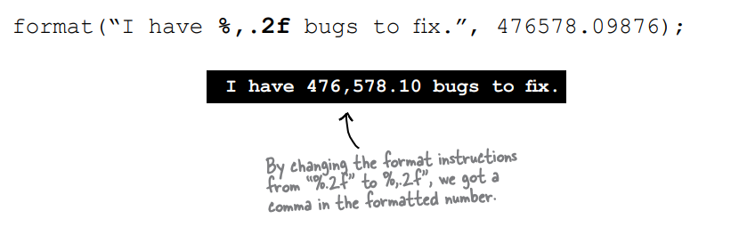

# Numbers and Statics

Sayılarla çalışmak, sadece primitive aritmetik işlemler yapmaktan daha fazlasını gerektirebilir. Bir sayının mutlak
değerini
almak isteyebilirsiniz veya bir sayıyı yuvarlamak veya iki sayıdan büyük olanını bulmak isteyebilirsiniz. Sayılarınızın
tam olarak iki ondalık basamağıyla yazdırılmasını isteyebilir veya büyük sayılarınıza virgül eklemek suretiyle
okunmalarını kolaylaştırmak isteyebilirsiniz.

Peki ya tarihlerle çalışmak? Tarihleri çeşitli şekillerde yazdırmak isteyebilir veya tarihleri manipüle ederek "bugünkü
tarihe üç hafta ekle" gibi ifadeler oluşturmak isteyebilirsiniz. Bir String'i bir sayıya dönüştürme veya bir sayıyı bir
String'e dönüştürme gibi durumlar da söz konusu olabilir. İyi haber şu ki, Java API'si, hazır ve kolayca kullanılabilir
birçok faydalı sayı işlem methodları ile doludur.

Ancak çoğu statik (static) olduğu için, önce bir variable'in veya methodun statik olmasının ne anlama geldiğini ve
Java'daki sabitlerden (constants) olan statik final variable'lari öğrenmeye başlayacağız.

### MATH methods: as close as you’ll ever get to a global method

Java'da global olarak herhangi bir şey yoktur. Ancak şunu düşünün: Eğer behavior'u bir instance variable değerine
bağlı olmayan bir metoda sahipseniz ne olur? Örneğin Math sınıfındaki round() metodunu ele alalım. Bu metod her
seferinde aynı işlemi yapar - verilen ondalık sayıyı (metoda geçirilen argüman) en yakın tam sayıya yuvarlar.
Her seferinde. Eğer Math sınıfının 10.000 örneğine sahip olsaydınız ve round(42.2) metodunu çalıştırsaydınız, her zaman
42 tam sayı değerini elde ederdiniz. Başka bir deyişle, metodun davranışı argümana bağlıdır, ancak bir instance variable
state'i tarafından etkilenmez. round() metodunu nasıl çalıştırdığını değiştiren tek değer, metoda geçirilen argümandır!

Evet, doğru düşünüyorsunuz. Math sınıfının instance'ini oluşturmak, sadece round() gibi bir metodun çalıştırılması için
mükemmel bir bellek alanının boşa harcanması gibi görünebilir. Aynı şekilde, min() gibi diğer Math metodları da iki
sayısal veriyi alır ve bunlardan küçük olanını döndürür. Veya max() ve abs() gibi diğer metodlar, instance variable
değerlerini hiç kullanmaz. Aslında Math sınıfının hiçbir instance variable'i yoktur. Bu nedenle, Math sınıfının bir
instance'ını oluşturmak hiçbir fayda sağlamaz ve hatta yapmanız bile mümkün değildir.

### If you try to make an instance of class Math:

```Math mathObject = new Math();``` bunu yaptığınız da direk hata alırsınız.Çünkü math constructor'ı private'dir. Yani
hiçbir zaman instance'i oluşturulamaz

Math sınıfındaki metodlar herhangi bir instance variable değerine bağlı değildir ve bu metotlar 'static' olarak
tanımlanmıştır. 'Static' olmaları, Math sınıfının bir instance'ını oluşturmanıza gerek olmadığı anlamına gelir.
Sadece Math sınıfına ihtiyacınız vardır.


Math sınıfındaki (örneğin round(), min(), max(), abs() gibi) bu metotlar hiçbir instance variable'ini kullanmazlar. Bu
nedenle, behavior'ları belirli bir nesne hakkında bilgi sahibi olmayı gerektirmez. Bu metotlar durumsuz (stateless) veya
static metotlardır, yani işlevsellikleri sadece kendilerine geçirilen argümanlara bağlıdır.

### The difference between regular (non-static) and static methods

Java nesne yönelimli bir dildir, ancak ara sıra özel durumlar olabilir. Genellikle utility methodlar (örneğin Math
methodları gibi) gibi durumlarda, sınıfın bir instance'ına ihtiyaç duyulmaz. "static" anahtar kelimesi, bir methodun
sınıfın bir instance'i olmadan çalışmasına izin verir. Bir statik method, "bir instance'a bağımlı olmayan behavior"
anlamına gelir, bu nedenle bir instance/object gerekli değildir. Sadece sınıf yeterlidir.

### regular (non-static) method

```
public class Song {
    String title;

    public Song(String title){
        this.title = title;
    }

    public void play(){
        SoundPlayer soundPlayer = new SoundPlayer();
        // "Title" instance variable'inin mevcut değeri, play() methodu çağrıldığında çalan şarkıdır.
        soundPlayer.playSound(title);
    }
}
```


### static method

 

### What it means to have a class with static methods.

Sıklıkla (her zaman değilse de), static methodlara sahip bir sınıfın instantiated edilmesi amaçlanmamıştır. 8. bölümde
abstract sınıflardan bahsettik ve bir sınıfa abstract belirteci eklemek, o sınıf türünde 'new' denilmesini imkansız hale
getirir demiştik. Başka bir deyişle, abstract bir sınıfı instantiate etmek mümkün değildir.

Ancak, diğer kodların abstract olmayan bir sınıfı örneklemesini engelleyebilirsiniz, constructor'ı private olarak
işaretleyerek. Unutmayın, private olarak işaretlenmiş bir method, yalnızca sınıf içinden kodun methodu çağırabileceği
anlamına gelir. Constructor'ı private olarak işaretlemek de primitive olarak aynı şeyi ifade eder - sadece sınıf içinden
kod, constructor'ı çağırabilir. Dışarıdan kimse 'new' diyemez. Örneğin Math sınıfında olduğu gibi böyle çalışır.
Constructor private olarak işaretlenir ve Math'ın yeni bir örneğini oluşturamazsınız. Derleyici, kodunuzun o private
constructor'a erişimi olmadığını bilir.

Bu, bir veya daha fazla statik methoda sahip bir sınıfın hiçbir zaman örneklenmemesi gerektiği anlamına gelmez. Aslında,
main() methodu eklediğiniz her sınıf, içinde bir statik methoda sahip bir sınıftır!

Genellikle main() methodunu, başka bir sınıfı başlatmak veya test etmek için kullanırsınız ve bunu genellikle main
içinde bir sınıf örnekleyerek ve ardından bu yeni örnek üzerinde bir method çağırarak yaparsınız.

Bu nedenle, bir sınıfta statik ve statik olmayan methodları bir arada kullanmakta özgürsünüz, ancak tek bir statik
olmayan method bile varsa, sınıfın bir örneğinin oluşturulabileceği bir yol olmalıdır. Yeni bir nesne almanın tek
yolları 'new' kullanmak veya deserialization (veya Java Reflection API olarak adlandırılan başka bir şey, ancak bu
konuya şu an için girmeyeceğiz) kullanmaktır. Başka bir yol yok. Ancak tam olarak kimin 'new' diyebileceği ilginç bir
soru olabilir ve bu soruyu bu bölümde biraz daha sonra ele alacağız.

### Static methods can’t use non-static (instance) variables!

Statik metotlar, kendi sınıfının herhangi bir belirli örneğini bilmeden çalışır. Ayrıca önceki sayfalarda gördüğünüz
gibi, o sınıfın hiçbir örneği bile olmayabilir. Bir statik metot, bir örnek referansı (t2.play()) yerine sınıfı (
Math.random()) kullanılarak çağrıldığı için, sınıfın herhangi bir instance variables'ina referans gösteremez. Statik
metot, hangi instance variables'inin değerini kullanacağını bilmez.

```
public class Duck {
    private int size;

    public static void main(String[] args) {
        System.out.println("Size of duck is : " + size); // burada ki size instance variable'i hata verecektir
    }

    public void setSize(int size){
        this.size = size;
    }

    public int getSize(){
        return this.size;
    }
}
```

Eğer bir statik metot içerisinde bir instance variable'i kullanmaya çalışırsanız, derleyici "Hangi nesnenin instance
variable'i hakkında konuştuğunuzu bilmiyorum!" şeklinde düşünür. Eğer on adet Duck nesnesi heap'te bulunuyorsa, bir
statik metot bu nesnelerin hiçbirinden haberdar değildir.

### Static methods can’t use non-static methods, either!

Statik olmayan (non-static) metotlar ne yapar? Genellikle metodun behavior'unu etkilemek için instance variable'in
durumunu kullanır. Bir getName() metodu, name Variableinin değerini döndürür. Hangi isim? getName() metodunu çağıran
nesnenin ismi.

```
public class Duck {
    private int size;

    public static void main(String[] args) {
        // getSize() metodunu çağırmak sadece kaçınılmazı ertelemek anlamına gelir - getSize() metodu "size"
        // instance variable'ini kullanır. Gene compiler error verir
        System.out.println("Size of duck is : " + getSize());
    }

    public void setSize(int size){
        this.size = size;
    }

    public int getSize(){
        return this.size;
    }
}
```

Static'ler instance variable'in state'ini GOREMEZLER

Derleyici, bir statik olmayan methodda instance variables'ları kullanıp kullanmamanıza bakmaksızın buna izin verir. Ve
sonuçlarını düşünün... böyle bir senaryoyu derlemenize izin verildiğinde, gelecekte o statik olmayan methodun
implementasyonunu değiştirmek isterseniz ve bir gün instance variable'i kullanmasını isterseniz ne olur? Veya daha da
kötüsü, alt sınıf methodu override ederse ve override edilen sürümde bir instance variable'i kullanırsa ne olur?

Java'da, genellikle kaçınılması gereken ancak yine de mümkün olan statik bir methodu sınıf adı yerine bir referans
Variablei kullanarak çağırmak mümkün müdür?

Annenizin bilgece dediği gibi, "Yasal olması iyi olduğu anlamına gelmez." Bir sınıfın örneğini kullanarak statik bir
methodu çağırmak işe yarayabilir, ancak bu yanıltıcı ve okunması zor bir kod oluşturur. Bu, statik methodların nasıl
çağrılması gerektiğiyle ilgili doğal beklentinin aksine ve diğer geliştiricilerin kodu okurken kafa karışıklığına neden
olabilir.

```
Duck d = new Duck();
String[] s = {};
d.main(s);
```

Bu kod yasaldır, ancak derleyici sadece gerçek sınıfa geri dönerek ("Tamam, d Duck türünde ve main() statik, bu yüzden
sınıf Duck içindeki statik main() methodunu çağıracağım.") çözümler. Başka bir deyişle, d'yi main() methodunu çağırmak
için kullanmak, main() methodunun d'nin referansını kullanan nesne hakkında özel bir bilgiye sahip olacağı anlamına
gelmez. Bu, sadece bir statik methodu çağırmak için alternatif bir yol olup, method hala statiktir!

### Static variable: value is the same for ALL instances of the class

Hayal etmek istediğiniz şey, programınız çalışırken kaç tane "Duck" örneği oluşturulduğunu saymaktır. Bunu yapmak
için, constructor'da artıracağınız bir instance variable kullanabilirsiniz.

```
public class Duck {
   int duckCount = 0;

   public Duck(){
       duckCount++;
   }
}
```

Hayır, bu işe yaramaz çünkü duckCount bir instance variable'idir ve her Duck için 0'dan başlar. Başka bir sınıfta bir
method çağırmayı deneyebilirsiniz, ama bu pek hoş olmayan bir çözüm olur. İhtiyacınız olan, yalnızca bir kopyası olan
bir variable olan bir sınıftır ve tüm instance'lar o bir kopyayı paylaşır.

Bunu size statik bir variable sağlar: Bir sınıfın tüm instance'ları tarafından paylaşılan bir değer. Başka bir deyişle,
bir sınıf başına bir değer, bir instance başına bir değil.

```
public class Duck {
    // statik duckCount variable'i sadece sınıf ilk yüklendiğinde başlatılır, her yeni instance oluşturulduğunda değil.
    private static int duckCount = 0;

    public Duck() {
        // Şimdi Duck constructor'ı çalıştığı her seferinde artmaya devam edecek, çünkü duckCount statik bir Variable
        // ve 0'a sıfırlanmayacak.
        duckCount++;
    }
}
```


* Statik variable'lar paylaşılır.
* Aynı sınıfın tüm instance'ları, statik variable'larin tek bir kopyasını paylaşır.
* Instance variables : Bir instance başına 1 tane
* Statik variables : Bir sınıf başına 1 tane.

Bu bölümde daha önce gördüğümüz gibi, private bir constructor sınıfın dışındaki kod tarafından örneklenememesi anlamına
gelir. Yani, yalnızca sınıfın içinden kod, bir sınıfın instance'ini oluşturabilir.

Peki ya yalnızca BİR instance oluşturulmasını sağlayacak ve sınıfın bir instance'ini kullanmak isteyen herkesin daima
o tek bir instance'i kullanmasını istediğiniz bir sınıf yazmak isterseniz ne yaparsınız?

Bu durumda, Singleton tasarım desenini kullanabilirsiniz. Singleton deseni, yalnızca bir örneği olan bir sınıf
oluşturmanıza izin verir ve bu örneğe her zaman aynı referans üzerinden ulaşılmasını garanti eder.

### Initializing a static variable

Statik variable'lar bir sınıf yüklendiğinde başlatılır. Bir sınıfın yüklenmesi, JVM'nin bunun zamanının geldiğine karar
vermesi sonucunda olur. Genellikle JVM, bir sınıfın yüklenmesine neden olan olay, sınıfın yeni bir instance'i ilk kez
oluşturulmaya çalışıldığında veya sınıfın statik bir methodu veya variable'i kullanılmak istendiğinde gerçekleşir.
Programcı olarak, JVM'ye bir sınıfın yüklenmesini söyleme seçeneğine sahip olsanız da, bunu yapmanıza genellikle
ihtiyacınız olmaz. Hemen hemen tüm durumlarda, JVM'nin sınıfın yüklenme zamanını kendisinin belirlemesine izin vermek
daha iyidir.

Evet, statik initialization hakkında iki garanti vardır:

* Bir sınıfın statik variable'ları, o sınıfın herhangi bir nesnesi oluşturulmadan önce başlatılır.
* Bir sınıfın statik variable'ları, sınıfın herhangi bir statik methodu çalıştırılmadan önce başlatılır.

```
public class Player {
    /* playerCount, sınıf yüklendiğinde başlatılır. Onu açıkça 0 olarak başlattık, ancak int veri türleri için 0,
    varsayılan değerdir. Statik variables'ları, instance variable'ları gibi varsayılan değerleri alır.*/
    static int playerCount = 0;
    private String name;
    public Player(String name){
        this.name = name;
        playerCount++;
    }
}
```

```
public class PlayerTestDrive {
    public static void main(String[] args) {
        //playerCount burada 0 olarak gelir cunku Player nesnesinin instance'i create edilmedi.
        // Constructor call yapilmadi
        System.out.println(Player.playerCount);
        Player player = new Player("Tiger");
        /* Player'a ait instance create edildi ve playerCount constructor içerisinde 1 artırıldı */
        System.out.println(Player.playerCount);
    }
}
```

Bir sınıf yüklendiğinde, statik variable'lar başlatılır. Bir statik variable'i (onu tanımlarken) açıkça başlatmazsanız (
bir değer atayarak), varsayılan bir değer alır. Örneğin, int variable'lari varsayılan olarak sıfıra (0) başlatılır, bu
nedenle "playerCount = 0" dememize gerek kalmaz. Bir statik variable'i bildirirken, ancak başlatmazsanız, bu statik
variable belirli bir variable türü için varsayılan değeri alır ve tamamen aynı şekilde instance variable'lar da
bildirildiğinde varsayılan değer alır.

**Sınıftaki tüm statik variable'lar, o sınıftan herhangi bir nesne oluşturulmadan önce başlatılır.**

### static final variables are constants

Bir variable'in "final" olarak işaretlenmesi, bir kez başlatıldığında artık değiştirilemeyeceği anlamına gelir. Başka
bir deyişle, statik final variable'in değeri, sınıf yüklendiği sürece değişmeyecektir. Math.PI'yi API'de araştırırsanız,
şunu bulacaksınız:

```public static fnal double PI = 3.141592653589793;```

Variable, herhangi bir kodun ona erişebilmesi için "public" olarak işaretlenmiştir.

Variable, sınıf Math'in bir örneğine ihtiyaç duymamanız için "static" olarak işaretlenmiştir (unutmayın ki, sınıf
Math'in örneği oluşturulamaz).

Variable, Java için PI'nin değişmediği düşünüldüğünde "final" olarak işaretlenmiştir.

Variable'i bir constant olarak tanımlamanın başka bir yolu yoktur, ancak bir constant Variable'i tanımanıza yardımcı
olacak bir isimlendirme kuralı vardır. Constant Variable isimleri'nin tüm harfleri büyük olmalıdır!

Bir static initializer, bir sınıf yüklendiğinde diğer herhangi bir kodun sınıfı kullanmadan önce çalışan kod bloğudur.
Bu nedenle, static final bir Variable'i başlatmak için harika bir yerdir.

```
public class Foo {
    final static int x;

    static{
        x = 11;
    }
}
```

### Initialize a final static variable:

1 - Declare ettiğiniz anda:

```
public class Foo {
    public static final int FOO_X = 25;
}
```

2 - Static Initializer içerisinde

```
public class Bar {
    public static final double BAR_SIGN;

    static {
        BAR_SIGN = Math.random();
    }
}
```

### final isn’t just for static variables...

"final" anahtar kelimesini statik olmayan Variable'ları değiştirmek için de kullanabilirsiniz, bunlar arasında instance
Variable'lar, Local Variableler ve hatta metod parametreleri bulunur. Her durumda, aynı anlamı taşır: değeri
değiştirilemez. Ancak aynı zamanda final, birinin bir methodu override etmesinden veya alt sınıf yapmasını engellemek
için de kullanabilir.

**non static final variables**

```
public class Foof {
    final int size = 3; // size variable'ini değiştiremezsiniz
    final int whuffie;

    public Foof(){
        whuffie = 42; // whuffie variable'ini değiştiremezsiniz
    }

    void doStuff(final int x){
        // gelen x değerini değiştiremezsiniz
    }

    void doMore(){
        final int z = 7; // z variable'ini değiştiremezsiniz
    }
}
```

**final method**

```
public class Poof {
    final void calcWhuffie(){
        // asla override edilmesi gerekmeyen
    }
}
```

**final class**

```
public final class MyMostPerfectClass {
    // extend edilemez
}
```

* "Final" bir Variable, değerini değiştiremeyeceğiniz anlamına gelir.
* "Final" bir metot, metodu override edemeyeceğiniz anlamına gelir.
* "Final" bir sınıf, sınıfı extends edemeyeceğiniz anlamına gelir (yani alt sınıf yapamazsınız).

Question : Statik bir method bir statik olmayan variable'a erişemez. Ancak statik olmayan bir method statik bir
Variable'a erişir mi?

Answer : Tabii ki. Bir sınıftaki statik olmayan bir metod her zaman sınıftaki bir statik metodu çağırabilir veya sınıfın
bir statik Variable'ina erişebilir.

Question : Neden final bir sınıf yapmak isteyeyim ki? Bu OO'nun tüm amacını bozmaz mı?

Answer : Evet ve hayır. Bir sınıfı "final" yapmanın tipik bir nedeni güvenliktir. Örneğin, String sınıfından alt sınıf
yapamazsınız. String sınıfını extend edip kendi String alt sınıf nesnelerinizi çok biçimlilik (polymorphism) kullanarak
String nesneleri yerine yerleştiren birinin yol açabileceği kaosa hayal edin. Bir sınıfın methodlarının belirli bir
implementasyonuna güvenmeniz gerekiyorsa, sınıfı final yapın.

Question : Sınıf final ise, methodlar da final midir?

Eğer sınıf "final" olarak işaretlendiyse, metodları "final" olarak işaretlemeye ihtiyacınız yoktur. Düşünün ki eğer bir
sınıf "final" ise hiçbir zaman alt sınıf yapılabilir değildir, bu yüzden hiçbir metot asla override edilmez.

Öte yandan, sınıfınızı başkalarının extend etmesine izin vermek ve onların belirli metotları, ancak tümünü değil,
override etmesine izin vermek istiyorsanız, sınıfı "final" olarak işaretlemezsiniz; bunun yerine belirli metotları
seçerek "final" olarak işaretlersiniz. "Final" bir metot, alt sınıfın o belirli metodu override edemeyeceği anlamına
gelir.

**BULLET POINTS**

* Bir statik metot, bir nesne referans Variable'i yerine sınıf adı kullanılarak çağrılmalıdır: Math.random() vs.
  myFoo.go()
* Bir statik metot, o metotun sınıfına ait herhangi bir instance olmadan heap'te oluşturulmadan çağrılabilir.
* Bir statik metot, belirli bir instance variable'inin değerine bağlı olmayan yardımcı bir metot için iyidir ve hiçbir
  zaman belirli bir instance variable'ina bağımlı olmayacaktır.
* Bir statik metot, yalnızca sınıfla ilişkilidir, belirli bir instance ile ilişkili değildir, bu nedenle kendi sınıfının
  herhangi bir instance variable'ina erişemez. Hangi instance'in değerlerini kullanacağını bilemez.
* Bir statik metot, genellikle instance variable durumuyla ilişkilendirilen non-statik bir metoda erişemez.
* Yalnızca statik metotlara sahip bir sınıfa sahipseniz ve sınıfın instantiate edilmesini istemiyorsanız, constructor'ı
  private olarak işaretleyebilirsiniz.
* Bir statik variable, belirli bir sınıfın tüm üyeleri tarafından paylaşılan bir variable'dir. Bir sınıfta sadece bir
  kopya bulunur ve her bir instance variable'i için ayrı bir kopya yerine gelir.
* Bir statik metot, bir statik variable'a erişebilir.
* Java'da bir constant oluşturmak için bir variable'i hem static hem de final olarak işaretleyin.
* Bir final static variable, bildirildiği anda veya statik bir initializer'da bir değerle atanmalıdır.
* Constant'ların (final static variable'ların) isimlendirme kuralı, ismi tamamen büyük harflerle yazmaktır.
* Final bir variable'in değeri bir kez atanıldıktan sonra değiştirilemez.
* Bir final instance variable'ına değer atama işlemi, variable'in bildirildiği anda veya constructor içinde
  yapılmalıdır.

### MATH Methods

Şimdi statik metodların nasıl çalıştığını bildiğimize göre, Math sınıfındaki bazı statik metotlara bakalım. Bunlar hepsi
değil, sadece önemli olanlar. Geri kalanlar için API'nizi kontrol edebilirsiniz. Bunlar arasında sqrt() (karekök),
tan(), ceil() (yukarı yuvarlama), floor() (aşağı yuvarlama) ve asin() (arkus sinüs) bulunur.

**Math random()**

```
public class MathMethods {
    public static void main(String[] args) {
        double r1 = Math.random();
        int r2 = (int) (Math.random() * 5);

        System.out.println(r1); // 0 ile 1 aralığında bir değer dönecek
        System.out.println(r2); // 0 ile 4 aralığında bir değer dönecek
    }
}
```

**Math.abs()**

Bu metod, argümanın mutlak değerini içeren bir double değerini döndürür. Bu metod overloaded bir methoddur, bu nedenle
ona bir int verirseniz int değer döndürür; double verirseniz double değer döndürür.

```
public class MathMethods {
    public static void main(String[] args) {
        int x = Math.abs(-240);
        double d = Math.abs(240.45);

        System.out.println(x); // 240 çıktısı alınır
        System.out.println(d); // 240.45 çıktısı alınır
    }
}
```

Bir gerçek sayının sayı doğrusundaki yerinin başlangıç noktasına (sıfıra) olan uzaklığına o sayının mutlak değeri denir.

**Math.round()**

Bu metod, argüman bir float ise int, argüman bir double ise long türünde, en yakın tam sayı değerine yuvarlanmış olarak
döndürür.

```
public class MathMethods {
    public static void main(String[] args) {
        int x = Math.round(-28.6f); // -29 döner
        int y = Math.round(26.45f); // 26 döner

        System.out.println(x);
        System.out.println(y);
    }
}
```

**Math.min()**

Bu metod, iki argüman arasındaki minimum değeri döndürür. Metot overload edilmiştir, bu nedenle int, long, float veya
double türünde argümanlar alabilir.

```
public class MathMethods {
    public static void main(String[] args) {
        int x = Math.min(24, 12); // 12 döner
        double y = Math.min(214.5, 318.7); // 214.5 döner
    }
}
```

**Math.max()**

Bu metod, iki argüman arasındaki maksimum değeri döndürür. Metot overload edilmiştir, bu nedenle int, long, float veya
double türünde argümanları kabul edebilir.

```
public class MathMethods {
    public static void main(String[] args) {
        int x = Math.max(24, 12); // 24 döner
        double y = Math.max(214.5, 318.7); // 318.7 döner
    }
}
```

### Wrapping a primitive

Bazı durumlarda bir primitive türü bir nesne gibi işlemek isteyebilirsiniz. Örneğin, Java'nın 5.0 sürümünden önceki tüm
sürümlerinde, bir primitive türü doğrudan ArrayList veya HashMap gibi bir koleksiyona koyamazdınız:

```
public class MathMethods {
    public static void main(String[] args) {
        int x = 25;
        ArrayList list = new ArrayList();
        list.add(x); // Java 5.0 dan önceki sürümlerinde çalışmazdı
    }
}
```

Her primitive tür için bir wrapper (wrapper) sınıfı bulunmaktadır ve wrapper sınıfların java.lang paketinde
olduğundan dolayı onları içe aktarmanıza gerek yoktur. Wrapper sınıfları tanımanız için, her biri wrap ettiği primitive
türün adından türetilmiştir, ancak sınıf adlandırma kuralını takip etmek için ilk harfi büyük harfle yazılır.

Ancak, neden tam olarak API tasarımcıları tarafından primitive tür adlarından sınıf adlarına tam eşlemeler yapılmadığına
dair herhangi bir kesin bilgiye sahip olmayan bir nedenle, wrapper sınıfların adlandırılmasında ilginç bir şekilde
farklılık vardır. Bu durumu göreceksiniz:

```
Boolean
Character
Byte
Short
Integer
Long
Float
Double
```

**Wrapping a value;**

```
public class MathMethods {
    public static void main(String[] args) {
        int i = 288;
        Integer iWrap = new Integer(i); // Integer(i) deprecate edilmiştir yerine Integer.valueOf() kullanılır
    }
}
```

**Unwrapping a value;**

```int unWrapped = iWrap.intValue();```

Bir primitive türü nesne gibi kullanmanız gerektiğinde, onu wrapper sınıf ile wrap edin. Eğer Java'nın 5.0 sürümünden
önceki herhangi bir sürümünü kullanıyorsanız, ArrayList veya HashMap gibi koleksiyonlara bir primitive tür değerini
depolamanız gerektiğinde bunu yapmanız gerekir.


bu durum can sıkıcı olabilir. Evet, Java'nın 5.0 sürümünden önceki sürümlerde, bir ArrayList of ints oluşturamazsınız.
Her bir int değerini yeni bir Integer nesnesiyle wrap etmeniz ve ArrayList içindeki değere erişmeye çalışırken geri
dönüştürmeniz (unbox) gerekmektedir. Bu işlem kutulama (boxing) olarak adlandırılır.

### Before Java 5.0, YOU had to do the work...

Java 5.0 öncesi tüm sürümlerde, primitive türler primitive türlerdi ve nesne referansları nesne referanslarıydı ve asla
birbirleriyle değiştirilemezdi. Wrap ve unwrap işlemleri tamamen size, programcıya, düşerdi. Bir primitive türü, bir
nesne referansı bekleyen bir metoda geçmenin veya bir metottan dönen bir nesne referansını doğrudan bir primitive
variablee atamanın bir yolu yoktu - hatta dönen referans bir Integer'a ait olsa ve primitive variable bir int olsa bile.
Integer ve int arasında sadece Integer'ın içinde wrap ettiği primitive türü (int) tutan bir instance variables'in olduğu
gerçeği dışında bir ilişki yoktu. Tüm işlem tamamen size aitti.

**An ArrayList of primitive ints - Without autoboxing (Java versions before 5.0)**

```
ArrayList listOfNumbers = new ArrayList();
listOfNumbers.add(new Integer(5));
Integer one = (Integer) listOfNumbers.get(0);
int intOne = one.intValue();
```

Java 5.0'dan onceki version'larda yazım şekli yukarıda ki gibiydi

### An ArrayList of primitive ints - With autoboxing (Java versions 5.0 or greater)

```
ArrayList<Integer> listOfNumbers = new ArrayList<>();
listOfNumbers.add(3);
int num = listOfNumbers.get(0);
```

Evet, ArrayList sınıfında add(int) metodu bulunmamakla birlikte, derleyici tüm boxing işlemlerini sizin için
yapar. Başka bir deyişle, ArrayList içinde gerçekten bir Integer nesnesi depolanır, ancak siz "hakikiymiş gibi"
ArrayList'in int değerlerini kabul ettiğini düşünebilirsiniz. (ArrayList<Integer> ile hem int hem de Integer değerlerini
ekleyebilirsiniz.)

Java 5.0 ve sonraki sürümlerde, derleyici otomatik olarak açma (unboxing) işlemlerini de gerçekleştirir. Bu sayede, bir
Integer nesnesinin içindeki primitive değeri doğrudan bir primitive variablee atayabilirsiniz
``ìnt num = listOfNumbers.get(0)`` ve Integer nesnesinin intValue() methodunu çağırmak zorunda kalmazsınız.

Question : Eğer int'leri tutmak istiyorsanız neden ``ÀrrayList<int>`` olarak declare etmiyorsunuz?

Answer :  Java'da, generic türler (örneğin ArrayList) primitive türleri doğrudan tür parametreleri olarak kullanamazlar.
Sadece sınıf veya arayüz türlerini belirtebilirsiniz. Örneğin, ArrayList<Integer> geçerlidir çünkü Integer bir sınıftır.
Ancak, dediğiniz gibi, Java 5.0 uyumlu bir derleyici kullandığınızda, otomatik sarmalama (autoboxing) özelliği sayesinde
gerçekten de ArrayList<Integer> gibi liste türlerine int primitive türlerini eklemek mümkün olur. Aslında, otomatik
sarmalama sayesinde, boolean primitive türlerini ArrayList<Boolean> içine, char primitive türlerini ise
ArrayList<Character> içine eklemek gibi ilginç kullanımlar da mümkün olur.

### Autoboxing works almost everywhere

Autoboxing, sadece primitive veri türlerini bir koleksiyonda kullanmak için açık bir şekilde wrapping ve unwrapping
yapmanıza izin vermekle kalmaz, aynı zamanda primitive veri türünü veya wrapper type'ını birbirinin yerine neredeyse
herhangi bir yerde kullanmanıza da izin verir.

**Method Arguments**

Eğer bir method wrapper bir tür alıyorsa, eşleşen türdeki bir wrapper'a veya primitive veri türünden bir örneğe
referans geçirebilirsiniz. Ve elbette tam tersi de geçerlidir; eğer bir method primitive bir tür alıyorsa, uyumlu bir
primitive türden bir örneği veya o primitive türün wrapper'ına referans geçirebilirsiniz.


**Return values**

Bir method primitive bir dönüş türü belirtiyorsa, uyumlu bir primitive veri türünden bir değer veya o primitive türün
wrapper'ına referans döndürebilirsiniz. Ve eğer bir method wrapper bir dönüş türü belirtiyorsa, o wrapper
türüne referans döndürebilir veya uyumlu bir primitive veri türünden bir değer döndürebilirsiniz. Autoboxing ve unboxing
sayesinde Java'da primitive veri türlerini ve onların wrapper sınıflarını daha rahat ve esnek bir şekilde kullanmak
mümkün olur.


Boolean değerinin beklenildiği herhangi bir yerde, hem bir boolean döndüren bir ifade (4 ! 2 gibi), hem de bir primitive
boolean, ya da bir boolean wrapper'ini referans kullanabilirsiniz.


**Operations on numbers**

Bu en tuhaf olanıdır; evet, artık bir wrapper türü, primitive türün beklendiği işlemlerde bir operand olarak
kullanılabilir. Bu, örneğin bir Integer nesnesine referans üzerinde artırma operatörü uygulayabileceğiniz anlamına
gelir! Ancak endişelenmeyin, bu sadece bir derleyici hilesidir. Dil, operatörlerin nesnelerde çalışmasını sağlamak için
değiştirilmedi; derleyici, işlem öncesinde nesneyi primitive veri türüne dönüştürür.

```
public static void main(String[] args) {
    Integer i = 42;
    i++;
    System.out.println(i); // çıktı olarak 43 yazdırır
    Integer j = 5;
    Integer k = j + 3;
    System.out.println(k); // çıktı olarak 8 yazdırır
}
```


**Assigments**

Bir eşleşen wrapper veya primitive veri türü için tanımlanan bir variable'a hem bir wrapper hem de bir primitive veri
türünü atayabilirsiniz. Örneğin, bir primitive int variable'i bir Integer referans variable'ina atanabilir ve aynı
şekilde, bir Integer nesnesine referans bir variable'i int olarak tanımlanan bir variable içine atanabilir.


**Example;**

```
public class MathMethods {
    Integer i;
    int j;

    public static void main(String[] args) {
        MathMethods mathMethods = new MathMethods();
        mathMethods.go();
    }

    public void go(){
        j = i;
        System.out.println(i);
        System.out.println(j);
    }
}
```

Yukarı da yazmış olduğum kod hata verecektir. Java'da, sınıf seviyesinde tanımlanan bir wrapper sınıfının default değeri
null olur. Bunun nedeni, sınıf seviyesinde tanımlanan referans türlerinin, ilgili sınıfların nesnelerini başlatmadan
doğrudan null değeri ile otomatik olarak başlatılmasıdır.

### But wait! There’s more! Wrappers have static utility methods too!

Normal bir sınıf gibi davranmanın yanı sıra, bu wrapper'lar gerçekten kullanışlı bir dizi statik yönteme
sahiptir. Daha önce bu kitapta bir tanesini kullandık - Integer.parseInt(). Dönüştürme yöntemleri bir String alır ve
size bir primitive değer verir.

**Converting a String to a primitive value is easy:**

```
public static void main(String[] args) {
    String s = "2";
    int x = Integer.parseInt(s);

    String m = "420.24";
    double d = Double.parseDouble(m);

    // parseBoolean() methodu, String argümanındaki karakterlerin durumunu (büyük harf veya küçük harf)
    // görmezden gelir.
    boolean b = Boolean.parseBoolean("True");
}
```

### And now in reverse... turning a primitive number into a String

Bir sayıyı String'e dönüştürmek için birkaç yol vardır. En kolayı, sayıyı mevcut bir String'e basitçe eklemektir.

```
public static void main(String[] args) {
    double d = 42.5;
    String doubleString = "" + d;
    System.out.println(doubleString);
}
```

```
public static void main(String[] args) {
    double d = 42.5;
    String doubleString = Double.toString(d);
    System.out.println(doubleString);
}
```

Java'da '+' operatörü overloaded edilmiştir ve String birleştirici olarak çalışır. Bir String'e eklenen herhangi bir şey
String'e dönüştürülür. Bu nedenle, bir sayıyı veya herhangi bir nesneyi bir String ile birleştirirseniz, otomatik olarak
String'e dönüştürülerek sonuç String olur. ```String doubleString = "" + d;```

### Number formatting

Java'da, sayıları ve tarihleri biçimlendirme işlemleri I/O işlemleriyle bağlantılı olmak zorunda değildir.
Düşünün, kullanıcılara sayıları göstermenin en yaygın yollarından biri GUI (Grafiksel Kullanıcı Arayüzü) kullanmaktır.
String'leri scroll edebilir bir metin alanına veya belki bir tabloya yerleştirirsiniz. Eğer biçimlendirme işlemleri
sadece yazdırma ifadelerine gömülseydi, sayıları GUI'de güzel bir String'e biçimlendirmek mümkün olmazdı. Java 5.0'dan
önce, çoğu biçimlendirme işlemi java.text paketindeki sınıflar aracılığıyla gerçekleştiriliyordu, ancak şu anki kitabın
bu sürümünde onları bile incelemeyeceğiz, çünkü şimdi durumlar değişti.

Java 5.0'da, Java ekibi java.util içinde Formatter sınıfı aracılığıyla daha güçlü ve esnek biçimlendirme özelliği
ekledi. Ancak, Formatter sınıfında kendiniz methodlar oluşturmanıza ve çağırmanıza gerek yoktur, çünkü Java 5.0, bazı
I/O sınıflarına (printf() dahil) ve String sınıfına kolaylık sağlayan methodlar ekledi. Bu nedenle, biçimlendirilmesini
istediğiniz nesneyi ve biçimlendirme talimatlarını belirterek basitçe statik String.format() methodunu çağırmanız
yeterlidir.

Tabii ki, biçimlendirme talimatlarını nasıl sağlayacağınızı bilmek zorundasınız ve bu, C/C++'daki printf() fonksiyonunu
bilmiyorsanız biraz çaba gerektirebilir. Neyse ki, printf() fonksiyonunu bilmiyor olsanız bile, bu bölümde gösterdiğimiz
en temel şeyler için sadece tarifleri takip edebilirsiniz. Ancak istediğiniz herhangi bir şeyi elde etmek için farklı
biçimlendirmeleri karıştırmak istiyorsanız, biçimlendirmeyi öğrenmek isteyeceksiniz.

Burada temel bir örnek ile başlayacak ve nasıl çalıştığına bakacağız. (Not: Biçimlendirmeyi I/O bölümünde tekrar ele
alacağız.)

**Formatting a number to use commas**

```
public class TestFormats {
    public static void main(String[] args) {
        String s = String.format("%,d",100000000);
        System.out.println(s);
    }
}
```

Bu durumda ikinci argümanı (bir integer değeri) nasıl biçimlendireceğinize dair talimatlar, String.format methodunun ilk
parametresinde ```"%,d"``` belirtilir. Buradaki methodun iki argümanı vardır, ilk virgül String ifadesinin içindedir,
bu nedenle methodun argümanlarını ayırmaz."

### Formatting deconstructed...

En temel düzeyde, biçimlendirme iki ana bölümden oluşur (daha fazlası olsa da, daha anlaşılır tutmak için bununla
başlayacağız):

1 - Special format specifiers kullanırsınız, bu belirleyiciler argümanın nasıl formatlanacağını tanımlar.

2 - Birden fazla argüman olabilir, ancak şimdilik sadece bir argümanla başlayacağız. Argüman türü sadece herhangi bir
şey olamaz... Biçimlendirme talimatlarındaki biçim belirleyicileriyle biçimlendirilebilecek bir şey olmalıdır. Örneğin,
biçimlendirme talimatlarınız kayan noktalı bir sayı belirtiyorsa, bir Dog ya da hatta bir kayan noktalı sayı gibi
görünen bir String geçiremezsiniz.


Bu methodun ikinci argümanını alın ve onu **d**ecimal bir integer olarak biçimlendirin, virgüller ekleyin."

Bir sonraki sayfada "%, d" ifadesinin ne anlama geldiğine daha ayrıntılı bakacağız, ancak başlangıçta, biçimlendirme
String'inde (format() yönteminin her zaman ilk argümanı olan) yüzde işareti (%) gördüğünüz her zaman bunu bir variable'i
temsil eden bir işaret olarak düşünün ve bu variable, methodun diğer argümanıdır. Yüzde işaretinden sonra gelen diğer
karakterler, argüman için biçimlendirme talimatlarını açıklar.

# The percent (%) says, “insert argument here” (and format it using these instructions)

format() yönteminin ilk argümanına "format String" denir ve aslında ekstra biçimlendirme olmadan basılmak istenen
karakterleri içerebilir. Ancak % işaretini gördüğünüzde, yüzde işaretini, diğer argümanı temsil eden bir variable olarak
düşünün.


“%” işareti, biçimlendiriciye (formatter) diğer method argümanını (format() methodunun ikinci argümanı, yani sayı)
buraya eklemesini ve yüzde işaretinden sonra gelen ".2f" karakterlerini kullanarak biçimlendirmesini söyler. Ardından
format String'in geri kalanı olan "bugs to fix" (düzeltilecek hatalar) son çıktıya eklenir.



### The format String uses its own little language syntax

Tabii ki, yüzde işaretinin hemen sonrasına herhangi bir şey koyamazsınız. Yüzde işaretinin sonrasına gelen sözdizimi (
syntax) çok belirli kuralları takip eder ve sonuç (biçimlendirilmiş) String içinde o noktaya eklenecek argümanın nasıl
biçimlendirileceğini açıklar.

Şimdiye kadar 2 örnek gördünüz:

* "%, d" ifadesi, "virgüller ekleyerek ve sayıyı decimal bir integer olarak biçimlendirerek" anlamına gelir.
* "%.2f" ifadesi, "sayıyı virgülden sonra iki ondalık basamağı olan bir float noktalı sayı olarak biçimlendir" anlamına
  gelir.
* "%,.2f" ifadesi, "virgüller ekleyerek ve sayıyı virgülden sonra iki ondalık basamağı olan bir kayan noktalı sayı
  olarak biçimlendir" anlamına gelir.

Asıl soru şu: "İstediğim sonucu elde etmek için yüzde işaretinden sonra ne koymam gerektiğini nasıl bileceğim?" Bu,
sembolleri (örneğin, ondalık için "d" ve kayan noktalı sayılar için "f") ve yüzde işaretinden sonraki talimatların
sırasını bilmeyi de içerir. Örneğin, virgülü "d"nin ardından şöyle yazarsanız: "%d," yerine "%,d" şeklinde yazarsanız,
işe yaramayacaktır! Ya da yararlı olabilir mi?

### The format specifier

Yüzde işaretinden sonraki, "d" veya "f" gibi tür belirleyicisine kadar olan her şey, biçimlendirme talimatlarının bir
parçasıdır. Tür belirleyicisinin ardından, biçimlendirici bir sonraki karakter kümesinin Output String'inin bir parçası
olduğunu varsayar, yani başka bir yüzde işareti (%) ile karşılaşılmadığı sürece veya % işaretiyle başka bir formatlı
argüman variable'i gelmediği sürece. Acaba bu mümkün mü? Birden fazla biçimlendirilmiş argüman variable'ina sahip
olabilir misiniz? Bu düşünceyi şimdilik bir kenara bırakalım; birkaç dakika sonra buna geri döneceğiz. Şimdilik, biçim
belirleyicileri için sözdizimine (syntax) bakalım - yüzde işaretinden sonra gelen ve argümanın nasıl
biçimlendirileceğini açıklayan şeylere.

Bir biçim belirleyici, beş farklı parçaya (yüzde işareti (%) dâhil değil) sahip olabilir. Aşağıdaki köşeli
parantezler [ ] içindeki her şey isteğe bağlıdır, bu nedenle yalnızca yüzde işareti (%) ve tür zorunludur. Ancak sıra da
zorunlu olduğundan, kullandığınız herhangi bir parça bu sıraya göre gitmelidir.


### The only required specifier is for TYPE

Tür (type) zorunlu belirleyicidir ve başka bir şey eklemeyi düşünseniz bile, tür her zaman en sona gelmelidir! Tarihler
ve saatler için ayrı bir setleri olsa da, onlar dışında düzinelerce farklı tür değiştiricisi bulunmaktadır. Ancak çoğu
zaman muhtemelen %d (ondalık tamsayı) veya %f (kayan noktalı sayı) kullanacaksınız. Genellikle %f'i bir hassasiyet
belirleyici ile birleştirerek çıktınızdaki ondalık basamak sayısını ayarlarsınız.

 

 

Biçimlendirme talimatlarında bir türü belirtmek zorundasınız ve tür dışında diğer şeyleri belirtiyorsanız, tür her zaman
en sona gelmelidir. Büyük olasılıkla, sayıları biçimlendirmek için genellikle "d" ile ondalık tamsayı veya "f" ile kayan
noktalı sayı kullanacaksınız.

### What happens if I have more than one argument?

Hayal edin ki şu şekilde görünen bir String'e ihtiyacınız var:
"Rank 20,456,654 / 100,567,890.24."

Ancak sayılar variable'lardan geliyor. Ne yaparsınız? Basitçe, format() methoduna format String'inin (ilk argümanın)
ardından iki argüman daha eklersiniz, bu da format() yöntemine iki yerine üç argümanlı çağrı yapacağınız anlamına gelir.
Ve bu ilk argümanın (format String'inin) içinde iki farklı biçim belirleyici (iki şeyi "% ile başlayan şeyler") olacak.
İlk biçim belirleyici, methodun ikinci argümanını yerine koyacak ve ikinci biçim belirleyici, yöntemin üçüncü argümanını
yerine koyacaktır. Yani, format String içindeki variable yerleştirmeleri, format() methoduna geçirilen diğer
argümanların sırasını kullanır.

```
public class TestFormats {
    public static void main(String[] args) {
        int one = 20456654;
        double two = 100567890.248907;

        String s = String.format("The rank is %,d out of %,2f", one, two);
        System.out.println(s);
    }
}
```


Tarih biçimlendirmeye geldiğimizde, aynı argümana farklı biçim belirleyicileri uygulamak isteyebileceğinizi
göreceksiniz. Muhtemelen, bunu sayı biçimlendirmede yaptığımızdan farklı bir şey olarak düşünmek zor olabilir. Ancak
tarih biçimlendirmenin nasıl çalıştığını görmeden bu konuda hayal etmek zor olabilir. Sadece şu an için, hangi biçim
belirleyicilerinin hangi argümanlara uygulandığı konusunda daha spesifik olmanın nasıl yapılacağını birazdan
göreceksiniz.

Evet, burada gerçekten de oldukça ilginç bir durum var. Kaç tane argüman geçebilirim? Yani, String sınıfının içinde kaç
adet overloaded format() methodu var? Öyleyse, tek bir Output String için on farklı argümanı biçimlendirmek istiyorsam
ne olacak?

Doğru tespit. Evet, burada garip (ya da en azından yeni ve farklı) bir durum var ve hayır, farklı sayıda argümanları
kabul eden yığınla overloaded format() yöntemi yoktur. Java'da bu yeni biçimlendirme (printf benzeri) API'yi
desteklemek için, dilin başka bir yeni özelliğe ihtiyacı vardı - variable argüman listeleri (kısaca varargs olarak
adlandırılır). Varargs hakkında sadece ekte bahsedeceğiz çünkü biçimlendirmeden başka, iyi tasarlanmış bir sistemde
onları pek kullanmayabilirsiniz.

### So much for numbers, what about dates?

Hayal edin, şöyle görünen bir String'e ihtiyacınız var: "Sunday, Nov 28 2004". Burada özel bir şey yok mu, diyorsunuz?
Peki, şimdi hayal edin ki başlangıçta sadece bir Date türünde bir variable'iniz var - bir timestamp'i temsil edebilen
bir Java sınıfı, ve şimdi bu nesneyi (bir sayı yerine) biçimlendirmek istiyorsunuz.

Sayı ve tarih biçimlendirmesi arasındaki temel fark, tarih biçimlerinin "t" ile başlayan iki karakterli bir tür
kullandığıdır (örneğin "f" veya "d" için tek karakter). Aşağıdaki örnekler size nasıl çalıştığını iyi bir fikir
verecektir:

**The complete date and time**

```String myDate = String.format("%tc", new Date());``` çıktı olarak `Tue Aug 01 16:18:02 TRT 2023` değerini üretir

**Just the time**

```String myDate = String.format("%tr", new Date());``` çıktı olarak `04:25:18 PM`

**Day of the week, month and day**

Tam olarak istediğimizi yapacak tek bir biçim belirleyici yoktur, bu nedenle haftanın günü için (%tA), ay için (%tB)
ve ayın günü için (%td) üç farklı biçim belirleyiciyi birleştirmemiz gerekecektir.

```
Date date = new Date();
String format = String.format("%tA, %tB %td", date,date,date);
System.out.println(format);
```

Bu durumda, istediğimiz formatın her parçası için üç kez Date nesnesini geçirmemiz gerekecektir. Başka bir deyişle, %tA
bize sadece haftanın gününü verecektir, ancak sonra sadece ayı almak için tekrar geçirmemiz gerekecek ve ayın günü için
tekrar geçirmemiz gerekecektir.


### Same as above, but without duplicating the arguments

```
Date date = new Date();
String format = String.format("%tA, %<tB %<td",date);
System.out.println(format);
```

köşeli parantez "<", biçim belirleyicide başka bir flag olarak kullanılır ve biçimlendiriciye "önceki argümanı tekrar
kullan" demektedir. Bu şekilde, argümanları tekrarlamaktan kurtulur ve aynı argümanı üç farklı biçimde
biçimlendirirsiniz.

### Working with Dates

Tarihlerle ilgili sadece bugünkü tarihi almakla kalmazsınız. Programlarınızın tarihleri ayarlamasına, geçen süreleri
bulmasına, zamanlamaları önceliklendirmesine, hatta zamanlamalar oluşturmasına ihtiyacınız vardır. Endüstriyel düzeyde
tarih manipülasyon yeteneklerine ihtiyacınız vardır. Elbette kendi tarih işlevlerinizi oluşturabilirsiniz... (ve
unutmayın, artık yılları da düşünün!) Ve, vay canına, zaman zaman can sıkıcı ek saniyeler var. Vay canına, bu karmaşık
olabilir. İyi haber şu ki, Java API, tarihleri manipüle etmenize yardımcı olabilecek zengin sınıflarla doludur. Bazen
biraz fazla zengin hissettiriyor...

### Moving backward and forward in time

Sanırım şirketinizin çalışma takvimi Pazartesi'den Cuma'ya kadar ve bu yılın her ayının son iş gününü belirlemeniz
gerektiği anlaşılıyor. Ancak daha önce java.util.Date sınıfını bugünkü tarihi bulmak için kullandığınızı ancak bu
sınıfın çoğunun artık kullanımdan kalktığını fark ettiniz. Şimdi bazı kullanışlı tarih işlemleri için bu sınıfın iyi bir
başlangıç noktası olacağı düşünülebilir, ancak API'yi kontrol ettiğinizde, Date sınıfının çoğunun kullanımdan
kalktığını göreceksiniz.

Date sınıfı, hala "timestamp" elde etmek için kullanışlıdır - yani geçerli tarihi ve saati temsil eden bir nesne
almak için kullanabilirsiniz, bu nedenle "NOW" demek istediğinizde kullanabilirsiniz. "NOW" için bir timestamp
almak için Date sınıfını kullanın. Ancak diğer her şey için Calendar sınıfını kullanın.

**Tarih manipülasyonları için java.util.Calendar sınıfını kullanın.**

Calendar API'sının tasarımcıları, kelimenin tam anlamıyla küresel düşünmeyi istediler. Temel fikir, tarihlerle çalışmak
istediğinizde bir Calendar istemeniz (bir sonraki sayfada göreceğiniz Calendar sınıfının statik bir yöntemi
aracılığıyla) ve JVM size concrete bir Calendar alt sınıfının bir örneğini geri vermesidir. (Aslında Calendar abstract
bir sınıftır, bu nedenle her zaman concrete bir alt sınıfla çalışırsınız.) Daha da ilginç olan şey ise aldığınız takvim
türünün, bölgenize uygun olmasıdır. Dünyanın büyük bir kısmı Gregoryen takvimini kullanırken, Gregoryen takvimini
kullanmayan bir bölgedeyseniz, Budist, İslam veya Japon gibi diğer takvimleri işlemek için Java kütüphanelerini
alabilirsiniz. Standart Java API'si, java.util.GregorianCalendar ile birlikte gelir, bu yüzden burada onu kullanacağız.
Ancak çoğu durumda, kullandığınız Calendar alt sınıfının türü hakkında düşünmenize bile gerek yoktur ve sadece Calendar
sınıfının methodlarına odaklanmanız yeterlidir.

### Getting an object that extends Calendar

Tabii ki, abstract bir sınıfın bir instance'ini doğrudan alamazsınız, bu çalışmaz:

```Calendar cal = new Calendar();``` bu çalışmaz

Bunun yerine statik "getInstance()" methodunu kullanın:

```Calendar cal = Calendar.getInstance();```

Eğer Calendar sınıfından bir instance oluşturamıyorsanız, o zaman tam olarak neyi Calendar referansına atıyorsunuz?

Calendar sınıfından doğrudan bir instance alamazsınız, ancak abstract sınıf olan Calendardan türetilmiş concrete bir alt
sınıfın instance'ini alabilirsiniz.

Gerçekten de abstract bir sınıf olan Calendardan doğrudan bir örnek alamazsınız, ancak statik metodlar sınıfa aittir ve
belirli bir örneğe bağlı olmadan çağrılabilir. Calendar sınıfının statik getInstance() methodunu çağırdığınızda, size
bir Calendar alt sınıfının bir örneğini döndürür. Bu concrete alt sınıf, Calendar'dan türetilmiştir, bu da onu Calendar
referansına polimorfik olarak atanabilen ve Calendar sınıfındaki methodlara cevap verebilen bir nesne yapar.

Dünyanın büyük bir kısmı ve çoğu Java sürümü için, Calendar'ın statik getInstance() yöntemi, java.util.GregorianCalendar
örneğini döndürür. Bu, Calendar'ın bir alt sınıfıdır.

### Working with Calendar objects

Calendar nesneleriyle çalışmak için anlamanız gereken birkaç önemli kavram bulunmaktadır:

* Fields'ler state'i tutar - Bir Calendar nesnesi, nihai durumunu, yani tarih ve saati temsil eden birçok alana
  sahiptir. Örneğin, bir Calendar'ın yılını veya ayını alabilir ve ayarlayabilirsiniz.

* Tarihler ve saatler artırılabilir - Calendar sınıfı, çeşitli alanlardan değerleri eklemenizi veya çıkarmanızı sağlayan
  methodlara sahiptir. Örneğin "ayı bir artır" veya "üç yıl çıkar" gibi işlemleri yapabilirsiniz.

* Tarihler ve saatler milisaniye cinsinden temsil edilebilir - Calendar sınıfı, tarihlerinizi milisaniye temsiline
  dönüştürmenize ve milisaniye temsilinden geri dönüştürmenize izin verir. Bu, "iki zaman arasındaki geçen süre" veya "
  bu zamana 63 saat, 23 dakika ve 12 saniye ekleyin" gibi hassas hesaplamalar yapmanıza olanak tanır.

```
public static void main(String[] args) {
    Calendar calendar = Calendar.getInstance();
    // year, month, date, hourOfDay, minute
    calendar.set(2023, Calendar.JANUARY, 7, 15, 40);
    long hour = calendar.getTimeInMillis();
    System.out.println(calendar.get(Calendar.HOUR_OF_DAY)); // burada 15 çıktısı üretilir
    hour += 1000 * 60 * 60; // hour variable'ina ms cinsinden 1 saat ekler
    calendar.setTimeInMillis(hour); // Bir saatlik milisaniye eklendikten sonra zamanı güncelleyin.
    System.out.println(calendar.get(Calendar.HOUR_OF_DAY)); // 1 saat eklendiği için 16 çıktısı üretilir
    calendar.add(Calendar.DATE,35); // tarihe 35 gün ekler
    System.out.println("add 35 days " + calendar.getTime());
    calendar.roll(Calendar.DATE,35); // tarihe 35 ekler fakat ayı DEĞİŞTİRMEZ
    System.out.println("roll 35 days " + calendar.getTime());
    calendar.set(Calendar.DATE,1); // Burada bir artırma yapmıyoruz, sadece tarihi "ayarlıyoruz" (set ediyoruz).
    System.out.println(calendar.getTime());
}
```

### Highlights of the Calendar API

Sadece birkaç field ve methodu kullanarak Calendar sınıfını inceledik. Bu büyük bir API olduğundan, size yalnızca en
yaygın kullanılan field'ları ve methodları gösteriyoruz. Birkaçını anladıktan sonra, bu API'nin geri kalanını kolayca
kullanabilir ve ihtiyaçlarınıza göre şekillendirebilirsiniz.


### Even more Statics!... static imports

Statik import'lar, sadece sizin için biraz yazma işini kısaltmak için var. Yazmayı sevmezseniz, bu özelliği
sevebilirsiniz. Statik import'ların dezavantajı ise, dikkatli olmazsanız, kodunuzu okumayı oldukça zorlaştırabilecek
olmasıdır. Temel fikir şudur: Statik bir sınıf, statik bir variable veya bir enum kullandığınızda, onları import
edebilir ve kendinize biraz yazma işi tasarruf edebilirsiniz.

**static imports:**

```
import static java.lang.Math.sqrt;

public class WithStatic {
    public static void main(String[] args) {
        System.out.println("sqrt " + sqrt(2.0));
    }
}
```

Math class'ı static olarak import edilmiştir

**Caveats & Gotchas**

* Eğer yalnızca birkaç kez bir statik üyeyi kullanacaksanız, kodun daha okunabilir olması için statik import'lardan
  kaçınmanızı öneririz.
* Eğer bir statik üyeyi sık sık kullanacaksanız (örneğin, çok sayıda matematiksel hesaplama yapacaksanız), o zaman
  statik içe aktarımları kullanmak muhtemelen uygundur.
* Dikkat edin, statik import bildirimlerinde wildcard (.*), kullanabilirsiniz.
* Statik import'ların büyük bir sorunu, isim çakışmaları yaratmanın pek de zor olmamasıdır. Örneğin, "add()" adında
  iki farklı sınıfınız varsa, hangi "add()" methodunu kullanmanız gerektiğini siz ve derleyiciniz nasıl bilecektir?

**Dialog:**

Instance Variable: "Bu işi neden yapıyoruz bilmiyorum ki.Herkes bilir ki statik variable'lar sadece constant'lar için
kullanılır. Ve bunlardan kaç tane var? API'nin tamamında, ne, dört mü? Ve zaten kimse onları hiç kullanmaz."

Static Variable: "Doğruları kontrol etmelisin gerçekten. Son API'ye ne zaman baktın? Sabit variable'larla dolu! Hatta
constant'ları tutmak için sınıflar var. Örneğin, SwingConstants adında bir sınıf, sadece onlarla dolu."

Instance Variable: Haklısın, tamamen dolu değil. Evet, tekrar söyleyebilirim. Peki, Swing kütüphanesinde birkaç tane
olsa da, herkes biliyor ki Swing sadece özel bir durum.

Static Variable: özel bir durum olabilir, ancak gerçekten önemli bir durum! Peki, Color sınıfı ne hakkında? Standart
renkleri elde etmek için RGB değerlerini hatırlamanız gerekecek olsaydı ne kadar zahmetli olurdu? Ama Color sınıfı zaten
mavi, mor, beyaz, kırmızı vb. için tanımlanmış constant'lara sahip. Çok kullanışlı.

Instance Variable: Tamam, GUI özelliklerinin dışında, gerçek dünyada herhangi birinin gerçekten kullanabileceği bir
statik variable'in bir örneğini verelim.

Static Variable : "System.out" başlangıç için nasıl? "System.out", System sınıfının bir statik variable'idir. Kişisel
olarak yeni bir System instance'i oluşturmazsınız, sadece System sınıfından "out" variable'ini istersiniz.

Instance Variable: bu başka özel bir durumdur ve kimse bunu genellikle debugging dışında kullanmaz.

Static Variable: Debugging önemli değil mi? Ve işte, muhtemelen dar bir zihnin hiç düşünmediği bir şey - kabul edelim
ki, statik variable'lar daha verimlidir. Bir sınıfa bir tane, bir instance'a bir tane yerine. Bellek tasarrufu muazzam
olabilir!

Instance Variable: Bir şey unutmuyor musun? Statik variable'lar, un-OOP'ye aykırıdır! Neden sadece büyük bir geri adım
atıp, işleri yarı yolda bırakıp prosedürel programlamaya dönmeyelim ki.

Static Variable: un-OO diyerek neyi kast ediyorsun?

Instance Variable : Programcıların çoğu, bir global variable gibi davranan unsurların genellikle iyi bir şey olmadığını
bilir.

Static Variable: Ben global bir variable değilim. Ben bir sınıfta yaşıyorum! Bu oldukça Nesne Tabanlı, yani OO; bir
SINIF. Ben sadece orada uzayda oturmuyorum; bir nesnenin durumunun doğal bir parçasıyım; tek farkım, bir sınıfın tüm
instance'ları tarafından paylaşılıyor olmam. Çok verimli

Instance Variable: Evet, bir sınıfta yaşıyorsun, ama ona Class-Oriented programlama demiyorlar. Bu sadece saçma. Sen bir
kalıntısın. Eski nesilin Java'ya geçişine yardımcı olan bir şey.

Static Variable: Tamam, tam orada dur. BU kesinlikle doğru değil. Bazı statik variable'lar bir sistemde kesinlikle
hayati önem taşırlar. Ve hayati önem taşımayanlar da kesinlikle kullanışlı olurlar

Instance Variable: Tamam, evet, zaman zaman elbette, statik kullanmak mantıklı olabilir, ama izin verin size söyleyeyim,
statik variable'ların (ve metotların) kötüye kullanımı, olgun olmayan bir Nesne Tabanlı programcının işaretidir. Bir
tasarımcı, sınıfın state'i yerine object state'ini düşünmelidir.

Static Variable: Neden böyle dediğimi soruyorsunuz? Ve statik metodlarla ne sorun var?

Instance Variable: Statik methodlar, hepsinin en kötüleri, genellikle programcının nesnelerin unique nesne
durumlarına göre işlem yapmasını düşünmek yerine prosedürel düşündüğü anlamına gelir.

Static Variable: Evet, tabii ki, nesnelerin bir nesne yönelimli tasarımın odak noktası olması gerektiğinin farkındayım,
ancak bazı bilgisiz programcılar yüzünden... bytecode ile birlikte bebeği de atmayın. Statik methodlar için zaman ve yer
vardır, ve ihtiyacınız olduğunda başka hiçbir şey onun yerini tutmaz.


