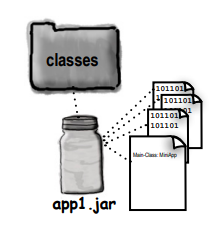
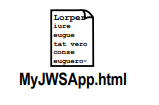

# Package, Jars and Deployment

Kodunuzu yazdınız. Kodunuzu test ettiniz. Kodunuzu geliştirdiniz. Her tanıdığınıza, bir daha kod görmeseniz bile bundan
memnun olacağınızı söylediniz. Ama sonunda, bir sanat eseri yarattınız. İşte gerçekten çalışıyor! Peki şimdi ne
yapmalısınız? Nasıl son kullanıcılara sunacaksınız? Tam olarak neyi son kullanıcılara vereceksiniz? Belki de son
kullanıcılarınızı bile bilmiyorsunuzdur. Bu son iki bölümde, Java kodunuzu nasıl düzenleyeceğinizi, paketleyeceğinizi ve
dağıtacağınızı keşfedeceğiz. Local, semi local ve remote deployment seçeneklerini, executable JAR dosyalarını, Java
Web Start'ı, RMI'ı ve Servletleri inceleyeceğiz. Bu bölümde, kodunuzu düzenlemeye ve paketlemeye çoğunlukla zaman
ayıracağız—bu, nihai dağıtım seçiminiz ne olursa olsun bilmeniz gereken şeylerdir. Son bölümde ise Java'da
yapabileceğiniz en harika şeylerden birini tamamlayacağız. Rahatlayın. Kodunuzu yayınlamak, elveda demek değildir. Her
zaman bakım yapılması gerekecektir...

### Deploying your application

Tam olarak nedir bir Java uygulaması? Başka bir deyişle, geliştirmeyi tamamladıktan sonra ne teslim edersiniz?
Muhtemelen son kullanıcılarınızın sizinkine tamamen benzer bir sistemleri yoktur.
Şimdi programınızı Dış Dünya'ya dağıtmaya hazır hale getirme zamanı geldi. Bu bölümde, local dağıtımları, Yürütülebilir
JAR dosyalarını ve semi local/semi remote bir teknoloji olan Java Web Start'ı inceleyeceğiz. Bir sonraki bölümde ise
RMI ve Servletler gibi daha remote deployment seçeneklerine bakacağız.


1 - Local

Tüm uygulama, son kullanıcının bilgisayarında, bağımsız, muhtemelen GUI tabanlı bir program olarak çalışır ve
executable bir JAR olarak dağıtılır

2 - Local ve Remote'un kombinasyonu

Uygulama, kullanıcının local sistemde çalışan client kısmıyla dağıtılır ve diğer uygulama parçalarının çalıştığı bir
server'a bağlanır.

3 - Remote

Tüm Java uygulaması bir server sisteminde çalışırken, client sistemi muhtemelen bir web tarayıcısı gibi Java dışı
methodlar ile bu sisteme erişir.

Java programınızı son kullanıcının bilgisayarında bağımsız bir local uygulama olarak dağıtmak ne gibi avantajları ve
dezavantajları beraberinde getirir? Ayrıca Java programınızı kullanıcının bir web tarayıcısı ile etkileşimde bulunduğu
ve Java kodunun server'da servletler olarak çalıştığı bir web tabanlı sistem olarak dağıtmak ne gibi avantajları ve
dezavantajları beraberinde getirir?

Ancak gerçekten dağıtım konusuna girmeden önce, uygulamanızı programlamayı bitirdiğinizde ve sadece sınıf dosyalarını
çıkarıp bunları bir son kullanıcıya vermek istediğinizde neler olduğuna bir adım geriye giderek ve çalışma dizininde tam
olarak neler olduğuna bakalım.

**Imagine this scenario...**

Bob, yeni harika Java programının son parçaları üzerinde mutlu bir şekilde çalışıyor. "Sadece bir derleme
uzaklığındayım" modunda haftalar geçirdikten sonra bu sefer gerçekten bitmiş durumda. Program oldukça sofistike bir GUI
uygulaması, ancak çoğunlukla Swing kodundan oluştuğu için sadece dokuz sınıf oluşturmuş. Sonunda, programı müşteriye
teslim etme zamanı geldi. Dokuz sınıf dosyasını kopyalamak zorunda olduğunu düşünüyor, çünkü müşterinin zaten Java
API'sini yüklü olduğunu biliyor. Tüm dosyalarının bulunduğu dizinde "ls" komutunu kullanarak başlıyor...

Garip bir şeyler olmuş gibi görünüyor. Onun yerine 18 dosya (dokuz source code dosyası ve dokuz compile edilmiş sınıf
dosyası) yerine 31 dosya görüyor. Bunların çoğu çok garip isimlere sahip dosyalar gibi:

Account$FileListener.class
Chart$SaveListener.class

ve bu şekilde devam ediyor. Tamamen unutmuştu ki derleyicinin, yaptığı tüm inner sınıf GUI event listener'lar için
sınıf dosyaları oluşturması gerektiği ve bunların hepsinin garip isimli sınıflar olduğunu.

Şimdi ihtiyaç duyduğu tüm sınıf dosyalarını dikkatlice çıkarması gerekiyor. Onlardan birini bile dışarıda bırakırsa,
programı çalışmaz. Ancak her şey aynı dizinde büyük bir karışıklık içinde olduğu için istemeden müşteriye bir souce kod
dosyası göndermek istemiyor.

### Separate source code and class files

Kaynak kodu ve sınıf dosyalarının bir yığınının olduğu tek bir dizin, karmaşık bir durumdur. Ortaya çıkan durum, Bob'un
dosyalarını baştan düzenlemesi gerektiğiydi, kaynak kodunu ve derlenmiş kodu ayrı tutması gerekiyordu. Başka bir
deyişle, derlenmiş sınıf dosyalarının kaynak koduyla aynı dizinde bulunmamasını sağlaması gerekiyordu.
Anahtar, dizin yapısı düzenlemesi ve -d derleyici seçeneğinin bir kombinasyonudur.

Dosyalarınızı düzenlemenin onlarca farklı yolu vardır. Ancak hemen hemen standart hâline gelmiş bir düzenleme
öneriyoruz. Bu düzenleme şemasıyla, bir proje dizini oluşturursunuz ve bu dizinin içinde source adında bir dizin ve
classes adında bir dizin oluşturursunuz. Kaynak kodunuzu (.java dosyaları) önce source dizinine kaydedersiniz. Ardından,
kodunuzu derlediğinizde (.class dosyaları) çıktının classes dizinine gitmesini sağlamanız gerekiyor. Bunun için -d
adında güzel bir derleyici flag'i bulunmaktadır.

**Compiling with the -d (directory) fag**

```
%cd MyProject/source
%javac -d ../classes MyApp.java
```

derleyiciye, derlenmiş kodu (sınıf dosyalarını) mevcut çalışma dizininden bir üst dizine ve tekrar altında ki "classes"
dizinine koymasını söyler.

Son olarak, derlemek istediğiniz Java dosyasının adını verin.

-d bayrağını kullanarak, derlenmiş kodun hangi dizine gideceğine siz karar verirsiniz; böylece sınıf dosyalarının kaynak
koduyla aynı dizine gelme varsayımını kabul etmek zorunda kalmazsınız. Source dizinindeki tüm .java dosyalarını derlemek
için kullanabilirsiniz:

```%javac -d ../classes *.java```

*.java komutu, mevcut dizinde bulunan TÜM kaynak dosyalarını derler.

**Running your code**

```
%cd MyProject/classes
%java MyApp
```


### Put your Java in a JAR

Bir JAR dosyası, Java Archive'ini temsil eder. pkzip dosya formatına dayanır ve tüm sınıflarınızı bir araya getirerek
müşterinize 28 sınıf dosyası yerine sadece tek bir JAR dosyası vermenizi sağlar. UNIX'teki "tar" komutunu
biliyorsanız, "jar" aracının komutlarını tanıyacaksınız.

Soru şu, client JAR dosyasını ne yapmalıdır? Onu nasıl çalıştırabilirsiniz? JAR'ı executable hale getirirsiniz.
Bir executable JAR, son kullanıcının programı çalıştırmadan önce sınıf dosyalarını çıkarması gerekmediği anlamına
gelir. Kullanıcı, sınıf dosyaları hala JAR içindeyken uygulamayı çalıştırabilir. İşin püf noktası, bir manifest dosyası
oluşturmaktır. Bu manifest dosyası JAR içine konur ve JAR dosyasındaki dosyalar hakkında bilgi içerir. Bir JAR'ı
executable yapmak için manifest, JVM'ye hangi sınıfın main() yöntemini içerdiğini söylemelidir!

1 - Sınıf dosyalarınızın tümünün classes dizininde olduğundan emin olun. Bunu birkaç sayfa sonra daha da
detaylandıracağız, ancak şimdilik tüm sınıf dosyalarınızı 'classes' adlı dizinde tutmaya devam edin.


2 - main() methodunu hangi sınıfın içerdiğini belirten bir manifest.txt dosyası oluşturun. MyApp adında bir metin
dosyası oluşturun ve içine bir satır yazın:

```Main-Class: MyApp```

MainClass satırını yazdıktan sonra Enter tuşuna basın, aksi takdirde manifest dosyanız doğru şekilde çalışmayabilir.
manifest dosyasını "classes" dizinine koyun.


3 - JAR aracını çalıştırarak, "classes" dizininde bulunan her şeyi ve manifest dosyasını içeren bir JAR dosyası
oluşturun.

```
%cd MyProject/classes
%jar -cvmf manifest.txt app1.jar *.class

OR

%jar -cvmf manifest.txt app1.jar MyApp.class
```


### Running (executing) the JAR


Çoğu %100 local Java uygulaması, executable JAR dosyaları olarak dağıtılır. Java (JVM), bir JAR dosyasından bir sınıfı
yükleyebilme yeteneğine sahiptir ve bu sınıfın main() methodunu çağırabilir.

Aslında, tüm uygulama JAR içinde kalabilir. Bir kere işlem başladığında (yani main() methodu çalışmaya başladığında),
JVM, sınıflarınızın nereden geldiğini umursamaz, yeter ki onları bulabilsin. JVM'in baktığı yerlerden biri classpath
içindeki JAR dosyalarıdır. Bir JAR görülebiliyorsa, JVM sınıf bulup yüklemesi gerektiğinde o JAR içine bakacaktır.



```cd MyProject/classes``` JVM, JAR dosyasını 'görmesi' gerektiği için JAR dosyasının classpath içinde bulunması
gerekir. JAR'ı görünür hale getirmenin en kolay yolu, çalışma dizininizi JAR'ın bulunduğu yere ayarlamaktır.

```java -jar app1.jar``` -jar flag'i, JVM'e bir sınıf yerine bir JAR dosyası verdiğinizi belirtir. JVM bu JAR içinde
MainClass için bir entry içeren bir manifest arar. Eğer bir tane bulamazsa, bir çalışma zamanı exception'ı alırsınız.

İşletim sisteminizin nasıl yapılandırıldığına bağlı olarak, JAR dosyasını çift tıklatarak bile başlatabilirsiniz. Bu,
Windows'un çoğu sürümünde ve Mac OS X'te çalışır. Genellikle bunu, JAR'ı seçip işletim sisteminizdeki "Aç" seçeneği ile
yapabilirsiniz.

--**DIALOGS**--

Q : Neden tüm bir directory'i JAR'lıyamıyorum?

A : JVM JAR içine bakar ve ihtiyacını doğrudan orada bulmayı bekler. Sınıf bir paketin bir parçası değilse, ve hatta o
durumda bile JVM sadece paket ifadesiyle eşleşen dizinlere bakar, diğer dizinlere digging yapmaz.

Q : Az önce ne dedin sen?

A : Sınıf dosyalarınızı rastgele bir dizine koyamaz ve onları bu şekilde JAR dosyasına koyamazsınız. Ancak sınıflarınız
paketlere aitse, tüm paket dizin yapısını JAR dosyasına koyabilirsiniz. Aslında, koymalısınız da. Tüm bunları bir
sonraki sayfada açıklayacağız, bu yüzden rahatlayabilirsiniz.

### Put your classes in packages!

Güzelce yeniden kullanılabilir sınıf dosyaları yazdınız ve bunları diğer programcıların kullanması için internal
development library'e eklediniz. Gelmiş geçmiş en iyi nesne yönelimli programlama örneklerini teslim etmişken, bir
telefon alırsınız. Bir panik havasıyla. İki sınıfınız, Fred'in yeni teslim ettiği sınıflarla aynı ada sahip. İsim
çakışmaları ve belirsizlikler, geliştirmeyi çökerten bir karmaşa yaratıyor.

Ve hepsi paketler kullanmadığınız için oldu! Evet, tabii ki Java API'daki paketlerde yer alan sınıfları kullanmak
anlamında "paketler" kullandınız. Ancak kendi sınıflarınızı paketlere koymadınız ve Gerçek Dünya'da, bu Gerçekten Kötü
bir durumdur. Önceki sayfalardaki düzeni biraz değiştireceğiz, sınıfları bir pakete koymak ve tüm paketi JAR yapmak
için. Ciddi ve detaylara dikkat etmelisiniz. Hatta en küçük sapma bile kodunuzun derlenmesini ve/veya çalıştırılmasını
engelleyebilir.

**Packages prevent class name conflicts**

Paketler sadece isim çakışmalarını önlemek için değil, bunun sadece bir ana özelliği. Bir sınıfı Customer, bir sınıfı
Account ve bir sınıfı ShoppingCart olarak adlandırabilirsiniz. Ve ne bilsin ki, iş dünyasında e-ticaret üzerine çalışan
geliştiricilerin yarısı muhtemelen bu adlarda sınıflar yazmıştır. Bir Nesne Yönelimli dünyada, bu sadece tehlikelidir.
Eğer OO'nun bir parçası bileşenleri yeniden kullanılabilir şekillerde yazmaksa, geliştiricilerin çeşitli kaynaklardan
bileşenleri bir araya getirebilmeleri ve onlardan yeni bir şey inşa edebilmeleri gerekmektedir. Bileşenleriniz,
diğerleriyle de 'iyi geçinebilmeli' ve hatta yazmadığınız veya hakkında bilgi sahibi olmadığınız bileşenlerle de uyumlu
olmalıdır.

Hatırlarsanız 6. bölümde bir paket adının bir sınıfın tam adı, teknik olarak fully qualified adı olarak kabul edildiğini
tartışmıştık. Sınıf ArrayList aslında java.util.ArrayList, JButton aslında javax.swing.JButton ve Socket aslında
java.net.Socket. Bu sınıfların ikisi, ArrayList ve Socket, her ikisi de ilk adları olarak "java"yı kullanıyor. Başka bir
deyişle, fully qualified adlarının ilk kısmı "java". Paket yapılarından bahsederken bir hiyerarşi düşünün ve
sınıflarınızı
buna göre düzenleyin.

### Preventing package name conflicts

Paketler isim çakışmalarını önleyebilir, ancak yalnızca eşsiz olduğu garantilenen bir paket adı seçerseniz. Bunun en
iyi yolu, paketlerinizi reverse domain name adınızla öneklemektir.

```com.headfirstbooks.Book```

Sınıfınızı bir pakete koymak, diğer sınıflarla isim çakışma olasılığını azaltır, ancak iki programcının aynı paket adını
bulmasını ne engeller? Başka bir deyişle, her biri Account adında bir sınıfa sahip iki programcının, sınıflarını
shopping.customers adında bir pakete koymaktan alıkoyan nedir? Bu durumda her iki sınıf da hala aynı adı taşırdı:

```shopping.customers.Account```

Sun, bu riski büyük ölçüde azaltan bir paket adlandırma kuralı öneriyor - her sınıfa reverse domain name adınızla
başlayın. Unutmayın, domain adlarının unique olması garantilidir. İki farklı kişi Bartholomew Simpson adı taşıyor
olabilir, ancak iki farklı domain doh.com olarak adlandırılamaz.

```com.headfrstjava.projects.Chart```

**To put your class in a package:**

1 - Package ismi seçin

Biz örnek olarak com.headfirstjava kullanıyoruz. Sınıf adı PackageExercise, bu nedenle sınıfın fully qualified adı
şimdi:

```com.headfirstjava.PackageExercise.```

2 - Sınıfınıza bir paket ifadesi koyun

Bu, source code dosyasının ilk ifadesi olmalıdır ve herhangi bir import ifadesinin üstünde olmalıdır. Her source code
dosyasında yalnızca bir paket ifadesi olabilir, bu nedenle source dosyasındaki tüm sınıflar aynı pakette olmalıdır. Bu
tabii inner sınıflar için de geçerlidir.


3 - Eşleşen bir directory yapısı kurun

Sınıfınızı yalnızca bir paket ifadesi ekleyerek pakete koymak yeterli değildir. Sınıfınız gerçekten bir pakette değil,
sınıfı uyumlu bir dizin yapısına yerleştirmediğiniz sürece. Dolayısıyla, fully qualified sınıf adı
com.headfirstjava.PackageExercise ise, PackageExercise kaynak kodunu headfirstjava adında bir dizine koymalısınız ve bu
dizin de com adında bir dizin içinde bulunmalıdır.

Bunu yapmadan derlemek mümkün olabilir, ancak bize güvenin - diğer sorunlara değmez. Kaynak kodunuzu, paket yapısını
eşleştiren bir dizin yapısında tutun ve ileride bir sürü acı baş ağrısından kaçının.


### Compiling and running with packages

Sınıfınız bir pakette olduğunda, derlemek ve çalıştırmak biraz daha karmaşıktır. Temel sorun, derleyicinin ve JVM'nin
sınıfınızı ve kullandığı tüm diğer sınıfları bulabilecek durumda olması gerektiğidir. Core API'sındaki sınıflar için
bu asla bir sorun değildir. Java kendi öğelerinin nerede olduğunu her zaman bilir. Ancak sizin sınıflarınız için, kaynak
dosyalarının bulunduğu aynı dizinden derlemek çözüm olmayacaktır (veya en azından güvenilir şekilde çalışmayabilir).
Ancak bu sayfada açıkladığımız yapıyı takip ederseniz, başarılı olacaksınız. Başka yollar da vardır, ancak biz bunun en
güvenilir ve en kolay takip edilebilir yol olduğunu bulduk.

**Compiling with the -d (directory) flag**

```
%cd MyProject/source
%javac -d ../classes com/headfrstjava/PackageExercise.java
```

```-d``` derleyiciye derlenmiş kodu (sınıf dosyalarını) doğru paket yapısı içindeki classes dizinine koymasını söyler

```com/headfrstjava``` Şimdi, gerçek kaynak dosyasına ulaşmak için PATH'i belirtmeniz gerekiyor.

com.headfirstjava paketindeki tüm .java dosyalarını derlemek için şunları kullanın:

```%javac -d ../classes com/headfrstjava/*.java```


**Running your code**

```
%cd MyProject/classes
%java com.headfrstjava.PackageExercise
```

KESİNLİKLE fully-qualified sınıf adını vermelisiniz! JVM bunu görecek ve hemen mevcut dizinine (classes) bakacak ve
orada bir com adında bir dizin bulmayı bekleyecek, ardından bir headfirstjava dizini bulmayı bekleyecek ve orada sınıfı
bulmayı bekleyecektir. Sınıf "com" dizininde veya hatta "classes" dizininde olsa bile işe yaramayacaktır!

### The -d flag is even cooler than we said

-d flag'i ile derlemek harikadır, çünkü sadece derlenmiş sınıf dosyalarını kaynak dosyasının olduğu dizinden farklı bir
dizine göndermenizi sağlamakla kalmaz, aynı zamanda sınıfı, sınıfın bulunduğu paket için doğru dizin yapısına koymayı da
bilir. Ancak durum daha da güzelleşiyor! Diyelim ki güzel bir dizin yapısı oluşturdunuz kaynak kodunuz için. Ancak
sınıflar dizini için eşleşen bir dizin yapısı oluşturmadınız. Sorun değil! -d ile derlemek, derleyiciye sadece
sınıflarınızı doğru dizin yapısına koymasını söylemekle kalmaz, aynı zamanda dizinleri oluşturmasını da söyler, eğer
dizinler zaten mevcut değilse.

--**DIALOGS**--

Q : Main sınıfımın bulunduğu dizine cd komutunu denedim, ancak şimdi JVM sınıfımı bulamıyorum diyor! Ama sınıf ŞU ANKİ
dizinde!

A : Sınıfınız bir paketteyse, ona 'kısa' adıyla çağrıda bulunamazsınız. Çalıştırmak istediğiniz main() methoduna sahip
sınıfın fully-qualified adını komut satırında BELİRTMELİSİNİZ. Ancak fully qualified ad, paket yapısını içerdiği için,
Java sınıfın eşleşen bir dizin yapısında olmasını ister. Bu nedenle komut satırında aşağıdaki gibi belirtirseniz:

```%java com.foo.Book```

JVM, mevcut dizinine (ve geri kalan classpath) "com" adında bir dizin arar. "com" adında bir dizin bulmadan "Book"
adında bir sınıf aramaz. "com" adında bir dizin içinde "foo" adında bir dizin bulana kadar doğru Book sınıfını bulduğuna
inanmaz. Ancak o zaman JVM doğru Book sınıfını bulduğunu kabul eder.

Başka bir yerde bir Book sınıfı bulursa, sınıfın doğru yapının içinde olmadığını varsayar, hatta öyle olsa bile!
Örneğin, JVM yukarıya doğru dizin ağacına bakmaz ve "Aha, üzerimizde com adında bir dizin var, bu doğru paket olmalı..."
demez.

### Making an executable JAR with packages

Sınıfınız bir paketteyse, paket dizin yapısının JAR içinde bulunması GEREKİR! Sınıfları önceden paketlemeden yaptığımız
gibi JAR içine koyamazsınız. Ve paketinizin üzerindeki başka dizinleri JAR içine dahil etmemeniz gerekir. Paketinizin
ilk dizini (genellikle com) JAR içindeki ilk dizin olmalıdır! Eğer paketin üzerindeki dizini (örneğin "classes" dizini)
yanlışlıkla dahil ederseniz, JAR doğru şekilde çalışmaz.

1 - Tüm sınıf dosyalarınızın, doğru paket yapısı altında "classes" dizini içinde olmasını sağlayın.


2 - Main() methoduna sahip olan sınıfı belirten bir manifest.txt dosyası oluşturun ve fully qualified sınıf adını
kullanmaya dikkat edin! manifest.txt içinde tek bir satır olsun:

```Main-Class: com.headfrstjava.PackageExercise```

manifest dosyasını classes dizinine koyun


3 - JAR aracını çalıştırarak, paket dizinlerini ve manifest dosyasını içeren bir JAR dosyası oluşturun.

Dahil etmeniz gereken tek şey 'com' dizinidir ve tüm paket (ve tüm sınıflar) JAR içine girecektir.

```
%cd MyProject/classes
%jar -cvmf manifest.txt packEx.jar com
```


### So where did the manifest file go?

Neden JAR içeriğine bir göz atmayalım? Komut satırından, jar aracı sadece bir JAR oluşturmak ve çalıştırmakla kalmaz.
Bir JAR dosyasının içeriğini çıkarabilirsiniz (tamamen 'açma' veya 'çıkartma' gibi). packEx.jar'ı Skyler adlı bir dizine
koyduğunuzu hayal edin.

1 - JAR içerisinde ki content'i listele;

``` jar -tf packEx.jar```


2 - Bir JAR dosyasının content'ini çıkarın (yani "unjar").

```
% cd Skyler
% jar -xf packEx.jar
```

"-xf", 'Extract File' anlamına gelir ve bu işlem, dosya açma veya dosya çıkartma gibi işlemlerle aynı şekilde çalışır.
Eğer packEx.jar dosyasını çıkartırsanız, META-INF ve com dizinlerini mevcut dizinde göreceksiniz.


--**DIALOGS**--

Q : Eğer executable bir JAR dosyasını çalıştırmaya çalışırsanız ve son kullanıcının bilgisayarında Java yüklü
değilse, JAR dosyası çalıştırılamaz. Bu durumda, Java'nın kurulu olduğundan emin olmanız gerekecektir?

A : Hiçbir şey çalışmaz, çünkü bir JVM olmadan Java kodu çalıştırılamaz. Son kullanıcının Java'yı kurulu olarak sahip
olması gerekmektedir.

Q : Java'nın son kullanıcının makinesine yüklenmesini nasıl sağlayabilirim?

A : İdeal olarak, özel bir kurulum programı oluşturabilir ve bunu uygulamanızla birlikte dağıtabilirsiniz. Basitten son
derece güçlüye kadar birçok şirket kurulum programları sunmaktadır. Örneğin, bir kurulum programı son kullanıcının uygun
bir Java sürümünün yüklü olup olmadığını tespit edebilir ve yüklü değilse uygulamanızı yüklemeden önce Java'yı
kurabilir ve yapılandırabilir.

Installshield, InstallAnywhere ve DeployDirector gibi programlar Java kurulum çözümleri sunmaktadır. Kurulum
programlarının bazı harika özelliklerinden biri, tüm ana Java platformları için kurulum programlarını içeren bir dağıtım
CD'si oluşturabilmenizdir. Böylece... hepsini kontrol eden bir CD. Örneğin kullanıcı Solaris üzerinde çalışıyorsa,
Solaris sürümü Java yüklenir. Windows üzerinde Windows sürümü, vb. Eğer bütçeniz varsa, bu, son kullanıcılarınızın doğru
Java sürümünü kurmasının ve yapılandırmasının en kolay yolu olacaktır.

--**BULLET POINTS**--

* Kaynak kodunuzu ve sınıf dosyalarını aynı dizinde bulunmayacak şekilde projenizi düzenleyin.
* Standart bir düzenleme yapısı, bir proje dizini oluşturmak ve ardından proje dizini içine bir kaynak dizini ve bir
  sınıflar dizini yerleştirmektir.
* Sınıflarınızı paketlere düzenlemek, sınıf adınızın önüne reverse domain name eklerseniz diğer sınıflarla ad
  çakışmalarını engeller.
* Bir sınıfı bir pakete koymak için, kaynak kod dosyasının en üstüne, herhangi bir import ifadesinden önce bir paket
  ifadesi ekleyin: ```package com.wickedlysmart;```
* Bir pakette olmak için, bir sınıfın dizin yapısı, tam olarak paket yapısına uymalıdır. Örneğin, com.wickedlysmart.Foo
  adlı bir sınıf için Foo sınıfı wickedlysmart adında bir dizinde olmalıdır, bu dizin de com adında bir dizinde
  olmalıdır.
* Derlenmiş sınıflarınızın, classes dizini altında doğru paket dizini yapısına gitmesi için -d derleyici bayrağını
  kullanın:
  ```
  % cd source
  % javac -d ../classes com/wickedlysmart/Foo.java
  ```

* Kodunuzu çalıştırmak için, classes dizinine gidin ve sınıfınızın tam adını verin:
  ```
  % cd classes
  % java com.wickedlysmart.Foo
  ```

* Sınıflarınızı JAR (Java ARchive) dosyalarına paketleyebilirsiniz. JAR, pkzip formatına dayanmaktadır.
* Bir executable JAR dosyası yapmak için, JAR içine hangi sınıfın main() metoduna sahip olduğunu belirten bir
  manifest koymalısınız. Bir manifest dosyası oluşturmak için, aşağıdaki gibi bir entry içeren bir metin dosyası
  oluşturun (örneğin):

  ```
  Main-Class: com.wickedlysmart.Foo
  ```

* Main-Class satırını yazdıktan sonra enter tuşuna basmayı unutmayın, aksi halde manifest dosyanız çalışmayabilir.
* Bir JAR dosyası oluşturmak için şunu yazın:

```jar -cvfm manifest.txt MyJar.jar com```

* Tüm paket dizini yapısı (ve yalnızca paketi eşleştiren dizinler) JAR dosyasının hemen içinde olmalıdır.
* Bir yürütülebilir JAR dosyasını çalıştırmak için şunu yazın: ```java -jar MyJar.jar```

### Java Web Start


Son kullanıcılar, bir Java Web Start uygulamasını, bir Web sayfasındaki bir bağlantıya tıklayarak başlatır. Ancak
uygulama indirildikten sonra, diğer bağımsız Java uygulamaları gibi, tarayıcı dışında çalışır. Aslında, bir Java Web
Start uygulaması, web üzerinden dağıtılan yürütülebilir bir JAR dosyasından ibarettir.

Java Web Start (JWS) ile uygulamanız ilk kez bir web tarayıcısından başlatılır (Anladınız mı? Web Start?), ancak
tarayıcının kısıtlamaları olmadan neredeyse bağımsız bir uygulama gibi çalışır. Ve bir kere kullanıcının makinesine
indirildiğinde (bu, kullanıcının indirme işlemini başlatan tarayıcı bağlantısına ilk eriştiğinde gerçekleşir), orada
kalır.

Java Web Start, diğer birçok şeyin yanı sıra, istemci makinesinde bulunan ve tarayıcı eklentisi gibi çalışan küçük bir
Java programıdır (örneğin, tarayıcınız bir .pdf dosyasını açtığında Adobe Acrobat Reader gibi). Bu Java programına Java
Web Start 'helper app' denir ve temel amacı JWS uygulamalarınızın indirilmesini, güncellenmesini ve başlatılmasını (
çalıştırılmasını) yönetmektir.

JWS, uygulamanızı (bir executable JAR dosyası) indirdiğinde, uygulamanızın main() methodunu çağırır. Bundan sonra,
son kullanıcı uygulamanızı Web sayfası bağlantısına geri dönmeden JWS yardımcı uygulamasından başlatabilir.

Ancak bu en iyi kısmı değil. JWS'nin muhteşem özelliği, uygulamanın (örneğin, tek bir sınıf dosyası gibi) sunucuda hatta
küçük bir parçasının değiştiğini algılayabilme yeteneği ve herhangi bir son kullanıcı müdahalesi olmadan güncellenmiş
kodu indirip entegre edebilmesidir.

Tabii ki hala bir sorun var, örneğin son kullanıcının Java ve Java Web Start'ı nasıl alacağı. İkisine de ihtiyaçları
var - uygulamayı çalıştırmak için Java ve uygulamayı alıp başlatmak için Java Web Start (küçük bir Java uygulaması)
gerekiyor. Ancak bu bile çözüldü. Şeyleri öyle ayarlayabilirsiniz ki, eğer son kullanıcılarınızda JWS yoksa, onu Sun'dan
indirebilirler. Ve eğer JWS'leri varsa, ancak Java sürümleri güncel değilse (çünkü JWS uygulamanızda belirli bir Java
sürümü gerektirdiyseniz), Java 2 Standard Edition, son kullanıcı makinesine indirilebilir.

En önemlisi, kullanımı basittir. JWS uygulamasını, düz bir HTML sayfası veya bir JPEG görüntü gibi diğer Web kaynakları
gibi sunabilirsiniz. JWS uygulamanıza bir bağlantı içeren bir Web (HTML) sayfası oluşturursunuz ve işlem tamamdır.

Sonuç olarak, JWS uygulamanız, son kullanıcıların Web'den indirebileceği bir executable JAR'dan fazla bir şey
değildir.

### How Java Web Start works

1 - Client, JWS uygulamanıza (bir .jnlp dosyası) ait bir Web sayfası bağlantısına tıklar. Web sayfası bağlantısı:

```<a href=”MyApp.jnlp”>Click</a>```


2 - Web server (HTTP), request'i alır ve bir .jnlp dosyası gönderir (bu JAR dosyası DEĞİLDİR). .jnlp dosyası,
uygulamanın executable JAR dosyasının adını belirten bir XML belgesidir.


3 - Java Web Start (client tarafında küçük bir 'helper app'), tarayıcı tarafından başlatılır. JWS helper app, .jnlp
dosyasını okur ve server'dan MyApp.jar dosyasını talep eder.


4 - Web server istenen .jar dosyasını sunar (hizmet eder).


5 - Java Web Start, JAR dosyasını alır ve executable bir JAR gibi belirtilen main() methodunu çağırarak uygulamayı
başlatır. Kullanıcı bir sonraki seferde bu uygulamayı çalıştırmak istediğinde, çevrimdışı bile olsa Java Web Start
uygulamasını açabilir ve uygulamanızı oradan başlatabilir


### The .jnlp file

Bir Java Web Start uygulaması oluşturmak için, uygulamanızı açıklayan bir .jnlp (Java Network Launch Protocol) dosyası
oluşturmanız gerekir. Bu dosya, JWS uygulamasının okuduğu ve JAR dosyanızı bulup uygulamayı başlatmak için kullandığı
dosyadır (JAR'ın main() methodunu çağırarak). Bir .jnlp dosyası, içine yerleştirebileceğiniz çeşitli öğelere sahip basit
bir XML belgesidir. Ancak en azından şu şekilde görünmelidir:

```
<?xml version=”1.0” encoding=”utf-8”?>
  <jnlp spec=”0.2 1.0”
    codebase=”http://127.0.0.1/~kathy”
    href=”MyApp.jnlp”>
  <information>
    <title>kathy App</title>
    <vendor>Wickedly Smart</vendor>
    <homepage href=”index.html”/>
    <description>Head First WebStart demo</description>
    <icon href=”kathys.gif”/>
    <offine-allowed/>
  </information>
  <resources>
    <j2se version=”1.3+”/>
    <jar href=”MyApp.jar”/>
  </resources>
  <application-desc main-class=”HelloWebStart”/>
</jnlp> 
```

'codebase' etiketi, web start öğelerinizin serverda bulunduğu 'root' konumunu belirttiğiniz yerdir. Biz bunu local
makinede test ediyoruz, bu nedenle local loopback adresini "127.0.0.1" olarak kullanıyoruz. İnternet web serverimizda ki
web start uygulamaları için bu "http://www.wickedlysmart.com" şeklinde olacaktır.

```href=”MyApp.jnlp``` Bu, .jnlp dosyasının codebase'e göre relative konumudur. Bu örnek, MyApp.jnlp dosyasının web
server'in root dizininde bulunduğunu, başka bir dizine gömülmediğini gösterir.

```<information>``` Tüm bu etiketleri eklediğinizden emin olun, aksi takdirde uygulamanız düzgün çalışmayabilir! '
information' etiketleri, çoğunlukla kullanıcının daha önce indirilmiş bir uygulamayı yeniden başlatmak istediğinde
görüntülemek için JWS yardımcı uygulaması tarafından kullanılır.

```<offline-allowed>``` Bu, kullanıcının internete bağlı olmadan programınızı çalıştırabileceği anlamına gelir.
Kullanıcı çevrimdışı olduğunda otomatik güncelleme özelliğinin çalışmayacağı anlamına gelir.

```<jar href=”MyApp.jar”/>``` Yürütülebilir JAR dosyanızın adı! Ayrıca, uygulamanız tarafından kullanılan diğer
sınıfları veya hatta ses ve görüntüleri içeren diğer JAR dosyalarınız da olabilir.

```<application-desc main-class=”HelloWebStart”/>``` Bu, manifest dosyasındaki Main-Class entry'si gibidir... JAR
içindeki hangi sınıfın main() methoduna sahip olduğunu belirtir.

### Steps for making and deploying a Java Web Start app

1 - Uygulamanızın executable bir JAR'ını yaratın


2 - .jlnp file'ini yazın


3 - JAR dosyanızı ve .jlnp dosyanızı Web Server'a koyun


4 - Web sunucunuza yeni bir mime type ekleyin.

```application/x-java-jnlp-fle ```

Bu, server'in doğru başlıkla .jnlp dosyasını göndermesine neden olur; böylece tarayıcı .jnlp dosyasını aldığında ne
olduğunu bilir ve JWS helper app'i başlatması gerektiğini bilir.


5 - .jnlp file'iniza bağlantı içeren bir Web sayfası oluşturun

```
<HTML>
 <BODY>
 <a href=”MyApp2.jnlp”>Launch My Application</a>
 </BODY>
</HTML>
```



--**DIALOGS**--

Q : Java Web Start'ın bir applet'ten farkı nedir?

A : Appletler, bir web tarayıcısının dışında var olamazlar. Bir applet, basitçe bir web sayfasından değil, bir web
sayfasının bir parçası olarak Web'den indirilir. Başka bir deyişle, tarayıcı için applet, bir JPEG veya diğer herhangi
bir kaynak gibi görünür. Tarayıcı, appleti çalıştırmak için ya Java eklentisini ya da tarayıcının kendi yerleşik
Java'sını (bugünlerde çok daha az yaygın) kullanır. Appletler, otomatik güncelleme gibi işlevselliklerde aynı seviyede
değildir ve her zaman tarayıcıdan başlatılmalıdır. JWS uygulamalarıyla, webden indirildikten sonra kullanıcı uygulamayı
local olarak tekrar başlatmak için bir tarayıcı kullanmak zorunda değildir. Bunun yerine, kullanıcı JWS helper
app'ini başlatabilir ve zaten indirilmiş uygulamayı tekrar başlatmak için kullanabilir.

Q : JWS'nin güvenlik kısıtlamaları nelerdir?

A : JWS uygulamalarının birkaç kısıtlaması bulunmaktadır; bunların arasında kullanıcının sabit sürücüsüne yazma ve okuma
yeteneğinin sınırlanması yer almaktadır. Ancak... JWS, kullanıcının izniyle uygulamanızın kendi dosyalarını özel,
sınırlı bir alanında kaydetmesine ve okumasına izin vermek için özel bir açma ve kaydetme iletişim kutusu içeren kendi
API'sine sahiptir.

--**BULLET POINTS**--

* Java Web Start teknolojisi, web üzerinden bağımsız bir client uygulaması dağıtmanıza olanak tanır.
* Java Web Start, client üzerinde (Java ile birlikte) kurulması gereken bir 'helper app' içerir.
* Java Web Start (JWS) uygulaması, executable bir JAR ve bir .jnlp dosyasından oluşur.
* Bir .jnlp dosyası, JWS uygulamanızı açıklayan basit bir XML belgesidir. Bu belgede JAR'ın adı ve konumu, ve main()
  methoduna sahip sınıfın adını belirtmek için etiketler bulunur.
* Bir tarayıcı, kullanıcının .jnlp dosyasına bağlantıya tıklaması nedeniyle (.jnlp dosyasına bir bağlantı üzerinden)
  serverdan bir .jnlp dosyası alırsa, tarayıcı JWS yardımcı uygulamasını başlatır.
* JWS helper app .jnlp dosyasını okur ve executable JAR'ı web sunucusundan talep eder.
* JWS, JAR dosyasını aldığında (.jnlp dosyasında belirtilen) main() methodunu çağırır.