# Know your variables

Variables iki çeşitte gelir: primitive ve referans. Şimdiye kadar iki yerde de variables'leri kullandınız - nesne durumu
olarak (instance variables'leri) ve yerel variablesler olarak (bir method içinde tanımlanan variables'ler).

Daha sonra, variables'leri argümanlar olarak kullanacağız (calling code tarafından bir methoda gönderilen değerler) ve
dönüş türleri olarak kullanacağız (methodun çağırıcısına geri gönderilen değerler).

Basit primitive tam sayı değerleri (int türü) olarak deklare edilmiş variables'leri gördünüz. String veya arrays gibi
daha karmaşık bir şey olarak deklare edilmiş variablesleri gördünüz. Ancak, hayatta tam sayılar, String'ler ve
arraylerden daha fazlası olmalı. Örneğin, bir Dog instance variable'i içeren bir PetOwner nesneniz veya bir Engine ile
bir Car'ınız olabilir. Bu bölümde Java türlerinin sırlarını açığa çıkaracak ve bir variables olarak neyin deklare
edilebileceğini, bir variablese neyin yerleştirilebileceğini ve bir variablesle ne yapabileceğinizi göreceğiz. Ve
sonunda garbage-collective heap'de gerçekten hayatın nasıl olduğunu göreceğiz.

### Declaring a variable

Java tür konusunda hassastır. Bir Giraffe referansını Rabbit variable'sine yerleştirmek gibi garip ve tehlikeli bir şey
yapmanıza izin vermez - biri sözde Rabbit'a hop() sormaya çalıştığında ne olur? Ve ondalık sayıyı ondalık noktasından
sonraki her şeyi kaybedebileceğinizi (örneğin, ondalık noktadan sonra her şeyi) bilerek, kayan nokta sayısını bir
tamsayı variablesine yerleştirmenize izin vermez.

Derleyici çoğu sorunu tespit edebilir: ```Rabbit hopper = new Giraffe();``` Bu derlenmeyi beklemeyin. Neyse ki. Bu tür
güvenliğin çalışabilmesi için variablesinizin türünü bildirmeniz gerekmektedir. Bir tamsayı mı? Bir Köpek mi? Bir
Single character mi? variablesler iki çeşitte gelir: Primitive ve nesne referansı. primitive verileri içeren türleri,
integers, booleans değerler ve float sayılar da dahil olmak üzere temel değerleri tutar. Nesne referansları
ise, nesnelere olan referansları tutar

İlk olarak primitive'lere bakacağız ve ardından bir nesne referansının gerçekte ne anlama geldiğine geçeceğiz. Ancak
tür ne olursa olsun, iki bildirim kuralına uymalısınız:

* Variables'ların bir type'ı olmalıdır
* Bir type'ın yanı sıra, bir variable'in bir adı olması gerekir, böylece bu adı kod içinde kullanabilirsiniz.
  Variables'ların bir ismi olmalıdır

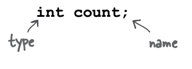

### “I’d like a double mocha, no, make it an int.”

Java variable'lerini düşünürken, bardakları düşünün. Kahve fincanları, çay fincanları, çok fazla bira alan dev fincanlar
sinemada mısır patlattığımız büyük fincanlar, eğimli ve çekici tutacakları olan fincanlar ve mikrodalga fırına asla
giremeyeceğimizi öğrendiğimiz metalik süslemeleri olan fincanlar. Bir variable sadece bir fincandır. Bir konteynerdir.
Bir şeyi tutar. Bir size'i ve bir type'i vardır. Bu bölümde, önce primitive verileri tutan variablelere (fincanlara)
bakacağız, daha sonra nesnelere olan referansları tutan fincanlara bakacağız. Fincan benzetmesinde bizimle kalın - şu
anda olduğu kadar basit olsa da, tartışma daha karmaşık hale geldiğinde birlikte bakabileceğimiz ortak bir
yol sağlayacaktır. Ve bu yakında olacak. Primitive veriler, kahve dükkanında bulunan fincanlara benzer. Bir Starbucks'a
gittiyseniz, burada ne demek istediğimizi biliyorsunuzdur. Farklı boyutlarda gelirler ve her birinin "kısa", "uzun" ve "
ekstra çırpılmış kremalı 'grande' mocha yarım kafeinli istiyorum" gibi bir adı vardır. Bardakları tezgâhta
sergilenmiş olarak görebilirsiniz, böylece uygun şekilde sipariş verebilirsiniz.

Java'da primitive veriler farklı boyutlarda gelir ve bu boyutlara isimler verilir. Java'da bir variable bildirdiğinizde,
belirli bir typle'la bildirmeniz gerekmektedir. Buradaki dört konteyner, Java'daki dört integer primitive veri tipini
temsil etmektedir. Her fincan bir değer tutar, bu yüzden Java primitive veriler için "uzun bir french roast istiyorum"
demek yerine, derleyiciye "lütfen 90 değerine sahip bir int variable istiyorum" dersiniz. Ancak küçük bir farkla...
Java'da fincana bir ad da vermeniz gerekmektedir. Bu yüzden aslında "lütfen bir int istiyorum, değeri 2486 olan ve
variable'in adı 'height' olan" şeklindedir. Her primitive variable'in sabit bir bit sayısı (fincan boyutu) vardır.
Java'daki altı sayısal primitive veri tipinin boyutları aşağıda gösterilmiştir:

```
byte -> 8
short -> 16
int -> 32
long -> 64
float -> 32
double -> 64
```

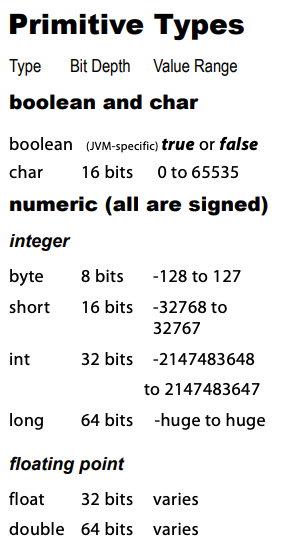 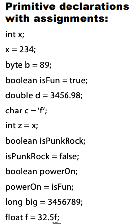

### You really don’t want to spill that...

Değerin variable'a sığabileceğinden emin olun. Büyük bir değeri küçük bir fincana koyamazsınız. Peki, tamam,
yapabilirsiniz, ancak bazı şeyler kaybolur. Bildiğimiz gibi, döküntü oluşur. Derleyici, kodunuzdan bir şeyin
konteynerin (variable/fincan) içine sığmayacağını anlayabiliyorsa, bunu engellemeye çalışır. Örneğin, aşağıdaki gibi bir
int dolusu şeyi byte büyüklüğünde bir konteynere dökemezsiniz:

```
int x = 24;
byte b = x;
```

Neden işe yaramıyor diye soruyorsunuz? Sonuçta, x'in değeri 24 ve 24 kesinlikle bir byte'a sığabilecek kadar küçüktür.
Siz bunu biliyorsunuz ve biz biliyoruz, ancak derleyici tek endişesi büyük bir şeyi küçük bir şeye koymaya çalışmanız ve
dökülme olasılığıdır. Derleyicinin x'in değerini bilmemesini beklemeyin, hatta kodunuzda doğrudan görebiliyor olsanız
bile.

Bir variable'a değer atamak için birkaç farklı yol kullanabilirsiniz. Bunlar arasında şunlar bulunur:

* eşittir işaretinden sonra bir literal değer yazmak (x = 12, isGood = true, vb.)
* bir variable'in değerini başka bir variable'a atamak (x = y)
* iki variable'i birleştiren bir expression kullanmak (x = y + 43)

Aşağıdaki örneklerde, literal değerler kalın italik olarak belirtilmiştir:

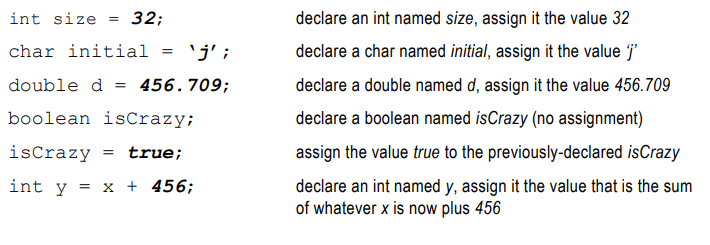

Derleyici, büyük bir fincandan küçük bir fincana bir değer koymaya izin vermez. Peki ya diğer yönde - küçük bir fincanı
büyük bir fincana dökmek? Bu sorun değil.

### Back away from that keyword!

variable'lariniz için bir isim ve bir type gerektiğini biliyorsunuz. Zaten primitive veri tiplerini biliyorsunuz.
Ancak isim olarak ne kullanabilirsiniz? Kurallar basittir. Bir sınıfı, methodu veya variable'i aşağıdaki kurallara göre
adlandırabilirsiniz (gerçek kurallar biraz daha esnektir, ancak bunlar sizi güvende tutacaktır):

* Bir isim, harfle, alt çizgiyle (_) veya dolar işaretiyle ($) başlamalıdır. Bir ismi sayıyla başlatamazsınız.
* İlk karakterden sonra, sayıları da kullanabilirsiniz. Sadece sayı ile başlamamaya dikkat edin.
* İki kurala uyduğu sürece, Java'nın ayrılmış (rezerve) kelimelerinden biri olmadığı sürece istediğiniz herhangi bir şey
  olabilir.

Ayrılmış (rezerve) kelimeler, derleyicinin tanıdığı anahtar kelimeler (ve diğer şeyler) dir. Eğer gerçekten derleyicinin
kafasını karıştırmak isterseniz, bir rezerve kelimeyi bir isim olarak kullanmayı deneyin. İlk main sınıfımızı yazarken
bazı ayrılmış kelimeleri zaten görmüştük:

```public static void```

Ve primitive veri tipleri de reserved kelimelerdir:

```boolean char byte short int long float double```

### This table reserved

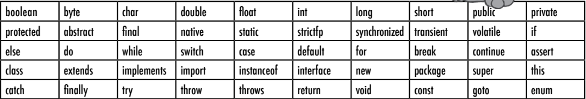

### Controlling your Dog object

Primitive bir variable'i nasıl bildireceğinizi ve bir değer atayacağınızı biliyorsunuz. Peki şimdi sıra gelmişken
primitive olmayan variable'lara ne dersiniz? Diğer bir deyişle, nesneler hakkında ne düşünüyorsunuz?

* Aslında object variable diye birşey yoktur
* Yanlızca bir object referance variable'i vardır
* Bir object reference variable, bir nesneye erişmek için bir yol temsil eden bitleri tutar.
* Object reference variable'i, nesneyi kendisi tutmaz, ancak bir pointer veya adres gibi bir şeyi tutar. Ancak, Java'da
  referans variable'inin içinde ne olduğunu gerçekte bilmiyoruz. Bildiğimiz tek şey, ne olursa olsun, bir ve yalnızca
  bir nesneyi temsil ettiğidir. JVM ise referansı kullanarak nesneye erişmeyi bilir.

Bir nesneyi bir variable'a tıkıştıramazsınız. Sıklıkla bu şekilde düşünürüz... "String'i System.out.println() methoduna
aktardım." veya "Method bir Dog döndürüyor" veya "Yeni bir Foo nesnesini myFoo adlı variable'a yerleştirdim" gibi
ifadeler kullanırız. Ancak gerçekleşen bu değildir. Herhangi bir nesnenin boyutuna genişleyebilen devasa fincanlar
yoktur. Nesneler sadece bir yerde yaşar ve o yer garbage collectible heap'dir!

Bir primitive variable, variable'in gerçek değerini temsil eden bitlerle dolu olsa da, bir nesne referansı variable'i,
nesneye ulaşmanın bir yolunu temsil eden bitlerle doludur.

Bir referans variable üzerinde nokta operatörünü (.) kullanarak, "noktadan önceki şeyi kullanarak bana noktadan sonraki
şeyi getir" dersiniz.

Örneğin:

```myDog.bark();```

"myDog" variable'iyle temsil edilen nesneyi "bark()" methodunu çağırmak için kullanır. Bir nesne referansı variable'i
üzerinde nokta operatörünü kullandığınızda, bunu o nesnenin uzaktan kumandasındaki bir düğmeye basmak gibi düşünün.

### An object reference is just another variable value.

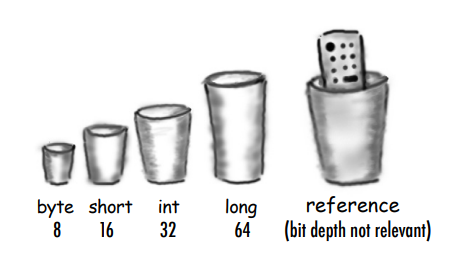

**Primitive Variable:**

```byte x = 7; Bit olarak gosterimi (00000111)``` 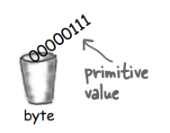

**Reference Variable**

```Dog dog = new Dog();``` 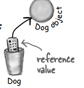

Nesneye ulaşmanın bir yolunu temsil eden bitler variable'a yerleştirilir. Dog nesnesi kendisi variable'a yerleştirilmez!
Primitive variable'larla, variable'in değeri... value'dur (5, -26.7, 'a')

Referans variable'leriyle, variable'in değeri... belirli bir nesneye ulaşmanın bir yolunu temsil eden bitlerdir.
Herhangi bir JVM'in nesne referanslarını nasıl uyguladığını bilmezsiniz (ve umursamazsınız). Elbette, bir pointer'a bir
pointer olabilirler... ancak bilseniz bile, bu bitleri bir nesneye erişmekten başka bir şey için kullanamazsınız.

### 3 Steps of object declaration, creation and assigment

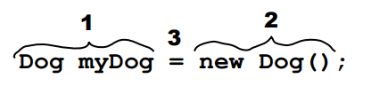

1 - Declare a reference variable;

```Dog dog = ``` JVM'ye bir referans variable'i için yer ayırmasını ve o variable'i dog olarak adlandırmasını söyler.
Referans variable'i, sonsuza kadar Dog türündedir. Başka bir deyişle, bir Köpeği kontrol etmek için düğmelere sahip bir
uzaktan kumandadır, ancak Bir Kedi veya Bir Düğme veya Bir Soket için değil.

2 - Create an object

```=new Dog();``` JVM'ye heap üzerinde yeni bir Dog nesnesi için yer ayırmasını söyler

3 - Link the object and the reference

```Dog dog = new Dog();``` Yeni Dog nesnesini dog referans variable'ina atar. Başka bir deyişle, uzaktan kumandayı
programlar.

Question : Reference variable ne kadar büyük olabilir?

Answer : Eğer JVM'in geliştirme ekibiyle samimi değilseniz, bir referansın nasıl temsil edildiğini bilmezsiniz. İçeride
bir yerlerde pointer'lar vardır, ancak onlara erişemezsiniz. Buna ihtiyacınız olmayacak. (Tamam, ısrar ederseniz, sadece
64 bitlik bir değer olduğunu hayal edebilirsiniz.) Ancak bellek tahsisi sorunlarından bahsettiğinizde, Büyük Endişeniz
nesnelerin sayısı (nesne referanslarından farklı olarak) ve gerçekten ne kadar büyük oldukları (nesneler) olmalıdır.

**Dialog;**

HeadFirst : Öyleyse, bize bir nesne referansı için hayat nasıl bir şey söyler misiniz?

Reference : Oldukça basit aslında. Ben bir uzaktan kumandayım ve farklı nesneleri kontrol etmek için programlanabilirim.

HeadFirst : Bir Dog'a refer edip beş dakika sonra bir Car'a refer edebilir misin?

Reference : Tabii ki hayır, bir kez tanımlandığımda o şekilde kalırım. Eğer ben bir Dog uzaktan kumandasıysam, sadece
bir Dog'a işaret ederim, başka bir şeye işaret etmek yerine sadece bir Dog'a işaret etmek

HeadFirst : Bu, yalnızca bir Köpeğe başvurabileceğiniz anlamına mı geliyor?

Reference : Bir köpekten bahsediyor olabilirim ve beş dakika sonra başka bir köpekten bahsedebilirim. Köpek olduğu
sürece (kumandanızı farklı bir televizyona yeniden programlamak gibi) ona yönlendirilebilirim.

HeadFirst : Bana söyleme ne söyleyecektin

Reference : Şu an bunun üzerine girmek istemediğinizi düşünüyorum, ancak size kısa bir versiyonunu verebilirim - eğer
ben "final" olarak işaretlenmişsem, bir köpeğe atanmam durumunda, yalnızca o belirli köpek dışında başka bir şeye
yeniden programlanamam. Başka bir deyişle, bana başka bir nesne atanamaz.

HeadFirst : Evet, eğer "final" olarak işaretlenmediysem, bir köpekten bahsedebilir ve daha sonra başka bir köpekten
bahsedebilirim. Ancak hiçbir şeyden bahsetmem mümkün mü? Hiçbir şeye programlanmamak mümkün mü?

Reference : Evet, ama bunun hakkında konuşmak beni rahatsız ediyor

HeadFirst : Nedenmiş?

Reference : Çünkü bu benim bir "null" olduğum anlamına geliyor ve bu beni üzüyor

HeadFirst : Çünkü o zaman bir değerin yok?

Reference : Ah, anlamıştım. "null" bir value olarak kullanılıyor. Hâlâ bir kumanda gibiyim, ancak evinize yeni bir
evrensel kumanda getirmişsiniz gibi düşünebilirsiniz ve bir televizyonunuz yok. Hiçbir şeyi kontrol etmek için
programlanmış değilim. İnsanlar düğmelerime tüm gün basabilir, ancak hiçbir şey olmaz. Sadece... çok işe yaramaz
hissediyorum. Bir bit kaybı gibi. Kabul ediyorum, çok fazla bit değil, ama yine de. Ve en kötü yanı da bu değil. Eğer
belirli bir nesneye tek referans benimse ve sonra "null" olarak ayarlanırsam (programdan çıkarılırsam), bu, artık kimse
o nesneye erişemeyeceği anlamına gelir ki ben ona referans veriyordum.

HeadFirst : ve bu çok kötü?

Reference : Anladım, bu durum size duygusal bir etki yapıyor. Bir nesne ile bir ilişki geliştirmişsiniz, samimi bir bağ,
ve sonra bu bağ aniden, acımasızca koparılmış. Ve o nesneyi bir daha asla görmeyeceğim, çünkü şimdi çöp toplama işlemine
tabi olabilir. Ne yazık ki, bu durumu programcılar hiç düşünmüyorlar mı? Neden, neden basit bir yapı olamam? Bir
referans olmayı sevmiyorum. Sorumluluk, tüm koparılan bağlantılar...

### Life on the garbage-collectible heap

```
Book b = new Book();
Book c = new Book();
```

2 adet declare edilen Book reference variable'i; 2 Book object'i şu anda heap'de yaşıyor

References : 2

Objects : 2

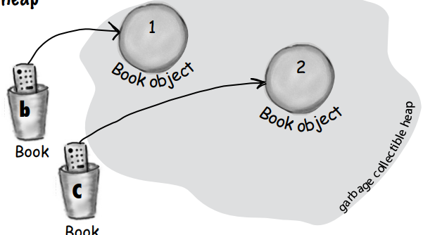

```
Book d = c;
```

Yeni bir 'd' reference variable'i declare ediliyor.

Yeni bir üçüncü Book nesnesi oluşturmak yerine, variable c'nin değerini variable d'ye atayın. Ancak bu ne anlama
geliyor? Bu, "c'deki bitleri alın, bir kopyasını yapın ve o kopyayı d'ye yerleştirin" demek gibi bir şeydir. Hem c hem
de d aynı nesneye işaret eder.
c ve d variable'lari, aynı değerin iki farklı kopyasını tutar. Bir televizyona programlanmış iki uzaktan kumanda gibi
düşünebilirsiniz.

Reference : 3

Objects : 2

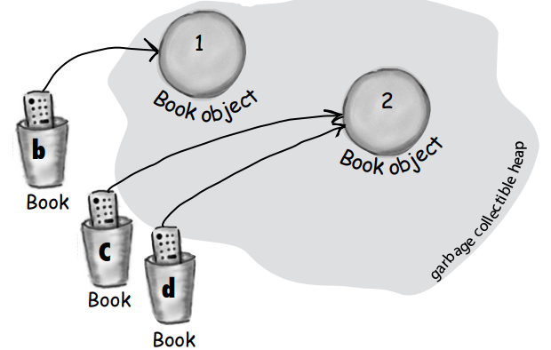

```
c = b;
```

variable b'nin değerini variable c'ye atayın. Artık bunun ne anlama geldiğini biliyorsunuz. variable b içindeki bitler
kopyalanır ve bu yeni kopya variable c'ye yerleştirilir. Hem b hem de c aynı nesneye işaret eder.

References : 3

Objects : 2

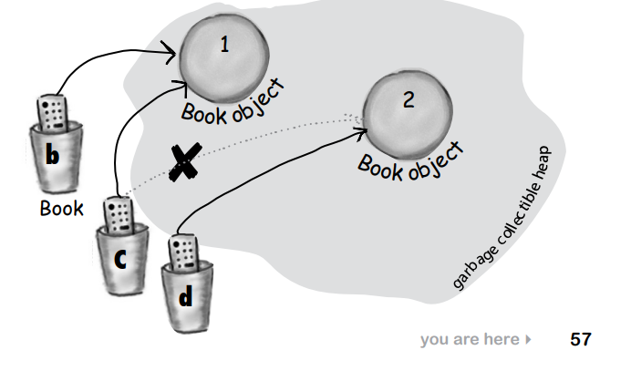

### Life and death on the heap

```
Book b = new Book();
Book c = new Book();
```

References : 2

Objects : 2

Şimdi 2 book object'i heap'de yaşıyor

```
b = c;
```

variable c'nin değerini variable b'ye atayın. variable c içindeki bitler kopyalanır ve bu yeni kopya variable b'ye
yerleştirilir. Her iki variable de aynı değeri tutar. Hem b hem de c aynı nesneye işaret eder. 1. nesne terk edilir ve
Garbage Collection (GC) için uygun hale gelir.

Active References : 2

Reachable Objects : 1

Abandoned Objects : 1

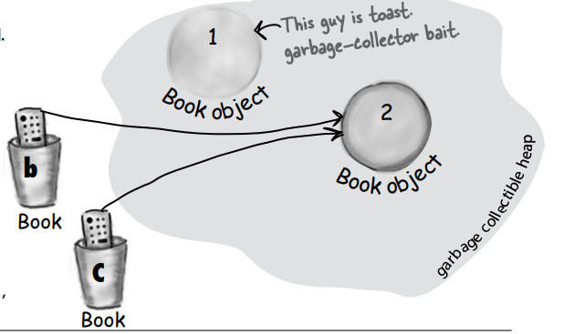

```
c = null;
```

variable c'ye null değerini atayın. Bu, c'nin hiçbir şeye işaret etmeyen bir null referansı olduğu anlamına gelir. Ancak
hala bir referans variable'idir ve başka bir Book nesnesi hala ona atanabilir. 2. nesnenin hala aktif bir referansı (b)
vardır ve bu referans olduğu sürece nesne GC için uygun değildir.

Active References : 1

null References : 1

Reachable Objects : 1

Abandoned Objects : 1

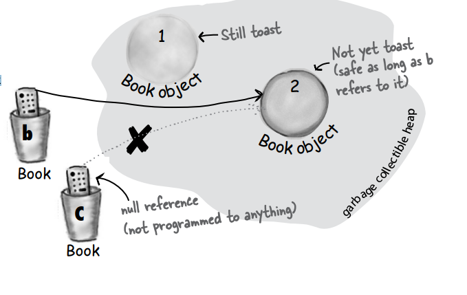

### An array is like a tray of cups

1 - Bir int array'i variable'i declare edin ``ìnt[] nums;``

2 - 7 uzunluğunda bir int array'i oluşturun ve daha önce bildirilen ``ìnt[] nums`` variable'ina
atayın ```nums = new int[7];```

3 - Array'deki her öğeye bir int değeri verin. Int array'i içerisinde ki element'lerin hepsi int olmalıdır

```
nums[0] = 5;
nums[1] = 4;
nums[2] = 1;
nums[3] = 44;
nums[4] = 21;
nums[5] = 52;
nums[6] = 12;
```

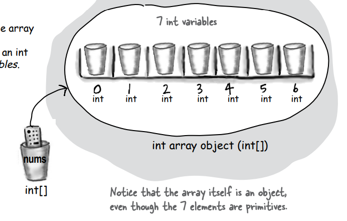

### Arrays are objects too

Java standart kütüphanesi, map, tree ve set gibi sofistike veri yapılarını içerir Ancak arrayler, hızlı, sıralı ve
verimli bir şeyler listesine ihtiyaç duyduğunuzda harikadır.

Arrayler, herhangi bir elemana erişmek için bir index konumunu kullanmanıza izin vererek hızlı rastgele erişim sağlar.
Bir array'deki her bir eleman sadece bir variable'dir. Başka bir deyişle, sekiz temel variable türünden (büyük tüylü
köpek düşünün) biri veya bir referans variable'i olabilir. O tür bir variable'a atayabileceğiniz her şey, o tür bir
array öğesine atanabilir. Bu nedenle int türünde bir dizi (int[]), her bir eleman bir int değerini tutabilir. Bir Dog
array'inde (Dog[]), her bir eleman bir Dog mu tutabilir? Hayır, unutmayın ki bir referans variable'i sadece bir
referansı (bir uzaktan kumandayı) tutar, nesnenin kendisini değil. Bu nedenle bir Dog array'inde, her bir eleman bir
Dog'un uzaktan kumandasını tutabilir. Tabii ki, hala Dog nesnelerini oluşturmamız gerekiyor...

Yukarıdaki resimdeki önemli bir noktayı fark ettiğinizden emin olun - array, primitive türlerin bir array'i olsa bile
bir nesnedir. Array'ler her zaman nesnelerdir, primitive türleri veya nesne referanslarını tutacak şekilde bildirilseler
bile. Ancak primitive değerleri tutacak şekilde bildirilen bir array nesnesi olabilir. Başka bir deyişle, array nesnesi,
primitive değerlere sahip elemanlara sahip olabilir, ancak array kendisi asla primitive bir tür değildir. Array'in neyi
tuttuğuna bakılmaksızın, array kendisi her zaman bir nesnedir!

### Make an array of Dogs

1 - Dog array variable'ini declare et ```Dog[] pets;```

2 - 7 uzunluğunda bir Dog array'i oluşturun ve daha önce bildirilen ``Dog[] pets`` variable'ina
atayın ```pets = new Dog[7];```

Ne kayıp? Dogs bir arrayimiz var.Ama gercek Dog object'leri degiller

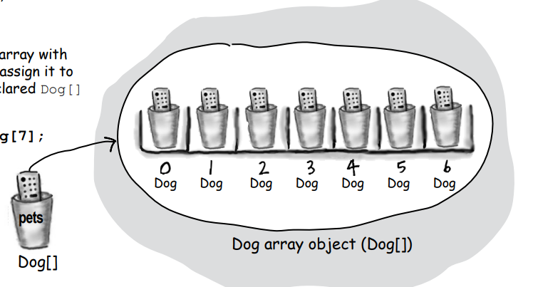

3 - Yeni bir Dog object'i create et ve array element'i olarak assign et. Unutma Dog array'inin element'leri sadece Dog
reference variables'larıdır. Halen Dogs'a ihtiyacımız var

```
pets[0] = new Dog();
pets[1] = new Dog();
```

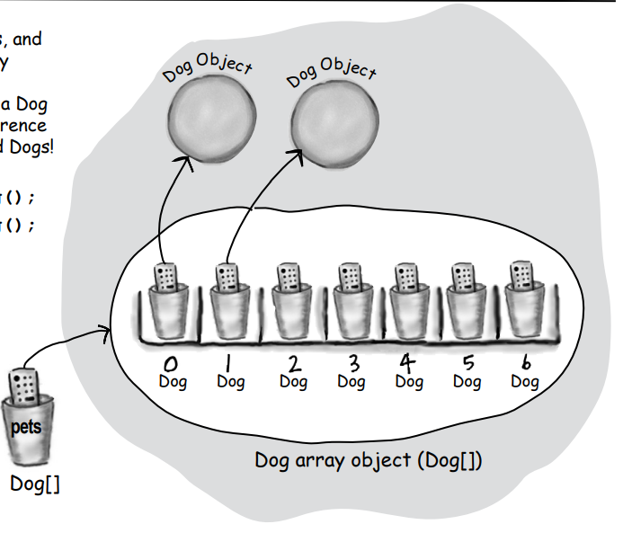

### Control your Dog (with a reference variable)

```
Dog fido = new Dog();
fido.name = "Fido";
fido.bark();
fido.chaseCat();
fido.eat();
```

Bir Dog nesnesi oluşturduk ve referans variable "fido" üzerinde nokta operatörünü kullanarak ad variable'ina eriştik.
"fido" referansını kullanarak Dog'u bark(), eat() veya chaseCat() için kullanabiliriz.

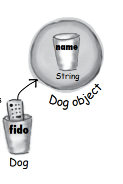

### What happens if the Dog is in a Dog array?

Bir array'de bulunan bir Dog nesnesinin instance variable'larına ve methodlarına nokta operatörünü kullanarak
erişebiliriz, ancak bunu hangisi üzerinde yapıyoruz?

Dog bir Array'de olduğunda, gerçek bir variable adı (örneğin fido gibi) kullanmıyoruz. Bunun yerine array notation'ını
kullanarak ve Array'deki belirli bir indexteki (konumdaki) nesne üzerindeki uzaktan kumanda düğmesine (nokta operatörü)
basıyoruz.

```
Dog[] dogs = new Dog[3];
dogs[0] = new Dog();
dogs[0].name = "fido";
dogs[0].bark();
```

Java, tipe önem verir. Bir array'i bildirdikten sonra, sadece bildirilen array türüne ait öğeleri array'e
koyabilirsiniz. Örneğin, bir Kedi'yi bir Köpek array'ine koyamazsınız. Ve bir double'ı bir int array'ine koyamazsınız (
dökülme hatırlayın?). Ancak, bir byte'ı bir int dizisine koyabilirsiniz, çünkü bir byte her zaman bir int boyutundaki
bir fincana sığar. Bu, bir genişleme olarak bilinir. Ayrıntılara daha sonra gireceğiz, şimdilik sadece derleyicinin,
array'in bildirilen türüne dayanarak yanlış bir şeyi array'e koymamanıza izin vermeyeceğini hatırlayın.

### Using references

```
public class Dog {
    String name;

    public static void main(String[] args) {
        Dog dog1 = new Dog();
        // bark methodu name variable'i set edilmeden once cagirildigindan dolayi null ciktisi uretecektir
        dog1.bark();
        dog1.name = "Bart";

        // Dog array'ini create et
        Dog[] myDogs = new Dog[3];
        // icerisine Dog'lari ekle
        myDogs[0] = new Dog();
        myDogs[1] = new Dog();
        myDogs[2] = dog1;

        // array icerisinde ki Dog reference'larına eris
        myDogs[0].name = "Fred";
        myDogs[1].name = "Marge";

        // array'in icerisinde ki [2] numarali index'teki dog'un name'ini yazdir
        System.out.println("last dog name is " + myDogs[2].name);

        int x = 0;
        // myDogs array'inin length'i kadar dön
        while (x < myDogs.length){
            myDogs[x].bark();
            x += 1;
        }
    }
    void bark(){
        System.out.println(name + " says ruff!");
    }
}
```

**Bullet Points**

Variable'ler iki türde gelir: ilkel (primitive) ve referans.

* variable'ler her zaman bir isim ve bir type ile bildirilmelidir.
* Bir primitive variable'in değeri, değeri temsil eden bitlerdir (5, 'a', true, 3.1416 vb.).
* Bir referans variable'in değeri, heap'de bulunan bir nesneye ulaşmanın bir yolunu temsil eden bitlerdir.
* Bir referans variable'i, bir uzaktan kumandaya benzer. Bir referans variable'i üzerinde nokta operatörünü (.)
  kullanmak, bir uzaktan kumandadaki bir düğmeye basmak gibi bir şeydir ve bir methoda veya instance variable'a erişmek
  için kullanılır.
* Bir referans variable'i, herhangi bir nesneye referans yapmıyorsa null değerine sahiptir.
* Bir array her zaman bir nesnedir, hatta array primitive türleri tutacak şekilde bildirilmiş olsa bile. Primitive bir
  array diye bir şey yoktur, yalnızca primitive türleri tutan bir array vardır.

**EXERCISES :**

```
public class Books {
    String title;
    String author;
}
```

```
public class BooksTestDrive {
    public static void main(String[] args) {
        Books[] myBooks = new Books[3];

        myBooks[0] = new Books();
        myBooks[0].title = "The Grapes of java";
        myBooks[0].author = "bob";

        myBooks[1] = new Books();
        myBooks[1].title = "Thats java";
        myBooks[1].author = "sue";

        myBooks[2] = new Books();
        myBooks[2].title = "Go lang";
        myBooks[2].author = "ian";

        int x = 0;
        while (x < myBooks.length) {
            System.out.println("Book title : " + myBooks[x].title);
            System.out.println("Book author : " + myBooks[x].author);
            x += 1;
        }
    }
}
```

Hobbits.class;

```
public class Hobbits {
    String name;

    public static void main(String[] args) {
        Hobbits[] hobbits = new Hobbits[3];
        int x = -1;
        while (x < 2) {
            x += 1;
            hobbits[x] = new Hobbits();
            hobbits[x].name = "sam";
            if (x == 1) {
                hobbits[x].name = "frodo";
            }
            if (x == 2) {
                hobbits[x].name = "bilbo";
            }
            System.out.println(hobbits[x].name + " is a good hobbit name");
        }
    }
}
```