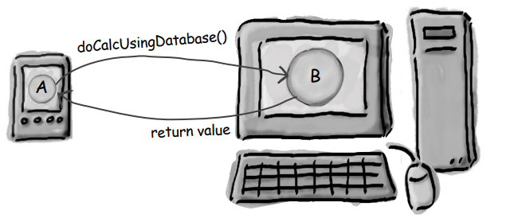
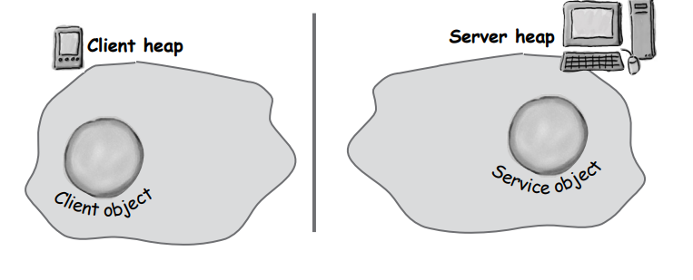
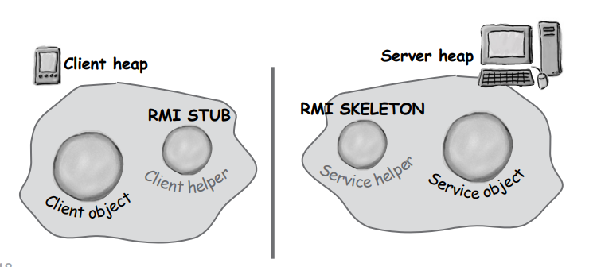

# Remote Deployment with RMI

## Distributed Computing

Uzakta olmak her zaman kötü bir şey olmak zorunda değildir. Elbette implementation'ınınızın tüm parçaları aynı yerde,
aynı
bellekte, hepsini yöneten bir JVM ile olduğunda işler daha kolay olur. Ancak bu her zaman mümkün veya istenilen bir
durum değil. Uygulamanız güçlü hesaplamaları yönetiyorsa ama son kullanıcılar zayıf bir Java destekli cihazda
bulunuyorsa ne olacak? Uygulamanız veritabanından veri gerektiriyorsa, ancak güvenlik nedenleriyle veritabanına yalnızca
sunucunuzdaki kod erişebiliyorsa ne yapacaksınız? Büyük bir e-ticaret altyapısını düşünün ki bu, bir işlem yönetim
sistemi içinde çalışmak zorunda olsun. Bazen implementation'ınınızın bir kısmı sunucuda çalışmalıdır, diğer bir kısmı (
genellikle
bir client) farklı bir makinede çalışmalıdır. Bu bölümde, Java'nın inanılmaz derecede basit Uzaktan Yöntem Çağrısı (
RMI) teknolojisini nasıl kullanacağımızı öğreneceğiz. Ayrıca Servletler, Enterprise Java Beans (EJB) ve Jini'ye kısa bir
göz atacağız ve EJB ve Jini'nin RMI'ye nasıl bağımlı olduğuna bakacağız. Kitabı, Java'da yapabileceğiniz en harika
şeylerden birini yazarak tamamlayacağız: evrensel bir service browser.

### Method calls are always between two objects on the same heap.


Bu kitap boyunca, şimdiye kadar çağırdığımız her method, çağrıyı yapan nesneyle aynı sanal makinede çalışan bir nesnede
gerçekleşti. Başka bir deyişle, çağıran nesne ve çağrılan nesne (methodu çağırdığımız nesne) aynı bellekte yer
almaktadır.


Çoğu implementation'ınıda bir nesnenin başka bir nesnede bir methodu çağırdığında, her iki nesne de aynı bellekte
bulunur. Başka
bir deyişle, her ikisi de aynı JVM içinde çalışır.

```
class Foo {
    void go() {
        Bar b = new Bar();
        b.doStuff();
    }
    public static void main (String[] args) {
        Foo f = new Foo();
        f.go();
    }
}
```

Yukarıdaki kod örneğinde, f tarafından temsil edilen Foo instance'i ve b tarafından temsil edilen Bar nesnesinin aynı
bellekte, aynı JVM tarafından çalıştığı bilinir. Unutmayın, JVM, referans değişkenine nasıl ulaşılacağını temsil eden
bitleri doldurmakla sorumludur. JVM her zaman her bir nesnenin nerede olduğunu ve nasıl ulaşılacağını bilir. Ancak JVM,
sadece kendi bellek alanındaki referanslardan haberdar olabilir! Örneğin, bir makinede çalışan bir JVM, farklı bir
makinede çalışan bir JVM'in bellek alanı hakkında bilgi sahibi olamaz. Aslında, bir makinede çalışan bir JVM, aynı
makinede çalışan farklı bir JVM hakkında herhangi bir şey bilemez. JVM'lerin aynı fiziksel makinede mi yoksa farklı
makinelerde mi olduğunun bir önemi yoktur; önemli olan iki JVM'nin, iki farklı JVM çağrısının olmasıdır.

### What if you want to invoke a method on an object running on another machine?

Başka bir makineden başka bir makineye bilgi nasıl ileteceğimizi biliyoruz - Soketler ve I/O kullanarak. Başka
bir makineye bir Soket bağlantısı açarız, bir OutputStream alır ve veri yazarız. Peki ya aslında başka bir makinede
çalışan bir şeyin bir methodunu çağırmak istesek... başka bir JVM mi? Tabii ki her zaman kendi protokolümüzü
oluşturabilir ve bir Server Soketi'ne veri gönderdiğinizde server bunu ayrıştırabilir, ne demek istediğinizi
anlayabilir, işlemi yapabilir ve sonucu başka bir stream'de geri gönderebilir. Ancak ne kadar zahmetli bir iş. Düşünün,
başka bir makinedeki nesneye referans alıp bir methodu çağırmak ne kadar güzel olurdu.


Big olanın Little olan için sahip olduğu bir şey var. Hesaplama gücü. Little olan, Big olanın ağır hesaplamaları
yapabilmesi için bazı verileri Big olana göndermek istiyor. Little olan, sadece bir method çağırmak istiyor...

```double doCalcUsingDatabase(CalcNumbers numbers)```

ve sonucu geri almak istiyor. Peki, Little olan nasıl Big olanın bir nesnesine referans alabilir?

### Object A, running on Little, wants to call a method on Object B, running on Big.

Sorun şu ki, bir makinedeki bir nesnenin (yani farklı bir bellek/JVM) başka bir makinedeki bir methodu nasıl
çağırabileceğidir?



### But you can’t do that.

Aslında, doğrudan değil. Başka bir heap'teki bir nesneye referans alamazsınız. Eğer şunu söylerseniz:

```Dog d = ???```

d'nin işaret ettiği şey, statement'i çalıştıran kod ile aynı bellek alanında olmalıdır. Ancak, Sockets ve I/O
kullanarak (başka bir makinede çalışan bir nesnenin üzerinde bir method çağrısı yapma amacınızı ileten) bir şey
tasarlamak istediğinizi hayal edin. Ancak hala sanki local bir method çağrısı yapıyormuşsunuz gibi hissediyorsunuz.
Başka bir deyişle, remotetaki bir nesne üzerinde bir method çağrısı yapmak istiyorsunuz (yani başka bir bellekte bulunan
bir nesne), ancak local bir nesne üzerinde bir method çağrısı yaptığınızı varsayan bir kod ile bunu yapmak istiyorsunuz.
Sıradan bir günlük method çağrısının kolaylığı, ancak remotetan method çağrısının gücü. İşte hedefimiz bu.

İşte size RMI (Remote Method Invocation) bunu sağlıyor! Ancak bir adım geri çekilip, RMI'yi kendiniz tasarlasaydınız
nasıl tasarlayacağınızı hayal edin. Kendiniz yapmanız gerekeni anlamak, RMI'nin nasıl çalıştığını öğrenmenize yardımcı
olacaktır.

### A design for remote method calls

Dört şey oluşturmanız gerekiyor: server, client, server helper, client helper.

1 - Client ve server implementation'ınılarını oluşturun. Server app, client'in çağırmak istediği methodu içeren bir
nesneye sahip
olan remote service'i temsil eder.



2 - Client ve server helper'ları oluşturun. Bu helper'lar, düşük seviye ağ ve I/O ayrıntılarını yönetecek ve client ve
service'inizin sanki aynı bellekteymiş gibi davranmasını sağlayacaktır.


### The role of the ‘helpers’

Helper'lar, iletişimi gerçekleştiren nesnelerdir. Client'in, sanki local bir nesne üzerinde bir method çağrısı
yapıyormuş gibi davranmasını sağlarlar. Aslında öyle. Client, client helper'ında bir method çağrısı yapar, adeta
client helper gerçek service gibiymiş gibi. Client helper, Gerçek Şey için bir proxy'dir. Başka bir deyişle, client
nesnesi, remote service üzerinde bir method çağırdığına inanır, çünkü client helper service nesnesini taklit ediyor.
Client'in çağırmak istediği methoda sahip şeyi taklit ediyor!

Ancak client helper'ı gerçekten remotetaki service değil. Client helper'ı bu gibi davranır (çünkü service'in tanıtımını
yapan aynı methoda sahiptir), ancak client helper'ının client'in beklediği gerçek method mantığı yoktur. Bunun
yerine client helper'ı, server ile iletişime geçer, method çağrısı hakkında bilgi aktarır (örneğin, method adı,
argümanlar vb.) ve sunucudan bir yanıt bekler.

Sunucu tarafında, service helper'ı client helper'ından gelen isteği alır (Soket bağlantısı aracılığıyla), çağrı
hakkındaki bilgileri açar ve ardından gerçek methodu gerçek service nesnesi üzerinde çağırır. Dolayısıyla service
nesnesi için çağrı local'dir. Bu, service helper'ından, remotetaki bir client değil, service helper'ından geliyor gibi
görünür.

Service helper'ı service'ten dönüş değerini alır, paketler ve output stream üzerinden client helper'ına geri gönderir.
Client helper'ı bilgiyi açar ve değeri client nesneye döndürür.

Client nesneniz, remote method çağrıları yapar gibi davranma fırsatına sahiptir. Ancak gerçekte yaptığı şey, Soketler ve
stream'lerin tüm düşük seviye ayrıntılarını yöneten heap local bir 'proxy' nesnesi üzerinde method çağırmaktır.


Client nesnesi, gerçek Service ile iletişim kuruyormuş gibi düşünür. Client helper'ının aslında gerçek işi yapabilen şey
olduğunu düşünür.

Client helper service gibi davranır, ancak aslında sadece Gerçek Şey için bir proxy'dir.

Service helper, client helper'dan gelen request'i alır, açar ve Gerçek Service üzerindeki methodu çağırır.

Service nesnesi GERÇEK Service'dir. Gerçekte işi yapan methoda sahip olan nesnedir.

### How the method call happens

1 - Client nesnesi, client helper nesnesi üzerinde doBigThing() methodunu çağırır.


2 - Client helper, çağrıyla ilgili bilgileri (argümanlar, method adı, vb.) paketler ve ağı kullanarak service helper'a
gönderir.


3 - Service helper, client helper'dan gelen bilgileri açar, hangi methodu çağıracağını bulur (ve hangi nesne
üzerinde çağıracağını) ve gerçek service nesnesi üzerinde gerçek methodu çağırır.


### Java RMI gives you the client and service helper objects!

Java'da, RMI (Uzaktan Yöntem Çağrısı) sizin için client ve service helper nesnelerini oluşturur ve hatta client
helper'ın Gerçek Service gibi görünmesini sağlar. Başka bir deyişle, RMI, client helper nesnesine, remote
service'de çağırmak istediğiniz aynı methodları vermek için ne yapılacağını bilir. Ayrıca, RMI, client'in client helper'
ını (Gerçek Service'in proxy'si) bulup alabilmesi için bir arama service'i de dahil olmak üzere işlem sırasındaki tüm
altyapıyı sağlar.

RMI ile ağ ve I/O kodları yazmazsınız. Client, gerçek service'in sahip olduğu remote methodları (Gerçek Service'de
olanlar) local JVM'sinde çalışan nesnelerdeki normal method çağrıları gibi çağırabilir. Neredeyse.

RMI çağrıları ile local (normal) method çağrıları arasında bir fark vardır. Client için method çağrısının local olduğu
görünse de, client helper'i method çağrısını ağ üzerinden gönderir. Bu nedenle ağ bağlantısı ve I/O kullanılır. Ağ
bağlantısı ve I/O methodları hakkında ne biliyoruz? Risklidir.

Bu methodlar heryerden exception'lar fırlatırlar. Dolayısıyla, client'in riski kabul etmesi gerekir. Client, remote bir
methodu çağırdığında, client'a göre yalnızca local bir çağrı gibi görünen proxy/helper nesnesine yapılan çağrının
aslında Soketler ve stream'ler içerdiğini kabul etmelidir. Client'in orijinal çağrısı local'dir, ancak proxy bunu
remote bir çağrıya dönüştürür. Remote bir çağrı, başka bir JVM üzerindeki bir nesne üzerinde çağrılan bir methodu ifade
eder. Bu çağrıyla ilgili bilgilerin bir JVM'den diğerine nasıl aktarıldığı, helper nesneler tarafından kullanılan
protokole bağlıdır.

RMI ile protokol seçeneğiniz vardır: JRMP veya IIOP. JRMP, RMI'nın 'yerel' protokolüdür, yani yalnızca Java'dan Java'ya
remote çağrılar için tasarlanmıştır. Öte yandan IIOP, CORBA'nın (Ortak Nesne İstek Yönlendirici Mimarisi) protokolüdür
ve
Java nesneleri olmayan şeyler üzerinde remote çağrılar yapmanıza olanak tanır. CORBA genellikle RMI'dan çok daha
zorlayıcıdır, çünkü her iki uçta da Java yoksa, çok fazla çeviri ve dönüşüm yapılması gerekir.

Neyse ki, bizi ilgilendiren şey yalnızca Java'dan Java'ya, bu yüzden sıradan eski ve son derece kolay RMI ile devam
ediyoruz.

### In RMI, the client helper is a ‘stub’ and the server helper is a ‘skeleton’



### Making the Remote Service

Bu, serverda çalışan remote service'i oluşturmanın beş adımının bir genel bakışıdır.

1 - Remote bir interface yaratın : Remote interface, client'in remotely çağrı yapabileceği methodları tanımlar. Client,
servisiniz için polimorfik sınıf türü olarak kullanacağı şeydir. Hem Stub (helper) hem de gerçek service bunu uygular!


* java.rmi.Remote'u extend edin. Remote bir 'marker' interface'dir, yani herhangi bir methodu yoktur. Ancak RMI için
  özel anlam taşır, bu nedenle bu kuralı izlemeniz gerekir. Burada 'extends' ifadesini kullanıyoruz. Bir interface'in
  başka bir interface'i extend etmesine izin verilir. Interface'inizin remote method çağrıları için olduğunu belirtmesi
  gerekmektedir. Bir interface hiçbir şeyi implemente etmez ancak diğer interface'leri extend eder

```public interface MyRemote extends Remote```

* Tüm methodların bir RemoteException fırlattığını declare etme. Remote interface, client'in service için polimorfik tür
  olarak kullandığı interface'dir. Başka bir deyişle, client, remote interface'i implemente eden bir nesne üzerinde
  methodları çağırır. Bu şey elbette stub'dır ve stub ağ ve I/O işlemleri yaparken çeşitli sorunlar ortaya çıkabilir.
  Client, remote exceptionları handling veya declaring kullanarak riskleri kabul etmelidir. Bir interface'deki methodlar
  exception'ları declare ediyorsa, bu türün referansını (interface türü) kullanarak methodları çağıran herhangi bir kod,
  exception'ları handle etmeli veya declare etmelidir.

```
public interface MyRemote extends Remote {
   public String sayHello() throws RemoteException;
}
```

Her remote method çağrısı 'riskli' olarak kabul edilir. Her methodda RemoteException declare etmek, client'in dikkat
etmesini ve işlerin her zaman düzgün gitmeyebileceğini kabul etmesini sağlar.

* Lütfen argümanların ve dönüş değerlerinin primitive türler veya Serileştirilebilir (Serializable) olmasına dikkat
  edin. Remote bir methodun argümanları ve dönüş değerleri ya primitive tipler ya da Serileştirilebilir (Serializable)
  olmalıdır. Bunun nedeni, remote bir methoda gönderilen herhangi bir argümanın paketlenip ağ üzerinden gönderilmesi
  gerekliliğidir ve bu Serileştirme ile yapılır. Aynı durum dönüş değerleri için de geçerlidir. Eğer primitive tipler,
  String'ler ve API'deki çoğu türü (diziler ve koleksiyonlar dahil) kullanıyorsanız, sorun yaşamazsınız. Kendi
  türlerinizi dolaştırıyorsanız, sınıflarınızın Serileştirilebilir (Serializable) interface'ini uyguladığından emin
  olmanız yeterlidir.

```public String sayHello() throws RemoteException;```

2 - Remote Implementation'i yaratın : Bu, Gerçek İşlemi yapan sınıftır. Remote interface'de tanımlanan remote
methodların gerçek implementasyonuna sahiptir. Client'in method çağırmak istediği nesnedir.


* Remote interface'i implemente edin.Service, client'inizin çağıracakları methodlara sahip olan remote interface'i
  implemente etmelidir

```
public class MyRemoteImpl extends UnicastRemoteObject implements MyRemote {
  public String sayHello() {
    return “Server says, ‘Hey’”;
  }
 // more code in class
}
```

Derleyici, implemente ettiğiniz interface'deki tüm methodları implemente ettiğinizden emin olacaktır. Bu durumda,
yalnızca bir tane method bulunuyor.

* UnicastRemoteObject'i extend edin. Bir remote service nesnesi olarak çalışabilmesi için nesnenizin 'being remote' ile
  ilgili bazı işlevselliğe ihtiyacı vardır. En basit yol, UnicastRemoteObject sınıfını (java.rmi.server paketinden)
  extend etmek ve bu sınıfın (üst sınıfınız) işi sizin için yapmasına izin vermektir.

```public class MyRemoteImpl extends UnicastRemoteObject implements MyRemote```

* RemoteException declare eden bir no-arg constructor yazın. Yeni üst sınıfınız olan UnicastRemoteObject, küçük bir
  soruna sahiptir - constructor methodu bir RemoteException fırlatır. Bu durumu ele almanın tek yolu, remote
  implementation'ınınız
  için bir constructor bildirmektir. Böylece RemoteException bildirebileceğiniz bir yeriniz olur. Unutmayın, bir sınıf
  instantiated edildiğinde, üst sınıf constructor'ı her zaman çağrılır. Üst sınıf constructor bir exception
  fırlattığında, yapmanız gereken tek şey kendi constructor'ınızın da bir exception fırlattığını bildirmektir.

```public MyRemoteImpl() throws RemoteException { }```

* RMI registry ile Service'i register edin. Artık remote bir service'iniz olduğuna göre, bu service'i remote clientlara
  kullanılabilir hale getirmeniz gerekiyor. Bunu yapmak için nesneyi instanttiating edip RMI kayıt defterine
  yerleştirirsiniz (bu satırın başarılı olması için RMI kayıt defterinin çalışıyor olması gerekir). Implementation
  nesnesini kaydettiğinizde, RMI sistemi aslında clientn'in gerçekten ihtiyaç duyduğu yerine stub'ı kaydediyor, çünkü
  client gerçekte bunu kullanır. Service'inizi java.rmi.Naming sınıfının static rebind() methodunu kullanarak kaydedin.

```
try {
  MyRemote service = new MyRemoteImpl();
  Naming.rebind(“Remote Hello”, service);
} catch(Exception ex) {...}
```

Service'inize (clientlerin kayıt defterinde bulmak için kullanabileceği bir isim) bir ad verin ve onu RMI kayıt
defterine kaydedin. Service nesnesini bağladığınızda, RMI service'i stubla değiştirir ve stubu kayıt defterine koyar.

3 - stubs ve skeletons'ı 'rmic' kullanarak generate edin : Bunlar client ve server 'helperları'dır. Bu sınıfları
oluşturmanız veya oluşturan kaynak koduna bakmanız gerekmez. Bunlar otomatik olarak yönetilir ve Java geliştirme
kitinizle birlikte gelen 'rmic' aracını çalıştırdığınızda otomatik olarak oluşturulur


* Remote implementation class'ı üzerinde 'rmic' komutunu çalıştır (remote interface üzerinde DEĞİL). Java yazılım
  geliştirme kiti ile gelen rmic aracı, bir service implementation'ınını alır ve stub (proxy) ve skeleton olmak üzere
  iki yeni sınıf oluşturur. Bu, remote implementasyonunuzun adının sonuna _Stub veya _Skel eklenerek yapılan bir
  adlandırma kuralı kullanır. rmic ile diğer seçenekler de bulunmaktadır; skeleton oluşturulmaması, bu sınıfların kaynak
  kodlarını görmek ve hatta IIOP'u protokol olarak kullanmak gibi. İşte burada yaptığımız method, genellikle
  kullandığınız methoddur. Sınıflar mevcut dizine (yani cd komutuyla eriştiğiniz dizine) yerleştirilir. Unutmayın ki
  rmic, implementation sınıfınızı görebilmesi gerekmektedir, bu nedenle muhtemelen rmic'i remote implementasyonunuzun
  bulunduğu dizinde çalıştırırsınız. (Burada, işi basit tutmak için kasıtlı olarak paketler kullanmıyoruz. Gerçek
  Dünya'da, paket dizin yapısını ve fully-qualified adları hesaba katmanız gerekecektir).


4 - RMI Registry (rmiregistry) başlatın : rmiregistry, bir telefon rehberinin beyaz sayfalarına benzer. Kullanıcının
proxy'yi (client stub/helper nesnesi) almak için gittiği yerdir.

* Bir terminal açın ve rmiregistry'i başlatın. rmic'i sınıflarınıza erişimi olan bir dizinden başlattığınıza emin olun.
  En basit yol, sınıflarınızın bulunduğu dizinden başlatmaktır.


5 - Remote Service'i başlatın : Service nesnesini devreye almanız gerekmektedir. Service implementation sınıfınız,
service'in bir instance'ini oluşturur ve onu RMI kayıt defterine kaydeder. Kaydetmek, service'i client'lar için
kullanılabilir hale getirir.

* Başka bir terminal açık ve service'i başlatın. Bu, remote implementation'ınını sınıfınızdaki bir main() methodundan
  veya ayrı bir launcher sınıfından olabilir. Bu basit örnekte, launcher kodu implementation'ının sınıfına, nesneyi
  örneklendiren ve RMI kayıt defterine register eden bir main methodu olarak koyduk.


### Complete code for the server side

* The Remote Interface

```
public interface MyRemote extends Remote {
    public String sayHello() throws RemoteException;
}
```

* The Remote service (the implementation)

```
/* UnicastRemoteObject sınıfını extend etmek, bir remote nesne oluşturmanın en kolay yoludur.*/
public class MyRemoteImpl extends UnicastRemoteObject implements MyRemote {

    /* Üst sınıfın (UnicastRemoteObject için) constructor metodu bir exception declare ediyor, bu nedenle SİZ bir
    constructor metod yazmalısınız, çünkü bu, constructor metodunuzun riskli kodu (üst sınıf constructor'ını) çağırdığı
    anlamına gelir.*/
    public MyRemoteImpl() throws RemoteException {
    }

    /* Tabii ki, tüm interface metodlarını implemente etmemiz gerekiyor. Ancak dikkat edin ki RemoteException'ı
    bildirmeniz gerekmiyor.*/
    @Override
    public String sayHello() throws RemoteException {
        return "Server says 'hi'";
    }

    public static void main(String[] args) {
       try{
           /* Remote nesneyi oluşturun ve ardından onu rmiregistry'ye, static Naming.rebind() kullanarak "bağlayın".
           Kaydettikten sonra, nesneye erişmek isteyen client'ların rmi kayıt defterinde bunu aramak için kullanacağı
           isimdir.*/
           MyRemote service = new MyRemoteImpl();
           Naming.rebind("Remote Hello",service);
       } catch (Exception ex){
           ex.printStackTrace();
       }
    }
}
```

### How does the client get the stub object?

Client, client'ların method çağrıları yapacağı nesneyi almak zorundadır, çünkü bu, client'in method çağrılarını
yapacağı nesnedir. İşte burada RMI kayıt defteri devreye girer. Client, bir "lookup" işlemi gerçekleştirir; adeta bir
telefon rehberinin beyaz sayfalarına bakmak gibi ve temelde "İşte bir isim var, ve o isimle ilişkilendirilmiş olan
stub'ı istiyorum" der.

```MyRemote service = (MyRemote) Naming.lookup(“rmi://127.0.0.1/Remote Hello”);```

Client her zaman service'in türü olarak remote implementation'ı kullanır. Aslında, client'in remote service'inin gerçek
sınıf adını bilmesine hiç gerek yoktur.


1 - Client RMI kayıt defterinde bir arama yapar

```Naming.lookup(“rmi://127.0.0.1/Remote Hello”);```

2 - RMI kayıt defteri stub nesnesini döndürür

(lookup methodunun dönüş değeri olarak) ve RMI, stub'ı otomatik olarak de-serialized eder. Client'izda rmic tarafından
oluşturulan stub sınıfının olması GEREKİR, aksi halde stub de-serialized edilemez.

3 - Client, sanki stub GERÇEK service'miş gibi, stub üzerinde bir method çağrısı yapar.

### How does the client get the stub class?

Şimdi ilginç bir soruya geliyoruz. Her nasılsa, client'in, client tarafından bakıldığında stub SORUN oluşturmayacak
şekilde, lookup işlemi sırasında önceden rmic kullanarak oluşturduğunuz stub sınıfına sahip olması gerekiyor. Aksi
takdirde stub client'da de-serialized edilemez ve tüm işlem bozulur. Basit bir sistemde, stub sınıfını doğrudan client'a
iletebilirsiniz.

Ancak, çok daha etkileyici bir yol var, ancak bu kitabın kapsamının dışında. Yine de ilgilendiğinizden emin olmak için,
daha etkileyici yol "dynamic class downloading" olarak adlandırılır. Dinamik sınıf indirme ile bir stub nesnesi (veya
aslında herhangi bir Serialized nesne), nesnenin sınıf dosyasını client tarafındaki RMI sistemine nereden
bulabileceğini söyleyen bir URL ile "stamped (damgalanır)". Ardından, bir nesneyi de-serialized işlemi sırasında RMI,
sınıfı yerel olarak bulamazsa, bu URL'yi kullanarak HTTP Get işlemi gerçekleştirerek sınıf dosyasını alır. Bu nedenle,
sınıf dosyalarını sunmak için basit bir Web sunucusuna ihtiyacınız olur ve ayrıca client tarafındaki bazı güvenlik
parametrelerini değiştirmeniz gerekir. Dinamik sınıf indirmenin diğer bazı karmaşık konuları olsa da, bu genel bir
bakıştır.

**Complete client code**

```
public class MyRemoteClient {
    public static void main(String[] args) {
        new MyRemoteClient().go();
    }

    private void go() {
        try{
            MyRemote service = (MyRemote) Naming.lookup("rmi://127.0.0.1/Remote Hello");
            String s1 = service.sayHello();
            System.out.println(s1);
        }catch (Exception ex){
            ex.printStackTrace();;
        }
    }
}
```

### Be sure each machine has the class files it needs.

Programcıların RMI ile yanlış yaptığı en üç şey şunlardır:

1 - Remote service'i başlatmadan önce rmiregistry'i başlatmayı unutmak (servisi Naming.rebind() kullanarak
kaydettiğinizde, rmiregistry çalışıyor olmalıdır!)

2 - Argümanları ve dönüş tiplerini serializable yapmayı unutmak (bunu derleyici tespit etmeyecektir; çalışma zamanına
kadar fark etmeyebilirsiniz.)

3 - Stub sınıfını client'a vermeyi unutmak.


--**BULLET POINTS**--

* Heap'te bulunan bir nesne, farklı bir heap'de (farklı bir JVM üzerinde çalışan) bulunan bir nesneye normal bir Java
  referansı elde edemez.
* Java Remote Method Invocation (RMI), sanki remote bir nesnede (yani farklı bir JVM'deki bir nesne) bir method çağrısı
  yapıyormuş gibi görünmesini sağlar, ancak öyle değildir.
* Bir client, remote bir nesnede bir method çağırdığında, client aslında remote nesnenin bir proxy'sinde bulunan bir
  methodu çağırır. Bu proxy'ye 'stub' denir.
* Bir stub, düşük seviye ağ ayrıntılarını (soketler, streamler, serialization vb.) yöneten bir client helper nesnesidir.
  Bu nesne, method çağrılarını paketleyerek server'a iletmekten sorumludur.
* Remote bir service oluşturmak için (başka bir deyişle, remote bir client'in nihayetinde method çağrıları yapabileceği
  bir nesne), remote bir interface'le başlamalısınız.
* Remote bir interface, java.rmi.Remote interface'ini extend etmeli ve tüm methodlar RemoteException declare etmelidir.
* Remote service'iniz, remote interface'ini implemente eder.
* Remote Service'iniz UnicastRemoteObject sınıfını extend etmelidir. (Teknik olarak remote bir nesne oluşturmanın diğer
  yolları da vardır, ancak UnicastRemoteObject'i extend etmek en basit olanıdır).
* Remote service'inizin sınıfının bir constructor'ı olmalıdır ve constructor method RemoteException bildirmelidir (çünkü
  üst sınıf constructor'ı bir RemoteException declare eder).
* Remote service'inizin instance'i oluşturulmalı ve nesne RMI kayıt defterine register edilmelidir.
* Bir remote service'i kaydetmek için, static Naming.rebind("Servis Adı", serviceInstance); kullanılmalıdır.
* Bir remote nesneyi RMI kayıt defterine kaydetmeye çalışmadan önce RMI kayıt defterinin remote service'le aynı makinede
  çalıştığından emin olunmalıdır.
* Client, remote service'inizi static Naming.lookup("rmi://BenimHostAdım/ServisAdı"); kullanarak arar.
* RMI ile ilgili neredeyse her şey RemoteException fırlatabilir (derleyici tarafından denetlenir). Bu, bir service'i
  kaydetme veya kayıt defterinde bir service'i arama işlemlerini ve client'dan stub'a yapılan tüm remote method
  çağrılarını içerir.

### What about Servlets?


Servletler, bir HTTP web sunucusunda çalışan ve onunla birlikte çalışan Java programlarıdır. Bir client, bir web
tarayıcısı kullanarak bir web sayfasıyla etkileşimde bulunduğunda, bir request web sunucusuna geri gönderilir. Request,
bir Java servletinin yardımına ihtiyaç duyarsa, web sunucusu (veya servlet zaten çalışıyorsa çağırır) servlet kodunu
çalıştırır. Servlet kodu, sunucuda çalışan kodu ifade eder ve client'in talebi sonucunda çalışır (örneğin, sunucudaki
bir metin dosyasına veya veritabanına bilgi kaydetmek gibi). Eğer Perl ile yazılmış CGI betiklerini biliyorsanız, tam
olarak ne hakkında konuştuğumuzu anlamışsınızdır. Web geliştiriciler, CGI betikleri veya servletleri, kullanıcı
tarafından gönderilen bilgileri bir veritabanına iletmekten, bir web sitesinin tartışma tahtasını çalıştırmaya kadar her
şey için kullanırlar. Ve hatta servletler RMI kullanabilir!

Bugüne kadar, J2EE teknolojisinin en yaygın kullanımı, servletleri ve EJB'leri bir araya getirmektir, burada servletler
EJB'nin client'idir. Ve o durumda, servletler EJB'lerle iletişim kurmak için RMI kullanmaktadır. (Ancak EJB ile RMI
kullanma şekli, yukarıda incelediğimiz süreçten biraz farklıdır.)

1 - Client bir registration formu doldurur ve 'submit' buttonuna tıklar. HTTP sunucusu (yani web sunucusu) request'i
alır, bunun bir servlet için olduğunu görür ve isteği servlet'e gönderir.


2 - Servlet (Java kodu) çalışır, veritabanına veri ekler, bir web sayfasını (özel bilgilerle) oluşturur ve bunu client'a
geri gönderir, client'in tarayıcısında görüntülenir.


### Steps for making and running a servler

1 - Servlet'lerinizin nereye yerleştirilmesi gerektiğini öğrenin. Bu örnekler için, zaten çalışan bir web sunucunuzun
olduğunu ve servletleri desteklemek üzere yapılandırıldığını varsayalım. En önemli şey, sunucunuzun bu sınıf dosyalarını
görmesi için nereye yerleştirilmesi gerektiğini kesin olarak belirlemektir. Bir İnternet Hizmet Sağlayıcısı (ISP)
tarafından barındırılan bir web siteniz varsa, barındırma servicei size servletlerinizi nereye koymaları gerektiğini CGI
betiklerinizi nereye koymaları gerektiği söyleyebilirler.

2 - servlets.jar dosyasını alın ve classpath'e ekleyin. Servletler, standart Java kütüphanelerinin bir parçası değildir;
servlet sınıfları servlets.jar dosyasına paketlenmelidir. Servlet sınıflarını java.sun.com'dan indirebilir veya Java
yetenekli bir web sunucusundan (örneğin apache.org sitesindeki Apache Tomcat gibi) alabilirsiniz. Bu sınıflar olmadan
servletlerinizi derleyemezsiniz.

3 - HttpServlet'i extend ederek bir servlet sınıfı yazın. Bir servlet, sadece HttpServlet'i (java.servlet.http
paketinden) extend eden bir Java sınıfıdır. Başka türde servletler de oluşturabilirsiniz, ancak genellikle sadece
HttpServlet'i önemseriz.

```public class MyServletA extends HttpServlet{...}```

4 - Servletinizi çağıran bir html sayfası yazın.Kullanıcı bir bağlantıya tıkladığında ve bu bağlantı servletinizi işaret
ediyorsa, web sunucusu servleti bulur ve HTTP komutuna (GET, POST vb.) bağlı olarak ilgili methodu çağırır.

```<a href="servlets/MyServletA"> This is the most amazing servlet </a>```

5 - Servlet'inizi ve HTML sayfanızı sunucunuz için kullanılabilir hale getirin. Bu tamamen web sunucunuza bağlıdır (daha
spesifik olarak, hangi Java Servlets sürümünü kullandığınıza bağlıdır). İnternet Hizmet Sağlayıcınız, sadece onu web
sitenizin bir "Servlets" dizinine koymak için size talimat verebilir. Ancak, diyelim ki en son Tomcat sürümünü
kullanıyorsanız, servleti (ve web sayfasını) doğru konuma yerleştirmek için daha fazla iş yapmanız gerekebilir.

### A Very simple Servlet

```
public class MyServletA extends HttpServlet {
    /* Web sunucusu bu methodu çağırır, client'in request'ini size iletir (bu request'i veriden çıkarabilirsiniz) ve
    bir 'response' nesnesi sunar. Bu nesneyi kullanarak bir yanıtı (bir sayfa) geri gönderirsiniz.*/
    @Override
    protected void doGet(HttpServletRequest req, HttpServletResponse response) throws ServletException, IOException {
        /* Bu, sunucuya (ve tarayıcıya) bu servletin çalıştırılması sonucunda server'dan dönen 'şey'in ne türde
        olduğunu belirtir.*/
        response.setContentType("text/html");
        /* Response nesnesi bize bir output stream verir, böylece bilgiyi geri yazabiliriz.*/
        PrintWriter out = response.getWriter();
        String message = "If you’re reading this, it worked!";
        
        /* Yazdığımız şey bir HTML sayfasıdır! Sayfa, server aracılığıyla tarayıcıya iletildi, tamamen normal bir HTML 
        sayfası gibi, sadece bu şimdiye kadar var olmayan bir sayfadır. Başka bir deyişle, bu bilgileri içeren herhangi 
        bir .html dosyası yoktur.*/
        out.println("<HTML><BODY>");
        out.println("<H1>” + message + “</H1>");
        out.println("</BODY></HTML>");
        out.close();
    }
}
```

### HTML page with a link to this servlet

```
<HTML>
 <BODY>
 <a href=”servlets/MyServletA”>This is an amazing servlet.</a>
 </BODY>
</HTML>
```

--**DIALOGS**--

Q : JSP nedir ve servletlerle nasıl bir ilişkisi vardır?

A : JSP, Java Server Pages'ın kısaltmasıdır. Sonuç olarak, web sunucusu bir JSP'yi bir servlet haline getirir,
ancak bir servlet ile bir JSP arasındaki farkı geliştiricinin aslında ne yarattığı belirler. Bir servlet ile,
output statements'la (clientye bir HTML sayfası gönderiyorsanız) HTML içeren bir Java sınıfı yazarsınız. Ancak bir JSP
ile durum tam tersidir - Java kodu içeren bir HTML sayfası yazarsınız!

Bu size, Java kodunu (ve çalışma zamanında Java kodunu "trigger eden" diğer tag'ları) içeren normal bir HTML sayfası
olarak sayfa yazma yeteneği verir; böylece Java kodu çalışma zamanında işlenir. Başka bir deyişle, sayfanın bir bölümü,
Java kodu çalıştığında çalışma zamanında özelleştirilir.

JSP'nin regular servletlere göre temel avantajı, servletin HTML kısmını bir JSP sayfası olarak yazmanın, servletin
yanıtındaki zorlu yazdırma ifadelerinde HTML yazmaktan çok daha kolay olmasıdır. Makul derecede karmaşık bir HTML
sayfasını hayal edin ve şimdi onu println ifadeleri içinde biçimlendirmeyi düşünün. Korkunç!
Ancak birçok uygulama için JSP kullanmak gerekli değildir çünkü servletin dinamik bir yanıt göndermesi gerekmez veya
HTML o kadar karmaşık değildir. Ayrıca, hala birçok web sunucusu servletleri destekliyor ancak JSP'leri desteklemiyor,
bu yüzden sıkışıp kalabilirsiniz.

JSP'lerin başka bir avantajı da, Java geliştiricilerin servletleri yazmasını ve web sayfası geliştiricilerin JSP'leri
yazmasını sağlayarak işi ayırabilmenizdir. Bu en azından vaat edilen avantajdır. Gerçekte, bir JSP yazan herkes için
hala bir Java öğrenme eğrisi (ve bir etiket öğrenme eğrisi) vardır, bu nedenle bir HTML web sayfası tasarımcısının
sıfırdan JSP'ler yazabileceğini düşünmek gerçekçi değildir. İyi haber şu ki, yazarlık araçları ortaya çıkmaya başladı ve
bu araçlar web sayfası tasarımcılarının kodu sıfırdan yazmadan JSP'ler oluşturmalarına yardımcı oluyor.

Q : Servletler hakkında söyleyecekleriniz bu kadar mı? Böyle bir şeyden sonra RMI'da büyük bir şey mi?

A : Evet. RMI, Java dilinin bir parçasıdır ve RMI için tüm sınıflar standart kütüphanelerde bulunur. Servletler ve
JSP'ler Java dilinin bir parçası değildir; bunlar standart uzantılar olarak kabul edilir. RMI'yı herhangi bir modern JVM
üzerinde çalıştırabilirsiniz, ancak Servletler ve JSP'ler, bir servlet "konteyneri" içeren düzgün yapılandırılmış bir
web sunucusu gerektirir.

### Just for fun, let’s make the Phrase-O-Matic work as a servlet

Şimdi, servletler hakkında daha fazla konuşmayacağımızı söyledikten sonra, baştan 1. bölümdeki "Phrase-O-Matic"i servlet
olarak kullanmaktan (evet, fiil olarak kullanabiliyoruz) kendimizi alamıyoruz. Bir servlet hala sadece Java'dır. Ve Java
kodu, diğer sınıflardaki Java kodunu çağırabilir. Bu nedenle, bir servlet, Phrase-O-Matic üzerinde bir method çağırmak
için özgürdür. Yapmanız gereken tek şey, Phrase-O-Matic sınıfını servletinizle aynı dizine koymak ve işlem yapmaktır.

PhraseOMatic class;

Bu, birinci bölümdeki koddan biraz farklı bir sürümdür. Orijinalinde, tüm işlemi bir main() methodu içinde çalıştırdık
ve her seferinde komut satırında yeni bir cümle üretmek için programı yeniden çalıştırmak zorunda kaldık. Bu sürümde,
kod sadece static makePhrase() methodunu çağırdığınızda bir String (cümle ile) döndürür. Bu şekilde, methodu herhangi
başka bir koddan çağırabilir ve rastgele oluşturulmuş cümle ile bir String alabilirsiniz.
Lütfen bu uzun String[] dizisi atamalarının kelime işlemeye kurban gittiğini unutmayın - tireleri yazmayın! Sadece
yazmaya devam edin ve kod düzenleyicinizin satır sonlandırmayı otomatik olarak yapmasına izin verin. Ve ne yaparsanız
yapın, bir String içinde (örneğin çift tırnaklar arasında bir şey) ortasında yeni satır tuşuna basmayın.

```
public class PhraseOMatic {
    public static String makePhrase() {
        // make three sets of words to choose from
        String[] wordListOne = {"24/7", "multi-Tier", "30,000 foot", "B-to-B", "win-win", "frontend", "web-based",
                "pervasive", "smart", "six-sigma", "critical-path", "dynamic"};
        String[] wordListTwo = {"empowered", "sticky", "valued-added", "oriented", "centric","distributed", "clustered",
                "branded", "outside-the-box", "positioned", "networked", "focused", "leveraged", "aligned", "targeted",
                "shared", "cooperative", "accelerated"};
        String[] wordListThree = {"process", "tipping point", "solution", "architecture","core competency", "strategy",
                "mindshare", "portal", "space", "vision", "paradigm", "mission"};

        // fnd out how many words are in each list
        int oneLength = wordListOne.length;
        int twoLength = wordListTwo.length;
        int threeLength = wordListThree.length;

        // generate three random numbers, to pull random words from each list
        int rand1 = (int) (Math.random() * oneLength);
        int rand2 = (int) (Math.random() * twoLength);
        int rand3 = (int) (Math.random() * threeLength);

        // now build a phrase
        String phrase = wordListOne[rand1] + " " + wordListTwo[rand2] + " " +
                wordListThree[rand3];

        // now return it
        return ("What we need is a " + phrase);
    }
}
```

KathyServlet class;

```
public class KathyServlet extends HttpServlet {
    public void doGet(HttpServletRequest request, HttpServletResponse response)
            throws IOException {
        String title = "PhraseOMatic has generated the following phrase.";
        response.setContentType("text/html");
        PrintWriter out = response.getWriter();
        
        out.println("<HTML><HEAD><TITLE>");
        out.println("PhraseOmatic");
        out.println("</TITLE></HEAD><BODY>");
        out.println("<H1>" + title + "</H1>");
        out.println("<P>" + PhraseOMatic.makePhrase());
        out.println("<P><a href=\"KathyServlet\">make another phrase</a></p>");
        out.println("</BODY></HTML>");

        out.close();
    }
}
```

### Enterprise JavaBeans: RMI on steroids

RMI, remote service'ler yazmak ve çalıştırmak için harikadır. Ancak, Amazon veya eBay gibi bir şeyi yalnızca RMI
üzerinde çalıştırmazdınız. Büyük, son derece ciddi bir kurumsal uygulama için daha fazlasına ihtiyacınız var.
Transaction'ları, yoğun concurrency sorunlarını (organik köpek maması satın almak için sunucunuza aynı anda milyonlarca
kişi erişiyor gibi), güvenliği (sadece herhangi birinin maaş veritabanınıza erişmemesi gerekmektedir) ve veri yönetimini
yönetebilecek bir şeye ihtiyacınız var. Bu, bir kurumsal uygulama sunucusuna ihtiyaç duyulduğu anlamına gelir.
Java'da, bu Java 2 Enterprise Edition (J2EE) sunucusu anlamına gelir. Bir J2EE sunucusu hem bir web sunucusunu hem de
bir Enterprise JavaBeans (EJB) sunucusunu içerir, böylece hem servletleri hem de EJB'leri içeren bir uygulamayı
dağıtabilirsiniz. Servletler gibi, EJB bu kitabın kapsamının ötesindedir ve kodla "sadece biraz" EJB örneği göstermek
mümkün değildir, ancak nasıl çalıştığına hızlı bir bakış atacağız.

Bir EJB sunucusu, düz RMI ile elde edemediğiniz bir dizi service ekler. Transaction'lar, security, concurrency,
veritabanı yönetimi ve ağ gibi şeyler. Bir EJB sunucusu, bir RMI çağrısının ortasına girer ve tüm bu serviceleri
katmanlar.


### For our final trick... a little Jini

Jini'nin Java'da neredeyse en iyi şey olduğunu düşünüyoruz. Eğer EJB, RMI'nın steroidlerle (bir sürü yöneticiyle
birlikte) güçlendirilmiş haliyse, Jini kanatları olan RMI'dır. Saf Java mutluluğu. EJB malzemesi gibi, burada Jini
ayrıntılarına giremiyoruz, ancak RMI biliyorsanız, yolda üçte ikisinin ilerisindesiniz demektir. Teknoloji açısından en
azından. Zihniyet açısından ise büyük bir sıçrama yapma zamanı geldi. Hayır, uçma zamanı geldi. Jini RMI kullanır (ancak
diğer protokoller de dahil olabilir), ancak size bazı temel özellikler sunar:

Uyarlanabilir keşif (Adaptive discovery)
Kendini iyileştiren ağlar (Self-healing networks)

RMI'yı hatırlayın, client remote service'in adını ve konumunu bilmelidir. Arama işlemi için client kodu, remote
service'in IP adresini veya ana makinesini içerir (çünkü RMI kayıt defteri burada çalışmaktadır) ve service'in
kaydedildiği mantıksal adı içerir.

Ancak Jini ile client'in bilmesi gereken bir şey vardır: service tarafından uygulanan interface! Bu kadar.
Peki nasıl şeyleri bulursunuz? İpucu, Jini arama serviceleri etrafında döner. Jini arama serviceleri, RMI kayıt
defterinden çok daha güçlü ve esnek olabilirler. Bir kere, Jini arama serviceleri kendilerini otomatik olarak ağa
duyururlar. Bir arama service'i çevrimiçi olduğunda, ağına bir mesaj (IP çoklu yayın kullanarak) gönderir ve "Buradayım,
ilgilenen varsa" der.

Ancak işte bununla sınırlı değil. Diyelim ki (bir client olarak), arama service'i zaten kendini duyurduktan sonra
çevrimiçi olursunuz, bütün ağa "Orada herhangi bir arama service'i var mı?" diye bir mesaj gönderebilirsiniz.

Ancak burada asıl ilgilendiğiniz şey arama service'i değil, arama service'ine kaydedilen service'lerdir. RMI remote
service'ler, diğer serializable Java nesneleri ve hatta yazıcılar, kameralar ve kahve makineleri gibi cihazlar gibi
şeyler.

Ve işte işler daha da eğlenceli hale geliyor: bir service çevrimiçi olduğunda, ağdaki herhangi bir Jini arama
service'ini dinamik olarak keşfeder ve kendini kaydeder. Service, arama service'ine kaydolduğunda, bir serialized nesne
gönderir ve bu nesne arama service'ine yerleştirilir. Bu serialized nesne, RMI remote service'ine bir referans, ağdaki
bir cihaz için bir sürücü veya hatta (arama service'inden aldığınızda local olarak çalışır) service'in tamamı olabilir.
Ve service'in adını kaydetmek yerine, service, implemente ettiği interface ile kaydolur.

Bir arama service'ine (client olarak) bir referans aldığınızda, bu arama service'ine "Hey, ScientificCalculator
interface'ini implemente eden bir şeyiniz var mı?" diyebilirsiniz. Bu noktada, arama service'i kayıtlı interface
listesini kontrol eder ve eşleşme bulursa, size "Evet, bu interface'i implement eden bir şeyim var. İşte
ScientificCalculator service'inin bana kaydettiği serialized nesne." diye geri döner.

### Adaptive discovery in action

1 - Jini lookup service, ağın herhangi bir yerinde başlatılır ve IP multicast kullanarak kendini duyurur.


2 - Başka bir makinede zaten çalışan bir Jini service'i, bu yeni duyurulan arama service'ine kaydolmak için talepte
bulunur. Kayıt yaparken ad yerine yeteneğine göre kaydolur. Başka bir deyişle, implemente ettiği service interface'i
olarak kaydolur. Arama service'ine yerleştirilmek üzere serialized bir nesne gönderir.


3 - Ağdaki bir client, ScientificCalculator interface'ini implement eden bir şey istiyor. Bu şeyin nerede olduğunu (veya
var olup olmadığını) bilmiyor, bu nedenle arama service'ine soruyor.


4 - Arama service'i cevap verir, çünkü bir ScientificCalculator interface'i olarak kaydedilmiş bir şeyi bulunmaktadır.


### Self-healing network in action

1 - Bir Jini Service'i, arama service'ine kaydolma isteğinde bulunur. Arama Service'i "lease" olarak adlandırılan bir
yanıt verir. Yeni kaydedilen service, kira süresini sürekli olarak yenilemeli, aksi halde arama Service'i Service'in
çevrimdışı olduğunu varsayar. Arama Service'i, ağın geri kalanına hangi service'lerin mevcut olduğu konusunda her zaman
doğru bir görüntü sunmayı istemektedir.


2 - Service offline olur (birisi onu kapatır), bu nedenle arama Service'iyle kirasını yenileyemez. Arama Service'i
Service'i düşürür.


# Appendix

### Immutability

Neden String'lerin Değişmez (Immutable) Olduğunu Dert Ediyorsunuz?

Java programlarınız büyümeye başladığında, kaçınılmaz olarak bir sürü String nesnesi elde edersiniz. Güvenlik amaçları
ve belleği koruma amaçlı (Java programlarınız küçük Java destekli cep telefonlarında çalışabilir, hatırlatırım)
Java'daki String'ler immutable'dir. Bu ne anlama geliyor derseniz:

```
String s = "0";
for (int i=0;i<10; i++){
    s = s + i;
}
```

Aslında gerçekleşen şu: "0", "01", "012" ve "0123456789" değerlerine sahip on adet String nesnesi oluşturuyorsunuz.
Sonunda s, değeri "0123456789" olan String'e atıfta bulunuyor, ancak bu noktada on tane String mevcut!

Herhangi bir yeni String oluşturduğunuzda, JVM bunu 'String Pool' adı verilen özel bir bellek bölgesine koyar (
rahatlatıcı geliyor, değil mi?). Eğer String Havuzu'nda aynı değere sahip bir String zaten varsa, JVM bir kopya
oluşturmaz, sadece atıfınızı mevcut girdiye yönlendirir. JVM bunu yapabilir çünkü String'ler immutable'dir; bir atıf
immutable bir String'in değerini diğer atıfın aynı String'e atıfta bulunduğu süre boyunca değiştiremez.

String havuzuyla ilgili diğer sorun, Çöp Toplayıcısının buraya gitmemesidir. Bu yüzden örneğimizdeki gibi, sonraki bir
zamanda tesadüfen "01234" adlı bir String oluşturana kadar, örneğimizdeki for döngüsünde oluşturulan ilk dokuz String
sadece belleği boşa harcamak için bekleyecektir.

Bunu nasıl bellek tasarrufu olarak düşünüyorsunuz?
Eğer dikkatli değilseniz, tasarruf sağlamayabilir! Ancak String immutabl durumunun nasıl çalıştığını anlıyorsanız, bazen
bellkte tasarruf etmek için bundan yararlanabilirsiniz.

Ancak çok fazla String manipülasyonu yapmanız gerekiyorsa (birleştirmeler gibi), bu durumda amaç için daha uygun olan
başka bir sınıf olan StringBuilder bulunmaktadır. Birkaç sayfa sonra StringBuilder hakkında daha fazla konuşacağız.

**Neden Wrapper'ların Immutable Olduğunu Dert Ediyorsunuz?**

Matematik bölümünde wrapper sınıfların iki temel kullanımından bahsettik:

• Bir primitive'i sarmalayarak, bir nesneymiş gibi davranabilmesini sağlamak.
• Statik helper methodları kullanmak (örneğin, Integer.parseInt()).

Unutmamanız gereken önemli bir nokta şudur:

```Integer iWrap = new Integer(42);```

Gördüğünüz gibi, bu wrapper nesnesi için işte bu kadar. Değeri her zaman 42 olacaktır. Bir wrapper nesnesi için bir
ayarlayıcı (setter) methodu bulunmamaktadır. Elbette iWrap'i farklı bir wrapper nesnesine yönlendirebilirsiniz, ancak bu
durumda iki nesneniz olur. Bir kez bir wrapper nesnesi oluşturduğunuzda, bu nesnenin değerini değiştirmenin bir yolu
yoktur!


