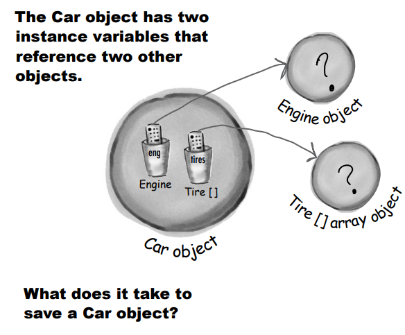

# Serialization and File I/O

Nesneler düzleştirilebilir ve şişirilebilir. Nesnelerin state ve behaviorları vardır. Behavior sınıfta yaşar, ancak
state her bir bireysel nesnenin içindedir. Peki nesnenin state'ini kaydetme zamanı geldiğinde ne olur? Eğer bir oyun
yazıyorsanız, Save/Reload Oyun özelliğine ihtiyacınız olacak. Eğer grafikler oluşturan bir uygulama
yazıyorsanız, Bir Dosya Save/Open özelliğine ihtiyacınız olacak. Programınızın state'ini kaydetmesi gerekiyorsa, bunun
zor yolunu tercih edebilirsiniz; her nesneyi sorgulayarak ardından her birinstance variable'in değerini oluşturduğunuz
bir formatta bir dosyaya zorla yazmak. Veya, bunu kolay Nesne Yönelimli yolunu kullanarak yapabilirsiniz - nesneyi
freeze-dry/flatten/persist/dehydrate engelleyerek ve onu geri almak için yeniden reconstitute/inflate/restore/rehydrate
ederek. Ancak dosyanızın uygulamanız tarafından kaydedildiği ve başka bir Java olmayan uygulama tarafından okunması
gerektiğinde hala bazen zor yolunu yapmanız gerekecektir, bu yüzden bu bölümde her ikisine de bakacağız.

### Capture the Beat

Mükemmel bir desen oluşturdunuz. Deseni kaydetmek istiyorsunuz. Bir kağıt parçası kapıp onu çizmeye başlayabilirsiniz,
ancak bunun yerine Kaydet buttonuna basarsınız (veya Dosya menüsünden Kaydet'i seçersiniz). Sonra ona bir isim verir,
bir arrayn seçersiniz ve eserinizi mavi ölüm ekranıyla pencereden çıkmasından kurtulmuş bir şekilde kaydederken rahat
bir
nefes alırsınız.

Java programınızın stateunu nasıl kaydedeceğiniz konusunda birçok seçeneğiniz vardır ve seçiminiz büyük olasılıkla
saved state'i nasıl kullanmayı planladığınıza bağlı olacaktır. İşte bu bölümde inceleyeceğimiz seçenekler.

**Verileriniz yalnızca onları oluşturan Java programı tarafından kullanılacaksa:**

1 - Use serialization

Şişirilmiş (Serialized) nesneleri tutan bir dosya yazın. Ardından programınızın, serialized nesneleri dosyadan
okuyarak onları canlı(living), soluklanan(breathing), bellek içinde yaşayan(heap-inhabiting) nesnelere yeniden ,
dönüştürmesini sağlayın.

**Eğer verileriniz başka bir program tarafından kullanılacaksa:**

2 - Write a plain text file

Diğer programların parse edebileceği ayraçlarla dolu bir dosya yazın. Örneğin, bir elektronik tablo veya veritabanı
uygulamasının kullanabileceği bir sekmeyle ayrılmış dosya.

Elbette bunlar yalnızca seçeneklerden bazılarıdır. Verileri istediğiniz herhangi bir formatta kaydedebilirsiniz.
Örneğin, karakterler yerine verilerinizi byte'lar olarak yazabilirsiniz. Veya herhangi bir tür Java primitive veriyi bir
Java primitive veri olarak yazabilirsiniz - int'leri, long'ları, boolean'lari vb. yazmak için methodlar bulunmaktadır.
Ancak kullandığınız method ne olursa olsun, temel I/O teknikleri neredeyse aynıdır: bir şeyin içine bazı veriler yazın
ve genellikle bu bir diskteki dosya veya bir ağ connectionsından gelen bir stream'dir. Veriyi okuma işlemi tersine aynı
süreçtir: verileri ya diskteki bir dosyadan ya da bir ağ connectionsından okuyun. Ve tabii ki, bu bölümde konuştuğumuz
her
şey, gerçek bir veritabanı kullanmadığınız zamanlar içindir.

### Saving State

Hayal edin ki bir programınız var, diyelim ki bir fantezi macera oyunu, tamamlamak için birden fazla oturum gerekiyor.
Oyun ilerledikçe, oyundaki karakterler daha güçlü, daha zayıf, daha akıllı vb. hale geliyor ve silahlar topluyor,
kullanıyor (ve kaybediyor). Oyunu her başlattığınızda sıfırdan başlamak istemezsiniz - karakterlerinizi muhteşem bir
savaş için en iyi statelarına getirmek için çok uzun zaman harcadınız. Bu yüzden karakterlerin stateunu kaydetmenin ve
oyuna devam ettiğinizde stateu geri yüklemenin bir yoluna ihtiyacınız var. Ve çünkü aynı zamanda oyun programlamcısı da
sizsiniz, tüm kaydetme ve geri yükleme işlerinin mümkün olduğunca kolay (ve hatasız) olmasını istersiniz.

 


Serialized dosyaların insanlar için okunması çok daha zordur, ancak programınız için üç nesneyi serileştirmeden geri
yüklemek, nesnenin değişken değerlerini metin dosyasına kaydedip sonra okuma işlemiyle geri yüklemekten çok daha
kolaydır (ve güvenlidir). Örneğin, tüm yanlış sırada değerleri geri okuma şekillerini düşünün! Tür "Elf" yerine "dust"
haline gelebilir, Elf bir weapon olubilir...

### Writing a serialized object to a file

İşte bir nesneyi serializing (kaydetmenin) adımları. Tüm bunları ezberlemeye çalışmayın; daha sonra bu bölümde daha
detaylı bir şekilde ele alacağız.

1 - Make a FileOutputStream

```
try {
    /* Eğer dosya yok ise otomatik create edilir. Bir FileOutputStream nesnesi oluşturun. FileOutputStream, 
    bir dosyaya bağlanmayı (ve oluşturmayı) bilir.*/
    FileOutputStream fileStream = new FileOutputStream("MyGame.ser");
} catch (FileNotFoundException e) {
    throw new RuntimeException(e);
}
```

2 - Make an ObjectOutputStream

ObjectOutputStream, nesneleri yazmanıza olanak tanır, ancak doğrudan bir dosyaya bağlanamaz. Ona bir 'helper' vermeniz
gerekmektedir. Bu aslında bir stream'i diğerine 'chaining' olarak adlandırılır.

3 - Write the object

```
os.writeObject(characterOne);
os.writeObject(characterTwo);
os.writeObject(characterThree);
```

characterOne, characterTwo ve characterThree tarafından referans alınan nesneleri serialize eder ve bunları "MyGame.ser"
adlı dosyaya yazar.

### Data moves in streams from one place to another


Connection Stream'ler, bir source veya destination'a (file, socket, vb.) connection temsil ederken, chain stream'ler
kendi başlarına bağlanamaz ve bir connection stream'a chain edilmelidirler

Java I/O API'si, dosyalar veya network socketleri gibi hedeflere ve kaynaklara olan connectionları temsil eden
connection stream'lerine sahiptir ve yalnızca diğer stream'lere chain edildiklerinde çalışan chain streamlarına
sahiptir.

Genellikle, bir şeyi yapmak için en az iki streamın birbirine bağlanması gereklidir - biri connection'ı temsil etmek
için ve diğeri üzerinde methodlar çağırmak için. Neden iki stream? Çünkü connection stream'leri genellikle çok düşük
seviyelidir.

Örneğin FileOutputStream (bir connection stream'i), bytelar yazmak için methodlara sahiptir. Ancak biz byte yazmak
istemiyoruz! Nesneleri yazmak istiyoruz, bu nedenle daha yüksek seviyeli bir chain stream'e ihtiyacımız var.

Peki, o zaman neden istediğiniz işi tam olarak yapan sadece bir stream olmasın? Nesneleri yazmanıza izin veren, ancak
bunları temelde bytelara dönüştüren bir stream düşünün. İyi bir nesne yönelimli düşünün. Her sınıf iyi bir şey yapar.
FileOutputStreams, byteları bir dosyaya yazar. ObjectOutputStreams, nesneleri bir stream'e yazılabilir verilere
dönüştürür. Bu nedenle bize bir dosyaya yazmamıza izin veren bir FileOutputStream yaparız ve üzerine bir
ObjectOutputStream (bir chain stream'i) bağlarız. ObjectOutputStream üzerinde writeObject() çağırdığımızda, nesne
stream'e pompalanır ve ardından nihayetinde bytelar olarak bir dosyaya yazılmak üzere FileOutputStream'a geçer.

Farklı bağlantı ve chain stream'lerinin farklı kombinasyonlarını karıştırabilme yeteneği size büyük esneklik kazandırır!
Sadece tek bir stream sınıfını kullanmak zorunda kalsaydınız, API tasarımcılarının her zaman yapmak isteyebileceğiniz
herşeyi düşündüğünü umarak işlem yapmak zorunda kalırdınız. Ancak chaining ile kendi özel chainlerinizi
oluşturabilirsiniz.


### What really happens to an object when it’s serialized?

1 - Object on the heap


Heap'teki nesnelerin bir state'i vardır - nesnenin instance variable'larının değeri. Bu değerler, bir sınıfın bir
instance'ini aynı sınıfın başka bir instance'indan farklı kılar.

2 - Object serialized


Serileştirilmiş nesneler, instance variables'larının değerlerini kaydeder, böylece aynı instance'in (nesnenin) bellekte
yeniden canlandırılması mümkün olur.


### But what exactly IS an object’s state? What needs to be saved?

Şimdi ilginç hale gelmeye başlıyor. 37 ve 70 gibi primitive değerleri kaydetmek yeterince kolay. Ancak bir nesnenin bir
nesne referansı olan bir instance variable'i varsa ne olur? Beş tane nesne referansı olan bir nesne? Bu nesne instance
variable'ları kendileri instance variable'lara sahipse ne olur?
Bunu düşünün. Bir nesnenin hangi bölümü potansiyel olarak unique'dir? Bir nesnenin kaydedildiğinde aynı instance'a
sahip olmak için hangi kısmın geri yüklenmesi gerektiğini hayal edin. Elbette farklı bir bellek konumu olacak, ancak
bizi ilgilendirmiyor. Tek ilgilendiğimiz şey, bellekte orada, kaydedildiğinde nesnenin sahip olduğu state'e sahip bir
nesne elde edebilmektir.



Car nesnesinin, orijinal state'ine geri döndürülebilecek şekilde nasıl kaydedilmesi gerektiğini düşünelim.
Arabayı kaydetmek için hangi bilgileri ve nasıl kaydetmeniz gerektiğini düşünün.

Ve bir Motor nesnesinin bir Karbüratöre referansı olduğunda ne olur? İçinde ne var Lastik [] array nesnesinin?

Bir nesne serileştirildiğinde, bu nesnenin instance variable'larından referans verdiği tüm nesneler de serileştirilir.
Ve bu referans verilen nesnelerin referans verdiği tüm nesneler serileştirilir. Ve bu nesnelerin referans verdiği
nesneler de serileştirilir... ve en güzel kısım şudur: Bu işlem otomatik olarak gerçekleşir! Serileştirme, tüm nesne
grafiğini kaydeder. Serileştirilen nesneden başlayarak,instance variable'ları tarafından referans verilen tüm nesneleri
içerir

Aşağıdaki örnekte; Bu Kennel nesnesi bir Dog [] array nesnesine bir referansa sahiptir. Dog [] array'i, iki Dog
nesnesine referansları içerir. Her Dog nesnesi bir String ve bir Collar nesnesine referans verir. String nesneleri
karakter koleksiyonunu içerirken, Boyunluk nesneleri bir int'e sahiptir. Kennel ne zaman save edilirse hepsi save
edilir.


### If you want your class to be serializable, implement Serializable

Serializable interface'i, bir marker veya tag interface'i olarak bilinir, çünkü interface'i uygulamak için herhangi bir
method içermez. Tek amacı, bunu uygulayan sınıfın, serileştirilebilir olduğunu ilan etmektir. Başka bir deyişle, o
türden nesneler serileştirme mekanizması aracılığıyla kaydedilebilir. Bir sınıfın herhangi bir üst sınıfı
serileştirilebilirse, alt sınıf açıkça implements Serializable ifadesini içermese bile otomatik olarak
serileştirilebilir. (Bu, arayüzlerin her zaman nasıl çalıştığının bir örneğidir. Eğer üst sınıfınız "IS-A"
Serializable ise, siz de öylesinizdir).

```
public class Box implements Serializable {
    private int width;
    private int height;

    public void setWidth(int width) {
        this.width = width;
    }

    public void setHeight(int height) {
        this.height = height;
    }

    public static void main(String[] args) {
        Box box = new Box();
        box.setWidth(50);
        box.setHeight(30);

        try {
            FileOutputStream fos = new FileOutputStream("box.ser");
            ObjectOutputStream oos = new ObjectOutputStream(fos);
            oos.writeObject(box);
            oos.close();
        } catch (IOException e) {
            throw new RuntimeException(e);
        }
    }
}
```

### Serialization is all or nothing.

Nesnenin bazı state'leri doğru şekilde kaydedilmezse ne olacağını hayal edebiliyor musunuz?

Bu düşünce beni de ürkütüyor! Mesela, bir Dog geri geldiğinde ağırlığı olmadan ya da kulaksız bir şekilde gelirse ne
olur? Ya da boyunluk geri geldiğinde boyutu 30 yerine 3 olursa? Böyle bir şey asla kabul edilemez!

Ya tüm nesne grafiği doğru bir şekilde serileştirilir ya da serileştirme başarısız olur. Eğer Duck instance variable'i
serileştirilmeyi reddediyorsa (Serializable'ı uygulamayarak), Pond nesnesini serileştiremezsiniz.


O zaman işler umutsuz mu? Eğer instance variable için sınıfı yazan aptal, onu Serializable yapmayı unuttuysa tamamen
çıkmazdamıyım?

Eğer bir instance variable'in kaydedilemeyeceği (ya da kaydedilmemesi gerektiği) durumlarda, bu instance variable'ini
transient (**transient**) olarak işaretleyin. Eğer bir instance variable'in serileştirme işlemi tarafından atlanmasını
istiyorsanız, variable'i transient anahtar kelimesi ile işaretleyin.


Eğer kaydedilemez bir durumda olan bir instance variable'iniz varsa, o zaman bu variable'i transient anahtar kelimesi
ile
işaretleyebilir ve serileştirme işlemini atlatabilirsiniz

Peki, bir variable neden serileştirilemez olur? Sınıf tasarımcısının basitçe Serializable interface'ini implemente
etmeyi unutmuş olabileceği gibi olabilir. Ya da nesnenin çalışma zamanıyla ilgili bilgilere dayandığı ve basitçe
kaydedilemeyeceği olabilir. Java sınıf kütüphanelerindeki çoğu şey serileştirilebilir olsa da, network connection'ları,
thread'ler veya file nesneleri gibi şeyleri kaydedemezsiniz. Bunlar, belirli bir çalışma zamanının 'deneyimi'ne
bağımlıdır ve özgündür. Başka bir deyişle, bu nesneler, programınızın belirli bir yürütmesinde, belirli bir platformda,
belirli bir JVM üzerinde benzersiz bir şekilde oluşturulurlar. Program kapanınca, bu şeyleri anlamlı bir şekilde yeniden
canlandırmak için bir yol yoktur; her seferinde sıfırdan oluşturulmaları gerekir.

-- DIALOG --

Q : Eğer serileştirme bu kadar önemliyse, neden tüm sınıflar için varsayılan olarak kullanılmaz? Neden Object sınıfı
Serializable arayüzünü uygulamaz ve tüm alt sınıflar otomatik olarak Serializable olmaz?

A : Çoğu sınıfın, ve genellikle, Serializable arayüzünü uygulaması gerekebilir ancak her zaman bir seçeneğiniz vardır.
Ve her sınıf için ayrı ayrı bilinçli bir karar vermek zorundasınız. Tasarladığınız her sınıf için, serileştirmeyi '
etkinleştirmek' için Serializable arayüzünü uygulayarak bilinçli bir karar vermelisiniz. Öncelikle, eğer serileştirme
varsayılan olsaydı, onu nasıl devre dışı bırakırdınız? Arayüzler işlevselliği gösterir, işlevsizliği değil, bu yüzden
polimorfizm modeli doğru çalışmazdı eğer dünyaya "Implements NonSerializable" demek zorunda kalırsanız ki bu da sizi
kaydedilemez olarak belirtir.

Q : Neden serileştirilemeyen bir sınıf yazayım ki?

A : Gerçekten de sınıfınızı serileştirmeyebileceğiniz pek çok neden vardır. Örneğin, bir şifre nesnesinin saklanmasını
istemeyebileceğiniz bir güvenlik sorunu olabilir. Veya kaydetmenin hiçbir anlamı olmayan bir nesneniz olabilir, çünkü
temel instance variable'ları kendileri serileştirilemez, bu yüzden sınıfınızı serileştirilebilir hale getirmenin işe
yarar bir yolu olmayabilir.

Q : Kullandığım bir sınıf serileştirilebilir değilse, ancak bunun iyi bir nedeni yoksa (tasarımcının unutması veya aptal
olması dışında), 'kötü' sınıfı alt sınıf yapabilir ve alt sınıfı serileştirilebilir yapabilir miyim?

A : Evet! Eğer sınıf kendisi genişletilebilir durumdaysa (yani final değilse), seri hale getirilebilir bir alt sınıf
oluşturabilir ve alt sınıfı, kodunuzun üst sınıf türünü beklediği her yerde üst sınıf yerine kullanabilirsiniz. (
Unutmayın, çok polymorphism bunu mümkün kılar.) Bu da başka ilginç bir konuyu gündeme getirir: Üst sınıf seri hale
getirilemezse ne anlama gelir?

Q : Siz gündeme getirdiniz: Seri hale getirilemez bir üst sınıfın seri hale getirilebilir bir alt sınıfı olması ne
anlama gelir?

A : Önce bir sınıfın nasıl deserialize edildiğine bakmamız gerekiyor (bunu bir sonraki birkaç sayfada ele alacağız).
Özetle, bir nesne deserialize edildiğinde ve üst sınıfı seri hale getirilebilir değilse, üst sınıfın constructor metodu,
o türden yeni bir nesne oluşturuluyormuş gibi çalışacaktır. Bir sınıfın seri hale getirilememesi için iyi bir neden
yoksa, seri hale getirilebilir bir alt sınıf oluşturmak iyi bir çözüm olabilir.

Q : Şimdi büyük bir şey fark ettim... bir variable'i 'transient' olarak işaretlerseniz, bu variable'in değeri seri hale
getirme sırasında atlanır. Peki sonra ne olur? Seri hale getirilemeyen bir instance variable sorununu, instance
variable'i transient olarak işaretleyerek çözeriz, ama nesne tekrar canlandırıldığında o değişkene İHTİYACIMIZ yok mu?
Başka bir deyişle, seri hale getirmenin amacı bir nesnenin durumunu korumak değil mi?

A : Evet, bu bir sorun, ancak neyse ki bir çözüm var. Bir nesneyi seri hale getirirseniz, transient bir referans
instance variable'i, kaydedildiği sırada sahip olduğu değere bakılmaksızın null olarak geri getirilir. Bu, o belirli
instance variable'ina bağlı olan tüm nesne grafiğinin kaydedilmeyeceği anlamına gelir. Bu elbette kötü olabilir,
çünkü muhtemelen o değişken için null olmayan bir değere ihtiyacınız vardır. İki seçeneğiniz var;

1 - Nesne tekrar canlandırıldığında, bu null instance variable'ini varsayılan bir state'de yeniden başlatın. Bu,
deserialize edilen nesnenizin transient bir variable için belirli bir değere bağımlı olmadığı durumlarda işe yarar.
Başka bir deyişle, Dog'un bir Collar'a sahip olması önemli olabilir, ancak belki de tüm Collar nesneleri aynıdır,
bu nedenle tekrar canlandırılan Dog'a yeni bir Collar verirseniz sorun olmayabilir; kimse fark etmeyecektir.

2 - Eğer transient variable'in değeri önemliyse (örneğin, transient Collar'nın rengi ve tasarımı her Dog için unique
ise), o zaman Collar'nın key değerlerini kaydetmeniz ve Dog tekrar canlandırıldığında bu key değerleri
kullanmanız gerekebilir; böylece özünde orijinaline özdeş yepyeni bir Collar oluşturabilirsiniz.

Q : Eğer nesne grafiğindeki iki nesne aynı nesneyse ne olur? Mesela, Kennel'de farklı iki Cat nesnesi olsun, ancak her
iki Cat nesnesi de aynı Owner nesnesine referans yapıyor olsun. Owner nesnesi iki kez kaydedilir mi? Umarım hayır.

A : Harika bir soru! Serileştirme, grafikteki iki nesnenin aynı nesne olup olmadığını anlayacak kadar akıllıdır. Bu
durumda, nesnelerden sadece biri kaydedilir ve deserializasyon sırasında tek bir nesneye yapılan tüm referanslar geri
yüklenir.

### Deserialization: restoring an object

Bir nesneyi seri hale getirmenin temel amacı, nesneyi daha sonraki bir tarihte, farklı bir JVM 'çalıştırmasında' (
nesnenin seri hale getirildiği anki JVM olmayabilir) orijinal durumuna geri yükleyebilmenizdir. Deserializasyon, seri
hale getirme işleminin tersine dönmüş hali gibidir.

1 - FileInputStream yarat;

```FileInputStream fis = new FileInputStream("box.ser");```

2 - Make an ObjectInputStream

```ObjectInputStream os = new ObjectInputStream(fis);```

ObjectInputStream, nesneleri okumanıza olanak sağlar, ancak doğrudan bir dosyaya bağlanamaz. Bunun yerine, bir
connection stream'e chained olması gerekir, bu durumda bir FileInputStream'e bağlanması gerekecektir.

3 - Object'leri oku

```Object one = os.readObject();```

Her readObject() çağrısında, stream'deki bir sonraki nesneyi alırsınız. Bu nedenle, nesneleri yazıldığı sırayla geri
okuyacaksınız. Yazdığınızdan daha fazla nesne okumaya çalışırsanız büyük bir exception alırsınız.

4 - Object'ler cast edilir

```Box box = (Box) one;```

5 - InputStream close edilir

``òs.close();``

Üstteki stream'i kapatmak, altındakileri de kapatır, bu nedenle FileInputStream (ve dosya) otomatik olarak kapanacaktır.

```
public class DeserializationExample {
    public static void main(String[] args) {
        try {
            FileInputStream fis = new FileInputStream("box.ser");
            ObjectInputStream os = new ObjectInputStream(fis);

            Object one = os.readObject();

            Box box = (Box) one;
            System.out.println(box.getHeight());
            System.out.println(box.getWidth());

            os.close();
        } catch (IOException | ClassNotFoundException e) {
            throw new RuntimeException(e);
        }
    }
}
```

### What happens during deserialization?

Bir nesne deserialize edildiğinde, JVM, seri hale getirilen nesnenin seri hale getirildiği anki state'ine sahip yeni bir
nesne oluşturarak nesneyi tekrar canlandırmaya çalışır. Elbette, transient variable'lar dışında; transient variable'lar,
nesne referansları için null veya varsayılan temel değerler olarak geri döner.


1 - Nesne stream'den okunur

2 - JVM, seri hale getirilen nesnenin sınıf türünü (seri nesne ile birlikte depolanan bilgiler aracılığıyla) belirler.

3 - JVM, nesnenin sınıfını bulmaya ve yüklemeye çalışır. Eğer JVM sınıfı bulamaz veya yükleyemezse, bir exception
fırlatır ve deserializasyon başarısız olur.

4 - Yeni bir nesne, bellekte bir alana sahip olur, ancak seri hale getirilen nesnenin constructor'ı ÇALIŞMAZ! Açıkça,
eğer constructor çalışırsa, nesnenin durumunu orijinal "yeni" durumuna geri yükler ve bu istediğimiz şey değil.
Nesnenin, ilk oluşturulduğunda değil, seri hale getirildiğinde sahip olduğu state'e geri yüklenmesini istiyoruz.

5 - Eğer nesnenin kalıtım ağacında seri hale getirilemeyen bir sınıf varsa, o seri hale getirilemeyen sınıfın
constructor'ı ve üstündeki tüm constructor'lar (seri hale getirilebilir olsalar bile) çalışacaktır. Constructor chaining
başladığında, durduramazsınız, bu da demek oluyor ki seri hale getirilemeyen sınıfın constructor'ından başlayarak tüm
üst sınıflar yeniden başlatılır.

6 - Nesnenin instance variable'ları, seri hale getirilen state'den değerler alır. Transient variable'lar, nesne
referansları için null, primitive türler için ise varsayılan değerler (0, false, vb.) alır.

-- DIALOGS --

Q : Neden sınıf nesnenin bir parçası olarak kaydedilmez? Bu şekilde sınıfın bulunup bulunamayacağı sorunuyla
karşılaşmazsınız.

A : Elbette, seri hale getirme işlevini bu şekilde çalışacak şekilde tasarlayabilirlerdi. Ancak bu büyük bir israf ve
gereksiz yük olurdu. Ve bu, yerel bir sabit diske nesneleri yazmak için seri hale getirmeyi kullanırken belki büyük bir
sıkıntı yaratmazken, seri hale getirme aynı zamanda nesneleri ağ bağlantısı üzerinden göndermek için de kullanılır. Eğer
her seri hale getirilmiş (gönderilmeye hazır) nesne ile sınıf birleştirilseydi, bant genişliği sorunu zaten olduğundan
daha büyük bir problem haline gelirdi. Ancak, ağ üzerinden göndermek üzere seri hale getirilen nesneler için, aslında
seri hale getirilmiş nesnenin sınıfın nerede bulunabileceği URL ile 'damgalanabileceği' bir mekanizma vardır. Bu,
Java'nın Uzak Yöntem Çağrısı (RMI) mekanizmasında kullanılır; böylece örneğin bir method argümanının bir parçası olarak
seri hale getirilmiş bir nesne gönderebilirsiniz. Eğer çağrıyı alan JVM'de sınıf yoksa, URL'i kullanarak sınıfı ağdan
alabilir ve otomatik olarak yükleyebilir. (RMI hakkında daha fazlasını 17. bölümde konuşacağız.)

Q : Peki ya static değişkenler? Serialize edilebiliyorlar mı?

A : Hayır, unutmayın ki "static" kelimesi "bir sınıf başına bir tane" anlamına gelir, "bir nesne başına bir tane" değil.
Statik değişkenler kaydedilmez ve bir nesne deserialize edildiğinde, ilgili sınıfın şu an sahip olduğu statik değişkeni
alır. Öğüt: Seri hale getirilmiş nesneleri, dinamik olarak değişen statik bir değişkene bağımlı yapmayın! Nesne tekrar
canlandırıldığında bu değişken aynı olmayabilir.

### Saving and restoring the game characters

```
public class GameCharacter implements Serializable {
    int power;
    String type;
    String[] weapons;

    public GameCharacter(int power, String type, String[] weapons) {
        this.power = power;
        this.type = type;
        this.weapons = weapons;
    }

    public int getPower() {
        return power;
    }

    public String getType() {
        return type;
    }

    public String getWeapon() {
        StringBuilder weapon = new StringBuilder();
        for (String s : weapons) {
            weapon.append(s).append(" ");
        }

        return weapon.toString();
    }
}
```

yukarıda ki class'ı kullanarak Tester class'imi yazıyorum

```
public class GameSaverTest {
    public static void main(String[] args) {
        GameCharacter one = new GameCharacter(50, "Elf", new String[]{"bow", "sword", "dust"});
        GameCharacter two = new GameCharacter(200, "Troll", new String[]{"bare hands", "big axe"});
        GameCharacter three = new GameCharacter(120, "Magician", new String[]{"spells", "invisibility"});

        try {
            ObjectOutputStream objectOutputStream = new ObjectOutputStream(new FileOutputStream("Game.ser"));
            objectOutputStream.writeObject(one);
            objectOutputStream.writeObject(two);
            objectOutputStream.writeObject(three);

            objectOutputStream.close();
        } catch (IOException e) {
            throw new RuntimeException(e);
        }

        // artik  heap'ten object'lere erişemeyeceğim
        one = null;
        two = null;
        three = null;

        try {
            /* Serialize ettiğim nesneyi deserialize ediyorum */
            ObjectInputStream objectInputStream = new ObjectInputStream(new FileInputStream("Game.ser"));
            GameCharacter oneRestore = (GameCharacter) objectInputStream.readObject();
            GameCharacter twoRestore = (GameCharacter) objectInputStream.readObject();
            GameCharacter threeRestore = (GameCharacter) objectInputStream.readObject();

            System.out.println("One's type : " + oneRestore.getType());
            System.out.println("Two's type : " + twoRestore.getType());
            System.out.println("Three's type : " + threeRestore.getType());
        } catch (IOException | ClassNotFoundException e) {
            throw new RuntimeException(e);
        }
    }
}
```

--**BULLET POINTS**--

* Bir nesnenin state'ini seri hale getirerek nesnenin durumunu kaydedebilirsiniz.
* Bir nesneyi seri hale getirmek için java.io paketinden bir ObjectOutputStream'a ihtiyacınız vardır.
* Stream'ler, connection stream veya chain stream olarak ikiye ayrılır.
* Connection Stream'ler genellikle bir kaynağa veya hedefe (dosya, ağ soketi bağlantısı veya konsol gibi) bağlantıyı
  temsil edebilir.
* Chain Stream'ler kaynağa veya hedefe bağlanamaz ve bir connection (veya diğer) stream'e chain edilmelidir
* Bir nesneyi bir dosyaya seri hale getirmek için bir FileOutputStream oluşturun ve onu bir ObjectOutputStream'e
  chain edin.
* Bir nesneyi seri hale getirmek için ObjectOutputStream üzerinde writeObject(theObject) methodunu çağırmanız
  yeterlidir. FileOutputStream üzerinde method çağırmaya gerek yoktur.
* Seri hale getirilmek için bir nesne, Serializable interface'ini implement etmelidir. Eğer sınıfın üst sınıfı
  Serializable interface'ini implement ederse, alt sınıf otomatik olarak seri hale getirilebilir, hatta açıkça
  Serializable interface'ini belirtmese bile.
* Bir nesne seri hale getirildiğinde, tüm nesne grafiği seri hale getirilir. Bu, seri hale getirilen nesnenin instance
  variable'ları tarafından referans verilen nesnelerin seri hale getirileceği ve bu nesneler tarafından referans verilen
  nesnelerin de seri hale getirileceği anlamına gelir.
* Grafikteki herhangi bir nesne seri hale getirilemezse, referans verilen instanca variable atlanmazsa çalışma zamanında
  exception fırlatılır.
* Bir instanca variable'ini atlatmak isterseniz, transient anahtar kelimesini kullanın. Değişken nesne referansleri için
  null veya primitive değerlerin default'ları olarak geri yüklenecektir.
* Deserializasyon sırasında, grafikteki tüm nesnelerin sınıfı JVM tarafından erişilebilir olmalıdır.
* Nesneleri okurken (readObject() kullanarak), onları ilk yazıldıkları sırayla okursunuz.
* readObject() methodunun dönüş türü Object türüdür, bu nedenle deserializasyon sonucu elde edilen nesneleri gerçek
  türlerine dönüştürmeniz gerekir.
* Statik variable'lar seri hale getirilmez! Bir özel nesnenin durumunun bir parçası olarak statik bir variable değerini
  kaydetmek mantıklı değildir, çünkü bu türün tüm nesneleri sadece bir tane değeri paylaşırlar - sınıftaki değeri.

### Writing a String to a Text File

Nesneleri seri hale getirerek kaydetmek, verileri Java programının farklı çalıştırmaları arasında en kolay şekilde
kaydetme ve geri yükleme yöntemidir. Ancak bazen verileri basit bir metin dosyasına kaydetmeniz gerekebilir. Java
programınızın, başka bir (belki de Java olmayan) programın okuması gereken basit bir metin dosyasına veri yazması
gerektiğini düşünün. Örneğin, tarayıcıya yazılan form verilerini alan ve bu verileri bir başkası tarafından bir analiz
için bir elektronik tabloya yüklenen bir servletiniz (web sunucunuz içinde çalışan Java kodu) olabilir.

Metin verisi (aslında bir String) yazmak, bir nesne yazmaya benzer, ancak bir nesne yerine bir String yazarsınız ve bir
FileOutputStream yerine bir FileWriter kullanırsınız (ve bunu bir ObjectOutputStream'e chain etmezsiniz).

```
public class WriteAFile {
    public static void main(String[] args) {
        try {
            FileWriter fileWriter = new FileWriter("Foo.txt");
            fileWriter.write("hello foo");
            fileWriter.close();
        } catch (IOException e) {
            throw new RuntimeException(e);
        }
    }
}
```

### The java.io.File class

java.io.File sınıfı, bir diskin üzerindeki bir dosyayı temsil eder, ancak aslında dosyanın içeriğini temsil etmez. Nasıl
mı? Bir File nesnesini, Gerçek Dosyanın Kendisi yerine bir 'file path' adlandırması gibi düşünebilirsiniz. Örneğin, File
sınıfı dosya içeriğini okuma ve yazma methodlarını içermez. File nesnesinin çok kullanışlı bir özelliği, dosya adını
yalnızca bir String olarak kullanmak yerine daha güvenli bir şekilde temsil etmesidir. Örneğin, FileWriter veya
FileInputStream gibi constructor'larında String dosya adını alan çoğu sınıf, bunun yerine bir File nesnesini alabilir.
Bir File nesnesi oluşturabilir, geçerli bir yolunuz olduğunu doğrulayabilirsiniz vb. ve ardından bu File nesnesini
FileWriter veya FileInputStream'e verebilirsiniz.

1 - Mevcut bir dosyayı temsil eden bir File nesnesi oluşturun:

```File file = new File("MyCode.txt");```

2 - Yeni bir directory yarat

```
public static void main(String[] args) {
    File dir = new File("Chapter7");
    dir.mkdir();
}
```

3 - Directory'nin içindeki contenti listele

```
public class FileTest {
    public static void main(String[] args) {
        File dir = new File("Chapter7");
        dir.mkdir();
        if (dir.isDirectory()){
            String[] dirContents = dir.list();
            for (String dirContent : dirContents) {
                System.out.println(dirContent);
            }
        }
    }
}
```

4 - Bir file'in veya directory'nin absolute path'ini almak için şu şekilde yapabilirsiniz:

```System.out.println(dir.getAbsolutePath());```

5 - Bir file yada bir directory sil (eğer başarılıysa true döner)

```boolean isDeleted = f.delete();```

**Bir File nesnesi, bir file'in veya directory'nin adını ve path'ini temsil eder. Ancak bu nesne, file'in verilerine
erişim sağlamaz veya bu verileri temsil etmez**

### The beauty of buffers

Buffer'lar olmasaydı, sanki bir alışveriş arabası olmadan alışveriş yapmak gibi olurdu. Her şeyi arabaya taşımanız
gerekecekti, bir seferde bir çorba kutusu veya tuvalet kağıdı rulosu gibi.

Buffer'lar, size geçici bir depolama alanı sağlar; tutucu (örneğin arabada olduğu gibi) tamamen dolana kadar şeyleri
gruplamak için kullanılır. Bir buffer kullanırken çok daha az sefer yapmanız gerekecektir.


```BufferedWriter bufferedWriter = new BufferedWriter(new FileWriter(file));```

Dikkat edin ki, FileWriter nesnesine bile bir referans saklamamıza gerek yoktur. Tek önem verdiğimiz şey
BufferedWriter'dır, çünkü bu nesneye method çağrıları yapacağımız nesnedir ve BufferedWriter kapatıldığında chain'in
geri kalanını halledecektir.

Bufferların harika yanı, onlarsız çalışmaktan çok daha verimli olmalarıdır. FileWriter kullanarak dosyaya
yazabilirsiniz, write(someString) methodunu çağırarak; ancak FileWriter her bir nesneyi her seferinde dosyaya
yazacaktır. Bu, her seferinde disk üzerine yapılan her işlemde istenmeyen veya gereksiz bir maliyettir, çünkü bellekteki
verileri işlemekle karşılaştırıldığında disk erişimi büyük bir etkiye sahiptir. Bir BufferedWriter'ı FileWriter üzerine
chain ettiğinizde, BufferedWriter, ona yazdığınız tüm veriyi buffer'layarak tutar. Buffer yalnızca dolu olduğunda
FileWriter'a gerçekten dosyaya yazılması gerektiği bildirilir.

Buffer dolmadan önce veri göndermek isterseniz, bunu kontrol edebilirsiniz. Basitçe, "Şimdi buffer'ın içinde ne varsa
gönder!" anlamına gelen writer.flush() methodunu çağırabilirsiniz.

### Reading from a Text File

Dosyadan text okumak basittir, ancak bu sefer bir File nesnesini file'i temsil etmek için kullanacağız, gerçek okumayı
yapmak için bir FileReader kullanacağız ve okumayı daha verimli hale getirmek için bir BufferedReader kullanacağız.
Okuma, while döngüsünde satırları okuyarak yapılır ve readLine() sonucu null olduğunda döngü sona erer. Bu, veri okuma
için en yaygın stildir (seri hale getirilmiş nesneler haricinde neredeyse her şey): bir while döngüsünde (aslında bir
döngü testi olan) veriyi okuyun, okunacak bir şey kalmadığında (kullandığımız okuma methodunun sonucu null olduğunu
bildiğimiz için) sona erdirin.

```
public class FileTest {
    public static void main(String[] args) {
        File myFile = new File("Foo.txt");
        try {
            // Bir FileReader, karakterler için bir connection stream'dir ve bir metin dosyasına bağlanır.
            FileReader fileReader = new FileReader(myFile);

            // Daha verimli okuma için FileReader'ı BufferedReader'e chain edin. Bu şekilde, program buffer'i
            // boşalttığında (çünkü tüm içerik okunmuştur) file'a geri döner ve yeniden okuma yapar.
            BufferedReader bufferedReader = new BufferedReader(fileReader);

            String line = null;

            // Bu şu anlama gelir: "Bir satır metin oku ve onu 'line' adlı String değişkenine ata. Bu değişken null
            // olmadığı sürece (çünkü okunacak bir şey vardır) okunan satırı yazdır."
            // Veya başka bir deyişle, "Hala okunacak satırlar varken, onları oku ve yazdır."
            while((line = bufferedReader.readLine())!=null){
                System.out.println(line);
            }

            bufferedReader.close();
        } catch (IOException e) {
            throw new RuntimeException(e);
        }
    }
}
```

--**DIALOG**--

Q : Evet, API'ye baktığımda java.io paketinde yaklaşık beş milyon sınıf var gibi görünüyor. Hangi sınıfları kullanmanız
gerektiğini nasıl bileceksiniz?

A : I/O API'si modüler "chaining" konseptini kullanır, böylece connection stream'lerini ve chain stream'lerini (aynı
zamanda "filter" stream olarak da adlandırılır) geniş bir kombinasyon yelpazesiyle birleştirebilir ve neredeyse
istediğiniz her şeyi elde edebilirsiniz. Chain'ler sadece iki seviyede durmak zorunda değil; birden fazla chain akışını
birbirine bağlayarak ihtiyacınız olan işleme düzeyini elde edebilirsiniz. Ancak çoğu zaman, aynı küçük bir avuç sınıfı
kullanacaksınız. Text dosyaları yazıyorsanız, muhtemelen BufferedReader ve BufferedWriter (FileReader ve FileWriter'a
chain edilmiş olarak) ihtiyacınız olan her şey olacaktır. Seri hale getirilmiş nesneler yazıyorsanız, ObjectOutputStream
ve ObjectInputStream (FileInputStream ve FileOutputStream'a chain edilmiş olarak) kullanabilirsiniz. Diğer bir deyişle,
Java I/O ile genellikle yapabileceğiniz işlerin %90'ı, zaten ele aldığımız konuları kapsar.

Q : Peki ya 1.4'te eklenen yeni I/O nio sınıfları?

A : java.nio sınıfları büyük bir performans iyileştirmesi sağlar ve programınızın çalıştığı makinenin yerel
yeteneklerinden daha fazla fayda sağlar. nio'nun temel yeni özelliklerinden biri, bufferların doğrudan kontrolünü
sağlamanızdır. Başka bir yeni özellik de engelsiz I/O'dur, bu da input/output kodunuzun okunacak veya yazılacak bir şey
olmadığında sadece beklememesi anlamına gelir. Bazı mevcut sınıflar (FileInputStream ve FileOutputStream dahil) yeni
özelliklerden bazılarını arka planda kullanır. nio sınıflarını kullanmak daha karmaşıktır, bu nedenle gerçekten yeni
özelliklere ihtiyacınız yoksa, burada kullandığımız daha basit sürümleri kullanmayı tercih edebilirsiniz. Ayrıca
dikkatli olmazsanız, nio performans kaybına neden olabilir. Non-nio I/O muhtemelen normalde yapacağınız işlerin %90'ı
için uygun olabilir, özellikle Java'da yeni başlıyorsanız. Ancak FileInputStream'i kullanarak nio sınıflarına daha kolay
bir geçiş yapabilirsiniz ve kanalına getChannel() methoduyla erişebilirsiniz (sürüm 1.4'ten itibaren FileInputStream'e
eklendi).

--**BULLET POINTS**--

* Bir text dosyası yazmak için, bir FileWriter connection stream ile başlayın.
* Verimlilik için FileWriter'ı bir BufferedWriter'a chain edin.
* Bir File nesnesi belirli bir path'deki bir dosyayı temsil eder, ancak dosyanın gerçek içeriğini temsil etmez.
* Bir File nesnesiyle directory oluşturabilir, gezinebilir ve silebilirsiniz.
* Bir String dosya adını kullanabilen çoğu stream, aynı şekilde bir File nesnesini de kullanabilir ve bir File nesnesi
  kullanmak daha güvenli olabilir.
* Bir text dosyasını okumak için, bir FileReader connection stream'i ile başlayın.
* Verimlilik için FileReader'ı bir BufferedReader'a chain edin.
* Bir text dosyasını parse etmek için, farklı öğeleri tanıyabilmeniz için dosyanın belli bir şekilde yazıldığından emin
  olmanız gerekir. Yaygın bir yaklaşım, farklı parçaları ayırmak için bir tür karakter kullanmaktır.
* Bir String'i split() methodunu kullanarak bireysel belirteçlere ayırmak için kullanın. Bir ayraçla bir String, ayraçın
  her iki tarafında birer olmak üzere toplam iki belirtece sahip olacaktır. Ayraç bir belirteç olarak sayılmaz.

### Version ID: A Big Serialization Gotcha

Şimdi Java'da I/O'nun aslında oldukça basit olduğunu gördünüz, özellikle en yaygın connection/chain kombinasyonlarına
bağlı kalırsanız. Ancak gerçekten önem verdiğiniz bir konu olabilir.

**Sürüm kontrolü çok önemlidir.**

Bir nesneyi seri hale getirirseniz (serialize), nesneyi geri deserialize hale getirebilmek ve nesneyi kullanabilmek için
ilgili sınıfa sahip olmanız gerekir. Bu açık bir durumdur. Ancak daha az açık olan şey, bu sırada sınıfı değiştirirseniz
ne olacağıdır. Vay canına. Bir Dog nesnesini geri getirmeye çalıştığınızı düşünün ve nesnenin instance
variable'larından biri (transient olmayan) double'dan String'e değişirse ne olur? Bu, Java'nın tip güvenli
duyarlılıklarını büyük ölçüde ihlal eder. Ancak uyumluluğu zedeleyebilecek tek değişiklik bu değil. Aşağıdaki durumu
düşünün:

**Bir sınıfta yapılan değişiklikler, deserializasyonu etkileyebilir:**

* Silinen instance variable'lar
* Instance variable'ların declare edilen type'ini değiştirmek
* Non-Transient olarak işaretlenen bir instance variable'i Transient hale çevirmek
* Bir sınıfı inheritance hiyerarşisinde yukarı veya aşağı taşımak.
* Bir sınıfı (nesne grafiğinde herhangi bir yerde) Serileştirilebilir (Serializable) olmaktan çıkararak
  Serileştirilemez (Serializable) hale getirmek (bir sınıf bildirisinden "implements Serializable" ifadesini
  kaldırarak).
* Instance variable'i static'e çevirerek

**Genellikle sorun olmayan sınıf değişiklikleri:**

- Sınıfa yeni instance variable'lar eklemek (mevcut nesneler, seri hale getirildiklerinde sahip olmadıkları instance
  variable'ları için varsayılan değerlerle geri deserialize hale gelecektir).
- Inheritance tree'sine class'lar eklemek
- Inheritance tree'den sınıfları çıkarmak
- Bir instance variable'in erişim düzeyini değiştirmek, deserializasyonun değişkeni bir değere atama yeteneğini
  etkilemez.
- Bir instance variable'ini transient olarak işaretsizden non-transient duruma değiştirmek (önceden seri hale getirilen
  nesneler, önceden transient olan variable'lar için sadece varsayılan bir değere sahip olacaktır).

   


### Using the serialVersionUID

Bir nesne seri hale getirildiğinde (nesnenin grafikteki her nesnesi dahil) nesne sınıfı için bir version ID
numarasıyla "damgalanır". Bu ID'ye serialVersionUID denir ve sınıf yapısıyla ilgili bilgilere dayalı olarak
hesaplanır. Bir nesne deserialize edilirken, nesne seri hale getirildiğinde sınıf değiştiyse, sınıfın farklı bir
serialVersionUID'ü olabilir ve deserializasyon başarısız olabilir! Ancak bunu kontrol edebilirsiniz.

Eğer sınıfınızın herhangi bir şekilde gelişebileceğini düşünüyorsanız, sınıfınıza bir seri versiyon ID'si (
serialVersionUID) ekleyin.

Java bir nesneyi deserialize etmeye çalıştığında, serializasyonu yapılan nesnenin serialVersionUID'ünü, JVM'nin nesneyi
deserialize etmek için kullandığı sınıfın serialVersionUID'ü ile karşılaştırır. Örneğin, bir Dog instance ID'si 23
ile (gerçekte bir serialVersionUID çok daha uzundur) seri hale getirildiyse, JVM Dog nesnesini deserialize etmeye
çalışırken öncelikle Dog nesnesi serialVersionUID'ünü Dog sınıfının serialVersionUID'ü ile karşılaştırır. Eğer iki
numara uyuşmazsa, JVM sınıfın önceki seri hale getirilen nesneyle uyumlu olmadığını varsayar ve deserializasyon
sırasında bir exception alırsınız.

Bu nedenle, çözüm sınıfınıza bir serialVersionUID eklemek ve sınıf geliştikçe serialVersionUID'ü aynı tutmaktır, böylece
JVM "Tamam, güzel, sınıf bu seri hale getirilmiş nesne ile uyumlu" der, sınıf aslında değişmiş olsa bile.
Bu, yalnızca sınıf değişikliklerinizi dikkatli bir şekilde yaparsanız çalışır! Başka bir deyişle, daha eski bir nesnenin
daha yeni bir sınıfla yeniden canlandırıldığında ortaya çıkan herhangi bir sorundan sorumlu olursunuz.
Bir sınıf için bir serialVersionUID almak için Java geliştirme kitiyle birlikte gelen serialver aracını
kullanabilirsiniz.

IntelliJ içerisinde random bir serialVersionUID üretmen için;

```private static final long serialVersionUID = ``` dedikten sonra option+enter yaparak random bir long üretilebilir

### Saving a BeatBox Pattern

Chapter 13'de oluşturduğumuz BeatBox class'ını bu chapter için hazırlanan package içine taşıdım.

Hatırlayın, BeatBox'ta bir davul deseni yalnızca bir grup onay kutusu (checkbox) oluşturuyor. Sıra sequence'i çalmaya
geldiğinde, kod onay kutularını gezerek 16 vuruşun her birinde hangi davul seslerinin çalındığını belirler. Bu nedenle
bir deseni kaydetmek için yapmamız gereken tek şey onay kutularının state'ini kaydetmektir.
Basit bir boolean array'i yapabiliriz, her biri 256 onay kutusunun state'ini içeren bir array. Bir array nesnesi
arraydeki öğeler serileştirilebilir olduğu sürece serileştirilebilir, bu nedenle boolean array'inin bir array'ini
kaydetmekte sorun yaşamayacağız.

Bir deseni geri yüklemek için tek bir boolean array nesnesini okuruz (deserileştiririz) ve onay kutularını geri
yükleriz.

Daha önce Code Kitchen'da BeatBox GUI'sini oluşturduğunuz çoğu kod zaten mevcut, bu bölümde sadece kaydetme ve geri
yükleme kodlarına bakıyoruz.

Bu Code Kitchen bizi bir sonraki bölüm için hazırlar, burada deseni bir dosyaya yazmak yerine, deseni sunucuya ağ
üzerinden göndeririz. Ve bir dosyadan desen yükleme yerine, katılımcılardan her biri sunucuya bir desen gönderdiğinde
sunucudan desenleri alırız.

**Serializing a pattern**

```
public class MySendListener implements ActionListener {

    @Override
    public void actionPerformed(ActionEvent e) {
        boolean[] checkboxState = new boolean[256];

        for (int i = 0; i < 256; i++) {
            JCheckBox check = checkboxList.get(i);
            if (check.isSelected()) {
                checkboxState[i] = true;
            }
        }

        try {
            FileOutputStream fileOutputStream = new FileOutputStream(new File("Checkbox.ser"));
            ObjectOutputStream os = new ObjectOutputStream(fileOutputStream);
            os.writeObject(checkboxState);
        } catch (IOException ex) {
            throw new RuntimeException(ex);
        }
    }
}
```

### Restoring a BeatBox Pattern

Bu neredeyse ters çevrilmiş bir kaydetme işlemidir... boolean array'i okur ve GUI onay kutularının durumunu geri
yüklemek için kullanırız. Tüm bunlar kullanıcı "restore" düğmesine bastığında gerçekleşir.

**Restoring a pattern**

```
public class MyReadInListener implements ActionListener {
    public void actionPerformed(ActionEvent a) {
        boolean[] checkboxState = null;
        try {
            FileInputStream fileIn = new FileInputStream("Checkbox.ser");
            ObjectInputStream is = new ObjectInputStream(fileIn);
            checkboxState = (boolean[]) is.readObject();

        } catch (Exception ex) {
            ex.printStackTrace();
        }
        for (int i = 0; i < 256; i++) {
            JCheckBox check = (JCheckBox) checkboxList.get(i);
            if (checkboxState[i]) {
                check.setSelected(true);
            } else {
                check.setSelected(false);
            }
        }
        sequencer.stop();
        buildTrackAndStart();
    }
}
```

--**Example**--

```
public class DungeonGame implements Serializable {
    public int x = 3;
    transient long y = 4;
    private short z = 5;

    public int getX() {
        return x;
    }

    public long getY() {
        return y;
    }

    public short getZ() {
        return z;
    }
}
```

```
public class DungeonTest {
    public static void main(String[] args) {
        DungeonGame dungeonGame = new DungeonGame();
        System.out.println("dungeon x : " + dungeonGame.getX());
        System.out.println("dungeon y : " + dungeonGame.getY());
        System.out.println("dungeon z : " + dungeonGame.getZ());
        try {
            ObjectOutputStream os = new ObjectOutputStream(new FileOutputStream("Dungeon.ser"));
            os.writeObject(dungeonGame);
            os.close();

            ObjectInputStream objectInputStream = new ObjectInputStream(new FileInputStream("Dungeon.ser"));
            dungeonGame = (DungeonGame) objectInputStream.readObject();
            objectInputStream.close();
        } catch (IOException | ClassNotFoundException e) {
            throw new RuntimeException(e);
        }
        System.out.println("After Deserialize");
        System.out.println("dungeon x : " + dungeonGame.getX());
        System.out.println("dungeon y : " + dungeonGame.getY());
        System.out.println("dungeon z : " + dungeonGame.getZ());
    }
}
```

DungeonGame class'i deserialize edildikten sonra transient olarak işaretlenen y değişkeni "0" değerine sahip olur


