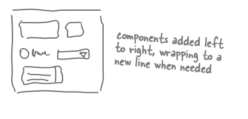
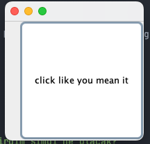

# Using Swing

### Work on Your Swing

Swing kolaydır. Ancak eğer nesnelerin ekran üzerinde nerede sonlanacağına gerçekten önem veriyorsanız, durum
değişebilir. Swing kodu kolay görünse de, derlediğinizde çalıştırdığınızda ve baktığınızda "hey, bu orada olmamalı" diye
düşünebilirsiniz. Kodlamayı kolaylaştıran şey, kontrolünü zorlaştıran şeydir - Layout Manager. Layout Manager nesneler,
bir Java GUI'deki Componentlerin boyutunu ve konumunu kontrol eder. Sizden adınıza tonlarca iş yaparlar, ancak sonuçları
her zaman beğenmeyebilirsiniz.

İki buttonun aynı boyutta olmasını istersiniz, ancak değillerdir. Metin alanının üç inç uzunluğunda olmasını istersiniz,
ancak dokuz. Ya da bir. Ve etiketin altında, yanında değil. Ancak biraz çalışma ile Layout Manager'ini istediğiniz gibi
şekillendirebilirsiniz. Bu bölümde, Swing üzerinde çalışacağız ve Layout Manager'in yanı sıra widget'lar hakkında daha
fazla bilgi edineceğiz. Onları oluşturacağız, istediğimiz yerde görüntüleyeceğiz ve bir programda kullanacağız.

### Swing components

"Widget" olarak adlandırdığımız şey için daha doğru terim "Component"tir. Bir GUI'ye koyduğunuz şeylerdir. Kullanıcının
gördüğü ve etkileşimde bulunduğu şeylerdir. Metin alanları, buttonler, kaydırılabilir listeler, radyo buttonleri vb.
hepsi
Componentlerdir. Aslında, hepsi javax.swing.JComponent'i genişletir.

**Components can be nested**

Swing'te neredeyse tüm Componentler diğer Componentleri içerebilme yeteneğine sahiptir. Başka bir deyişle, neredeyse her
şeyi neredeyse her şeyin içine yerleştirebilirsiniz. Ancak çoğu zaman, buttonler ve listeler gibi kullanıcı etkileşimli
Componentleri frames ve paneller gibi arka plan Componentlerine eklersiniz. Paneli bir buttonnin içine yerleştirmek
mümkün olsa da, bu oldukça tuhaf ve size kullanılabilirlik ödülleri kazandırmayacaktır. Ancak JFrame dışında,
etkileşimli Componentler ile arka plan Componentleri arasındaki ayrım yapaydır. Örneğin, bir JPanel genellikle diğer
Componentleri gruplamak için arka plan olarak kullanılır, ancak bir JPanel bile etkileşimli olabilir.
Diğer Componentlerde olduğu gibi, JPanel'in event'lerine, fare tıklamaları ve tuş vuruşları dahil olmak üzere
register olabilirsiniz

**Four steps to making a GUI (review)**

1 - Window yarat (aJFrame)

```JFrame frame = new JFrame();```

2 - Component yarat (button, text field, etc.)

```JButton button = new JButton("Click me");```

3 - Component'i frame'e ekle

```frame.getContentPane().add(BorderLayout.EAST, button);```

4 - Window'u goster

```
frame.setSize(300,300);
frame.setVisible(true);
```


### Layout Managers

Bir Layout Manager, genellikle bir background componenti ile ilişkilendirilmiş bir Java nesnesidir. Layout Manager,
Layout Manager ile ilişkilendirilmiş component içinde bulunan Componentleri kontrol eder. Başka bir deyişle, bir frame
bir paneli tutarsa ve panel bir button tutarsa, panelin Layout Manager button'unun boyutunu ve yerleşimini kontrol
ederken, frame Layout Manager panelin boyutunu ve yerleşimini kontrol eder. Öte yandan, button diğer Componentleri
tutmadığı için Layout Manager'a ihtiyaç duymaz.

Eğer bir panel beş öğeyi içeriyorsa, bu beş öğenin her birinin kendi layout managerleri olsa bile, bu beş öğenin panel
içindeki boyutu ve konumu, panelin layout manager'i tarafından kontrol edilir. Eğer bu beş öğe sırasıyla başka öğeleri
içeriyorsa, o diğer öğeler, onları içeren öğenin layout manager'ina göre yerleştirilir.

"İçeriyor" dediğimizde, aslında eklemek anlamına gelir, yani bir panel bir button'u içerir çünkü button, panelin üzerine
şuna benzer bir şey kullanılarak eklenmiştir:

```myPanel.add(button);```

Layout Manager'lar birkaç çeşitte gelir ve her background componenti kendi layout manager'ina sahip olabilir. Layout
manager'larının layout oluştururken takip etmeleri gereken kendi politikaları vardır. Örneğin, bir layout manager'ı,
paneldeki tüm component'lerin aynı boyutta olması gerektiğini ve bir ızgarada düzenlenmesi gerektiğini ısrar
edebilirken, başka bir layout manager'i her componentin kendi boyutunu seçebilmesine izin verebilir, ancak bunları dikey
olarak yığılmış gibi düzenler. İşte iç içe düzen örneği:

```
JPanel panelA = new JPanel();
JPanel panelB = new JPanel();
panelB.add(new JButton(“button 1”));
panelB.add(new JButton(“button 2”));
panelB.add(new JButton(“button 3”));
panelA.add(panelB);
```


### How does the layout manager decide?

Farklı Layout Manager'ların, componentleri düzenleme konusunda farklı politikaları vardır (örneğin, bir gridde
düzenleme, hepsini aynı boyutta yapma, dikey olarak yığma vb.), ancak düzenlenen componentlerin en azından küçük bir söz
hakkı vardır. Genel olarak, bir background componentinin düzenlemesi şuna benzer bir süreçle gerçekleşir:

**A layout scenario:**

1 - Bir panel yarat ve 3 button ekle

2 - Panelin layout manager'i, her button'a ne kadar büyük olmak istediğini sorar.

3 - Panelin layout manager'i, button'ların tercihlerini tamamen, kısmen veya hiç dikkate alıp almayacağına karar vermek
için düzen politikalarını kullanır.

4 - Panel'i frame'e ekle

5 - Frame'in layout manager'i, panelin ne kadar büyük olmak istediğini sorar.

6 - Frame'in layout manager'i, panelin tercihlerini tamamen, kısmen veya hiç dikkate alıp almayacağına karar vermek için
düzen politikalarını kullanır.

**Different layout managers have different policies**

Bazı layout manager'lar componentin olmak istediği boyutu dikkate alır. Eğer button 30 piksel genişliğinde ve 50 piksel
yüksekliğinde olmak istiyorsa, layout manager bu button için bu boyutu tahsis eder. Diğer layout manager'lar ise sadece
componentin tercih edilen boyutunun bir kısmını dikkate alır. Eğer button 30 piksel genişliğinde ve 50 piksel
yüksekliğinde olmak istiyorsa, o zaman boyutu button'un background panelinin genişliği kadar olur. Bazı layout
manager'lar ise sadece düzenlenen componentlerin en büyüğünün tercihini dikkate alır ve paneldeki diğer componentlerin
tümü aynı boyuta getirilir.

Bazı durumlarda, layout manager'in çalışması çok karmaşık hale gelebilir, ancak çoğu zaman, o layout manager'in
politikalarını öğrendikten sonra layout manager'in ne yapacağını tahmin edebilirsiniz.

### The Big Three layout managers: border, flow, and box.

-- BorderLayout --

BorderLayout manageri, bir background componentini beş bölgeye böler. Bir BorderLayout managerine sahip bir
background'a yalnızca bir component ekleyebilirsiniz. Bu yönetici tarafından düzenlenen componentler genellikle tercih
edilen boyutlarını kullanamazlar. BorderLayout, bir frame için varsayılan layout manager'dir


-- FlowLayout --

Bir FlowLayout manageri, bir word processor gibi davranır, ancak word'ler yerine componentler kullanılır. Her component
kendi istediği boyutta olur ve eklenme sırasına göre soldan sağa doğru düzenlenir, "kelime kaydırma" etkin hale
getirilmiş gibi. Bu layout içinde bir component yatay olarak sığmazsa, layout içindeki bir sonraki "satıra" geçer.
FlowLayout, bir panel için varsayılan layout manageridir!



-- BoxLayout --

Bir BoxLayout manager'i, her componentin kendi boyutuna sahip olmasına izin veren ve componentlerin eklenme sırasına
göre yerleştirildiği FlowLayout'a benzer. Ancak FlowLayout'ın aksine, bir BoxLayout manager'i componentleri dikey
olarak (veya yatay olarak, ancak genellikle dikey olarak ilgilidir) yığabilir. Bu, otomatik 'component wrapping' yerine
bir tür 'component dönüş tuşu' ekleyebileceğiniz ve componentleri yeni bir satıra başlatmak için zorlayabileceğiniz
bir FlowLayout gibidir.


### BorderLayout cares about five regions: east, west, north, south, and center


```
public class Button1 {
    public static void main(String[] args) {
        Button1 gui = new Button1();
        gui.go();
    }

    private void go() {
        JFrame frame = new JFrame();
        frame.setDefaultCloseOperation(JFrame.EXIT_ON_CLOSE);
        JButton button = new JButton("click me");

        frame.getContentPane().add(BorderLayout.EAST, button);
        frame.setSize(200, 200);
        frame.setVisible(true);
    }
}
```


BorderLayout manager'inin bu button için bu boyutu nasıl belirlediği? Layout Manager'in dikkate alması gereken faktörler
nelerdir? Neden daha geniş veya daha uzun değil?

```
private void go() {
    JFrame frame = new JFrame();
    frame.setDefaultCloseOperation(JFrame.EXIT_ON_CLOSE);
    JButton button = new JButton("click like you mean it"); // text'i değiştirdim şimdi ne olacak?

    frame.getContentPane().add(BorderLayout.EAST, button);
    frame.setSize(200, 200);
    frame.setVisible(true);
}
```



Şimdi button'u north position olarak işaretliyorum ve içerisinde ki yazı fontunu 28 olarak ayarlıyorum;

```
private void go() {
    JFrame frame = new JFrame();
    frame.setDefaultCloseOperation(JFrame.EXIT_ON_CLOSE);
    JButton button = new JButton("click like you mean it");

    Font font = new Font("serif",Font.BOLD,28); // 28 boyutunda bir font ayarladım
    button.setFont(font);

    frame.getContentPane().add(BorderLayout.NORTH, button); // Button'un position'inini NORTH olarak ayarladım
    frame.setSize(200, 200);
    frame.setVisible(true);
}
```


Tüm position'lara birer button yerleştiriyorum;

```
private void go() {
    JFrame frame = new JFrame();
    frame.setDefaultCloseOperation(JFrame.EXIT_ON_CLOSE);

    JButton east = new JButton("East");
    JButton west = new JButton("West");
    JButton north = new JButton("North");
    JButton south = new JButton("South");
    JButton center = new JButton("Center");

    frame.getContentPane().add(BorderLayout.EAST,east);
    frame.getContentPane().add(BorderLayout.WEST,west);
    frame.getContentPane().add(BorderLayout.NORTH,north);
    frame.getContentPane().add(BorderLayout.SOUTH,south);
    frame.getContentPane().add(BorderLayout.CENTER,center);

    frame.setSize(300, 300);
    frame.setVisible(true);
}
```


### FlowLayout cares about the fow of the components: left to right, top to bottom, in the order they were added.

**Let’s add a panel to the east region:**

Bir JPanel'in layout manager'i varsayılan olarak FlowLayout'tir. Bir paneli bir frame'e eklediğimizde, panelin boyutu ve
konumu hala BorderLayout manager'inin kontrolü altında kalır. Ancak panel içindeki herhangi bir şey (yani, panel.add(
aComponent) çağrısı ile panele eklenen componentler), panelin FlowLayout manager'inin kontrolü altında olur. İlk olarak
boş bir paneli frame'in doğu bölgesine yerleştirmeye başlayacağız ve sonraki sayfalarda panele şeyler ekleyeceğiz.

```
public class Panel1 {
    public static void main(String[] args) {
        Panel1 panel = new Panel1();
        panel.go();
    }

    private void go() {
        JFrame frame = new JFrame();
        frame.setDefaultCloseOperation(JFrame.EXIT_ON_CLOSE);

        JPanel panel = new JPanel();
        panel.setBackground(Color.darkGray);

        JButton button = new JButton("Click me");
        panel.add(button);

        frame.getContentPane().add(BorderLayout.EAST,panel);
        frame.setSize(300,300);
        frame.setVisible(true);
    }
}
```

Frame'e bir adet JPanel ve panel'in içerisine de bir button ekledim


**What happens if we add TWO buttons to the panel?**

```
private void go() {
    JFrame frame = new JFrame();
    frame.setDefaultCloseOperation(JFrame.EXIT_ON_CLOSE);

    JPanel panel = new JPanel();
    panel.setBackground(Color.darkGray);

    JButton button1= new JButton("Click me");
    JButton button2= new JButton("Dont click me");
    panel.add(button1);
    panel.add(button2);

    frame.getContentPane().add(BorderLayout.EAST,panel);
    frame.setSize(300,300);
    frame.setVisible(true);
}
```

Panel'e iki button ekledim


Eğer üçüncü button'u da eklersem;


**BoxLayout to the rescue! It keeps components stacked, even if there’s room to put them side by side.**

FlowLayout'ın aksine, BoxLayout component'leri yatayda sığabilecek yer olsa bile, component'leri bir sonraki satıra
geçirebilmek için 'yeni bir satır' oluşturabilir. Ancak şimdi panelin varsayılan FlowLayout layout manager'ini BoxLayout
olarak değiştirmeniz gerekecek.

```panel.setLayout(new BoxLayout(panel,BoxLayout.Y_AXIS));```


-- QUESTION AND ANSWERS --

Q : Nasıl oluyor da bir panele ekleyebildiğiniz gibi doğrudan bir frame'e ekleyemiyorsunuz?

A : Bir JFrame özel bir yapıya sahiptir çünkü bir şeyi ekranda görünür hale getirmede önemli bir rol oynar. Tüm Swing
component'leri saf Java'dır, ancak bir JFrame, görüntüyü erişebilmek için temel işletim sistemiyle bağlantı kurmak
zorundadır. İçerik bölümünü, JFrame'in üzerinde duran %100 saf bir Java katmanı olarak düşünebilirsiniz. Veya JFrame'i
pencere çerçevesi olarak düşünün ve içerik bölümünü cam olarak düşünün. Bildiğiniz gibi, pencere camı. Hatta içerik
bölümünü kendi JPanel'inizle değiştirebilirsiniz, böylece JPanel'inizi çerçevenin içerik bölümü haline getirebilirsiniz,
şu şekilde:

```myframe.setContentPane(myPanel);```

Q : Frame'in layout manager'ini değiştirebilir miyim? Frame'in border yerine flow kullanmasını istersem ne olur?

A : Bunu yapmanın en kolay yolu bir panel oluşturmak, istediğiniz gibi GUI'yi panele inşa etmek ve ardından bu paneli
frame'in içerik bölümü yapmaktır. Bu işlemi, önceki cevapta verilen kodu kullanarak yapabilirsiniz (varsayılan içerik
bölümünü kullanmak yerine).

Q : Farklı tercih edilen bir boyut istersem? Component'ler için setSize() methodu var mı?

A : Evet, setSize() adında bir method bulunur, ancak layout manager'lar bunu görmezden gelecektir. Component'in tercih
edilen boyutu ile onu istediğiniz boyut arasında bir ayrım bulunmaktadır. Tercih edilen boyut, componentin gerçekte ne
kadar boyuta ihtiyaç duyduğuna dayanır (component bu kararı kendi alır). Layout manager, componentin getPreferredSize()
metodunu çağırır ve bu metod, component üzerinde daha önce setSize() çağrısı yapmış olmanızın önemli olmadığını
varsayar.

Q : Şeyleri istediğim yere koyamaz mıyım? Layout manager'ları kapatabilir miyim?

A : Component bazında, setLayout(null) çağrısı yaparak, tam ekran konumlarını ve boyutları elle kodlamanız gerekebilir.
Ancak uzun vadede, neredeyse her zaman layout manager'ları kullanmak daha kolaydır.

**BULLET POINTS**

* Layout manager'lar, diğer component'lerin içine gömülü olan component'lerin boyutunu ve konumunu kontrol eder.
* Bir component'i başka bir component'e eklediğinizde (bazen background component olarak adlandırılır, ancak bu teknik
  bir ayrım değildir), eklenen component background component'inin layout manager'i tarafından kontrol edilir.
* Bir layout manager'i, componentlerden tercih edilen boyutlarını isteyerek layout hakkında karar vermeden önce bu
  bilgileri toplar. Layout manager'in politikalarına bağlı olarak componentin isteklerinin tamamı, bir kısmı veya
  hiçbiri dikkate alınabilir.
* BorderLayout manager'i, componenti beş farklı bölgeye eklemenize izin verir. Component'i eklerken bölgeyi
  belirtmelisiniz, aşağıdaki sözdizimini kullanarak: ```add(BorderLayout.EAST, panel);```
* BorderLayout ile kuzey ve güneydeki component'ler tercih edilen yüksekliğe sahip olur, ancak genişliğe değil. Doğu
  ve batıdaki component'ler tercih edilen genişliğe sahip olur, ancak yüksekliğe değil. Merkezdeki component (pack()
  kullanılmadıkça) geriye kalan alanı kullanır.
* pack() metodu, component'ler için bir çeşit sığabilecekleri boyutu belirler; merkez component'in tam tercih edilen
  boyutunu kullanır, ardından frame'in boyutunu center componenti kullanarak belirler ve diğer bölgelerde ne olduğuna
  bağlı olarak geri kalanı inşa eder.
* FlowLayout component'leri soldan sağa, üstten alta doğru sıralar ve eklenme sırasına göre yerleştirir; component'ler
  yatayda sığmayacaksa, componentler yeni bir component line'ina geçer.
* FlowLayout component'lere tercih edilen boyutlarını her iki boyutta da verir.
* BoxLayout, component'leri yatayda yan yana gelebilecekleri hizalarda dikey olarak yığmanıza olanak tanır. FlowLayout
  gibi, BoxLayout component'in tercih edilen boyutunu her iki boyutta da kullanır.
* BorderLayout bir frame için varsayılan layout manager'idir; FlowLayout ise bir panel için varsayılandır.
* Bir panelin farklı bir layout kullanmasını isterseniz, panelde setLayout() metodunu çağırmanız gerekmektedir.

### Playing with Swing components

Layout Manager'ların temellerini öğrendiniz, şimdi en yaygın kullanılan birkaç componenti deneyelim: text field,
scrolling text area, checkbox ve list. Her biri için tüm API'yi size göstermeyeceğiz, sadece başlamak için
birkaç önemli noktayı paylaşacağız.


### JTextArea Example

JTextField'in aksine, JTextArea birden fazla satır metin içerebilir. Ancak bir JTextArea oluşturmak biraz yapılandırmayı
gerektirir, çünkü kutu dışında kaydırma çubukları veya satır kaydırma özelliği yoktur. Bir JTextArea'yı kaydırılabilir
yapmak için onu bir ScrollPane içine koymalısınız. Bir ScrollPane, gerçekten kaydırmayı seven bir nesnedir ve metin
alanının kaydırma ihtiyaçlarından sorunlu bir şekilde ilgilenir.

```
public class TextArea1 implements ActionListener {
    JTextArea text;

    public static void main(String[] args) {
        TextArea1 gui = new TextArea1();
        gui.go();
    }

    private void go() {
        JFrame frame = new JFrame();
        frame.setDefaultCloseOperation(JFrame.EXIT_ON_CLOSE);

        JPanel panel = new JPanel();
        JButton button = new JButton("click it");
        button.addActionListener(this);

        text = new JTextArea(10, 20);
        text.setLineWrap(true);

        JScrollPane scroller = new JScrollPane(text);
        scroller.setVerticalScrollBarPolicy(ScrollPaneConstants.VERTICAL_SCROLLBAR_ALWAYS);
        scroller.setHorizontalScrollBarPolicy(ScrollPaneConstants.HORIZONTAL_SCROLLBAR_NEVER);

        panel.add(scroller);

        frame.getContentPane().add(BorderLayout.CENTER, panel);
        frame.getContentPane().add(BorderLayout.SOUTH, button);
        frame.setSize(300, 300);
        frame.setVisible(true);
    }

    @Override
    public void actionPerformed(ActionEvent e) {
        text.append("Button clicked \n");
    }
}
```


--- DIALOG ---

Q : Layout Manager'lar, uğraşmaya değer mi yoksa sadece her şeyin nereye gitmesi gerektiğini boyut ve koordinatları
kodlamak mı daha iyi?

A : Bir Layout Manager'dan istediğiniz tam layout'u elde etmek zor olabilir. Ancak Layout Manager'in sizin için
gerçekte ne yaptığını düşünün. Ekran üzerinde nesnelerin nereye yerleşeceğini belirleme gibi görünüşte basit bir görev
bile karmaşık olabilir. Örneğin, Layout Manager, Componentlerinizin birbirinin üzerine bindiğinden emin olur. Başka bir
deyişle, Componentler arasındaki (ve frame'in kenarlarıyla arasındaki) boşluğu yönetebilir. Elbette bunu kendiniz
yapabilirsiniz, ancak Componentlerin çok sıkı bir şekilde paketlenmesini istediğinizde ne olur? Onları elle doğru
yerleştirebilirsiniz, ancak bu yalnızca JVM'niz için geçerli olabilir!

Layout Manager'lar, Componentlerinizi düzgün bir şekilde yerleştirme, boşlukları yönetme ve Componentlerin birbirini
örtmesini önleme gibi zorluklarla başa çıkmanıza yardımcı olabilir. Bu şekilde, farklı ekran boyutları ve kullanıcı
tercihleriyle uyumlu bir kullanıcı arayüzü oluşturmak daha kolay hale gelir.

Neden mi? Çünkü Componentler, özellikle altta yatan platformun yerel 'görünüm ve hissi'ni kullandığında, platformdan
platforma hafifçe farklılık gösterebilirler. Button'ların kabartması gibi ince detaylar, Componentlerin bir platformda
düzgün bir şekilde hizalanmasıyla başka bir platformda birbirine sıkıştırılmasına neden olabilecek şekilde farklılık
gösterebilir.

Ve hala layout manager'ların gerçekten Büyük Olayına gelmedik. Kullanıcı pencereyi yeniden boyutlandırdığında ne
olacağını düşünün! Veya GUI'niz dinamikse, Componentler gelip gidiyorsa. Arka plan Componentinin boyut veya içeriğinde
bir değişiklik olduğunda bile tüm Componentleri yeniden düzenlemekle uğraşmanız gerektiğinde... işte o zaman durum
karışır!

### Making the BeatBox

Bu, BeatBox'in bu sürümünün tam kod listesidir ve başlatma, durdurma ve tempoyu değiştirme buttonleri içerir. Kod
listesi
tamamlanmış ve tamamen açıklamalıdır, ancak işte genel bir bakış:

1 - 256 Checkboxes (başlangıçta unchecked halde), 16 Label instrument isimleri için, ve 4 button GUI içerisinde create
edilecek

2 - Her dört button için bir ActionListener register edin. Checkbox'lar için listener'lara ihtiyaç yoktur, çünkü
pattern sesini dinamik olarak değiştirmeye çalışmıyoruz (örneğin, kullanıcı bir kutuyu işaretlediğinde hemen). Bunun
yerine, kullanıcının 'Başlat' button'una basmasını bekleriz ve ardından 256 check box'in durumunu almak ve bir MIDI
parçası oluşturmak için tüm onay kutularını gezeriz.

3 - MIDI sistemi kurulumunu gerçekleştirin (daha önce bunu yapmıştınız) ve bir Dizi (Sequence) ve parça (Track)
oluşturun. Java 5.0'da yeni olan setLoopCount() adlı bir sıralayıcı (Sequencer) methodu kullanıyoruz. Bu method, bir
dizinin kaç kez döngü yapmasını istediğinizi belirtmenizi sağlar. Ayrıca, dizinin tempo faktörünü kullanarak tempoyu
yukarı veya aşağı ayarlıyoruz ve yeni tempoyu döngünün bir iterasyonundan diğerine taşıyoruz.

4 - Kullanıcı 'Başlat' button'una bastığında, gerçek eylem başlar. 'Başlat' düğmesi için event handling methodu
buildTrackAndStart() methodunu çağırır. Bu methodda, tüm 256 onay kutusunu (bir seferde bir satır, tüm 16 vuruş boyunca
tek bir enstrüman) gezerek durumlarını alırız, ardından bu bilgileri kullanarak bir MIDI parçası oluştururuz (önceki
bölümde kullandığımız makeEvent() methodunu kullanarak). Parça oluşturulduktan sonra sequencer'i başlatırız ve bu,
kullanıcı 'Durdur' button'una basana kadar (çünkü döngü içindeyiz) çalmaya devam eder.

```
public class BeatBox {
    JPanel mainPanel;
    ArrayList<JCheckBox> checkboxList;
    Sequencer sequencer;
    Sequence sequence;
    Track track;
    JFrame theFrame;

    /* Bu, enstrüman isimleri, her satırda birer dizi etiketi oluşturmak için kullanılacak olan String array'idir.*/
    String[] instrumentNames = {
            "Bass Drum",
            "Closed Hi-Hat",
            "Open Hi-Hat",
            "Acoustic Snare",
            "Crash Cymbal",
            "Hand Clap",
            "High Tom",
            "Hi Bongo",
            "Maracas",
            "Whistle",
            "Low Conga",
            "Cowbell",
            "Vibraslap",
            "Low-mid Tom",
            "High Agogo",
            "Open Hi Conga"
    };
    int[] instruments = {35, 42, 46, 38, 49, 39, 50, 60, 70, 72, 64, 56, 58, 47, 67, 63};

    public static void main(String[] args) {
        new BeatBox().buildGUI();
    }

    public void buildGUI() {
        theFrame = new JFrame("Cyber BeatBox");
        theFrame.setDefaultCloseOperation(JFrame.EXIT_ON_CLOSE);

        BorderLayout layout = new BorderLayout();
        JPanel background = new JPanel(layout);
        background.setBorder(BorderFactory.createEmptyBorder(10, 10, 10, 10));
        checkboxList = new ArrayList<>();

        Box buttonBox = new Box(BoxLayout.Y_AXIS);
        JButton start = new JButton("Start");
        start.addActionListener(new MyStartListener());
        buttonBox.add(start);
        JButton stop = new JButton("Stop");
        stop.addActionListener(new MyStopListener());
        buttonBox.add(stop);
        JButton upTempo = new JButton("Tempo Up");
        upTempo.addActionListener(new MyUpTempoListener());
        buttonBox.add(upTempo);
        JButton downTempo = new JButton("Tempo Down");
        downTempo.addActionListener(new MyDownTempoListener());
        buttonBox.add(downTempo);

        Box nameBox = new Box(BoxLayout.Y_AXIS);
        for (int i = 0; i < 16; i++) {
            nameBox.add(new Label(instrumentNames[i]));
        }

        background.add(BorderLayout.EAST, buttonBox);
        background.add(BorderLayout.WEST, nameBox);
        theFrame.getContentPane().add(background);

        GridLayout grid = new GridLayout(16, 16);
        grid.setVgap(1);
        grid.setHgap(2);
        mainPanel = new JPanel(grid);
        background.add(BorderLayout.CENTER, mainPanel);

        for (int i = 0; i < 256; i++) {
            JCheckBox c = new JCheckBox();
            c.setSelected(false);
            checkboxList.add(c);
            mainPanel.add(c);
        }

        setUpMidi();

        theFrame.setBounds(50, 50, 300, 300);
        theFrame.pack();
        theFrame.setVisible(true);
    }

    public void setUpMidi() {
        try {
            sequencer = MidiSystem.getSequencer();
            sequencer.open();
            sequence = new Sequence(Sequence.PPQ, 4);
            track = sequence.createTrack();
            sequencer.setTempoInBPM(120);

        } catch (Exception e) {
            e.printStackTrace();
        }
    }

    public void buildTrackAndStart() {
        int[] trackList = null;

        sequence.deleteTrack(track);
        track = sequence.createTrack();
        for (int i = 0; i < 16; i++) {
            trackList = new int[16];
            int key = instruments[i];
            for (int j = 0; j < 16; j++) {

                JCheckBox jc = checkboxList.get(j + 16 * i);
                if (jc.isSelected()) {
                    trackList[j] = key;
                } else {
                    trackList[j] = 0;
                }
            }

            makeTracks(trackList);
            track.add(makeEvent(176, 1, 127, 0, 16));
        }
        track.add(makeEvent(192, 9, 1, 0, 15));
        try {
            sequencer.setSequence(sequence);
            sequencer.setLoopCount(sequencer.LOOP_CONTINUOUSLY);
            sequencer.start();
            sequencer.setTempoInBPM(120);
        } catch (Exception e) {
            e.printStackTrace();
        }
    }

    public class MyStartListener implements ActionListener {
        public void actionPerformed(ActionEvent a) {
            buildTrackAndStart();
        }
    }

    public class MyStopListener implements ActionListener {
        public void actionPerformed(ActionEvent a) {
            sequencer.stop();
        }
    }

    public class MyUpTempoListener implements ActionListener {
        public void actionPerformed(ActionEvent a) {
            float tempoFactor = sequencer.getTempoFactor();
            sequencer.setTempoFactor((float) (tempoFactor * 1.03));
        }
    }

    public class MyDownTempoListener implements ActionListener {
        public void actionPerformed(ActionEvent a) {
            float tempoFactor = sequencer.getTempoFactor();
            sequencer.setTempoFactor((float) (tempoFactor * .97));
        }
    }

    public void makeTracks(int[] list) {

        for (int i = 0; i < 16; i++) {
            int key = list[i];
            if (key != 0) {
                track.add(makeEvent(144, 9, key, 100, i));
                track.add(makeEvent(128, 9, key, 100, i + 1));
            }
        }
    }

    public MidiEvent makeEvent(int comd, int chan, int one, int two, int tick) {
        MidiEvent event = null;
        try {
            ShortMessage a = new ShortMessage();
            a.setMessage(comd, chan, one, two);
            event = new MidiEvent(a, tick);
        } catch (Exception e) {
            e.printStackTrace();
        }
        return event;
    }
}
```