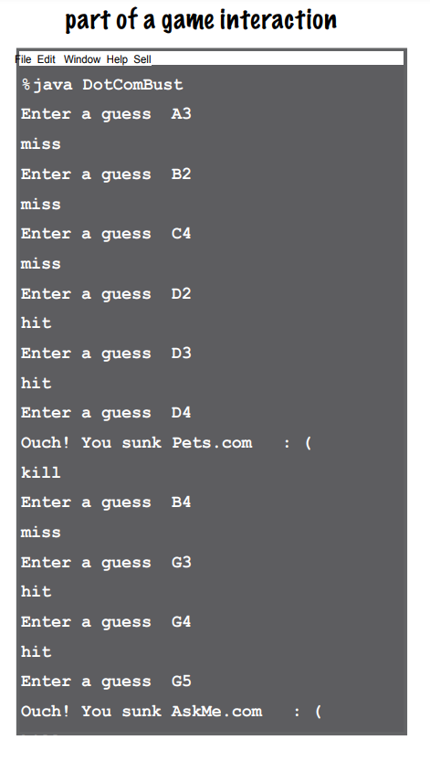
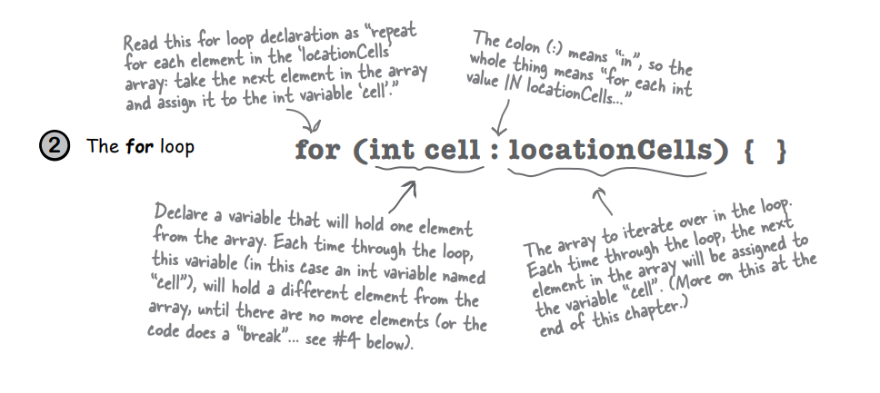

# Writing A Program

### Extra Strengh Methods

Metodlarımıza güç katmanın vakti geldi. Variable'larla oynadık, birkaç nesneyle oynadık ve biraz kod yazdık. Ancak
zayıftık. Daha fazla araçlara ihtiyacımız var. Operatörlere ihtiyacımız var. Daha ilginç şeyler yapabilmek için, mesela
sadece havlamaktan daha farklı şeyler yapabilmek için daha fazla operatöre ihtiyacımız var. Ve döngülere ihtiyacımız
var. Ama zayıf olan while döngüleri neyin nesi? Eğer ciddiysen, for döngülerine ihtiyacımız var. Rastgele sayılar
üretmek de faydalı olabilir. Bir String'i int'e dönüştürmek de güzel olurdu. Onu da öğrenelim. Ve neden hepsini baştan
sona gerçek bir şey inşa ederek öğrenmeyelim? Bir şeyleri gerçekten yazmanın (ve test etmenin) nasıl olduğunu görmek
için. Battleship gibi bir oyun yapalım. Bu ağır bir iş, bu yüzden bitirmek için iki bölüm gerekecek. Bu bölümde
basit bir versiyonunu oluşturacağız ve ardından 6. bölümde daha güçlü bir deluxe versiyonu yapacağız.

### Let’s build a Battleship-style game: “Sink a Dot Com”

Bilgisayara karşı oynuyorsunuz, ancak gerçek Battleship oyununun aksine, bu oyunda kendi gemilerinizi
yerleştirmiyorsunuz. Bunun yerine, göreviniz bilgisayarın gemilerini en az sayıda tahminle batırmaktır.
Ayrıca, gemileri batırmıyoruz. Dot Com'ları öldürüyoruz.

Goal: Bilgisayarın tüm Dot Com'larını en az sayıda tahminle batırmak. Performansınıza bağlı olarak bir derecelendirme
veya seviye verilir.

Setup: Oyun programı başlatıldığında, bilgisayar üç Dot Com'u sanal bir 7 x 7 ızgara üzerine yerleştirir. Bu işlem
tamamlandığında, oyun ilk tahmininizi isteyecektir.

Oyunun nasıl oynandığı: Henüz bir kullanıcı arayüzü oluşturmayı öğrenmedik, bu nedenle bu versiyon komut satırında
çalışır. Bilgisayar size bir tahmin (bir hücre) girmenizi isteyecektir ve siz de bunu komut satırında "A3", "C5" vb.
şeklinde yazacaksınız. Tahmininize yanıt olarak, komut satırında "Hit", "Miss" veya "Pets.com'u battırdınız"
gibi bir sonuç göreceksiniz. Üç Dot Com'u da gökyüzündeki büyük 404'e yolladığınızda, oyun derecenizi yazdırarak sona
erer.



### First, a high-level design

Oyunun sınıflar ve metodlar gerektireceğini biliyoruz, ancak hangi sınıflar ve metodlar olmalı? Bunu yanıtlamak için
oyunun ne yapması gerektiği hakkında daha fazla bilgiye ihtiyacımız var. İlk olarak, oyunun genel akışını belirlememiz
gerekiyor. İşte temel fikir:


1 - User oyunu başlatır

    A - Oyun 3 adet Dot Coms create eder
    B - Oyun, üç DotCom'u sanal bir ızgaraya yerleştirir

2 - Oyun başlar. Aşağıdaki işlemleri, daha fazla Dot Com kalmayana kadar tekrarlayın:

    A - Kullanıcıdan guess(tahmin) isteyin
    B - Kullanıcının tahminini, tüm Dot Com'ları kontrol ederek hit, miss veya kill durumları için kontrol edin 
        ve uygun işlemi gerçekleştirin: eğer isabet varsa, hücreyi (A2, D4, vb.) silin. Eğer öldürme varsa, Dot Com'u 
        silin.

3 - Oyun biter. Kullanıcıya tahmin sayısına göre puan verin

Şimdi programın yapması gereken işlerin türleri hakkında bir fikrimiz var. Bir sonraki adım, işi yapmak için hangi tür
nesnelere ihtiyacımız olduğunu belirlemektir. Unutmayın, önce prosedürler yerine programdaki şeylere odaklanmak için
Brad gibi düşünün, Larry gibi düşünmeyin.

### The “Simple Dot Com Game” a gentler introduction

Görünüşe göre en az iki sınıfa ihtiyacımız olacak: bir Game sınıfı ve bir DotCom sınıfı. Ancak tam özellikli "Sink a Dot
Com" oyununu oluşturmadan önce, basitleştirilmiş bir versiyon olan "Simple Dot Com Game" ile başlayacağız. Basit
versiyonu bu bölümde oluşturacak ve ardından Deluxe versiyonunu sonraki bölümde oluşturacağız.
Bu oyunda her şey daha basit. 2x2 ızgara yerine, Dot Com'u tek bir hücreye gizliyoruz. Ve üç yerine sadece bir Dot Com
kullanıyoruz.

Hedef aynı olduğundan, oyun hala bir DotCom instance'i oluşturmalı, ona satırın bir yerinde bir konum atamalı, kullanıcı
girdisi almalı ve tüm DotCom hücreleri vurulduğunda oyunun bitmesi gerekmektedir. Bu basitleştirilmiş oyun versiyonu,
tam oyunu oluşturmada büyük bir başlangıç avantajı sağlar. Eğer bu küçük versiyonu çalıştırabilirsek, daha karmaşık
olanı daha sonra ölçeklendirebiliriz.

Bu basit versiyonda, Game sınıfının instance variables'i yoktur ve tüm oyun kodu main() yönteminde bulunur. Başka bir
deyişle, program başlatıldığında ve main() çalışmaya başladığında, yalnızca bir tane DotCom örneği oluşturacak, ona bir
konum seçecek (tek sanal yedi hücreli satırda üç ardışık hücre), kullanıcıdan bir tahmin isteyecek, tahmini kontrol
edecek ve tüm üç hücre vurulana kadar tekrarlayacaktır.

Aklınızda bulunsun ki, sanal satır... aslında mevcut değildir. Diğer bir deyişle, programda hiçbir yerde var olmaz. Oyun
ve kullanıcının, DotCom'un, yedi hücrelik bir alanda üç ardışık hücrede gizlendiğini (sıfırdan başlayarak) bilmesi
yeterlidir, satırın kendisi kodda temsil edilmek zorunda değildir. Yedi tamsayı içeren bir dizi oluşturup, DotCom'u
dizinin yedi elemanının üçüne atamak isteyebilirsiniz, ancak buna ihtiyacınız yok. İhtiyacımız olan tek şey, DotCom'un
işgal ettiği üç hücrenin tutulduğu bir dizi.

1 - Oyun başlar ve TEK bir DotCom oluşturur ve ona yedi hücrelik tek bir satırdaki üç hücrelik bir konum atar.
"A2", "C4" vb. yerine, konumlar sadece tamsayılarla ifade edilir (örneğin, bu resimde 1, 2, 3 hücre konumlarıdır):


2 - Oyun oynanmaya başlar. Kullanıcıya bir tahmin yapması için bir giriş istenir ve ardından DotCom'un üç hücresinden
herhangi birine isabet edip etmediği kontrol edilir. Eğer bir isabet varsa, numOfHits variable'i artırılır.

3 - Oyun, üç hücrenin tamamının vurulduğu durumda (numOfHits variable'inin değeri 3 olduğunda) tamamlanır ve kullanıcıya
DotCom'u batırmak için kaç tahmin yapıldığı bilgisi verilir.


### Developing a Class

Bir programcı olarak, muhtemelen kod yazma konusunda bir metodoloji/process/approach vardır. Bizim de bir sıramız var.
Bu sıra, bir sınıfın kodunu çalışırken düşündüklerimizi görmemizi (ve öğrenmemizi) sağlamak için tasarlanmıştır. Bu,
gerçek dünyada (siz veya biz) kod yazmanın yolu olmayabilir. Gerçek dünyada elbette kişisel tercihlerinize, projenize
veya işvereninize uygun bir yaklaşım izleyeceksiniz. Ancak biz, neredeyse istediğimizi yapabiliriz. Ve bir Java
sınıfını "öğrenme deneyimi" olarak oluşturduğumuzda genellikle şu şekilde yaparız:

* Sınıfın ne yapması gerektiğini belirleyin
* Instance Variables'ların ve methodların listesini yapın
* Metodlar için hazırlık kodunu yazın. (Bunu birazdan göreceksiniz.)
* Methodlar için test code'ları yazın
* Class'ları implemente edin
* Methodları test edin
* Gerektiğinde hata ayıklayın ve yeniden implemente edin.
* Gerçek kullanıcılar üzerinde "öğrenme deneyimi" uygulamamızı test etmek zorunda olmadığımız için minnettarız.

Bir program yazarken hangi sınıf veya sınıfları ilk olarak oluşturmanız gerektiğini nasıl belirlerdiniz? Diyelim ki en
küçük programlar hariç hepsi (iyi nesne yönelimli prensipleri takip ediyorsanız ve tek bir sınıfın birçok farklı işi
yapmasını istemiyorsanız) birden fazla sınıfa ihtiyaç duyuyor. Bu durumda nereden başlarsınız?

**Her sınıf için yazacağınız üç şey;**


Bu çubuk, hangi bölüm üzerinde çalıştığınızı size göstermek için bir sonraki sayfalarda görüntülenir. Örneğin, bir
sayfanın üstünde bu resmi görüyorsanız, bu, SimpleDotCom sınıfı için prep code üzerinde çalıştığınız anlamına gelir.


**Prep Code:** Syntax ile uğraşmadan mantığa odaklanmanıza yardımcı olmak için kullanılan bir tür sözde kod (pseudocode)
çeşididir.

**Test Code:** Gerçek kodu test eden ve doğru şekilde çalıştığını doğrulayan bir sınıf veya methodlar içerir.
Test kodu, gerçek kodun beklenen sonuçları üretip üretmediğini kontrol etmek, hata durumlarını ele almak ve kodun doğru
işlediğini doğrulamak için kullanılır.

**Real Code:** Sınıfın gerçek implementasyonu burada yapılır. Bu aşamada gerçek Java kodunu yazıyoruz.

### PREP CODE

Prepcode (bizim pseudocode kodu olarak adlandırdığımız) nasıl çalıştığına dair bir fikir edineceksiniz. Bu örneği
okudukça anlamaya başlayacaksınız. Prepcode genellikle gerçek Java kodu ile sade bir İngilizce açıklama arasında bir
noktada yer alır. Prepcode genellikle üç bölüm içerir: instance variables bildirimleri, method bildirimleri ve method
mantığı. Prepcode'un en önemli kısmı method mantığıdır, çünkü ne olması gerektiğini tanımlar ve daha sonra gerçek method
kodunu yazdığımızda nasıl yapılacağını çeviririz.

DECLARE - locationCells adında bir int dizisi tanımlayarak konum hücrelerini tutun.
DECLARE - numOfHits adında bir int variable tanımlayarak hit sayısını tutun ve 0 olarak ayarlayın.

**----------------------------------------------------------------------------------**

DECLARE - checkYourself() adında bir method tanımlayın. Bu method, kullanıcının tahminini temsil eden bir String
parametre almalıdır ("1", "3", vb.), bu tahmini kontrol etmeli ve "hit" (isabet), "miss" (kaçırma) veya "kill" (öldürme)
sonucunu döndürmelidir.

DECLARE - setLocationCells() adında bir setter methodu tanımlayın. Bu method, üç hücre konumunu int olarak içeren bir
int dizisi almalıdır (2, 3, 4, vb.).

**----------------------------------------------------------------------------------**

    METHOD - String checkYourself(String userGuess)
        GET - Kullanıcının tahminini String bir parametre olarak alın.
        CONVERT - Kullanıcının tahminini int'e dönüştürün
        REPEAT - int dizisindeki her bir konum hücresiyle birlikte.
            //COMPARE
            IF Kullanıcının tahmini eşleşirse
                INCREMENT Vuruş sayısını arttırın
                // FIND OUT Son konum hücresi olup olmadığını bulun:
                IF eğer vuruş sayısı 3 ise, sonucu "kill" olarak döndür.
                ELSE aksi takdirde, öldürme değilse, "hit" olarak dönüş yap.
                END IF
            ELSE Kullanıcının tahmini eşleşmediğinde, "miss" olarak dönüş yap.
            END IF
        END REPEAT
    END METHOD


    METHOD - void setLocationCells(int[] cellLocations)
        GET - Hücre konumlarını int dizisi olarak bir parametre olarak alın.
        ASSIGN - Hücre konumları parametresini hücre konumları instance variable'ina atayın.
    END METHOD


### Writing the method implementations

Şimdi gerçek method kodunu yazalım ve bu işi çalışır hale getirelim.

Ancak methodları kodlamaya başlamadan önce, geriye dönüp methodları test etmek için bazı kodlar yazalım. Evet, doğru
duydunuz, test etmek için henüz bir şey yokken test kodu yazıyoruz!

Test kodunu önce yazma kavramı, Ekstrem Programlama (XP) uygulamalarından biridir ve kodunuzu yazmanızı daha kolay (ve
daha hızlı) hale getirebilir. XP'yi kullanmanızı önermiyoruz, ancak önce testleri yazma kısmını seviyoruz. Ve XP sadece
cool geliyor.

### Writing test code for the SimpleDotCom class

SimpleDotCom sınıfı için bir SimpleDotCom nesnesi oluşturabilen ve methodlarını çalıştırabilen test kodu yazmamız
gerekiyor. SimpleDotCom sınıfı için gerçekten sadece checkYourself() methoduyla ilgileniyoruz, ancak checkYourself()
methodunun doğru şekilde çalışması için setLocationCells() methodunu da uygulamamız gerekecek.

Aşağıdaki checkYourself() methodu için prepcode'a dikkatlice bakın (setLocationCells() methodu basit bir setter yöntemi
olduğundan endişelenmiyoruz, ancak 'gerçek' bir uygulamada daha sağlam bir 'setter' yöntemi isteyebilir ve bunu test
etmek isteyebiliriz). Sonra kendinize şu soruyu sorun: "Eğer checkYourself() methodu uygulanmış olsaydı, methodun doğru
çalıştığını kanıtlayabilecek hangi test kodunu yazabilirim?"

### TEST CODE

**İşte test etmemiz gerekenler:**

* SimpleDotCom sınıfından bir nesne örneği oluşturun.
* SimpleDotCom nesnesine bir konum atayın (örneğin {2, 3, 4} gibi 3 tane int içeren bir dizi).
* Kullanıcının tahminini temsil etmek için bir String oluşturun ("2", "0", vb.).
* Fake kullanıcı tahminiyle birlikte checkYourself() methodunu çağırın.
* Sonucu doğrulamak için ("passed" veya "failed" olarak) çıktıyı yazdırın.

SimpleDotComTestDrive class;

```
public class SimpleDotComTestDrive {
    public static void main(String[] args) {
        // instantiate a SimpleDotCom object
        SimpleDotCom simpleDotCom = new SimpleDotCom();

        int[] locations = {2, 3, 4};
        // simpleDotcom içerisinde ki setter invoke edilir ve yukarıda ki değerler set edilir
        simpleDotCom.setLocationCells(locations);

        // fake bir user tahmini
        String userGuess = "2";
        // simpleDotCom icerisinde ki checkYourSelf methoduna fake user tahminini geç ve dönen değeri result içine koy
        String result = simpleDotCom.checkYourSelf(userGuess);

        String testResult = "failed";

        // eğer result olarak hit dönerse burası çalışacak
        if (result.equals("hit")) {
            testResult = "passed";
        }

        // hit degilse yukarıda ki testResult yazdirilacak
        System.out.println(testResult);
    }
}
```

Bu test class'ında ki instance yaratma veya methodların hata vermemesi için basitçe SimpleDotCom class'ını create
ediyorum

```
public class SimpleDotCom {
    private int[] locationCells;

    public void setLocationCells(int[] locationCells) {
        this.locationCells = locationCells;
    }

    public String checkYourSelf(String guess){
        return "null";
    }
}
```

### REAL CODE

**The checkYourself() method**

Prepcode ile javacode arasında tam bir eşleme olmadığına dikkat etmek önemlidir; birkaç düzenleme yapmanız gerekebilir.
Prepcode, kodun ne yapması gerektiği konusunda bize çok daha iyi bir fikir verdi ve şimdi nasıl yapılacağını bulmamız
gerekiyor. Zihninizin bir köşesinde, bu kodun hangi bölümlerini geliştirmek isteyebileceğinizi (veya ihtiyaç
duyabileceğinizi) düşünmeye devam edin. Sayılar, henüz görmediğiniz şeylerin (syntax ve language özellikleri)
belirtileridir. Bunlar karşıt sayfada açıklanmıştır.

```
public class SimpleDotCom {
    private int[] locationCells;
    public void setLocationCells(int[] locationCells) {
        this.locationCells = locationCells;
    }
    public String checkYourSelf(String guess){ // GET - the user guess
        int userGuess = Integer.parseInt(guess); // CONVERT - String'i int'e convert et
        int numberOfHits = 0;

        String result = "miss"; // method varsayılan olarak miss dönecek

        for (int cell : locationCells){ // REPEAT - locationCell array'i içerisinde dön
            if (userGuess == cell){ // IF - the user guess matches
                result = "hit";
                numberOfHits++; // INCREMENT - The number of hits
                break; // döngüyü kır diğer cell'leri kontrol etme
            }
        }

        if (numberOfHits == locationCells.length){
            // for'dan çıktık, ancak şimdi 'kill' olup olmadığımızı kontrol edelim (3 kez vuruldu) ve sonuç String'ini
            // "Kill" olarak değiştirelim.
            result = "kill";
        }

        System.out.println(result);

        return result;
    }
}
```

**Just the new stuff**

1 - Converting a String to an a int


2 - The for loop:



3 - The post-increment operator


4 - break statement


**Final Code for SimpleDotCom and SimpleDotComTester**

```
public class SimpleDotComTestDrive {
    public static void main(String[] args) {
        SimpleDotCom simpleDotCom = new SimpleDotCom();
        int[] locations = {2, 3, 4};
        simpleDotCom.setLocationCells(locations);
        String userGuess = "2";
        String result = simpleDotCom.checkYourSelf(userGuess);
    }
}
```

```
public class SimpleDotCom {
    private int[] locationCells;
    private int numberOfHits = 0;
    public void setLocationCells(int[] locationCells) {
        this.locationCells = locationCells;
    }
    public String checkYourSelf(String guess){
        int userGuess = Integer.parseInt(guess);
        String result = "miss";
        for (int cell : locationCells){
            if (userGuess == cell){
                result = "hit";
                numberOfHits++;
                break;
            }
        }

        if (numberOfHits == locationCells.length){
            result = "kill";
        }

        System.out.println(result);
        return result;
    }
}
```

Test kodu, bir SimpleDotCom nesnesi oluşturur ve ona 2,3,4 konumunu verir. Ardından, "2" fake bir kullanıcı tahmini
checkYourself() yöntemine gönderilir. Eğer kod düzgün çalışıyorsa, aşağıdaki sonucun çıktı olarak görünmesi beklenir:

```hit```

Integer.parseInt() methodu, yalnızca rakamların ASCII değerlerini temsil eden String'ler üzerinde çalışır (0, 1, 2, 3,
4,5, 6, 7, 8, 9). "two" veya "blurp" gibi ifadeleri ayrıştırmaya çalışırsanız, kod çalışma zamanında hata verecektir. (
Hata verme durumunda, aslında bir exception fırlatıldığını anlıyoruz, ancak exception'lar hakkında konuşmamız Exceptions
bölümüne kadar gerçekleşecektir. Bu yüzden şimdilik hata vermek yaklaşık olarak yeterli bir ifadedir.)

Gerçek Game class'ımızı halen yazmadık ve programımızı tam olarak tamamlamadık;

### PREP CODE

**Prepcode for the SimpleDotComGame class Everything happens in main()**

Bazı şeyleri inançla kabul etmeniz gerekecek. Örneğin, "KOMUT SATIRINDAN kullanıcı girişi AL" şeklinde bir prep code
satırımız var. Size söyleyeyim, bu şu anda baştan uygulamak istediğimizden biraz daha fazla. Ama neyse ki, nesne
yönelimli kullanıyoruz. Ve bu da size diğer bir sınıf/nesne üzerinden bir şeyler yapmasını isteme imkanı verirken, nasıl
yapıldığıyla ilgilenmenize gerek kalmaz. Prep code yazarken, ihtiyaç duyduğunuz herhangi bir şeyi bir şekilde
yapabileceğinizi varsaymanız gerektiğini unutmayın, böylece tüm zihin gücünüzü mantığı çözmeye odaklayabilirsiniz.

```
    METHOD public static void main (String[] args)
        DECLARE -  Kullanıcının tahmin sayısını tutmak için numOfGuesses adında bir tamsayı variable'i
        MAKE - SimpleDotCom sınıfına ait instance
        COMPUTE - Başlangıç konumunun hücre pozisyonunu temsil etmek için 0 ile 4 arasında rastgele bir sayıya 
        ihtiyacınız var
        MAKE - Rastgele oluşturulan sayıyı, sayının bir fazlasını ve sayının iki fazlasını içeren 3 tamsayıdan oluşan 
        int array oluştur
        INVOKE - SimpleDotCom nesnesi üzerinde ki setLocalionCells invoke et
        DECLARE - Oyunun durumunu temsil eden, isAlive adında bir boolean variable. Onu true olarak set et
        
        WHILE - dotcom stillAlive ise (isAlive==true)
            GET - Command line üzerinden user input'u al
            // CHECK user'in guess(tahminini kontrol et)
            INVOKE - SimpleDotCom instance'i uzerinden checkYourSelf() methodunu kullan
            INCREMENT - numOfGuesses variable'ini artır
            //CHECK
            IF - result "kill" ise
                SET - isAlive to false
                PRINT - user'in guess'lerinin kac adede çıktığını print et
            END IF
        END WHILE
    END METHOD
```

**BULLET POINTS**

* Java programınız yüksek seviyeli bir tasarımla başlamalıdır.
* Genellikle yeni bir sınıf oluşturduğunuzda üç şey yazarsınız:
    * prep code
    * test code
    * real (java) code
* Prep code, nasıl yapılacağını değil ne yapılacağını tanımlamalıdır. Implementasyon daha sonra gelir.
* Test kodunu tasarım yaparken pred code'dan yararlanmak için kullanın.
* Methodları uygulamadan önce test kodunu yazın.
* Döngü kodunu kaç kez tekrarlamak istediğinizi bildiğiniz durumlarda while döngüleri yerine for döngülerini tercih
  edin.
* Bir variablee 1 eklemek için pre/post increment operatörünü kullanın (x++;)
* Bir variableden 1 çıkarmak için pre/post decrement operatörünü kullanın (x--;)
* Bir String'in int değerini elde etmek için Integer.parseInt() kullanın.
* Integer.parseInt(), String'in bir rakamı temsil ettiği durumlarda çalışır ("0", "1", "2", vb.).
* Döngüyü erken terk etmek için (örneğin, boolean test koşulu hala doğru olsa bile) break kullanın.

### REAL CODE

SimpleDotCom sınıfıyla yaptığınız gibi, bu kodun hangi bölümlerini geliştirmek isteyebileceğinizi (veya ihtiyaç
duyabileceğinizi) düşünün. Numaralandırılmış öğeler, üzerinde durmak istediğimiz şeylerdir. Bunlar karşı sayfada
açıklanmıştır. Ah, eğer bu sınıf için test kodu aşamasını atladığımızı merak ediyorsanız, Game için bir test sınıfına
ihtiyacımız yok. Yalnızca bir methodu vardır, bu yüzden test kodunda ne yapardınız? Bu sınıfta main() yöntemini
çağıracak ayrı bir sınıf mı yapardınız? Uğraşmadık.

```
public class SimpleDotComGame {
    public static void main(String[] args) {
        // DECLARE -  Kullanıcının tahmin sayısını tutmak için numOfGuesses adında bir tamsayı variable'i
        int numOfGuess = 0;

        // Bu, kullanıcı inputu almak için bir method içeren özel bir sınıftır. Şimdilik, onu Java'nın bir parçasıymış
        // gibi düşünün.
        GameHelper gameHelper = new GameHelper();

        // MAKE - SimpleDotCom sınıfına ait instance
        SimpleDotCom simpleDotCom = new SimpleDotCom();

        //COMPUTE - Başlangıç konumunun hücre pozisyonunu temsil etmek için 0 ile 4 arasında rastgele bir sayıya
        //ihtiyacımız var
        int random = (int) (Math.random() * 5);

        // MAKE - Rastgele oluşturulan sayıyı, sayının bir fazlasını ve sayının iki fazlasını içeren 3 tamsayıdan oluşan
        // int array oluştur
        int[] locations = {random, random + 1, random + 2};

        // INVOKE - SimpleDotCom nesnesi üzerinde ki setLocalionCells invoke et
        simpleDotCom.setLocationCells(locations);

        // DECLARE - Oyunun durumunu temsil eden, isAlive adında bir boolean variable. Onu true olarak set et
        boolean isAlive = true;

        // WHILE - dotcom stillAlive ise (isAlive==true)
        while (isAlive){
            // GET - Command line üzerinden user input'u al
            String guess = gameHelper.getUserInput("enter a number");
            //  INVOKE - SimpleDotCom instance'i uzerinden checkYourSelf() methodunu kullan
            String result = simpleDotCom.checkYourSelf(guess);
            // INCREMENT - numOfGuesses variable'ini artır
            numOfGuess++;

            // IF - result "kill" ise
            if (result.equals("kill")){
                // SET - isAlive to false
                isAlive = false;
                // PRINT - user'in guess'lerinin kac adede çıktığını print et
                System.out.println("you took " + numOfGuess + " guesses");
            }
        }
    }
}
```

**random() and getUserInput()**

Bu sayfada biraz daha açıklama gerektiren iki şey var. Bu sadece size devam etmeniz için bir hızlı bakış; GameHelper
sınıfıyla ilgili daha fazla detay bu bölümün sonunda bulunmaktadır.

1 - Bu bir 'cast' işlemidir ve onu takip eden şeyi (parantez içindeki türü) hemen dönüştürür. Math.random bir double
değer döndürür, bu yüzden onu int türüne dönüştürmemiz gerekiyor (0 ile 4 arasında güzel bir tam sayı istiyoruz). Bu
durumda, cast işlemi double'ın kesirli kısmını keser ve tam sayıya dönüştürür. Math.random methodu, sıfırdan bir
eksiğine kadar olan bir sayı döndürür. Bu formül (cast ile birlikte), 0 ila 4 arasında bir sayı döndürür. Yani (0 -
4,999...), bir int'e dönüştürülür.


2 - Daha önce yaptığımız, oyunla ilgili yardımcı olmak için oluşturduğumuz bir sınıfın bir örneği. Buna GameHelper
deniyor ve henüz görmediniz (ancak göreceksiniz). Bu method, kullanıcıyı komut satırında yönlendirmek için kullanılan
bir String argümanını alır. Buraya ne geçirirseniz, method kullanıcı input'u aramaya başlamadan hemen önce terminalde
görüntülenir. GameHelper sınıfının bir methodu, kullanıcıdan komut satırı inputu isteyen, kullanıcı RETURN tuşuna
bastıktan sonra inputu okuyan ve sonucu bir String olarak döndüren bir methoddur.


### REAL CODE

**One Last class: GameHelper**

SimpleDotCom sınıfını oluşturduk. Game sınıfını oluşturduk. Tek kalan şey utility sınıf - getUserInput() methoduna sahip
olan sınıf. Şu anda açıklamak istediğimizden daha fazla komut satırı inputu almak için kod var. Bu konu daha sonra ele
alınması daha iyi olan çok fazla konuyu açar. (Daha sonra, yani 14. bölümde.) Aşağıdaki kodu kopyalayın ve GameHelper
adında bir sınıf olarak derleyin. Üç sınıfı da (SimpleDotCom, SimpleDotComGame, GameHelper) aynı dizine koyun ve çalışma
diziniz yapın.

```
public class GameHelper {
    public String getUserInput(String prompt) {
        String inputLine = null;
        System.out.println(prompt + " ");
        try {
            BufferedReader bufferedReader = new BufferedReader(new InputStreamReader(System.in));
            inputLine = bufferedReader.readLine();
            if (inputLine.length() == 0){
                return null;
            }
        } catch (IOException e) {
            System.out.println("IOException : " + e);
        }
        return inputLine;
    }
}
```

kodu çalıştırdığımızda ve 1, 2, 3, 4, 5, 6 gibi sayıları girdiğimizde ne olduğunu gösteren bir örnek var. Güzel
görünüyor.


**What's this? A Bug?**

Bir numarayı input olarak girdiğinizde hit mesajı alırsanız ve üst üste aynı numarayı girerseniz kill gelmekte. Bu bir
bug! Bir sonraki chapter'da bu bug'i fixleyeceğiz.

### More about for loops

Bu bölümde oyun kodunu tamamladık (ancak bir sonraki bölümde oyunun deluxe sürümünü tamamlamak için tekrar ele
alacağız). Bazı ayrıntılar ve arka plan bilgileriyle çalışmanızı kesintiye uğratmak istemedik, bu yüzden onları buraya
geri koyduk. Döngülerin ayrıntılarıyla başlayacağız

**Normal (geliştirilmemiş) for döngüler**


İngilizce olarak ifade edildiğinde, "100 kez tekrarla" anlamına gelir, yani döngü içindeki kod 100 kez
çalıştırılmalıdır.

* i adında bir variable tanımla ve 0'a setle
* i 100'den ufak olduğu sürece donguyu tekrar et
* her bir loop iterasyonunun sonunda i'ye 1 ekle

**Bölüm 1: Başlatma**

Bu bölümü, döngü gövdesi içinde kullanmak üzere bir variable'i bildirmek ve başlatmak için kullanın. Genellikle bu
variable'i bir sayaç olarak kullanırsınız. Aslında, burada birden fazla variable'i başlatabilirsiniz, ancak bunu kitabın
ilerleyen bölümlerinde ele alacağız.

**Bölüm 2: Boolean test**

Bu bölümde, koşullu sınama yer alır. Orada bulunan herhangi bir şey, bir boolean değerine (true veya false)
çözümlenmelidir. Bir sınama kullanabilirsiniz, örneğin (x >= 4), veya hatta bir boolean değer döndüren bir methodu
çağırabilirsiniz.

**Bölüm 3: İterasyon ifadesi**

Bu bölümde, döngü her bir adımda gerçekleşmesini istediğiniz bir veya daha fazla şeyi yazın. Unutmayın ki bu işlemler
her döngünün sonunda gerçekleşir.

**Trips through a loop**

```
for (int i = 0; i < 8; i++) {
 System.out.println(i);
}
System.out.println(“done”);
```


**Difference between for and while**

While döngüsü yalnızca bir boolean sınamaya sahiptir; içinde yerleşik bir başlatma veya iterasyon ifadesi bulunmaz. Bir
while döngüsü, kaç kez döneceğini bilmediğiniz durumlarda ve yalnızca belirli bir koşul doğru olduğu sürece devam etmek
istediğiniz durumlarda kullanışlıdır. Ancak, döngüyü kaç kez döneceğinizi biliyorsanız (örneğin, bir dizinin uzunluğu, 7
kez vb.), for döngüsü daha düzenli bir seçenektir. İşte yukarıdaki döngünün while kullanılarak yeniden yazılmış hali:


**++ -- Pre and Post Increment/Decrement Operator**

Bir variablee 1 eklemek veya çıkarmak için kullanılan kısayol

```
x++;
```

aynıdır:

```
x = x + 1;
```

Evet, bu bağlamda her ikisi de aynı anlama gelir: "x'in mevcut değerine 1 ekle" veya "x'i 1 artır" anlamına gelir.

```
x--;
```

Aynıdır

```
x = x - 1;
```

Operatörün (variable'in önünde veya sonra) yerleştirilmesi sonucu etkileyebilir. Operatörü variable'in önüne koymak (
örneğin, ++x), "önce x'i 1 artır ve ardından bu yeni x değerini kullan" anlamına gelir. Bu, ++x'in yalnızca tek bir
ifadede değil, daha büyük bir ifadenin bir parçası olduğunda önemlidir.

```int x = 0; int z = ++x;```

x 1'dir - z'de 1'dir

Ancak, ++ operatörünü variable'in sonuna yerleştirmek (örneğin, x++) farklı bir sonuç verir:

```int x = 0; int z = x++;```

x 1'dir - z burada 0 olur

**The enhanced for loop**

Java 5.0 (Tiger) ile birlikte, Java dilinin ikinci bir tür for döngüsü olan "enhanced for loop" (geliştirilmiş for
döngüsü) eklenmiştir. Bu döngü, bir array veya diğer türden koleksiyonların tüm elemanlarını üzerinde gezinmeyi daha
kolay hale getirir (diğer koleksiyon türlerini bir sonraki bölümde öğreneceksiniz). Geliştirilmiş for döngüsünün size
sağladığı asıl şey, koleksiyondaki tüm elemanlara basit bir şekilde erişme imkanıdır. Bu, bir for döngüsünün en yaygın
kullanımı olduğundan, dilin içine eklenmeye değer bir özelliktir. Geliştirilmiş for döngüsünü, bir sonraki bölümde,
array's olmayan koleksiyonlar hakkında konuştuğumuzda yeniden ele alacağız.


Derleyici bunu nasıl görür :

* name isminde String bir variable create eder ve null olarak set eder
* nameArray'deki ilk değeri name'e atar
* Döngünün gövdesini çalıştırır (küme parantezleriyle sınırlandırılmış kod bloğu).
* nameArray'deki bir sonraki değeri name'e atar.
* array'de halen eleman varken tekrarla

**Bölüm 1: İterasyon variablei bildirimi**

Bu bölümü, döngü gövdesi içinde kullanmak üzere bir variable'i bildirmek ve başlatmak için kullanın. Her döngü adımında,
bu variable koleksiyondan farklı bir öğeyi tutacaktır. Bu variable'in türü, array'deki öğelerle uyumlu olmalıdır!
Örneğin, bir String[] dizisiyle kullanmak için bir int iterasyon variable'i bildiremezsiniz.

**Bölüm 2: Gerçek koleksiyon**

Bu, bir array veya diğer bir koleksiyonun bir referansı olmalıdır. Yine, henüz array'ler dışındaki koleksiyon türleriyle
ilgilenmeyin - bunları bir sonraki bölümde göreceksiniz.

**Converting a String to an int**

```int guess = Integer.parseInt(stringGuess);```

Kullanıcı, oyun tarafından istendiğinde tahminini komut satırına yazar. Bu tahmin bir String olarak ("2", "0", vb.)
gelir ve oyun bu String'i checkYourself() yöntemine aktarır. Ancak cell konumları sadece bir array içindeki
tamsayılardır ve bir tamsayıyı bir String ile karşılaştıramazsınız.

Örneğin aşağıda ki kod çalışmaz;

```
String num = “2”;
int x = 2;
if (x == num) // horrible explosion!
```

Derleyici direk patlar;

```
operator == cannot be applied to
int,java.lang.String
 if (x == num) { }
 ^
```

Elmanın ve portakalın karışmasını önlemek için String olan "2" ifadesini int olan 2'ye dönüştürmemiz gerekmektedir. Java
sınıf kütüphanesine dahil edilmiş olan Integer adında bir sınıf bulunmaktadır (evet, Integer sınıfı, int primitif tip
değil), ve bu sınıfın görevlerinden biri sayıları temsil eden String ifadeleri gerçek sayılara dönüştürmektir.


Daha önceki bölümlerde farklı veri tiplerinin boyutları hakkında konuştuk ve büyük bir şeyi doğrudan küçük bir şeye
sığdıramayacağınızı belirttik. Bu durum, küçük veri tiplerinin temsil edebileceği değerlerin sınırlı olması ve daha
büyük bir değeri saklamaya çalışmanın veri kaybına veya beklenmeyen davranışlara yol açabileceği için geçerlidir.
Yukarıda ki örnekte gösterildiği gibi long bir değeri short'a cast edersek veri kayıpları oluşur

```
long y = 42;
int x = y; //won't compile
```

Bir long, int'ten daha büyük bir veri türüdür ve derleyici, o long'un nerede olduğunu tam olarak bilemez. Bu long, diğer
long'larla birlikte içmeye çıkmış ve gerçekten büyük değerler almış olabilir. Daha büyük bir veri türündeki bir değeri
daha küçük bir variable'a zorlamak için, cast operatörünü kullanabilirsiniz. Bu şöyle görünür:

```
long y = 42;
int x = (int) y; // x = 42 değerini alır
```

Cast operatörünü eklemek, derleyiciye y'nin değerini almasını, int boyutuna indirmesini ve kalan değeri x'e atamasını
söyler. Eğer y'nin değeri x'in maksimum değerinden büyükse, kalan değer tuhaf bir (ancak hesaplanabilir*) sayı
olacaktır:

```
long y = 40002;
short x = (short) y; // x şimdi -25534 değerine eşit olur
```

Doğru, derleyici size bunu yapma izni verir. Diyelim ki bir ondalık sayınız var ve sadece tam sayı (int) kısmına erişmek
istiyorsunuz. Bu durumda da tür dönüşümü kullanabilirsiniz.

```
float pi = 3.14f;
int x = (int) pi; // x 3'e eşit olur
```

Ve lütfen bir şeyi boolean türüne veya tersine dönüştürmeyi düşünmeyin - sadece uzaklaşın.

Bunun, işaret bitleri, ikili sistem, 'iki'nin tamamı' ve diğer bilgisayar mühendisliği kavramlarını içerdiğini
belirtmekte fayda var.

